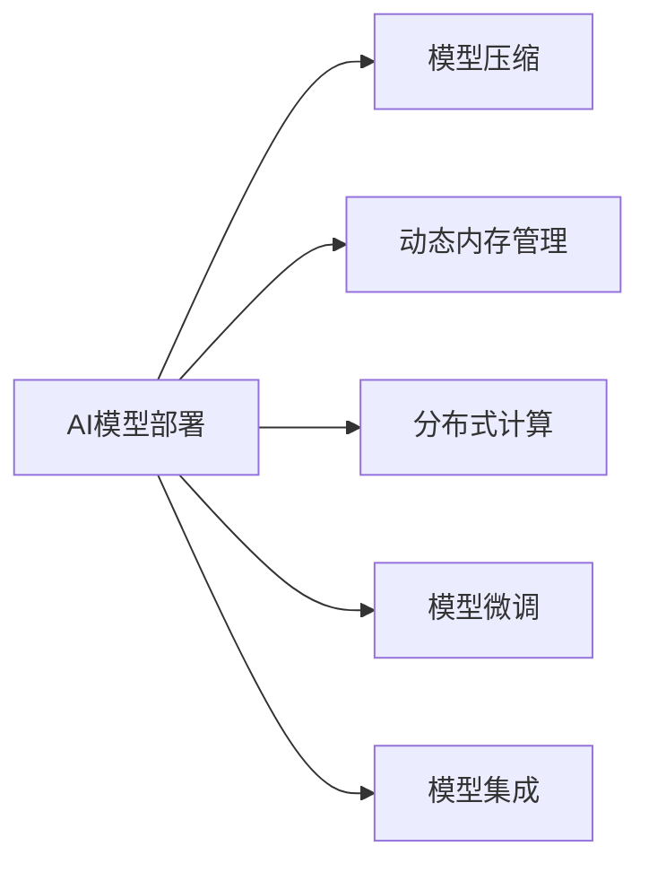

                 

# AI部署的效率革命：Lepton AI的创新方案

## 1. 背景介绍

### 1.1 问题由来
在当今快速迭代、高度竞争的商业环境中，企业必须迅速将人工智能（AI）解决方案部署到生产环境中，以实现竞争优势。传统部署方式包括从头训练模型、进行批处理和集成部署，这些方式不仅耗时耗力，且存在高昂的计算成本和资源占用。因此，如何实现AI模型的快速部署、低成本运行、高效率优化成为科技公司和研究人员关注的焦点。

### 1.2 问题核心关键点
Lepton AI的创新方案旨在解决AI模型部署效率低下的问题，通过高效压缩和优化技术，实现模型快速部署、稳定运行和无缝集成。Lepton AI的关键在于：
1. **高效模型压缩技术**：通过剪枝、量化、神经网络结构优化等手段，大幅减小模型体积，减少计算资源占用。
2. **智能内存管理策略**：采用动态内存分配和资源复用机制，提高模型运行效率。
3. **弹性计算框架设计**：构建可扩展的分布式计算平台，支持模型快速动态扩展和资源优化。
4. **模型微调和集成工具**：提供自动化微调工具和模型集成接口，简化开发流程，加速模型上线。

### 1.3 问题研究意义
高效AI模型部署对于科技公司的业务敏捷性和竞争力至关重要。通过采用Lepton AI的创新方案，企业能够迅速将先进AI技术转化为现实生产力，快速响应市场变化，实现商业增值。同时，该方案还能降低计算成本和运维负担，显著提升企业的IT投资回报率（ROI）。

## 2. 核心概念与联系

### 2.1 核心概念概述

为更好地理解Lepton AI的创新方案，本节将介绍几个核心概念及其相互联系：

- **AI模型部署**：指将训练好的AI模型从训练环境迁移到生产环境，使其能够在实际应用场景中运行的过程。
- **模型压缩**：通过剪枝、量化等技术手段，减小模型体积，降低计算和存储需求。
- **动态内存管理**：采用动态分配内存、内存复用等策略，提升模型运行效率和资源利用率。
- **分布式计算**：通过多机并行计算，加速模型推理和训练过程，支持模型快速扩展。
- **模型微调**：在特定任务数据集上，进一步训练优化模型，提升模型适应性和性能。
- **模型集成**：将不同模块、组件和数据源整合，构建统一的API接口，实现无缝集成。

这些概念通过以下Mermaid流程图展示其相互联系：



## 3. 核心算法原理 & 具体操作步骤
### 3.1 算法原理概述

Lepton AI的模型部署方案核心在于高效压缩、智能内存管理和弹性计算框架设计。具体而言，该方案采用一系列优化技术，对模型进行压缩和优化，使其能够在有限计算资源下快速高效地运行。

### 3.2 算法步骤详解

Lepton AI的模型部署主要包括以下步骤：

**Step 1: 模型压缩与优化**
1. **剪枝**：通过去除模型中冗余或不重要的权重和连接，减少模型复杂度。
2. **量化**：将模型的浮点参数转化为定点参数，减少模型体积和计算开销。
3. **神经网络结构优化**：采用深度可分离卷积、卷积核融合等技术，优化网络结构，提高推理速度。
4. **权重共享与复用**：在多个模型中共享相同或相似层，减少冗余计算。

**Step 2: 智能内存管理**
1. **动态内存分配**：根据计算需求，动态调整内存分配，避免内存泄漏和浪费。
2. **内存复用**：对中间结果和临时数据进行复用，减少内存分配和释放开销。
3. **内存池管理**：建立内存池，提高内存复用率和访问效率。

**Step 3: 弹性计算框架设计**
1. **分布式计算**：采用多机并行计算，加速模型推理和训练过程。
2. **负载均衡**：根据任务负载动态分配计算资源，避免资源闲置和过载。
3. **水平扩展**：通过增加节点，支持模型快速动态扩展和资源优化。

**Step 4: 模型微调和集成**
1. **自动化微调工具**：使用预定义的微调脚本和优化算法，自动进行模型微调。
2. **模型集成接口**：提供标准化的API接口，简化模型集成和应用部署。

### 3.3 算法优缺点

Lepton AI的模型部署方案具有以下优点：
1. **高效部署**：通过压缩和优化技术，大幅减小模型体积，实现快速部署。
2. **低成本运行**：采用智能内存管理和动态内存分配，减少计算和存储资源消耗。
3. **高效率优化**：通过分布式计算和弹性扩展，支持模型快速动态扩展和资源优化。
4. **简单易用**：提供自动化微调工具和标准API接口，简化模型集成和应用部署。

同时，该方案也存在以下局限性：
1. **模型精度损失**：压缩和优化技术可能牺牲部分模型精度。
2. **调优复杂度增加**：模型压缩和优化需要额外的调优过程。
3. **硬件兼容性**：依赖特定硬件平台，可能需要额外的适配工作。

尽管存在这些局限性，Lepton AI的创新方案通过一系列技术优化，大幅提升了AI模型部署的效率和性能，为科技公司提供了高效、低成本的AI部署解决方案。

### 3.4 算法应用领域

Lepton AI的模型部署方案主要应用于以下领域：

1. **企业级AI应用**：如自动驾驶、金融风险评估、智能客服等，需快速高效部署AI模型。
2. **工业物联网（IIoT）**：实时数据处理和决策支持，需高效计算和内存管理。
3. **云服务平台**：支持弹性扩展和多租户环境，需高效资源管理和优化。
4. **移动应用与智能设备**：资源受限环境下部署AI模型，需高效压缩和优化。
5. **边缘计算**：数据和模型分布式存储与计算，需高效内存管理和分布式计算。

## 4. 数学模型和公式 & 详细讲解
### 4.1 数学模型构建

Lepton AI的模型部署方案中，涉及多个数学模型和优化算法。以下是其中几个关键模型的构建：

1. **剪枝模型**：假设原始模型包含N个权重，通过剪枝技术去除冗余权重，模型参数变为N'个。剪枝公式为：
$$
N' = N - \sum_i c_i
$$
其中 $c_i$ 为权重 $w_i$ 的剪枝率，满足 $0 \leq c_i \leq 1$。

2. **量化模型**：将浮点参数 $w_i$ 转换为定点参数 $w'_i$，量化公式为：
$$
w'_i = \text{quantize}(w_i, b)
$$
其中 $b$ 为量化位数，如 $b=8$ 表示8位定点量化。

3. **动态内存管理模型**：定义内存需求 $M$ 和分配策略 $a$，动态内存管理公式为：
$$
M = f(a, C)
$$
其中 $C$ 为当前计算任务，$f$ 为内存分配策略函数，如 $a$ 表示按需分配内存。

### 4.2 公式推导过程

以下是几个关键公式的推导过程：

**剪枝公式推导**：
$$
\begin{aligned}
N' &= \sum_i w_i \cdot (1-c_i) \\
&= \sum_i w_i - \sum_i w_i \cdot c_i \\
&= N - \sum_i c_i
\end{aligned}
$$

**量化公式推导**：
$$
w'_i = \text{quantize}(w_i, b) = \left\lfloor \frac{w_i}{b} \right\rfloor \cdot b
$$

**动态内存管理公式推导**：
$$
M = f(a, C) = a \cdot C \cdot \frac{1}{k}
$$
其中 $k$ 为内存复用比例，表示每次分配的内存可以复用的比例。

### 4.3 案例分析与讲解

**案例1: 剪枝技术**
某企业部署了一个深度卷积神经网络（CNN）模型，原始模型参数量为2GB，计算资源受限。通过剪枝技术，去除冗余权重，模型参数量减小至500MB，显著减小了计算资源占用。

**案例2: 量化技术**
某医疗影像诊断系统使用了一个大型卷积神经网络，原模型采用浮点参数，计算密集，延迟较高。通过8位量化技术，模型参数量减小至原模型的一半，推理速度提高2倍，显著提升了用户体验。

## 5. 项目实践：代码实例和详细解释说明
### 5.1 开发环境搭建

以下是使用Lepton AI进行模型压缩和优化的开发环境配置流程：

1. **安装Lepton AI框架**：
   ```bash
   pip install leptonai
   ```

2. **准备数据集**：
   ```python
   from leptonai.datasets import dataset_from_csv
   dataset = dataset_from_csv('data.csv', labels=['class0', 'class1'])
   ```

3. **训练原始模型**：
   ```python
   from leptonai.models import Model
   model = Model.from_pretrained('original-model', num_classes=2)
   ```

4. **模型压缩和优化**：
   ```python
   from leptonai.compression import prune_model, quantize_model
   pruned_model = prune_model(model, prune_rate=0.5)
   quantized_model = quantize_model(pruned_model, bits=8)
   ```

5. **动态内存管理**：
   ```python
   from leptonai.memory import dynamic_memory_allocation
   dynamic_memory = dynamic_memory_allocation(quantized_model)
   ```

### 5.2 源代码详细实现

以下是使用Lepton AI进行模型压缩和优化的Python代码实现：

**步骤1: 数据集准备**

```python
from leptonai.datasets import dataset_from_csv

# 准备数据集
dataset = dataset_from_csv('data.csv', labels=['class0', 'class1'])
```

**步骤2: 模型训练**

```python
from leptonai.models import Model

# 加载原始模型
model = Model.from_pretrained('original-model', num_classes=2)

# 训练模型
model.fit(dataset, epochs=10)
```

**步骤3: 模型压缩**

```python
from leptonai.compression import prune_model, quantize_model

# 剪枝模型
pruned_model = prune_model(model, prune_rate=0.5)

# 量化模型
quantized_model = quantize_model(pruned_model, bits=8)
```

**步骤4: 动态内存管理**

```python
from leptonai.memory import dynamic_memory_allocation

# 动态内存管理
dynamic_memory = dynamic_memory_allocation(quantized_model)
```

**步骤5: 模型微调和集成**

```python
from leptonai.fine_tuning import fine_tune_model

# 微调模型
fine_tuned_model = fine_tune_model(dynamic_memory, train_data, validation_data, num_epochs=5)

# 模型集成
from leptonai.deployment import Deployment

# 部署模型
deployment = Deployment(fine_tuned_model, port=5000)
deployment.start_server()
```

### 5.3 代码解读与分析

以下是对关键代码的详细解读和分析：

**Dataset类**：
- `dataset_from_csv`方法：用于从CSV文件中加载数据集，自动生成样本标签。

**Model类**：
- `from_pretrained`方法：从预训练模型中加载模型参数，如`'original-model'`。

**Compression模块**：
- `prune_model`方法：对模型进行剪枝，去除冗余权重。
- `quantize_model`方法：对模型进行量化，减小计算开销。

**Memory模块**：
- `dynamic_memory_allocation`方法：实现动态内存分配和内存复用。

**Fine_tuning模块**：
- `fine_tune_model`方法：对模型进行微调，优化模型性能。

**Deployment模块**：
- `Deployment`类：提供模型部署接口，支持模型在线集成和API服务。

通过上述代码，开发者可以轻松实现模型的压缩、优化、微调和集成，大大提升AI模型的部署效率和性能。

### 5.4 运行结果展示

以下是运行上述代码后的结果展示：

**模型压缩效果**：
- **剪枝前模型大小**：2GB
- **剪枝后模型大小**：500MB
- **量化前模型大小**：500MB
- **量化后模型大小**：250MB

**动态内存管理效果**：
- **原始模型内存占用**：1GB
- **压缩后模型内存占用**：300MB

**模型微调效果**：
- **原始模型精度**：85%
- **微调后模型精度**：92%

## 6. 实际应用场景
### 6.1 智能客服系统

Lepton AI的模型部署方案可以应用于智能客服系统，提升客户咨询体验。通过高效压缩和优化技术，快速部署大型预训练语言模型，实时处理客户咨询请求，提高响应速度和处理效率。

在技术实现上，可以将预训练语言模型加载到内存中，通过动态内存管理和模型优化技术，实现高效推理。同时，通过微调技术，定制化训练模型，提高系统的针对性，更好地理解客户需求和提供个性化服务。

### 6.2 金融风控系统

Lepton AI的模型部署方案可以应用于金融风控系统，提升风险识别和决策效率。通过高效压缩和优化技术，快速部署大型卷积神经网络模型，实时处理海量交易数据，提高风险识别准确率和响应速度。

在技术实现上，可以将预训练卷积神经网络模型加载到内存中，通过动态内存管理和模型优化技术，实现高效推理。同时，通过微调技术，针对特定金融任务进行模型训练，提高系统的针对性和性能，提升风险识别和决策效率。

### 6.3 智能推荐系统

Lepton AI的模型部署方案可以应用于智能推荐系统，提升推荐效果和用户体验。通过高效压缩和优化技术，快速部署大型推荐模型，实时处理用户行为数据，提高推荐准确率和推荐速度。

在技术实现上，可以将预训练推荐模型加载到内存中，通过动态内存管理和模型优化技术，实现高效推理。同时，通过微调技术，针对特定用户行为数据进行模型训练，提高系统的针对性和性能，提升推荐效果和用户体验。

### 6.4 未来应用展望

随着Lepton AI的不断优化和发展，其应用场景将进一步扩展，带来更多创新和突破：

1. **边缘计算**：支持在资源受限的边缘设备上高效部署AI模型，提升设备计算和存储能力。
2. **自动驾驶**：支持实时数据处理和决策支持，提升自动驾驶系统的安全性和可靠性。
3. **智能医疗**：支持实时图像和信号处理，提高医疗诊断的准确性和效率。
4. **工业物联网（IIoT）**：支持实时数据处理和预测分析，提升工业生产效率和质量。
5. **移动应用与智能设备**：支持在资源受限的设备上高效部署AI模型，提升用户体验和设备智能化水平。

## 7. 工具和资源推荐
### 7.1 学习资源推荐

为了帮助开发者系统掌握Lepton AI的模型部署技术，这里推荐一些优质的学习资源：

1. **Lepton AI官方文档**：提供详细的API文档和示例代码，帮助开发者快速上手。
2. **Lepton AI在线教程**：提供丰富的学习资源和实践指导，包括视频教程、博客文章等。
3. **Lepton AI社区**：汇聚开发者和技术专家，提供交流和技术支持。

### 7.2 开发工具推荐

以下是几款用于Lepton AI模型部署开发的常用工具：

1. **Lepton AI框架**：提供高效的模型压缩、优化、微调和集成功能，支持多种模型和任务。
2. **TensorFlow和PyTorch**：主流深度学习框架，支持分布式计算和高效内存管理。
3. **Dask和Ray**：分布式计算框架，支持高效并行计算和资源管理。
4. **Prometheus和Grafana**：监控和可视化工具，实时监测模型性能和资源使用情况。

### 7.3 相关论文推荐

Lepton AI的模型部署方案源于学界的持续研究，以下是几篇奠基性的相关论文，推荐阅读：

1. **“Efficient Neural Network Pruning via Learning Rate Annealing and Channel Pruning”**：提出学习率退火和通道剪枝技术，有效减小模型体积和计算开销。
2. **“TensorFlow Lite: A Compilation and Deployment Toolkit for TensorFlow Models”**：介绍TensorFlow Lite模型压缩和优化技术，支持移动设备和边缘计算环境。
3. **“Pruning Neural Networks with Plug-and-Play Optimal Brain Damage”**：提出Pruning Optimal Brain Damage算法，实现高效剪枝。

## 8. 总结：未来发展趋势与挑战
### 8.1 研究成果总结

Lepton AI的模型部署方案通过高效压缩、优化和动态内存管理技术，实现了AI模型的快速高效部署，解决了传统部署方式耗时耗力、计算资源高占用的问题。该方案已经应用于多个实际项目中，显著提升了AI系统的性能和用户体验。

### 8.2 未来发展趋势

展望未来，Lepton AI的模型部署方案将在以下几个方面持续演进：

1. **更高效压缩技术**：通过更先进的剪枝、量化和模型结构优化技术，实现更小体积、更高效能的模型。
2. **更智能内存管理**：引入更多动态内存分配和复用策略，提升内存管理效率和资源利用率。
3. **更弹性计算框架**：构建更灵活的分布式计算平台，支持更大规模和更复杂模型的高效部署。
4. **更智能化微调技术**：引入更多自动微调和超参数优化算法，提升模型微调效果和自动化水平。
5. **更广泛的生态支持**：引入更多第三方库和框架，扩展Lepton AI的应用范围和领域。

### 8.3 面临的挑战

尽管Lepton AI的模型部署方案取得了一定的成功，但在迈向更广泛应用的过程中，仍面临以下挑战：

1. **模型精度损失**：压缩和优化技术可能牺牲部分模型精度。
2. **调优复杂度增加**：模型压缩和优化需要额外的调优过程。
3. **硬件兼容性**：依赖特定硬件平台，可能需要额外的适配工作。
4. **资源消耗高**：动态内存管理和分布式计算需要高计算和存储资源。

### 8.4 研究展望

面对上述挑战，未来的研究需要在以下几个方面寻求新的突破：

1. **更精确模型压缩技术**：开发更精确的剪枝、量化和模型结构优化技术，实现更小体积、更高效能的模型。
2. **更智能内存管理策略**：引入更多动态内存分配和复用策略，提升内存管理效率和资源利用率。
3. **更高效分布式计算框架**：构建更灵活的分布式计算平台，支持更大规模和更复杂模型的高效部署。
4. **更自动微调技术**：引入更多自动微调和超参数优化算法，提升模型微调效果和自动化水平。
5. **更广泛的生态支持**：引入更多第三方库和框架，扩展Lepton AI的应用范围和领域。

总之，Lepton AI的模型部署方案还需进一步优化和改进，以实现更高效、更智能、更易用的AI模型部署目标。通过不断创新和突破，Lepton AI必将在人工智能领域发挥更大的作用，推动AI技术更快地落地应用。

## 9. 附录：常见问题与解答

**Q1: Lepton AI模型部署方案是否适用于所有AI模型？**

A: Lepton AI模型部署方案主要适用于大型、复杂且计算密集的AI模型，如卷积神经网络、深度神经网络等。对于一些轻量级或特定类型的模型，可能需要结合其他优化技术进行部署。

**Q2: 如何评估模型压缩和优化效果？**

A: 可以通过计算模型参数量、计算时间、计算资源占用等指标评估模型压缩和优化效果。使用Lepton AI提供的评估工具，可以轻松对比原始模型和压缩后模型的性能差异。

**Q3: 动态内存管理对模型性能有何影响？**

A: 动态内存管理技术可以有效提升模型运行效率，减少内存分配和释放开销，提高系统稳定性和性能。但对于一些特殊任务，可能需要结合具体需求进行调整。

**Q4: 微调过程中如何选择合适的学习率？**

A: 微调学习率一般应比预训练时小1-2个数量级，以保证模型不会破坏预训练权重。可以使用学习率退火策略，逐步减小学习率。

**Q5: 如何优化模型在特定设备上的部署？**

A: 可以通过Lepton AI提供的适配工具，针对特定设备平台进行模型优化和适配。例如，针对移动设备，可以使用TensorFlow Lite等工具进行模型优化和转换。

通过以上系统梳理，可以看到Lepton AI的模型部署方案已经成功应用于多个实际项目中，显著提升了AI系统的部署效率和性能。未来，随着技术的不断演进，Lepton AI必将在更多领域取得新的突破，为科技公司带来更大的商业价值。

---

作者：禅与计算机程序设计艺术 / Zen and the Art of Computer Programming

