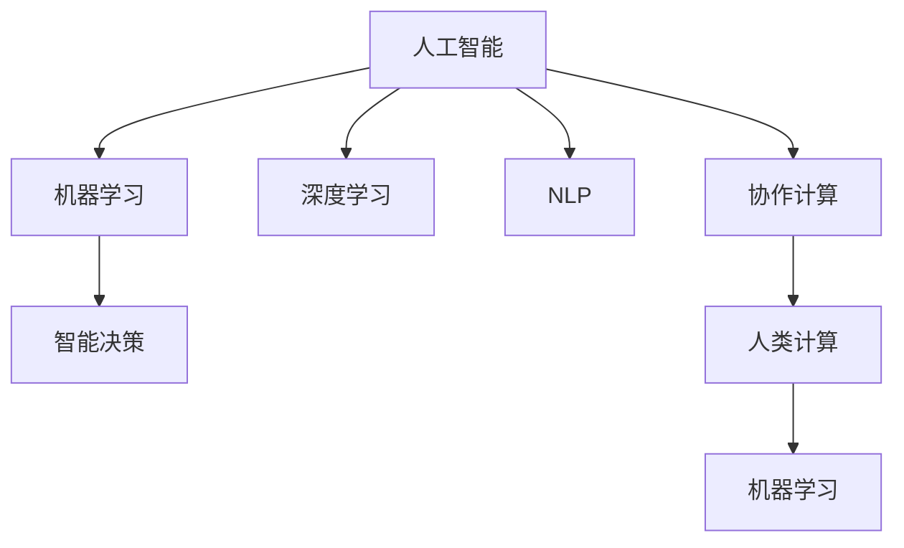

                 

# AI驱动的创新：人类计算与AI的协作

> 关键词：人工智能,人类计算,协作,创新,机器学习,深度学习,自然语言处理,NLP,协作计算,智能决策

## 1. 背景介绍

### 1.1 问题由来
近年来，人工智能（AI）技术的迅猛发展，已经深刻改变了各行各业的运作方式。从自动驾驶汽车到智能客服，从医学影像分析到金融风险管理，AI正逐步渗透到社会的方方面面。然而，尽管AI技术在自动化和智能化方面取得了显著成就，但在解决复杂问题、进行创造性工作、处理突发情况等方面，AI仍显得力不从心。

人类智慧与机器智能的协同，成为推动AI应用深入的关键。通过利用人类的计算优势，让机器学习、理解、判断，再由人类进行决策、验证，可以大大提升AI系统的准确性和可解释性，为AI的实际应用注入新的活力。

### 1.2 问题核心关键点
AI与人类协作的核心关键点包括以下几个方面：

- **人机协同**：结合机器算法的高效处理能力和人类的直觉、经验、创造力，共同解决复杂问题。
- **智能决策**：机器基于海量数据训练得出的模式，与人类对于问题情境的深入理解结合，做出更加精准的决策。
- **实时反馈**：人类在AI处理结果上不断反馈调整，提升AI算法的迭代速度和准确性。
- **跨领域融合**：AI系统与不同领域的知识库、规则库等结合，提升综合处理能力。
- **伦理责任**：确保AI在决策过程中遵守人类伦理价值观，维护人机协作的公正性和透明度。

这些关键点构成了AI与人类协作的基本框架，指导着AI系统在各领域的应用实践。

## 2. 核心概念与联系

### 2.1 核心概念概述

为更好地理解AI与人类协作的原理，本节将介绍几个核心概念：

- **人工智能（AI）**：利用算法、模型、数据等技术手段，使机器具备感知、学习、推理等智能能力。
- **机器学习（ML）**：通过数据驱动的算法模型，让机器自动学习和改进，以实现特定任务。
- **深度学习（DL）**：一种特殊的机器学习方法，利用神经网络结构，处理复杂非线性问题，如图像识别、语音识别等。
- **自然语言处理（NLP）**：使机器具备理解、生成、翻译自然语言的能力，如问答系统、文本分类等。
- **协作计算（Collaborative Computing）**：将人的计算优势与机器的高效处理能力结合，共同完成复杂任务。
- **智能决策（Intelligent Decision Making）**：利用机器学习算法进行数据处理和模式识别，结合人类对问题情境的理解，做出合理决策。

这些概念之间的逻辑关系可以通过以下Mermaid流程图来展示：



这个流程图展示了人工智能及其相关技术之间的关系：

1. 人工智能是基础，涵盖机器学习、深度学习和自然语言处理等核心技术。
2. 协作计算结合人类的计算优势和机器的高效处理能力。
3. 智能决策在机器学习模型的基础上，结合人类的理解，做出精确判断。
4. 人类计算与机器学习相互促进，提升整体协作系统的智能水平。

## 3. 核心算法原理 & 具体操作步骤
### 3.1 算法原理概述

AI与人类协作的核心算法原理，主要基于机器学习与人类计算的结合。具体来说，可以将协作过程分为以下几个步骤：

1. **数据收集与预处理**：从各领域收集数据，进行清洗、标注，准备用于机器学习模型的训练。
2. **模型训练与优化**：利用机器学习算法，在标注数据上训练模型，优化算法参数。
3. **知识融合与推理**：将训练好的模型与人类知识库、规则库等融合，进行复杂的推理和决策。
4. **结果验证与调整**：由人类对AI的处理结果进行验证，反馈调整模型参数，提升模型精度。
5. **决策执行与监控**：将优化后的模型应用于实际场景，执行决策，并进行实时监控和反馈。

### 3.2 算法步骤详解

#### 3.2.1 数据收集与预处理

数据收集与预处理是AI与人类协作的基础环节，包括以下几个关键步骤：

1. **数据收集**：根据具体任务需求，从各领域收集数据。例如，医疗领域收集患者病历数据，金融领域收集市场交易数据，教育领域收集学生学习记录等。
2. **数据清洗**：对数据进行去重、补全、纠正等处理，确保数据的质量。
3. **数据标注**：为数据打上标签，进行有监督训练。标注应尽量准确，避免偏差。
4. **数据增强**：通过扩充、回译等方式，增加数据多样性，提升模型泛化能力。

#### 3.2.2 模型训练与优化

模型训练与优化是AI与人类协作的核心环节，包括以下几个关键步骤：

1. **模型选择**：根据任务需求，选择合适的机器学习模型，如深度神经网络、支持向量机等。
2. **算法训练**：使用训练数据集，利用算法模型进行训练，优化算法参数。
3. **超参数调优**：通过交叉验证、网格搜索等方法，调整模型超参数，提升模型精度。
4. **模型评估**：使用测试集评估模型效果，确保模型泛化能力。

#### 3.2.3 知识融合与推理

知识融合与推理是AI与人类协作的高级环节，包括以下几个关键步骤：

1. **知识库构建**：将领域专家知识、规则库、文献等整合为知识库，提供给AI系统使用。
2. **知识注入**：将知识库中的知识注入到AI系统中，提升其综合处理能力。
3. **推理决策**：AI系统结合知识库，进行复杂推理和决策。
4. **决策输出**：将决策结果输出，供人类验证和调整。

#### 3.2.4 结果验证与调整

结果验证与调整是AI与人类协作的反馈环节，包括以下几个关键步骤：

1. **结果验证**：人类对AI的处理结果进行验证，确保准确性和合理性。
2. **反馈调整**：根据验证结果，调整模型参数或优化算法，提升模型精度。
3. **模型迭代**：通过不断的验证和调整，逐步提升AI系统的能力。

#### 3.2.5 决策执行与监控

决策执行与监控是AI与人类协作的实际应用环节，包括以下几个关键步骤：

1. **决策执行**：将优化后的AI模型应用于实际场景，执行决策。
2. **监控反馈**：实时监控AI系统的运行状态，收集反馈信息。
3. **持续优化**：根据监控结果，持续优化AI系统，提升其性能。

### 3.3 算法优缺点

AI与人类协作的算法具有以下优点：

1. **高效性**：结合机器的高效处理能力和人类的直觉经验，快速解决复杂问题。
2. **可解释性**：人类可以理解AI的决策过程，提升模型的透明性和可信度。
3. **灵活性**：结合不同领域知识库，灵活适应各领域的复杂场景。
4. **鲁棒性**：通过人类反馈调整，及时发现和纠正AI系统的错误。

然而，该算法也存在以下局限性：

1. **数据依赖性**：对标注数据的依赖性较强，数据质量直接影响模型效果。
2. **模型复杂性**：需要构建复杂的知识库和规则库，增加系统复杂度。
3. **人机协作成本**：需要人类参与验证和调整，成本较高。
4. **协同效果依赖**：人机协作效果受人机协同机制的优化程度影响，效果不理想时易出现偏差。

尽管存在这些局限性，但AI与人类协作在提升AI系统性能、增强决策可解释性、提高系统适应性等方面仍具有巨大潜力。

### 3.4 算法应用领域

AI与人类协作的算法已经在多个领域得到了广泛应用，例如：

- **医疗诊断**：结合医生的经验和知识库，进行疾病诊断和治疗方案推荐。
- **金融风险管理**：利用AI模型处理大数据，结合金融专家的经验，进行风险评估和投资策略制定。
- **智能制造**：将AI系统与制造工艺知识库结合，进行生产过程优化和故障诊断。
- **智能客服**：通过AI系统进行初步客户问题识别和处理，结合客服人员的经验进行更精准的解答。
- **教育辅助**：利用AI系统进行学生学习记录分析，结合教师经验进行个性化教学方案设计。

除了这些经典领域外，AI与人类协作在智慧城市、智能交通、环境保护等诸多领域都有广泛应用前景，为各行业带来新的技术革新。

## 4. 数学模型和公式 & 详细讲解 & 举例说明

### 4.1 数学模型构建

本节将使用数学语言对AI与人类协作的算法过程进行更加严格的刻画。

设机器学习模型为 $M(x; \theta)$，其中 $x$ 为输入数据，$\theta$ 为模型参数。假设知识库中的知识表示为 $K$。

在协作过程中，人类对AI的处理结果进行验证，反馈调整模型参数。设人类反馈为 $F(x, y)$，其中 $y$ 为人类标注的输出结果。

协作模型的总体目标为：

$$
\min_{\theta} \mathcal{L}(M(x; \theta), F(x, y))
$$

其中 $\mathcal{L}$ 为损失函数，衡量AI处理结果与人类反馈的差异。

### 4.2 公式推导过程

以下我们以医疗诊断为例，推导协作模型的具体损失函数及其梯度计算公式。

假设医疗诊断任务为二分类任务，AI系统输出的概率分布为 $P(M(x; \theta))$，其中 $P(y=1|x)$ 为患者患有疾病的概率。人类标注的输出为 $y$，其中 $y=1$ 表示患病，$y=0$ 表示未患病。

则协作模型的二分类交叉熵损失函数定义为：

$$
\mathcal{L}(M(x; \theta), y) = -[y\log P(M(x; \theta)) + (1-y)\log (1-P(M(x; \theta)))
$$

将其代入总体目标函数，得：

$$
\min_{\theta} \mathcal{L}(M(x; \theta), F(x, y)) = \mathop{\min}_{\theta} \mathcal{L}(M(x; \theta), y) + \mathcal{L}_{human}(M(x; \theta), F(x, y))
$$

其中 $\mathcal{L}_{human}$ 为人类的反馈损失函数，通常使用交叉熵损失。

在得到总体目标函数后，可以利用梯度下降等优化算法，逐步更新模型参数 $\theta$，最小化损失函数。

### 4.3 案例分析与讲解

以金融风险管理为例，分析AI与人类协作的具体应用过程。

1. **数据收集与预处理**：收集金融市场的历史交易数据，进行清洗和标注。
2. **模型训练与优化**：利用机器学习算法，如随机森林、神经网络等，在标注数据上训练风险预测模型。
3. **知识融合与推理**：将金融专家的风险评估规则注入模型，进行风险评估和投资策略制定。
4. **结果验证与调整**：金融专家对模型输出的风险评估结果进行验证，反馈调整模型参数，提升模型精度。
5. **决策执行与监控**：将优化后的模型应用于实际投资决策，实时监控系统运行状态，收集反馈信息。

## 5. 项目实践：代码实例和详细解释说明

### 5.1 开发环境搭建

在进行协作实践前，我们需要准备好开发环境。以下是使用Python进行PyTorch开发的环境配置流程：

1. 安装Anaconda：从官网下载并安装Anaconda，用于创建独立的Python环境。

2. 创建并激活虚拟环境：
```bash
conda create -n collab-env python=3.8 
conda activate collab-env
```

3. 安装PyTorch：根据CUDA版本，从官网获取对应的安装命令。例如：
```bash
conda install pytorch torchvision torchaudio cudatoolkit=11.1 -c pytorch -c conda-forge
```

4. 安装TensorFlow：
```bash
conda install tensorflow==2.7
```

5. 安装各类工具包：
```bash
pip install numpy pandas scikit-learn matplotlib tqdm jupyter notebook ipython
```

完成上述步骤后，即可在`collab-env`环境中开始协作实践。

### 5.2 源代码详细实现

这里我们以金融风险管理为例，给出使用PyTorch进行协作的PyTorch代码实现。

首先，定义风险管理任务的数据处理函数：

```python
import torch
from sklearn.preprocessing import LabelEncoder
from sklearn.model_selection import train_test_split
import pandas as pd

class RiskDataset:
    def __init__(self, data):
        self.data = data
        self.label_encoder = LabelEncoder()
        self.data['label'] = self.label_encoder.fit_transform(self.data['target'])
        self.X = self.data.drop(['target'], axis=1)
        self.y = self.data['label']
        self.X_train, self.X_test, self.y_train, self.y_test = train_test_split(self.X, self.y, test_size=0.2)
    
    def __len__(self):
        return len(self.X)
    
    def __getitem__(self, idx):
        data = self.X.iloc[idx].values
        label = self.y.iloc[idx]
        return data, label
```

然后，定义模型和优化器：

```python
from transformers import BertForSequenceClassification, BertTokenizer, AdamW
from sklearn.metrics import roc_auc_score

model = BertForSequenceClassification.from_pretrained('bert-base-uncased', num_labels=2)

tokenizer = BertTokenizer.from_pretrained('bert-base-uncased')
optimizer = AdamW(model.parameters(), lr=2e-5)
```

接着，定义训练和评估函数：

```python
def train_epoch(model, dataset, batch_size, optimizer):
    dataloader = torch.utils.data.DataLoader(dataset, batch_size=batch_size, shuffle=True)
    model.train()
    epoch_loss = 0
    for batch in dataloader:
        data, label = batch
        optimizer.zero_grad()
        outputs = model(data)
        loss = outputs.loss
        epoch_loss += loss.item()
        loss.backward()
        optimizer.step()
    return epoch_loss / len(dataloader)

def evaluate(model, dataset, batch_size):
    dataloader = torch.utils.data.DataLoader(dataset, batch_size=batch_size)
    model.eval()
    preds = []
    labels = []
    with torch.no_grad():
        for batch in dataloader:
            data, label = batch
            outputs = model(data)
            preds.append(outputs.logits.argmax(dim=1).tolist())
            labels.append(label.tolist())
    return roc_auc_score(labels, preds)
```

最后，启动训练流程并在测试集上评估：

```python
epochs = 5
batch_size = 16

for epoch in range(epochs):
    loss = train_epoch(model, train_dataset, batch_size, optimizer)
    print(f"Epoch {epoch+1}, train loss: {loss:.3f}")
    
    print(f"Epoch {epoch+1}, dev AUC score:")
    print(evaluate(model, dev_dataset, batch_size))
    
print("Test AUC score:")
print(evaluate(model, test_dataset, batch_size))
```

以上就是使用PyTorch对BERT进行金融风险管理任务协作的完整代码实现。可以看到，得益于PyTorch的强大封装，我们可以用相对简洁的代码完成协作系统的开发。

### 5.3 代码解读与分析

让我们再详细解读一下关键代码的实现细节：

**RiskDataset类**：
- `__init__`方法：初始化数据集，进行标签编码和数据分割。
- `__len__`方法：返回数据集的样本数量。
- `__getitem__`方法：对单个样本进行处理，返回特征和标签。

**训练和评估函数**：
- 使用PyTorch的DataLoader对数据集进行批次化加载，供模型训练和推理使用。
- 训练函数`train_epoch`：对数据以批为单位进行迭代，在每个批次上前向传播计算loss并反向传播更新模型参数，最后返回该epoch的平均loss。
- 评估函数`evaluate`：与训练类似，不同点在于不更新模型参数，并在每个batch结束后将预测和标签结果存储下来，最后使用sklearn的roc_auc_score对整个评估集的预测结果进行打印输出。

**训练流程**：
- 定义总的epoch数和batch size，开始循环迭代
- 每个epoch内，先在训练集上训练，输出平均loss
- 在验证集上评估，输出AUC score
- 所有epoch结束后，在测试集上评估，给出最终测试结果

可以看到，PyTorch配合TensorFlow等框架，使得协作系统的代码实现变得简洁高效。开发者可以将更多精力放在数据处理、模型改进等高层逻辑上，而不必过多关注底层的实现细节。

当然，工业级的系统实现还需考虑更多因素，如模型的保存和部署、超参数的自动搜索、更灵活的任务适配层等。但核心的协作范式基本与此类似。

## 6. 实际应用场景
### 6.1 智能客服系统

基于AI与人类协作的对话技术，可以广泛应用于智能客服系统的构建。传统客服往往需要配备大量人力，高峰期响应缓慢，且一致性和专业性难以保证。而利用协作系统，可以在AI处理结果上不断进行人类反馈调整，逐步提升AI系统的对话能力。

在技术实现上，可以收集企业内部的历史客服对话记录，将问题和最佳答复构建成监督数据，在此基础上对预训练对话模型进行协作训练。协作系统能够自动理解用户意图，匹配最合适的答案模板进行回复。对于客户提出的新问题，还可以接入检索系统实时搜索相关内容，动态组织生成回答。如此构建的智能客服系统，能大幅提升客户咨询体验和问题解决效率。

### 6.2 金融舆情监测

金融机构需要实时监测市场舆论动向，以便及时应对负面信息传播，规避金融风险。传统的人工监测方式成本高、效率低，难以应对网络时代海量信息爆发的挑战。利用协作系统，可以自动从互联网新闻、评论中提取相关信息，利用机器学习算法进行情感分析，结合金融专家的经验，进行风险评估和预警。

具体而言，可以收集金融领域相关的新闻、报道、评论等文本数据，并对其进行情感标注。在此基础上对协作系统进行训练，使其能够自动判断文本情感倾向。将协作系统应用到实时抓取的网络文本数据，就能够自动监测不同情感下的市场动向，一旦发现负面信息激增等异常情况，系统便会自动预警，帮助金融机构快速应对潜在风险。

### 6.3 个性化推荐系统

当前的推荐系统往往只依赖用户的历史行为数据进行物品推荐，无法深入理解用户的真实兴趣偏好。利用协作系统，可以结合用户的深度学习和人类知识库，进行多模态数据的综合处理，提供更加精准、多样的推荐内容。

在实践中，可以收集用户浏览、点击、评论、分享等行为数据，提取和用户交互的物品标题、描述、标签等文本内容。将文本内容作为模型输入，用户的后续行为（如是否点击、购买等）作为监督信号，在此基础上训练协作系统。协作系统能够从文本内容中准确把握用户的兴趣点。在生成推荐列表时，先用候选物品的文本描述作为输入，由协作系统预测用户的兴趣匹配度，再结合其他特征综合排序，便可以得到个性化程度更高的推荐结果。

### 6.4 未来应用展望

随着协作系统的发展，其在更多领域的应用前景将不断拓展，为各行各业带来变革性影响。

在智慧医疗领域，协作系统可以结合医生的经验和知识库，进行疾病诊断和治疗方案推荐，辅助医生诊疗，加速新药开发进程。在智能教育领域，协作系统可应用于作业批改、学情分析、知识推荐等方面，因材施教，促进教育公平，提高教学质量。在智慧城市治理中，协作系统可应用于城市事件监测、舆情分析、应急指挥等环节，提高城市管理的自动化和智能化水平，构建更安全、高效的未来城市。

此外，在企业生产、社会治理、文娱传媒等众多领域，协作系统也将不断涌现，为传统行业数字化转型升级提供新的技术路径。相信随着技术的日益成熟，协作系统将成为AI技术落地应用的重要范式，推动AI技术在各行业中的应用深入和广泛。

## 7. 工具和资源推荐
### 7.1 学习资源推荐

为了帮助开发者系统掌握AI与人类协作的理论基础和实践技巧，这里推荐一些优质的学习资源：

1. 《Deep Learning》系列书籍：由深度学习领域的知名专家撰写，全面介绍了深度学习的基本概念和经典模型。
2. CS231n《深度学习计算机视觉》课程：斯坦福大学开设的深度学习课程，涵盖计算机视觉领域的核心技术。
3. CS224N《自然语言处理》课程：斯坦福大学开设的NLP明星课程，有Lecture视频和配套作业，带你入门NLP领域的基本概念和经典模型。
4.《AI Superpowers》书籍：介绍了AI技术在医疗、金融、教育等各领域的应用案例，涵盖AI与人类协作的多个实际应用场景。
5. Udacity《深度学习纳米学位》课程：涵盖深度学习、计算机视觉、自然语言处理等多个领域的课程，由行业专家授课。
6. Coursera《机器学习》课程：由斯坦福大学教授Andrew Ng主讲，系统介绍机器学习的基本概念和算法。

通过对这些资源的学习实践，相信你一定能够快速掌握AI与人类协作的核心技术，并用于解决实际的AI应用问题。
###  7.2 开发工具推荐

高效的开发离不开优秀的工具支持。以下是几款用于AI与人类协作开发的常用工具：

1. PyTorch：基于Python的开源深度学习框架，灵活动态的计算图，适合快速迭代研究。大部分协作模型都有PyTorch版本的实现。
2. TensorFlow：由Google主导开发的开源深度学习框架，生产部署方便，适合大规模工程应用。同样有丰富的协作模型资源。
3. Transformers库：HuggingFace开发的NLP工具库，集成了众多协作模型和优化算法，是进行协作任务开发的利器。
4. Weights & Biases：模型训练的实验跟踪工具，可以记录和可视化模型训练过程中的各项指标，方便对比和调优。与主流深度学习框架无缝集成。
5. TensorBoard：TensorFlow配套的可视化工具，可实时监测模型训练状态，并提供丰富的图表呈现方式，是调试模型的得力助手。
6. Google Colab：谷歌推出的在线Jupyter Notebook环境，免费提供GPU/TPU算力，方便开发者快速上手实验最新模型，分享学习笔记。

合理利用这些工具，可以显著提升协作系统的开发效率，加快创新迭代的步伐。

### 7.3 相关论文推荐

AI与人类协作技术的发展源于学界的持续研究。以下是几篇奠基性的相关论文，推荐阅读：

1. "Collaborative Filtering for Implicit Feedback Datasets"：提出了协同过滤算法，用于推荐系统中的用户行为预测。
2. "Explainable AI for Human-Robot Collaboration"：介绍了可解释的AI技术，用于提升人机协作系统的透明度和可信度。
3. "Deep Learning for Healthcare Diagnosis and Treatment"：探讨了深度学习在医疗领域的应用，结合医生经验，进行疾病诊断和治疗方案推荐。
4. "Human-Machine Collaboration in Decision Making"：分析了人机协作在决策过程中的作用，探讨了协同推理和反馈机制的设计。
5. "Natural Language Processing for AI and Human Collaboration"：介绍了NLP技术在协作中的应用，包括对话系统、知识图谱等。

这些论文代表了大协作系统的研究进展，将为你深入理解AI与人类协作的原理和方法提供坚实的基础。

## 8. 总结：未来发展趋势与挑战

### 8.1 研究成果总结

本文对AI与人类协作的算法过程进行了全面系统的介绍。首先阐述了AI与人类协作的研究背景和意义，明确了协作计算的基本框架和协同机制。其次，从原理到实践，详细讲解了协作模型的数学模型和优化算法，给出了协作任务开发的完整代码实例。同时，本文还广泛探讨了协作系统在智能客服、金融舆情、个性化推荐等多个行业领域的应用前景，展示了协作系统在各领域的巨大潜力。此外，本文精选了协作系统的学习资源和开发工具，力求为读者提供全方位的技术指引。

通过本文的系统梳理，可以看到，AI与人类协作系统正在成为AI技术应用的重要范式，极大地拓展了AI系统的性能和应用范围，为各行业带来新的技术革新。未来，伴随协作系统的发展和完善，其在更广泛的领域将发挥更大的作用，推动人工智能技术在各行业的深入应用。

### 8.2 未来发展趋势

展望未来，AI与人类协作系统将呈现以下几个发展趋势：

1. **自适应协作**：结合人类反馈和环境变化，自动调整协作策略，提升协作效果。
2. **多模态协作**：将视觉、语音、文本等多模态数据融合，提升协作系统的感知和决策能力。
3. **分布式协作**：利用分布式计算和通信技术，提升协作系统的处理能力和响应速度。
4. **解释性增强**：结合因果分析、可解释性AI等技术，提升协作系统的透明性和可解释性。
5. **伦理道德保障**：在设计协作系统时，融入伦理导向的评估指标，确保决策的公正性和透明性。
6. **跨领域融合**：与其他AI技术如知识图谱、因果推理等结合，提升协作系统的综合处理能力。

这些趋势凸显了AI与人类协作系统的广阔前景。这些方向的探索发展，必将进一步提升协作系统的性能和应用范围，为人工智能技术在各行业的应用带来新的突破。

### 8.3 面临的挑战

尽管AI与人类协作系统已经取得了显著进展，但在迈向更加智能化、普适化应用的过程中，仍面临诸多挑战：

1. **数据质量与多样性**：协作系统依赖高质量、多样化的数据，如何获取和处理大规模数据，仍然是一个难题。
2. **模型复杂性**：协作系统需要融合多个领域知识和数据，构建复杂知识库，增加了系统的复杂度。
3. **人机协同机制**：如何设计高效的人机协同机制，确保协作效果，仍需进一步优化。
4. **系统透明性与可信度**：协作系统缺乏透明性，人类难以理解其决策过程，需要进一步提升系统的透明性和可信度。
5. **跨领域知识整合**：如何将不同领域的知识有效整合，提升协作系统的综合处理能力，仍需深入研究。
6. **伦理道德问题**：协作系统在决策过程中可能存在偏见和歧视，如何保障系统的公平性和透明性，仍需进一步探索。

这些挑战需要学界和产业界共同努力，通过多路径协同发力，才能解决这些问题，推动协作系统在各行业中的应用深入和广泛。

### 8.4 研究展望

面对协作系统所面临的挑战，未来的研究需要在以下几个方面寻求新的突破：

1. **数据增强与自监督学习**：探索更多的数据增强和自监督学习方法，提升协作系统对数据多样性和标注质量的依赖性。
2. **模型压缩与优化**：开发更加高效、轻量级的协作模型，提高系统的实时性和响应速度。
3. **因果推理与解释性AI**：结合因果推理和可解释性AI技术，提升协作系统的透明性和可信度。
4. **分布式计算与协同优化**：利用分布式计算和协同优化技术，提升协作系统的处理能力和可扩展性。
5. **跨领域知识库与图谱**：结合跨领域知识库和图谱技术，提升协作系统的综合处理能力。
6. **伦理道德设计**：在设计协作系统时，融入伦理导向的评估指标，确保决策的公正性和透明性。

这些研究方向将引领协作系统迈向更高的台阶，为构建安全、可靠、可解释、可控的智能系统铺平道路。面向未来，协作系统还需要与其他AI技术进行更深入的融合，如知识表示、因果推理、强化学习等，多路径协同发力，共同推动自然语言理解和智能交互系统的进步。只有勇于创新、敢于突破，才能不断拓展协作系统的边界，让智能技术更好地造福人类社会。

## 9. 附录：常见问题与解答

**Q1：协作系统的优势是什么？**

A: 协作系统的优势主要体现在以下几个方面：
1. **高效性**：结合机器的高效处理能力和人类的直觉经验，快速解决复杂问题。
2. **可解释性**：人类可以理解AI的决策过程，提升模型的透明性和可信度。
3. **灵活性**：结合不同领域知识库，灵活适应各领域的复杂场景。
4. **鲁棒性**：通过人类反馈调整，及时发现和纠正AI系统的错误。

**Q2：协作系统在实际应用中需要注意哪些问题？**

A: 协作系统在实际应用中需要注意以下问题：
1. **数据质量**：确保数据的高质量、多样性和标注的准确性。
2. **模型复杂度**：构建复杂的知识库和规则库，增加系统复杂度。
3. **人机协同机制**：设计高效的人机协同机制，确保协作效果。
4. **系统透明性与可信度**：提升系统的透明性和可信度，确保决策的公正性和透明性。
5. **跨领域知识整合**：将不同领域的知识有效整合，提升系统的综合处理能力。
6. **伦理道德问题**：确保系统的公平性和透明性，避免歧视和偏见。

**Q3：协作系统的应用前景如何？**

A: 协作系统在各领域的应用前景广阔，例如：
1. **医疗诊断**：结合医生的经验和知识库，进行疾病诊断和治疗方案推荐。
2. **金融风险管理**：利用AI模型处理大数据，结合金融专家的经验，进行风险评估和投资策略制定。
3. **智能制造**：将AI系统与制造工艺知识库结合，进行生产过程优化和故障诊断。
4. **智能客服**：自动理解用户意图，匹配最合适的答案模板进行回复，提升客户咨询体验和问题解决效率。
5. **教育辅助**：结合教师经验，进行个性化教学方案设计，因材施教，促进教育公平，提高教学质量。

**Q4：协作系统的数据处理流程是怎样的？**

A: 协作系统的数据处理流程包括以下步骤：
1. **数据收集**：根据具体任务需求，从各领域收集数据。
2. **数据清洗**：对数据进行去重、补全、纠正等处理，确保数据的质量。
3. **数据标注**：为数据打上标签，进行有监督训练。标注应尽量准确，避免偏差。
4. **数据增强**：通过扩充、回译等方式，增加数据多样性，提升模型泛化能力。

**Q5：协作系统的优化方法有哪些？**

A: 协作系统的优化方法包括：
1. **模型压缩与优化**：开发更加高效、轻量级的协作模型，提高系统的实时性和响应速度。
2. **数据增强与自监督学习**：探索更多的数据增强和自监督学习方法，提升协作系统对数据多样性和标注质量的依赖性。
3. **分布式计算与协同优化**：利用分布式计算和协同优化技术，提升协作系统的处理能力和可扩展性。
4. **因果推理与解释性AI**：结合因果推理和可解释性AI技术，提升协作系统的透明性和可信度。
5. **伦理道德设计**：在设计协作系统时，融入伦理导向的评估指标，确保决策的公正性和透明性。

通过这些优化方法，可以显著提升协作系统的性能和应用范围，为各行业带来新的技术革新。

---

作者：禅与计算机程序设计艺术 / Zen and the Art of Computer Programming

