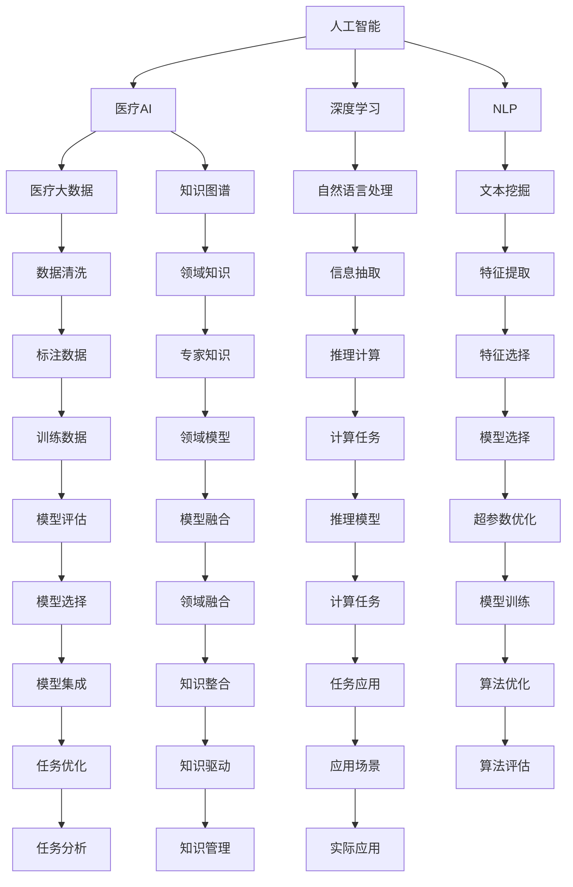

                 

## 1. 背景介绍

### 1.1 问题由来

随着人工智能技术的飞速发展，其在医疗领域的应用日益广泛。从简单的数据记录和报告生成，到复杂的疾病诊断和治疗方案制定，AI技术正在深刻地改变着医疗行业的面貌。

### 1.2 问题核心关键点

人工智能在医疗中的应用，涉及到数据处理、模型训练、疾病诊断、治疗方案等多个环节。其中，数据驱动的计算和人类计算的结合，是实现医疗AI创新、提升医疗服务质量的关键。

### 1.3 问题研究意义

研究人类计算在医疗中的应用，对于提升医疗AI的效率、精度和可靠性，改善患者治疗体验，具有重要意义：

1. **提升效率**：通过计算自动化，减少人工操作，提高诊断和治疗的效率。
2. **提高精度**：通过数据分析和计算，提升疾病诊断的准确性，减少误诊和漏诊。
3. **降低成本**：自动化流程减少人力和时间成本，降低医疗费用。
4. **个性化治疗**：利用计算模型，提供个性化的治疗方案，优化治疗效果。
5. **数据驱动决策**：基于大数据分析，辅助医生做出更加科学的决策。

### 1.4 问题研究现状

目前，医疗AI技术已经涉及医学影像分析、基因组学、药物研发等多个领域。然而，由于医疗数据的复杂性和敏感性，许多计算任务难以在标准化的AI框架中直接应用。人类计算在医疗中的应用，可以更好地整合领域知识，提升AI系统的准确性和可解释性。

## 2. 核心概念与联系

### 2.1 核心概念概述

为更好地理解人类计算在医疗中的应用，本节将介绍几个关键概念：

- **人工智能(AI)**：利用算法和计算，实现对复杂数据的处理和分析，以辅助决策。
- **人类计算(Computational Humanities)**：通过计算模型和算法，整合人类知识和经验，提升计算任务的效果和可解释性。
- **医疗AI**：结合AI技术和医疗领域知识，实现疾病诊断、治疗方案制定等任务。
- **医疗大数据**：包含患者健康记录、医学影像、基因组数据等，用于训练和评估AI模型。
- **深度学习(Deep Learning)**：利用多层神经网络，实现复杂的数据特征提取和模式识别。
- **自然语言处理(NLP)**：处理和理解自然语言，实现医疗文档的自动摘要和信息提取。
- **知识图谱(Knowledge Graph)**：利用图结构，表示和关联医疗领域的知识。

这些概念之间的逻辑关系可以通过以下Mermaid流程图来展示：



这个流程图展示了人工智能、医疗AI、深度学习、自然语言处理等概念之间的联系和互动，共同构成了医疗AI计算和人类计算的应用框架。

## 3. 核心算法原理 & 具体操作步骤

### 3.1 算法原理概述

人类计算在医疗中的应用，主要通过计算模型和算法，整合人类知识和经验，提升计算任务的效果和可解释性。其核心思想是：利用计算模型对医疗数据进行处理和分析，辅助医生做出决策，同时将人类专家的知识和经验引入计算过程中，提升模型的准确性和可靠性。

形式化地，假设医疗数据集为 $D=\{(x_i,y_i)\}_{i=1}^N, x_i \in \mathcal{X}, y_i \in \mathcal{Y}$，其中 $x_i$ 为医疗数据，$y_i$ 为疾病标签。人类计算的目标是构建一个计算模型 $M_{\theta}$，使得 $M_{\theta}(x_i) \approx y_i$。

通过训练计算模型 $M_{\theta}$，使其能够从医疗数据中学习疾病特征，并通过计算和推理，辅助医生做出诊断和治疗决策。

### 3.2 算法步骤详解

人类计算在医疗中的应用，通常包括以下几个关键步骤：

**Step 1: 数据准备**
- 收集和整理医疗数据，包括电子健康记录(EHR)、医学影像、基因组数据等。
- 清洗和标注数据，去除噪声和错误，确保数据质量和一致性。

**Step 2: 模型构建**
- 选择合适的计算模型，如深度学习模型、知识图谱模型等。
- 定义计算模型的结构和参数，选择合适的优化算法。
- 设计计算模型的输入和输出，确定模型的推理方式。

**Step 3: 知识整合**
- 引入人类专家的知识和经验，如医学规则、疾病诊断路径等。
- 将知识图谱、领域模型等专家知识，引入计算模型中。
- 设计知识驱动的推理算法，辅助模型进行决策。

**Step 4: 训练和评估**
- 使用医疗数据对计算模型进行训练，调整模型参数。
- 在验证集上评估模型的性能，选择最优模型。
- 在测试集上进一步验证模型的泛化能力。

**Step 5: 部署和应用**
- 将训练好的模型部署到实际医疗环境中，进行实际应用。
- 持续收集和更新数据，定期重新训练和优化模型。

### 3.3 算法优缺点

人类计算在医疗中的应用，具有以下优点：
1. 整合领域知识：通过将人类专家的知识和经验引入计算模型，提升模型的准确性和可靠性。
2. 提升可解释性：人类计算能够更好地理解计算模型的决策过程，提供可解释的推理结果。
3. 降低风险：通过计算模型辅助决策，减少人为失误和判断偏差。
4. 提高效率：计算模型能够自动化处理大量医疗数据，提高诊断和治疗效率。

同时，人类计算也存在一些局限性：
1. 数据依赖：依赖高质量的医疗数据，数据的获取和标注成本较高。
2. 模型复杂性：需要选择合适的计算模型，并设计复杂的推理逻辑，模型构建难度较大。
3. 知识表达：人类专家的知识和经验需要有效地表达和整合到计算模型中，存在表达难度。
4. 计算资源：计算模型的训练和推理需要大量计算资源，成本较高。

### 3.4 算法应用领域

人类计算在医疗中的应用，覆盖了医疗AI的多个领域，具体包括：

- **医学影像分析**：利用计算模型对医学影像进行自动分析和诊断，如CT、MRI、超声等影像分析。
- **基因组学**：通过计算模型对基因组数据进行分析和预测，如基因突变、疾病风险评估等。
- **药物研发**：利用计算模型对药物分子进行筛选和设计，加速新药开发进程。
- **临床决策支持**：辅助医生进行疾病诊断和治疗方案制定，提供个性化的医疗建议。
- **电子健康记录(EHR)管理**：通过计算模型对电子健康记录进行自动摘要和信息提取，提高数据利用效率。
- **自然语言处理(NLP)**：对医疗文档进行自动分类、摘要和信息提取，提升文档处理效率。
- **知识图谱**：构建医疗领域的知识图谱，辅助医生进行疾病关联分析和推理。

## 4. 数学模型和公式 & 详细讲解 & 举例说明

### 4.1 数学模型构建

人类计算在医疗中的应用，可以通过构建计算模型来进行数据处理和分析。以医学影像分析为例，假设我们有 $N$ 个医学影像数据 $x_1,...,x_N$，以及对应的疾病标签 $y_1,...,y_N$。我们希望构建一个计算模型 $M_{\theta}$，使得 $M_{\theta}(x_i) \approx y_i$。

定义计算模型的结构为 $M_{\theta}(x_i) = g(f(x_i;\theta))$，其中 $f(x_i;\theta)$ 为特征提取和表示，$g$ 为预测函数。常用的特征提取方法包括卷积神经网络(CNN)、自编码器(AE)等。

### 4.2 公式推导过程

以卷积神经网络(CNN)为例，进行特征提取和表示的推导。假设我们使用一个两层卷积神经网络，输入为医学影像 $x_i \in \mathbb{R}^{H \times W \times C}$，其中 $H$、$W$、$C$ 分别为影像的高度、宽度和通道数。卷积层的参数为 $\theta$，输出为 $h_i \in \mathbb{R}^{n_1 \times H' \times W'}$，其中 $n_1$ 为卷积核数量，$H'$、$W'$ 分别为卷积核的宽度和高度。

卷积层的操作为：

$$
h_{ij} = f_{ij}(x_i;\theta) = \sum_{c=1}^C w_c * x_{ijc} + b_i
$$

其中 $w_c$ 为卷积核的权重，$b_i$ 为偏置项。使用激活函数 $g$ 进行非线性变换，得到最终特征表示 $f(x_i;\theta)$。

预测函数 $g$ 可以是全连接神经网络或逻辑回归等，输出为疾病标签 $y_i$。使用交叉熵损失函数进行模型训练，计算损失函数：

$$
\mathcal{L}(\theta) = -\frac{1}{N} \sum_{i=1}^N y_i \log \hat{y_i}
$$

其中 $\hat{y_i} = M_{\theta}(x_i)$ 为模型预测结果。

### 4.3 案例分析与讲解

以医学影像分类为例，我们可以使用计算模型对CT影像进行自动分类。首先，将CT影像数据 $x_i$ 输入卷积神经网络进行特征提取，得到特征表示 $h_i$。然后，使用全连接神经网络对 $h_i$ 进行分类预测，输出疾病标签 $y_i$。

在模型训练过程中，使用交叉熵损失函数对模型进行训练，最小化预测误差。训练好的模型可以用于新的医学影像分类任务，显著提高诊断效率和准确性。

## 5. 项目实践：代码实例和详细解释说明

### 5.1 开发环境搭建

在进行医疗AI计算和人类计算的应用开发前，需要准备相应的开发环境。以下是使用Python进行TensorFlow开发的环境配置流程：

1. 安装Anaconda：从官网下载并安装Anaconda，用于创建独立的Python环境。

2. 创建并激活虚拟环境：
```bash
conda create -n tf-env python=3.8 
conda activate tf-env
```

3. 安装TensorFlow：根据CUDA版本，从官网获取对应的安装命令。例如：
```bash
conda install tensorflow
```

4. 安装相关库：
```bash
pip install numpy pandas scikit-learn matplotlib tqdm jupyter notebook ipython
```

完成上述步骤后，即可在`tf-env`环境中开始开发实践。

### 5.2 源代码详细实现

这里我们以医学影像分类任务为例，给出使用TensorFlow对卷积神经网络进行训练和推理的PyTorch代码实现。

首先，定义数据处理函数：

```python
import tensorflow as tf
from tensorflow.keras.datasets import cifar10
from tensorflow.keras.preprocessing.image import ImageDataGenerator

def load_data():
    (x_train, y_train), (x_test, y_test) = cifar10.load_data()
    x_train = x_train.astype('float32') / 255.0
    x_test = x_test.astype('float32') / 255.0
    return (x_train, y_train), (x_test, y_test)
```

然后，定义模型结构：

```python
from tensorflow.keras import layers

def create_model():
    model = tf.keras.Sequential([
        layers.Conv2D(32, (3, 3), activation='relu', input_shape=(32, 32, 3)),
        layers.MaxPooling2D((2, 2)),
        layers.Conv2D(64, (3, 3), activation='relu'),
        layers.MaxPooling2D((2, 2)),
        layers.Conv2D(64, (3, 3), activation='relu'),
        layers.Flatten(),
        layers.Dense(64, activation='relu'),
        layers.Dense(10)
    ])
    return model
```

接着，定义训练和评估函数：

```python
def train_model(model, x_train, y_train, epochs):
    model.compile(optimizer='adam', loss='sparse_categorical_crossentropy', metrics=['accuracy'])
    model.fit(x_train, y_train, epochs=epochs, validation_data=(x_test, y_test))
    return model

def evaluate_model(model, x_test, y_test):
    loss, accuracy = model.evaluate(x_test, y_test)
    print(f'Test accuracy: {accuracy:.4f}')
    return accuracy
```

最后，启动训练流程并在测试集上评估：

```python
epochs = 10

# 加载数据
(x_train, y_train), (x_test, y_test) = load_data()

# 创建模型
model = create_model()

# 训练模型
model = train_model(model, x_train, y_train, epochs)

# 评估模型
evaluate_model(model, x_test, y_test)
```

以上就是使用TensorFlow对卷积神经网络进行医学影像分类任务微调的完整代码实现。可以看到，TensorFlow提供了方便的API和工具，使得模型的构建和训练变得简单高效。

### 5.3 代码解读与分析

让我们再详细解读一下关键代码的实现细节：

**load_data函数**：
- 从TensorFlow的CIFAR-10数据集加载医学影像数据和标签。
- 将数据归一化到0-1之间，以避免梯度爆炸或消失问题。

**create_model函数**：
- 定义一个简单的卷积神经网络模型，包括卷积层、池化层、全连接层等。
- 使用ReLU作为激活函数，避免梯度消失问题。

**train_model函数**：
- 编译模型，设置优化器、损失函数和评估指标。
- 使用`fit`函数进行模型训练，指定训练轮数和验证集。
- 返回训练好的模型。

**evaluate_model函数**：
- 使用`evaluate`函数在测试集上评估模型的性能。
- 输出测试集上的准确率。

**训练流程**：
- 定义训练轮数和数据集。
- 加载数据，创建模型。
- 训练模型，并评估模型性能。

可以看到，TensorFlow提供了丰富的API和工具，使得模型构建和训练变得简单高效。开发者可以通过定义模型结构、设置训练参数等步骤，快速实现医疗AI计算和人类计算的应用。

## 6. 实际应用场景

### 6.1 智能医疗诊断

基于计算模型的智能医疗诊断系统，可以显著提高诊断效率和准确性。传统的人工诊断往往受限于医生的经验和技术水平，容易产生误诊和漏诊。

具体而言，可以收集医院的历史病例数据，使用计算模型对影像、病历等医疗数据进行自动分析和分类。微调后的计算模型能够自动识别影像中的病变区域，标注出疑似病例，辅助医生进行诊断和治疗。

### 6.2 个性化医疗方案

计算模型可以结合患者的基因信息、病史、生活习惯等数据，提供个性化的医疗方案。利用计算模型，可以根据患者的具体情况，预测疾病风险，推荐适合的药物和治疗方案。

在实际应用中，可以将患者的基因组数据、病历等输入计算模型，输出个性化治疗建议。医生可以根据这些建议，制定更加科学的诊断和治疗方案，提升治疗效果。

### 6.3 疾病预测与预防

计算模型可以基于历史数据，预测疾病的发展趋势和预防措施。通过对大量医疗数据的分析，计算模型能够识别出高风险人群，提供针对性的预防建议。

例如，可以利用计算模型对人群的基因数据进行分析，预测患某种疾病的风险，提供早期干预和预防措施。这有助于降低疾病发病率，提高公共卫生水平。

### 6.4 医疗知识图谱

知识图谱是将领域知识以图结构形式表示，方便计算模型进行查询和推理。通过构建医疗领域的知识图谱，可以提供更加全面的疾病信息，辅助医生进行疾病关联分析和诊断。

具体而言，可以将医学文献、临床指南、药品信息等数据整合到知识图谱中，构建医疗领域的知识网络。医生可以根据需要，查询相关的疾病信息和治疗方案，提高诊断和治疗效率。

## 7. 工具和资源推荐

### 7.1 学习资源推荐

为了帮助开发者系统掌握计算模型在医疗中的应用，这里推荐一些优质的学习资源：

1. 《Deep Learning for Medical Imaging》书籍：介绍深度学习在医学影像分析中的应用，涵盖影像分类、分割、检测等任务。

2. 《Computational Biology: An Introduction》课程：斯坦福大学开设的生物计算课程，涵盖基因组学、药物设计等应用。

3. 《Natural Language Processing in Biomedicine》书籍：介绍自然语言处理在生物医学领域的应用，包括医疗文档处理、知识抽取等。

4. CSBBLab：由斯坦福大学团队维护的生物信息学实验室，提供丰富的生物计算资源和工具。

5. Kaggle：提供各种医疗数据集和竞赛，通过实践练习，提升计算模型应用能力。

通过对这些资源的学习实践，相信你一定能够快速掌握计算模型在医疗中的应用，并用于解决实际的医疗问题。

### 7.2 开发工具推荐

高效的开发离不开优秀的工具支持。以下是几款用于计算模型在医疗中的应用开发的常用工具：

1. TensorFlow：基于Python的开源深度学习框架，提供丰富的API和工具，适合快速迭代研究。

2. PyTorch：基于Python的开源深度学习框架，灵活动态的计算图，适合快速开发和实验。

3. Keras：基于Python的高层深度学习API，提供简单易用的接口，方便模型构建和训练。

4. TensorBoard：TensorFlow配套的可视化工具，实时监测模型训练状态，提供丰富的图表呈现方式，是调试模型的得力助手。

5. Weights & Biases：模型训练的实验跟踪工具，记录和可视化模型训练过程中的各项指标，方便对比和调优。

6. Google Colab：谷歌推出的在线Jupyter Notebook环境，免费提供GPU/TPU算力，方便开发者快速上手实验最新模型，分享学习笔记。

合理利用这些工具，可以显著提升计算模型在医疗中的应用开发效率，加快创新迭代的步伐。

### 7.3 相关论文推荐

计算模型在医疗中的应用，源于学界的持续研究。以下是几篇奠基性的相关论文，推荐阅读：

1. <a href="https://arxiv.org/abs/1502.04623">Going Deeper with Convolutions</a>：提出了卷积神经网络，用于医学影像分类和分割任务。

2. <a href="https://arxiv.org/abs/1604.08083">Attention is All You Need</a>：提出了自注意力机制，用于自然语言处理和文本生成任务。

3. <a href="https://www.sciencedirect.com/science/article/pii/S0167721819302245">Deep Learning for Healthcare Data</a>：综述了深度学习在医疗数据处理和分析中的应用。

4. <a href="https://arxiv.org/abs/1803.09101">Learning from Noisy Labels with Multi-view Clustering</a>：研究了从噪声标签中学习的方法，用于提高医疗影像分类器的准确性。

5. <a href="https://www.nature.com/articles/nrd.2015.96">A Knowledge Graph in Biomedicine: A Bridging Model for the Cloud</a>：介绍了基于知识图谱的医疗信息整合和推理。

这些论文代表了大计算模型在医疗领域的应用方向，通过学习这些前沿成果，可以帮助研究者把握学科前进方向，激发更多的创新灵感。

## 8. 总结：未来发展趋势与挑战

### 8.1 总结

本文对计算模型在医疗中的应用进行了全面系统的介绍。首先阐述了计算模型和人类计算在医疗中的应用背景和意义，明确了其在提高医疗效率、精度和个性化治疗方面的独特价值。其次，从原理到实践，详细讲解了计算模型的构建和应用，给出了完整的代码实例。同时，本文还广泛探讨了计算模型在智能医疗诊断、个性化治疗、疾病预测与预防等多个领域的应用前景，展示了其广阔的应用前景。此外，本文精选了计算模型在医疗中的应用资源，力求为读者提供全方位的技术指引。

通过本文的系统梳理，可以看到，计算模型在医疗中的应用，正在逐步深化和扩展，显著提升医疗服务的质量和效率。未来，伴随计算模型和人类计算的不断进步，必将进一步推动医疗AI技术的发展，为人类健康带来新的突破。

### 8.2 未来发展趋势

展望未来，计算模型在医疗中的应用将呈现以下几个发展趋势：

1. **模型规模增大**：随着算力成本的下降和数据规模的扩张，计算模型的参数量还将持续增长，超大规模模型将具备更强的数据整合和推理能力。

2. **知识图谱普及**：知识图谱作为医疗领域的重要工具，将在计算模型中得到广泛应用，提升模型的推理能力和可解释性。

3. **深度学习与知识图谱融合**：计算模型将结合深度学习与知识图谱，提升模型的泛化能力和推理效率。

4. **个性化医疗提升**：计算模型将更好地整合患者数据，提供个性化的医疗方案，提升治疗效果。

5. **多模态融合**：计算模型将结合影像、基因、文本等多种数据模态，提升综合分析能力，提供更全面的诊断和治疗建议。

6. **实时计算与推理**：计算模型将实现实时计算与推理，提高诊断和治疗效率，增强系统的实时性。

7. **跨领域应用拓展**：计算模型将扩展到更多领域，如公共卫生、健康管理等，推动医疗AI技术的普及和应用。

这些趋势凸显了计算模型在医疗中的应用前景，将进一步提升医疗服务的效率和质量。

### 8.3 面临的挑战

尽管计算模型在医疗中的应用取得了一定进展，但在迈向更加智能化、普适化应用的过程中，仍面临诸多挑战：

1. **数据隐私与安全**：医疗数据的隐私和安全问题，需要严格的数据保护措施，确保数据安全。

2. **数据质量和一致性**：医疗数据的复杂性和多样性，需要有效的数据清洗和标注方法，确保数据质量。

3. **模型可解释性**：计算模型的决策过程需要具备可解释性，确保模型的可靠性和透明性。

4. **知识整合难度**：将领域知识整合到计算模型中，需要复杂的知识表达和推理方法，存在表达难度。

5. **计算资源需求**：计算模型的训练和推理需要大量计算资源，成本较高。

6. **伦理道德问题**：计算模型可能学习到有害信息，需要建立伦理导向的评估指标，避免模型偏见和有害输出。

7. **系统集成与优化**：将计算模型融入实际医疗系统，需要进行系统集成和优化，确保系统的稳定性和高效性。

这些挑战需要学界和产业界共同努力，克服技术难题，推动计算模型在医疗中的应用。

### 8.4 研究展望

面向未来，计算模型在医疗中的应用需要在以下几个方面寻求新的突破：

1. **跨领域知识融合**：将不同领域的专业知识引入计算模型，提升模型的综合分析能力。

2. **模型优化与压缩**：开发更加轻量级的计算模型，优化模型结构和推理过程，降低资源消耗。

3. **知识驱动的推理**：引入领域专家的知识，设计知识驱动的推理算法，提高模型的推理能力和泛化能力。

4. **多模态数据整合**：结合影像、基因、文本等多种数据模态，提升综合分析能力，提供更全面的诊断和治疗建议。

5. **实时计算与推理**：实现实时计算与推理，提高诊断和治疗效率，增强系统的实时性。

6. **知识图谱构建**：构建和优化知识图谱，提升计算模型的推理能力和可解释性。

7. **数据保护与安全**：设计有效的数据保护和安全措施，确保医疗数据的隐私和安全。

这些研究方向将引领计算模型在医疗中的应用发展，推动医疗AI技术的普及和应用，为人类健康带来新的突破。

## 9. 附录：常见问题与解答

**Q1：计算模型在医疗中的应用是否具有广泛的适用性？**

A: 计算模型在医疗中的应用，具有广泛的适用性。随着计算模型的不断发展和完善，其在疾病诊断、治疗方案制定、健康管理等多个领域都能取得显著效果。然而，具体应用效果还需根据实际情况进行选择和调整。

**Q2：计算模型的性能如何评估？**

A: 计算模型的性能评估需要结合具体任务进行。常见的评估指标包括准确率、召回率、F1分数、AUC等。具体评估方法需要根据任务类型和数据特点进行设计。

**Q3：计算模型在医疗中的应用是否会引入新的风险？**

A: 计算模型在医疗中的应用，可能引入新的风险，如数据隐私和安全问题。需要采取有效的数据保护和安全措施，确保数据安全。

**Q4：如何提高计算模型的可解释性？**

A: 提高计算模型的可解释性，需要设计可解释的推理算法，提供清晰的决策逻辑。同时，结合领域专家的知识和经验，提升模型的可解释性。

**Q5：计算模型在医疗中的应用面临哪些技术挑战？**

A: 计算模型在医疗中的应用面临多重技术挑战，包括数据隐私和安全、数据质量和一致性、模型可解释性、知识整合难度、计算资源需求等。需要采取有效的技术手段，解决这些挑战。

这些问题的解答，希望能够帮助开发者更好地理解计算模型在医疗中的应用，提供实际指导和帮助。

