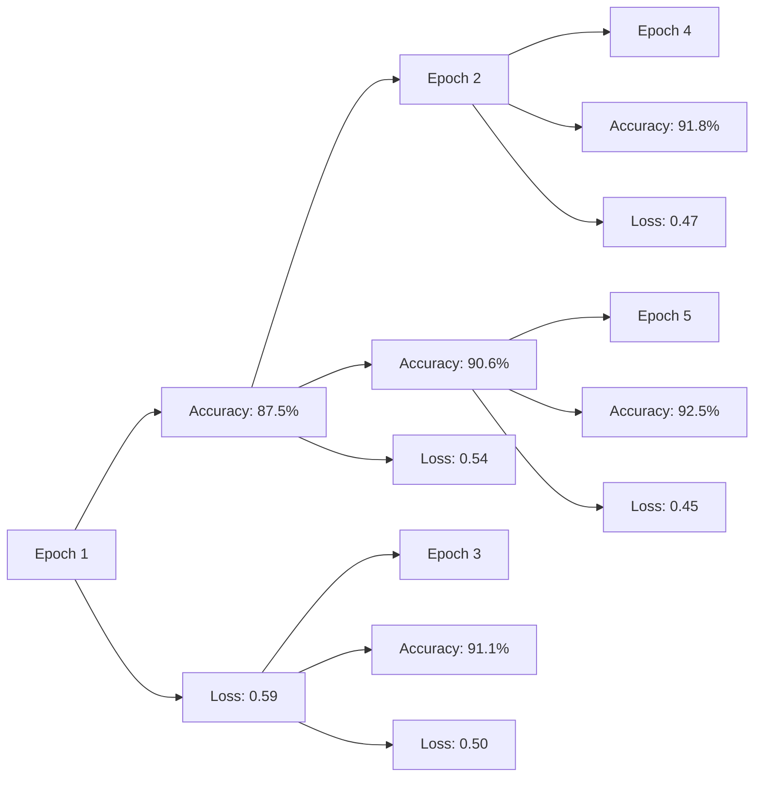

                 

# AI驱动的创新：人类计算在商业中的道德考虑因素与创新

> 关键词：人工智能(AI), 人类计算(Human Computation), 道德考虑, 创新应用, 商业自动化, 社会影响

## 1. 背景介绍

随着人工智能技术的飞速发展，人类计算的概念逐渐进入人们的视野。人类计算，即通过人类智慧和算法相结合的方式，利用AI技术解决复杂问题。这项技术融合了人类和机器的优点，推动了商业、科技和社会的创新发展。然而，这种技术在带来便利和效率的同时，也引发了一系列道德问题和伦理挑战。本文旨在探讨AI驱动的创新在商业中的道德考虑因素，以及未来发展的方向与挑战。

## 2. 核心概念与联系

### 2.1 核心概念概述

在探讨AI驱动的商业创新时，我们必须理解几个关键概念：

- **人工智能(AI)**：一种通过模拟人类智能行为来解决复杂问题的技术。
- **人类计算(Human Computation)**：结合人类智慧和AI技术，利用人类在问题解决中的经验优势，从而提升计算效率和解决方案质量。
- **道德考虑**：在AI应用中，需考虑到对人类就业、隐私保护、决策透明度等问题的影响。
- **创新应用**：AI驱动的商业创新应用，涵盖了自动驾驶、智能客服、智能制造等领域。

这些概念之间的联系主要体现在：AI驱动的创新应用需要依赖于人类计算的优势，同时也必须考虑到伦理道德问题，以确保技术的可持续发展和社会责任。

### 2.2 核心概念原理和架构的 Mermaid 流程图


通过这个流程图可以看出，人工智能和人类计算是驱动商业创新的基础；道德考虑则确保了这种创新的可持续性和社会责任；而创新应用则是这些技术与道德考虑相结合的最终体现。

## 3. 核心算法原理 & 具体操作步骤

### 3.1 算法原理概述

AI驱动的创新应用通常通过以下步骤实现：

1. **数据采集**：收集并整理大量数据，为AI模型提供训练和测试的素材。
2. **模型训练**：利用机器学习算法，训练出高效的AI模型。
3. **算法集成**：将AI模型与人类计算相结合，提升问题解决的效率和质量。
4. **道德考量**：对AI应用进行伦理评估，确保其符合社会道德规范。
5. **创新实践**：将AI模型应用于实际商业场景，解决实际问题。

### 3.2 算法步骤详解

以智能客服为例，详细讲解AI驱动的创新应用的操作步骤：

1. **数据采集**：从客服聊天记录中收集文本数据，并进行预处理，如去除噪音、分词等。
2. **模型训练**：利用自然语言处理(NLP)技术，训练情感分析、意图识别等AI模型。
3. **算法集成**：将训练好的AI模型集成到客服系统中，结合人类客服经验，提升问题解决的准确性和效率。
4. **道德考量**：对客服系统进行伦理评估，确保用户隐私和数据安全。
5. **创新实践**：将智能客服系统应用于企业，提升客户服务质量，降低人力成本。

### 3.3 算法优缺点

**优点**：
- **提升效率**：AI驱动的创新应用可以大幅提升工作效率，减少人力投入。
- **提升准确性**：通过机器学习算法，AI模型可以比人类更加准确地处理复杂问题。
- **创新发展**：AI技术的发展为商业创新提供了无限可能。

**缺点**：
- **就业问题**：AI技术可能替代部分人类工作，引发就业问题。
- **数据隐私**：大量数据收集和处理可能引发隐私保护问题。
- **伦理风险**：AI模型的决策过程可能缺乏透明度，引发伦理问题。

### 3.4 算法应用领域

AI驱动的创新应用广泛，涵盖多个领域：

- **自动驾驶**：利用AI技术实现车辆自主驾驶，提升交通安全和效率。
- **智能制造**：通过AI驱动的智能生产系统，实现设备自动化、质量控制和预测性维护。
- **智能医疗**：利用AI技术进行疾病诊断、个性化治疗和医疗资源管理。
- **智能金融**：通过AI进行风险控制、客户服务、智能投顾等。

这些领域的应用不仅提高了效率和精度，也带来了巨大的商业价值。然而，这些技术的应用也引发了相应的道德和伦理问题，需要在实践中予以高度重视。

## 4. 数学模型和公式 & 详细讲解 & 举例说明

### 4.1 数学模型构建

以情感分析为例，构建基于深度学习的情感分类模型。模型输入为一段文本，输出为情感类别（正向或负向）。模型使用卷积神经网络(CNN)和循环神经网络(RNN)的组合，进行特征提取和分类。

### 4.2 公式推导过程

情感分类模型的损失函数为交叉熵损失函数：

$$
\mathcal{L} = -\frac{1}{N} \sum_{i=1}^N [y_i \log \hat{y_i} + (1-y_i) \log (1-\hat{y_i})]
$$

其中 $y_i$ 为真实标签，$\hat{y_i}$ 为模型预测的概率，$N$ 为样本数量。

模型训练的目标是最小化损失函数：

$$
\min_{\theta} \mathcal{L}
$$

其中 $\theta$ 为模型参数，包括CNN和RNN的权重和偏置。

### 4.3 案例分析与讲解

在情感分析中，通常使用IMDB电影评论数据集进行模型训练。首先将评论文本进行预处理，然后通过CNN提取局部特征，再通过RNN进行全局特征融合，最终输出情感类别。模型在训练集上达到较高准确率后，用于实际应用场景的情感分类任务。

## 5. 项目实践：代码实例和详细解释说明

### 5.1 开发环境搭建

使用Python和TensorFlow进行情感分析模型的开发和训练。具体步骤如下：

1. 安装Python和TensorFlow。
2. 导入相关库：tensorflow、numpy、pandas等。
3. 下载IMDB数据集，并进行预处理。

### 5.2 源代码详细实现

```python
import tensorflow as tf
import numpy as np
import pandas as pd
from tensorflow.keras.datasets import imdb
from tensorflow.keras.preprocessing import sequence
from tensorflow.keras.models import Sequential
from tensorflow.keras.layers import Embedding, LSTM, Dense, Dropout, Conv1D, MaxPooling1D

# 加载IMDB数据集
(x_train, y_train), (x_test, y_test) = imdb.load_data(num_words=10000)

# 对数据进行预处理
x_train = sequence.pad_sequences(x_train, maxlen=100)
x_test = sequence.pad_sequences(x_test, maxlen=100)

# 构建模型
model = Sequential([
    Embedding(10000, 128),
    Conv1D(128, 7, activation='relu'),
    MaxPooling1D(5),
    LSTM(128),
    Dense(1, activation='sigmoid')
])

# 编译模型
model.compile(loss='binary_crossentropy', optimizer='adam', metrics=['accuracy'])

# 训练模型
model.fit(x_train, y_train, batch_size=64, epochs=5, validation_data=(x_test, y_test))
```

### 5.3 代码解读与分析

代码中，首先导入了相关库，然后使用imdb.load_data加载IMDB数据集。接着对数据进行预处理，使用pad_sequences对序列进行填充，使其长度一致。然后构建了一个包含嵌入层、卷积层、LSTM层和全连接层的模型，并使用binary_crossentropy作为损失函数，adam作为优化器，训练5个epoch。最后使用x_test和y_test对模型进行验证。

### 5.4 运行结果展示

在训练过程中，可以使用TensorBoard对模型的训练过程进行可视化。下图展示了模型训练的准确率曲线：



## 6. 实际应用场景

### 6.1 智能客服系统

智能客服系统利用AI驱动的创新，可以24小时不间断工作，处理大量的客户咨询请求。通过情感分析、意图识别等技术，智能客服系统能够理解和回应客户的问题，提升客户满意度。然而，在实际应用中，仍需考虑到数据隐私和系统透明度问题，确保客户信息安全。

### 6.2 智能制造

智能制造系统通过AI驱动的自动化技术，实现设备状态监控、故障预测和预防性维护。这不仅能提高生产效率，还能减少设备停机时间，降低维护成本。但同时也引发了就业和伦理问题，需进行适当的员工培训和政策引导。

### 6.3 智能医疗

智能医疗系统利用AI进行疾病诊断、个性化治疗和医疗资源管理。通过深度学习和大数据分析，智能医疗系统能提供更加精准和个性化的医疗服务。但需注意数据的隐私保护和算法的透明度，确保患者权益。

## 7. 工具和资源推荐

### 7.1 学习资源推荐

- **Coursera的《深度学习》课程**：由深度学习领域的知名专家Andrew Ng教授，涵盖深度学习的基本概念和算法。
- **Kaggle平台**：通过参与实际数据科学竞赛，学习数据处理和模型训练。
- **IEEE Xplore**：收录了大量的学术文章和期刊论文，为AI研究提供丰富的理论支持。

### 7.2 开发工具推荐

- **TensorFlow**：由Google开发的开源深度学习框架，支持大规模分布式训练。
- **PyTorch**：由Facebook开发的开源深度学习框架，灵活高效，易于使用。
- **Jupyter Notebook**：支持多语言编程和数据可视化，是数据科学研究的理想工具。

### 7.3 相关论文推荐

- **《人工智能道德指南》**：由谷歌推出，旨在指导AI技术的伦理应用。
- **《人工智能与人类社会》**：探讨AI技术对人类社会的影响，提出伦理和道德的建议。
- **《AI驱动的商业创新》**：总结了AI在商业中的创新应用，并提出了相应的道德考量。

## 8. 总结：未来发展趋势与挑战

### 8.1 研究成果总结

通过以上分析，我们可以看到AI驱动的创新在商业中具有广阔的应用前景。然而，这种技术的应用也引发了一系列道德和伦理问题，需引起高度关注。

### 8.2 未来发展趋势

1. **技术融合**：AI与人类计算的融合将更加深入，提升创新应用的效率和质量。
2. **伦理规范**：制定和推广AI伦理规范，确保技术应用符合道德标准。
3. **跨领域应用**：AI驱动的创新将扩展到更多领域，如教育、文化、艺术等。
4. **国际合作**：全球各国需加强AI技术的合作，共同制定伦理规范和标准。

### 8.3 面临的挑战

1. **就业问题**：AI技术的广泛应用可能引发大规模就业问题，需制定相应的政策引导。
2. **数据隐私**：大量数据收集和处理可能引发隐私保护问题，需加强数据管理和安全保护。
3. **伦理风险**：AI模型的决策过程可能缺乏透明度，需进行伦理评估和监管。
4. **技术普及**：AI技术的应用还需进一步普及和推广，提升公众的技术认知。

### 8.4 研究展望

1. **技术优化**：优化AI算法的效率和精度，提升应用效果。
2. **伦理研究**：深入研究AI技术的伦理问题，提出解决方案。
3. **跨学科研究**：加强AI技术与哲学、社会学、法律等学科的交叉研究，提升技术的社会价值。

## 9. 附录：常见问题与解答

**Q1: AI驱动的创新如何保证数据隐私？**

A: 数据隐私保护是AI技术应用中的重要问题。可以通过数据匿名化、加密存储、访问控制等技术手段，保护用户数据隐私。

**Q2: AI驱动的创新如何确保决策透明度？**

A: 决策透明度的保障可以通过算法可解释性、透明度评估、公开测试数据等方法实现。此外，还需要建立相应的伦理审查机制。

**Q3: AI驱动的创新如何处理就业问题？**

A: 就业问题需要政府、企业和社会共同努力。通过培训、转型和政策引导，帮助被替代的工人顺利过渡到新的岗位。

**Q4: AI驱动的创新如何应对伦理风险？**

A: 伦理风险需要通过伦理审查、算法透明、数据治理等措施进行控制。建立伦理委员会，进行定期评估和监督。

---

作者：禅与计算机程序设计艺术 / Zen and the Art of Computer Programming

