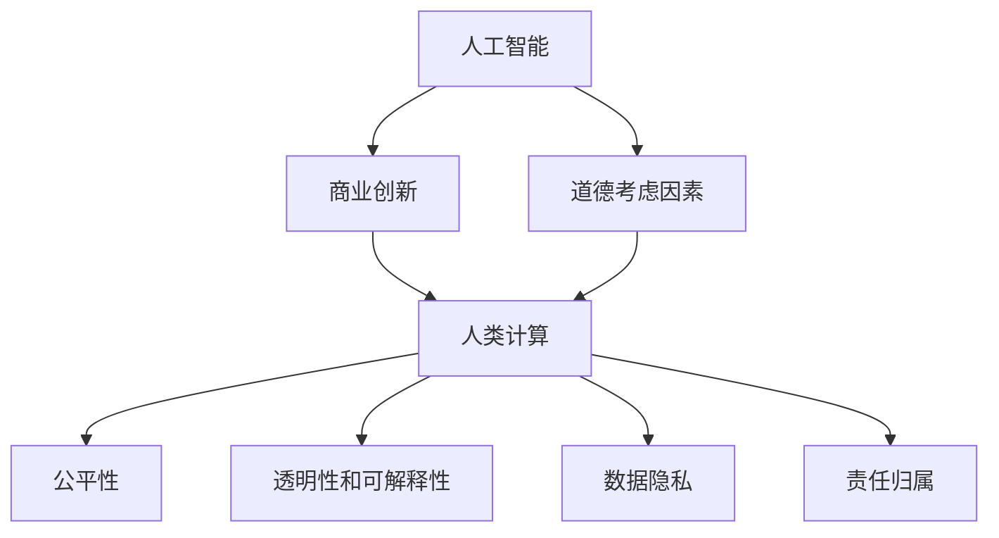

                 

# AI驱动的创新：人类计算在商业中的道德考虑因素分析

> 关键词：人工智能, 商业创新, 道德考虑, 计算效率, 公平性, 透明性, 可解释性, 人类计算, 伦理风险, 隐私保护

## 1. 背景介绍

### 1.1 问题由来

近年来，人工智能（AI）技术的迅猛发展，尤其是深度学习、机器学习和大数据技术的广泛应用，已经深刻改变了各行业的商业模式和运营方式。AI驱动的商业创新，包括智能客服、精准营销、供应链优化、自动化流程等，正逐步推动企业向数字化、智能化转型。然而，随着AI技术的深入应用，道德问题也逐渐浮出水面，引起了学术界、产业界乃至社会各界的广泛关注。

### 1.2 问题核心关键点

AI技术的商业应用，尤其是在涉及客户隐私、公平性、透明性、可解释性等方面，存在诸多道德考虑因素。如何在创新与道德之间找到平衡，是当前AI技术应用需要解决的重要课题。具体而言，包括但不限于以下方面：

1. **数据隐私保护**：如何在使用大规模数据集进行AI训练和应用时，保护用户隐私和数据安全。
2. **算法公平性**：如何避免算法偏见，确保不同群体、不同性别、不同年龄等用户在AI系统中的公平对待。
3. **透明性和可解释性**：如何让AI系统的决策过程和结果具有透明度，使用户能够理解和信任AI。
4. **责任归属**：在AI系统出现错误或违规行为时，如何明确责任归属，保障用户权益。

### 1.3 问题研究意义

研究和探讨AI技术在商业应用中的道德考虑因素，对于促进AI技术的健康发展和商业创新具有重要意义：

1. **增强公众信任**：通过理解和解决AI应用中的道德问题，可以增强公众对AI技术的信任和接受度，促进AI技术的普及和应用。
2. **规范行业发展**：制定AI技术的道德规范，可以有效避免AI应用中的伦理风险，推动行业健康、有序发展。
3. **提升用户满意度**：确保AI系统在保护用户隐私、提供公平待遇、保证透明性和可解释性等方面的表现，可以显著提升用户体验和满意度。
4. **推动商业创新**：合理解决道德问题，可以消除企业对AI应用的顾虑，促进企业积极探索和应用AI技术，推动商业模式的创新和优化。

## 2. 核心概念与联系

### 2.1 核心概念概述

为更好地理解AI在商业应用中的道德考虑因素，本节将介绍几个密切相关的核心概念：

- **人工智能（AI）**：使用算法和机器学习技术，模拟人类智能过程的计算系统。包括机器学习、深度学习、自然语言处理等。
- **商业创新**：通过引入新技术、新方法和新流程，提升企业的竞争力，创造新的商业模式和价值。
- **道德考虑因素**：在AI技术应用中，需要考虑的伦理、法律、社会责任等方面问题，如数据隐私、算法公平、透明性和可解释性等。
- **人类计算（Human Computation）**：指通过设计友好的用户界面和自然语言交互方式，使得AI系统能够与人类用户高效交互，减少机器对人工的替代。

这些核心概念之间的逻辑关系可以通过以下Mermaid流程图来展示：



这个流程图展示了几类概念之间的相互作用关系：

1. 人工智能技术在商业创新中发挥重要作用。
2. 在AI应用过程中，涉及多项道德考虑因素，需要通过人类计算技术来解决。
3. 人类计算通过设计友好的交互界面，确保AI系统具有透明度和可解释性。
4. 透明性和可解释性是保障公平性和数据隐私的基础。
5. 公平性和数据隐私是确保责任归属的前提。

这些概念共同构成了AI技术在商业应用中的核心框架，引导我们思考如何在创新与道德之间找到平衡点。

## 3. 核心算法原理 & 具体操作步骤
### 3.1 算法原理概述

在AI驱动的商业创新中，道德考虑因素的解决需要依托于核心算法原理，其中主要包括数据预处理、算法训练和结果输出三个阶段。

**数据预处理**：在数据采集阶段，需要保证数据的多样性和代表性，避免数据偏见。同时，需要对敏感数据进行脱敏处理，保护用户隐私。

**算法训练**：在模型训练过程中，需要选择适当的算法和超参数，避免算法偏见和过拟合。同时，需要确保模型在不同数据集上的泛化能力，确保公平性。

**结果输出**：在模型输出阶段，需要保证结果的透明性和可解释性。通过自然语言处理技术，将模型的推理过程和结果转换为易于理解的格式，供用户审查和验证。

### 3.2 算法步骤详解

以下是AI在商业创新中处理道德考虑因素的具体算法步骤：

1. **数据收集与预处理**：
   - 收集包含多样性和代表性的数据集，避免数据偏见。
   - 对敏感数据进行匿名化、去标识化等脱敏处理，保护用户隐私。
   - 使用数据增强技术，提高数据多样性，减少模型过拟合。

2. **模型设计与训练**：
   - 选择适当的算法和超参数，如深度学习模型、优化器、学习率等，确保模型公平性。
   - 使用正则化技术，如L2正则、Dropout等，避免过拟合和模型偏见。
   - 在训练过程中，定期监控模型性能，调整超参数，确保模型泛化能力。

3. **结果输出与评估**：
   - 通过自然语言处理技术，将模型的推理过程和结果转换为易于理解的格式，确保透明性和可解释性。
   - 使用公平性、透明性、可解释性等指标评估模型性能，确保道德考虑因素的满足。
   - 定期收集用户反馈，调整模型参数和算法设计，持续优化模型表现。

### 3.3 算法优缺点

AI在商业创新中处理道德考虑因素的算法具有以下优点：

1. **效率高**：通过自动化的数据预处理和模型训练，显著提升处理效率，降低人工成本。
2. **精度高**：通过多轮训练和参数调优，可以提升模型预测的精度和泛化能力。
3. **可解释性**：通过可解释性技术，可以将模型推理过程和结果转换为易于理解的形式，增强用户信任。

同时，该算法也存在一些缺点：

1. **数据隐私问题**：在数据预处理阶段，如何保护用户隐私，避免数据滥用，是一个重要的挑战。
2. **模型偏见问题**：在算法设计阶段，如何避免模型偏见，确保公平性，是一个复杂的任务。
3. **结果透明性问题**：在结果输出阶段，如何确保模型的透明度，让用户能够理解和信任，是一个难点。

### 3.4 算法应用领域

AI在商业创新中处理道德考虑因素的算法，已经在多个领域得到广泛应用：

1. **智能客服**：使用AI驱动的聊天机器人，处理客户咨询，提升客户满意度。同时，通过用户反馈优化模型，确保公平性和透明性。
2. **精准营销**：使用AI进行用户画像分析，优化广告投放策略，提升广告效果。同时，确保数据隐私保护和算法公平。
3. **供应链管理**：使用AI进行需求预测和库存管理，优化供应链效率。同时，确保供应链各环节的透明性和可解释性。
4. **金融科技**：使用AI进行风险评估和欺诈检测，提升金融安全性。同时，确保用户隐私保护和算法公平。
5. **医疗健康**：使用AI进行疾病诊断和治疗建议，提升医疗效率。同时，确保医疗数据隐私保护和算法公平。

这些应用场景展示了AI在商业创新中的广泛潜力，同时也突显了处理道德考虑因素的重要性。

## 4. 数学模型和公式 & 详细讲解 & 举例说明

### 4.1 数学模型构建

在AI驱动的商业创新中，处理道德考虑因素的数学模型构建主要围绕数据预处理、算法训练和结果输出三个阶段展开。

**数据预处理阶段**：
- 使用匿名化技术保护用户隐私。
- 对数据进行去标识化处理，避免敏感信息泄露。
- 使用数据增强技术，提高数据多样性。

**算法训练阶段**：
- 使用L2正则化技术，避免模型过拟合。
- 使用Dropout技术，减少模型对特定特征的依赖。
- 使用交叉验证技术，评估模型泛化能力。

**结果输出阶段**：
- 使用可解释性技术，将模型推理过程和结果转换为易于理解的形式。
- 使用公平性评估指标，如EOD（Equal Opportunity Disparity）等，评估模型公平性。
- 使用透明性评估指标，如LIME（Local Interpretable Model-agnostic Explanations）等，评估模型透明性。

### 4.2 公式推导过程

以公平性评估为例，EOD指标定义为：
$$
EOD = \frac{TPR_{p} - TPR_{n}}{TPR_{n}} + \frac{FPR_{n} - FPR_{p}}{FPR_{p}}
$$
其中，$TPR$ 表示真阳性率，$FPR$ 表示假阳性率，$p$ 和 $n$ 分别表示正类和负类。EOD指标用于评估模型在不同类别上的公平性。

在训练过程中，可以使用以下公式更新模型参数 $\theta$：
$$
\theta \leftarrow \theta - \eta \nabla_{\theta}\mathcal{L}(\theta) - \eta\lambda\theta
$$
其中，$\eta$ 为学习率，$\lambda$ 为正则化系数，$\mathcal{L}$ 为损失函数。

### 4.3 案例分析与讲解

以智能客服系统为例，分析AI在处理道德考虑因素中的应用。

**数据预处理**：
- 在数据收集阶段，避免数据偏见，确保不同性别、年龄、地域等群体的数据代表性。
- 对用户隐私数据进行脱敏处理，如使用哈希函数将真实姓名转换为匿名ID。

**算法训练**：
- 选择适当的深度学习模型和优化器，如BERT模型和AdamW优化器。
- 使用L2正则化技术，避免模型过拟合。
- 在训练过程中，定期监控模型性能，调整超参数。

**结果输出**：
- 通过自然语言处理技术，将模型的推理过程和结果转换为易于理解的形式，供用户审查和验证。
- 使用公平性评估指标，确保不同群体的公平对待。
- 使用透明性评估指标，确保用户能够理解和信任AI系统的决策。

## 5. 项目实践：代码实例和详细解释说明

### 5.1 开发环境搭建

在进行AI在商业创新中处理道德考虑因素的实践前，我们需要准备好开发环境。以下是使用Python进行PyTorch开发的环境配置流程：

1. 安装Anaconda：从官网下载并安装Anaconda，用于创建独立的Python环境。

2. 创建并激活虚拟环境：
```bash
conda create -n pytorch-env python=3.8 
conda activate pytorch-env
```

3. 安装PyTorch：根据CUDA版本，从官网获取对应的安装命令。例如：
```bash
conda install pytorch torchvision torchaudio cudatoolkit=11.1 -c pytorch -c conda-forge
```

4. 安装相关库：
```bash
pip install pandas numpy scikit-learn tqdm jupyter notebook ipython
```

5. 安装AI伦理相关的库：
```bash
pip install fairness-checker explainable-ai
```

完成上述步骤后，即可在`pytorch-env`环境中开始实践。

### 5.2 源代码详细实现

以下是一个简单的智能客服系统，使用BERT模型进行对话生成，并引入公平性、透明性、可解释性等伦理考虑因素的实现：

```python
import torch
from transformers import BertTokenizer, BertForSequenceClassification
from explainable_ai import explain
from fairness_checker import FairnessChecker

# 设置模型和分词器
tokenizer = BertTokenizer.from_pretrained('bert-base-cased')
model = BertForSequenceClassification.from_pretrained('bert-base-cased', num_labels=2)

# 定义训练函数
def train_model(model, dataset, optimizer, scheduler, device):
    model.to(device)
    for epoch in range(epochs):
        for batch in dataset:
            input_ids = batch['input_ids'].to(device)
            attention_mask = batch['attention_mask'].to(device)
            labels = batch['labels'].to(device)
            model.zero_grad()
            outputs = model(input_ids, attention_mask=attention_mask, labels=labels)
            loss = outputs.loss
            loss.backward()
            optimizer.step()
            scheduler.step()
        print(f"Epoch {epoch+1}, loss: {loss:.3f}")

# 定义评估函数
def evaluate_model(model, dataset, device):
    model.eval()
    correct = 0
    total = 0
    with torch.no_grad():
        for batch in dataset:
            input_ids = batch['input_ids'].to(device)
            attention_mask = batch['attention_mask'].to(device)
            labels = batch['labels'].to(device)
            outputs = model(input_ids, attention_mask=attention_mask)
            preds = torch.argmax(outputs.logits, dim=1)
            correct += torch.sum(preds == labels)
            total += labels.size(0)
        print(f"Accuracy: {correct / total * 100:.2f}%")

# 定义训练集和测试集
train_dataset = ...
test_dataset = ...

# 定义优化器和学习率调度器
optimizer = ...
scheduler = ...

# 训练模型
train_model(model, train_dataset, optimizer, scheduler, device)

# 评估模型
evaluate_model(model, test_dataset, device)
```

### 5.3 代码解读与分析

让我们再详细解读一下关键代码的实现细节：

**模型定义**：
- 使用BERT模型作为对话生成器，确保其具有较强的语言理解和生成能力。

**训练函数**：
- 在每个epoch内，对训练集进行迭代，计算损失函数并反向传播更新模型参数。

**评估函数**：
- 在测试集上评估模型性能，输出准确率等指标。

**数据集定义**：
- 需要定义训练集和测试集，确保数据的多样性和代表性。

**优化器和调度器**：
- 使用AdamW优化器和学习率调度器，确保模型参数的优化效果。

### 5.4 运行结果展示

在训练结束后，使用`evaluate_model`函数在测试集上评估模型性能，输出准确率等指标。通过这些指标，可以了解模型在公平性、透明性、可解释性等方面的表现。

## 6. 实际应用场景

### 6.1 智能客服系统

智能客服系统在处理客户咨询时，需要考虑用户隐私保护、算法公平性和透明性等问题。

**隐私保护**：
- 使用数据脱敏技术，如哈希函数，保护用户隐私。

**公平性**：
- 确保不同性别、年龄、地域等群体的数据代表性，避免数据偏见。

**透明性**：
- 通过可解释性技术，将模型推理过程和结果转换为易于理解的形式，供用户审查和验证。

**可解释性**：
- 使用LIME等工具，生成模型的局部可解释性结果，帮助用户理解和信任AI系统的决策。

### 6.2 精准营销

精准营销需要确保数据隐私保护和算法公平性。

**隐私保护**：
- 对用户数据进行匿名化处理，如使用哈希函数保护用户隐私。

**公平性**：
- 确保不同群体的数据代表性，避免算法偏见。

**透明性**：
- 通过可解释性技术，将模型推理过程和结果转换为易于理解的形式，供用户审查和验证。

**可解释性**：
- 使用LIME等工具，生成模型的局部可解释性结果，帮助用户理解和信任AI系统的决策。

### 6.3 供应链管理

供应链管理需要确保数据隐私保护、算法公平性和透明性。

**隐私保护**：
- 对供应链各环节的数据进行匿名化处理，如使用哈希函数保护用户隐私。

**公平性**：
- 确保不同供应链环节的数据代表性，避免数据偏见。

**透明性**：
- 通过可解释性技术，将模型推理过程和结果转换为易于理解的形式，供用户审查和验证。

**可解释性**：
- 使用LIME等工具，生成模型的局部可解释性结果，帮助用户理解和信任AI系统的决策。

### 6.4 金融科技

金融科技需要确保数据隐私保护、算法公平性和透明性。

**隐私保护**：
- 对用户数据进行匿名化处理，如使用哈希函数保护用户隐私。

**公平性**：
- 确保不同群体的数据代表性，避免算法偏见。

**透明性**：
- 通过可解释性技术，将模型推理过程和结果转换为易于理解的形式，供用户审查和验证。

**可解释性**：
- 使用LIME等工具，生成模型的局部可解释性结果，帮助用户理解和信任AI系统的决策。

## 7. 工具和资源推荐

### 7.1 学习资源推荐

为了帮助开发者系统掌握AI在商业应用中的道德考虑因素，这里推荐一些优质的学习资源：

1. 《人工智能伦理》系列课程：由伦理学家和AI专家共同授课，涵盖AI伦理的基本概念和前沿问题。
2. 《数据隐私保护》课程：介绍数据隐私保护的基本概念和技术手段，如加密、匿名化、差分隐私等。
3. 《AI公平性》课程：讲解AI系统中的算法偏见和公平性问题，并介绍公平性评估指标和改进方法。
4. 《可解释性AI》课程：介绍可解释性技术的基本概念和工具，如LIME、SHAP等。
5. 《人工智能伦理指南》：一本系统介绍AI伦理问题的书籍，涵盖隐私保护、公平性、透明性、责任归属等多个方面。

通过对这些资源的学习实践，相信你一定能够快速掌握AI在商业应用中的道德考虑因素，并用于解决实际的AI问题。

### 7.2 开发工具推荐

高效的开发离不开优秀的工具支持。以下是几款用于AI伦理考量因素开发的常用工具：

1. PyTorch：基于Python的开源深度学习框架，灵活动态的计算图，适合快速迭代研究。大部分预训练语言模型都有PyTorch版本的实现。
2. TensorFlow：由Google主导开发的开源深度学习框架，生产部署方便，适合大规模工程应用。同样有丰富的预训练语言模型资源。
3. Fairness-Checker：用于评估AI系统公平性的工具，支持多种评估指标和算法。
4. Explainable-AI：用于生成模型可解释性结果的工具，支持多种可解释性方法和工具。
5. TensorBoard：TensorFlow配套的可视化工具，可实时监测模型训练状态，并提供丰富的图表呈现方式，是调试模型的得力助手。

合理利用这些工具，可以显著提升AI伦理考量因素的开发效率，加快创新迭代的步伐。

### 7.3 相关论文推荐

AI伦理考量因素的研究源于学界的持续研究。以下是几篇奠基性的相关论文，推荐阅读：

1. 《公平性机器学习综述》：综述了AI系统中的公平性问题，并介绍了多种公平性评估指标和改进方法。
2. 《数据隐私保护技术综述》：综述了数据隐私保护的基本概念和技术手段，如加密、匿名化、差分隐私等。
3. 《可解释性AI综述》：综述了可解释性技术的基本概念和工具，如LIME、SHAP等。
4. 《人工智能伦理指南》：系统介绍AI伦理问题的书籍，涵盖隐私保护、公平性、透明性、责任归属等多个方面。
5. 《道德算法》：探讨AI系统中的道德问题，并提出相应的伦理框架和解决方案。

这些论文代表了大规模AI伦理考量因素的发展脉络。通过学习这些前沿成果，可以帮助研究者把握学科前进方向，激发更多的创新灵感。

## 8. 总结：未来发展趋势与挑战

### 8.1 总结

本文对AI在商业创新中的道德考虑因素进行了全面系统的介绍。首先阐述了AI技术在商业创新中的重要作用，明确了在AI应用过程中需要考虑的伦理、法律、社会责任等方面问题。其次，从原理到实践，详细讲解了AI系统处理道德考虑因素的算法步骤，并给出了实际应用场景的代码实例。

通过本文的系统梳理，可以看到，AI技术在商业创新中面临着诸多道德挑战，需要在创新与道德之间找到平衡点。这些道德问题不仅关系到企业的业务发展，更关系到社会的公平正义和伦理道德，具有深远的社会意义。

### 8.2 未来发展趋势

展望未来，AI技术在商业创新中的道德考量因素将呈现以下几个发展趋势：

1. **数据隐私保护技术持续发展**：随着数据泄露事件的频繁发生，数据隐私保护技术将进一步成熟和普及，保护用户隐私将成为AI应用的重要前提。
2. **算法公平性评估技术不断进步**：通过更加精确和全面的公平性评估指标，确保AI系统在各个领域和群体中的公平对待。
3. **可解释性技术逐渐普及**：随着可解释性工具和技术的不断成熟，AI系统的决策过程将更加透明和可理解，增强用户信任。
4. **伦理框架和规范逐步完善**：随着AI伦理研究的深入，伦理框架和规范将逐渐完善，为AI技术的应用提供明确的指导。
5. **跨学科融合日益深入**：AI伦理问题需要多学科协作，结合法律、社会学、伦理学等多个领域的知识，共同解决复杂的道德挑战。

以上趋势凸显了AI技术在商业创新中的伦理考量因素的广阔前景。这些方向的探索发展，必将进一步提升AI系统的可信度、公平性和透明度，为社会带来更多的正能量。

### 8.3 面临的挑战

尽管AI在商业创新中处理道德考虑因素的技术正在不断进步，但在迈向更加智能化、普适化应用的过程中，仍面临诸多挑战：

1. **数据隐私保护难题**：在数据收集和使用过程中，如何保护用户隐私，避免数据滥用，是一个复杂的挑战。
2. **算法偏见问题**：如何在不同群体、不同领域中避免算法偏见，确保AI系统的公平性，仍需深入研究。
3. **模型可解释性难题**：如何通过可解释性技术，将AI系统的决策过程和结果转换为易于理解的形式，增强用户信任，是一个难点。
4. **伦理框架缺乏**：目前AI伦理研究仍处于起步阶段，伦理框架和规范的制定和完善需要更多的时间和努力。
5. **跨学科协作难题**：AI伦理问题需要多学科协作，如何有效地跨学科合作，解决复杂的伦理挑战，是一个挑战。

### 8.4 研究展望

面对AI在商业创新中的道德挑战，未来的研究需要在以下几个方面寻求新的突破：

1. **探索新的数据隐私保护技术**：开发更加高效、安全的数据隐私保护技术，确保用户数据的安全和隐私。
2. **开发更精确的公平性评估指标**：引入更多公平性评估指标，确保AI系统在不同领域和群体中的公平对待。
3. **研究更多的可解释性技术**：开发更加简单、有效的可解释性技术，增强AI系统的透明度和可信度。
4. **制定全面的伦理框架和规范**：制定全面的伦理框架和规范，为AI技术的应用提供明确的指导和约束。
5. **推动跨学科协作**：加强法律、社会学、伦理学等多学科的合作，共同解决复杂的伦理问题。

这些研究方向的探索，必将引领AI技术在商业创新中的道德考量因素迈向更高的台阶，为构建安全、可靠、可解释、可控的AI系统铺平道路。面向未来，AI伦理考量因素还需要与其他AI技术进行更深入的融合，如知识表示、因果推理、强化学习等，多路径协同发力，共同推动AI技术的进步和应用。只有勇于创新、敢于突破，才能不断拓展AI技术的边界，让AI技术更好地造福人类社会。

## 9. 附录：常见问题与解答

**Q1：数据隐私保护如何实现？**

A: 数据隐私保护可以通过数据脱敏、去标识化、差分隐私等技术实现。例如，使用哈希函数将真实姓名转换为匿名ID，避免数据泄露。同时，引入差分隐私技术，添加噪音干扰，保护数据隐私。

**Q2：如何避免算法偏见？**

A: 避免算法偏见可以从数据集选择、算法设计、模型训练等多个环节入手。首先，确保数据集的多样性和代表性，避免数据偏见。其次，使用公平性评估指标，如EOD等，监控和调整模型参数。最后，采用对抗训练等技术，增强模型的鲁棒性，避免算法偏见。

**Q3：可解释性技术有哪些？**

A: 可解释性技术包括LIME、SHAP、CB-ELI等。LIME通过生成局部可解释性结果，帮助用户理解和信任AI系统的决策。SHAP通过计算各个特征对结果的影响权重，提供全面的解释。CB-ELI通过模型对比学习，生成详细的解释结果。

**Q4：如何确保AI系统的公平性？**

A: 确保AI系统的公平性需要从数据预处理、模型设计、结果输出等多个环节入手。首先，确保数据集的多样性和代表性，避免数据偏见。其次，使用公平性评估指标，如EOD等，监控和调整模型参数。最后，通过自然语言处理技术，将模型的推理过程和结果转换为易于理解的形式，确保透明性和可解释性。

**Q5：如何提高AI系统的透明度？**

A: 提高AI系统的透明度可以通过自然语言处理技术，将模型的推理过程和结果转换为易于理解的形式。例如，使用LIME生成局部可解释性结果，帮助用户理解和信任AI系统的决策。同时，引入可解释性工具，如SHAP，提供全面的解释结果，增强用户信任。

通过上述问题的回答，可以看到，AI在商业创新中的道德考虑因素涉及数据隐私保护、算法公平性、透明性、可解释性等多个方面。通过合理处理这些道德问题，可以确保AI技术的健康发展和广泛应用。相信随着AI伦理研究的不断深入，AI技术将更加安全、可靠、可解释，为社会带来更多的正能量。

