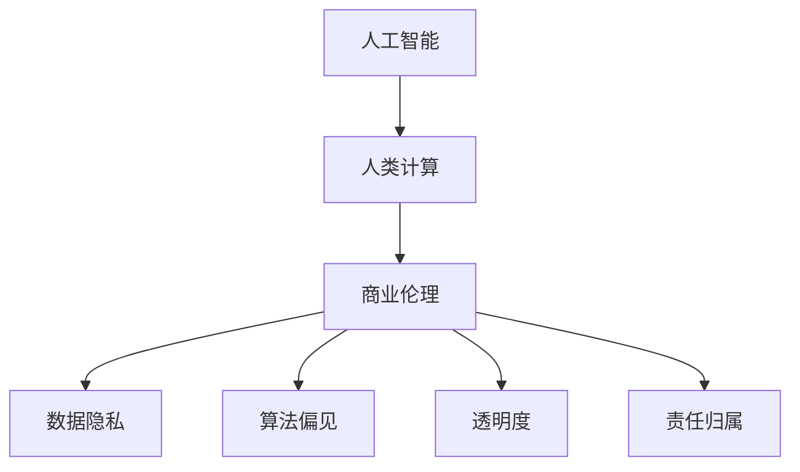

                 

# AI驱动的创新：人类计算在商业中的道德考虑因素展望机遇

## 1. 背景介绍

### 1.1 问题由来
人工智能(AI)技术近年来在商业应用中飞速发展，AI驱动的创新正成为推动商业增长的关键动力。然而，随之而来的伦理道德问题也愈发凸显。如何在追求技术进步和商业成功的同时，兼顾人类的福祉和道德伦理，成为社会各界关注的焦点。

### 1.2 问题核心关键点
本节将探讨AI驱动的创新在商业中的应用及其道德考量，以期为AI技术的应用提供更全面的指引。

1. **数据隐私与安全**：AI系统在处理用户数据时，如何保护隐私权，防止数据泄露和滥用。
2. **公平与偏见**：AI模型在决策过程中如何避免对特定群体产生偏见，确保决策的公正性。
3. **透明性与可解释性**：AI决策的透明性和可解释性问题，即如何让AI的决策过程更加透明，方便人类理解和信任。
4. **责任归属与伦理责任**：在AI系统出现错误或造成损害时，如何明确责任归属，并确保伦理责任的承担。
5. **人类计算与自动化**：AI技术如何与人类计算协同工作，提升效率的同时保留人类的判断力和创造力。

### 1.3 问题研究意义
探讨AI驱动的创新在商业中的道德考量，不仅有助于规范AI技术的应用，还能促进技术与社会伦理的和谐共生，推动商业创新与伦理道德的协同发展。

## 2. 核心概念与联系

### 2.1 核心概念概述

为更好地理解AI在商业中的应用及其道德考量，本节将介绍几个核心概念：

- **人工智能(AI)**：通过算法和数据训练，使计算机系统具备类似人类智能的能力，包括学习、推理、感知等。
- **人类计算(Human Computing)**：将AI与人类智能相结合，使人类在复杂任务中发挥更大的作用，提升工作效率和创造力。
- **商业伦理(Ethical Commerce)**：企业在商业活动中应遵循的伦理原则和道德规范，包括对用户隐私、公平性、透明性等的重视。
- **数据隐私(Portable Data Privacy)**：保护个人数据免遭非法收集、使用或泄露的权益。
- **算法偏见(Algorithmic Bias)**：指AI算法在处理数据时，可能因数据集的不平衡、模型设计的缺陷等原因，对某些群体产生不公正的歧视。
- **透明度(Transparency)**：指AI决策过程的清晰度和可解释性，便于用户理解和信任。
- **责任归属(Responsibility Attribution)**：指在AI系统出错或造成伤害时，明确责任主体的过程。

这些概念之间的逻辑关系可以通过以下Mermaid流程图来展示：



这个流程图展示了大语言模型的工作原理和优化方向：

1. AI通过数据和算法训练生成模型，具备智能处理能力。
2. 人类计算将AI与人类智能结合，提升决策和创新效率。
3. 商业伦理规范AI应用，强调隐私保护、公平性和透明性。
4. 数据隐私和算法偏见影响AI系统的公正性和可靠性。
5. 透明度和责任归属保障AI系统的信任度和责任界定。

这些概念共同构成了AI在商业应用中的伦理框架，指导企业在技术创新中兼顾道德考量。

## 3. 核心算法原理 & 具体操作步骤
### 3.1 算法原理概述

AI驱动的创新在商业中的核心算法原理主要围绕数据处理、模型训练和决策过程展开。其中，基于监督学习的机器学习模型是AI创新的主要驱动力。

### 3.2 算法步骤详解

AI驱动的商业创新通常遵循以下步骤：

1. **数据收集与预处理**：从各种渠道收集相关数据，并对数据进行清洗、标注等预处理工作。
2. **模型训练**：使用收集到的数据对AI模型进行训练，调整模型参数以优化其预测能力。
3. **部署与应用**：将训练好的模型部署到商业系统中，实现自动化决策或辅助决策。
4. **效果评估与优化**：通过实际应用中的数据反馈，评估模型效果并进行优化调整。

### 3.3 算法优缺点

AI驱动的商业创新在提升效率和创造价值的同时，也面临一些挑战：

- **优点**：
  - **效率提升**：AI能够快速处理大量数据，提升决策效率。
  - **创新能力**：AI可以发现人类难以察觉的模式，促进商业创新。
  - **个性化服务**：AI能提供高度定制化的服务，提升用户体验。

- **缺点**：
  - **依赖数据**：AI系统的性能高度依赖于数据质量，数据偏见可能导致决策不公平。
  - **可解释性差**：许多AI模型，如深度神经网络，难以解释其决策过程，用户难以信任。
  - **风险控制**：AI系统出错或滥用时，责任归属难以明确，带来法律和伦理风险。

### 3.4 算法应用领域

AI驱动的创新在商业中广泛应用于多个领域，包括但不限于：

- **金融科技**：用于风险评估、欺诈检测、客户服务自动化等。
- **医疗健康**：辅助诊断、药物研发、个性化治疗等。
- **零售电商**：推荐系统、库存管理、客户行为分析等。
- **制造与物流**：智能生产、供应链优化、预测维护等。
- **交通运输**：自动驾驶、交通流量预测、智能调度等。

## 4. 数学模型和公式 & 详细讲解 & 举例说明（备注：数学公式请使用latex格式，latex嵌入文中独立段落使用 $$，段落内使用 $)
### 4.1 数学模型构建

基于监督学习的AI商业创新模型通常采用如下数学模型：

$$
f(x;\theta) = \sum_{i=1}^{n} w_i \phi(x_i)
$$

其中 $f(x;\theta)$ 表示模型预测结果，$x$ 为输入数据，$\theta$ 为模型参数，$w_i$ 为权重，$\phi(x_i)$ 为特征映射。

### 4.2 公式推导过程

以线性回归模型为例，其公式推导过程如下：

1. **假设模型**：设 $y = f(x;\theta) = \theta_0 + \sum_{i=1}^{n} \theta_i x_i$。
2. **损失函数**：采用均方误差损失函数 $L(y,f(x;\theta)) = \frac{1}{2N} \sum_{i=1}^{N}(y_i - f(x_i;\theta))^2$。
3. **参数更新**：使用梯度下降算法更新参数 $\theta$：$\theta = \theta - \eta \frac{\partial L}{\partial \theta}$，其中 $\eta$ 为学习率。

### 4.3 案例分析与讲解

以金融风险评估为例，模型的输入为贷款申请的各类信息，输出为贷款违约的概率。通过大量历史数据训练模型，可以预测新申请贷款的违约风险，辅助金融机构做出决策。

## 5. 项目实践：代码实例和详细解释说明
### 5.1 开发环境搭建

为进行AI商业创新项目开发，需要搭建以下开发环境：

1. **Python环境**：使用Python 3.x版本，安装必要的库，如numpy、pandas、scikit-learn等。
2. **机器学习库**：安装scikit-learn、TensorFlow、PyTorch等常用机器学习库。
3. **数据集准备**：收集相关领域的标注数据集，并进行预处理，如归一化、特征工程等。

### 5.2 源代码详细实现

以下是使用Python和scikit-learn库进行线性回归模型开发的示例代码：

```python
from sklearn.linear_model import LinearRegression
from sklearn.metrics import mean_squared_error

# 准备数据
X = [[1], [2], [3], [4], [5]]
y = [2, 4, 6, 8, 10]

# 初始化模型
model = LinearRegression()

# 训练模型
model.fit(X, y)

# 预测结果
X_test = [[6], [7], [8]]
y_pred = model.predict(X_test)

# 评估结果
mse = mean_squared_error(y_test, y_pred)
print(f"Mean Squared Error: {mse}")
```

### 5.3 代码解读与分析

代码中的关键步骤包括：

- **数据准备**：将输入数据和输出结果封装为numpy数组。
- **模型初始化**：使用scikit-learn的线性回归模型。
- **模型训练**：使用训练集数据拟合模型参数。
- **预测与评估**：使用测试集数据进行预测，并计算预测结果的均方误差。

## 6. 实际应用场景
### 6.1 智能客服

AI驱动的智能客服系统可以提升客户服务效率，降低运营成本。系统通过收集用户历史咨询记录，训练自然语言处理模型，实现自动应答。系统自动分析用户问题，选择最佳答案模板进行回复，提供24/7不间断服务。

### 6.2 精准推荐

AI推荐系统能够根据用户行为数据和历史偏好，提供个性化推荐，提升用户体验和转化率。系统通过分析用户浏览、点击、购买等行为数据，训练推荐模型，实现个性化商品推荐。

### 6.3 智能风控

AI驱动的金融风险评估系统能够实时监控和评估客户信用风险，辅助金融机构做出贷款决策。系统通过分析客户的信用记录、交易数据等，训练风险评估模型，预测贷款违约概率。

### 6.4 未来应用展望

未来，AI在商业中的应用将更加广泛和深入，主要趋势包括：

1. **自动化决策**：AI系统将承担更多决策任务，提升决策效率和精度。
2. **多模态融合**：融合视觉、语音等多模态数据，提升系统理解和处理复杂任务的能力。
3. **伦理与隐私保护**：通过数据匿名化、隐私计算等技术，确保数据隐私和安全。
4. **透明与可解释**：开发可解释性强的模型，增强用户信任。
5. **责任归属明确**：建立明确的责任归属机制，确保伦理责任的承担。

## 7. 工具和资源推荐
### 7.1 学习资源推荐

为帮助开发者掌握AI商业创新的关键技术和伦理考量，推荐以下学习资源：

1. **在线课程**：Coursera、edX等平台提供大量AI与商业伦理相关课程。
2. **书籍**：《AI伦理：全球视角》、《人工智能在商业中的应用》等书籍。
3. **博客与论文**：arXiv、Medium等平台发布大量前沿研究和技术文章。
4. **社区与论坛**：Stack Overflow、GitHub等社区平台，可获取实践经验和交流。

### 7.2 开发工具推荐

以下工具可以帮助开发者高效进行AI商业创新项目：

1. **Python**：Python语言简单易用，生态系统丰富，适合AI开发。
2. **TensorFlow与PyTorch**：主流深度学习框架，支持高效模型训练和推理。
3. **Jupyter Notebook**：交互式开发环境，方便实验与分享。
4. **AWS、Google Cloud**：云计算平台，提供高性能算力支持。
5. **HuggingFace**：自然语言处理库，包含预训练模型和工具。

### 7.3 相关论文推荐

以下是几篇关于AI商业创新伦理的重要论文，推荐阅读：

1. **《人工智能伦理与社会责任》**：探讨AI技术的伦理原则和社会责任。
2. **《数据隐私与人工智能》**：分析数据隐私在AI应用中的保护问题。
3. **《AI决策透明性与可解释性》**：研究如何提高AI决策的透明度和可解释性。
4. **《AI系统的责任归属》**：讨论AI系统出错时责任归属的问题。

## 8. 总结：未来发展趋势与挑战
### 8.1 研究成果总结

AI驱动的商业创新在提升效率、推动创新、增强用户体验等方面发挥了巨大作用。然而，其在数据隐私、公平性、透明性、责任归属等方面的伦理挑战也日益凸显。

### 8.2 未来发展趋势

未来AI在商业中的应用将更加广泛，主要趋势包括：

1. **自动化决策**：AI系统将承担更多决策任务，提升决策效率和精度。
2. **多模态融合**：融合视觉、语音等多模态数据，提升系统理解和处理复杂任务的能力。
3. **伦理与隐私保护**：通过数据匿名化、隐私计算等技术，确保数据隐私和安全。
4. **透明与可解释**：开发可解释性强的模型，增强用户信任。
5. **责任归属明确**：建立明确的责任归属机制，确保伦理责任的承担。

### 8.3 面临的挑战

尽管AI在商业中取得了显著成效，但在应用过程中仍面临诸多挑战：

1. **数据隐私**：用户数据隐私保护问题难以彻底解决，数据滥用风险增加。
2. **算法偏见**：AI模型可能因数据偏见产生歧视，影响公平性。
3. **透明性与可解释性**：AI模型的决策过程难以解释，用户信任度降低。
4. **责任归属**：AI系统出错或滥用时，责任归属不明确。
5. **伦理道德**：AI技术在商业应用中可能带来新的伦理道德问题。

### 8.4 研究展望

未来研究需要在以下几个方面寻求突破：

1. **隐私保护技术**：开发更为高效的数据隐私保护技术，保障用户数据安全。
2. **公平算法**：设计更为公平的AI算法，消除数据偏见。
3. **可解释性模型**：开发可解释性强的AI模型，增强用户信任。
4. **责任归属机制**：建立明确的AI系统责任归属机制，确保伦理责任的承担。
5. **伦理教育**：加强AI伦理教育，提升社会对AI技术的理解和认知。

## 9. 附录：常见问题与解答

**Q1：如何在AI系统中实现隐私保护？**

A: 在数据收集和处理过程中，采取以下措施保护隐私：
1. **数据匿名化**：对数据进行去标识化处理，使数据难以追溯到个体。
2. **差分隐私**：在数据查询时添加噪声，使攻击者难以从数据中提取信息。
3. **数据加密**：对敏感数据进行加密，防止数据泄露。
4. **访问控制**：限制数据访问权限，仅授权人员可以访问敏感数据。

**Q2：如何避免AI算法的偏见？**

A: 为避免算法偏见，可以采取以下措施：
1. **多样性数据集**：确保数据集的多样性，涵盖不同群体。
2. **公平算法**：设计公平性指标，评估和调整模型。
3. **偏见检测**：定期检测模型中的偏见，并进行调整。
4. **透明性**：保持算法和决策过程的透明，便于用户理解和信任。

**Q3：如何提高AI系统的可解释性？**

A: 为提高AI系统的可解释性，可以采取以下措施：
1. **规则建模**：在模型中加入明确规则，使决策过程透明。
2. **可解释性算法**：选择可解释性强的模型，如决策树、线性回归等。
3. **解释工具**：使用解释工具，如LIME、SHAP等，分析模型决策过程。
4. **用户反馈**：通过用户反馈，不断改进模型，提高可解释性。

**Q4：如何在AI系统出错时明确责任归属？**

A: 为明确AI系统责任归属，可以采取以下措施：
1. **合同与协议**：通过合同和协议明确各方责任。
2. **责任保险**：购买责任保险，减轻风险。
3. **责任跟踪**：记录系统运行日志，便于责任追溯。
4. **责任归属机制**：建立明确的责任归属机制，确保伦理责任的承担。

---

作者：禅与计算机程序设计艺术 / Zen and the Art of Computer Programming

