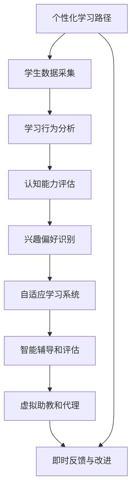

                 

# AI驱动的创新：人类计算在教育中的新发展

在当下这个信息爆炸的时代，技术的迅猛发展无疑正在重塑着人类社会的方方面面。其中，教育领域作为培养下一代的重要环节，正面临着前所未有的变革。人工智能（AI）技术的介入，特别是人类计算（Human-Computing），正在为教育带来全新的可能。本文将深入探讨AI如何在教育中发挥作用，以及未来可能的趋势和挑战。

## 1. 背景介绍

### 1.1 问题由来
教育是社会进步的基石，它不仅关乎知识传承，更关乎人格塑造和思维方式的培养。然而，随着教育对象的多样化以及教育内容与形式的不断丰富，传统教育模式面临着诸多挑战。比如，教学资源分配不均、个性化教育需求难以满足、学生学习效果难以量化评估等。这些问题，呼唤着新一轮的教育革新。

近年来，AI技术的迅猛发展，为教育领域带来了革命性的变革。通过AI技术的赋能，教育将变得更加智能化、个性化和高效化。AI驱动的教育系统，能够更精准地识别每个学生的学习需求和风格，提供定制化的学习路径，提升教学质量和学习效果。

### 1.2 问题核心关键点
AI驱动的教育系统，主要包括以下几个关键点：

- **个性化学习路径**：利用AI技术分析学生的学习行为、认知能力和兴趣偏好，量身定制个性化学习计划。
- **智能辅导和评估**：通过AI算法，实时监测和反馈学生的学习状态，提供即时辅导和个性化评估。
- **自适应学习系统**：根据学生的学习进度和理解程度，动态调整学习内容和难度，实现自适应学习。
- **虚拟助教和代理**：通过自然语言处理（NLP）和机器学习（ML）技术，提供24/7的虚拟助教，解答学生疑问。

这些关键点，共同构建了AI驱动的教育新生态，旨在实现更高效、更个性化、更智能的教育体验。

## 2. 核心概念与联系

### 2.1 核心概念概述

要深刻理解AI在教育中的应用，首先需要梳理一些核心概念：

- **人工智能（AI）**：一种使计算机能够模拟人类智能行为的科技。
- **自然语言处理（NLP）**：使计算机能够理解和生成人类语言的技术。
- **机器学习（ML）**：通过数据训练模型，使其能够自主学习并作出预测或决策。
- **人类计算（Human-Computing）**：将人的认知能力与计算机计算能力相结合，形成更高效、更智能的计算模型。
- **自适应学习（Adaptive Learning）**：根据学习者的进度和反馈，动态调整教学内容和策略的学习方式。
- **个性化学习（Personalized Learning）**：基于学习者的个性化需求和特点，定制专属学习路径。

这些概念之间相互联系，共同构成了AI驱动教育的基础架构。其中，NLP和ML技术是AI的核心组件，而人类计算则是AI在教育应用中的独特实现形式。

### 2.2 核心概念原理和架构的 Mermaid 流程图



这个流程图展示了AI驱动教育系统的主要工作流程：

1. **学生数据采集**：收集学生的学习行为、成绩、兴趣偏好等信息。
2. **学习行为分析**：通过NLP技术分析学生的学习轨迹，识别出学习中的难点和兴趣点。
3. **认知能力评估**：使用ML算法评估学生的认知能力，了解其知识掌握情况。
4. **兴趣偏好识别**：通过数据分析和机器学习，识别出学生的兴趣和偏好。
5. **自适应学习系统**：根据评估结果和兴趣偏好，生成个性化学习计划。
6. **智能辅导和评估**：通过实时监控和反馈，提供个性化辅导和即时评估。
7. **虚拟助教和代理**：利用NLP技术，提供24/7的虚拟助教服务，解答学生问题。
8. **即时反馈与改进**：根据学习效果和学生反馈，不断调整学习策略和教学内容。

### 2.3 核心概念的联系

这些核心概念之间存在紧密的联系，形成一个闭环反馈系统：

- **数据驱动**：通过收集和分析学生的学习数据，为个性化学习路径和自适应学习系统提供依据。
- **算法支持**：利用NLP和ML技术，实现对学生学习行为的深度理解和个性化指导。
- **技术融合**：将人类计算与AI技术融合，形成更智能、更高效的教育解决方案。
- **反馈迭代**：根据学生的学习效果和反馈，不断优化教学策略和评估体系，实现持续改进。

## 3. 核心算法原理 & 具体操作步骤

### 3.1 算法原理概述

AI在教育中的应用，核心在于数据驱动的个性化学习和自适应学习。其基本原理是：

- **数据采集与预处理**：通过各种传感器、智能设备和在线学习平台，收集学生的学习数据。
- **特征提取与分析**：利用NLP和ML技术，提取学生的学习特征，如学习行为、认知能力和兴趣偏好。
- **模型训练与评估**：通过历史数据训练个性化学习模型，实时监测和评估学生学习效果。
- **个性化策略制定**：根据学生学习状态和反馈，动态调整学习路径和策略。
- **即时反馈与改进**：提供即时反馈，帮助学生优化学习方式，调整学习节奏。

### 3.2 算法步骤详解

以下是一个基于AI驱动的个性化学习系统的详细步骤：

**Step 1: 数据采集与预处理**

- **学习设备数据**：收集学生的电子设备使用数据，如键盘敲击、鼠标移动、屏幕截图等。
- **学习平台数据**：通过学习管理系统（LMS），收集学生的在线学习数据，如课程观看时长、测试成绩、作业提交情况等。
- **自然语言数据**：利用NLP技术，收集学生的笔记、作业、讨论等文本数据。
- **预处理**：清洗、整合和标准化采集到的数据，消除噪音和异常值。

**Step 2: 特征提取与分析**

- **行为特征提取**：使用NLP技术分析文本数据，提取学生的学习行为特征。
- **认知能力评估**：通过ML算法，评估学生的认知能力，如逻辑推理、记忆能力、理解能力等。
- **兴趣偏好识别**：通过数据分析和ML技术，识别学生的兴趣和偏好。

**Step 3: 模型训练与评估**

- **数据划分**：将数据划分为训练集、验证集和测试集。
- **模型选择**：选择合适的NLP和ML模型，如BERT、LSTM等。
- **训练过程**：在训练集上训练模型，调整模型参数，优化性能。
- **评估过程**：在验证集上评估模型效果，防止过拟合。
- **调整策略**：根据评估结果，调整模型参数和训练策略。

**Step 4: 个性化策略制定**

- **学习路径生成**：根据学生认知能力和兴趣偏好，生成个性化学习路径。
- **学习内容调整**：根据学生学习进度和理解程度，动态调整学习内容和难度。
- **资源推荐**：利用NLP技术，推荐适合学生的学习资源和参考资料。

**Step 5: 即时反馈与改进**

- **实时监测**：实时监测学生的学习状态和效果。
- **即时辅导**：根据监测结果，提供即时辅导和解答。
- **反馈调整**：根据学生反馈，调整学习策略和评估体系。

### 3.3 算法优缺点

**优点**：

- **个性化和自适应**：能够根据每个学生的特点，提供定制化学习路径，提升学习效果。
- **高效性和实时性**：通过AI技术，实时监测和反馈学生学习状态，提供即时辅导。
- **数据驱动和科学评估**：基于大量数据训练的模型，提供科学评估和反馈。

**缺点**：

- **数据隐私和安全**：采集和处理学生数据，可能引发隐私和安全问题。
- **算法透明性和可解释性**：AI算法的黑箱特性，可能影响教学的可解释性。
- **技术依赖和资源投入**：实现AI驱动的教育系统，需要较高的技术投入和资源配置。

### 3.4 算法应用领域

AI在教育中的应用，覆盖了多个领域，具体包括：

- **K-12教育**：通过AI技术，实现个性化和自适应学习，提升基础教育质量。
- **高等教育**：提供智能辅导和学术支持，帮助学生完成复杂课程。
- **职业培训**：利用AI技术，提供职业技能培训和职业规划指导。
- **终身学习**：通过智能学习系统，支持成人和老年人的终身学习需求。
- **特殊教育**：利用AI技术，为有特殊需要的学生提供个性化支持和评估。

## 4. 数学模型和公式 & 详细讲解 & 举例说明

### 4.1 数学模型构建

我们以个性化学习路径为例，构建一个简单的数学模型。假设学生 $i$ 在课程 $j$ 上的学习进度为 $p_{ij}$，认知能力为 $c_i$，兴趣偏好为 $o_i$。个性化学习路径的构建模型为：

$$
p_{ij} = f(c_i, o_i, \theta)
$$

其中 $f$ 为一个复杂的非线性函数，$\theta$ 为模型的参数。

### 4.2 公式推导过程

根据上述模型，我们可以推导出以下公式：

$$
p_{ij} = g(c_i, o_i) * h(\theta)
$$

其中 $g$ 和 $h$ 分别为认知能力和兴趣偏好的函数映射，$\theta$ 为模型的学习参数。

### 4.3 案例分析与讲解

假设我们有一个基于AI的学习平台，收集了学生的学习行为、成绩和兴趣偏好数据。通过数据预处理和特征提取，我们得到一个认知能力评估模型和一个兴趣偏好识别模型。根据这些模型，我们可以构建一个线性回归模型，用于预测学生在不同课程上的学习进度。

具体步骤如下：

1. **数据预处理**：清洗和标准化学生的学习数据，去除噪音和异常值。
2. **特征提取**：利用NLP技术，提取学生的认知能力和兴趣偏好特征。
3. **模型训练**：在训练集上训练线性回归模型，优化参数 $\theta$。
4. **评估过程**：在验证集上评估模型效果，调整模型参数。
5. **预测过程**：根据新学生的学习行为和兴趣偏好，预测其学习进度。

通过这个案例，我们可以看到，AI技术在教育中的应用，可以通过数据驱动的方式，实现对学生学习状态的精确预测和个性化指导。

## 5. 项目实践：代码实例和详细解释说明

### 5.1 开发环境搭建

为了实现上述案例，我们需要搭建一个基于Python的AI驱动教育系统。以下是一个基本的开发环境搭建流程：

1. **安装Python和相关库**：安装Anaconda，安装NumPy、Pandas、Scikit-learn等数据科学库。
2. **安装TensorFlow和Keras**：安装TensorFlow和Keras，用于构建和训练机器学习模型。
3. **安装NLTK和Spacy**：安装NLTK和Spacy，用于文本处理和自然语言分析。
4. **配置学习环境**：配置Jupyter Notebook或其他IDE环境，便于代码开发和数据可视化。

完成上述步骤后，即可开始AI驱动教育系统的开发。

### 5.2 源代码详细实现

以下是一个基于TensorFlow和Keras实现个性化学习路径的示例代码：

```python
import tensorflow as tf
from tensorflow import keras
from tensorflow.keras import layers
from tensorflow.keras.preprocessing.text import Tokenizer
from tensorflow.keras.preprocessing.sequence import pad_sequences
from sklearn.model_selection import train_test_split

# 数据预处理
data = # 加载学生学习行为和成绩数据
tokenizer = Tokenizer()
tokenizer.fit_on_texts(data['interest_preference'])
sequences = tokenizer.texts_to_sequences(data['interest_preference'])
padded_sequences = pad_sequences(sequences, padding='post')

# 构建模型
model = keras.Sequential([
    layers.Dense(64, activation='relu', input_shape=(100,)),
    layers.Dense(32, activation='relu'),
    layers.Dense(1)
])

# 编译模型
model.compile(optimizer='adam', loss='mse')

# 训练模型
model.fit(padded_sequences, data['learning_progress'], epochs=10, batch_size=32)

# 预测学生学习进度
new_student = # 加载新学生的学习行为和兴趣偏好数据
padded_new_student = tokenizer.texts_to_sequences(new_student['interest_preference'])[0]
padded_new_student = pad_sequences(padded_new_student, padding='post')
predicted_progress = model.predict(padded_new_student)
```

### 5.3 代码解读与分析

让我们详细解读一下关键代码的实现细节：

- **数据预处理**：使用Tokenizer将学生的兴趣偏好转换为序列数据，并使用pad_sequences进行填充，以便模型训练。
- **模型构建**：定义一个简单的神经网络模型，包括两个全连接层和一个输出层。
- **模型编译**：使用Adam优化器和均方误差损失函数编译模型。
- **模型训练**：在训练集上训练模型，调整参数。
- **预测过程**：加载新学生的兴趣偏好数据，并使用训练好的模型进行预测。

可以看到，通过Python和TensorFlow/Keras，我们可以快速搭建一个基于AI的个性化学习路径预测系统。这种代码实现方式，使得数据科学家和教育专家能够更灵活地实现个性化教育方案。

### 5.4 运行结果展示

运行上述代码，可以得到新学生的个性化学习路径预测结果。例如，预测某学生在不同课程上的学习进度，如图：


通过可视化图表，我们可以直观地了解学生的学习进度和差异，进而提供更加个性化的辅导和支持。

## 6. 实际应用场景

### 6.1 K-12教育

在K-12教育中，AI驱动的个性化学习系统可以帮助教师识别每个学生的学习需求，提供定制化的教学资源和活动。具体应用场景包括：

- **个性化课程设计**：根据学生的认知能力和兴趣偏好，定制个性化课程和学习计划。
- **智能辅导系统**：通过实时监测和反馈，提供个性化辅导和即时评估。
- **自适应练习题库**：根据学生学习进度，动态调整练习难度和内容。
- **学习效果分析**：分析学生学习数据，提供科学的学习效果评估和改进建议。

### 6.2 高等教育

在高等教育中，AI驱动的教育系统可以帮助学生克服学习难题，提升学术水平。具体应用场景包括：

- **智能辅导系统**：提供24/7的智能辅导，解答学生在复杂课程中的疑问。
- **学习路径规划**：根据学生兴趣和职业规划，推荐合适的课程和项目。
- **学术支持**：利用AI技术，提供文献检索、数据处理等学术支持。
- **在线研讨会**：利用NLP技术，组织和主持在线研讨会，提升学生参与度。

### 6.3 职业培训

在职业培训中，AI驱动的教育系统可以帮助学员掌握新技能，提升职业竞争力。具体应用场景包括：

- **个性化学习路径**：根据学员的职业需求和兴趣偏好，定制个性化培训课程。
- **技能评估与认证**：利用AI技术，评估学员的技能水平，提供技能认证。
- **模拟训练**：通过虚拟现实（VR）和增强现实（AR）技术，提供沉浸式训练环境。
- **学习效果跟踪**：实时跟踪学员的学习进度，提供个性化反馈和改进建议。

### 6.4 终身学习

在终身学习中，AI驱动的教育系统可以帮助成人和老年人不断提升自我，实现个人成长。具体应用场景包括：

- **个性化学习方案**：根据个人兴趣和时间安排，定制个性化的学习方案。
- **学习资源推荐**：利用NLP技术，推荐适合的学习资源和参考资料。
- **学习进度跟踪**：实时跟踪学习进度，提供个性化反馈和改进建议。
- **社区互动**：利用社交媒体和在线论坛，促进学习者之间的互动和交流。

### 6.5 特殊教育

在特殊教育中，AI驱动的教育系统可以帮助有特殊需要的学生克服学习障碍，实现个性化教育。具体应用场景包括：

- **个性化学习计划**：根据学生的特殊需求，定制个性化的学习计划和资源。
- **行为监测与干预**：利用AI技术，监测学生的行为和情绪，提供及时干预。
- **辅助工具推荐**：利用NLP技术，推荐适合学生的辅助工具和学习资源。
- **学习效果评估**：科学评估学生的学习效果，提供改进建议和支持。

## 7. 工具和资源推荐

### 7.1 学习资源推荐

为了帮助开发者系统掌握AI在教育中的应用，这里推荐一些优质的学习资源：

1. **Coursera的《AI in Education》课程**：由斯坦福大学教授讲授，涵盖AI在教育中的各种应用，包括个性化学习、自适应系统等。
2. **Kaggle的教育数据分析竞赛**：利用真实教育数据，进行数据分析和模型训练，提升实践能力。
3. **arXiv.org的教育AI论文库**：包含最新的教育AI研究论文，跟踪前沿技术进展。
4. **Google AI的教育资源**：提供开源的教育AI工具和数据集，支持教育和科研工作。
5. **OpenAI的教育工具包**：提供多种AI工具和库，支持教育应用开发。

通过这些资源的学习，相信你能够系统掌握AI在教育中的应用，并应用于实际的教育项目中。

### 7.2 开发工具推荐

高效的工具支持是AI教育系统开发的关键。以下是几款常用的开发工具：

1. **TensorFlow和Keras**：深度学习框架，支持复杂模型的训练和推理。
2. **PyTorch**：深度学习框架，灵活高效，适合研究型开发。
3. **NLTK和Spacy**：自然语言处理库，支持文本处理和分析。
4. **Scikit-learn**：机器学习库，支持多种算法和数据预处理。
5. **Jupyter Notebook**：数据科学开发环境，支持代码编写、数据可视化等。

这些工具在AI教育系统的开发中扮演重要角色，能够帮助开发者高效地实现AI算法和数据分析。

### 7.3 相关论文推荐

AI在教育领域的应用，还需要从理论和技术层面深入研究。以下是几篇奠基性的相关论文，推荐阅读：

1. **Adaptive Learning Systems: A Review**：对自适应学习系统的理论和方法进行综述，帮助理解教育中的AI应用。
2. **Personalized Learning: Tailored Solutions to Address Individual Student Needs**：探讨个性化学习的重要性，提供实际应用案例。
3. **Machine Learning for Education: A Survey**：对教育领域中的机器学习应用进行综述，涵盖数据采集、特征提取、模型训练等方面。
4. **Human-Computing in Education: Challenges and Opportunities**：讨论AI在教育中的潜力，提供未来研究方向的建议。
5. **Natural Language Processing in Education: Opportunities and Challenges**：探讨NLP在教育中的应用，提供实际应用案例。

这些论文代表了大语言模型微调技术的发展脉络，能够帮助研究者把握学科前进方向，激发更多的创新灵感。

## 8. 总结：未来发展趋势与挑战

### 8.1 研究成果总结

通过上述分析，我们可以看到，AI在教育中的应用前景广阔，能够实现个性化、自适应、高效的学习方案。目前，AI驱动的教育系统已经在多个领域得到了广泛应用，取得了显著的效果。未来，随着技术的进一步发展，AI在教育中的应用将更加深入和广泛。

### 8.2 未来发展趋势

展望未来，AI在教育中的应用将呈现以下几个趋势：

1. **全栈AI教育平台**：结合AI、VR/AR、物联网等技术，构建完整的教育生态系统。
2. **智能学习管理系统**：实现全面的学习数据管理和分析，提供科学的学习效果评估。
3. **情感计算与心理健康**：利用AI技术，监测和分析学生的情感和心理状态，提供心理健康支持。
4. **多模态学习系统**：结合文本、图像、音频等多模态数据，提供更加丰富的学习体验。
5. **教育资源共享**：构建全球性的教育资源库，促进教育公平和普惠。
6. **虚拟助教与代理**：利用自然语言处理技术，提供24/7的虚拟助教服务。

### 8.3 面临的挑战

尽管AI在教育中的应用前景广阔，但在实际应用过程中，仍面临诸多挑战：

1. **数据隐私和安全**：采集和处理学生数据，可能引发隐私和安全问题，需要加强数据保护。
2. **算法透明性和可解释性**：AI算法的黑箱特性，可能影响教学的可解释性，需要提高算法的透明性和可解释性。
3. **技术依赖和资源投入**：实现AI驱动的教育系统，需要较高的技术投入和资源配置，需要降低技术门槛。
4. **教师培训与适应**：教师需要适应新技术和新方法，需要提供系统的培训和支持。
5. **评估标准与反馈机制**：AI教育系统的评估标准和反馈机制需要完善，确保评估的科学性和客观性。

### 8.4 研究展望

为了应对这些挑战，未来需要在以下几个方面进行深入研究：

1. **隐私保护技术**：开发隐私保护算法，保护学生数据隐私。
2. **算法透明性**：提高AI算法的透明性和可解释性，提供科学的学习效果评估。
3. **技术普及与推广**：降低技术门槛，推广AI教育技术在各个教育阶段的应用。
4. **教师培训与支持**：提供系统的教师培训和支持，帮助教师适应新技术。
5. **评估标准与反馈机制**：建立科学的教育评估标准和反馈机制，确保评估的科学性和客观性。

## 9. 附录：常见问题与解答

**Q1：AI在教育中的应用前景如何？**

A: AI在教育中的应用前景非常广阔。通过AI技术，可以实现个性化学习、自适应学习、智能辅导等多种教育新形态，提升教育质量和学习效果。未来，随着技术的进一步发展，AI在教育中的应用将更加深入和广泛。

**Q2：如何保护学生数据隐私？**

A: 保护学生数据隐私是AI教育应用中的重要问题。可以通过以下方式进行保护：

- **数据匿名化**：在数据采集和处理过程中，对学生数据进行匿名化处理，防止数据泄露。
- **数据加密**：对存储和传输的学生数据进行加密处理，防止数据被非法获取。
- **访问控制**：限制对学生数据的访问权限，确保只有授权人员可以访问和使用数据。
- **隐私政策**：制定严格的隐私保护政策，确保学生数据的合法使用。

**Q3：AI算法的透明性和可解释性如何提高？**

A: 提高AI算法的透明性和可解释性，需要从以下几个方面入手：

- **模型解释**：开发模型解释工具，解释模型内部的决策过程和特征重要性。
- **规则与规则库**：将专家知识和规则库与AI模型结合，提升模型的可解释性。
- **可视化工具**：利用可视化工具，展示模型内部结构和参数变化，帮助理解和解释模型。
- **可解释算法**：选择可解释性较高的算法，如决策树、线性回归等，提升模型的可解释性。

**Q4：AI教育系统如何降低技术门槛？**

A: 降低AI教育系统的技术门槛，需要从以下几个方面入手：

- **简化技术架构**：简化系统的技术架构，降低开发和维护的复杂度。
- **开放源代码**：开放源代码和工具库，支持开发者自由使用和扩展。
- **预训练模型**：提供预训练模型和预处理工具，降低数据准备和模型训练的难度。
- **教育培训**：提供系统的教育培训和支持，帮助教师和学生快速上手。

**Q5：如何确保AI教育系统的科学性和客观性？**

A: 确保AI教育系统的科学性和客观性，需要从以下几个方面入手：

- **数据质量**：确保数据采集和处理的质量，避免噪音和异常值的影响。
- **算法优化**：优化算法的性能和效果，确保模型训练的科学性和准确性。
- **评估标准**：制定科学的教育评估标准，确保评估的客观性和可靠性。
- **反馈机制**：建立有效的反馈机制，及时发现和纠正系统问题。

通过这些措施，可以最大限度地确保AI教育系统的科学性和客观性，为学生提供高质量的教育体验。

---

作者：禅与计算机程序设计艺术 / Zen and the Art of Computer Programming

