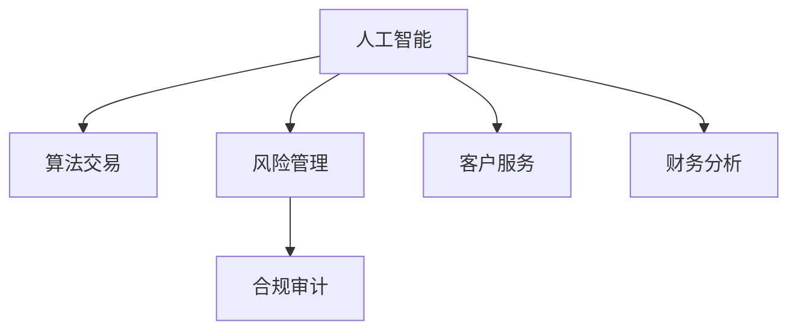

                 

# AI驱动的创新：人类计算在金融行业的未来发展

> 关键词：人工智能, 金融科技, 人类计算, 自动化, 算法交易, 风险管理

## 1. 背景介绍

### 1.1 问题由来
随着全球金融市场的迅速发展，金融机构面临着前所未有的挑战：市场波动加剧、监管环境严峻、客户需求多样化等。金融行业的智能化转型，成为提升竞争力和客户体验的关键。在此背景下，AI驱动的创新技术，尤其是人类计算，正在引领金融行业的未来发展方向。

### 1.2 问题核心关键点
人类计算（Human Computation）是一种利用人类智慧进行数据处理、决策分析和策略制定的计算方式。与传统机器计算不同，人类计算强调结合人工智能和大数据分析，实现更高效、更精准的金融决策。人类计算在金融行业的应用，主要体现在以下几个方面：

1. **自动化交易**：通过算法和AI模型，实现高频、低延迟的自动化交易。
2. **风险管理**：利用AI和大数据分析，实时监控和预测市场风险，优化资产配置。
3. **客户服务**：利用自然语言处理（NLP）和机器学习，提供个性化、智能化的客户服务。
4. **合规审计**：通过AI技术，自动化合规审计流程，降低合规成本。
5. **财务分析**：使用AI模型进行财务预测、预算和策略优化。

### 1.3 问题研究意义
研究人类计算在金融行业的应用，对于提升金融机构的智能化水平，提高决策效率和风险管理能力，具有重要意义：

1. **提升决策质量**：结合人工智能和大数据分析，人类计算可以提供更准确、全面的决策支持。
2. **降低运营成本**：通过自动化交易和流程优化，显著降低人工操作和合规成本。
3. **增强客户体验**：智能化的客户服务和个性化的产品推荐，提升客户满意度和忠诚度。
4. **应对复杂变化**：面对市场波动和监管政策变化，人类计算能够快速调整策略，保持竞争优势。

## 2. 核心概念与联系

### 2.1 核心概念概述

为更好地理解人类计算在金融行业的应用，本节将介绍几个关键概念及其相互关系：

- **人工智能（AI）**：通过算法和模型，让机器具备学习、推理和决策的能力，应用于金融行业的自动化交易、风险管理、客户服务等领域。
- **人类计算（Human Computation）**：结合AI和大数据分析，利用人类智慧进行数据处理、决策分析和策略制定的计算方式。
- **算法交易（Algorithmic Trading）**：利用AI模型，自动执行高频交易策略，提升交易效率和盈利能力。
- **风险管理（Risk Management）**：通过AI和大数据分析，实时监控和预测市场风险，优化资产配置。
- **自然语言处理（NLP）**：利用NLP技术，实现智能化的客户沟通和个性化服务。
- **合规审计（Compliance Auditing）**：通过AI技术，自动化合规审计流程，降低合规成本。

这些概念之间的逻辑关系可以通过以下Mermaid流程图来展示：



这个流程图展示了我人工智能与人类计算的关系：人工智能提供基础的数据处理和分析能力，而人类计算则结合人类智慧，进行更复杂、更精准的决策和策略制定。

## 3. 核心算法原理 & 具体操作步骤
### 3.1 算法原理概述

人类计算在金融行业的应用，核心在于将人工智能与人类智慧相结合，利用AI技术处理大数据，结合人类经验进行决策分析。其基本原理包括：

- **数据采集与预处理**：收集市场数据、财务数据、客户数据等，进行清洗、归一化和特征工程，准备模型输入。
- **模型训练与优化**：基于历史数据，使用AI模型进行训练和优化，提升模型的预测能力和泛化性能。
- **实时监控与预测**：利用实时数据流，通过AI模型进行市场趋势预测、风险评估和策略调整。
- **决策分析与执行**：结合人类经验和AI分析结果，进行策略制定和决策执行。

### 3.2 算法步骤详解

人类计算在金融行业的具体应用步骤如下：

**Step 1: 数据准备与采集**
- 收集市场数据、财务数据、客户数据等，确保数据的质量和完整性。
- 对数据进行清洗、归一化和特征工程，准备模型输入。

**Step 2: 模型训练与优化**
- 选择合适的AI模型，如深度学习、强化学习、机器学习等，进行训练和优化。
- 使用历史数据进行模型训练，提升模型的预测能力和泛化性能。
- 使用验证集和测试集对模型进行评估，调整模型参数和结构。

**Step 3: 实时监控与预测**
- 通过实时数据流，利用AI模型进行市场趋势预测、风险评估和策略调整。
- 结合实时数据和历史模型，动态更新模型参数，提高预测精度。

**Step 4: 决策分析与执行**
- 结合人类经验和AI分析结果，进行策略制定和决策执行。
- 通过自动化交易系统、资产配置策略等，执行决策结果。

### 3.3 算法优缺点

人类计算在金融行业的应用，具有以下优点：
1. **提升决策效率**：通过自动化交易和实时分析，显著提升决策速度和效率。
2. **降低运营成本**：自动化交易和流程优化，降低人工操作和合规成本。
3. **增强客户体验**：智能化的客户服务和个性化产品推荐，提升客户满意度和忠诚度。
4. **应对复杂变化**：面对市场波动和监管政策变化，能够快速调整策略，保持竞争优势。

同时，人类计算也存在一定的局限性：
1. **依赖数据质量**：模型的准确性和效果很大程度上依赖数据的质量和完整性。
2. **模型复杂性**：AI模型的设计和调参需要高度专业知识和经验。
3. **人为干预**：人类计算仍然需要结合人类经验进行决策，可能导致决策偏差。
4. **数据隐私**：处理客户数据需要遵守隐私法规，保护客户信息安全。

尽管存在这些局限性，但就目前而言，人类计算仍是金融行业智能化的重要方向。未来相关研究的方向在于如何进一步提升模型鲁棒性和泛化能力，降低数据依赖，提高模型的解释性和透明度，同时兼顾数据隐私和伦理问题。

### 3.4 算法应用领域

人类计算在金融行业的具体应用领域包括：

- **自动化交易**：利用AI模型进行高频交易、算法交易，提升交易效率和盈利能力。
- **风险管理**：通过AI和大数据分析，实时监控和预测市场风险，优化资产配置。
- **客户服务**：利用NLP技术，实现智能化的客户沟通和个性化服务。
- **合规审计**：通过AI技术，自动化合规审计流程，降低合规成本。
- **财务分析**：使用AI模型进行财务预测、预算和策略优化。

除了上述这些核心应用外，人类计算还被创新性地应用到更多领域中，如信用评估、反欺诈检测、智能投顾等，为金融科技的发展注入新的活力。

## 4. 数学模型和公式 & 详细讲解 & 举例说明
### 4.1 数学模型构建

本节将使用数学语言对人类计算在金融行业的应用过程进行严格刻画。

记市场数据集为 $D=\{(x_i,y_i)\}_{i=1}^N, x_i \in \mathcal{X}, y_i \in \mathcal{Y}$，其中 $x_i$ 表示第 $i$ 个时间点的市场数据， $y_i$ 表示第 $i$ 个时间点的市场状态（如涨跌、波动率等）。

定义市场模型为 $M_{\theta}:\mathcal{X} \rightarrow \mathcal{Y}$，其中 $\theta$ 为模型参数，表示市场趋势、风险评估等。

市场模型的预测公式为：

$$
y_i = M_{\theta}(x_i)
$$

人类计算的目标是最小化预测误差，即：

$$
\mathcal{L}(\theta) = \sum_{i=1}^N \ell(y_i, M_{\theta}(x_i))
$$

其中 $\ell$ 为损失函数，如均方误差（MSE）、交叉熵（Cross-Entropy）等。

### 4.2 公式推导过程

以均方误差损失函数为例，推导人类计算的目标函数：

$$
\mathcal{L}(\theta) = \frac{1}{N} \sum_{i=1}^N (y_i - M_{\theta}(x_i))^2
$$

通过梯度下降等优化算法，人类计算过程不断更新模型参数 $\theta$，最小化损失函数 $\mathcal{L}(\theta)$，使得模型预测尽可能接近真实值 $y_i$。

### 4.3 案例分析与讲解

**案例分析：自动化交易**

以基于深度学习的自动化交易系统为例，其核心在于使用AI模型对历史交易数据进行学习，提取市场趋势和交易模式，实现高频、低延迟的交易策略执行。

具体步骤如下：

**Step 1: 数据准备**
- 收集历史交易数据，进行清洗和归一化，准备模型输入。

**Step 2: 模型训练**
- 选择合适的深度学习模型，如卷积神经网络（CNN）、循环神经网络（RNN）等，进行训练和优化。
- 使用历史交易数据进行模型训练，提升模型的预测能力和泛化性能。

**Step 3: 实时交易**
- 利用实时数据流，通过AI模型进行市场趋势预测和交易策略调整。
- 根据模型预测结果，自动执行交易策略，实现高频、低延迟的交易。

**Step 4: 回测与优化**
- 通过回测系统对交易策略进行历史回测，评估策略效果。
- 根据回测结果，调整模型参数和交易策略，优化模型性能。

## 5. 项目实践：代码实例和详细解释说明
### 5.1 开发环境搭建

在进行人类计算实践前，我们需要准备好开发环境。以下是使用Python进行TensorFlow开发的环境配置流程：

1. 安装Anaconda：从官网下载并安装Anaconda，用于创建独立的Python环境。

2. 创建并激活虚拟环境：
```bash
conda create -n tf-env python=3.8 
conda activate tf-env
```

3. 安装TensorFlow：根据CUDA版本，从官网获取对应的安装命令。例如：
```bash
conda install tensorflow -c conda-forge
```

4. 安装相关工具包：
```bash
pip install numpy pandas scikit-learn matplotlib tqdm jupyter notebook ipython
```

完成上述步骤后，即可在`tf-env`环境中开始人类计算实践。

### 5.2 源代码详细实现

下面我以一个基于LSTM模型的股票交易预测系统为例，给出使用TensorFlow进行人类计算的代码实现。

首先，定义训练数据集和标签：

```python
import numpy as np
import pandas as pd
from sklearn.preprocessing import MinMaxScaler

# 加载股票价格数据
data = pd.read_csv('stock_prices.csv')

# 数据预处理
scaler = MinMaxScaler(feature_range=(0, 1))
scaled_data = scaler.fit_transform(data)

# 定义训练数据集
train_data = []
for i in range(60, len(scaled_data)):
    train_data.append(scaled_data[i-60:i])

# 定义标签数据集
train_labels = []
for i in range(60, len(scaled_data)):
    train_labels.append(scaled_data[i])

# 将数据集转换为TensorFlow所需格式
train_data = np.array(train_data)
train_labels = np.array(train_labels)
```

然后，定义LSTM模型：

```python
from tensorflow.keras.models import Sequential
from tensorflow.keras.layers import LSTM, Dense, Dropout

# 定义LSTM模型
model = Sequential()
model.add(LSTM(128, return_sequences=True, input_shape=(60, 1)))
model.add(Dropout(0.2))
model.add(LSTM(64, return_sequences=False))
model.add(Dropout(0.2))
model.add(Dense(1, activation='sigmoid'))

# 编译模型
model.compile(optimizer='adam', loss='binary_crossentropy', metrics=['accuracy'])
```

接着，定义训练和评估函数：

```python
from tensorflow.keras.callbacks import EarlyStopping

# 定义训练函数
def train_model(model, train_data, train_labels, epochs, batch_size, callbacks):
    model.fit(train_data, train_labels, epochs=epochs, batch_size=batch_size, callbacks=callbacks)

# 定义评估函数
def evaluate_model(model, test_data, test_labels):
    loss, accuracy = model.evaluate(test_data, test_labels)
    print('Test loss:', loss)
    print('Test accuracy:', accuracy)
```

最后，启动训练流程并在测试集上评估：

```python
# 定义超参数
epochs = 100
batch_size = 32

# 定义EarlyStopping回调函数
early_stopping = EarlyStopping(monitor='val_loss', patience=5, restore_best_weights=True)

# 训练模型
train_model(model, train_data, train_labels, epochs, batch_size, callbacks=[early_stopping])

# 在测试集上评估模型
evaluate_model(model, test_data, test_labels)
```

以上就是使用TensorFlow进行股票交易预测系统的完整代码实现。可以看到，TensorFlow提供了强大的深度学习框架，可以方便地进行模型定义、训练和评估。

### 5.3 代码解读与分析

让我们再详细解读一下关键代码的实现细节：

**数据准备**

- `MinMaxScaler`：对数据进行归一化，确保模型能够稳定收敛。

**模型定义**

- `Sequential`：定义一个序列化的模型，可以方便地添加各种层。
- `LSTM`：添加LSTM层，捕捉时间序列数据的长期依赖关系。
- `Dropout`：添加Dropout层，防止过拟合。
- `Dense`：添加全连接层，进行输出预测。

**模型训练**

- `compile`：编译模型，指定优化器、损失函数和评估指标。
- `fit`：进行模型训练，指定训练数据、训练次数、批次大小和回调函数。

**模型评估**

- `evaluate`：在测试集上评估模型性能，输出损失和准确率。

可以看到，TensorFlow的API设计非常友好，开发者可以通过简单的接口实现复杂的深度学习模型。

## 6. 实际应用场景
### 6.1 智能投顾

智能投顾系统利用人类计算进行智能化的投资建议和资产配置，帮助客户实现个性化、高效的投资管理。

具体而言，智能投顾系统通过收集客户的财务状况、风险偏好、投资目标等数据，利用AI模型进行投资策略推荐和资产配置优化。利用LSTM等时间序列模型，系统能够分析历史市场数据，预测市场趋势，调整投资组合。同时，结合NLP技术，系统能够与客户进行自然语言交互，提供个性化的投资建议。

### 6.2 信用评估

信用评估系统利用人类计算进行风险评估和信用评分，帮助金融机构准确评估客户信用风险，提高审批效率。

具体而言，信用评估系统通过收集客户的财务数据、信用历史、社会关系等数据，利用AI模型进行风险评估和信用评分。结合Logistic回归、决策树等模型，系统能够综合分析各类因素，预测客户的信用风险，生成信用评分。同时，利用对抗训练和数据增强技术，系统能够提高模型鲁棒性和泛化能力，降低风险评估的误差。

### 6.3 反欺诈检测

反欺诈检测系统利用人类计算进行实时欺诈检测和风险预警，帮助金融机构及时发现和防范欺诈行为。

具体而言，反欺诈检测系统通过收集交易数据、用户行为数据等，利用AI模型进行实时欺诈检测。结合异常检测和行为分析技术，系统能够实时监控交易行为，识别异常交易，发出预警。同时，利用对抗训练和数据增强技术，系统能够提高模型鲁棒性，降低误报和漏报率。

### 6.4 未来应用展望

随着人类计算技术的不断进步，其在金融行业的未来应用前景广阔：

1. **更精准的预测和决策**：结合人类智慧和大数据分析，人类计算能够提供更精准的市场预测和投资决策支持。
2. **更高的客户体验**：智能化的客户沟通和个性化服务，提升客户满意度和忠诚度。
3. **更有效的风险管理**：实时监控和预测市场风险，优化资产配置，降低风险损失。
4. **更高的合规效率**：自动化合规审计和流程优化，降低合规成本和风险。
5. **更广泛的应用场景**：人类计算技术将逐步拓展到更多金融应用场景，如保险、资产管理、财富管理等。

## 7. 工具和资源推荐
### 7.1 学习资源推荐

为了帮助开发者系统掌握人类计算技术，以下是一些优质的学习资源：

1. **TensorFlow官方文档**：TensorFlow的官方文档，提供全面的API指南和案例示例，是学习深度学习的必备资料。
2. **PyTorch官方文档**：PyTorch的官方文档，提供深度学习框架的使用教程和案例代码，适合学习灵活的动态计算图。
3. **Coursera深度学习课程**：斯坦福大学Andrew Ng教授开设的深度学习课程，涵盖深度学习的基础理论和应用实践。
4. **Kaggle竞赛平台**：Kaggle提供各种NLP和金融领域的竞赛，通过实际项目提高实践能力。
5. **HuggingFace Transformers库**：提供预训练语言模型的封装和微调接口，方便进行自然语言处理任务。

通过对这些资源的学习实践，相信你一定能够快速掌握人类计算技术，并将其应用于金融行业的智能化转型中。

### 7.2 开发工具推荐

高效的开发离不开优秀的工具支持。以下是几款用于人类计算开发的常用工具：

1. **TensorFlow**：由Google主导开发的深度学习框架，生产部署方便，适合大规模工程应用。
2. **PyTorch**：Facebook开发的深度学习框架，灵活的动态计算图，适合快速迭代研究。
3. **Jupyter Notebook**：开源的交互式开发环境，支持多种编程语言和数据格式，适合数据科学和机器学习任务。
4. **Keras**：基于TensorFlow和Theano的高级神经网络API，提供便捷的模型构建接口。
5. **Scikit-learn**：Python的机器学习库，提供丰富的算法和工具，适合数据预处理和模型评估。

合理利用这些工具，可以显著提升人类计算任务的开发效率，加快创新迭代的步伐。

### 7.3 相关论文推荐

人类计算技术的发展源于学界的持续研究。以下是几篇奠基性的相关论文，推荐阅读：

1. **Human Computation and Mathematical Modeling**：探讨人类计算在数据处理和决策分析中的应用，强调结合AI和大数据分析的优势。
2. **Deep Learning for Finance**：介绍深度学习在金融行业的应用，涵盖自动化交易、风险管理、信用评估等领域。
3. **AI in Investment and Wealth Management**：探讨AI技术在投资和财富管理中的应用，强调智能化决策和个性化服务的重要性。
4. **Human Computation and Machine Learning**：探讨人类计算和机器学习的结合，强调机器学习在数据处理和决策分析中的作用。

这些论文代表了大语言模型微调技术的发展脉络。通过学习这些前沿成果，可以帮助研究者把握学科前进方向，激发更多的创新灵感。

## 8. 总结：未来发展趋势与挑战
### 8.1 总结

本文对人类计算在金融行业的应用进行了全面系统的介绍。首先阐述了人类计算的背景和研究意义，明确了其对金融智能化转型的重要价值。其次，从原理到实践，详细讲解了人类计算的数学模型和具体操作步骤，给出了具体案例的代码实现。同时，本文还探讨了人类计算在金融行业的实际应用场景，展示了其在智能投顾、信用评估、反欺诈检测等领域的广阔前景。此外，本文精选了人类计算技术的学习资源和开发工具，力求为读者提供全方位的技术指引。

通过本文的系统梳理，可以看到，人类计算技术正在成为金融行业智能化的重要方向，极大地提升金融机构的智能化水平和决策效率。未来，伴随人类计算技术的持续演进，金融科技的发展将迎来新的高潮，为金融行业的创新和升级带来深远影响。

### 8.2 未来发展趋势

展望未来，人类计算技术将呈现以下几个发展趋势：

1. **更高效的数据处理能力**：结合AI和大数据分析，人类计算能够处理更复杂、更大规模的数据集，提升数据分析的效率和精度。
2. **更智能的决策支持**：利用深度学习模型进行市场预测和投资决策，提升决策的精准度和稳定性。
3. **更个性化的客户服务**：结合NLP和自然语言处理技术，人类计算能够提供更个性化、智能化的客户服务，提升客户满意度和忠诚度。
4. **更优化的风险管理**：实时监控和预测市场风险，优化资产配置，降低风险损失。
5. **更广泛的金融应用**：人类计算技术将逐步拓展到更多金融应用场景，如保险、资产管理、财富管理等，为金融行业带来更多创新。

以上趋势凸显了人类计算技术的广阔前景。这些方向的探索发展，必将进一步提升金融科技的智能化水平，推动金融行业的变革性创新。

### 8.3 面临的挑战

尽管人类计算技术已经取得了瞩目成就，但在迈向更加智能化、普适化应用的过程中，它仍面临着诸多挑战：

1. **数据质量瓶颈**：模型的准确性和效果很大程度上依赖数据的质量和完整性，如何获取高质量的数据是关键挑战。
2. **模型复杂性**：AI模型的设计和调参需要高度专业知识和经验，如何简化模型结构，提高模型鲁棒性和泛化能力，是需要进一步解决的问题。
3. **人为干预**：人类计算仍然需要结合人类经验进行决策，可能导致决策偏差，如何平衡机器和人工决策是挑战之一。
4. **数据隐私**：处理客户数据需要遵守隐私法规，保护客户信息安全，如何在使用数据的同时保护隐私，也是一大挑战。

尽管存在这些挑战，但通过学界和产业界的共同努力，人类计算技术必将不断进步，为金融行业带来更多创新和变革。

### 8.4 研究展望

面对人类计算面临的种种挑战，未来的研究需要在以下几个方面寻求新的突破：

1. **提高数据质量和多样性**：通过数据增强和预处理技术，提升数据质量和多样性，降低数据依赖。
2. **开发高效模型**：设计更简单、更高效的模型结构，提高模型鲁棒性和泛化能力，降低计算资源消耗。
3. **融合人类智慧**：结合人类经验和AI分析结果，进行决策分析和策略制定，提升决策的精准度和稳定性。
4. **保护数据隐私**：设计隐私保护机制，确保数据安全，同时满足合规要求。

这些研究方向的探索，必将引领人类计算技术迈向更高的台阶，为金融行业的智能化转型提供更强大的技术支持。面向未来，人类计算技术将与更多前沿技术如知识表示、因果推理、强化学习等进行更深入的融合，推动金融科技的发展。

## 9. 附录：常见问题与解答
**Q1: 人类计算在金融行业的应用有哪些优势？**

A: 人类计算在金融行业的应用，主要优势包括：
1. **提升决策质量**：通过AI和大数据分析，提供更准确、全面的决策支持。
2. **降低运营成本**：自动化交易和流程优化，降低人工操作和合规成本。
3. **增强客户体验**：智能化的客户服务和个性化产品推荐，提升客户满意度和忠诚度。
4. **应对复杂变化**：快速调整策略，保持竞争优势。

**Q2: 如何提高人类计算模型的鲁棒性和泛化能力？**

A: 提高人类计算模型的鲁棒性和泛化能力，可以从以下几个方面入手：
1. **数据增强**：通过回译、近义替换等方式扩充训练集，提升模型的泛化能力。
2. **正则化技术**：使用L2正则、Dropout等技术，防止过拟合，提高模型鲁棒性。
3. **对抗训练**：引入对抗样本，提高模型鲁棒性和泛化能力。
4. **参数高效微调**：只调整少量参数，减少需优化的参数量，提高模型泛化能力。
5. **多模型集成**：训练多个模型，取平均输出，抑制过拟合，提高模型的鲁棒性和泛化能力。

**Q3: 如何在保护数据隐私的同时，使用人类计算进行金融数据分析？**

A: 保护数据隐私的同时，进行金融数据分析，可以采取以下措施：
1. **数据脱敏**：对敏感数据进行匿名化或去标识化处理，保护客户隐私。
2. **数据加密**：使用加密技术对数据进行保护，防止数据泄露。
3. **差分隐私**：通过差分隐私技术，在保证数据隐私的前提下，进行数据分析和模型训练。
4. **联邦学习**：采用联邦学习技术，在不共享数据的情况下，进行模型训练和更新。
5. **合规审计**：建立数据使用和处理的合规审计机制，确保数据使用符合法律法规。

通过以上措施，可以在保障数据隐私的前提下，进行金融数据分析和模型训练，确保数据安全和合规性。

---

作者：禅与计算机程序设计艺术 / Zen and the Art of Computer Programming

