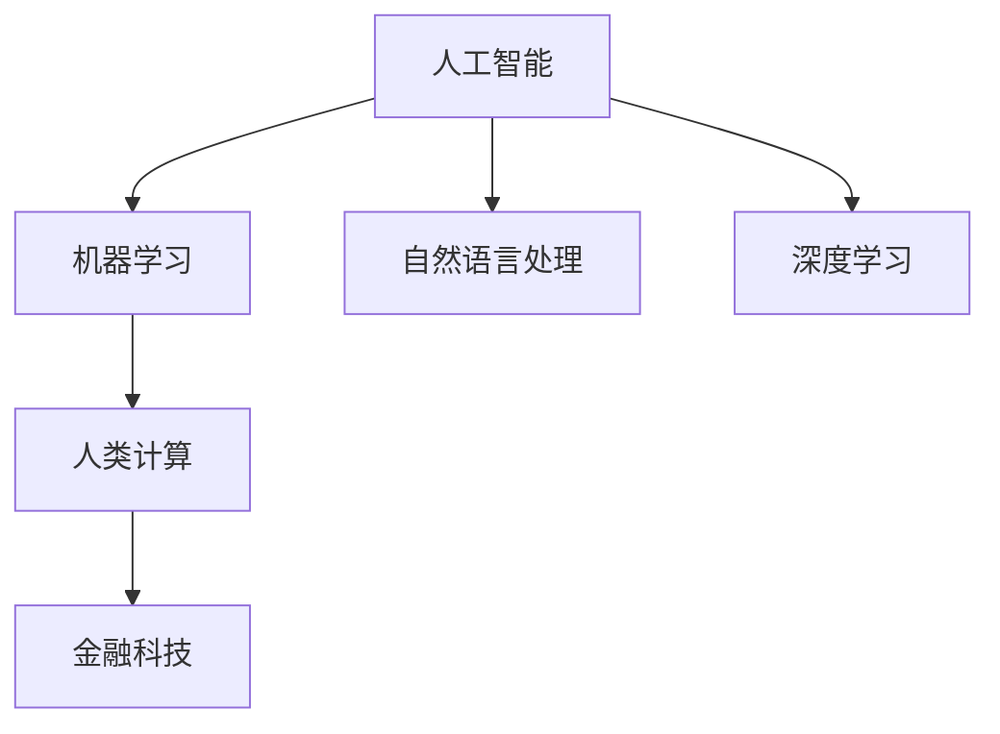

                 

# AI驱动的创新：人类计算在金融行业的潜力释放

## 1. 背景介绍

### 1.1 问题由来
金融行业一直是技术与创新的前沿阵地，传统金融依赖人工处理大量复杂数据，容易产生错误、遗漏和效率低下等问题。近年来，人工智能（AI）技术在金融领域逐步普及，带来了新的计算范式和业务模式。

人类计算（Human Computing），通过机器学习和自然语言处理（NLP）等技术，将人类专家知识与人工智能算法结合起来，加速决策和流程自动化，从而极大地提升金融机构的效率和效益。

### 1.2 问题核心关键点
人类计算的核心在于利用机器学习技术，将金融专家的决策模型、风险评估准则等转化为可执行的算法，然后应用到实际业务中。与传统的人工处理方式相比，人类计算具有以下优势：

1. **精度高**：机器学习模型能够在大规模数据上进行训练，决策精度高，且不受人类疲劳和情绪波动的影响。
2. **效率高**：模型可以在极短时间内处理海量数据，大幅提升业务效率。
3. **一致性**：机器学习模型输出结果一致，不会出现人为偏差。
4. **可扩展性**：模型可以轻松部署到多个分支机构或业务场景，灵活性高。
5. **智能化**：随着数据量的积累，模型可以不断学习优化，逐步提升智能化水平。

### 1.3 问题研究意义
在金融领域，利用人类计算技术，可以显著提升以下几方面的能力：

1. **风险管理**：快速准确评估贷款、投资等风险，提升金融产品安全性。
2. **业务合规**：确保业务操作符合监管要求，减少违规行为。
3. **客户服务**：通过智能客服、自动化咨询等方式，提高客户满意度。
4. **投研分析**：提供全面的市场分析报告和投资建议，提升投资决策质量。
5. **反欺诈识别**：利用机器学习模型识别异常交易行为，保障资金安全。

## 2. 核心概念与联系

### 2.1 核心概念概述

为了更好地理解人类计算在金融行业的潜力释放，本节将介绍几个关键概念：

- **人工智能（AI）**：通过模拟人类智能行为，实现自动化决策和操作的技术。
- **机器学习（ML）**：利用数据训练算法，使其具备预测和决策能力的技术。
- **自然语言处理（NLP）**：使计算机能够理解和生成人类语言的技术。
- **人类计算（Human Computing）**：结合机器学习和人类专家的知识，提升决策和运营效率的技术。
- **深度学习（DL）**：利用神经网络结构，通过大量数据训练，实现复杂模式识别的技术。
- **金融科技（FinTech）**：结合金融与科技的创新应用，提升金融服务效率和质量的技术。

这些核心概念之间的逻辑关系可以通过以下Mermaid流程图来展示：



这个流程图展示了大语言模型的工作原理和应用路径：

1. 人工智能提供基础算法框架，包括机器学习和深度学习等技术。
2. 自然语言处理技术，将人类语言数据转化为计算机可处理的形式。
3. 深度学习模型在大规模数据上进行训练，形成复杂模式的识别能力。
4. 人类计算将机器学习模型与人类专家的知识结合，提升决策和运营效率。
5. 金融科技将人类计算技术应用到金融业务中，创新金融服务模式。

## 3. 核心算法原理 & 具体操作步骤

### 3.1 算法原理概述

人类计算在金融行业的应用，本质上是利用机器学习技术，将人类专家的知识转化为算法，并在实际业务中进行优化和执行。

具体而言，将金融专家的决策模型和业务规则，用特征向量表示，然后通过监督学习、强化学习等技术，训练得到最优模型。训练好的模型可以用于处理新的金融业务数据，实现自动化决策和操作。

以贷款风险评估为例，模型会根据客户的信用评分、收入情况、历史交易记录等特征，预测其还款概率，并给出相应的贷款额度建议。训练数据集通常包含历史贷款申请数据，标注了客户是否违约等信息。模型通过学习这些数据，逐步优化预测能力。

### 3.2 算法步骤详解

基于机器学习的人类计算在金融行业的应用流程，一般包括以下几个关键步骤：

**Step 1: 数据收集与处理**
- 收集与业务相关的数据，包括客户数据、交易记录、市场数据等。
- 清洗数据，去除噪声和冗余信息，确保数据质量。
- 特征工程，提取有意义的特征向量，作为机器学习模型的输入。

**Step 2: 模型训练与优化**
- 选择合适的机器学习算法，如线性回归、决策树、支持向量机等。
- 将标注数据划分为训练集和验证集，使用训练集训练模型，并在验证集上进行调参和优化。
- 使用交叉验证等技术，评估模型性能，避免过拟合。
- 部署优化后的模型，进行实际业务测试。

**Step 3: 部署与监控**
- 将训练好的模型部署到生产环境，实时处理业务数据。
- 监控模型性能，定期更新模型参数，确保其持续有效。
- 应对新数据和新场景，优化模型，提升预测精度。

### 3.3 算法优缺点

基于机器学习的人类计算在金融行业的应用，具有以下优点：

1. **精度高**：通过训练，模型能够在大量历史数据基础上，得出准确的预测结果。
2. **效率高**：模型可以在极短时间内处理大量数据，大幅提升业务效率。
3. **一致性**：模型输出结果一致，不会受人类情感或疲劳的影响。
4. **可扩展性**：模型可以轻松部署到多个分支机构或业务场景，灵活性高。
5. **自动化**：自动化的决策过程，减少了人工干预，降低了运营成本。

但同时，该方法也存在一些缺点：

1. **数据依赖**：模型的性能很大程度上取决于数据的质量和多样性，数据偏差可能导致模型表现不佳。
2. **模型黑盒**：复杂的模型难以解释其决策过程，可能导致风险难以控制。
3. **计算资源需求高**：训练和部署高精度模型需要大量的计算资源。
4. **易受攻击**：模型可能被攻击者通过操纵输入数据等方式进行欺诈。

尽管存在这些局限性，但人类计算在金融行业的应用，仍然展现出强大的生命力和前景。未来相关研究的重点在于如何进一步优化模型性能，降低资源消耗，增强可解释性和安全性。

### 3.4 算法应用领域

人类计算在金融行业的应用，涵盖了多个领域，如：

- **信用风险评估**：通过分析客户的信用历史、收入情况等，预测其还款能力，评估贷款风险。
- **市场分析与投资建议**：基于市场数据，生成全面的市场分析报告和投资建议。
- **客户行为分析**：分析客户交易数据，挖掘客户行为模式，提升客户服务质量。
- **反欺诈识别**：利用机器学习模型，识别异常交易行为，保障金融安全。
- **自动化客服**：通过智能客服系统，解答客户咨询，提升客户满意度。
- **合规检查**：利用NLP技术，自动化检查合规性，减少违规行为。

这些领域的应用，极大地提升了金融机构的效率和效果，具有广泛的应用前景。

## 4. 数学模型和公式 & 详细讲解

### 4.1 数学模型构建

为了更好地理解人类计算在金融行业的应用，我们以信用风险评估为例，介绍数学模型的构建。

假设我们有一组客户数据 $(x_1, y_1), (x_2, y_2), ..., (x_n, y_n)$，其中 $x_i = [x_{i1}, x_{i2}, ..., x_{ik}]$ 表示客户特征向量， $y_i = 1$ 表示客户违约， $y_i = 0$ 表示客户未违约。我们希望训练一个线性分类器 $h(x; w, b)$，将客户是否违约预测出来。线性分类器的表达式为：

$$
h(x; w, b) = \sum_{j=1}^k w_j x_{ij} + b
$$

其中 $w = [w_1, w_2, ..., w_k]$ 为模型参数， $b$ 为偏置项。

模型的损失函数为：

$$
L(w, b) = -\frac{1}{N} \sum_{i=1}^N [y_i \log (h(x_i; w, b)) + (1 - y_i) \log (1 - h(x_i; w, b))]
$$

我们希望最小化损失函数 $L(w, b)$，通过梯度下降等优化算法更新模型参数。

### 4.2 公式推导过程

以信用风险评估为例，我们推导线性分类器的损失函数及其梯度公式。

将 $h(x; w, b)$ 代入损失函数 $L(w, b)$，得：

$$
L(w, b) = -\frac{1}{N} \sum_{i=1}^N [y_i \log (h(x_i; w, b)) + (1 - y_i) \log (1 - h(x_i; w, b))]
$$

将 $h(x_i; w, b)$ 展开，得：

$$
L(w, b) = -\frac{1}{N} \sum_{i=1}^N [y_i \log (\sum_{j=1}^k w_j x_{ij} + b) + (1 - y_i) \log (1 - \sum_{j=1}^k w_j x_{ij} - b)]
$$

对 $w$ 和 $b$ 求偏导数，得：

$$
\frac{\partial L(w, b)}{\partial w_j} = \frac{1}{N} \sum_{i=1}^N (\frac{y_i x_{ij}}{\sum_{j=1}^k w_j x_{ij} + b} - \frac{(1 - y_i) x_{ij}}{1 - \sum_{j=1}^k w_j x_{ij} - b})
$$

$$
\frac{\partial L(w, b)}{\partial b} = \frac{1}{N} \sum_{i=1}^N (\frac{-y_i}{\sum_{j=1}^k w_j x_{ij} + b} + \frac{y_i}{1 - \sum_{j=1}^k w_j x_{ij} - b})
$$

通过梯度下降等优化算法，不断更新模型参数，直到损失函数收敛。

### 4.3 案例分析与讲解

以信用风险评估为例，分析模型在实际应用中的表现。

假设我们有一组客户数据，其中 $x_1 = [age, income, employment]$， $x_2 = [age, income, employment]$，...，$x_n = [age, income, employment]$。我们希望训练一个线性分类器，预测客户是否违约。

首先，我们收集大量的历史客户数据，将其中标记为违约的客户数据和未违约的客户数据分别作为训练集的阳性样本和阴性样本。然后，我们使用监督学习算法（如逻辑回归、支持向量机等）训练分类器，并计算模型的损失函数和准确率。

在训练过程中，我们逐步调整模型参数 $w$ 和 $b$，使得模型预测的违约客户比例与真实数据一致。当损失函数收敛时，我们就得到了一个能准确预测客户违约的模型。

最后，我们将训练好的模型应用到新客户的信用评估中。通过输入客户的特征向量，模型可以实时计算出该客户是否违约的概率，并给出相应的信用额度建议。

## 5. 项目实践：代码实例和详细解释说明

### 5.1 开发环境搭建

在进行人类计算实践前，我们需要准备好开发环境。以下是使用Python进行Scikit-learn开发的环境配置流程：

1. 安装Anaconda：从官网下载并安装Anaconda，用于创建独立的Python环境。

2. 创建并激活虚拟环境：
```bash
conda create -n ml-env python=3.8 
conda activate ml-env
```

3. 安装Scikit-learn和其他常用库：
```bash
conda install scikit-learn numpy pandas matplotlib seaborn scikit-optimize
```

4. 安装TensorBoard：用于可视化模型训练过程。
```bash
pip install tensorboard
```

5. 安装Jupyter Notebook：用于编写和运行代码。
```bash
pip install jupyter notebook
```

完成上述步骤后，即可在`ml-env`环境中开始人类计算实践。

### 5.2 源代码详细实现

下面以信用风险评估为例，给出使用Scikit-learn进行线性回归模型的PyTorch代码实现。

首先，定义数据处理函数：

```python
from sklearn.model_selection import train_test_split
from sklearn.preprocessing import StandardScaler

def load_data():
    # 加载客户数据
    # ...

    # 标准化数据
    scaler = StandardScaler()
    X = scaler.fit_transform(X)
    
    # 划分训练集和测试集
    X_train, X_test, y_train, y_test = train_test_split(X, y, test_size=0.2, random_state=42)

    return X_train, X_test, y_train, y_test
```

然后，定义模型训练函数：

```python
from sklearn.linear_model import LogisticRegression
from sklearn.metrics import accuracy_score

def train_model(X_train, y_train, X_test, y_test):
    # 创建逻辑回归模型
    model = LogisticRegression(solver='lbfgs', max_iter=1000)

    # 训练模型
    model.fit(X_train, y_train)

    # 评估模型
    y_pred = model.predict(X_test)
    accuracy = accuracy_score(y_test, y_pred)
    print(f"Accuracy: {accuracy:.2f}")

    return model
```

接着，启动训练流程：

```python
# 加载数据
X_train, X_test, y_train, y_test = load_data()

# 训练模型
model = train_model(X_train, y_train, X_test, y_test)
```

最后，打印训练结果：

```python
# 打印训练结果
train_model(X_train, y_train, X_test, y_test)
```

以上就是使用Scikit-learn进行线性回归模型训练的完整代码实现。可以看到，利用Scikit-learn，训练一个简单的逻辑回归模型非常简单。

### 5.3 代码解读与分析

让我们再详细解读一下关键代码的实现细节：

**load_data函数**：
- 加载数据集，包括客户特征数据和标签数据。
- 使用StandardScaler标准化数据，避免不同特征尺度不同导致的偏差。
- 使用train_test_split函数，将数据集划分为训练集和测试集。

**train_model函数**：
- 创建逻辑回归模型，使用lbfgs算法进行优化。
- 训练模型，使用fit函数进行模型训练。
- 评估模型，使用accuracy_score函数计算模型在测试集上的准确率。

**训练流程**：
- 加载数据集。
- 调用train_model函数，训练模型。
- 打印训练结果。

可以看到，Scikit-learn提供了丰富的机器学习算法和工具，可以简化模型的开发和训练过程。开发者只需关注核心算法和业务逻辑，而不必过多关注底层实现细节。

## 6. 实际应用场景

### 6.1 智能投研分析

金融机构依赖分析师进行市场分析和投资建议，但传统方式成本高、效率低。利用人类计算技术，可以大幅提升投研分析的自动化水平。

具体而言，可以收集市场数据、新闻、社交媒体等文本数据，利用NLP技术提取信息，然后训练模型预测市场走势和股票表现。训练好的模型可以实时生成分析报告和投资建议，帮助投资者做出更科学的决策。

### 6.2 自动化合规检查

金融行业需要严格遵守各类法律法规，传统的合规检查方式耗时耗力。利用人类计算技术，可以自动化地检查合规性，减少人工工作量。

具体而言，可以收集业务数据，利用NLP技术解析文本，然后训练模型识别违规行为。训练好的模型可以实时监控业务操作，及时发现违规行为，并进行警示或阻止。

### 6.3 智能客服系统

金融机构需要处理大量的客户咨询，传统的客服方式无法满足需求。利用人类计算技术，可以构建智能客服系统，提升客户服务质量。

具体而言，可以收集历史客服数据，利用NLP技术解析文本，然后训练模型进行对话生成。训练好的模型可以实时回答客户咨询，处理各类问题，提高客户满意度。

### 6.4 未来应用展望

随着人类计算技术的不断发展，未来金融行业将涌现更多创新应用。以下是几个具有潜力的方向：

1. **自动化交易系统**：通过机器学习模型，实时分析市场数据，自动生成交易策略，提升交易效率。
2. **信用评分优化**：利用深度学习模型，分析客户行为数据，优化信用评分模型，提升贷款审批效率。
3. **反欺诈检测**：利用NLP和图像识别技术，自动化检测交易异常，保障资金安全。
4. **智能投顾服务**：利用机器学习模型，生成个性化投资建议，提升投顾服务质量。
5. **量化风险管理**：利用深度学习模型，实时分析市场波动，优化风险管理策略。

这些应用将极大地提升金融机构的运营效率和客户服务质量，带来可观的经济效益和社会效益。

## 7. 工具和资源推荐

### 7.1 学习资源推荐

为了帮助开发者系统掌握人类计算在金融行业的应用，这里推荐一些优质的学习资源：

1. **《深度学习》课程**：斯坦福大学开设的深度学习课程，系统介绍深度学习的基本概念和算法。
2. **《机器学习》书籍**：周志华的《机器学习》，详细介绍机器学习的理论基础和实践方法。
3. **《Python数据科学手册》书籍**：Jake VanderPlas的《Python数据科学手册》，全面介绍Python在数据科学中的应用。
4. **Scikit-learn官方文档**：Scikit-learn的官方文档，提供了丰富的机器学习算法和工具，是学习机器学习的必读资料。
5. **TensorFlow官方文档**：TensorFlow的官方文档，提供了深度学习模型的构建和优化方法。

通过对这些资源的学习实践，相信你一定能够快速掌握人类计算在金融行业的核心技术和应用方法。

### 7.2 开发工具推荐

高效的开发离不开优秀的工具支持。以下是几款用于人类计算开发的常用工具：

1. **Scikit-learn**：用于构建和优化机器学习模型的Python库，提供了丰富的算法和工具。
2. **TensorFlow**：由Google主导开发的深度学习框架，生产部署方便，适合大规模工程应用。
3. **TensorBoard**：TensorFlow配套的可视化工具，可实时监测模型训练状态，并提供丰富的图表呈现方式。
4. **Jupyter Notebook**：用于编写和运行代码的Notebook环境，支持代码编辑、执行和保存。
5. **Anaconda**：用于创建和管理Python环境的软件，方便多版本管理和快速切换。

合理利用这些工具，可以显著提升人类计算任务的开发效率，加快创新迭代的步伐。

### 7.3 相关论文推荐

人类计算技术的发展源于学界的持续研究。以下是几篇奠基性的相关论文，推荐阅读：

1. **《深度学习》论文**：深度学习技术的基础论文，介绍深度神经网络的结构和算法。
2. **《机器学习算法》论文**：介绍各类机器学习算法，如线性回归、决策树、支持向量机等。
3. **《NLP技术》论文**：介绍自然语言处理技术，如词向量、语言模型、文本分类等。
4. **《金融科技》论文**：介绍金融科技的发展和应用，如区块链、智能合约等。

这些论文代表了大语言模型微调技术的发展脉络。通过学习这些前沿成果，可以帮助研究者把握学科前进方向，激发更多的创新灵感。

## 8. 总结：未来发展趋势与挑战

### 8.1 总结

本文对基于机器学习的人类计算在金融行业的潜力释放进行了全面系统的介绍。首先阐述了人类计算技术的背景和优势，明确了其在金融行业的应用潜力。其次，从原理到实践，详细讲解了人类计算在金融行业的应用流程，给出了模型训练的完整代码实例。同时，本文还广泛探讨了人类计算技术在智能投研分析、自动化合规检查、智能客服系统等多个领域的实际应用，展示了其广泛的应用前景。此外，本文精选了人类计算技术的各类学习资源，力求为读者提供全方位的技术指引。

通过本文的系统梳理，可以看到，基于机器学习的人类计算技术正在成为金融行业的重要范式，极大地提升了金融机构的工作效率和运营质量，具有广泛的应用前景。

### 8.2 未来发展趋势

展望未来，人类计算技术在金融行业的应用将呈现以下几个发展趋势：

1. **模型复杂度提高**：随着数据量和计算能力的提升，人类计算模型将更加复杂，具备更强的预测和决策能力。
2. **跨模态融合**：结合金融数据、市场数据、社交媒体等多模态信息，提升模型的全面性和准确性。
3. **实时性增强**：利用分布式计算和流式处理技术，实现实时数据处理和决策，提升业务响应速度。
4. **智能化提升**：通过深度学习等技术，提升模型的智能化水平，能够进行更加复杂的推理和决策。
5. **自适应学习**：利用强化学习等技术，模型能够在实际业务中不断学习优化，逐步提升预测精度。

这些趋势凸显了人类计算技术的强大潜力和发展前景。这些方向的探索发展，必将进一步提升金融机构的决策效率和客户服务质量。

### 8.3 面临的挑战

尽管人类计算技术在金融行业的应用已经取得了显著成效，但在迈向更加智能化、普适化应用的过程中，仍然面临诸多挑战：

1. **数据质量问题**：金融数据的来源和质量参差不齐，数据的偏差可能导致模型表现不佳。
2. **模型可解释性不足**：复杂的模型难以解释其决策过程，可能导致风险难以控制。
3. **计算资源消耗高**：高精度模型需要大量的计算资源，难以在低成本环境中运行。
4. **安全性和隐私保护**：金融数据涉及个人隐私和商业机密，需要严格的安全保护措施。

尽管存在这些挑战，但通过不断优化数据质量、提升模型可解释性、降低计算成本和加强安全保护，相信人类计算技术将不断突破障碍，实现更加广泛的应用。

### 8.4 研究展望

面向未来，人类计算技术在金融行业的研究和应用还需要在以下几个方面进行深入探索：

1. **数据增强技术**：利用数据增强技术，提升数据的多样性和质量，增强模型的泛化能力。
2. **模型压缩与优化**：通过模型压缩和优化，降低计算成本，提升模型实时性。
3. **多模态融合技术**：结合金融数据、市场数据、社交媒体等多模态信息，提升模型的全面性和准确性。
4. **模型可解释性技术**：开发可解释性技术，使模型具备更高的透明度和可信度。
5. **安全性和隐私保护**：采用加密技术、匿名化技术等措施，保护数据隐私和模型安全。

这些研究方向的探索，必将引领人类计算技术在金融行业的进一步发展，推动金融机构向更高水平迈进。

## 9. 附录：常见问题与解答

**Q1：人类计算在金融行业是否具有普适性？**

A: 人类计算技术在金融行业的应用具有很强的普适性，可以应用于多个领域，如信用风险评估、市场分析、客户服务、反欺诈检测等。其核心优势在于自动化和智能化的决策过程，能够大幅提升业务效率和质量。

**Q2：人类计算在金融行业的优势是什么？**

A: 人类计算在金融行业的优势主要包括：
1. 精度高：通过机器学习模型，能够在大量历史数据基础上，得出准确的预测结果。
2. 效率高：模型可以在极短时间内处理大量数据，大幅提升业务效率。
3. 一致性：模型输出结果一致，不会受人类情感或疲劳的影响。
4. 可扩展性：模型可以轻松部署到多个分支机构或业务场景，灵活性高。
5. 自动化：自动化的决策过程，减少了人工干预，降低了运营成本。

**Q3：人类计算在金融行业的应用流程是什么？**

A: 人类计算在金融行业的应用流程一般包括以下几个步骤：
1. 数据收集与处理：收集与业务相关的数据，进行数据清洗和标准化。
2. 模型训练与优化：选择合适的机器学习算法，在标注数据上进行训练和优化。
3. 部署与监控：将训练好的模型部署到生产环境，实时处理业务数据，并进行性能监控和优化。

**Q4：人类计算在金融行业的典型应用有哪些？**

A: 人类计算在金融行业的典型应用包括：
1. 信用风险评估：通过分析客户信用历史、收入情况等，预测客户是否违约。
2. 市场分析与投资建议：基于市场数据，生成全面的市场分析报告和投资建议。
3. 客户行为分析：分析客户交易数据，挖掘客户行为模式，提升客户服务质量。
4. 反欺诈识别：利用机器学习模型，识别异常交易行为，保障资金安全。
5. 自动化客服：通过智能客服系统，解答客户咨询，处理各类问题，提高客户满意度。

**Q5：人类计算在金融行业面临的主要挑战是什么？**

A: 人类计算在金融行业面临的主要挑战包括：
1. 数据质量问题：金融数据的来源和质量参差不齐，数据的偏差可能导致模型表现不佳。
2. 模型可解释性不足：复杂的模型难以解释其决策过程，可能导致风险难以控制。
3. 计算资源消耗高：高精度模型需要大量的计算资源，难以在低成本环境中运行。
4. 安全性和隐私保护：金融数据涉及个人隐私和商业机密，需要严格的安全保护措施。

**Q6：如何应对人类计算在金融行业的挑战？**

A: 应对人类计算在金融行业的挑战，可以从以下几个方面进行改进：
1. 提升数据质量：通过数据清洗和增强技术，提升数据的多样性和质量。
2. 开发可解释性技术：使模型具备更高的透明度和可信度，增强决策过程的可解释性。
3. 采用分布式计算和流式处理技术，降低计算成本，提升模型实时性。
4. 采用加密技术、匿名化技术等措施，保护数据隐私和模型安全。

这些措施将帮助人类计算技术在金融行业实现更好的应用效果和业务价值。

---

作者：禅与计算机程序设计艺术 / Zen and the Art of Computer Programming

