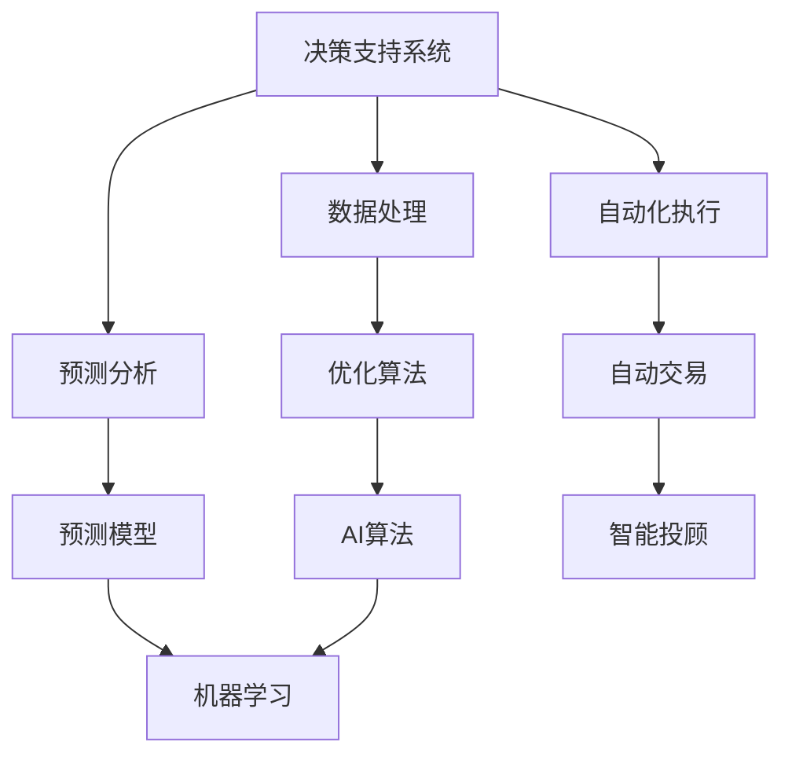

                 

# AI驱动的创新：人类计算在金融领域的应用

> 关键词：人工智能,金融技术,算法交易,量化投资,风险管理,人类计算

## 1. 背景介绍

### 1.1 问题由来
金融行业作为经济活动的核心引擎，长期以来一直处于信息技术应用的领先地位。从早期的ATM机、电子交易平台到智能投顾、区块链，每一次技术革新都极大地提升了金融服务的效率和安全性，极大地推动了产业的发展。当前，随着人工智能技术的蓬勃发展，金融科技(简称FinTech)正在进入一个以AI驱动的新纪元。

大数据、云计算、深度学习等前沿技术正在全面渗透到金融领域的各个环节，从交易执行、风险评估、客户服务到合规监管等，AI正帮助金融机构构建更加精准、高效、智能的业务体系，推动金融创新与变革。

金融领域的AI应用不仅带来新的业务模式和增长点，还在传统业务中引入全新技术，大幅提升了金融机构的服务水平和竞争力。然而，相较于其他行业，金融领域对数据隐私、交易透明度和合规要求有着更为严格的规范，这给AI技术的应用带来了新的挑战和机遇。

### 1.2 问题核心关键点
AI技术在金融领域的应用，主要聚焦于以下几个核心关键点：
1. **算法交易**：利用机器学习算法自动化高频交易，优化交易策略，提升投资回报率。
2. **量化投资**：基于大数据和机器学习构建量化投资模型，自动化股票、债券等金融产品的交易决策。
3. **风险管理**：通过AI技术实时监控市场波动，预警潜在风险，辅助制定风险应对策略。
4. **智能投顾**：运用自然语言处理(NLP)和机器学习，提供个性化的投资建议和理财服务，提升用户体验。
5. **金融预测**：使用AI模型对金融市场进行预测分析，提供投资建议和市场动态监控。
6. **合规监管**：运用AI技术加强合规检查，确保交易和运营符合法规要求。

这些应用领域的成功离不开AI技术的核心——人类计算。人类计算作为AI技术的重要分支，通过模拟人的思考方式，实现对复杂问题的自动化处理。金融领域作为数据密集型和规则密集型行业的典型代表，正是人类计算应用的重要场景。

## 2. 核心概念与联系

### 2.1 核心概念概述

人类计算作为AI技术的重要组成部分，是指通过模拟人类的思考方式，利用计算机系统对复杂的决策、推理和分析问题进行高效处理。它主要应用于以下几个方面：

- **决策支持系统**：利用AI技术分析海量数据，辅助决策者制定最优决策。
- **优化算法**：使用机器学习算法优化资源配置和流程优化，提升效率。
- **预测分析**：利用AI模型预测未来市场趋势和用户行为，辅助战略规划。
- **自动化执行**：通过自动交易、智能投顾等方式，实现业务流程的自动化。

金融领域作为数据密集型和规则密集型的行业，对数据处理、预测分析和决策支持有着极高的要求。结合人类计算与AI技术，可以有效提升金融服务的智能化水平，实现业务流程的自动化，提升用户满意度，降低运营成本，增强市场竞争力。

### 2.2 核心概念原理和架构的 Mermaid 流程图



这个流程图展示了人类计算与AI技术在金融领域应用的架构：

1. **数据处理**：利用AI技术进行数据清洗、特征提取和预处理。
2. **优化算法**：使用机器学习算法优化资源配置和流程，提升决策效率。
3. **预测分析**：构建预测模型，分析市场趋势和用户行为，辅助决策。
4. **决策支持**：结合预测分析结果，辅助决策者制定最优决策。
5. **自动化执行**：通过自动交易、智能投顾等方式，实现业务流程的自动化。

这种架构不仅展示了各个环节的流程，也体现了AI技术与人类计算相结合，提升金融服务智能化水平的核心逻辑。

## 3. 核心算法原理 & 具体操作步骤

### 3.1 算法原理概述

AI在金融领域的应用，主要基于以下几个核心算法：

1. **机器学习算法**：如决策树、随机森林、支持向量机等，通过学习历史数据，预测未来市场变化。
2. **深度学习算法**：如卷积神经网络(CNN)、循环神经网络(RNN)、长短期记忆网络(LSTM)等，处理高维度、非线性金融数据。
3. **强化学习算法**：如Q学习、策略梯度、深度强化学习等，用于自动化交易策略的优化和执行。
4. **自然语言处理(NLP)**：如文本分类、情感分析、命名实体识别等，处理和分析非结构化文本数据。
5. **优化算法**：如遗传算法、蚁群算法、粒子群算法等，优化资源配置和业务流程。

这些算法在金融领域的应用，主要涉及以下几个关键步骤：

- **数据收集与清洗**：获取各类金融数据，包括历史交易数据、市场指数、新闻报道等。
- **特征提取与处理**：使用AI技术对数据进行预处理，提取有价值特征。
- **模型构建与训练**：选择合适的模型，利用历史数据进行训练。
- **预测与决策**：基于训练好的模型进行预测，辅助决策制定。
- **自动化执行**：将决策转化为自动化交易或投顾服务。

### 3.2 算法步骤详解

以量化投资模型为例，其构建与训练主要包括以下几个步骤：

1. **数据收集与清洗**：
   - 获取历史交易数据、市场指数、新闻报道等，构建多维度金融数据集。
   - 对数据进行清洗和预处理，去除异常值和噪声。

2. **特征提取与处理**：
   - 使用技术手段提取有价值特征，如技术指标、市场情绪、宏观经济指标等。
   - 对特征进行归一化和标准化处理，防止过拟合。

3. **模型构建与训练**：
   - 选择合适的算法，构建量化投资模型。
   - 将数据集划分为训练集和测试集，使用训练集对模型进行训练。

4. **预测与决策**：
   - 使用训练好的模型对实时市场数据进行预测，生成交易信号。
   - 根据交易信号，结合预设的交易规则和参数，制定交易策略。

5. **自动化执行**：
   - 将交易策略转化为具体交易订单，通过API接口自动化执行。
   - 实时监控交易执行情况，及时调整策略。

### 3.3 算法优缺点

基于AI技术在金融领域的应用，主要具有以下几个优缺点：

#### 优点：
1. **高效性**：AI技术能够处理大量数据，快速生成预测结果，提升决策效率。
2. **准确性**：AI模型能够捕捉市场中的复杂关系，提高预测的准确性。
3. **自动化**：AI技术实现流程自动化，减少人工干预，降低错误率。
4. **规模化**：AI技术可应用于多个业务场景，具有广泛的适用性。
5. **灵活性**：AI技术可根据市场变化快速调整策略，适应不同的市场环境。

#### 缺点：
1. **数据依赖**：AI模型依赖高质量、大规模的数据，数据质量不足可能影响模型效果。
2. **过拟合风险**：模型容易过拟合，对新数据泛化能力不足。
3. **透明度不足**：AI模型的决策过程较难解释，缺乏透明度和可解释性。
4. **模型风险**：模型存在潜在的模型风险，可能出现预测错误或误判。
5. **技术门槛**：AI技术的应用需要较高的技术门槛，需要专业人才维护。

### 3.4 算法应用领域

AI技术在金融领域的应用主要集中在以下几个领域：

- **算法交易**：利用机器学习算法进行高频交易，优化交易策略。
- **量化投资**：构建量化投资模型，自动化股票、债券等金融产品的交易决策。
- **风险管理**：利用AI技术实时监控市场波动，预警潜在风险，辅助制定风险应对策略。
- **智能投顾**：运用NLP和机器学习，提供个性化的投资建议和理财服务，提升用户体验。
- **金融预测**：使用AI模型对金融市场进行预测分析，提供投资建议和市场动态监控。
- **合规监管**：运用AI技术加强合规检查，确保交易和运营符合法规要求。

## 4. 数学模型和公式 & 详细讲解 & 举例说明

### 4.1 数学模型构建

金融领域的数据模型构建主要包括以下几个步骤：

1. **模型选择**：选择合适的模型，如线性回归、逻辑回归、决策树、随机森林、神经网络等。
2. **数据准备**：准备训练数据和测试数据，数据集划分为训练集和测试集。
3. **模型训练**：使用训练数据对模型进行训练，调整模型参数。
4. **模型评估**：使用测试数据评估模型性能，确定模型是否符合要求。
5. **模型部署**：将训练好的模型部署到生产环境，进行实时预测。

### 4.2 公式推导过程

以线性回归模型为例，其数学公式如下：

$$
y = \beta_0 + \beta_1x_1 + \beta_2x_2 + \cdots + \beta_nx_n + \epsilon
$$

其中，$y$ 表示预测值，$x_1, x_2, \cdots, x_n$ 为输入特征，$\beta_0, \beta_1, \beta_2, \cdots, \beta_n$ 为模型参数，$\epsilon$ 为误差项。

通过最小二乘法，求解模型参数 $\beta_0, \beta_1, \beta_2, \cdots, \beta_n$，使得预测值 $y$ 与真实值 $y_{real}$ 误差最小化。

求解过程如下：

$$
\hat{\beta} = \arg\min_{\beta} \sum_{i=1}^n (y_{real} - (\beta_0 + \beta_1x_{1i} + \beta_2x_{2i} + \cdots + \beta_nx_{ni}))^2
$$

通过对上述公式进行求解，即可得到模型的预测值 $y$。

### 4.3 案例分析与讲解

以量化投资模型为例，其核心算法和数学模型如下：

1. **特征选择**：
   - 使用技术指标（如MACD、RSI、KDJ等）作为特征。
   - 使用市场情绪（如市场恐慌指数、投资者情绪等）作为特征。
   - 使用宏观经济指标（如GDP、CPI、PPI等）作为特征。

2. **模型训练**：
   - 使用随机森林算法对多维度特征进行建模。
   - 划分训练集和测试集，使用训练集对模型进行训练。

3. **模型评估**：
   - 使用测试集对模型进行评估，计算模型的准确率、召回率、F1分数等指标。
   - 使用AIC、BIC等信息准则选择最优模型。

4. **预测与决策**：
   - 对实时市场数据进行预测，生成交易信号。
   - 根据交易信号，结合预设的交易规则和参数，制定交易策略。

5. **自动化执行**：
   - 将交易策略转化为具体交易订单，通过API接口自动化执行。
   - 实时监控交易执行情况，及时调整策略。

## 5. 项目实践：代码实例和详细解释说明

### 5.1 开发环境搭建

在进行AI项目实践前，我们需要准备好开发环境。以下是使用Python进行TensorFlow开发的环境配置流程：

1. 安装Anaconda：从官网下载并安装Anaconda，用于创建独立的Python环境。

2. 创建并激活虚拟环境：
```bash
conda create -n tf-env python=3.8 
conda activate tf-env
```

3. 安装TensorFlow：根据CUDA版本，从官网获取对应的安装命令。例如：
```bash
conda install tensorflow -c tf
```

4. 安装各类工具包：
```bash
pip install numpy pandas scikit-learn matplotlib tqdm jupyter notebook ipython
```

完成上述步骤后，即可在`tf-env`环境中开始AI项目实践。

### 5.2 源代码详细实现

下面我们以量化投资模型为例，给出使用TensorFlow进行机器学习开发的量化投资模型代码实现。

首先，定义数据处理函数：

```python
import numpy as np
import pandas as pd
from sklearn.model_selection import train_test_split
from tensorflow.keras.models import Sequential
from tensorflow.keras.layers import Dense
from tensorflow.keras.optimizers import Adam
from sklearn.preprocessing import MinMaxScaler

def preprocess_data(data, scaler=None):
    if scaler is None:
        scaler = MinMaxScaler()
    return scaler.fit_transform(data)

def split_train_test(data, test_size=0.2):
    X_train, X_test, y_train, y_test = train_test_split(data.drop('target', axis=1), data['target'], test_size=test_size, random_state=42)
    return X_train, X_test, y_train, y_test

# 读取数据集
data = pd.read_csv('stock_data.csv')

# 数据预处理
data = preprocess_data(data, scaler=MinMaxScaler())
X_train, X_test, y_train, y_test = split_train_test(data)

# 构建模型
model = Sequential()
model.add(Dense(32, activation='relu', input_dim=X_train.shape[1]))
model.add(Dense(16, activation='relu'))
model.add(Dense(1, activation='sigmoid'))

# 编译模型
model.compile(loss='binary_crossentropy', optimizer=Adam(0.001), metrics=['accuracy'])

# 训练模型
model.fit(X_train, y_train, epochs=100, batch_size=32, validation_data=(X_test, y_test))

# 评估模型
loss, acc = model.evaluate(X_test, y_test)
print(f'Test loss: {loss:.4f}')
print(f'Test accuracy: {acc:.4f}')
```

然后，定义训练和评估函数：

```python
from sklearn.metrics import classification_report

def train_model(model, X_train, X_test, y_train, y_test, epochs=100, batch_size=32):
    model.fit(X_train, y_train, epochs=epochs, batch_size=batch_size, validation_data=(X_test, y_test))
    y_pred = model.predict(X_test)
    y_pred = (y_pred > 0.5).astype(int)
    y_true = y_test
    print(classification_report(y_true, y_pred))
    return model
```

最后，启动训练流程并在测试集上评估：

```python
train_model(model, X_train, X_test, y_train, y_test)
```

以上就是使用TensorFlow进行量化投资模型微调的完整代码实现。可以看到，TensorFlow提供了强大的机器学习工具包，使得模型构建、训练和评估等过程变得高效便捷。

### 5.3 代码解读与分析

让我们再详细解读一下关键代码的实现细节：

**preprocess_data函数**：
- 对数据进行归一化处理，防止模型在训练中出现数值不稳定的问题。
- 使用MinMaxScaler将数据缩放到[0,1]范围内。

**split_train_test函数**：
- 将数据集划分为训练集和测试集，用于模型训练和测试。

**模型构建与训练**：
- 使用Sequential模型，添加输入层、隐藏层和输出层，激活函数使用ReLU和Sigmoid。
- 使用Adam优化器，损失函数为二元交叉熵。

**模型评估**：
- 在测试集上对模型进行评估，输出准确率。

**训练流程**：
- 使用train_model函数对模型进行训练和评估，并输出结果。

可以看到，TensorFlow通过简单易用的API，大大简化了模型的构建和训练过程，使得开发者可以专注于业务逻辑和模型优化。

当然，工业级的系统实现还需考虑更多因素，如模型的保存和部署、超参数的自动搜索、模型的监控和维护等。但核心的模型构建和训练流程基本与此类似。

## 6. 实际应用场景

### 6.1 算法交易

算法交易作为金融领域的核心业务之一，利用AI技术自动化高频交易，优化交易策略，提高投资回报率。在实际应用中，通过机器学习算法预测市场趋势，生成交易信号，根据信号自动下达交易订单，实现自动化交易。

### 6.2 量化投资

量化投资通过构建量化投资模型，自动化股票、债券等金融产品的交易决策。构建模型时，将历史交易数据、市场指数、新闻报道等作为训练数据，使用机器学习算法进行预测，生成投资策略。在实际应用中，通过API接口自动化执行交易策略，实时监控交易情况，及时调整策略。

### 6.3 风险管理

风险管理通过AI技术实时监控市场波动，预警潜在风险，辅助制定风险应对策略。在实际应用中，通过机器学习算法分析市场数据，预测未来市场趋势，及时调整投资组合，防范市场风险。

### 6.4 智能投顾

智能投顾运用NLP和机器学习，提供个性化的投资建议和理财服务，提升用户体验。在实际应用中，通过NLP技术处理和分析用户输入，理解用户需求，使用机器学习算法生成个性化的投资建议，辅助用户做出决策。

### 6.5 金融预测

金融预测使用AI模型对金融市场进行预测分析，提供投资建议和市场动态监控。在实际应用中，通过机器学习算法分析市场数据，预测未来市场趋势，生成投资建议和风险预警。

### 6.6 合规监管

合规监管通过AI技术加强合规检查，确保交易和运营符合法规要求。在实际应用中，通过NLP技术处理和分析交易记录、操作日志等数据，识别违规行为，及时预警和纠正违规操作。

## 7. 工具和资源推荐

### 7.1 学习资源推荐

为了帮助开发者系统掌握AI技术在金融领域的应用，这里推荐一些优质的学习资源：

1. 《深度学习》一书：Ian Goodfellow等著，全面介绍了深度学习的基础理论和应用实践。
2. 《Python for Finance》一书：Steven L. Harris等著，介绍了Python在金融数据分析和机器学习中的应用。
3. Coursera《Machine Learning》课程：由Andrew Ng开设的机器学习课程，深入浅出地介绍了机器学习的基本概念和算法。
4. Kaggle金融数据集：包含丰富的金融数据集，可用于数据挖掘、机器学习实践。
5. TensorFlow官方文档：提供了TensorFlow的详细API文档和使用指南，适合初学者和进阶用户。

通过对这些资源的学习实践，相信你一定能够快速掌握AI技术在金融领域的应用，并用于解决实际的业务问题。

### 7.2 开发工具推荐

高效的开发离不开优秀的工具支持。以下是几款用于AI项目开发的常用工具：

1. TensorFlow：由Google主导开发的开源深度学习框架，生产部署方便，适合大规模工程应用。
2. PyTorch：基于Python的开源深度学习框架，灵活动态的计算图，适合快速迭代研究。
3. Scikit-learn：Python的机器学习库，提供了丰富的机器学习算法和工具。
4. Pandas：Python的数据处理库，支持高效的数据清洗和预处理。
5. Jupyter Notebook：用于交互式编程和数据可视化的工具，适合数据分析和模型训练。

合理利用这些工具，可以显著提升AI项目开发的效率，加快创新迭代的步伐。

### 7.3 相关论文推荐

AI技术在金融领域的应用源于学界的持续研究。以下是几篇奠基性的相关论文，推荐阅读：

1. "Deep Learning for Asset Pricing" by Carol A. Gagliardone等：介绍如何利用深度学习模型预测资产价格，提高投资回报率。
2. "Machine Learning for Trading" by Richard A. Grinblatt等：探讨机器学习在量化交易中的应用，提升交易决策的准确性。
3. "AI-based Financial Risk Management: A Survey" by Jan A. Haenel等：总结了AI在金融风险管理中的应用，提出未来研究方向。
4. "AI in Financial Services: The Next Generation of Innovation" by John A. Thompson等：讨论了AI技术在金融服务中的应用，展望未来发展方向。
5. "Blockchain Technology in the Finance Sector: A Survey" by Xiaoyu Yuan等：介绍区块链技术在金融领域的应用，包括智能合约、交易记录等。

这些论文代表了大数据、人工智能技术在金融领域的应用发展脉络，通过学习这些前沿成果，可以帮助研究者把握学科前进方向，激发更多的创新灵感。

## 8. 总结：未来发展趋势与挑战

### 8.1 总结

本文对AI技术在金融领域的应用进行了全面系统的介绍。首先阐述了AI技术在金融领域的应用背景和意义，明确了AI技术在金融领域的应用场景和核心算法。其次，从原理到实践，详细讲解了AI技术在金融领域的实现过程，给出了具体代码实现。同时，本文还探讨了AI技术在金融领域的实际应用场景，展示了AI技术在金融领域的广泛应用前景。最后，本文精选了AI技术在金融领域的学习资源和开发工具，力求为读者提供全方位的技术指引。

通过本文的系统梳理，可以看到，AI技术在金融领域的应用不仅提升业务效率，改善用户体验，还带来新的商业模式和增长点。AI技术通过大数据分析和机器学习算法，提供个性化、智能化的金融服务，极大地提升了金融服务的智能化水平。未来，伴随AI技术的进一步发展，金融服务将更加智能化、自动化、个性化，为金融行业带来更深远的变革。

### 8.2 未来发展趋势

展望未来，AI技术在金融领域的应用将呈现以下几个发展趋势：

1. **智能化程度提升**：随着AI技术的进步，金融服务的智能化程度将进一步提升。AI将不仅能处理单一数据，还能处理多源异构数据，提供更加精准的金融服务。
2. **自动化水平提高**：AI技术将更多地应用于自动化交易、智能投顾等领域，实现业务流程的自动化。这将大幅提高交易效率，降低运营成本。
3. **个性化服务增强**：AI技术将通过用户行为分析和预测，提供个性化的金融服务，提升用户体验和满意度。
4. **风险管理能力增强**：AI技术将通过实时监控和预测，提供更加精准的风险预警和应对策略，降低金融风险。
5. **合规监管加强**：AI技术将应用于合规检查，确保交易和运营符合法规要求，提升金融服务的合规性。
6. **区块链技术融合**：AI技术将与区块链技术相结合，提高金融交易的透明度和安全性，增强金融市场的信任度。

以上趋势凸显了AI技术在金融领域应用的广阔前景。这些方向的探索发展，将使AI技术在金融领域的应用更加全面，更加深入，为金融行业的数字化转型提供强有力的技术支撑。

### 8.3 面临的挑战

尽管AI技术在金融领域的应用取得了瞩目成就，但在迈向更加智能化、普适化应用的过程中，仍面临诸多挑战：

1. **数据隐私与安全**：金融数据涉及用户隐私和金融安全，数据保护要求严格，AI技术的应用需要确保数据安全。
2. **模型鲁棒性**：AI模型在面对异常数据时，容易发生误判，降低模型的鲁棒性。
3. **技术门槛高**：AI技术的应用需要较高的技术门槛，需要专业人才维护和优化。
4. **法律法规限制**：金融行业具有严格的法律法规要求，AI技术的应用需要符合法律法规。
5. **伦理道德问题**：AI技术在金融领域的应用可能引发伦理道德问题，如算法偏见、隐私泄露等。

### 8.4 研究展望

面对AI技术在金融领域的应用所面临的挑战，未来的研究需要在以下几个方面寻求新的突破：

1. **数据保护与安全**：研究如何保护金融数据的隐私与安全，确保数据不被滥用。
2. **模型鲁棒性提升**：研究如何提高AI模型的鲁棒性，使其能够应对异常数据和未知情况。
3. **技术门槛降低**：研究如何降低AI技术的应用门槛，使其更加易用、可维护。
4. **法律法规适配**：研究如何更好地适配金融行业的法律法规，确保AI技术的应用合规。
5. **伦理道德考量**：研究如何从技术和管理层面，避免AI技术带来的伦理道德问题。

这些研究方向将推动AI技术在金融领域的应用更加深入和广泛，为金融行业的数字化转型提供更加坚实的技术保障。

## 9. 附录：常见问题与解答

**Q1：AI技术在金融领域的应用存在哪些挑战？**

A: AI技术在金融领域的应用主要面临以下挑战：

1. **数据隐私与安全**：金融数据涉及用户隐私和金融安全，数据保护要求严格，AI技术的应用需要确保数据安全。
2. **模型鲁棒性**：AI模型在面对异常数据时，容易发生误判，降低模型的鲁棒性。
3. **技术门槛高**：AI技术的应用需要较高的技术门槛，需要专业人才维护和优化。
4. **法律法规限制**：金融行业具有严格的法律法规要求，AI技术的应用需要符合法律法规。
5. **伦理道德问题**：AI技术在金融领域的应用可能引发伦理道德问题，如算法偏见、隐私泄露等。

**Q2：如何在金融领域实现AI技术的成功应用？**

A: 在金融领域实现AI技术的成功应用，主要需要以下几个步骤：

1. **数据收集与处理**：获取高质量的金融数据，进行数据清洗和预处理。
2. **模型构建与训练**：选择合适的AI模型，构建并训练模型。
3. **模型评估与优化**：使用测试数据评估模型性能，调整模型参数，优化模型效果。
4. **部署与监控**：将训练好的模型部署到生产环境，实时监控模型运行情况，及时调整和优化。
5. **合规与安全**：确保模型应用符合法律法规，保护数据隐私和安全。

**Q3：AI技术在金融领域的应用前景如何？**

A: AI技术在金融领域的应用前景非常广阔，主要体现在以下几个方面：

1. **智能化程度提升**：AI技术将使金融服务更加智能化、自动化，提升用户体验和效率。
2. **自动化水平提高**：AI技术将应用于自动化交易、智能投顾等领域，实现业务流程的自动化。
3. **个性化服务增强**：AI技术将通过用户行为分析和预测，提供个性化的金融服务，提升用户体验和满意度。
4. **风险管理能力增强**：AI技术将通过实时监控和预测，提供更加精准的风险预警和应对策略，降低金融风险。
5. **合规监管加强**：AI技术将应用于合规检查，确保交易和运营符合法规要求，提升金融服务的合规性。
6. **区块链技术融合**：AI技术将与区块链技术相结合，提高金融交易的透明度和安全性，增强金融市场的信任度。

通过AI技术的深入应用，金融行业将实现更加高效、精准、智能的运营模式，为经济社会发展提供更加坚实的技术支撑。

---

作者：禅与计算机程序设计艺术 / Zen and the Art of Computer Programming

