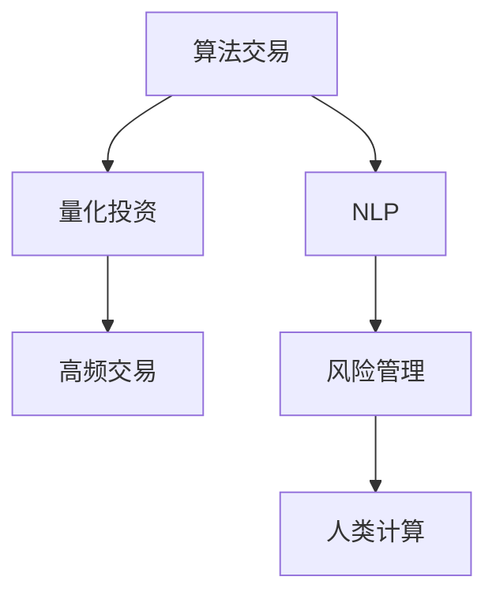

                 

# AI驱动的创新：人类计算在金融领域的应用

> 关键词：金融科技,人工智能,算法交易,量化投资,数据驱动,高频交易,风险管理

## 1. 背景介绍

### 1.1 问题由来

金融行业一直是高度数据驱动的领域，依赖于复杂的统计模型和算法进行投资决策和风险管理。传统金融系统基于历史数据进行预测和分析，但其准确性和时效性往往受到市场波动、数据质量、模型复杂度等多种因素的影响。近年来，随着人工智能技术的快速发展，尤其是机器学习、深度学习和自然语言处理等领域的突破，金融领域迎来了新的发展机遇，特别是在量化投资、高频交易和风险管理等方面。

人工智能在金融领域的应用，主要体现在以下几个方面：

- **算法交易**：利用机器学习算法对历史数据进行分析，预测市场走势，自动进行买卖操作，以实现更高效、更精确的交易策略。
- **量化投资**：通过构建数学模型，对大量数据进行分析和预测，优化资产配置，实现长期稳定收益。
- **风险管理**：利用人工智能技术对复杂金融产品的定价、信用评估、市场风险进行量化分析，提升风险识别和控制能力。
- **客户服务**：利用自然语言处理技术，开发智能客服、智能投顾等应用，提升客户体验和服务效率。

这些应用不仅提高了金融机构的决策效率和市场竞争力，还为个人投资者提供了更科学、更便捷的投资工具。但同时，也带来了一系列新的技术和管理挑战，如模型复杂度增加、数据隐私和安全问题、算法稳定性等。

### 1.2 问题核心关键点

金融领域应用人工智能，需要解决以下几个核心关键问题：

- **数据质量**：高质量、实时性的数据是AI模型的基础。金融领域的数据来源多样、格式复杂，如何清洗、整合和预处理数据，是AI应用的前提。
- **算法优化**：金融领域的数据具有高维度、非线性、随机性等特点，如何设计高效的算法模型，提升预测准确性和模型鲁棒性，是AI应用的核心。
- **实时性和稳定性**：金融市场瞬息万变，AI模型的预测和决策需要实时响应，且要求高稳定性，避免因模型缺陷导致的重大损失。
- **模型解释性**：金融模型的预测结果往往影响重大决策，需要具备良好的可解释性，便于理解、审核和管理。

解决好这些问题，才能使人工智能技术在金融领域发挥出最大潜力。

## 2. 核心概念与联系

### 2.1 核心概念概述

在金融领域应用人工智能，涉及的核心概念包括：

- **算法交易(Algorithmic Trading)**：利用计算机算法进行自动交易，实现高频、低成本、高收益的交易策略。
- **量化投资(Qantitative Investment)**：基于数学模型和统计分析进行投资决策，实现资产组合优化和风险管理。
- **高频交易(High-Frequency Trading, HFT)**：通过高频次的交易操作，获取市场微小波动的利润。
- **自然语言处理(Natural Language Processing, NLP)**：利用计算机对文本数据进行分析和理解，应用于智能客服、智能投顾等应用。
- **风险管理(Risk Management)**：通过量化分析金融产品的风险和收益，实现风险识别、定价和控制。
- **人类计算(Human-Computer Interaction, HCI)**：结合人类的主观判断和计算机的自动处理，提升决策的准确性和效率。

这些概念之间相互联系，共同构成了金融领域人工智能应用的全貌。以下通过Mermaid流程图展示这些概念的联系：



从图中可以看出，算法交易和量化投资是金融AI应用的基础，高频交易则是其特例。NLP和风险管理则是对金融AI应用的重要补充，而人类计算则作为用户界面，提供人机交互的机会，使AI模型更贴近用户需求。

### 2.2 核心概念原理和架构

#### 2.2.1 算法交易原理

算法交易是一种基于计算机程序的自动交易策略，旨在通过程序化的方式实现交易决策。其基本流程如下：

1. **数据收集**：收集历史交易数据、市场行情、新闻资讯等数据。
2. **模型训练**：利用机器学习算法对数据进行建模，构建交易模型。
3. **交易执行**：根据模型预测结果，自动下达交易订单。
4. **性能评估**：评估模型的实际交易表现，不断优化和迭代。

##### 数据收集与预处理

数据收集是算法交易的基础。金融市场数据包括历史价格、成交量、订单流、新闻资讯等，数据量大且多样。数据预处理包括清洗、转换、聚合、归一化等步骤，目的是提高数据质量，便于模型训练和分析。

##### 模型训练与选择

常见的算法交易模型包括回归模型、决策树、随机森林、神经网络等。回归模型用于预测市场趋势，决策树和随机森林用于特征选择和交易决策，神经网络用于处理非线性关系和复杂特征。

##### 交易执行与评估

交易执行是模型应用的核心。常见的交易策略包括趋势跟随、均值回归、动量策略等。交易评估包括模型回测、风险控制、盈亏分析等，目的是验证模型性能，优化交易策略。

#### 2.2.2 量化投资原理

量化投资是基于数学模型和统计分析进行投资决策的过程。其基本流程如下：

1. **数据收集**：收集历史股价、财务报表、市场资讯等数据。
2. **模型训练**：利用统计模型和机器学习算法对数据进行建模，构建投资模型。
3. **资产配置**：利用模型进行资产组合优化，实现风险分散和收益最大化。
4. **风险管理**：利用量化工具对投资风险进行识别和控制。

##### 数据收集与预处理

量化投资的数据来源包括财务报表、市场数据、宏观经济数据等。数据预处理包括清洗、转换、归一化等步骤，目的是提高数据质量，便于模型训练和分析。

##### 模型训练与选择

常见的量化投资模型包括CAPM模型、Fama-French模型、Portfolio Optimization模型等。CAPM模型用于风险评估，Fama-French模型用于因子选择，Portfolio Optimization模型用于资产配置。

##### 资产配置与风险管理

资产配置是量化投资的核心。常见的资产配置方法包括均值-方差优化、因子回归、蒙特卡洛模拟等。风险管理利用量化工具进行风险识别、定价和控制，常用的风险指标包括VaR、ES、CVaR等。

## 3. 核心算法原理 & 具体操作步骤
### 3.1 算法原理概述

金融领域应用人工智能，涉及的核心算法包括：

- **回归算法(Regression)**：用于预测市场趋势和风险。
- **决策树和随机森林(Decision Trees and Random Forests)**：用于特征选择和交易决策。
- **神经网络(Neural Networks)**：用于处理非线性关系和复杂特征。
- **支持向量机(Support Vector Machines, SVM)**：用于分类和回归任务。
- **时间序列分析(Time Series Analysis)**：用于预测市场波动和趋势。
- **自然语言处理(NLP)**：用于情感分析、舆情监测、文本挖掘等任务。

### 3.2 算法步骤详解

#### 3.2.1 数据预处理

数据预处理是金融AI应用的基础。其步骤包括：

1. **数据清洗**：处理缺失值、异常值、重复值等数据问题。
2. **特征工程**：提取、选择、构造特征，提高数据质量。
3. **数据转换**：将数据转换为模型所需格式，如归一化、标准化等。

#### 3.2.2 模型训练与选择

模型训练是金融AI应用的核心。其步骤包括：

1. **模型选择**：选择合适的算法模型，如回归模型、决策树、神经网络等。
2. **数据划分**：将数据划分为训练集、验证集、测试集，便于模型训练和评估。
3. **模型训练**：利用训练集数据对模型进行训练，优化模型参数。
4. **模型评估**：利用验证集和测试集数据对模型进行评估，选择最优模型。

#### 3.2.3 模型应用与优化

模型应用是金融AI应用的关键。其步骤包括：

1. **模型应用**：利用训练好的模型进行数据预测或交易决策。
2. **模型优化**：根据实际应用情况，对模型进行优化和调整，提升预测准确性和决策效率。

### 3.3 算法优缺点

#### 3.3.1 优点

金融领域应用人工智能的优点包括：

- **高效率**：通过自动化交易和决策，大幅提升交易和投资效率。
- **高准确性**：利用先进算法和技术，提升预测和决策的准确性。
- **风险控制**：通过量化风险管理工具，实现风险识别和控制。

#### 3.3.2 缺点

金融领域应用人工智能的缺点包括：

- **数据依赖**：对高质量、实时性的数据依赖较高，数据采集和处理成本较高。
- **模型复杂**：算法模型较为复杂，需要具备较高的技术门槛。
- **稳定性不足**：金融市场瞬息万变，模型可能存在不稳定性和预测偏差。
- **法律合规**：金融行业对合规性要求较高，需严格遵守相关法律法规。

### 3.4 算法应用领域

#### 3.4.1 算法交易

算法交易是金融AI应用的主要领域之一。其应用场景包括：

- **股票交易**：利用算法模型预测市场走势，自动下达买卖订单。
- **期货交易**：利用算法模型预测价格波动，进行套利和投机。
- **外汇交易**：利用算法模型预测汇率变化，进行外汇交易。

#### 3.4.2 量化投资

量化投资是金融AI应用的另一重要领域。其应用场景包括：

- **资产配置**：利用统计模型和机器学习算法，优化资产配置，实现长期稳定收益。
- **风险管理**：利用量化工具对投资风险进行识别和控制，如VaR、ES、CVaR等。
- **因子分析**：利用因子分析方法，识别影响资产收益的因素，构建投资模型。

#### 3.4.3 高频交易

高频交易是算法交易的一种特例，其特点是交易频率高、时间粒度小。其应用场景包括：

- **股票高频交易**：利用高频算法模型，获取市场微小波动利润。
- **外汇高频交易**：利用高频算法模型，进行外汇投机交易。
- **期货高频交易**：利用高频算法模型，进行期货套利交易。

#### 3.4.4 风险管理

风险管理是金融AI应用的重要补充。其应用场景包括：

- **信用评估**：利用量化工具对借款人信用进行评估，控制信用风险。
- **市场风险管理**：利用量化工具对市场风险进行识别和控制，如Liquidity Risk、Credit Risk等。
- **操作风险管理**：利用量化工具对操作风险进行识别和控制，如交易算法风险、系统风险等。

## 4. 数学模型和公式 & 详细讲解 & 举例说明

### 4.1 数学模型构建

金融领域应用人工智能，涉及的数学模型包括：

- **回归模型(Regression Model)**：用于预测市场趋势和风险，如线性回归、逻辑回归等。
- **决策树模型(Decision Tree Model)**：用于特征选择和交易决策，如CART、C4.5等。
- **神经网络模型(Neural Network Model)**：用于处理非线性关系和复杂特征，如多层感知器、卷积神经网络等。
- **时间序列模型(Time Series Model)**：用于预测市场波动和趋势，如ARIMA、LSTM等。

### 4.2 公式推导过程

#### 4.2.1 线性回归

线性回归是一种基本的回归模型，用于预测连续型变量的值。其公式推导如下：

$$
y = \beta_0 + \beta_1 x_1 + \beta_2 x_2 + \cdots + \beta_n x_n + \epsilon
$$

其中 $y$ 为预测值，$x_1, x_2, \cdots, x_n$ 为自变量，$\beta_0, \beta_1, \beta_2, \cdots, \beta_n$ 为回归系数，$\epsilon$ 为误差项。

线性回归的模型训练目标是使预测值 $y$ 与真实值 $y_{true}$ 之间的误差最小化，即：

$$
\min_{\beta_0, \beta_1, \cdots, \beta_n} \sum_{i=1}^n (y_{i} - \beta_0 - \beta_1 x_{1i} - \beta_2 x_{2i} - \cdots - \beta_n x_{ni})^2
$$

利用最小二乘法求解最优回归系数 $\beta_0, \beta_1, \cdots, \beta_n$。

#### 4.2.2 决策树

决策树是一种基于树形结构的分类模型，用于特征选择和交易决策。其公式推导如下：

$$
\min_{T} \frac{1}{n} \sum_{i=1}^n \sum_{j=1}^m \mathbb{I}(y_i \neq y_j)
$$

其中 $T$ 为决策树，$\mathbb{I}(y_i \neq y_j)$ 为分类误差指标，$n$ 为样本数量，$m$ 为叶节点数量。

决策树的模型训练目标是使分类误差最小化，即：

1. 根据特征 $x_1, x_2, \cdots, x_n$ 对样本进行划分，形成决策树。
2. 对划分后的样本进行递归分割，形成叶节点。
3. 对每个叶节点进行分类，最小化分类误差。

#### 4.2.3 神经网络

神经网络是一种基于人工神经元模型的非线性模型，用于处理非线性关系和复杂特征。其公式推导如下：

$$
y = \sigma(\sum_{i=1}^n w_i x_i + b)
$$

其中 $y$ 为输出，$x_1, x_2, \cdots, x_n$ 为输入，$w_i$ 为权重，$b$ 为偏置，$\sigma$ 为激活函数。

神经网络的模型训练目标是使预测值 $y$ 与真实值 $y_{true}$ 之间的误差最小化，即：

$$
\min_{w, b} \sum_{i=1}^n (y_{i} - \sigma(\sum_{j=1}^n w_j x_{ji} + b))^2
$$

利用反向传播算法求解最优权重 $w$ 和偏置 $b$。

#### 4.2.4 时间序列模型

时间序列模型是一种基于时间序列数据的预测模型，用于预测市场波动和趋势。其公式推导如下：

$$
y_t = \alpha + \beta_1 y_{t-1} + \beta_2 y_{t-2} + \cdots + \beta_p y_{t-p} + \epsilon_t
$$

其中 $y_t$ 为第 $t$ 期的预测值，$y_{t-1}, y_{t-2}, \cdots, y_{t-p}$ 为历史数据，$\alpha$ 为常数项，$\beta_1, \beta_2, \cdots, \beta_p$ 为模型系数，$\epsilon_t$ 为误差项。

时间序列模型的模型训练目标是使预测值 $y_t$ 与真实值 $y_{true}$ 之间的误差最小化，即：

$$
\min_{\alpha, \beta_1, \cdots, \beta_p} \sum_{i=1}^n (y_{i} - (\alpha + \beta_1 y_{i-1} + \beta_2 y_{i-2} + \cdots + \beta_p y_{i-p}))^2
$$

利用最小二乘法求解最优系数 $\alpha, \beta_1, \cdots, \beta_p$。

## 5. 项目实践：代码实例和详细解释说明

### 5.1 开发环境搭建

金融领域AI应用的开发环境包括：

- **编程语言**：Python、R、Java等。
- **开发框架**：TensorFlow、PyTorch、Scikit-Learn等。
- **数据处理工具**：Pandas、NumPy、Dask等。
- **可视化工具**：Matplotlib、Seaborn、Tableau等。
- **部署平台**：AWS、Azure、Google Cloud等。

以下以Python为例，介绍开发环境的搭建步骤：

1. 安装Python和相关依赖：
   ```bash
   pip install numpy pandas scikit-learn matplotlib seaborn jupyter notebook
   ```

2. 安装TensorFlow和PyTorch：
   ```bash
   pip install tensorflow pytorch
   ```

3. 安装机器学习库：
   ```bash
   pip install scikit-learn xgboost lightgbm catboost
   ```

4. 安装可视化库：
   ```bash
   pip install matplotlib seaborn plotly
   ```

5. 安装部署平台：
   ```bash
   pip install awscli azure-cli
   ```

### 5.2 源代码详细实现

以下以线性回归模型为例，介绍金融AI应用的代码实现。

```python
import numpy as np
from sklearn.linear_model import LinearRegression

# 构造训练数据
X = np.array([[1, 2], [3, 4], [5, 6], [7, 8]])
y = np.array([2, 4, 6, 8])

# 训练线性回归模型
model = LinearRegression()
model.fit(X, y)

# 预测新数据
X_new = np.array([[9, 10], [11, 12]])
y_new = model.predict(X_new)

print(y_new)
```

### 5.3 代码解读与分析

上述代码实现了一个简单的线性回归模型，用于预测新数据。代码解析如下：

- 首先导入必要的库，包括NumPy和Scikit-Learn。
- 构造训练数据，包括特征矩阵 $X$ 和标签向量 $y$。
- 训练线性回归模型，使用Scikit-Learn的LinearRegression类。
- 预测新数据，使用训练好的模型进行预测。

## 6. 实际应用场景

### 6.1 智能投顾系统

智能投顾系统是金融AI应用的重要场景之一，利用人工智能技术为投资者提供个性化、智能化的投资建议。其基本流程如下：

1. **用户画像构建**：收集用户的历史交易记录、财务状况、风险偏好等数据，构建用户画像。
2. **投资策略设计**：利用机器学习算法，设计多策略投资组合，进行资产配置。
3. **风险评估与控制**：利用量化工具对投资风险进行识别和控制，如VaR、ES、CVaR等。
4. **动态调整与优化**：根据市场变化，动态调整投资策略，优化资产配置。

### 6.2 算法交易平台

算法交易平台是金融AI应用的另一重要场景，利用算法模型进行自动交易，实现高频、低成本、高收益的交易策略。其基本流程如下：

1. **市场数据收集**：收集历史交易数据、市场行情、新闻资讯等数据。
2. **模型训练**：利用机器学习算法对数据进行建模，构建交易模型。
3. **交易执行**：根据模型预测结果，自动下达交易订单。
4. **性能评估**：评估模型的实际交易表现，不断优化和迭代。

### 6.3 风险管理平台

风险管理平台是金融AI应用的重要补充，利用量化工具对金融产品的风险进行识别和控制。其基本流程如下：

1. **数据收集**：收集金融产品的历史数据、市场数据、财务报表等数据。
2. **模型训练**：利用统计模型和机器学习算法对数据进行建模，构建风险管理模型。
3. **风险识别**：利用模型对金融产品的风险进行识别，如信用风险、市场风险等。
4. **风险控制**：利用量化工具对风险进行控制，如信用评级、风险对冲等。

## 7. 工具和资源推荐

### 7.1 学习资源推荐

为了帮助开发者系统掌握金融领域AI应用的技术，以下是一些推荐的学习资源：

- **《Python for Finance》书籍**：由Stanley E. Fawcett撰写，详细介绍Python在金融领域的应用，包括数据处理、算法实现等。
- **Coursera《Machine Learning in Finance》课程**：由IEOR A.M. at Columbia University开设，涵盖机器学习在金融领域的应用，包括回归模型、决策树、神经网络等。
- **Kaggle金融数据集**：包含大量的金融数据集和算法竞赛，适合实践和竞赛。
- **Alpha Vantage API**：提供全球股票、外汇、加密货币等金融数据，适合实时数据获取。

### 7.2 开发工具推荐

开发金融AI应用的常用工具包括：

- **Python**：简单易学、功能强大，是金融AI开发的主要语言。
- **TensorFlow**：Google开发的深度学习框架，支持分布式计算和GPU加速。
- **PyTorch**：Facebook开发的深度学习框架，易于调试和优化。
- **Scikit-Learn**：Python的机器学习库，涵盖常用的机器学习算法。
- **Pandas**：Python的数据处理库，支持高效的数据清洗和处理。
- **NumPy**：Python的数值计算库，支持高效的数学运算。

### 7.3 相关论文推荐

金融领域AI应用的最新研究进展，可以参考以下论文：

- **《High-Frequency Trading: An Overview of Models, Architectures and Data Analysis》**：由Dmitri V. Vyukov等撰写，详细介绍高频交易的模型、架构和数据分析方法。
- **《Machine Learning in Finance》**：由Eugene Flerov等撰写，探讨机器学习在金融领域的应用，包括回归模型、神经网络、时间序列模型等。
- **《Portfolio Optimization Using Machine Learning Techniques》**：由Marie Th("//)ring et al.撰写，讨论机器学习在资产配置中的应用。

## 8. 总结：未来发展趋势与挑战

### 8.1 研究成果总结

金融领域应用人工智能，已经取得了显著的进展，涵盖算法交易、量化投资、风险管理等多个方面。未来，随着数据技术的不断进步，人工智能技术将在金融领域发挥更大的作用。

### 8.2 未来发展趋势

未来金融AI应用的发展趋势包括：

- **数据驱动化**：金融AI的发展将越来越依赖于数据的质量和数量。高质量、实时性的数据是AI应用的基础，数据驱动化将是未来发展的核心。
- **算法多样化**：金融市场瞬息万变，需要多样化的算法模型来应对市场变化，如深度学习、强化学习、进化算法等。
- **技术集成化**：金融AI的应用需要与区块链、大数据、云计算等技术进行深度集成，形成完整的生态系统。
- **模型自动化**：未来金融AI将越来越自动化，减少人工干预，提升效率和精度。

### 8.3 面临的挑战

金融AI应用面临的挑战包括：

- **数据质量**：高质量、实时性的数据获取难度较大，数据预处理和清洗成本较高。
- **算法复杂性**：金融市场复杂多变，算法模型的设计和实现难度较大。
- **法律合规**：金融行业对合规性要求较高，需严格遵守相关法律法规。
- **模型稳定性**：金融市场瞬息万变，模型可能存在不稳定性和预测偏差。

### 8.4 研究展望

未来金融AI应用的研究展望包括：

- **数据驱动的算法优化**：通过大数据技术，优化算法模型的训练过程，提高模型性能。
- **跨领域知识的整合**：结合人工智能与金融学、经济学等领域的知识，提升模型的预测和决策能力。
- **模型可解释性**：提升模型的可解释性，便于理解、审核和管理。
- **多模态数据的融合**：结合金融数据与图像、语音等多模态数据，提升模型的综合分析能力。

## 9. 附录：常见问题与解答

**Q1: 金融AI应用有哪些典型的成功案例？**

A: 金融AI应用的典型成功案例包括：

- **JP Morgan Chase**：利用机器学习技术进行信用风险评估和信用评级，显著提高了信用评估的准确性和效率。
- **Goldman Sachs**：利用深度学习技术进行高频交易，获取市场微小波动利润。
- **Bank of America**：利用人工智能技术进行量化投资，优化资产配置和风险控制，实现长期稳定收益。

**Q2: 如何确保金融AI应用的合规性？**

A: 确保金融AI应用的合规性，需要注意以下几点：

- **数据隐私保护**：严格遵守数据隐私保护法律法规，如GDPR、CCPA等，保护用户隐私。
- **模型透明性**：提高模型的透明性和可解释性，便于审核和监管。
- **风险管理**：建立完备的风险管理机制，对模型进行持续监控和评估。
- **合规审核**：定期进行合规审核，确保模型符合相关法律法规。

**Q3: 如何提升金融AI应用的稳定性？**

A: 提升金融AI应用的稳定性，需要注意以下几点：

- **数据质量**：确保高质量、实时性的数据来源，减少数据噪音和异常值。
- **模型鲁棒性**：设计鲁棒性较强的算法模型，提高模型的泛化能力和抗干扰能力。
- **测试与验证**：通过充分的测试和验证，发现和修复模型的缺陷。
- **持续优化**：根据市场变化，持续优化和调整模型，保持模型的稳定性。

**Q4: 如何提升金融AI应用的效率？**

A: 提升金融AI应用的效率，需要注意以下几点：

- **算法优化**：选择高效、简洁的算法模型，减少计算资源消耗。
- **模型裁剪**：对模型进行裁剪，去除不必要的层和参数，减小模型尺寸。
- **模型并行**：利用分布式计算和模型并行，提升模型的计算效率。
- **硬件加速**：利用GPU、TPU等硬件设备，加速模型的计算和推理。

**Q5: 如何处理金融数据的高维性和非线性特征？**

A: 处理金融数据的高维性和非线性特征，需要注意以下几点：

- **特征工程**：通过特征选择和构造，减少数据的维度，提高数据质量。
- **模型选择**：选择能够处理高维数据和非线性关系的算法模型，如深度学习、神经网络、支持向量机等。
- **数据增强**：通过数据增强技术，如回译、近义替换等，提高模型的泛化能力。
- **模型融合**：结合多种模型进行融合，提升模型的综合性能。

**Q6: 如何处理金融数据的时效性问题？**

A: 处理金融数据的时效性问题，需要注意以下几点：

- **实时数据采集**：通过API、消息队列等手段，实时采集市场数据和用户数据。
- **流式处理**：利用流式处理技术，对数据进行实时处理和分析。
- **缓存技术**：利用缓存技术，提高数据的读取速度和处理效率。
- **多级存储**：利用多级存储技术，提高数据的存储和读取效率。

以上问题及解答，旨在帮助金融AI应用的开发者更好地理解和应用人工智能技术，推动金融行业向智能化、自动化发展。

---

作者：禅与计算机程序设计艺术 / Zen and the Art of Computer Programming

