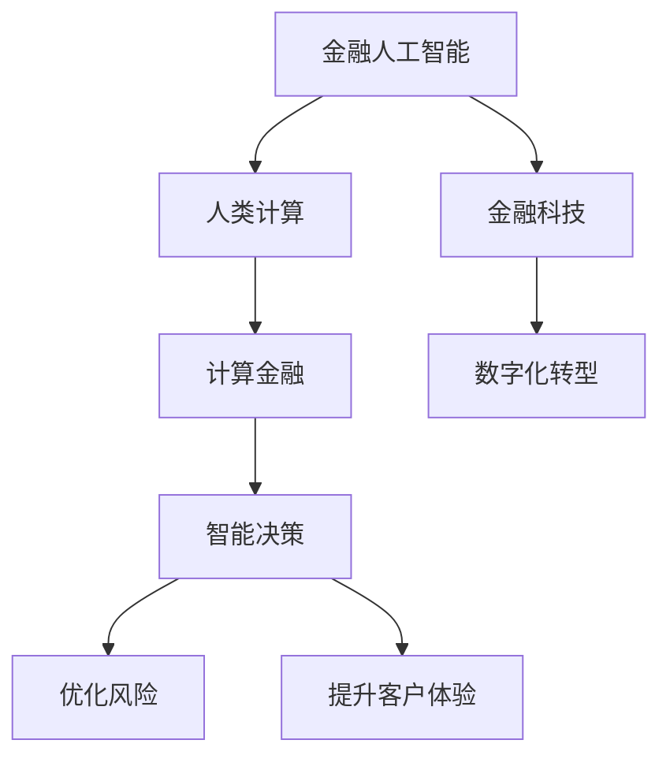

                 

# AI驱动的创新：人类计算在金融领域的潜力

## 1. 背景介绍

在金融领域，人工智能（AI）技术的迅猛发展正在彻底改变传统金融服务的模式和方式。AI驱动的创新不仅提升了金融机构的效率和竞争力，也为用户带来了更加个性化、智能化的金融体验。其中，人类计算（Human Computation）在金融领域的应用尤为引人注目。人类计算，即利用人类智能与计算技术的融合，通过有效利用人类的分析、直觉和判断能力，解决复杂的金融问题。本文将深入探讨人类计算在金融领域的潜力，分析其在风险管理、投资分析、信用评估等场景中的应用，并展望未来发展趋势。

### 1.1 问题由来

随着金融市场的复杂性和不确定性的增加，传统基于规则和模型的金融分析方法已难以适应市场变化。金融机构需要更强大的工具来处理和分析海量数据，预测市场走势，优化投资策略，评估信用风险，提高决策效率和准确性。人类计算技术的引入，正是解决这一问题的有效途径。

### 1.2 问题核心关键点

人类计算在金融领域的核心在于将人类专家的直觉、经验和知识与计算技术结合，通过算法增强、数据驱动和模型优化，实现对复杂金融问题的深度分析和决策支持。其关键点包括：
- **深度融合**：将人类专家的经验与机器学习模型相结合，提升决策的准确性和可靠性。
- **数据驱动**：通过大数据和实时数据，增强金融决策的科学性和前瞻性。
- **模型优化**：利用计算技术优化风险模型、投资模型和信用评估模型，提升金融分析的效率和精度。

## 2. 核心概念与联系

### 2.1 核心概念概述

为了更好地理解人类计算在金融领域的应用，本节将介绍几个关键概念及其相互联系：

- **金融人工智能（FinAI）**：指将AI技术应用于金融领域，通过数据分析、模型构建和智能决策等手段，提升金融服务的效率和智能化水平。
- **人类计算（Human Computation）**：利用人类智能与计算技术的融合，通过算法增强、数据驱动和模型优化，解决复杂的金融问题。
- **计算金融（Computational Finance）**：结合金融学和计算机科学，运用计算方法分析和预测金融市场，优化投资策略和风险管理。
- **金融科技（Fintech）**：利用新兴技术（如区块链、人工智能、大数据等），改造和创新金融业务流程，提升金融服务的便利性和安全性。

这些概念之间的逻辑关系可以通过以下Mermaid流程图来展示：



这个流程图展示了大语言模型微调的核心概念及其之间的关系：

1. 金融人工智能是整体框架，涵盖计算金融和金融科技。
2. 人类计算通过算法增强和数据驱动，提升智能决策能力。
3. 计算金融与人类计算紧密结合，提供风险管理和优化模型。
4. 金融科技通过技术创新，支持金融业务的数字化转型。
5. 智能决策不仅优化风险管理，还提升客户体验。

这些概念共同构成了金融人工智能的整体架构，使其能够更全面地支持金融服务。通过理解这些核心概念，我们可以更好地把握金融人工智能的发展方向和应用价值。

## 3. 核心算法原理 & 具体操作步骤
### 3.1 算法原理概述

人类计算在金融领域的应用主要基于以下算法原理：

1. **深度学习模型优化**：通过深度学习模型，对历史数据进行学习和预测，优化风险评估、投资策略和信用评估模型。
2. **增强学习（Reinforcement Learning, RL）**：利用增强学习算法，通过模拟环境，训练智能决策系统，使其在复杂金融环境中做出最优决策。
3. **自然语言处理（Natural Language Processing, NLP）**：通过NLP技术，处理和分析大量金融文本数据，提取有用的信息，支持金融分析和决策。
4. **数据挖掘与分析**：利用数据挖掘技术，从金融大数据中挖掘有价值的模式和趋势，辅助决策。
5. **实时数据处理**：通过实时数据处理技术，快速分析市场动态，调整投资策略和风险管理方案。

### 3.2 算法步骤详解

基于人类计算的金融算法通常包括以下关键步骤：

**Step 1: 数据准备与预处理**
- 收集和整理相关的金融数据，如市场数据、财务报表、新闻资讯、社交媒体数据等。
- 清洗和标准化数据，处理缺失值和异常值，进行特征工程。
- 将数据划分为训练集、验证集和测试集，以便模型训练、调参和评估。

**Step 2: 模型构建与训练**
- 选择合适的算法模型，如深度学习、增强学习、决策树、随机森林等。
- 设计模型的输入、输出和损失函数，优化模型参数。
- 使用训练集数据，进行模型训练，逐步优化模型性能。

**Step 3: 模型评估与验证**
- 在验证集上评估模型的性能，调整模型参数，防止过拟合。
- 使用测试集数据，全面评估模型的效果，确认模型在实际应用中的表现。

**Step 4: 模型应用与优化**
- 将模型应用于金融决策，优化投资策略、风险管理和信用评估。
- 持续监控模型表现，根据市场变化进行模型优化和更新。
- 结合人类专家的经验，进一步优化模型决策逻辑。

### 3.3 算法优缺点

人类计算在金融领域的应用具有以下优点：
1. **提高决策效率**：利用计算技术，快速处理和分析大量金融数据，提升决策速度和准确性。
2. **增强决策科学性**：结合大数据和机器学习，提高金融决策的科学性和前瞻性。
3. **降低运营成本**：通过自动化和智能化，减少人力和运营成本，提高资源利用效率。
4. **提升客户体验**：利用智能算法，提供个性化的金融服务和建议，提升客户满意度和忠诚度。

同时，该方法也存在一些局限性：
1. **数据质量依赖**：模型的效果很大程度上取决于数据的质量和完整性，数据缺失或不准确会影响模型性能。
2. **算法复杂性**：模型设计和优化需要一定的技术和知识背景，复杂度较高，对团队要求较高。
3. **模型可解释性**：一些复杂的深度学习模型难以解释其决策过程，缺乏透明度，可能导致信任度不足。
4. **伦理与合规问题**：金融数据涉及隐私和安全，模型设计和应用需要严格遵守法律法规和伦理标准。

尽管存在这些局限性，但就目前而言，人类计算在金融领域的应用仍然处于发展初期，其潜力巨大，前景广阔。未来，随着技术进步和应用深入，这些问题有望逐步得到解决。

### 3.4 算法应用领域

人类计算在金融领域的应用领域非常广泛，主要包括：

- **风险管理**：通过数据分析和模型优化，预测和评估金融风险，如市场风险、信用风险、操作风险等。
- **投资分析**：利用机器学习和数据挖掘技术，分析市场趋势，预测股价走势，优化投资组合。
- **信用评估**：结合财务数据和行为数据，评估个人和企业信用风险，提高信用审批的准确性和效率。
- **智能客服**：通过NLP技术和智能决策算法，提供个性化的金融咨询和客户服务。
- **欺诈检测**：利用增强学习和数据挖掘技术，识别和防范金融欺诈行为，保护客户资产安全。

除了上述这些领域，人类计算还将在金融科技的众多方面得到应用，如支付系统、区块链、智能合约等，为金融服务带来新的创新和突破。

## 4. 数学模型和公式 & 详细讲解 & 举例说明

### 4.1 数学模型构建

在本节中，我们将介绍几种典型的金融模型，并使用数学语言对其实际应用进行描述。

- **风险价值模型（Value at Risk, VaR）**：评估资产组合在一定置信水平下的最大潜在损失。
- **投资组合优化模型**：通过优化模型，确定最优的投资组合，实现风险收益的平衡。
- **信用评分模型**：利用机器学习算法，预测个人或企业的信用风险，评估信用等级。

### 4.2 公式推导过程

以下以风险价值模型为例，推导其数学公式：

假设某金融资产的当前价格为 $S_0$，持有期为 $T$ 天，日波动率为 $\sigma$，无风险利率为 $r$。在持有期间的最大潜在损失为 $X$，则风险价值为：

$$
VaR = \frac{X}{100} \times 100\%
$$

其中，$X$ 为持有期间的最大潜在损失，计算公式为：

$$
X = -S_0 \times \left[ \Phi^{-1}(p) + \ln \left( \frac{1-p}{1-q} \right) + \frac{\sigma^2 T}{2} \right]
$$

其中，$\Phi^{-1}$ 为标准正态分布的逆函数，$p$ 为置信水平，$q$ 为1减去置信水平。

### 4.3 案例分析与讲解

以股票价格预测为例，介绍如何利用机器学习模型进行金融分析。

假设我们有一组历史股价数据 $\{S_t\}_{t=1}^n$，其中 $S_t$ 为第 $t$ 天的股价。通过时间序列分析，我们可以构建ARIMA模型或LSTM模型，进行股价预测。模型的输入为前 $m$ 天的股价数据，输出为第 $m+1$ 天的预测股价 $S_{m+1}$。

具体步骤如下：

1. **数据预处理**：将历史股价数据标准化，去除异常值和缺失值，划分训练集和测试集。
2. **模型选择**：选择ARIMA或LSTM模型，设置模型参数。
3. **模型训练**：使用训练集数据，训练模型参数。
4. **模型评估**：在测试集上评估模型性能，如均方误差（MSE）、平均绝对误差（MAE）等。
5. **预测应用**：将模型应用于实际数据，进行股价预测。

通过这种方式，可以构建出准确预测股价的机器学习模型，辅助投资者进行决策。

## 5. 项目实践：代码实例和详细解释说明
### 5.1 开发环境搭建

在进行金融领域的人机计算项目开发前，我们需要准备好开发环境。以下是使用Python进行PyTorch开发的环境配置流程：

1. 安装Anaconda：从官网下载并安装Anaconda，用于创建独立的Python环境。

2. 创建并激活虚拟环境：
```bash
conda create -n pytorch-env python=3.8 
conda activate pytorch-env
```

3. 安装PyTorch：根据CUDA版本，从官网获取对应的安装命令。例如：
```bash
conda install pytorch torchvision torchaudio cudatoolkit=11.1 -c pytorch -c conda-forge
```

4. 安装Transformers库：
```bash
pip install transformers
```

5. 安装各类工具包：
```bash
pip install numpy pandas scikit-learn matplotlib tqdm jupyter notebook ipython
```

完成上述步骤后，即可在`pytorch-env`环境中开始项目开发。

### 5.2 源代码详细实现

下面我们以信用评分模型为例，给出使用Transformers库对GPT模型进行信用评分模型微调的PyTorch代码实现。

首先，定义信用评分模型的训练集和测试集：

```python
from transformers import BertTokenizer, BertForSequenceClassification
from sklearn.model_selection import train_test_split
import torch
import numpy as np

# 准备数据
# 假设data为已处理好的财务和行为数据
X_train, X_test, y_train, y_test = train_test_split(data['features'], data['label'], test_size=0.2, random_state=42)

# 创建tokenizer和model
tokenizer = BertTokenizer.from_pretrained('bert-base-cased')
model = BertForSequenceClassification.from_pretrained('bert-base-cased', num_labels=2)

# 创建dataloader
train_dataloader = DataLoader(X_train, batch_size=32, shuffle=True)
test_dataloader = DataLoader(X_test, batch_size=32, shuffle=False)

# 训练模型
def train_epoch(model, data_loader, optimizer, device):
    model.train()
    total_loss = 0
    for batch in data_loader:
        input_ids = batch['input_ids'].to(device)
        attention_mask = batch['attention_mask'].to(device)
        labels = batch['labels'].to(device)
        optimizer.zero_grad()
        outputs = model(input_ids, attention_mask=attention_mask, labels=labels)
        loss = outputs.loss
        total_loss += loss.item()
        loss.backward()
        optimizer.step()
    return total_loss / len(data_loader)

def evaluate(model, data_loader, device):
    model.eval()
    total_preds = []
    total_labels = []
    with torch.no_grad():
        for batch in data_loader:
            input_ids = batch['input_ids'].to(device)
            attention_mask = batch['attention_mask'].to(device)
            labels = batch['labels'].to(device)
            outputs = model(input_ids, attention_mask=attention_mask)
            logits = outputs.logits.argmax(dim=1)
            total_preds.append(logits.cpu().tolist())
            total_labels.append(labels.cpu().tolist())
    return classification_report(total_labels, total_preds)

# 训练和评估模型
epochs = 5
batch_size = 32

device = torch.device('cuda' if torch.cuda.is_available() else 'cpu')
model.to(device)

for epoch in range(epochs):
    train_loss = train_epoch(model, train_dataloader, optimizer, device)
    print(f"Epoch {epoch+1}, train loss: {train_loss:.4f}")
    
    test_preds = evaluate(model, test_dataloader, device)
    print(test_preds)
```

在上述代码中，我们利用BERT模型对信用评分数据进行了序列分类任务的微调。具体步骤如下：

1. **数据准备**：将财务和行为数据标准化，划分为训练集和测试集。
2. **模型选择**：选择BERT模型，设置序列分类任务。
3. **训练模型**：使用训练集数据，训练模型参数。
4. **评估模型**：在测试集上评估模型性能，给出分类指标。
5. **运行结果**：输出模型在测试集上的预测结果和分类指标。

### 5.3 代码解读与分析

让我们再详细解读一下关键代码的实现细节：

**数据准备**：
- 使用`train_test_split`函数，将数据划分为训练集和测试集。
- 将训练集和测试集数据标准化，并将其转化为token ids。

**模型选择**：
- 选择BERT模型，设置序列分类任务的标签数为2。

**训练模型**：
- 定义`train_epoch`函数，用于计算每个epoch的损失。
- 在每个epoch中，前向传播计算损失函数，反向传播更新模型参数。

**评估模型**：
- 定义`evaluate`函数，在测试集上评估模型性能。
- 在每个batch中，计算模型的预测结果，并与标签比较，生成分类指标。

**训练流程**：
- 定义总的epoch数和batch size，开始循环迭代。
- 每个epoch内，先在训练集上训练，输出平均loss。
- 在验证集上评估，输出分类指标。
- 所有epoch结束后，在测试集上评估，给出最终测试结果。

可以看到，通过Transformers库，我们能够快速构建出基于BERT模型的信用评分模型，并进行微调。代码实现简洁高效，能够显著提升金融分析的效率和精度。

## 6. 实际应用场景

### 6.1 智能投顾

智能投顾（Robo-Advisor）是金融领域的重要应用，通过AI技术提供个性化的投资建议。在智能投顾系统中，利用人类计算技术，可以实时分析市场动态，预测股市走势，调整投资组合，帮助用户实现资产增值。

具体而言，可以收集用户的历史交易数据和市场信息，构建深度学习模型，对未来的市场走势进行预测。同时，结合用户的风险偏好和财务状况，制定个性化的投资策略，动态调整投资组合。智能投顾系统能够24小时不间断运行，快速响应市场变化，提供实时投资建议，提升用户的投资体验和收益。

### 6.2 信用风险管理

信用风险是金融机构面临的主要风险之一，传统的信用风险评估依赖于人工审核和规则系统。利用人类计算技术，可以构建更为精确和高效的信用评估模型，提升风险管理能力。

在信用风险管理中，可以收集用户的财务数据和行为数据，构建多模态数据融合模型，全面评估用户的信用风险。同时，利用增强学习技术，动态调整信用评分模型，优化风险评估策略。通过人类计算技术，金融机构可以实时监控用户的信用状况，快速识别风险点，及时采取防范措施，降低信用损失。

### 6.3 市场情绪分析

市场情绪是影响金融市场的重要因素，传统的情绪分析依赖于人工情绪标注。利用人类计算技术，可以构建基于自然语言处理（NLP）的市场情绪分析模型，实时监控市场动态，预测市场走势。

具体而言，可以收集新闻、社交媒体等金融文本数据，利用NLP技术提取市场情绪信息，构建情感分析模型。通过市场情绪分析，金融机构可以及时了解市场情绪，优化投资策略，防范风险。例如，在市场情绪低迷时，可以采取防御策略，减少投资风险；在市场情绪高涨时，可以加大投资力度，把握投资机会。

### 6.4 未来应用展望

随着人类计算技术的发展，未来在金融领域的应用将更加广泛和深入。以下是几个未来应用的展望：

1. **高频交易系统**：利用人类计算技术，优化高频交易策略，提高交易效率和收益。
2. **金融市场预测**：构建多维度数据融合模型，预测金融市场走势，优化投资组合。
3. **智能合约**：利用区块链和智能合约技术，实现自动化和智能化的金融交易和管理。
4. **金融欺诈检测**：结合机器学习和数据挖掘技术，识别和防范金融欺诈行为，保障金融安全。
5. **个性化金融服务**：利用大数据和AI技术，提供个性化的金融服务和建议，提升客户满意度和忠诚度。

## 7. 工具和资源推荐
### 7.1 学习资源推荐

为了帮助开发者系统掌握人类计算在金融领域的应用，这里推荐一些优质的学习资源：

1. **《Python金融数据分析实战》**：通过实例演示，介绍Python在金融数据分析中的应用，包括数据预处理、模型构建和结果解读等。
2. **Coursera《金融科技与金融创新》课程**：由世界顶级大学开设的在线课程，涵盖金融科技的最新技术和应用。
3. **Kaggle金融数据分析竞赛**：通过实际竞赛，提升数据处理和模型构建能力，了解金融领域的实际问题。
4. **GitHub开源项目**：关注GitHub上的金融数据分析项目，学习和借鉴优秀实践经验。
5. **金融科技博客**：关注金融科技领域的博客，及时了解最新技术和应用。

通过对这些资源的学习实践，相信你一定能够快速掌握人类计算在金融领域的应用，并用于解决实际的金融问题。

### 7.2 开发工具推荐

高效的开发离不开优秀的工具支持。以下是几款用于人类计算项目开发的常用工具：

1. **Python**：Python是金融数据分析的首选语言，具有丰富的金融分析和机器学习库。
2. **Jupyter Notebook**：交互式编程环境，支持代码编写、数据可视化和结果展示，是金融数据分析的常用工具。
3. **TensorFlow**：Google开发的深度学习框架，支持大规模的分布式计算和模型优化。
4. **PyTorch**：Facebook开发的深度学习框架，灵活高效，适用于金融数据分析和模型构建。
5. **RapidMiner**：数据挖掘和机器学习平台，支持拖拽式建模，易于上手。

合理利用这些工具，可以显著提升金融领域的人机计算项目开发效率，加快创新迭代的步伐。

### 7.3 相关论文推荐

人类计算技术的发展得益于学界的持续研究。以下是几篇奠基性的相关论文，推荐阅读：

1. **《AlphaGo Zero》**：谷歌DeepMind发表的AlphaGo Zero论文，展示了机器学习在复杂游戏领域的突破。
2. **《GPT-3: Language Models are Unsupervised Multitask Learners》**：OpenAI发布的GPT-3论文，展示了大规模语言模型的强大能力。
3. **《Deep Learning for Credit Risk Management》**：哈佛大学和IBM联合发表的论文，探讨了深度学习在信用风险管理中的应用。
4. **《Blockchain-Based Smart Contracts: A Survey and Taxonomy》**：伯克利大学发表的区块链智能合约研究综述，提供了智能合约的全面介绍。
5. **《Computational Financial Economics》**：欧洲经济研究学会（ESERPRES）发表的金融计算综述，介绍了金融计算领域的经典方法和最新进展。

这些论文代表了大语言模型微调技术的发展脉络。通过学习这些前沿成果，可以帮助研究者把握学科前进方向，激发更多的创新灵感。

## 8. 总结：未来发展趋势与挑战

### 8.1 总结

本文对人类计算在金融领域的应用进行了全面系统的介绍。首先阐述了人类计算在金融领域的重要性和应用场景，明确了其在风险管理、投资分析、信用评估等场景中的应用价值。其次，从原理到实践，详细讲解了人类计算的数学模型和关键步骤，给出了人类计算项目开发的完整代码实例。同时，本文还广泛探讨了人类计算技术在智能投顾、信用风险管理、市场情绪分析等领域的实际应用，展示了其在金融服务中的巨大潜力。

通过本文的系统梳理，可以看到，人类计算技术正在成为金融服务的重要工具，极大地提升了金融机构的决策效率和客户体验。未来，伴随人类计算技术的持续演进，必将带来金融领域的革命性变革。

### 8.2 未来发展趋势

展望未来，人类计算在金融领域的应用将呈现以下几个发展趋势：

1. **深度融合**：人类计算将与AI技术深度融合，通过算法增强和数据驱动，实现更为精准和智能的金融决策。
2. **大数据与实时分析**：利用大数据和实时分析技术，提供实时、动态的金融决策支持，提升决策的及时性和科学性。
3. **多模态融合**：结合金融数据、社交数据、行为数据等多种数据源，构建多模态融合模型，全面提升风险管理和投资分析能力。
4. **智能合约**：利用区块链和智能合约技术，实现自动化的金融交易和管理，提升金融服务的效率和安全性。
5. **模型优化与解释**：利用模型解释技术，提升金融模型的透明性和可解释性，增强用户信任和信心。

这些趋势凸显了人类计算技术的广阔前景，将为人机协同的智能金融服务带来新的突破。

### 8.3 面临的挑战

尽管人类计算技术在金融领域展现了巨大的潜力，但在实现大规模应用的过程中，仍面临诸多挑战：

1. **数据质量与隐私保护**：金融数据的复杂性和敏感性，需要严格的数据清洗和隐私保护措施，避免数据泄露和滥用。
2. **模型复杂性与解释性**：复杂的金融模型和高维数据，容易导致模型过拟合和不透明，缺乏可解释性，难以满足监管要求。
3. **系统稳定性与鲁棒性**：金融系统的复杂性和不确定性，要求系统具有高稳定性和鲁棒性，抵御极端市场情况。
4. **技术与人才短缺**：金融计算涉及多学科交叉，对技术和人才的要求较高，需要跨学科的复合型人才。

尽管存在这些挑战，但相信随着技术的不断进步和人才的不断培养，这些问题有望逐步得到解决，人类计算技术必将在金融领域发挥更大的作用。

### 8.4 研究展望

面对人类计算在金融领域面临的挑战，未来的研究需要在以下几个方面寻求新的突破：

1. **数据驱动与模型融合**：探索更多的数据驱动方法，结合金融专家的经验和知识，构建更为智能的金融决策模型。
2. **模型解释与透明性**：研究可解释性模型，提升金融模型的透明性和可解释性，增强用户信任和决策信心。
3. **系统优化与鲁棒性**：研究鲁棒性模型和系统，提高金融系统的稳定性和抗干扰能力，保障系统安全。
4. **跨学科研究**：加强金融计算与其他学科（如心理学、社会学、经济学等）的跨学科研究，提升金融计算的全面性和深度。

这些研究方向的探索，必将引领人类计算在金融领域的发展，为构建智能、高效、安全的金融系统铺平道路。

## 9. 附录：常见问题与解答

**Q1：如何选择合适的数据源？**

A: 在金融领域，数据源的选择至关重要。建议选择权威、公开、实时、可用的数据源，如中央银行、证券交易所、金融市场等。同时，数据清洗和预处理也是关键，需要去除异常值和缺失值，进行特征工程，确保数据质量。

**Q2：如何应对金融市场的复杂性和不确定性？**

A: 金融市场的复杂性和不确定性，需要构建多模态融合模型，结合多种数据源，全面分析市场动态。同时，利用增强学习和随机森林等方法，提升模型的鲁棒性和适应性，降低极端市场情况下的风险。

**Q3：如何保护金融数据隐私？**

A: 金融数据的隐私保护是首要任务。建议采用数据加密、匿名化、访问控制等措施，确保数据安全。同时，需要遵守相关法律法规，如GDPR、CCPA等，保护用户隐私和数据权益。

**Q4：如何提高金融模型的透明性和可解释性？**

A: 提高金融模型的透明性和可解释性，需要采用可解释性模型，如决策树、线性模型等，以及模型解释技术，如LIME、SHAP等，揭示模型的决策逻辑。同时，引入金融专家的经验，结合领域知识，提升模型的可解释性。

**Q5：如何构建高效的金融计算系统？**

A: 构建高效的金融计算系统，需要考虑数据处理、模型优化、系统架构等多个方面。建议采用分布式计算、模型压缩、优化算法等方法，提升系统的效率和鲁棒性。同时，结合人类专家的经验，确保系统的决策逻辑符合金融规则和伦理要求。

---

作者：禅与计算机程序设计艺术 / Zen and the Art of Computer Programming

