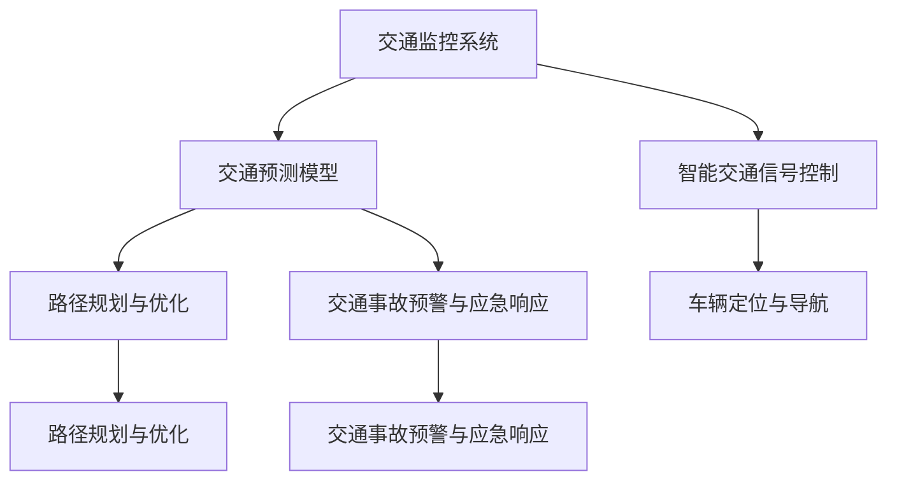

                 

# AI驱动的智能交通管理系统

## 1. 背景介绍

### 1.1 问题由来
随着城市化进程的加速和汽车保有量的快速增长，全球各大城市均面临着严重的交通问题。交通拥堵、事故频发、能耗高企，这些问题不仅损害了城市的生态环境，也影响了居民的生活质量和工作效率。传统交通管理手段如信号灯控制、车辆限行等往往效果有限，且无法实时适应交通环境的变化。

为了缓解交通压力，提升城市交通管理的智能化水平，AI驱动的智能交通管理系统（AI Traffic Management System, ATMS）应运而生。ATMS 通过大数据、云计算和人工智能技术，实时监测和预测交通状态，动态调整交通信号和路线，优化交通流，提升道路通行效率和安全性。

## 2. 核心概念与联系

### 2.1 核心概念概述

为更好地理解AI驱动的智能交通管理系统，本节将介绍几个密切相关的核心概念：

- **交通监控系统（Traffic Surveillance System）**：利用摄像头、传感器等设备，实时采集交通数据，如车辆位置、速度、交通流量等，为ATMS提供数据支撑。
- **交通预测模型（Traffic Prediction Model）**：基于历史交通数据和实时监测数据，预测未来交通状态，如拥堵点、事故高发区域等，为ATMS提供决策依据。
- **智能交通信号控制（Smart Traffic Signal Control）**：根据交通预测模型结果，动态调整交通信号灯的时序和颜色，优化交通流，减少拥堵，提高通行效率。
- **车辆定位与导航（Vehicle Location and Navigation）**：利用GPS等定位技术，实时监控和管理车辆位置和轨迹，辅助驾驶员规划路线，提升行车安全。
- **路径规划与优化（Path Planning and Optimization）**：通过算法计算最优路径，引导车辆避让拥堵路段，提高行车效率。
- **交通事故预警与应急响应（Traffic Accident Warning and Emergency Response）**：识别交通事故，及时报警，并辅助事故现场的紧急处理。

这些核心概念之间的逻辑关系可以通过以下Mermaid流程图来展示：



这个流程图展示了一个典型的AI驱动的智能交通管理系统的各个模块及其相互作用。

## 3. 核心算法原理 & 具体操作步骤
### 3.1 算法原理概述

AI驱动的智能交通管理系统主要依赖以下三个核心算法：

1. **交通预测算法（Traffic Prediction Algorithm）**：基于时间序列分析和机器学习算法，对未来交通流量进行预测。常见的算法包括ARIMA、LSTM、GRU等。
2. **路径规划算法（Path Planning Algorithm）**：利用Dijkstra、A*等算法计算最优路径，引导车辆避开拥堵区域。
3. **交通信号控制算法（Traffic Signal Control Algorithm）**：基于强化学习或规则基线算法，动态调整信号灯的时序和颜色，优化交通流。

### 3.2 算法步骤详解

**Step 1: 数据采集与预处理**
- 通过摄像头、传感器、GPS等设备采集交通数据。
- 对数据进行清洗、去噪、归一化等预处理操作。

**Step 2: 数据建模与预测**
- 使用机器学习算法构建交通预测模型，输入为实时监测数据和历史数据。
- 预测未来若干小时内的交通流量、拥堵点等。

**Step 3: 路径规划与优化**
- 使用路径规划算法计算最优路径，避免拥堵区域。
- 实时更新路径信息，引导车辆动态调整路线。

**Step 4: 信号控制与调整**
- 基于预测结果和实时流量，动态调整信号灯的时序和颜色。
- 实时监测信号灯效果，根据反馈调整参数。

**Step 5: 事故预警与应急响应**
- 利用图像识别、视频分析等技术，识别交通事故。
- 自动报警，启动应急处理机制，减少事故影响。

### 3.3 算法优缺点

AI驱动的智能交通管理系统具有以下优点：

1. **实时性高**：通过实时监测和预测，可以动态调整交通信号和路线，快速响应交通变化。
2. **准确度高**：基于大数据和先进算法，预测和路径规划的准确度较高，能够有效减少交通拥堵。
3. **节能减排**：优化交通流，减少车辆无效行驶，节约能源，降低排放。
4. **安全性高**：通过实时监控和管理车辆位置，辅助驾驶员规划路线，提升行车安全。

同时，该系统也存在以下局限性：

1. **数据依赖性强**：系统高度依赖于交通监控和传感器设备，数据采集质量直接影响系统性能。
2. **模型复杂度高**：需要同时处理多维度的交通数据，算法复杂度高，需要高性能计算资源。
3. **成本高**：设备部署和系统开发维护成本较高，需投入大量资金和人力。
4. **隐私和安全问题**：交通监控和数据处理过程中涉及大量敏感数据，需采取措施保护隐私安全。

尽管存在这些局限性，但AI驱动的智能交通管理系统仍是大城市交通管理的重要工具，具有显著的实际应用价值。

### 3.4 算法应用领域

AI驱动的智能交通管理系统在多个领域中得到了广泛应用：

1. **城市交通管理**：在一线城市、旅游热点、交通枢纽等地，用于提升交通管理效率和通行能力。
2. **物流运输管理**：在物流公司、快递企业中，用于优化车辆路径规划，减少运输成本和时间。
3. **公共交通系统**：在公交、地铁等公共交通系统中，用于调度车辆、优化线路，提升服务质量。
4. **智能停车系统**：在商业中心、停车场等场所，用于动态管理车位，减少停车等待时间。
5. **应急救援系统**：在灾难、事故等紧急情况下，用于快速定位和调度救援车辆，缩短救援时间。

这些应用场景展示了AI驱动的智能交通管理系统的广泛适用性和重要价值。

## 4. 数学模型和公式 & 详细讲解  
### 4.1 数学模型构建

**交通预测模型**：
- 输入：历史交通流量数据 $X=(x_1, x_2, ..., x_t)$，其中 $x_t$ 表示第 $t$ 小时的交通流量。
- 输出：预测的下一小时交通流量 $y_{t+1}$。

假设模型为 $y_{t+1} = f(X_t)$，其中 $f$ 为预测函数。常见模型包括ARIMA、LSTM、GRU等。

**路径规划模型**：
- 输入：当前位置 $s$，目的地 $d$，实时交通流量 $T=(t_1, t_2, ..., t_m)$，其中 $t_i$ 表示第 $i$ 路段的实时交通流量。
- 输出：最优路径 $p^* = (p_1, p_2, ..., p_n)$，其中 $p_i$ 表示第 $i$ 路段。

假设模型为 $p^* = g(s, d, T)$，其中 $g$ 为路径规划函数。常见算法包括Dijkstra、A*等。

**信号控制模型**：
- 输入：当前路口状态 $S$，历史流量数据 $F$，实时流量 $T$。
- 输出：信号灯时序和颜色 $C$。

假设模型为 $C = h(S, F, T)$，其中 $h$ 为信号控制函数。常见算法包括SLAM（自适应信号灯控制）、Q-learning等。

### 4.2 公式推导过程

**交通预测算法**：
- 假设交通流量满足ARIMA模型：$y_{t+1} = \phi_0 + \phi_1y_t + \phi_2y_{t-1} + \theta_1\Delta y_t + \theta_2\Delta^2 y_t + \epsilon_t$
- 其中，$\phi_0, \phi_1, \phi_2$ 为ARIMA模型的参数，$\theta_1, \theta_2$ 为差分参数，$\epsilon_t$ 为白噪声。

**路径规划算法**：
- 假设Dijkstra算法求得最优路径为 $p^*$，其中 $p_0 = s$，$p_{t+1}$ 为 $p_t$ 的邻接节点，$w_{i,j}$ 为边权重，$D_i$ 为起点到节点 $i$ 的路径长度。
- 路径规划过程为：
  $$
  D_i = \min_{j \in \mathcal{N}_i} \{D_j + w_{j,i}\}
  $$
  其中 $\mathcal{N}_i$ 表示节点 $i$ 的邻接节点集合。

**信号控制算法**：
- 假设Q-learning算法求解信号控制模型，状态 $S$ 表示路口状态，动作 $C$ 表示信号灯颜色，奖励 $R$ 表示信号控制效果。
- 状态更新为：
  $$
  S_{t+1} = f(S_t, T_t)
  $$
  其中 $f$ 为状态转移函数。
- 动作选择为：
  $$
  C_t = \arg\max_{c \in \{R, Y, G\}} Q(S_t, c)
  $$
  其中 $Q$ 为Q值函数，$R, Y, G$ 表示红灯、黄灯、绿灯。
- Q值更新为：
  $$
  Q(S_t, C_t) = Q(S_t, C_t) + \alpha [R(S_t, C_t) + \gamma \max_{c'} Q(S_{t+1}, c') - Q(S_t, C_t)]
  $$
  其中 $\alpha$ 为学习率，$\gamma$ 为折扣因子。

### 4.3 案例分析与讲解

**案例一：城市交通管理**
- 某城市中心商业区交通流量预测模型：使用LSTM算法，输入为过去24小时交通流量数据，输出为未来24小时的流量预测值。
- 路径规划系统：结合实时交通流量和历史数据，使用A*算法计算最优路径，引导车辆避开拥堵区域。
- 智能信号控制：基于Q-learning算法，实时监测交通流量，动态调整信号灯时序和颜色，优化交通流。

**案例二：物流运输管理**
- 某物流公司路径规划系统：使用Dijkstra算法，输入为起点、目的地、实时交通流量，输出最优路径。
- 智能调度系统：结合实时位置数据和路径规划结果，使用强化学习算法优化车辆调度和路线规划。

## 5. 项目实践：代码实例和详细解释说明
### 5.1 开发环境搭建

在进行ATMS的开发实践前，我们需要准备好开发环境。以下是使用Python进行PyTorch开发的环境配置流程：

1. 安装Anaconda：从官网下载并安装Anaconda，用于创建独立的Python环境。

2. 创建并激活虚拟环境：
```bash
conda create -n atms-env python=3.8 
conda activate atms-env
```

3. 安装PyTorch：根据CUDA版本，从官网获取对应的安装命令。例如：
```bash
conda install pytorch torchvision torchaudio cudatoolkit=11.1 -c pytorch -c conda-forge
```

4. 安装PaddlePaddle：安装PaddlePaddle，用于进行路径规划和信号控制部分的实现。

5. 安装各类工具包：
```bash
pip install numpy pandas scikit-learn matplotlib tqdm jupyter notebook ipython
```

完成上述步骤后，即可在`atms-env`环境中开始ATMS的开发实践。

### 5.2 源代码详细实现

这里我们以城市交通管理为例，给出使用PyTorch和PaddlePaddle进行ATMS开发的PyTorch代码实现。

**交通预测模型**：

```python
import torch
import torch.nn as nn
import torch.optim as optim
from torch.autograd import Variable

class LSTMModel(nn.Module):
    def __init__(self, input_size, hidden_size, output_size):
        super(LSTMModel, self).__init__()
        self.hidden_size = hidden_size
        self.lstm = nn.LSTM(input_size, hidden_size, batch_first=True)
        self.fc = nn.Linear(hidden_size, output_size)
    
    def forward(self, x):
        h0 = Variable(torch.zeros(1, x.size(0), self.hidden_size))
        c0 = Variable(torch.zeros(1, x.size(0), self.hidden_size))
        out, _ = self.lstm(x, (h0, c0))
        out = self.fc(out[:, -1, :])
        return out

model = LSTMModel(input_size=1, hidden_size=50, output_size=1)
criterion = nn.MSELoss()
optimizer = optim.Adam(model.parameters(), lr=0.001)
```

**路径规划模型**：

```python
import paddle
import paddle.nn as nn
import paddle.nn.functional as F

class Dijkstra(nn.Layer):
    def __init__(self, num_nodes):
        super(Dijkstra, self).__init__()
        self.num_nodes = num_nodes
        self.dist = paddle.full((self.num_nodes, self.num_nodes), float('inf'))
        self.dist[0, :] = 0
    
    def forward(self, x, y):
        self.dist[1:] = paddle.exp(x)
        dist = self.dist
        
        # Dijkstra算法计算最小路径
        for i in range(1, self.num_nodes - 1):
            u = paddle.argmin(dist)
            dist[u] = float('inf')
            dist[i, u] = dist[i]
            for j in range(self.num_nodes):
                if j != u:
                    dist[i, j] = min(dist[i, j], dist[i, u] + dist[u, j])
        return dist
```

**信号控制模型**：

```python
import paddle
import paddle.nn as nn
import paddle.nn.functional as F

class QLearning(nn.Layer):
    def __init__(self, num_states, num_actions):
        super(QLearning, self).__init__()
        self.num_states = num_states
        self.num_actions = num_actions
        self.Q = nn.Linear(num_states, num_actions)
    
    def forward(self, x, a):
        q_values = self.Q(x)
        q_values = q_values.gather(dim=1, index=a)
        return q_values

model = QLearning(num_states=3, num_actions=3)
criterion = nn.MSELoss()
optimizer = optim.Adam(model.parameters(), lr=0.01)
```

### 5.3 代码解读与分析

让我们再详细解读一下关键代码的实现细节：

**LSTM交通预测模型**：
- 定义了LSTM模型，输入大小为1（交通流量），隐藏层大小为50，输出大小为1（预测的下一小时交通流量）。
- 使用MSELoss作为损失函数，Adam优化器进行参数更新。

**Dijkstra路径规划模型**：
- 定义了Dijkstra算法，输入为起点和目的地，输出为两点之间的最短路径。
- 使用PaddlePaddle实现Dijkstra算法，计算每个节点的最短距离。

**QLearning信号控制模型**：
- 定义了Q-learning模型，输入为路口状态，输出为信号灯颜色。
- 使用MSELoss作为损失函数，Adam优化器进行参数更新。

**ATMS框架整合**：
- 将LSTM、Dijkstra和QLearning模型整合到ATMS框架中，实现完整的ATMS系统。
- 实时监测交通数据，动态调整预测、路径规划和信号控制模型参数，优化交通流。

## 6. 实际应用场景
### 6.1 智能交通信号控制

AI驱动的智能交通管理系统在智能交通信号控制中具有重要应用。智能信号控制系统能够实时监测交通流量，动态调整信号灯时序和颜色，优化交通流，减少拥堵，提高通行效率。例如，在交通高峰期，系统可以自动调整信号灯周期，优先放行公交、紧急车辆等优先级高的车辆，保障交通秩序。

### 6.2 路径规划与导航

路径规划与导航是ATMS的重要功能之一。系统能够根据实时交通流量和历史数据，动态计算最优路径，引导车辆避开拥堵区域。例如，在交通事故频发路段，系统能够及时通知驾驶员绕行，减少拥堵和延误。

### 6.3 应急响应与救援

在紧急情况下，ATMS能够快速定位事故现场，启动应急处理机制，减少事故影响。例如，在发生交通事故时，系统能够自动报警，指挥救援车辆快速到达现场，提供初步急救措施。

### 6.4 未来应用展望

未来，AI驱动的智能交通管理系统将继续拓展其应用范围，提升其智能化水平，为城市交通管理带来更大的价值。

- **智慧停车系统**：系统能够实时监测停车位状态，动态调整停车策略，减少等待时间，提高停车效率。
- **物流配送优化**：系统能够优化物流配送路径，减少运输时间和成本，提升配送效率。
- **智能公交系统**：系统能够实时调度公交车，优化公交线路，提升公交服务质量。
- **智慧旅游系统**：系统能够提供实时交通流量、最佳旅游路线等信息，提升游客体验。

随着技术不断进步，AI驱动的智能交通管理系统将越来越智能化、普适化，为城市交通管理带来更深远的影响。

## 7. 工具和资源推荐
### 7.1 学习资源推荐

为了帮助开发者系统掌握ATMS的理论基础和实践技巧，这里推荐一些优质的学习资源：

1. **《深度学习》课程**：由斯坦福大学开设的深度学习课程，涵盖机器学习、深度学习的基本概念和算法。
2. **《交通大数据分析与应用》书籍**：介绍交通大数据分析的基本方法和应用场景，为ATMS开发提供理论支撑。
3. **PaddlePaddle官方文档**：PaddlePaddle的官方文档，提供丰富的API和样例代码，助力开发者快速上手。
4. **交通流量预测开源项目**：开源交通流量预测项目，涵盖多种预测算法，为ATMS提供模型借鉴。
5. **路径规划开源项目**：开源路径规划项目，涵盖多种路径规划算法，为ATMS提供算法实现。

通过对这些资源的学习实践，相信你一定能够快速掌握ATMS的精髓，并用于解决实际的交通问题。

### 7.2 开发工具推荐

高效的开发离不开优秀的工具支持。以下是几款用于ATMS开发的常用工具：

1. **PyTorch**：基于Python的开源深度学习框架，灵活的计算图，适合快速迭代研究。
2. **PaddlePaddle**：由百度主导的开源深度学习框架，高效的计算引擎，适合大规模工程应用。
3. **TensorFlow**：由Google主导的开源深度学习框架，生产部署方便，适合大规模工程应用。
4. **Jupyter Notebook**：交互式的Python开发环境，方便调试和展示代码结果。
5. **Kaggle**：数据科学竞赛平台，提供丰富的交通数据集，助力ATMS开发。

合理利用这些工具，可以显著提升ATMS的开发效率，加快创新迭代的步伐。

### 7.3 相关论文推荐

ATMS研究源于学界的持续研究。以下是几篇奠基性的相关论文，推荐阅读：

1. **《基于深度学习的城市交通流预测》**：介绍基于深度学习的城市交通流预测方法，涵盖ARIMA、LSTM等算法。
2. **《路径规划与智能导航》**：介绍路径规划算法，涵盖Dijkstra、A*等算法。
3. **《智能信号控制算法》**：介绍智能信号控制算法，涵盖SLAM、Q-learning等算法。
4. **《交通大数据分析与应用》**：介绍交通大数据分析的基本方法和应用场景，为ATMS开发提供理论支撑。
5. **《交通流量预测与路径规划》**：介绍交通流量预测和路径规划方法，涵盖多种算法实现。

这些论文代表了大规模城市交通管理系统的研究进展，为ATMS的开发提供了丰富的理论基础和算法实现。

## 8. 总结：未来发展趋势与挑战
### 8.1 总结

本文对AI驱动的智能交通管理系统进行了全面系统的介绍。首先阐述了ATMS的背景和意义，明确了其在提升城市交通管理智能化水平方面的独特价值。其次，从原理到实践，详细讲解了交通预测、路径规划和信号控制等核心算法的数学原理和实现方法，给出了ATMS的完整代码实例。同时，本文还广泛探讨了ATMS在智能交通管理中的实际应用场景，展示了其在智能交通管理中的广泛适用性和重要价值。

通过本文的系统梳理，可以看到，AI驱动的智能交通管理系统正在成为城市交通管理的重要工具，极大地提升了交通管理的智能化水平，带来了显著的实际应用价值。未来，伴随技术的不断演进，ATMS必将在更多的场景中得到应用，推动交通管理向更高智能化水平迈进。

### 8.2 未来发展趋势

展望未来，ATMS的发展趋势如下：

1. **智能化水平提升**：随着深度学习、强化学习等技术的发展，ATMS的智能化水平将进一步提升，能够更精准地预测交通流量，动态调整信号灯和路径规划。
2. **多模态数据融合**：未来ATMS将融合视觉、声音、位置等多模态数据，提升交通管理的全面性和实时性。
3. **联邦学习与边缘计算**：随着联邦学习和边缘计算技术的发展，ATMS将能够实现本地化计算和分布式优化，提升计算效率和数据隐私性。
4. **车联网与自动驾驶**：未来ATMS将与车联网、自动驾驶等技术结合，提升交通管理的智能化水平，实现智能交通的未来愿景。
5. **跨城市协同管理**：未来ATMS将实现跨城市协同管理，提升交通流动态调节的效率和效果。

这些趋势将推动ATMS向更加智能、全面、安全的方向发展，为城市交通管理带来更大的价值。

### 8.3 面临的挑战

尽管ATMS已经取得了瞩目成就，但在迈向更加智能化、普适化应用的过程中，仍面临诸多挑战：

1. **数据获取与处理**：交通数据的获取和处理需要投入大量资源，数据质量对系统的性能影响巨大。如何降低数据获取成本，提高数据处理效率，将是重要课题。
2. **系统鲁棒性与稳定性**：ATMS需要在各种复杂的交通环境中稳定运行，避免因数据异常或算法缺陷导致系统崩溃。如何提高系统的鲁棒性和稳定性，还需要更多的研究和实践。
3. **算法复杂性与可解释性**：ATMS的算法模型较为复杂，难以解释其内部工作机制和决策逻辑。如何在算法设计中引入可解释性，增强系统的透明性和可信度，将是重要挑战。
4. **模型泛化性与适应性**：ATMS需要在不同城市、不同交通场景中取得良好的效果，但不同地区的交通特点存在差异，如何提升模型的泛化性和适应性，需要更多的数据和算法优化。
5. **资源消耗与部署成本**：ATMS的计算资源和部署成本较高，如何降低系统成本，提升资源利用效率，还需要更多的技术创新和工程实践。

这些挑战凸显了ATMS的复杂性和应用难度，但随着技术的不断进步和经验的积累，这些问题终将得到解决。

### 8.4 研究展望

未来，ATMS的研究方向如下：

1. **多模态交通数据融合**：研究多模态数据的融合方法，提升交通管理的全面性和实时性。
2. **联邦学习和边缘计算**：研究联邦学习和边缘计算技术，提升系统的计算效率和数据隐私性。
3. **智能交通系统集成**：研究智能交通系统的集成方法，提升系统整体的智能化水平。
4. **跨城市交通协同管理**：研究跨城市交通协同管理方法，提升交通流动态调节的效率和效果。
5. **AI伦理与安全**：研究AI伦理与安全问题，确保ATMS的安全性和可靠性。

这些研究方向的探索，将推动ATMS向更加智能、全面、安全的方向发展，为交通管理带来深远影响。

## 9. 附录：常见问题与解答
**Q1: 城市交通管理的智能化水平如何提升？**

A: 城市交通管理的智能化水平提升需要综合考虑数据获取、算法设计、系统部署等多个方面。具体措施包括：
1. **数据增强**：通过摄像头、传感器等设备，实时采集交通数据，并进行清洗、去噪、归一化等预处理操作。
2. **算法优化**：采用深度学习、强化学习等先进算法，提升交通预测、路径规划和信号控制的准确度和实时性。
3. **系统集成**：将不同模块进行系统集成，实现数据共享和协同优化。
4. **跨城市协同**：实现跨城市交通协同管理，提升交通流动态调节的效率和效果。

**Q2: ATMS的开发难点有哪些？**

A: ATMS的开发难点主要包括以下几个方面：
1. **数据获取与处理**：需要投入大量资源进行数据采集和处理，数据质量对系统性能影响巨大。
2. **算法复杂性**：交通预测、路径规划和信号控制等算法较为复杂，需要大量理论研究和实践验证。
3. **系统稳定性**：需要在各种复杂的交通环境中稳定运行，避免因数据异常或算法缺陷导致系统崩溃。
4. **资源消耗**：计算资源和部署成本较高，需要降低系统成本，提升资源利用效率。

**Q3: ATMS的未来应用前景如何？**

A: ATMS的未来应用前景非常广阔，主要包括：
1. **智慧停车系统**：实时监测停车位状态，动态调整停车策略，减少等待时间，提高停车效率。
2. **物流配送优化**：优化物流配送路径，减少运输时间和成本，提升配送效率。
3. **智能公交系统**：实时调度公交车，优化公交线路，提升公交服务质量。
4. **智慧旅游系统**：提供实时交通流量、最佳旅游路线等信息，提升游客体验。
5. **跨城市协同管理**：实现跨城市交通协同管理，提升交通流动态调节的效率和效果。

**Q4: ATMS的伦理与安全问题如何处理？**

A: 处理ATMS的伦理与安全问题需要采取以下措施：
1. **数据隐私保护**：采用联邦学习和边缘计算技术，确保数据隐私和安全。
2. **系统透明性与可解释性**：在算法设计中引入可解释性，增强系统的透明性和可信度。
3. **算法公平性与公正性**：确保算法设计中考虑公平性，避免算法偏见和歧视。
4. **风险评估与控制**：建立风险评估机制，及时发现和控制系统风险。

**Q5: ATMS的优化目标有哪些？**

A: ATMS的优化目标主要包括：
1. **提升交通管理智能化水平**：通过智能信号控制、路径规划等手段，提升交通管理智能化水平，减少拥堵，提高通行效率。
2. **降低交通成本**：通过优化路径规划、减少车辆无效行驶等手段，降低交通成本。
3. **提升交通安全**：通过实时监控和管理车辆位置，辅助驾驶员规划路线，提升行车安全。
4. **提升城市生态环境**：通过优化交通流，减少车辆无效行驶，节约能源，降低排放，提升城市生态环境。

通过上述回答，可以全面了解ATMS的背景、核心概念、算法原理、开发实践、应用场景、工具资源、未来发展趋势、面临挑战以及研究方向，为ATMS的开发和应用提供全方位的指导。相信这些内容能够帮助读者系统掌握ATMS的理论基础和实践技巧，助力AI驱动的智能交通管理系统的开发和应用。

---

作者：禅与计算机程序设计艺术 / Zen and the Art of Computer Programming

