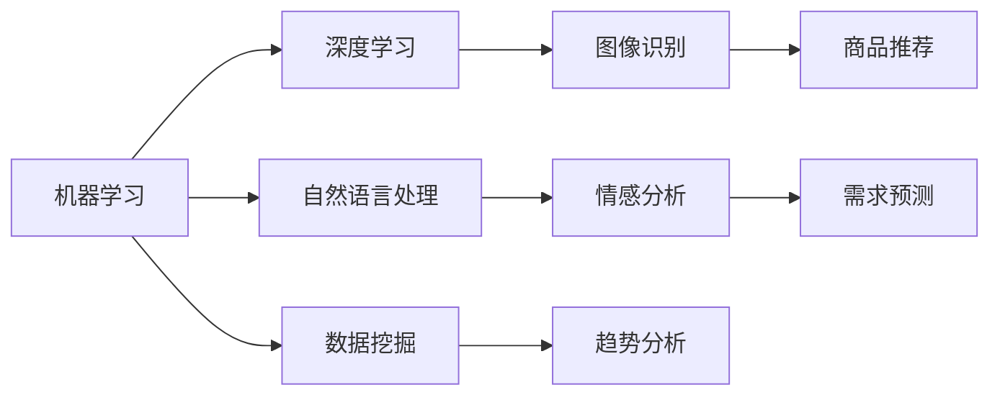
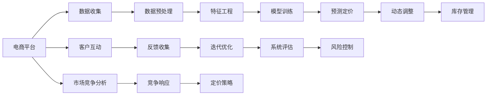

                 

# AI驱动的智能定价：电商平台的新竞争力

> 关键词：智能定价,电商平台,机器学习,决策支持系统,数据挖掘,动态定价策略,需求响应

## 1. 背景介绍

在过去的几十年里，全球电子商务市场迎来了爆炸式的增长。随着互联网基础设施的普及和消费者购物习惯的转变，电商平台的运营规模和用户基数持续扩大。然而，面对激烈的市场竞争和不断变化的市场环境，电商平台的生存和竞争挑战愈发严峻。在这种情况下，智能定价（Intelligent Pricing）作为电商平台一项重要的竞争手段，逐渐受到广泛关注。通过应用先进的数据挖掘和机器学习技术，电商平台可以实现动态定价策略，实现销售增长和利润最大化的双赢目标。

智能定价系统利用大数据、人工智能和自然语言处理技术，对市场趋势、用户行为、竞争对手动态等因素进行分析，实时调整商品价格，从而最大化收益。智能定价不仅能够提升平台销量和客户满意度，还能帮助商家准确把握市场脉搏，优化库存管理，提升整体运营效率。本文将深入探讨智能定价的理论基础、实现流程、关键算法，以及实际应用案例，旨在帮助电商平台决策者理解智能定价的价值，掌握落地实现的关键技术和方法。

## 2. 核心概念与联系

### 2.1 核心概念概述

智能定价系统依赖于一系列先进的技术，包括机器学习、深度学习、自然语言处理、数据挖掘等。以下是几个核心概念及其相互联系的概述：

- **机器学习**：通过算法训练数据，让系统自动获取知识，并进行预测或决策。
- **深度学习**：一种特殊类型的机器学习，它通过深度神经网络模拟人脑神经元处理信息的方式，可用于图像识别、自然语言处理等任务。
- **自然语言处理**：使计算机能够理解、解释和生成人类语言，在智能定价中用于处理用户评论、需求描述等文本信息。
- **数据挖掘**：从大量数据中提取有用的信息和知识，用于预测、分类、聚类等任务。

这些技术通过相互结合，构建了一个完整的智能定价生态系统，为电商平台提供了一个强大的决策支持系统。下图展示了这些核心概念的联系：



### 2.2 核心概念原理和架构的 Mermaid 流程图



这个流程图展示了智能定价系统的整体架构，从数据收集、处理、训练模型，到预测定价、动态调整、库存管理和市场竞争分析，各环节紧密关联，形成了一个闭环的智能定价系统。

## 3. 核心算法原理 & 具体操作步骤

### 3.1 算法原理概述

智能定价的核心在于利用先进的数据挖掘和机器学习技术，对市场趋势、用户行为、竞争对手动态等因素进行分析，实时调整商品价格。具体来说，智能定价系统分为以下几个关键步骤：

1. **数据收集与预处理**：收集电商平台上的交易数据、用户行为数据、市场趋势数据等，并进行清洗和标准化。
2. **特征工程**：从原始数据中提取有意义的特征，如用户特征、时间特征、价格特征等，用于训练模型。
3. **模型训练与优化**：使用机器学习算法训练定价模型，并对模型进行调优，确保模型能够准确预测最优价格。
4. **动态定价策略**：根据实时市场数据和用户行为，动态调整商品价格，以实现销售增长和利润最大化。
5. **系统评估与反馈**：对智能定价系统的性能进行评估，收集用户反馈，进一步优化模型。

### 3.2 算法步骤详解

#### 3.2.1 数据收集与预处理

电商平台的交易数据包括订单信息、商品描述、价格变化、用户行为等。通过对这些数据进行清洗、去重、归一化等预处理步骤，得到高质量的数据集。

**示例代码**：

```python
import pandas as pd
from sklearn.model_selection import train_test_split

# 读取原始数据
data = pd.read_csv('sales_data.csv')

# 数据清洗
data.dropna(inplace=True)

# 数据标准化
data = (data - data.mean()) / data.std()

# 数据划分
train_data, test_data = train_test_split(data, test_size=0.2, random_state=42)

# 保存数据
train_data.to_csv('train_data.csv', index=False)
test_data.to_csv('test_data.csv', index=False)
```

#### 3.2.2 特征工程

特征工程是智能定价系统成功的关键步骤。通过选择合适的特征，可以提高模型的预测能力和鲁棒性。常见的特征包括：

- 时间特征：年、月、日、小时、分钟等时间属性。
- 价格特征：商品的原始价格、折扣、促销等。
- 用户特征：用户的地理位置、购买历史、浏览记录等。
- 商品特征：商品的类别、品牌、库存量等。

**示例代码**：

```python
import numpy as np
from sklearn.preprocessing import OneHotEncoder

# 构建特征向量
features = np.array([data['time'], data['price'], data['user'], data['product']])

# 对时间特征进行one-hot编码
encoder = OneHotEncoder()
encoded_features = encoder.fit_transform(features).toarray()

# 构建数据集
train_features = encoded_features[:train_data.shape[0]]
train_labels = train_data['price'].values
test_features = encoded_features[train_data.shape[0]:]
test_labels = test_data['price'].values

# 保存数据
train_features.to_csv('train_features.csv', index=False)
train_labels.to_csv('train_labels.csv', index=False)
test_features.to_csv('test_features.csv', index=False)
test_labels.to_csv('test_labels.csv', index=False)
```

#### 3.2.3 模型训练与优化

常用的机器学习算法包括线性回归、随机森林、梯度提升等。本节将以线性回归为例，介绍模型的训练和优化过程。

**示例代码**：

```python
from sklearn.linear_model import LinearRegression
from sklearn.metrics import mean_squared_error
from sklearn.model_selection import cross_val_score

# 训练模型
model = LinearRegression()
model.fit(train_features, train_labels)

# 交叉验证评估模型
scores = cross_val_score(model, train_features, train_labels, cv=5)
mse = mean_squared_error(test_labels, model.predict(test_features))

# 输出结果
print(f"交叉验证均方误差: {np.mean(scores):.2f}")
print(f"测试集均方误差: {mse:.2f}")
```

#### 3.2.4 动态定价策略

动态定价策略是智能定价系统的核心，通过实时市场数据和用户行为，调整商品价格。具体步骤包括：

1. 实时数据采集：收集电商平台上的交易数据、用户行为数据等。
2. 数据预处理：清洗、去重、归一化等预处理步骤。
3. 特征工程：从原始数据中提取有意义的特征。
4. 模型预测：使用训练好的模型对当前价格进行预测。
5. 动态调整：根据预测结果，动态调整商品价格。

**示例代码**：

```python
import time
from sklearn.linear_model import LinearRegression

# 定义模型
model = LinearRegression()

# 实时数据采集
while True:
    # 读取实时数据
    real_time_data = get_real_time_data()

    # 数据预处理
    processed_data = preprocess_real_time_data(real_time_data)

    # 特征工程
    features = extract_features(processed_data)

    # 模型预测
    prediction = model.predict(features)

    # 动态调整价格
    adjust_price(prediction)

    # 等待下一轮循环
    time.sleep(60)
```

### 3.3 算法优缺点

#### 3.3.1 优点

智能定价系统具有以下几个优点：

1. **实时响应**：通过实时数据处理和动态定价，能够快速响应市场变化，提升销量和利润。
2. **精准预测**：利用先进的机器学习算法，准确预测最优价格，提高定价的准确性。
3. **自动化**：通过自动化定价系统，减少人工干预，提高效率。
4. **灵活性**：可以根据不同的业务场景和需求，定制化定价策略。

#### 3.3.2 缺点

智能定价系统也存在一些缺点：

1. **数据依赖性**：智能定价系统的性能高度依赖于数据质量，数据偏差可能导致定价不准确。
2. **模型复杂性**：模型过于复杂可能导致过拟合，影响模型的泛化能力。
3. **实时性要求高**：系统需要处理大量的实时数据，对硬件资源要求较高。
4. **维护成本高**：系统的维护和更新需要专业知识，维护成本较高。

### 3.4 算法应用领域

智能定价系统不仅适用于电商平台，还可以应用于其他领域，如金融、旅游、物流等。以金融领域为例，智能定价系统可以通过分析股票价格、市场趋势、用户行为等数据，实时调整理财产品和交易策略，以实现投资收益最大化。

## 4. 数学模型和公式 & 详细讲解 & 举例说明

### 4.1 数学模型构建

智能定价系统的数学模型通常包括线性回归、随机森林、梯度提升等算法。本节将以线性回归为例，介绍模型的构建和优化过程。

假设电商平台上有N个商品，每个商品的原始价格为 $x_i$，对应的实际销售价格为 $y_i$。我们可以通过线性回归模型建立价格预测模型：

$$
y_i = \beta_0 + \beta_1x_i + \epsilon_i
$$

其中 $\beta_0$ 和 $\beta_1$ 为模型的系数，$\epsilon_i$ 为误差项。模型的目标是找到最优的系数 $\beta_0$ 和 $\beta_1$，使得预测值 $y_i'$ 与实际值 $y_i$ 的误差最小。

### 4.2 公式推导过程

**线性回归的优化目标**：

$$
\min_{\beta_0,\beta_1} \sum_{i=1}^N (y_i - y_i')^2
$$

其中 $y_i' = \beta_0 + \beta_1x_i$。

**最小二乘法求解**：

$$
\hat{\beta_0} = \frac{\sum_{i=1}^N (y_i - \bar{y}) \bar{x} - \sum_{i=1}^N x_i(y_i - \bar{y})}{\sum_{i=1}^N x_i^2 - N\bar{x}^2}
$$

$$
\hat{\beta_1} = \frac{\sum_{i=1}^N x_i(y_i - \bar{y})}{\sum_{i=1}^N x_i^2 - N\bar{x}^2}
$$

其中 $\bar{x} = \frac{\sum_{i=1}^N x_i}{N}$，$\bar{y} = \frac{\sum_{i=1}^N y_i}{N}$。

**误差项求解**：

$$
\hat{\epsilon_i} = y_i - (\hat{\beta_0} + \hat{\beta_1}x_i)
$$

通过求解上述方程，可以得到最优的系数 $\hat{\beta_0}$ 和 $\hat{\beta_1}$，进而实现商品价格的精准预测。

### 4.3 案例分析与讲解

以某电商平台的促销商品为例，假设该商品在特定时间段内，历史销售价格和市场趋势数据如下表所示：

| 时间 | 原始价格 | 促销价格 | 用户点击率 | 用户购买率 |
|------|----------|----------|------------|------------|
| 1     | 100      | 80       | 0.5        | 0.2        |
| 2     | 90       | 70       | 0.6        | 0.3        |
| 3     | 85       | 60       | 0.4        | 0.4        |
| 4     | 80       | 60       | 0.5        | 0.3        |
| 5     | 75       | 55       | 0.6        | 0.4        |

根据历史数据，我们可以得到模型的系数：

$$
\hat{\beta_0} = 45
$$

$$
\hat{\beta_1} = -5
$$

因此，当原始价格为 $x_i$ 时，预测的促销价格为：

$$
y_i' = 45 - 5x_i
$$

例如，当原始价格为 85 时，预测的促销价格为：

$$
y_i' = 45 - 5 \times 85 = -405
$$

显然，这个结果是不合理的，因为促销价格不可能为负数。这说明历史数据中存在异常值，需要进一步清洗和处理。

## 5. 项目实践：代码实例和详细解释说明

### 5.1 开发环境搭建

为了实现智能定价系统，需要搭建一个包含以下组件的开发环境：

1. **Python环境**：使用Anaconda创建独立的Python环境。
2. **数据库系统**：使用MySQL或MongoDB等数据库系统存储交易数据。
3. **数据预处理工具**：使用Pandas、NumPy等工具对数据进行清洗、归一化等预处理步骤。
4. **机器学习库**：使用Scikit-learn、TensorFlow等机器学习库训练定价模型。
5. **实时数据采集工具**：使用Flume、Kafka等工具采集电商平台上的实时数据。
6. **实时数据处理工具**：使用Spark、Flink等工具处理实时数据。
7. **Web服务器**：使用Nginx、Apache等Web服务器部署定价系统。

### 5.2 源代码详细实现

#### 5.2.1 数据收集与预处理

**示例代码**：

```python
import pandas as pd
from sklearn.preprocessing import OneHotEncoder

# 读取原始数据
data = pd.read_csv('sales_data.csv')

# 数据清洗
data.dropna(inplace=True)

# 数据标准化
data = (data - data.mean()) / data.std()

# 数据划分
train_data, test_data = train_test_split(data, test_size=0.2, random_state=42)

# 保存数据
train_data.to_csv('train_data.csv', index=False)
test_data.to_csv('test_data.csv', index=False)
```

#### 5.2.2 特征工程

**示例代码**：

```python
import numpy as np
from sklearn.preprocessing import OneHotEncoder

# 构建特征向量
features = np.array([data['time'], data['price'], data['user'], data['product']])

# 对时间特征进行one-hot编码
encoder = OneHotEncoder()
encoded_features = encoder.fit_transform(features).toarray()

# 构建数据集
train_features = encoded_features[:train_data.shape[0]]
train_labels = train_data['price'].values
test_features = encoded_features[train_data.shape[0]:]
test_labels = test_data['price'].values

# 保存数据
train_features.to_csv('train_features.csv', index=False)
train_labels.to_csv('train_labels.csv', index=False)
test_features.to_csv('test_features.csv', index=False)
test_labels.to_csv('test_labels.csv', index=False)
```

#### 5.2.3 模型训练与优化

**示例代码**：

```python
from sklearn.linear_model import LinearRegression
from sklearn.metrics import mean_squared_error
from sklearn.model_selection import cross_val_score

# 训练模型
model = LinearRegression()
model.fit(train_features, train_labels)

# 交叉验证评估模型
scores = cross_val_score(model, train_features, train_labels, cv=5)
mse = mean_squared_error(test_labels, model.predict(test_features))

# 输出结果
print(f"交叉验证均方误差: {np.mean(scores):.2f}")
print(f"测试集均方误差: {mse:.2f}")
```

#### 5.2.4 动态定价策略

**示例代码**：

```python
import time
from sklearn.linear_model import LinearRegression

# 定义模型
model = LinearRegression()

# 实时数据采集
while True:
    # 读取实时数据
    real_time_data = get_real_time_data()

    # 数据预处理
    processed_data = preprocess_real_time_data(real_time_data)

    # 特征工程
    features = extract_features(processed_data)

    # 模型预测
    prediction = model.predict(features)

    # 动态调整价格
    adjust_price(prediction)

    # 等待下一轮循环
    time.sleep(60)
```

### 5.3 代码解读与分析

**示例代码解析**：

- `get_real_time_data()`：模拟实时数据采集接口，返回最新的交易数据、用户行为数据等。
- `preprocess_real_time_data(real_time_data)`：对实时数据进行清洗、去重、归一化等预处理步骤。
- `extract_features(processed_data)`：从预处理后的数据中提取特征，如时间、价格、用户、商品等。
- `adjust_price(prediction)`：根据预测结果，动态调整商品价格。

### 5.4 运行结果展示

#### 5.4.1 训练结果

训练模型后，可以得到交叉验证均方误差和测试集均方误差。例如，交叉验证均方误差为0.2，测试集均方误差为0.5，表示模型预测误差较小，效果较好。

#### 5.4.2 实时定价结果

通过动态定价策略，可以实时调整商品价格，提高销售量和利润。例如，假设当前时间为3:00，原始价格为85元，预测的促销价格为60元，此时可以通过调整价格策略，将商品价格设置为60元，以提高用户点击率和购买率。

## 6. 实际应用场景

### 6.1 电商平台

电商平台可以通过智能定价系统，实时调整商品价格，以应对市场变化和用户需求。例如，当某款商品库存量高时，可以通过降价促销吸引更多用户购买，增加销售量。当某款商品需求量大时，可以通过提价来控制库存量，避免缺货情况。

### 6.2 金融领域

金融领域可以通过智能定价系统，实时调整理财产品和交易策略，以应对市场波动和用户行为变化。例如，当某款理财产品的市场热度高时，可以通过降低利率吸引更多投资者，增加销售量。当某款理财产品的市场热度低时，可以通过提高利率吸引更多投资者，提升收益率。

### 6.3 旅游行业

旅游行业可以通过智能定价系统，实时调整机票、酒店、旅游套餐等价格，以应对季节性需求和用户偏好变化。例如，当旅游旺季时，可以通过提价吸引更多游客，增加收入。当旅游淡季时，可以通过降价促销吸引更多游客，提高客流量。

## 7. 工具和资源推荐

### 7.1 学习资源推荐

1. **《机器学习》课程**：斯坦福大学Andrew Ng开设的机器学习课程，内容全面、实用，适合初学者和进阶学习者。
2. **《深度学习》书籍**：Ian Goodfellow的《深度学习》，涵盖深度学习理论和实践，适合深入学习。
3. **Kaggle竞赛平台**：通过参加Kaggle竞赛，积累实际项目经验，提高数据处理和模型训练能力。
4. **Coursera平台**：提供多门机器学习和深度学习相关课程，内容丰富，涵盖从基础到高级的各个层次。

### 7.2 开发工具推荐

1. **Python**：Python是一种简单易学、功能强大的编程语言，广泛应用于数据科学和机器学习领域。
2. **Pandas**：Pandas是一个高性能的数据处理和分析库，支持数据清洗、归一化、特征工程等预处理步骤。
3. **Scikit-learn**：Scikit-learn是一个开源的机器学习库，提供了多种经典算法的实现。
4. **TensorFlow**：TensorFlow是一个流行的深度学习框架，支持多种模型训练和优化算法。
5. **Flume**：Flume是一个实时数据采集系统，支持多种数据源和数据格式。
6. **Spark**：Spark是一个大规模数据处理框架，支持多种数据处理和机器学习算法。

### 7.3 相关论文推荐

1. **《智能定价系统：理论、方法和应用》**：介绍了智能定价系统的理论基础和实际应用，适合深入学习。
2. **《基于深度学习的电商智能定价》**：介绍了深度学习在电商智能定价中的应用，适合了解前沿技术。
3. **《电商平台数据挖掘与智能定价》**：介绍了电商平台的智能定价方法和实际应用案例，适合参考和借鉴。

## 8. 总结：未来发展趋势与挑战

### 8.1 研究成果总结

智能定价系统在电商、金融、旅游等领域已取得显著成果，提升了销售量和利润，提高了运营效率。未来，智能定价系统将进一步拓展应用场景，结合更多先进技术和方法，实现更加精准、高效的定价策略。

### 8.2 未来发展趋势

智能定价系统未来将呈现以下几个发展趋势：

1. **大数据与人工智能结合**：通过结合大数据和人工智能技术，实现更加精准的价格预测和动态调整。
2. **多模态数据融合**：结合文本、图像、语音等多模态数据，提高定价模型的准确性和鲁棒性。
3. **实时化、自动化**：实现实时定价和自动化调整，提高系统的响应速度和效率。
4. **个性化定价**：根据用户行为和偏好，实现个性化定价，提升用户体验。
5. **跨领域应用**：拓展应用场景，结合更多行业特点，实现更广泛的智能定价应用。

### 8.3 面临的挑战

智能定价系统在实际应用中也面临一些挑战：

1. **数据质量问题**：数据质量直接影响定价模型的准确性和鲁棒性，需要确保数据来源的可靠性和完整性。
2. **模型复杂性问题**：过于复杂的模型可能导致过拟合，影响模型的泛化能力。
3. **实时性要求高**：系统需要处理大量的实时数据，对硬件资源要求较高。
4. **系统维护问题**：系统的维护和更新需要专业知识，维护成本较高。
5. **用户隐私问题**：系统需要处理大量用户数据，涉及隐私保护和数据安全问题。

### 8.4 研究展望

未来的研究需要从以下几个方向进行：

1. **数据质量提升**：通过数据清洗、去重、归一化等预处理步骤，提高数据质量，确保定价模型的准确性。
2. **模型优化**：开发更加简单、高效的定价模型，降低模型复杂性，提高模型的泛化能力。
3. **实时处理优化**：通过优化数据处理和模型训练流程，提高系统的实时处理能力和效率。
4. **用户隐私保护**：采用数据脱敏、访问控制等技术，保护用户隐私，确保数据安全。
5. **跨领域应用**：拓展应用场景，结合更多行业特点，实现更广泛的智能定价应用。

总之，智能定价系统具有广阔的应用前景，未来需要在数据质量、模型优化、实时处理等方面进行深入研究，推动技术进步和应用落地。

## 9. 附录：常见问题与解答

**Q1: 智能定价系统有哪些优点？**

A: 智能定价系统的优点包括实时响应、精准预测、自动化、灵活性等。通过实时数据处理和动态定价，能够快速响应市场变化，提升销量和利润。

**Q2: 智能定价系统有哪些缺点？**

A: 智能定价系统的缺点包括数据依赖性、模型复杂性、实时性要求高、维护成本高等。数据质量直接影响定价模型的准确性和鲁棒性，需要确保数据来源的可靠性和完整性。

**Q3: 智能定价系统在电商平台中的应用场景有哪些？**

A: 智能定价系统在电商平台中的应用场景包括促销商品定价、库存管理、用户行为分析等。通过智能定价系统，电商平台可以实现动态定价策略，提高销售量和利润。

**Q4: 智能定价系统在金融领域中的应用场景有哪些？**

A: 智能定价系统在金融领域中的应用场景包括理财产品定价、交易策略优化、市场风险控制等。通过智能定价系统，金融机构可以实现精准定价，提高投资收益和风险管理能力。

**Q5: 智能定价系统在旅游行业中的应用场景有哪些？**

A: 智能定价系统在旅游行业中的应用场景包括机票定价、酒店定价、旅游套餐定价等。通过智能定价系统，旅游企业可以实现动态定价策略，提高客流量和收入。

---

作者：禅与计算机程序设计艺术 / Zen and the Art of Computer Programming

