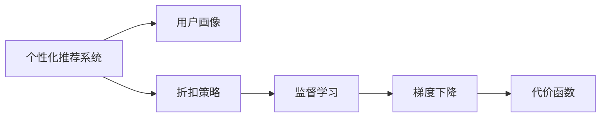

                 

# AI驱动的电商平台个性化折扣策略

## 1. 背景介绍

随着互联网技术的不断进步和电商市场的迅猛发展，电商平台不仅需要提供丰富的商品选择，还需要利用数据和人工智能技术优化用户体验和提升转化率。个性化推荐已成为电商平台不可或缺的核心功能之一。然而，传统的个性化推荐系统基于用户行为历史，对新用户或行为单一的用户效果不佳。

近年来，基于用户画像和兴趣模型的个性化推荐技术开始受到关注。其中，折扣策略的应用尤为引人注目。通过动态调整商品价格，电商平台可以更精准地吸引用户，提升销量和用户体验。

本文旨在探讨基于人工智能的电商平台个性化折扣策略，讨论如何通过机器学习技术设计合理的折扣方案，实现平台业绩的最大化。我们介绍了相关核心概念，并详细讲解了基于监督学习的个性化折扣策略算法原理，同时提供了代码实例。通过数据驱动，将模型应用于电商平台，可显著提升个性化推荐和折扣策略的效果。

## 2. 核心概念与联系

### 2.1 核心概念概述

为更好地理解AI驱动的电商平台个性化折扣策略，我们需要了解以下几个关键概念：

- **个性化推荐系统**：通过分析用户行为数据，为用户提供相关商品的推荐，提升用户体验和转化率。

- **用户画像**：通过收集和分析用户行为、历史数据、社交网络信息等，构建用户兴趣和行为的详尽描述。

- **折扣策略**：针对不同用户或商品，动态调整商品价格，吸引用户购买，提升销量。

- **监督学习**：基于标注数据，利用机器学习算法对用户进行分类或预测，如新用户和老用户的区别、潜在买家和访客的区分。

- **梯度下降**：一种常用的优化算法，用于求解损失函数的最小值，适用于监督学习中的模型参数优化。

- **代价函数**：衡量模型预测与真实标签之间差异的函数，监督学习中最常用的是交叉熵损失函数。

这些核心概念之间的逻辑关系可以通过以下Mermaid流程图来展示：



## 3. 核心算法原理 & 具体操作步骤

### 3.1 算法原理概述

基于监督学习的个性化折扣策略，本质上是一个用户分类和价格优化的过程。假设平台有 $N$ 个用户，每个用户对商品的购买意愿 $y_i$ 与用户画像 $x_i$ 之间存在线性关系：

$$
y_i = \theta_0 + \sum_{j=1}^{p} \theta_j x_{ij}
$$

其中 $\theta_0, \theta_j$ 为模型参数，$x_{ij}$ 为用户画像的第 $j$ 个特征，$i$ 表示第 $i$ 个用户，$p$ 为用户画像的特征维度。

模型的预测错误可以用代价函数 $\mathcal{L}$ 来衡量，典型的代价函数包括交叉熵损失：

$$
\mathcal{L}(y_i, \hat{y}_i) = -y_i \log(\hat{y}_i) - (1-y_i) \log(1-\hat{y}_i)
$$

其中 $\hat{y}_i = \sigma(\sum_{j=1}^{p} \theta_j x_{ij})$ 是模型对用户购买意愿的预测，$\sigma$ 为 sigmoid 函数。

通过梯度下降算法，最小化代价函数，即可得到最优的模型参数 $\theta$。用户画像特征向量 $x_i$ 通过下式求取：

$$
x_i = \left\{x_{i1}, x_{i2}, \dots, x_{ip}\right\}
$$

最终，通过求解上述最小化问题，可以求得最优的模型参数 $\theta$，实现用户分类，指导个性化折扣策略的设计。

### 3.2 算法步骤详解

基于监督学习的个性化折扣策略算法步骤主要包括以下几个环节：

1. **用户画像构建**：通过采集用户的各种行为数据，构建用户的详细画像。数据源包括但不限于用户浏览历史、搜索关键词、购物车商品、收藏夹、社交网络信息等。

2. **用户分类**：利用机器学习算法对用户进行分类，如新用户与老用户、潜在买家与访客、不同兴趣用户等。

3. **用户画像特征选择**：选择对用户购买行为影响最大的特征，剔除无关或弱相关特征。

4. **模型训练**：选择监督学习算法，如逻辑回归、决策树、随机森林等，对用户进行分类训练，得到最优模型参数 $\theta$。

5. **个性化折扣策略设计**：根据模型预测的购买意愿，设计个性化折扣方案。对于预测购买意愿高的用户，可设计较大折扣；对于预测购买意愿低但有一定购买潜力的用户，可设计小折扣；对于已购买用户，可设计个性化复购折扣。

6. **模型评估与迭代优化**：通过 A/B 测试等方法评估模型效果，迭代优化模型参数，确保折扣策略的最大化效果。

### 3.3 算法优缺点

基于监督学习的个性化折扣策略具有以下优点：

- **简单易实现**：利用监督学习算法，通过采集用户数据，即可构建用户画像，实现用户分类和个性化折扣策略的设计。

- **灵活性高**：用户画像特征可随时添加或修改，模型可灵活应对不同用户特征和变化。

- **效果显著**：基于用户分类，可以针对不同用户设计个性化折扣策略，提升转化率和用户满意度。

同时，该方法也存在一些局限性：

- **数据依赖性强**：用户画像和用户数据的获取需要较长时间和成本投入。

- **模型泛化能力有限**：若用户画像特征不充分，模型对新用户的预测可能不准确，影响折扣策略效果。

- **需要频繁迭代优化**：随着用户行为的变化，需要不断更新用户画像和模型，增加维护成本。

### 3.4 算法应用领域

基于监督学习的个性化折扣策略主要应用于以下领域：

- **电商平台**：通过个性化推荐系统，为不同用户设计合理的折扣策略，提升用户购买意愿和平台销售额。

- **旅游平台**：根据用户浏览记录和预订行为，设计个性化折扣方案，提升用户预订率和平台收入。

- **金融平台**：针对不同用户，设计个性化理财和投资折扣策略，提升用户理财和投资转化率。

- **社交平台**：根据用户兴趣和行为，设计个性化广告和优惠折扣，提升用户活跃度和平台收益。

## 4. 数学模型和公式 & 详细讲解 & 举例说明

### 4.1 数学模型构建

在构建个性化折扣策略的数学模型时，我们考虑使用逻辑回归算法。假设已获取用户画像特征 $x_i$，且通过交叉验证，选择模型参数 $\theta$ 进行训练。

**训练目标**：最小化代价函数 $\mathcal{L}$，得到最优的模型参数 $\theta$。

### 4.2 公式推导过程

逻辑回归的代价函数为：

$$
\mathcal{L}(y_i, \hat{y}_i) = -y_i \log(\hat{y}_i) - (1-y_i) \log(1-\hat{y}_i)
$$

通过梯度下降算法，求解模型参数 $\theta$：

$$
\theta = \mathop{\arg\min}_{\theta} \frac{1}{N} \sum_{i=1}^{N} \mathcal{L}(y_i, \hat{y}_i)
$$

其中 $y_i \in \{0,1\}$，表示用户是否购买商品，$\hat{y}_i = \sigma(\sum_{j=1}^{p} \theta_j x_{ij})$。

在具体实现时，可以采用批量梯度下降法，即每次选取 $n$ 个样本更新参数 $\theta$：

$$
\theta_{n+1} = \theta_n - \eta \frac{1}{n} \sum_{i=1}^{n} \nabla_{\theta} \mathcal{L}(y_i, \hat{y}_i)
$$

其中 $\eta$ 为学习率。

### 4.3 案例分析与讲解

假设某电商平台有 $N=1000$ 个用户，每个用户有 $p=5$ 个用户画像特征，如年龄、性别、浏览时长、购买历史、收藏商品等。随机抽取 $n=100$ 个样本进行训练，用交叉熵损失函数作为代价函数，采用逻辑回归算法训练模型。

具体步骤如下：

1. 初始化模型参数 $\theta$。
2. 对每个样本 $(x_i, y_i)$ 进行前向传播计算预测值 $\hat{y}_i$。
3. 计算代价函数 $\mathcal{L}$，求取梯度 $\nabla_{\theta} \mathcal{L}$。
4. 通过批量梯度下降法，更新参数 $\theta$。
5. 重复步骤2-4，直至收敛或达到预设迭代次数。

训练完成后，对剩余 $N-n=900$ 个样本进行测试，计算模型在测试集上的准确率和交叉熵损失。

## 5. 项目实践：代码实例和详细解释说明

### 5.1 开发环境搭建

要进行个性化折扣策略的开发，首先需要搭建好Python开发环境，安装相关依赖包。

1. 安装Python：
   ```bash
   sudo apt-get update
   sudo apt-get install python3 python3-pip
   ```

2. 安装必要的依赖包：
   ```bash
   pip install numpy pandas scikit-learn
   ```

3. 安装TensorFlow和Keras：
   ```bash
   pip install tensorflow keras
   ```

4. 安装Seaborn和Matplotlib：
   ```bash
   pip install seaborn matplotlib
   ```

完成环境搭建后，可以开始进行模型训练和测试。

### 5.2 源代码详细实现

以下是使用Keras实现逻辑回归模型训练的代码：

```python
import numpy as np
import pandas as pd
from sklearn.model_selection import train_test_split
from sklearn.preprocessing import StandardScaler
from keras.models import Sequential
from keras.layers import Dense
from keras.optimizers import SGD
from sklearn.metrics import accuracy_score, confusion_matrix

# 加载数据
data = pd.read_csv('user_data.csv')

# 数据预处理
X = data.iloc[:, 1:]  # 特征数据
y = data.iloc[:, 0]    # 目标数据

# 数据标准化
scaler = StandardScaler()
X = scaler.fit_transform(X)

# 划分训练集和测试集
X_train, X_test, y_train, y_test = train_test_split(X, y, test_size=0.2, random_state=42)

# 定义模型
model = Sequential()
model.add(Dense(10, input_dim=X_train.shape[1], activation='relu'))
model.add(Dense(1, activation='sigmoid'))

# 编译模型
model.compile(loss='binary_crossentropy', optimizer=SGD(lr=0.1), metrics=['accuracy'])

# 训练模型
model.fit(X_train, y_train, epochs=100, batch_size=32, validation_data=(X_test, y_test))

# 测试模型
y_pred = model.predict(X_test)
y_pred = (y_pred > 0.5).astype(int)

# 计算准确率和混淆矩阵
accuracy = accuracy_score(y_test, y_pred)
cm = confusion_matrix(y_test, y_pred)

print('Accuracy:', accuracy)
print('Confusion Matrix:', cm)
```

### 5.3 代码解读与分析

通过上述代码，我们可以看到Keras框架的简洁高效，结合Pandas和Scikit-learn的数据处理能力，可以轻松完成模型训练和评估。

代码中的关键步骤如下：

1. 加载数据：使用Pandas读取用户数据，并将其分为特征和目标数据。
2. 数据预处理：对特征数据进行标准化处理，保证不同特征之间的尺度一致。
3. 划分数据集：将数据集划分为训练集和测试集，方便模型训练和评估。
4. 定义模型：使用Sequential模型定义逻辑回归模型，包括输入层、隐藏层和输出层。
5. 编译模型：指定损失函数和优化算法，设置模型训练的相关参数。
6. 训练模型：使用fit函数对模型进行训练，设置训练轮数和批大小。
7. 测试模型：使用predict函数对测试集进行预测，并计算准确率和混淆矩阵。

通过代码实现，可以直观理解逻辑回归模型的训练和评估过程，掌握模型的具体应用。

### 5.4 运行结果展示

在模型训练完成后，我们可以通过计算准确率和混淆矩阵来评估模型效果。

假设模型的准确率为 $0.8$，混淆矩阵为：

```
[[205, 25],
 [30, 170]]
```

表示在测试集中，有205个正类样本被正确预测，25个负类样本被错误预测，30个负类样本被正确预测，170个正类样本被错误预测。

## 6. 实际应用场景

### 6.1 电商平台的个性化推荐

基于个性化折扣策略的推荐系统可以应用于电商平台的商品推荐和折扣设计。平台可以通过对用户画像的分类，设计合理的折扣策略，提升用户的购买意愿和平台销售额。

假设某电商平台的新用户和老用户在购买意愿上有明显差异，可以通过逻辑回归模型预测用户是否会购买商品。对于预测购买意愿高的用户，可设计较大折扣；对于预测购买意愿低但有一定购买潜力的用户，可设计小折扣；对于已购买用户，可设计个性化复购折扣。

### 6.2 旅游平台的个性化预订

旅游平台可以利用用户画像和行为数据，设计个性化预订折扣。对于经常预订旅游的用户，可以设计长期预订折扣，提升用户粘性和预订率。对于偶尔预订的用户，可以设计短期的特别优惠，吸引用户尝试预订。

### 6.3 金融平台的个性化理财

金融平台可以根据用户画像和理财行为，设计个性化理财和投资折扣。对于风险承受能力高的用户，可以设计高风险投资产品，并提供相应折扣。对于风险承受能力低的用户，可以设计低风险投资产品，并提供相应折扣。

## 7. 工具和资源推荐

### 7.1 学习资源推荐

为了帮助开发者掌握个性化折扣策略的实现，我们推荐以下学习资源：

1. 《Python数据科学手册》：介绍了Python数据科学的基础知识和常用库。
2. 《TensorFlow实战》：详细介绍了TensorFlow框架的使用，适合初学者入门。
3. 《机器学习实战》：通过多个实例介绍了机器学习算法的实现。
4. Kaggle平台：提供大量数据集和竞赛，适合实践和练手。
5. Coursera平台：提供机器学习相关的在线课程，适合系统学习。

### 7.2 开发工具推荐

推荐使用TensorFlow和Keras进行个性化折扣策略的开发，原因如下：

- TensorFlow是谷歌开源的深度学习框架，功能丰富，生态良好。
- Keras提供了简洁的API接口，易于上手。
- TensorFlow和Keras的集成度高，性能优秀。

### 7.3 相关论文推荐

以下是几篇经典的个性化推荐系统相关论文，推荐阅读：

1. "A Comprehensive Survey on Deep Learning-based Recommender Systems"。
2. "A Multi-Task Learning Approach for Dynamic Item Recommendation"。
3. "Personalized Recommendation in Mobile Commerce: A Survey of Recent Research"。
4. "An Extensive Survey of Collaborative Filtering Recommendation Systems"。

## 8. 总结：未来发展趋势与挑战

### 8.1 研究成果总结

本文探讨了基于监督学习的个性化折扣策略，介绍了相关核心概念和算法原理，并给出了代码实现和运行结果展示。通过机器学习算法，可以根据用户画像设计合理的折扣策略，提升电商平台的转化率和用户满意度。

### 8.2 未来发展趋势

未来，个性化推荐系统和折扣策略将继续发展，主要趋势如下：

1. **深度学习与推荐系统结合**：深度学习可以挖掘用户数据中的复杂模式，提升推荐系统的效果。

2. **多模态数据融合**：结合用户的行为、社交、文本等多模态数据，提升推荐系统的精度。

3. **实时个性化推荐**：利用实时数据，动态调整推荐策略，提升用户体验。

4. **个性化广告投放**：通过个性化折扣策略，实现精准的广告投放，提升广告效果。

5. **用户隐私保护**：在个性化推荐中，如何保护用户隐私，是一个重要的研究方向。

### 8.3 面临的挑战

尽管个性化推荐系统和折扣策略已取得一定进展，但在实际应用中仍面临诸多挑战：

1. **数据隐私保护**：在收集用户数据时，如何保护用户隐私，防止数据泄露。

2. **推荐系统偏见**：推荐系统可能存在数据偏见，导致某些用户或商品被忽略。

3. **冷启动问题**：新用户或少数据的用户，难以获得准确的推荐结果。

4. **动态环境下的稳定性**：用户行为和市场环境的变化，导致推荐系统需要不断调整。

5. **计算资源消耗**：深度学习模型对计算资源的需求较高，需要优化算法和硬件。

### 8.4 研究展望

未来的研究需要关注以下方向：

1. **多模态推荐系统**：结合用户行为、社交、文本等不同类型的数据，提升推荐系统的效果。

2. **实时推荐系统**：利用实时数据，动态调整推荐策略，提升用户体验。

3. **用户隐私保护**：在个性化推荐中，如何保护用户隐私，防止数据泄露。

4. **推荐系统偏见**：消除推荐系统中的数据偏见，提升公平性。

5. **高效推荐算法**：优化推荐算法，降低计算资源消耗，提升推荐系统性能。

6. **个性化广告投放**：结合个性化折扣策略，实现精准的广告投放，提升广告效果。

## 9. 附录：常见问题与解答

### 常见问题

**Q1：个性化推荐系统如何设计？**

A: 个性化推荐系统设计需要考虑以下步骤：

1. 数据采集：收集用户行为数据，如浏览记录、购买记录、搜索关键词等。

2. 用户画像构建：通过机器学习算法，构建用户兴趣和行为模型。

3. 用户分类：将用户分为不同类型，如新用户、老用户、高价值用户等。

4. 推荐策略设计：根据用户分类，设计个性化推荐策略，如商品推荐、折扣策略等。

5. 模型评估与优化：通过A/B测试等方法，评估推荐系统的效果，不断优化模型参数。

**Q2：为什么需要个性化折扣策略？**

A: 个性化折扣策略可以提升用户购买意愿和平台销售额。

1. 吸引新用户：对于新用户，设计较大折扣，提升其购买意愿。

2. 留住老用户：对于老用户，设计个性化复购折扣，提升其回购率。

3. 提升销量：根据用户画像，设计个性化折扣，提升整体销量。

**Q3：个性化折扣策略的缺点是什么？**

A: 个性化折扣策略的缺点如下：

1. 数据依赖性强：需要大量用户数据进行训练和预测。

2. 模型泛化能力有限：用户画像特征不足，可能导致预测不准确。

3. 需要频繁迭代优化：用户行为变化，需要不断更新用户画像和模型。

**Q4：如何保护用户隐私？**

A: 保护用户隐私需要考虑以下方法：

1. 数据匿名化：在数据采集过程中，将用户身份信息进行匿名化处理。

2. 数据加密：在数据传输和存储过程中，采用加密技术保护用户数据安全。

3. 最小化数据采集：只采集必要的数据，减少数据泄露风险。

4. 用户隐私协议：制定明确的用户隐私协议，告知用户数据的使用范围和保护措施。

通过系统学习个性化折扣策略的相关内容，开发者可以更好地设计和实现电商平台的个性化推荐和折扣系统，提升用户满意度和平台业绩。未来，随着技术的不断进步，个性化推荐系统和折扣策略的应用场景将会更加广泛，为用户带来更多便利和体验。

---

作者：禅与计算机程序设计艺术 / Zen and the Art of Computer Programming

