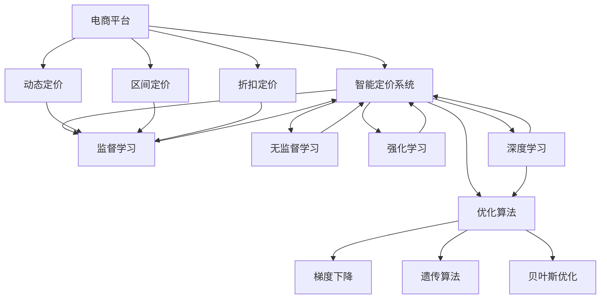

                 

# AI驱动的电商平台智能定价系统

> 关键词：人工智能,电商平台,智能定价,定价策略,深度学习,神经网络,优化算法,决策支持,电商运营,数据驱动

## 1. 背景介绍

### 1.1 问题由来
电商平台定价一直是其核心竞争力之一，然而传统的定价策略通常依赖经验判断，难以应对市场快速变化，导致定价不合理、损失潜在利润或引发价格战。随着人工智能技术的崛起，电商平台开始探索使用AI技术优化其智能定价系统，利用大数据和机器学习算法，实现精准定价，提升竞争力和用户满意度。

### 1.2 问题核心关键点
- **AI智能定价**：基于机器学习和数据驱动的定价策略，动态调整商品价格以最大化利润。
- **定价策略优化**：使用多种定价策略，如动态定价、区间定价、折扣定价等，并结合电商平台的运营特性进行优化。
- **实时数据处理**：实时处理订单、库存、市场趋势等数据，确保定价策略的即时性和灵活性。
- **模型可解释性**：需要建立可解释的定价模型，方便电商运营人员理解和调整定价策略。
- **多渠道应用**：智能定价系统需要支持多渠道销售，包括线上、线下及多国市场。

### 1.3 问题研究意义
构建AI驱动的智能定价系统，能够帮助电商平台在动态变化的市场环境中精准定价，避免价格战，提升整体运营效率和利润。此外，智能定价系统的应用还能增强用户购物体验，提升品牌竞争力，推动电商产业的持续健康发展。

## 2. 核心概念与联系

### 2.1 核心概念概述

为了更好地理解智能定价系统的实现过程，本节将介绍几个关键概念及其相互联系：

- **电商平台**：在线销售商品或服务的平台，如Amazon、京东等。
- **智能定价系统**：利用AI技术进行价格预测、调整和优化的系统。
- **动态定价**：根据市场需求和竞争状况，动态调整商品价格，实现利润最大化。
- **定价策略**：基于不同市场环境和业务目标，设计适合的定价方案，如区间定价、折扣定价、动态定价等。
- **优化算法**：如梯度下降、遗传算法、贝叶斯优化等，用于模型参数的优化和定价策略的选择。
- **机器学习**：包括监督学习、无监督学习、强化学习等，用于构建和训练定价模型。
- **深度学习**：神经网络模型，如卷积神经网络(CNN)、循环神经网络(RNN)、长短期记忆网络(LSTM)等，用于复杂数据分析和预测。
- **数据驱动**：基于历史交易数据和实时市场信息，进行决策支持。
- **电商运营**：包括库存管理、物流配送、售后服务等，影响智能定价系统的实际效果。

这些核心概念之间的逻辑关系可以通过以下Mermaid流程图来展示：



这个流程图展示了几组关键概念之间的联系：

1. 电商平台利用智能定价系统进行动态定价、区间定价、折扣定价等策略，以优化产品价格。
2. 智能定价系统通过监督学习、无监督学习、强化学习和深度学习模型，构建定价预测和调整模型。
3. 优化算法用于模型参数的优化和定价策略的选择。
4. 这些算法和模型相互配合，实现智能定价系统的核心功能。

## 3. 核心算法原理 & 具体操作步骤
### 3.1 算法原理概述

智能定价系统的核心算法原理主要基于机器学习与深度学习，通过构建定价模型来预测和调整商品价格。其基本流程包括数据收集、模型训练、价格预测和策略优化。

具体而言，智能定价系统首先收集电商平台的交易数据、市场趋势、库存情况等信息，使用这些数据来训练定价模型。训练过程中，系统会根据不同的定价策略，如动态定价、区间定价、折扣定价等，来优化模型参数，确保模型能够准确预测市场变化并动态调整价格。最后，系统会实时处理订单和市场数据，进行价格预测并自动调整商品价格，以实现利润最大化。

### 3.2 算法步骤详解

智能定价系统的构建和应用，主要包括以下几个关键步骤：

**Step 1: 数据收集与预处理**
- 收集电商平台的历史交易数据，包括订单数量、商品价格、销售渠道、用户行为等。
- 收集实时市场数据，如竞争对手价格、市场趋势、节假日影响等。
- 收集库存数据，如库存量、订单量、补货时间等。
- 清洗数据，处理缺失值、异常值，进行归一化处理。

**Step 2: 特征工程与数据表示**
- 提取关键特征，如商品类别、用户历史购买行为、促销活动等。
- 设计合适的数据表示方式，如向量表示、时序数据等，方便模型处理。

**Step 3: 构建定价模型**
- 选择合适的机器学习或深度学习模型，如线性回归、决策树、随机森林、神经网络等。
- 使用历史交易数据和市场数据进行模型训练，优化模型参数。
- 结合电商平台的业务逻辑和定价策略，调整模型预测结果。

**Step 4: 实时定价与优化**
- 实时处理订单和市场数据，进行价格预测和调整。
- 结合优化算法，如梯度下降、遗传算法等，不断优化定价模型。
- 根据市场反馈和业务需求，动态调整定价策略。

**Step 5: 评估与迭代**
- 定期评估智能定价系统的性能，如预测准确率、利润增长率等。
- 根据评估结果，调整模型参数和定价策略，进行迭代优化。

### 3.3 算法优缺点

智能定价系统的优势在于能够利用大数据和AI技术，实现精准定价和动态调整，提高运营效率和利润。具体优点包括：

- **精准定价**：利用机器学习和大数据，预测最优价格，避免传统定价中的主观性和经验误差。
- **实时响应**：实时处理订单和市场数据，动态调整价格，及时应对市场变化。
- **自动化优化**：通过优化算法，自动调整模型参数和定价策略，减少人工干预。
- **多渠道支持**：适用于线上、线下及多国市场的定价需求，支持多渠道销售。

同时，该系统也存在一些局限性：

- **依赖高质量数据**：智能定价系统的效果很大程度上取决于数据的完整性和质量。
- **模型复杂性**：构建和优化复杂模型需要较高的技术要求和计算资源。
- **市场敏感性**：模型预测依赖市场数据，市场突发事件可能影响定价效果。
- **模型可解释性**：复杂的AI模型通常缺乏可解释性，影响电商运营人员的使用信心。

### 3.4 算法应用领域

智能定价系统已经在多个电商领域得到了应用，并取得了显著的效果：

- **商品定价**：通过智能定价系统，电商平台能够动态调整商品价格，优化库存管理和用户满意度。
- **促销活动**：根据市场趋势和用户行为，智能定价系统可以设计出更有效的促销策略，提升销售转化率。
- **库存管理**：通过实时定价和预测，智能定价系统能够帮助电商平台优化库存，避免过多库存和缺货现象。
- **市场竞争**：在激烈的市场竞争中，智能定价系统能够帮助电商平台制定更具竞争力的价格策略，增强市场竞争力。

## 4. 数学模型和公式 & 详细讲解  
### 4.1 数学模型构建

本节将使用数学语言对智能定价系统的构建过程进行更加严格的刻画。

记电商平台的历史交易数据为 $\mathcal{D}=\{(x_i, y_i)\}_{i=1}^N$，其中 $x_i$ 为订单特征向量，$y_i$ 为实际销售价格。假设市场数据为 $\mathcal{M}$，库存数据为 $\mathcal{S}$。智能定价模型的构建过程如下：

1. 特征提取：将订单特征 $x_i$ 表示为向量 $x \in \mathbb{R}^d$。
2. 构建定价模型：使用回归模型 $f(x; \theta)$ 预测价格 $y$，其中 $\theta$ 为模型参数。
3. 训练模型：最小化预测价格与实际价格的差异，即 $\min_{\theta} \sum_{i=1}^N (y_i - f(x_i; \theta))^2$。

### 4.2 公式推导过程

以线性回归模型为例，其公式推导过程如下：

假设定价模型为 $f(x; \theta) = \theta_0 + \theta_1 x_1 + \theta_2 x_2 + \cdots + \theta_d x_d$，其中 $\theta_0, \theta_1, \theta_2, \cdots, \theta_d$ 为模型参数。则预测价格为 $y = f(x; \theta)$。

最小化损失函数 $\mathcal{L}(\theta)$ 的过程如下：

$$
\mathcal{L}(\theta) = \frac{1}{N} \sum_{i=1}^N (y_i - f(x_i; \theta))^2
$$

利用梯度下降算法优化 $\theta$，其更新公式为：

$$
\theta \leftarrow \theta - \eta \nabla_{\theta}\mathcal{L}(\theta)
$$

其中 $\eta$ 为学习率，$\nabla_{\theta}\mathcal{L}(\theta)$ 为损失函数对参数 $\theta$ 的梯度。

在实际应用中，还可以结合优化算法如贝叶斯优化、遗传算法等，进一步提升模型优化效果。

### 4.3 案例分析与讲解

以一个简单的电商平台上商品价格预测为例，假设数据集 $\mathcal{D}=\{(x_i, y_i)\}_{i=1}^N$ 中 $x_i$ 表示订单特征向量，$y_i$ 表示商品价格。使用线性回归模型进行价格预测，并使用梯度下降算法进行优化。

首先，将订单特征 $x_i$ 表示为向量 $x \in \mathbb{R}^d$。然后，构建线性回归模型 $f(x; \theta) = \theta_0 + \theta_1 x_1 + \theta_2 x_2 + \cdots + \theta_d x_d$。使用梯度下降算法进行模型参数 $\theta$ 的优化，其更新公式为：

$$
\theta \leftarrow \theta - \eta \frac{\sum_{i=1}^N (y_i - f(x_i; \theta))x_i}{\sum_{i=1}^N (y_i - f(x_i; \theta))^2}
$$

在模型训练过程中，通过交叉验证等方法进行模型评估，确保模型具有良好的泛化能力。

## 5. 项目实践：代码实例和详细解释说明
### 5.1 开发环境搭建

在进行智能定价系统开发前，我们需要准备好开发环境。以下是使用Python进行Pandas、Numpy、Scikit-learn等库的环境配置流程：

1. 安装Anaconda：从官网下载并安装Anaconda，用于创建独立的Python环境。

2. 创建并激活虚拟环境：
```bash
conda create -n pricing-env python=3.8 
conda activate pricing-env
```

3. 安装必要的库：
```bash
conda install pandas numpy scikit-learn matplotlib seaborn tqdm jupyter notebook ipython
```

完成上述步骤后，即可在`pricing-env`环境中开始智能定价系统的开发。

### 5.2 源代码详细实现

下面以线性回归模型为例，给出使用Scikit-learn库进行商品价格预测的Python代码实现。

```python
import pandas as pd
import numpy as np
from sklearn.model_selection import train_test_split
from sklearn.linear_model import LinearRegression
from sklearn.metrics import mean_squared_error
from sklearn.preprocessing import StandardScaler

# 数据读取
data = pd.read_csv('price_data.csv')

# 数据预处理
features = data[['feature1', 'feature2', 'feature3']]
target = data['price']
features = StandardScaler().fit_transform(features)

# 数据分割
features_train, features_test, target_train, target_test = train_test_split(features, target, test_size=0.2, random_state=42)

# 模型训练
model = LinearRegression()
model.fit(features_train, target_train)

# 模型评估
predictions = model.predict(features_test)
mse = mean_squared_error(target_test, predictions)
print(f'Mean Squared Error: {mse:.3f}')
```

以上代码实现了简单的线性回归模型，用于预测商品价格。

### 5.3 代码解读与分析

让我们再详细解读一下关键代码的实现细节：

**数据读取与预处理**：
- `pd.read_csv('price_data.csv')`：读取CSV格式的数据集。
- `StandardScaler().fit_transform(features)`：对特征进行标准化处理，确保数据具有相似的尺度。

**模型训练与评估**：
- `LinearRegression()`：创建线性回归模型。
- `model.fit(features_train, target_train)`：使用训练集数据训练模型。
- `mean_squared_error(target_test, predictions)`：计算模型在测试集上的均方误差。

通过上述步骤，我们构建了一个简单的智能定价模型，实现了商品价格的预测。在实际应用中，还需要结合电商平台的业务逻辑和定价策略，进一步优化模型性能。

## 6. 实际应用场景
### 6.1 智能库存管理

智能定价系统的一个重要应用场景是智能库存管理。电商平台通过实时监控订单和库存数据，动态调整商品价格，实现库存最优管理。

例如，某电商平台发现某商品销售量持续增长，库存不足，可以通过智能定价系统动态提高该商品价格，减少新订单的生成，从而缓解库存压力。反之，如果某商品库存积压，可以通过降价促销吸引用户购买，减少库存。

### 6.2 促销活动设计

促销活动是电商平台提升销售额的重要手段。智能定价系统可以根据市场需求和用户行为，设计出更有效的促销活动。

例如，某电商平台计划在新品上市时进行大规模促销活动，智能定价系统可以基于历史数据和实时市场信息，预测新品的销售趋势和用户需求，自动调整价格和促销策略，确保活动效果最大化。

### 6.3 价格对比与竞争力分析

智能定价系统还可以用于电商平台的价格对比和竞争力分析，帮助运营人员及时调整定价策略，提升市场竞争力。

例如，某电商平台发现某商品的价格高于竞争对手，可以通过智能定价系统进行市场价格分析，查找竞争对手的定价策略，并结合自身优势，调整价格和促销策略，实现价格优势。

### 6.4 未来应用展望

随着AI技术的发展，智能定价系统的应用将更加广泛，具体展望如下：

1. **多渠道应用**：智能定价系统支持多渠道销售，包括线上、线下及多国市场，能够更好地应对不同渠道和市场的定价需求。
2. **实时预测**：结合实时市场数据和用户行为，智能定价系统可以实时预测商品价格，提升运营效率和客户满意度。
3. **个性化定价**：通过用户画像和行为分析，智能定价系统可以实现个性化定价，提升用户体验和转化率。
4. **价格弹性优化**：智能定价系统可以优化价格弹性，即根据市场需求和用户行为，动态调整价格区间，确保价格策略的有效性。
5. **数据驱动决策**：智能定价系统能够根据大数据分析结果，生成决策支持报告，帮助运营人员制定更加科学合理的定价策略。

## 7. 工具和资源推荐
### 7.1 学习资源推荐

为了帮助开发者系统掌握智能定价系统的理论基础和实践技巧，这里推荐一些优质的学习资源：

1. 《机器学习实战》系列书籍：介绍了机器学习和深度学习的基本概念和应用，包括价格预测、优化算法等。
2. CS229《机器学习》课程：斯坦福大学开设的经典机器学习课程，涵盖多种机器学习算法及其应用。
3. 《Python数据科学手册》：详细介绍了Python在数据科学中的使用方法，包括Pandas、Numpy、Scikit-learn等库的应用。
4. Google Cloud AI平台：提供了丰富的AI模型和工具，包括TensorFlow、TensorBoard等，方便开发者进行智能定价系统的部署和调试。
5. Kaggle平台：提供了大量的数据集和竞赛，帮助开发者进行模型训练和评估，提升智能定价系统的性能。

通过对这些资源的学习实践，相信你一定能够快速掌握智能定价系统的精髓，并用于解决实际的电商问题。

### 7.2 开发工具推荐

高效的开发离不开优秀的工具支持。以下是几款用于智能定价系统开发的常用工具：

1. Python：Python是数据科学和机器学习领域的标准语言，灵活高效，适合快速迭代研究。
2. Pandas：用于数据处理和分析，支持多种数据格式和复杂的数据操作。
3. Numpy：用于数值计算和矩阵运算，是科学计算的基础库。
4. Scikit-learn：提供多种机器学习算法，包括线性回归、随机森林、梯度下降等，方便模型构建和评估。
5. TensorFlow：由Google主导开发的深度学习框架，支持多种神经网络模型的构建和训练。
6. Jupyter Notebook：交互式编程环境，方便进行模型实验和代码调试。

合理利用这些工具，可以显著提升智能定价系统的开发效率，加快创新迭代的步伐。

### 7.3 相关论文推荐

智能定价系统的研究源于学界的持续探索。以下是几篇奠基性的相关论文，推荐阅读：

1. "Elastic Pricing via Differential Dynamic Programming"：提出了一种基于动态规划的定价策略，用于电信和电力行业，效果显著。
2. "Machine Learning for Revenue Management"：介绍了机器学习在收入管理中的应用，包括定价、库存管理等。
3. "Online Storefront Revenue Optimization"：提出了在线商店的定价和促销策略优化方法，利用大数据和机器学习技术提升销售收入。
4. "A Neural Network Approach for Optimizing Pricing and Promotions"：使用深度学习模型优化价格和促销策略，提升电商平台的销售效果。
5. "Online Pricing and Inventory Management"：结合在线定价和库存管理，提出了一种优化算法，用于电商平台的价格策略制定。

这些论文代表了智能定价系统的发展脉络。通过学习这些前沿成果，可以帮助研究者把握学科前进方向，激发更多的创新灵感。

## 8. 总结：未来发展趋势与挑战
### 8.1 总结

本文对智能定价系统进行了全面系统的介绍。首先阐述了智能定价系统的背景和意义，明确了其精准定价、实时响应、自动化优化等核心优势。其次，从原理到实践，详细讲解了智能定价系统的构建和应用流程，提供了完整的代码实例和数据分析方法。同时，本文还探讨了智能定价系统在库存管理、促销活动设计、价格对比与竞争力分析等方面的应用场景，展示了其在电商平台运营中的广泛价值。最后，本文精选了智能定价系统的各类学习资源，力求为读者提供全方位的技术指引。

通过本文的系统梳理，可以看到，智能定价系统是基于机器学习和数据驱动的定价策略优化技术，能够显著提升电商平台的运营效率和利润。未来，伴随AI技术的发展，智能定价系统还将进一步拓展应用领域，为电商产业带来更深远的影响。

### 8.2 未来发展趋势

展望未来，智能定价系统的发展将呈现以下几个趋势：

1. **模型复杂化**：随着深度学习和强化学习技术的成熟，智能定价系统将使用更复杂的模型，如卷积神经网络、循环神经网络、生成对抗网络等，提升预测精度和策略优化能力。
2. **数据多样化**：智能定价系统将利用多源数据，包括订单数据、市场趋势、用户行为、竞争对手信息等，进行多维度的定价策略优化。
3. **实时响应**：结合实时市场数据和用户行为，智能定价系统可以实时调整价格策略，实现动态定价和优化。
4. **个性化定价**：基于用户画像和行为分析，智能定价系统可以实现个性化定价，提升用户体验和转化率。
5. **多渠道协同**：智能定价系统支持线上、线下及多国市场，实现多渠道协同定价和优化。
6. **决策支持**：智能定价系统将结合决策支持工具，提供实时定价建议和优化方案，帮助运营人员制定更加科学合理的定价策略。

以上趋势凸显了智能定价系统的广阔前景。这些方向的探索发展，必将进一步提升智能定价系统的性能和应用范围，为电商产业带来更大的价值。

### 8.3 面临的挑战

尽管智能定价系统已经在电商领域取得了显著效果，但在其发展过程中仍面临诸多挑战：

1. **数据质量**：智能定价系统的效果很大程度上取决于数据的质量和完整性，低质量或缺失的数据可能导致定价策略失效。
2. **模型复杂性**：复杂模型需要较高的计算资源和算法知识，开发和维护成本较高。
3. **市场变化**：市场需求和竞争状况的快速变化，可能导致模型预测失效，影响定价效果。
4. **用户行为多样性**：用户行为的复杂性和多样性，难以完全被模型捕捉，导致定价策略偏差。
5. **系统稳定性**：复杂的智能定价系统可能存在漏洞，需要持续监控和维护，确保系统稳定性。

这些挑战需要未来的研究者进一步探索和解决，才能推动智能定价系统向更加成熟和实用的方向发展。

### 8.4 研究展望

面对智能定价系统面临的挑战，未来的研究需要在以下几个方面寻求新的突破：

1. **数据预处理与清洗**：开发高效的数据预处理和清洗技术，确保输入数据的高质量和高可用性。
2. **模型优化**：进一步优化定价模型，提升模型的泛化能力和预测精度，减少过拟合和偏差。
3. **实时监控与反馈**：建立实时监控和反馈机制，及时发现和解决系统问题，提升系统稳定性和可靠性。
4. **多源数据融合**：结合多源数据，进行数据融合和特征提取，提升定价策略的多样性和准确性。
5. **决策支持**：引入决策支持工具，结合专家知识和人工智能算法，提供更加科学合理的定价建议。

这些研究方向将进一步推动智能定价系统的优化和应用，帮助电商平台在动态变化的市场环境中精准定价，提升整体运营效率和利润。总之，智能定价系统需要在数据、算法、工程、业务等多个维度协同发力，才能真正实现其在电商运营中的广泛应用和价值。

## 9. 附录：常见问题与解答
**Q1：智能定价系统如何应对市场变化？**

A: 智能定价系统通过实时监控市场数据，如竞争对手价格、市场趋势、节假日影响等，进行动态调整。当市场环境发生变化时，系统会重新训练模型或调整参数，以适应新的市场环境。例如，在节假日促销期间，系统会动态调整价格和促销策略，以提高销售转化率。

**Q2：智能定价系统如何处理用户行为多样性？**

A: 智能定价系统通过用户画像和行为分析，了解不同用户的需求和行为模式。系统结合用户画像和市场数据，进行个性化定价和促销策略设计。例如，根据用户的历史购买行为和偏好，智能定价系统可以推荐个性化价格和优惠活动，提升用户体验和转化率。

**Q3：智能定价系统是否适用于所有电商平台？**

A: 智能定价系统适用于大部分电商平台，但需要根据不同平台的特点进行定制化开发。例如，针对B2B电商平台的智能定价系统，可能需要考虑大宗订单和定制化需求；针对跨境电商平台的智能定价系统，可能需要考虑多国市场的定价策略。

**Q4：智能定价系统的训练和优化需要哪些计算资源？**

A: 智能定价系统的训练和优化需要较高的计算资源，包括高性能的CPU和GPU，以及大容量内存。例如，使用深度学习模型进行训练时，需要较大的内存来存储模型参数和中间结果，较快的计算速度来提高训练效率。

**Q5：智能定价系统如何评估和优化模型性能？**

A: 智能定价系统的模型评估通常使用均方误差(MSE)、平均绝对误差(MAE)等指标，评估模型预测价格与实际价格的差异。系统还可以使用交叉验证、回归分析等方法，评估模型的泛化能力和鲁棒性。根据评估结果，调整模型参数和优化算法，提升模型性能。

通过本文的系统梳理，可以看到，智能定价系统是基于机器学习和数据驱动的定价策略优化技术，能够显著提升电商平台的运营效率和利润。未来，伴随AI技术的发展，智能定价系统还将进一步拓展应用领域，为电商产业带来更深远的影响。

作者：禅与计算机程序设计艺术 / Zen and the Art of Computer Programming

