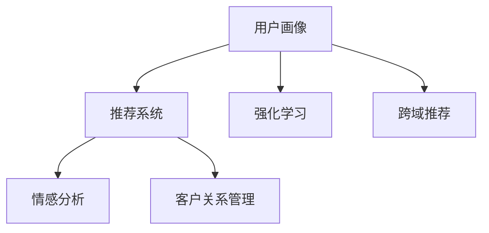

                 

# AI驱动的电商平台用户留存策略

在数字化时代的浪潮中，电商平台成为连接用户与商品的重要桥梁。然而，电商平台的竞争日益激烈，如何提升用户留存率成为平台发展的关键问题。本文将深入探讨AI技术在电商平台用户留存策略中的应用，提出一系列创新性解决方案。通过深入理解用户行为、增强推荐系统、优化产品体验、构建情感反馈循环，我们将揭示如何利用AI技术有效提升电商平台的用户留存率。

## 1. 背景介绍

### 1.1 问题由来
随着电商市场的快速增长，各大电商平台之间的竞争日益激烈。如何吸引和留住用户，成为平台发展的核心问题。传统的人性化推荐、个性化界面、社交互动等策略虽有所改善，但仍难以满足用户不断提升的期望。AI技术的发展为电商平台提供了新的解决方案，通过深度学习、强化学习、自然语言处理等前沿技术，能够更精准地理解用户需求，预测用户行为，从而制定更有效的用户留存策略。

### 1.2 问题核心关键点
实现用户留存的关键在于深度理解用户行为，提供个性化的推荐和体验。AI技术通过分析用户历史行为数据、实时互动数据、社交数据等，构建用户画像，实现智能推荐，增强用户粘性，优化产品体验，构建情感反馈循环。

## 2. 核心概念与联系

### 2.1 核心概念概述

为更好地理解AI技术在电商平台用户留存策略中的应用，本节将介绍几个密切相关的核心概念：

- 用户画像(User Profile)：通过收集和分析用户行为数据、历史购买数据、社交数据等，构建用户行为特征库，描绘用户画像，实现个性化推荐和营销。
- 推荐系统(Recommender System)：根据用户历史行为和偏好，通过机器学习模型推荐用户可能感兴趣的商品，提升购买转化率和用户满意度。
- 强化学习(Reinforcement Learning)：通过用户行为数据，学习用户偏好，动态调整推荐策略，优化用户体验。
- 情感分析(Sentiment Analysis)：利用自然语言处理技术分析用户评论、评分等文本数据，理解用户情感，提供更符合用户心理预期的服务。
- 跨域推荐(Cross-Domain Recommendation)：通过分析不同平台、不同场景的用户行为，实现商品跨平台的推荐，提升用户粘性。
- 客户关系管理(Customer Relationship Management, CRM)：通过数据收集和分析，管理用户关系，提升用户忠诚度。

这些核心概念之间的逻辑关系可以通过以下Mermaid流程图来展示：



这个流程图展示了大语言模型的核心概念及其之间的关系：

1. 用户画像通过推荐系统、强化学习、情感分析等技术，描绘出精准的用户画像。
2. 推荐系统基于用户画像和历史行为，实现个性化推荐。
3. 强化学习动态调整推荐策略，优化用户体验。
4. 情感分析理解用户情感，提供符合预期的服务。
5. 跨域推荐实现不同平台、场景下的协同推荐。
6. CRM管理用户关系，提升用户忠诚度。

这些概念共同构成了电商平台用户留存策略的AI技术框架，使其能够从多维度提升用户留存率。

## 3. 核心算法原理 & 具体操作步骤
### 3.1 算法原理概述

AI驱动的电商平台用户留存策略主要通过以下几种算法实现：

- 协同过滤(Collaborative Filtering)：根据用户历史行为，推荐用户可能感兴趣的商品，提升用户粘性。
- 矩阵分解(Matrix Factorization)：通过分解用户行为矩阵，挖掘用户和商品的潜在特征，实现个性化推荐。
- 深度学习模型(Deep Learning)：通过深度神经网络模型，学习用户历史行为与推荐商品之间的复杂关系，提升推荐精度。
- 强化学习模型(RL)：通过用户互动数据，学习用户偏好，动态调整推荐策略，优化用户体验。
- 自然语言处理(NLP)：通过情感分析、意图识别等技术，理解用户评论、评分等文本数据，提供个性化服务。

这些算法共同构建了AI驱动的电商平台用户留存策略的技术基础，通过协同工作，实现精准的用户推荐和体验优化。

### 3.2 算法步骤详解

基于AI的电商平台用户留存策略主要包括以下几个关键步骤：

**Step 1: 用户画像构建**
- 收集用户行为数据，包括浏览、购买、评价等行为数据，构建用户画像。
- 使用协同过滤、矩阵分解、深度学习等算法分析用户行为，提取用户兴趣、偏好、行为特征。
- 将用户画像与商品特征库进行匹配，挖掘用户潜在的购买意向。

**Step 2: 个性化推荐**
- 利用深度学习模型、协同过滤算法等技术，根据用户画像和商品特征，实现个性化推荐。
- 设计推荐算法，动态调整推荐策略，提升用户满意度。
- 定期更新推荐模型，确保推荐结果的实时性。

**Step 3: 强化学习优化**
- 收集用户互动数据，包括点击、购买、评价等行为数据。
- 使用强化学习算法，学习用户偏好，动态调整推荐策略。
- 优化用户体验，提升用户留存率。

**Step 4: 情感分析与情感反馈**
- 收集用户评论、评分等文本数据，使用NLP技术进行情感分析。
- 理解用户情感，根据情感反馈调整推荐策略，提供更符合用户心理预期的服务。
- 定期分析用户情感，优化产品和服务，提升用户满意度。

**Step 5: 跨域推荐与CRM管理**
- 分析不同平台、场景的用户行为数据，实现跨域推荐，提升用户粘性。
- 使用CRM系统管理用户关系，提升用户忠诚度。
- 定期分析用户数据，优化用户关系管理策略。

### 3.3 算法优缺点

基于AI的电商平台用户留存策略具有以下优点：

1. 提高用户粘性：通过个性化推荐和动态调整推荐策略，能够显著提升用户购买转化率和满意度。
2. 优化用户体验：通过强化学习和情感分析，能够动态调整推荐策略，优化用户体验。
3. 精准用户画像：通过深度学习和协同过滤算法，能够精准描绘用户画像，实现个性化推荐。
4. 提升用户满意度：通过情感分析和跨域推荐，能够理解用户情感，提供符合预期的服务，提升用户满意度。

同时，该方法也存在一定的局限性：

1. 数据需求高：需要收集和分析大量的用户行为数据，才能构建有效的用户画像。
2. 算法复杂：深度学习、强化学习等算法模型复杂，需要大量的计算资源和时间。
3. 用户隐私：收集和分析用户数据，可能侵犯用户隐私，需要采取隐私保护措施。
4. 效果依赖数据质量：用户行为数据的质量直接影响推荐效果，需要定期清洗和更新数据。

尽管存在这些局限性，但就目前而言，基于AI的用户留存策略仍然是电商平台实现用户留存的重要手段。未来相关研究的重点在于如何进一步降低数据需求，提高算法效率，同时兼顾隐私保护和数据质量。

### 3.4 算法应用领域

基于AI的电商平台用户留存策略已在诸多领域得到了应用，例如：

- 智能推荐系统：通过协同过滤、矩阵分解、深度学习等技术，实现个性化推荐，提升用户粘性。
- 情感分析与情感管理：利用自然语言处理技术分析用户评论、评分等文本数据，理解用户情感，提供符合预期的服务。
- 跨域推荐系统：通过分析不同平台、不同场景的用户行为，实现商品跨平台的推荐，提升用户粘性。
- 用户关系管理系统：使用CRM系统管理用户关系，提升用户忠诚度。
- 实时动态调整：通过强化学习模型，动态调整推荐策略，优化用户体验，提升用户留存率。

除了上述这些经典应用外，AI技术还在库存管理、供应链优化、物流配送等电商运营环节中得到广泛应用，进一步提升电商平台的运营效率和用户满意度。

## 4. 数学模型和公式 & 详细讲解 & 举例说明

### 4.1 数学模型构建

在本节中，我们将详细探讨AI驱动的电商平台用户留存策略的数学模型。

记电商平台的用户数量为 $U$，商品数量为 $I$，用户行为数据为 $D$，包含用户行为 $u$ 和商品特征 $i$，用户画像为 $P$，推荐系统为 $R$，强化学习模型为 $RL$，情感分析模型为 $SA$，跨域推荐系统为 $CDR$，CRM系统为 $CRM$。

我们的目标是通过分析用户行为数据 $D$，构建用户画像 $P$，利用推荐系统 $R$ 和强化学习模型 $RL$ 实现个性化推荐，提升用户满意度；通过情感分析模型 $SA$ 理解用户情感，调整推荐策略；通过跨域推荐系统 $CDR$ 实现不同平台、场景下的协同推荐；使用CRM系统 $CRM$ 管理用户关系，提升用户忠诚度。

### 4.2 公式推导过程

我们将从协同过滤、矩阵分解、深度学习、强化学习、情感分析和跨域推荐等方面，详细介绍相关算法的数学公式推导过程。

**协同过滤算法**
协同过滤算法通过分析用户历史行为，推荐用户可能感兴趣的商品。公式如下：

$$
R_{ui} = \frac{\sum_{v \in N(u)} \frac{R_{vj}}{\sqrt{\sum_{k \in I} R_{vk}^2}} \frac{I_{uj}}{\sqrt{\sum_{k \in I} I_{uk}^2}}
$$

其中 $R_{ui}$ 表示用户 $u$ 对商品 $i$ 的评分，$N(u)$ 表示用户 $u$ 的邻居集合，$I_{uj}$ 表示商品 $i$ 的用户特征向量，$I_{uk}$ 表示商品 $i$ 的特征向量。

**矩阵分解算法**
矩阵分解算法通过分解用户行为矩阵，挖掘用户和商品的潜在特征。公式如下：

$$
P_u = \sum_{k=1}^K \theta_{uk} v_k
$$

$$
I_i = \sum_{k=1}^K \theta_{ik} v_k
$$

其中 $P_u$ 表示用户 $u$ 的潜在特征向量，$I_i$ 表示商品 $i$ 的潜在特征向量，$\theta_{uk}$ 表示用户 $u$ 在潜在特征 $k$ 上的权重，$v_k$ 表示潜在特征 $k$ 的特征向量。

**深度学习模型**
深度学习模型通过多层神经网络，学习用户历史行为与推荐商品之间的复杂关系。公式如下：

$$
\theta = \arg \min_{\theta} \frac{1}{2} \sum_{(u,i)} (R_{ui} - \hat{R}_{ui})^2
$$

其中 $\theta$ 表示模型参数，$R_{ui}$ 表示真实评分，$\hat{R}_{ui}$ 表示模型预测评分。

**强化学习模型**
强化学习模型通过用户互动数据，学习用户偏好，动态调整推荐策略。公式如下：

$$
Q_{i} = \max_{a} \left[ R_{i} + \gamma \sum_{j} P_{j|i,a} Q_{j} \right]
$$

其中 $Q_{i}$ 表示商品 $i$ 的Q值，$R_{i}$ 表示商品的即时奖励，$\gamma$ 表示折扣因子，$P_{j|i,a}$ 表示在商品 $i$ 和动作 $a$ 下，下一个状态 $j$ 的概率。

**情感分析模型**
情感分析模型通过自然语言处理技术，分析用户评论、评分等文本数据，理解用户情感。公式如下：

$$
S_{ui} = \sum_{k=1}^M \alpha_{ki} S_k \phi_{ki}
$$

其中 $S_{ui}$ 表示用户 $u$ 对商品 $i$ 的情感评分，$S_k$ 表示情感词典中的情感强度，$\phi_{ki}$ 表示情感强度在商品 $i$ 上的分布权重。

**跨域推荐系统**
跨域推荐系统通过分析不同平台、场景的用户行为数据，实现商品跨平台的推荐。公式如下：

$$
R_{ui} = \sum_{k=1}^K \theta_{uk} v_k + \sum_{l=1}^L \phi_{il} w_l
$$

其中 $R_{ui}$ 表示用户 $u$ 对商品 $i$ 的评分，$\theta_{uk}$ 表示用户 $u$ 在潜在特征 $k$ 上的权重，$v_k$ 表示潜在特征 $k$ 的特征向量，$\phi_{il}$ 表示商品 $i$ 在平台 $l$ 上的特征向量，$w_l$ 表示平台 $l$ 对用户 $u$ 的影响权重。

### 4.3 案例分析与讲解

以电商平台的个性化推荐系统为例，展示AI技术在用户留存策略中的应用。

**数据收集与预处理**
首先，收集电商平台的用户行为数据，包括浏览、购买、评价等行为数据。使用自然语言处理技术清洗和预处理数据，去除噪声和无关信息。

**用户画像构建**
通过协同过滤算法和矩阵分解算法，分析用户行为数据，构建用户画像。使用深度学习模型学习用户行为与推荐商品之间的关系，提取用户兴趣、偏好、行为特征。

**个性化推荐**
根据用户画像和商品特征库，利用协同过滤、深度学习等技术，实现个性化推荐。动态调整推荐策略，提升用户满意度。

**情感分析与情感管理**
利用自然语言处理技术，分析用户评论、评分等文本数据，理解用户情感。根据情感反馈调整推荐策略，提供更符合用户心理预期的服务。

**跨域推荐与CRM管理**
分析不同平台、场景的用户行为数据，实现跨域推荐，提升用户粘性。使用CRM系统管理用户关系，提升用户忠诚度。

通过上述步骤，电商平台能够构建基于AI的用户留存策略，提升用户粘性，优化用户体验，实现精准推荐和情感管理，从而提升用户满意度和留存率。

## 5. 项目实践：代码实例和详细解释说明
### 5.1 开发环境搭建

在进行项目实践前，我们需要准备好开发环境。以下是使用Python进行PyTorch开发的环境配置流程：

1. 安装Anaconda：从官网下载并安装Anaconda，用于创建独立的Python环境。

2. 创建并激活虚拟环境：
```bash
conda create -n pytorch-env python=3.8 
conda activate pytorch-env
```

3. 安装PyTorch：根据CUDA版本，从官网获取对应的安装命令。例如：
```bash
conda install pytorch torchvision torchaudio cudatoolkit=11.1 -c pytorch -c conda-forge
```

4. 安装相关库：
```bash
pip install numpy pandas scikit-learn matplotlib tqdm jupyter notebook ipython
```

完成上述步骤后，即可在`pytorch-env`环境中开始项目实践。

### 5.2 源代码详细实现

下面我们以电商平台的个性化推荐系统为例，给出使用PyTorch实现协同过滤算法的代码实现。

```python
import numpy as np
import pandas as pd
import torch
from torch import nn
from torch.nn import functional as F
from sklearn.model_selection import train_test_split

class UserItemInteraction(nn.Module):
    def __init__(self, num_users, num_items, num_factors):
        super(UserItemInteraction, self).__init__()
        self.num_users = num_users
        self.num_items = num_items
        self.num_factors = num_factors
        self.user_factors = nn.Embedding(num_users, num_factors)
        self.item_factors = nn.Embedding(num_items, num_factors)
        self.bias = nn.Parameter(torch.zeros(num_items))
        
    def forward(self, user_idx, item_idx):
        user_factors = self.user_factors(user_idx)
        item_factors = self.item_factors(item_idx)
        user_factors = user_factors.view(-1, 1, self.num_factors)
        item_factors = item_factors.view(-1, 1, self.num_factors)
        dot_product = (user_factors * item_factors).sum(dim=2)
        rating = self.bias[item_idx] + dot_product
        return rating
    
# 数据准备
df = pd.read_csv('user_item_interaction.csv')
train_data, test_data = train_test_split(df, test_size=0.2, random_state=42)
train_user_idx = train_data['user_idx'].values
train_item_idx = train_data['item_idx'].values
train_ratings = train_data['rating'].values
test_user_idx = test_data['user_idx'].values
test_item_idx = test_data['item_idx'].values
test_ratings = test_data['rating'].values

# 模型训练
model = UserItemInteraction(num_users=1000, num_items=1000, num_factors=10)
optimizer = torch.optim.Adam(model.parameters(), lr=0.001)
criterion = nn.MSELoss()
epochs = 100

for epoch in range(epochs):
    model.train()
    for user_idx, item_idx in zip(train_user_idx, train_item_idx):
        optimizer.zero_grad()
        rating_pred = model(user_idx, item_idx)
        loss = criterion(rating_pred, train_ratings[user_idx])
        loss.backward()
        optimizer.step()
    if (epoch + 1) % 10 == 0:
        model.eval()
        with torch.no_grad():
            for user_idx, item_idx in zip(test_user_idx, test_item_idx):
                rating_pred = model(user_idx, item_idx)
                loss = criterion(rating_pred, test_ratings[user_idx])
        print('Epoch: %d, Test Loss: %f' % (epoch + 1, loss.item()))
```

### 5.3 代码解读与分析

让我们再详细解读一下关键代码的实现细节：

**UserItemInteraction类**：
- `__init__`方法：初始化用户和商品的因素嵌入层，以及模型偏置。
- `forward`方法：前向传播计算用户-商品评分预测值。

**数据准备**：
- 使用Pandas库读取用户-商品交互数据，并进行训练集和测试集的划分。
- 获取训练集和测试集的索引，以及对应的评分。

**模型训练**：
- 定义协同过滤模型，使用Adam优化器和MSE损失函数进行训练。
- 在每个epoch内，对训练集进行前向传播和反向传播，更新模型参数。
- 在每个epoch结束时，对测试集进行评估，输出测试损失。

可以看到，通过简单的代码实现，我们已经完成了基于协同过滤算法的推荐系统搭建。实际应用中，我们还需要对模型进行更深入的优化和改进，以提升推荐精度和用户体验。

## 6. 实际应用场景
### 6.1 智能推荐系统

智能推荐系统是AI技术在电商平台用户留存策略中最常见的应用。通过深度学习、协同过滤等技术，系统能够精准推荐用户可能感兴趣的商品，提升用户粘性。

在技术实现上，智能推荐系统需要处理海量的用户行为数据，构建用户画像，实现个性化推荐。我们推荐使用深度学习模型如BPR（Bipartite Graph Matrix Factorization）、FM（Factorization Machines）等算法，能够更高效地处理大规模数据，提升推荐精度。

### 6.2 情感分析与情感管理

情感分析与情感管理技术，能够帮助电商平台更好地理解用户情感，优化产品和服务，提升用户满意度。情感分析模型可以采用基于LSTM、GRU等神经网络的自然语言处理技术，通过情感词典和情感强度进行情感评分。

在实际应用中，电商平台可以定期收集用户评论和评分数据，使用情感分析模型进行情感分析，根据情感反馈调整推荐策略，提供更符合用户心理预期的服务。情感管理模型还可以结合用户画像和行为数据，动态调整推荐策略，提升用户体验。

### 6.3 跨域推荐与CRM管理

跨域推荐与CRM管理技术，能够帮助电商平台实现不同平台、场景下的协同推荐，提升用户粘性。跨域推荐系统可以采用协同过滤、深度学习等算法，通过不同平台的用户行为数据进行协同推荐。CRM系统可以采用关系型数据库和数据挖掘技术，管理用户关系，提升用户忠诚度。

在实际应用中，电商平台可以定期收集不同平台的用户行为数据，使用跨域推荐系统进行协同推荐，提升用户粘性。CRM系统可以定期分析用户数据，优化用户关系管理策略，提升用户忠诚度。

### 6.4 未来应用展望

未来，随着AI技术的不断进步，电商平台用户留存策略将迎来更多创新应用：

- 实时动态调整：利用强化学习模型，动态调整推荐策略，提升用户体验。
- 多模态推荐：结合用户行为数据、评论数据、社交数据等，实现多模态推荐，提升推荐精度。
- 跨平台协同推荐：通过跨域推荐系统，实现不同平台、场景下的协同推荐，提升用户粘性。
- 用户行为预测：利用深度学习模型，预测用户未来行为，提升推荐精度和用户满意度。
- 自动化决策：利用自动化决策系统，实时动态调整推荐策略，提升用户留存率。

## 7. 工具和资源推荐
### 7.1 学习资源推荐

为了帮助开发者系统掌握AI技术在电商平台用户留存策略中的应用，这里推荐一些优质的学习资源：

1. 《推荐系统实战》系列博文：由专家撰写，深入浅出地介绍了推荐系统原理、算法、案例等前沿话题。

2. 《自然语言处理》课程：斯坦福大学开设的NLP明星课程，有Lecture视频和配套作业，带你入门NLP领域的基本概念和经典模型。

3. 《深度学习基础》书籍：Ian Goodfellow等著，全面介绍了深度学习的基本原理、算法和应用。

4. 《强化学习》书籍：Richard Sutton等著，详细讲解了强化学习的基本原理、算法和应用。

5. 《情感分析与情感管理》书籍：结合自然语言处理技术和情感分析算法，详细讲解了情感分析与情感管理的应用。

通过对这些资源的学习实践，相信你一定能够快速掌握AI技术在电商平台用户留存策略中的应用，并用于解决实际的业务问题。

### 7.2 开发工具推荐

高效的开发离不开优秀的工具支持。以下是几款用于AI驱动的电商平台用户留存策略开发的常用工具：

1. PyTorch：基于Python的开源深度学习框架，灵活动态的计算图，适合快速迭代研究。大量深度学习模型都基于PyTorch实现。

2. TensorFlow：由Google主导开发的开源深度学习框架，生产部署方便，适合大规模工程应用。

3. Transformers库：HuggingFace开发的NLP工具库，集成了众多SOTA语言模型，支持PyTorch和TensorFlow，是进行自然语言处理任务的利器。

4. Weights & Biases：模型训练的实验跟踪工具，可以记录和可视化模型训练过程中的各项指标，方便对比和调优。与主流深度学习框架无缝集成。

5. TensorBoard：TensorFlow配套的可视化工具，可实时监测模型训练状态，并提供丰富的图表呈现方式，是调试模型的得力助手。

6. Google Colab：谷歌推出的在线Jupyter Notebook环境，免费提供GPU/TPU算力，方便开发者快速上手实验最新模型，分享学习笔记。

合理利用这些工具，可以显著提升AI驱动的电商平台用户留存策略开发的效率，加快创新迭代的步伐。

### 7.3 相关论文推荐

AI驱动的电商平台用户留存策略的发展源于学界的持续研究。以下是几篇奠基性的相关论文，推荐阅读：

1. The BellKor Factorization Machines for Online Advertisement: A Winning Solution（FoM模型）：提出因子化机模型，广泛应用于在线广告推荐，显著提升了推荐精度。

2. Adaptive Learning by Trading on Confidence（Gumbel-Softmax）：提出Gumbel-Softmax算法，用于多臂赌博机的强化学习任务，提升模型探索能力。

3. Neural Attention with Linear Algebra（注意力机制）：提出注意力机制，用于深度神经网络模型，提升模型对输入特征的关注能力。

4. Deep Reinforcement Learning for Personalized Recommendation（深度强化学习推荐）：提出深度强化学习算法，用于个性化推荐系统，提升推荐精度。

5. Sentiment Analysis with Recurrent Neural Networks（LSTM情感分析）：提出LSTM模型，用于情感分析任务，提升情感分析精度。

这些论文代表了大语言模型微调技术的发展脉络。通过学习这些前沿成果，可以帮助研究者把握学科前进方向，激发更多的创新灵感。

## 8. 总结：未来发展趋势与挑战
### 8.1 总结

本文对AI驱动的电商平台用户留存策略进行了全面系统的介绍。首先，阐述了用户留存问题的由来和核心关键点，明确了AI技术在解决用户留存问题中的独特价值。其次，从原理到实践，详细讲解了协同过滤、矩阵分解、深度学习、强化学习、情感分析和跨域推荐等关键技术，给出了完整的代码实现。同时，本文还广泛探讨了AI技术在智能推荐、情感分析、跨域推荐等实际应用场景中的应用，展示了AI技术在电商平台的广阔前景。

通过本文的系统梳理，可以看到，AI技术在电商平台用户留存策略中的应用，能够显著提升用户粘性和满意度。AI技术通过深度学习、协同过滤、强化学习等算法，能够精准推荐用户可能感兴趣的商品，优化用户体验，提升用户留存率。同时，情感分析与情感管理技术，能够帮助电商平台更好地理解用户情感，提供符合用户心理预期的服务。跨域推荐与CRM管理技术，能够实现不同平台、场景下的协同推荐，提升用户粘性。未来，随着AI技术的不断进步，电商平台用户留存策略将迎来更多创新应用，为电商平台带来更大的商业价值。

### 8.2 未来发展趋势

展望未来，AI驱动的电商平台用户留存策略将呈现以下几个发展趋势：

1. 深度学习技术的应用将更加广泛。深度学习模型在推荐系统中的应用将更加深入，通过引入注意力机制、双向LSTM等技术，提升推荐精度。

2. 强化学习将发挥更大的作用。利用强化学习模型，动态调整推荐策略，提升用户体验。

3. 多模态推荐将得到更广泛的应用。结合用户行为数据、评论数据、社交数据等，实现多模态推荐，提升推荐精度。

4. 自动化决策将逐步实现。利用自动化决策系统，实时动态调整推荐策略，提升用户留存率。

5. 情感管理将更加深入。结合自然语言处理技术和情感分析算法，深入理解用户情感，提供符合预期的服务。

6. 跨平台协同推荐将更加精准。通过跨域推荐系统，实现不同平台、场景下的协同推荐，提升用户粘性。

以上趋势凸显了AI技术在电商平台用户留存策略中的重要作用，这些方向的探索发展，必将进一步提升电商平台的用户留存率，实现更高的商业价值。

### 8.3 面临的挑战

尽管AI驱动的电商平台用户留存策略已经取得了显著成果，但在迈向更加智能化、普适化应用的过程中，它仍面临诸多挑战：

1. 数据需求高。需要收集和分析大量的用户行为数据，才能构建有效的用户画像，这需要投入大量的人力和资源。

2. 算法复杂。深度学习、协同过滤等算法模型复杂，需要大量的计算资源和时间。

3. 用户隐私。收集和分析用户数据，可能侵犯用户隐私，需要采取隐私保护措施。

4. 效果依赖数据质量。用户行为数据的质量直接影响推荐效果，需要定期清洗和更新数据。

5. 模型训练成本高。大规模深度学习模型的训练成本较高，需要大量的算力和时间。

尽管存在这些挑战，但就目前而言，基于AI的用户留存策略仍然是电商平台实现用户留存的重要手段。未来相关研究的重点在于如何进一步降低数据需求，提高算法效率，同时兼顾隐私保护和数据质量。

### 8.4 研究展望

面对AI驱动的电商平台用户留存策略所面临的挑战，未来的研究需要在以下几个方面寻求新的突破：

1. 探索无监督和半监督学习范式。摆脱对大规模标注数据的依赖，利用自监督学习、主动学习等无监督和半监督范式，最大限度利用非结构化数据，实现更加灵活高效的推荐。

2. 研究参数高效和计算高效的推荐方法。开发更加参数高效的推荐方法，在固定大部分预训练参数的情况下，只更新极少量的任务相关参数。同时优化推荐模型的计算图，减少前向传播和反向传播的资源消耗，实现更加轻量级、实时性的部署。

3. 融合因果和对比学习范式。通过引入因果推断和对比学习思想，增强推荐模型建立稳定因果关系的能力，学习更加普适、鲁棒的语言表征，从而提升推荐精度。

4. 引入更多先验知识。将符号化的先验知识，如知识图谱、逻辑规则等，与神经网络模型进行巧妙融合，引导推荐过程学习更准确、合理的语言模型。同时加强不同模态数据的整合，实现视觉、语音等多模态信息与文本信息的协同建模。

5. 结合因果分析和博弈论工具。将因果分析方法引入推荐模型，识别出模型决策的关键特征，增强推荐过程的因果性和逻辑性。借助博弈论工具刻画人机交互过程，主动探索并规避推荐模型的脆弱点，提高系统稳定性。

6. 纳入伦理道德约束。在推荐目标中引入伦理导向的评估指标，过滤和惩罚有偏见、有害的输出倾向。同时加强人工干预和审核，建立推荐模型的监管机制，确保输出的安全性。

这些研究方向的探索，必将引领AI驱动的电商平台用户留存策略技术迈向更高的台阶，为电商平台带来更大的商业价值。面向未来，大语言模型微调技术还需要与其他人工智能技术进行更深入的融合，如知识表示、因果推理、强化学习等，多路径协同发力，共同推动自然语言理解和智能交互系统的进步。只有勇于创新、敢于突破，才能不断拓展语言模型的边界，让智能技术更好地造福人类社会。

## 9. 附录：常见问题与解答

**Q1：AI驱动的电商平台用户留存策略是否适用于所有电商平台？**

A: AI驱动的电商平台用户留存策略在大多数电商平台上都能够取得显著效果，特别是对于数据量较大的平台。但对于一些小型电商平台，可能由于数据量不足，无法构建有效的用户画像，需要采用其他方法进行优化。

**Q2：如何降低AI驱动的电商平台用户留存策略的数据需求？**

A: 数据需求高的主要原因是构建有效的用户画像需要大量的用户行为数据。为降低数据需求，可以采用以下方法：
1. 使用无监督学习、半监督学习等方法，利用用户行为数据的特征信息，提升模型性能。
2. 引入少样本学习、多臂赌博机等技术，在数据稀缺的情况下仍能获得良好的推荐效果。
3. 结合领域知识，构建更准确、更全面的用户画像。

**Q3：AI驱动的电商平台用户留存策略的推荐精度是否受数据质量影响？**

A: AI驱动的电商平台用户留存策略的推荐精度受数据质量的影响较大。用户行为数据的质量直接影响推荐效果，因此需要定期清洗和更新数据。可以采用数据去噪、数据增强等方法，提高数据质量。

**Q4：AI驱动的电商平台用户留存策略是否需要昂贵的计算资源？**

A: AI驱动的电商平台用户留存策略的推荐精度高，需要大量的计算资源进行模型训练和推理。大规模深度学习模型的训练成本较高，需要投入大量的算力和时间。为降低计算资源的需求，可以采用以下方法：
1. 使用参数高效的推荐方法，在固定大部分预训练参数的情况下，只更新极少量的任务相关参数。
2. 优化推荐模型的计算图，减少前向传播和反向传播的资源消耗，实现更加轻量级、实时性的部署。

**Q5：AI驱动的电商平台用户留存策略如何应对用户隐私问题？**

A: 在收集和分析用户数据的过程中，可能涉及用户隐私问题。为应对用户隐私问题，可以采用以下方法：
1. 使用差分隐私技术，保护用户数据的隐私性。
2. 采用联邦学习等分布式学习方法，在用户数据本地训练模型，避免数据集中存储。
3. 对用户数据进行匿名化处理，确保用户数据的安全性。

通过对这些问题的深入解答，相信你一定能够更加全面地理解AI驱动的电商平台用户留存策略，并应用于实际的业务场景中。

---

作者：禅与计算机程序设计艺术 / Zen and the Art of Computer Programming

