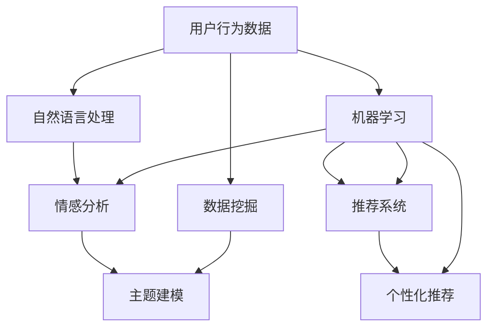

                 

# AI驱动的电商平台用户行为分析

> 关键词：用户行为分析, AI技术, 电商平台, 数据挖掘, 推荐系统, 个性化推荐, 机器学习

## 1. 背景介绍

在电商平台的激烈竞争中，用户行为分析成为了企业提升运营效率、优化用户体验、增加销售转化率的关键。通过深入分析用户的浏览、购买、评价等行为，电商平台能够更好地理解用户需求，精准推送商品，提供个性化服务。传统的用户行为分析依赖于统计学方法和手动规则，难以处理大规模数据，且难以实时更新。而随着人工智能技术的发展，AI驱动的用户行为分析成为新的热点。

AI技术在用户行为分析中的应用，主要集中在数据挖掘、机器学习、自然语言处理等领域。通过这些技术，电商平台能够自动化地从大量用户行为数据中提取有价值的信息，进行用户画像构建、行为预测、商品推荐等。本文将深入探讨AI在用户行为分析中的关键技术，并结合实际案例分析，提供详细的操作指南和代码实例，帮助读者更好地理解和应用这些技术。

## 2. 核心概念与联系

### 2.1 核心概念概述

为更好地理解AI驱动的电商平台用户行为分析，本节将介绍几个关键概念：

- **用户行为分析**：通过分析用户在电商平台上的行为数据，了解用户需求、兴趣和偏好，从而提升用户体验和业务收益。常见的行为包括浏览、点击、购买、评价、收藏等。

- **数据挖掘**：从大规模数据中自动发现有用信息和知识，包括关联规则挖掘、聚类分析、分类和回归分析等。数据挖掘技术在用户行为分析中，主要用于用户画像构建和行为预测。

- **推荐系统**：通过分析用户的历史行为和偏好，推荐个性化的商品和内容。推荐系统是用户行为分析的重要应用之一，能够显著提升用户体验和销售转化率。

- **机器学习**：利用算法模型对数据进行训练和学习，发现数据中的规律和模式。在用户行为分析中，机器学习主要用于用户行为预测、个性化推荐等。

- **自然语言处理**：分析和处理自然语言文本数据，提取用户评论、描述中的有用信息。自然语言处理技术在用户行为分析中，主要用于情感分析、主题建模等。

这些核心概念之间的逻辑关系可以通过以下Mermaid流程图来展示：



这个流程图展示了大规模电商平台用户行为分析的流程：

1. 首先从用户行为数据中挖掘出有用信息。
2. 利用机器学习算法进行用户行为预测和个性化推荐。
3. 结合自然语言处理技术，从用户评论中提取情感和主题信息。
4. 最终，推荐系统根据这些信息，为用户推荐个性化商品。

## 3. 核心算法原理 & 具体操作步骤

### 3.1 算法原理概述

AI驱动的电商平台用户行为分析，主要依赖于数据挖掘、机器学习、自然语言处理等技术。其核心思想是通过构建数据模型，从用户行为数据中挖掘出有价值的信息，预测用户行为，从而优化推荐系统，提供个性化服务。

形式化地，设电商平台用户行为数据集为 $D=\{(x_i,y_i)\}_{i=1}^N$，其中 $x_i$ 为用户行为特征，$y_i$ 为行为标签。目标是在数据集 $D$ 上，通过有监督学习训练一个预测模型 $M$，使得其能够根据新的用户行为数据 $x$，预测出对应的行为标签 $y$。常见的方法包括回归、分类、聚类等。

### 3.2 算法步骤详解

AI驱动的电商平台用户行为分析一般包括以下几个关键步骤：

**Step 1: 数据预处理**

- 收集电商平台上的用户行为数据，包括浏览、点击、购买、评价、收藏等行为记录。
- 数据清洗和去重，去除异常值和重复记录，确保数据质量。
- 数据标准化和归一化，处理缺失值，统一特征单位。

**Step 2: 特征工程**

- 对用户行为数据进行特征提取，生成有意义的特征向量 $x_i$。
- 利用降维技术（如主成分分析PCA、因子分析FA等）减少特征维度，提高模型效率。
- 对缺失值进行填补，避免数据稀疏对模型训练的影响。

**Step 3: 模型训练**

- 选择合适的机器学习算法（如逻辑回归、决策树、随机森林、神经网络等）。
- 划分数据集为训练集、验证集和测试集，采用交叉验证法进行模型调参。
- 使用优化算法（如梯度下降、随机梯度下降、Adam等）更新模型参数，最小化损失函数。

**Step 4: 模型评估**

- 在测试集上评估模型的性能，使用常见的指标（如准确率、召回率、F1-score等）评估模型效果。
- 对模型进行分析和调试，查找可能的性能瓶颈，优化模型结构。

**Step 5: 模型部署**

- 将训练好的模型部署到电商平台中，进行实时预测。
- 定期更新模型参数，以适应不断变化的业务需求和用户行为。

### 3.3 算法优缺点

AI驱动的电商平台用户行为分析具有以下优点：

1. **高效准确**：通过自动化分析大规模数据，发现用户行为模式和规律，预测准确率高。
2. **实时更新**：模型可以实时接收新的用户行为数据，进行快速更新，适应动态变化。
3. **可解释性**：通过特征选择和模型调参，可以清晰地理解模型的工作原理和决策依据。
4. **应用广泛**：可以应用于商品推荐、个性化定价、广告投放等多个业务场景，提升用户体验和业务收益。

同时，该方法也存在一些局限性：

1. **数据依赖性强**：模型效果依赖于数据质量和标注质量，数据缺失或不准确可能导致模型失效。
2. **模型复杂度高**：复杂的模型需要较高的计算资源和时间成本，训练和推理效率较低。
3. **过拟合风险**：在大规模数据集上训练的模型，可能对训练数据过度拟合，对新数据泛化能力较差。
4. **冷启动问题**：新用户或新商品在数据集中的历史行为数据较少，可能导致模型预测准确度降低。

尽管存在这些局限性，AI驱动的电商平台用户行为分析仍是一种高效、可靠的用户行为分析方法，广泛应用于电商平台中。

### 3.4 算法应用领域

AI驱动的电商平台用户行为分析，在多个业务场景中得到了广泛应用，包括但不限于：

- **个性化推荐**：根据用户历史行为数据，推荐个性化商品。
- **价格优化**：分析用户对价格的敏感度，进行个性化定价。
- **广告投放**：基于用户兴趣和行为，精准投放广告。
- **库存管理**：预测商品需求，优化库存管理。
- **用户画像**：构建用户画像，进行细分和精准营销。
- **异常检测**：检测用户异常行为，防范欺诈和风险。

以上应用场景展示了AI驱动的用户行为分析技术的强大功能，通过自动化、智能化的方式，大幅提升了电商平台的运营效率和用户体验。

## 4. 数学模型和公式 & 详细讲解 & 举例说明

### 4.1 数学模型构建

基于电商平台的推荐系统，我们可以采用协同过滤、基于内容的推荐、混合推荐等多种方法进行用户行为预测和个性化推荐。本文以协同过滤推荐系统为例，进行详细讲解。

设电商平台上有 $N$ 个用户和 $M$ 个商品，用户对商品的评分矩阵为 $R_{N\times M}$。协同过滤推荐系统的目标，是根据用户的历史评分数据，预测用户对未评分商品的评分，并推荐评分高的商品。

### 4.2 公式推导过程

设用户 $u$ 对商品 $i$ 的评分向量为 $r_u$，商品 $i$ 的评分向量为 $r_i$。协同过滤算法分为基于用户和基于商品两种方式：

**基于用户的方式**：计算用户 $u$ 与所有其他用户之间的相似度，通过加权平均得到用户 $u$ 对未评分商品的评分预测。

$$
\hat{r}_{ui} = \sum_{v=1}^N \alpha_{uv} r_{vi}
$$

其中 $\alpha_{uv}$ 为用户 $u$ 和用户 $v$ 之间的相似度，计算方法包括余弦相似度、皮尔逊相关系数等。

**基于商品的方式**：计算商品 $i$ 与所有其他商品之间的相似度，通过加权平均得到商品 $i$ 的评分预测。

$$
\hat{r}_{ui} = \sum_{j=1}^M \alpha_{ij} r_{uj}
$$

其中 $\alpha_{ij}$ 为商品 $i$ 和商品 $j$ 之间的相似度。

### 4.3 案例分析与讲解

以某电商平台的个性化推荐系统为例，展示AI驱动的用户行为分析的具体应用。

**数据来源**：某电商平台的过去一年中的用户行为数据，包括浏览、点击、购买、评价、收藏等行为记录。

**数据预处理**：清洗和去重数据，删除异常值，将用户行为数据转换为数值特征。

**特征工程**：提取用户的基本信息、行为时间戳、商品类别等特征，对缺失值进行填补。

**模型训练**：选择协同过滤算法，在训练集上进行模型训练，并通过交叉验证法调参。

**模型评估**：在测试集上评估模型性能，计算准确率、召回率、F1-score等指标。

**模型部署**：将训练好的模型部署到推荐系统中，进行实时预测和推荐。

**效果评估**：统计个性化推荐的点击率和转化率，评估模型对业务的影响。

## 5. 项目实践：代码实例和详细解释说明

### 5.1 开发环境搭建

在进行AI驱动的电商平台用户行为分析时，需要搭建相应的开发环境。以下是使用Python进行开发的环境配置流程：

1. 安装Anaconda：从官网下载并安装Anaconda，用于创建独立的Python环境。

2. 创建并激活虚拟环境：
```bash
conda create -n user_behavior_analysis python=3.8 
conda activate user_behavior_analysis
```

3. 安装必要的库：
```bash
conda install pandas numpy scikit-learn matplotlib seaborn
pip install lightfm
```

4. 设置Python环境变量：
```bash
export PYTHONPATH=$PYTHONPATH:$(pwd)/.
```

完成上述步骤后，即可在`user_behavior_analysis`环境中开始开发工作。

### 5.2 源代码详细实现

下面以协同过滤推荐系统为例，给出使用LightFM库进行用户行为分析的Python代码实现。

首先，准备数据集：

```python
import pandas as pd

# 加载用户行为数据
train_data = pd.read_csv('train.csv')
test_data = pd.read_csv('test.csv')

# 数据预处理
train_data = train_data.dropna()
test_data = test_data.dropna()

# 生成用户-商品评分矩阵
user_item_matrix = train_data.pivot_table(index='user_id', columns='item_id', values='rating')
```

然后，构建协同过滤模型：

```python
from lightfm.datasets import fetch_movielens
from lightfm import LightFM

# 加载电影评分数据
data = fetch_movielens()
user_item_matrix = pd.DataFrame(data['ratings'], columns=['user_id', 'item_id', 'rating'])

# 创建协同过滤模型
model = LightFM(no_components=50, learning_rate=0.05)

# 训练模型
model.fit(user_item_matrix)

# 测试模型
test_data = test_data.dropna()
test_predictions = model.predict(test_data)
```

最后，评估模型性能：

```python
from lightfm.evaluation import rmse, precision, recall

# 计算RMSE
rmse = rmse(test_predictions, user_item_matrix)

# 计算精度和召回率
precision = precision(test_predictions, user_item_matrix)
recall = recall(test_predictions, user_item_matrix)

# 输出结果
print('RMSE:', rmse)
print('Precision:', precision)
print('Recall:', recall)
```

以上代码实现了基于协同过滤的推荐系统，通过用户行为数据训练模型，并进行推荐评分预测。

### 5.3 代码解读与分析

让我们再详细解读一下关键代码的实现细节：

**train_data和test_data**：
- `train_data`和`test_data`分别代表训练集和测试集，包含用户ID、商品ID和评分等字段。
- 使用`pandas`库读取和预处理数据，删除缺失值，生成用户-商品评分矩阵。

**LightFM模型**：
- 使用`lightfm`库创建协同过滤模型，设置组件数和学习率等参数。
- `fit`方法用于训练模型，输入用户-商品评分矩阵。
- `predict`方法用于对测试集进行评分预测。

**模型评估**：
- 使用`rmse`方法计算推荐评分的均方根误差（RMSE）。
- 使用`precision`和`recall`方法计算推荐评分的精度和召回率。
- 输出模型在测试集上的RMSE、精度和召回率，评估模型性能。

## 6. 实际应用场景

### 6.1 个性化推荐

个性化推荐是AI驱动的电商平台用户行为分析的核心应用之一。通过分析用户的历史行为数据，为用户推荐可能感兴趣的商品，显著提升用户体验和销售转化率。

**案例分析**：某电商平台希望通过推荐系统提升商品销量。首先，收集用户浏览、点击、购买、评价、收藏等行为数据。然后，利用AI技术构建推荐模型，根据用户行为预测其可能感兴趣的商品，生成推荐列表。最后，根据用户反馈，持续优化推荐算法，提升推荐效果。

**效果评估**：统计推荐商品的点击率和转化率，评估推荐系统对业务的影响。

### 6.2 价格优化

价格优化也是电商平台的重要应用场景之一。通过分析用户对不同价格敏感度的行为数据，制定个性化定价策略，能够显著提升销售收益。

**案例分析**：某电商平台希望通过价格优化提高销售额。首先，收集用户购买商品的历史价格和销量数据。然后，利用AI技术分析价格与销量之间的关系，构建价格优化模型。最后，根据模型预测，对不同用户和商品进行个性化定价。

**效果评估**：统计不同价格策略下的销量和收入数据，评估价格优化的效果。

### 6.3 广告投放

广告投放是电商平台的另一个重要应用场景。通过分析用户行为数据，精准投放广告，能够显著提升广告的点击率和转化率，降低广告成本。

**案例分析**：某电商平台希望通过精准广告投放提高广告效果。首先，收集用户浏览和点击广告的行为数据。然后，利用AI技术分析用户兴趣和行为，构建广告投放模型。最后，根据模型预测，对不同用户进行广告投放。

**效果评估**：统计广告的点击率和转化率，评估广告投放的效果。

## 7. 工具和资源推荐

### 7.1 学习资源推荐

为了帮助开发者系统掌握AI驱动的电商平台用户行为分析的理论基础和实践技巧，这里推荐一些优质的学习资源：

1. 《推荐系统：基础与算法》书籍：由推荐系统专家编写，系统讲解了推荐系统的原理和算法，包括协同过滤、基于内容的推荐等。

2. 《Python数据科学手册》书籍：由知名数据科学家编写，详细介绍了Python在数据分析、机器学习中的应用，包括Pandas、Scikit-Learn等库的使用。

3. Kaggle平台：Kaggle是一个数据科学竞赛平台，提供了丰富的电商用户行为数据集和推荐系统竞赛，帮助开发者提升技能。

4. Coursera和edX平台：提供多门推荐系统相关的在线课程，包括机器学习、数据挖掘等基础知识和前沿算法。

5. UCI机器学习库：UCI是一个公开机器学习数据集库，包含大量电商用户行为数据集，用于数据挖掘和模型训练。

通过对这些资源的学习实践，相信你一定能够快速掌握AI驱动的用户行为分析技术的精髓，并用于解决实际的电商问题。

### 7.2 开发工具推荐

高效的开发离不开优秀的工具支持。以下是几款用于AI驱动的用户行为分析开发的常用工具：

1. Jupyter Notebook：Jupyter Notebook是一个交互式开发环境，支持Python、R等语言，方便代码调试和文档记录。

2. VS Code：VS Code是一个跨平台的开发工具，支持代码自动补全、调试、版本控制等功能。

3. LightFM：LightFM是一个高效、易用的推荐系统库，支持协同过滤、矩阵分解等算法，适用于电商用户行为分析。

4. Apache Spark：Apache Spark是一个快速的大数据处理框架，支持分布式计算，适用于大规模数据集处理。

5. TensorBoard：TensorBoard是TensorFlow配套的可视化工具，用于实时监测模型训练状态，提供详细的图表和指标。

6. Weights & Biases：Weights & Biases是一个模型训练的实验跟踪工具，记录和可视化模型训练过程中的各项指标，方便对比和调优。

合理利用这些工具，可以显著提升AI驱动的用户行为分析任务的开发效率，加快创新迭代的步伐。

### 7.3 相关论文推荐

AI驱动的电商平台用户行为分析在学术界和工业界都得到了广泛的研究。以下是几篇奠基性的相关论文，推荐阅读：

1. 《推荐系统：协同过滤方法》论文：阐述了协同过滤推荐算法的原理和应用，包括基于用户的协同过滤和基于商品的协同过滤。

2. 《电商推荐系统：用户画像与行为分析》论文：详细介绍了电商推荐系统中的用户画像构建和行为分析方法，以及如何利用用户画像提升推荐效果。

3. 《深度学习在推荐系统中的应用》论文：探讨了深度学习在推荐系统中的应用，包括神经网络、注意力机制等方法。

4. 《自然语言处理在电商平台用户行为分析中的应用》论文：介绍了自然语言处理技术在电商平台用户行为分析中的应用，包括情感分析、主题建模等。

这些论文代表了大规模电商平台用户行为分析的研究脉络，通过学习这些前沿成果，可以帮助研究者把握学科前进方向，激发更多的创新灵感。

## 8. 总结：未来发展趋势与挑战

### 8.1 总结

本文对AI驱动的电商平台用户行为分析进行了全面系统的介绍。首先阐述了用户行为分析在电商平台中的重要性，明确了AI技术在用户行为分析中的关键作用。其次，从原理到实践，详细讲解了协同过滤推荐系统的算法原理和具体操作步骤，给出了代码实例和详细解释。同时，本文还广泛探讨了AI技术在个性化推荐、价格优化、广告投放等多个业务场景中的应用，展示了AI驱动的用户行为分析技术的强大功能。

通过本文的系统梳理，可以看到，AI驱动的电商平台用户行为分析技术在提升用户体验和业务收益方面具有显著优势。未来，伴随AI技术的发展，用户行为分析将进一步智能化、自动化，大幅提升电商平台的运营效率和竞争力。

### 8.2 未来发展趋势

展望未来，AI驱动的电商平台用户行为分析技术将呈现以下几个发展趋势：

1. **智能推荐系统**：通过引入深度学习、自然语言处理等技术，推荐系统将更加智能和个性化，能够动态调整推荐策略，适应用户需求变化。

2. **多模态融合**：结合图像、视频、语音等多模态数据，进行用户行为分析，提升推荐系统的精度和用户体验。

3. **实时计算**：利用流计算和分布式计算技术，实时处理用户行为数据，实现实时推荐。

4. **跨平台协同**：整合不同平台的用户行为数据，进行联合推荐和优化，提升整体推荐效果。

5. **元学习**：引入元学习技术，让推荐系统具备动态更新和快速适应的能力，应对新商品和新用户。

6. **深度个性化**：利用用户行为数据进行深度学习，构建更加精细的用户画像，提供更精准的推荐服务。

以上趋势凸显了AI驱动的用户行为分析技术的广阔前景。这些方向的探索发展，必将进一步提升电商平台的运营效率和用户体验，推动电商平台向更高层次发展。

### 8.3 面临的挑战

尽管AI驱动的电商平台用户行为分析技术已经取得了显著成效，但在迈向更加智能化、普适化应用的过程中，它仍面临着诸多挑战：

1. **数据隐私和安全**：电商平台需要收集大量的用户行为数据，涉及用户隐私和数据安全问题。如何在保障用户隐私的同时，获取有用的数据，是一个重要的挑战。

2. **算法复杂度**：复杂的推荐算法需要较高的计算资源和时间成本，如何在降低计算复杂度的同时，提高推荐效果，是一个亟待解决的问题。

3. **冷启动问题**：新用户或新商品在数据集中的历史行为数据较少，可能导致模型预测准确度降低。如何处理冷启动问题，是一个重要的研究方向。

4. **推荐系统公平性**：推荐系统可能存在偏见，导致某些用户或商品被忽视。如何设计公平的推荐算法，避免推荐偏差，是一个重要的问题。

5. **跨平台一致性**：不同平台的用户行为数据格式和来源不同，如何整合数据进行跨平台协同推荐，是一个重要的挑战。

6. **人机交互**：推荐系统的输出需要考虑用户反馈，进行动态调整。如何设计人机交互界面，提升用户体验，是一个重要的问题。

面对这些挑战，未来的研究需要在数据隐私、算法效率、冷启动问题、公平性等多个方面寻求新的突破，以进一步提升推荐系统的精度和用户体验。

### 8.4 研究展望

未来，在AI驱动的电商平台用户行为分析领域，还需要进行更多前沿研究，以推动技术的进步和发展：

1. **多模态推荐系统**：结合图像、视频、语音等多模态数据，进行更加全面和准确的用户行为分析，提升推荐系统的精度和用户体验。

2. **深度学习在推荐系统中的应用**：引入深度学习、神经网络等技术，提升推荐系统的智能性和个性化程度。

3. **元学习在推荐系统中的应用**：引入元学习技术，让推荐系统具备动态更新和快速适应的能力，应对新商品和新用户。

4. **跨平台协同推荐**：整合不同平台的用户行为数据，进行联合推荐和优化，提升整体推荐效果。

5. **推荐系统公平性**：设计公平的推荐算法，避免推荐偏差，提高推荐系统的公平性和可信度。

6. **人机交互界面**：设计直观、易用的推荐界面，提升用户体验，进行动态调整。

通过这些研究方向的探索，相信AI驱动的电商平台用户行为分析技术将更加智能化、自动化，为电商平台提供更加精准、高效的个性化推荐服务，推动电商平台向更高层次发展。

## 9. 附录：常见问题与解答

**Q1：电商平台的用户行为数据包括哪些内容？**

A: 电商平台的用户行为数据包括用户的浏览、点击、购买、评价、收藏等行为记录。具体内容如下：

- 浏览记录：用户访问商品详情页、浏览商品分类页、浏览其他用户评价等信息。
- 点击记录：用户点击商品详情页、点击商品分类页、点击广告等操作。
- 购买记录：用户下单、支付、收货等操作。
- 评价记录：用户对商品进行评价、评分等操作。
- 收藏记录：用户将商品加入购物车、收藏商品等操作。

这些数据反映了用户对商品的全方位行为，是进行用户行为分析的重要依据。

**Q2：如何处理用户行为数据中的缺失值？**

A: 用户行为数据中常常存在缺失值，需要通过数据清洗和补缺操作进行处理。常用的方法包括：

1. 删除缺失值：删除包含缺失值的数据记录，但会减少数据量，影响模型效果。
2. 均值或中值填充：用均值或中值替代缺失值，简单易行但可能引入偏差。
3. 插值法：利用前后数据进行插值，估算缺失值，但需要假设数据分布连续。
4. 模型预测：利用其他特征建立模型，预测缺失值，效果最好但计算复杂度较高。

需要根据具体场景选择合适的方法，进行缺失值处理。

**Q3：协同过滤推荐系统有哪些类型？**

A: 协同过滤推荐系统分为基于用户和基于商品两种类型：

1. 基于用户的协同过滤：根据用户的历史评分数据，预测用户对未评分商品的评分，生成推荐列表。
2. 基于商品的协同过滤：根据商品的历史评分数据，预测商品对未评分用户的评分，生成推荐列表。

两种方法各有优缺点，需要根据具体场景选择合适的方法。

**Q4：如何设计用户画像？**

A: 用户画像是指通过对用户行为数据的分析，构建用户兴趣和行为的详细描述。设计用户画像的步骤如下：

1. 收集用户行为数据：收集用户浏览、点击、购买、评价、收藏等行为数据。
2. 特征提取：提取用户基本信息、行为时间戳、商品类别等特征，生成特征向量。
3. 聚类分析：利用聚类算法对用户进行分类，划分出不同兴趣群体。
4. 深度学习：利用深度学习模型对用户行为数据进行建模，生成更加精细的用户画像。

用户画像设计需要结合具体业务需求，进行有针对性的分析和建模。

**Q5：如何评估推荐系统的性能？**

A: 推荐系统的性能评估需要考虑多个指标，常见的指标包括：

1. 均方根误差（RMSE）：评估推荐评分的准确度。
2. 准确率（Precision）：评估推荐结果中用户感兴趣商品的比例。
3. 召回率（Recall）：评估推荐结果中实际商品被覆盖的比例。
4. F1-score：综合评估准确率和召回率，平衡推荐效果。

需要根据具体业务需求选择合适的方法进行评估。

---

作者：禅与计算机程序设计艺术 / Zen and the Art of Computer Programming

