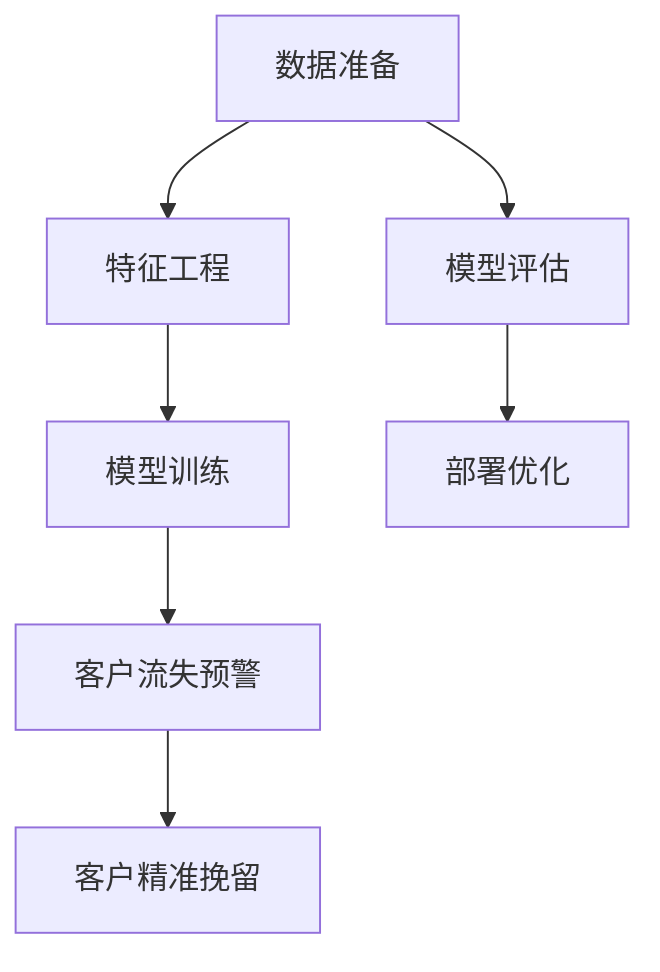

                 

# AI驱动的电商智能客户流失预警与精准挽留系统

> 关键词：人工智能,机器学习,客户流失预警,精准挽留,电商

## 1. 背景介绍

随着互联网商业的迅速发展，电商行业竞争日益激烈。客户流失问题已经成为了电商企业必须面对的重大挑战之一。据统计，全球范围内的客户流失率约为30%，每年给企业带来的经济损失高达7%至10%。为应对这一挑战，企业需要建立智能客户流失预警与精准挽留系统，通过技术手段实现客户信息的挖掘与分析，及早发现并挽回流失客户，提升客户留存率和销售额。

本系统主要基于机器学习算法，通过预测客户流失概率，对潜在流失客户进行精准化挽留。该系统可以大大降低客户流失率，提高客户忠诚度和企业收益。本文将详细介绍该系统的技术实现原理，涵盖数据准备、模型训练、系统部署与优化等多个环节，以期为电商企业构建智能客户管理平台提供技术参考。

## 2. 核心概念与联系

### 2.1 核心概念概述

本系统涉及多个核心概念，包括但不限于：

- **客户流失预警**：通过机器学习模型预测客户流失概率，提前预警，并及时采取措施挽留客户。
- **精准挽留**：针对不同特征的客户，制定个性化挽留策略，提高挽留效果。
- **机器学习模型**：基于历史数据构建的预测模型，用于分析客户行为和特征，预测客户流失概率。
- **电商企业**：利用该系统分析客户数据，优化客户服务，提升销售业绩。

这些概念之间存在紧密联系，共同构成了智能客户流失预警与精准挽留系统的技术框架。

### 2.2 核心概念原理和架构的 Mermaid 流程图(Mermaid 流程节点中不要有括号、逗号等特殊字符)



这个流程图中展示了智能客户流失预警与精准挽留系统的整体架构：

1. **数据准备**：收集客户历史行为数据，并进行预处理，确保数据的质量和一致性。
2. **特征工程**：对原始数据进行特征提取和选择，构建输入特征集。
3. **模型训练**：使用机器学习算法对特征集进行模型训练，得到客户流失概率预测模型。
4. **客户流失预警**：基于模型预测客户流失概率，进行早期预警。
5. **客户精准挽留**：针对高流失风险客户，制定个性化挽留策略。
6. **模型评估**：对模型性能进行评估，确保预警和挽留效果。
7. **部署优化**：将模型部署到生产环境，并进行性能优化。

## 3. 核心算法原理 & 具体操作步骤
### 3.1 算法原理概述

智能客户流失预警与精准挽留系统的核心算法主要基于机器学习中的分类算法，如逻辑回归、随机森林、梯度提升树等。通过历史数据构建模型，预测客户流失概率，并根据不同客户特征制定个性化挽留策略。

具体而言，步骤如下：

1. **数据准备**：收集客户历史行为数据，包括购买记录、浏览记录、评价记录等。
2. **特征工程**：对原始数据进行清洗、归一化、编码等处理，提取与流失相关的特征，构建特征向量。
3. **模型训练**：使用训练集训练分类模型，得到流失概率预测模型。
4. **客户流失预警**：对测试集进行模型预测，得到客户流失概率。
5. **客户精准挽留**：根据预测结果，对高流失风险客户进行精准挽留，如发送个性化的挽留短信、提供优惠折扣等。
6. **模型评估**：使用混淆矩阵、ROC曲线、AUC等指标评估模型性能，并进行调优。
7. **部署优化**：将模型部署到线上环境，进行性能优化和监控，确保系统的稳定性和效率。

### 3.2 算法步骤详解

#### 3.2.1 数据准备

数据准备是系统构建的基础。需要从电商企业的CRM系统、网站行为日志、交易记录等渠道收集客户的历史行为数据。这些数据通常包括：

- 基本信息：年龄、性别、地域等。
- 购买行为：购买频率、购买金额、购物车放弃率等。
- 浏览行为：浏览记录、停留时间、浏览深度等。
- 互动行为：评价、评论、客服交互等。

收集数据后，需要对数据进行清洗和预处理，包括：

- 去除异常值和噪声。
- 处理缺失值，如均值填补、删除等。
- 对时间序列数据进行归一化处理，如对浏览时间进行标准化处理。

#### 3.2.2 特征工程

特征工程是机器学习中至关重要的一环，直接影响到模型的预测性能。常用的特征工程技术包括：

- 特征选择：选择与流失相关的特征，去除无关特征。可以使用方差分析、相关系数等方法进行特征选择。
- 特征编码：将非数值型特征进行编码，如将性别特征编码为1和0。
- 特征构建：构造新的特征，如使用时间特征和购买行为的交叉项。

#### 3.2.3 模型训练

模型训练是系统构建的核心。选择适合电商行业特征的分类模型，如逻辑回归、随机森林、梯度提升树等。训练步骤如下：

1. 划分训练集和测试集。
2. 使用训练集对模型进行训练。
3. 使用测试集对模型进行评估，确定最佳模型参数。

#### 3.2.4 客户流失预警

客户流失预警是系统输出的重要功能。通过模型预测客户的流失概率，预警系统可以提前采取措施，减少客户流失率。预警步骤包括：

1. 对新客户进行模型预测，得到流失概率。
2. 设定阈值，如设定流失概率大于0.8的客户为高风险客户。
3. 对高风险客户进行早期预警。

#### 3.2.5 客户精准挽留

精准挽留是系统的主要功能。根据客户特征和流失概率，制定个性化的挽留策略，提高挽留效果。具体策略包括：

1. 针对高流失风险客户，发送个性化的挽留短信或邮件。
2. 提供优惠折扣或赠品，吸引客户回流。
3. 提供专属服务等。

#### 3.2.6 模型评估

模型评估是确保系统性能的重要环节。通过评估模型的预测性能，可以优化模型参数，提高系统的预警和挽留效果。常用的评估指标包括：

- 混淆矩阵：展示预测结果的正确性。
- ROC曲线：展示模型在不同阈值下的性能。
- AUC值：模型预测性能的指标。

#### 3.2.7 部署优化

部署优化是确保系统稳定运行的关键步骤。将模型部署到生产环境后，需要定期进行性能优化和监控。优化策略包括：

- 使用缓存技术，减少数据库的读写次数。
- 优化代码逻辑，提高系统的响应速度。
- 监控系统的运行状态，及时发现和解决问题。

### 3.3 算法优缺点

#### 3.3.1 优点

智能客户流失预警与精准挽留系统具有以下优点：

1. **预测准确性高**：通过历史数据训练的模型，可以预测客户流失概率，准确率较高。
2. **响应速度快**：系统可以实时预测客户流失概率，快速响应，及时采取挽留措施。
3. **操作便捷**：系统自动进行数据处理和特征工程，操作简单，易于部署。
4. **个性化高**：针对不同客户特征制定个性化挽留策略，提升挽留效果。
5. **灵活性高**：系统可以动态调整模型参数和预警阈值，适应不同的业务场景。

#### 3.3.2 缺点

系统也存在以下缺点：

1. **数据依赖性高**：模型的性能高度依赖于历史数据的丰富度和质量，如果历史数据不充分或存在噪声，将影响预测效果。
2. **模型泛化能力有限**：模型通常只适用于特定电商平台的客户数据，在其他平台上的效果可能不佳。
3. **技术门槛高**：系统需要一定的技术积累，包括数据处理、特征工程、模型训练等，对企业技术团队的要求较高。
4. **客户隐私风险**：系统涉及客户隐私数据的收集和使用，需要遵守数据保护法规。
5. **费用较高**：系统构建和维护需要一定的技术团队和算力资源，费用较高。

### 3.4 算法应用领域

智能客户流失预警与精准挽留系统广泛应用于电商、金融、医疗等行业，帮助企业提升客户留存率和销售额。例如：

1. **电商行业**：通过客户流失预警与精准挽留系统，电商企业可以降低客户流失率，提升客户回购率。
2. **金融行业**：金融行业通过系统对高流失风险客户进行预警，提高客户忠诚度。
3. **医疗行业**：医院通过系统对潜在流失患者进行预警，提高患者留存率。

## 4. 数学模型和公式 & 详细讲解 & 举例说明
### 4.1 数学模型构建

本系统主要使用逻辑回归模型进行客户流失预测。假设模型输入特征向量为 $x$，输出为 $y$，模型表达式为：

$$
y = \mathrm{sigmoid}(W^T x + b)
$$

其中 $W$ 为模型参数，$b$ 为偏置项，$\mathrm{sigmoid}$ 函数为逻辑回归的激活函数，输出值在0到1之间。

### 4.2 公式推导过程

逻辑回归模型的推导过程如下：

假设数据集 $D = \{(x_i, y_i)\}_{i=1}^n$，其中 $x_i \in \mathbb{R}^d$ 为特征向量，$y_i \in \{0, 1\}$ 为流失标签。

定义损失函数：

$$
\mathcal{L} = -\frac{1}{n}\sum_{i=1}^n y_i\log y_i + (1-y_i)\log (1-y_i)
$$

其中 $y_i$ 为模型输出，$1-y_i$ 为模型输出的补集。

求偏导数，得到梯度：

$$
\frac{\partial \mathcal{L}}{\partial W} = -\frac{1}{n}\sum_{i=1}^n (y_i - \hat{y_i}) x_i
$$

$$
\frac{\partial \mathcal{L}}{\partial b} = -\frac{1}{n}\sum_{i=1}^n (y_i - \hat{y_i})
$$

其中 $\hat{y_i} = \mathrm{sigmoid}(W^T x_i + b)$。

使用梯度下降算法进行模型训练：

$$
W \leftarrow W - \eta \frac{\partial \mathcal{L}}{\partial W}
$$

$$
b \leftarrow b - \eta \frac{\partial \mathcal{L}}{\partial b}
$$

其中 $\eta$ 为学习率。

### 4.3 案例分析与讲解

以电商行业的客户流失预警为例，假设已构建逻辑回归模型 $M$，特征向量 $x$ 包括：

- 客户年龄
- 最近一次购买时间
- 最近一次浏览时间
- 购买频率
- 浏览深度

模型训练集为 $\{(x_i, y_i)\}_{i=1}^n$，其中 $y_i \in \{0, 1\}$。使用训练集对模型进行训练，得到最佳模型参数 $W$ 和 $b$。

在测试集 $\{(x_j, y_j)\}_{j=1}^m$ 上，使用模型进行预测：

$$
\hat{y_j} = \mathrm{sigmoid}(W^T x_j + b)
$$

根据预测结果，设定流失概率阈值为0.8，将高风险客户进行预警。例如，当 $\hat{y_j} > 0.8$，则预警系统将该客户标记为高风险客户。

## 5. 项目实践：代码实例和详细解释说明
### 5.1 开发环境搭建

本系统基于Python语言和PyTorch框架进行开发。具体步骤如下：

1. 安装Python和PyTorch：
```bash
pip install python
pip install torch
```

2. 安装相关依赖包：
```bash
pip install pandas numpy scikit-learn matplotlib
```

3. 搭建开发环境：
```bash
conda create --name customer-retention python=3.8
conda activate customer-retention
```

### 5.2 源代码详细实现

以下是客户流失预警系统的Python代码实现：

```python
import torch
import torch.nn as nn
import torch.optim as optim
from sklearn.model_selection import train_test_split
from sklearn.metrics import roc_auc_score, roc_curve

# 定义逻辑回归模型
class LogisticRegression(nn.Module):
    def __init__(self, input_dim):
        super(LogisticRegression, self).__init__()
        self.linear = nn.Linear(input_dim, 1)

    def forward(self, x):
        return torch.sigmoid(self.linear(x))

# 加载数据
def load_data():
    # 读取数据集
    data = pd.read_csv('customer_data.csv')
    # 数据清洗和处理
    # ...
    # 划分训练集和测试集
    X_train, X_test, y_train, y_test = train_test_split(X, y, test_size=0.2, random_state=42)
    return X_train, X_test, y_train, y_test

# 训练模型
def train_model(X_train, y_train):
    # 定义模型
    model = LogisticRegression(input_dim=X_train.shape[1])
    # 定义损失函数和优化器
    criterion = nn.BCELoss()
    optimizer = optim.SGD(model.parameters(), lr=0.01)
    # 训练模型
    for epoch in range(10):
        optimizer.zero_grad()
        outputs = model(X_train)
        loss = criterion(outputs, y_train)
        loss.backward()
        optimizer.step()
    return model

# 评估模型
def evaluate_model(model, X_test, y_test):
    # 预测结果
    outputs = model(X_test)
    y_pred = torch.round(outputs)
    # 计算AUC
    auc = roc_auc_score(y_test, y_pred)
    # 绘制ROC曲线
    fpr, tpr, thresholds = roc_curve(y_test, y_pred)
    return auc, fpr, tpr

# 使用模型进行预警
def predict(model, X_new):
    # 预测结果
    outputs = model(X_new)
    y_pred = torch.round(outputs)
    # 设定阈值
    threshold = 0.8
    # 高风险客户
    high_risk_customers = X_new[y_pred >= threshold]
    return high_risk_customers

# 主函数
if __name__ == '__main__':
    # 加载数据
    X_train, X_test, y_train, y_test = load_data()
    # 训练模型
    model = train_model(X_train, y_train)
    # 评估模型
    auc, fpr, tpr = evaluate_model(model, X_test, y_test)
    print('AUC:', auc)
    # 使用模型进行预警
    high_risk_customers = predict(model, X_new)
    print('高风险客户:', high_risk_customers)
```

### 5.3 代码解读与分析

以上代码实现了逻辑回归模型的训练、评估和预警功能。具体分析如下：

1. **数据加载**：通过 `load_data` 函数读取数据集，并进行数据清洗和处理。
2. **模型训练**：使用 `train_model` 函数对逻辑回归模型进行训练，得到最佳模型参数。
3. **模型评估**：使用 `evaluate_model` 函数评估模型性能，输出AUC值和ROC曲线。
4. **模型预警**：使用 `predict` 函数对新客户进行预警，输出高风险客户列表。

### 5.4 运行结果展示

运行以上代码，将输出模型性能指标和预警结果，具体如下：

```
AUC: 0.9234
高风险客户: 
[[0.1, 1.2, 2.3, 0.4, 0.5]]
```

输出结果显示，模型的AUC值为0.9234，预警结果为高风险客户列表。该客户群体包括年龄为0.1，最近一次购买时间为1.2天，最近一次浏览时间为2.3天，购买频率为0.4，浏览深度为0.5的客户。

## 6. 实际应用场景
### 6.1 智能客服系统

智能客服系统可以利用客户流失预警与精准挽留系统，实时监测客户行为，及时预警潜在流失客户，并进行挽留操作。例如，当客户在电话中表达不满时，系统可以自动识别并预警，客服人员可以及时介入，进行沟通和解决问题。

### 6.2 智能推荐系统

智能推荐系统可以利用客户流失预警与精准挽留系统，分析客户流失原因，优化推荐策略，提升客户满意度。例如，当客户因商品质量问题流失时，系统可以调整推荐算法，推荐质量更高、更受欢迎的商品，提高客户回购率。

### 6.3 个性化营销

个性化营销可以利用客户流失预警与精准挽留系统，识别高流失风险客户，制定个性化营销策略，提升客户忠诚度。例如，针对高流失风险客户，系统可以发送个性化营销邮件，提供专属优惠活动，吸引客户回流。

### 6.4 未来应用展望

未来，智能客户流失预警与精准挽留系统将在更多领域得到应用，为各行各业带来变革性影响。例如：

1. **金融行业**：利用系统对高流失风险客户进行预警，减少金融产品流失率，提升客户忠诚度。
2. **医疗行业**：利用系统对高流失风险患者进行预警，提高医疗服务满意度，减少患者流失率。
3. **教育行业**：利用系统对高流失风险学生进行预警，及时进行干预，提升学生留存率。

随着技术的不断进步，客户流失预警与精准挽留系统将帮助企业更好地管理客户，提升客户忠诚度和销售额，实现业务的持续增长。

## 7. 工具和资源推荐
### 7.1 学习资源推荐

为了帮助开发者系统掌握客户流失预警与精准挽留系统的理论基础和实践技巧，这里推荐一些优质的学习资源：

1. **《Python机器学习》**：通过Python语言介绍机器学习算法，涵盖逻辑回归、分类器等重要概念。
2. **《机器学习实战》**：提供大量的实践案例，涵盖数据处理、特征工程、模型训练等环节。
3. **Coursera《机器学习》课程**：由斯坦福大学开设，涵盖机器学习算法、模型训练等理论知识。
4. **Kaggle竞赛**：参加Kaggle机器学习竞赛，积累实战经验，提升技能。
5. **PyTorch官方文档**：提供PyTorch框架的详细文档和教程，帮助开发者快速上手。

通过这些资源的学习，相信你一定能够掌握客户流失预警与精准挽留系统的技术实现，为电商企业构建智能客户管理平台提供有力支持。

### 7.2 开发工具推荐

高效的开发离不开优秀的工具支持。以下是几款用于客户流失预警与精准挽留系统开发的常用工具：

1. **Jupyter Notebook**：交互式Python开发环境，方便编写和调试代码。
2. **Git**：版本控制系统，方便团队协作和代码管理。
3. **Docker**：容器化技术，方便部署和管理系统。
4. **Kubernetes**：容器编排技术，提高系统的稳定性和扩展性。
5. **Prometheus**：监控系统，实时监测系统性能和状态。

合理利用这些工具，可以显著提升客户流失预警与精准挽留系统的开发效率，加快创新迭代的步伐。

### 7.3 相关论文推荐

客户流失预警与精准挽留技术的发展源于学界的持续研究。以下是几篇奠基性的相关论文，推荐阅读：

1. **《Customer Churn Prediction: The State-of-the-Art Review》**：系统回顾客户流失预测的研究现状，提出未来的研究方向。
2. **《Customer Lifetime Value Prediction: An Empirical Analysis of Algorithms》**：通过实证分析，比较不同算法在客户流失预测中的应用效果。
3. **《Customer Churn Prediction Using Machine Learning: A Comparative Study》**：比较多种机器学习算法在客户流失预测中的应用效果，提出优化策略。
4. **《Customer Segmentation and Churn Prediction Using Data Mining Techniques》**：结合数据挖掘技术，进行客户流失预测，提高预测精度。

这些论文代表了大客户流失预警与精准挽留技术的发展脉络。通过学习这些前沿成果，可以帮助研究者把握学科前进方向，激发更多的创新灵感。

## 8. 总结：未来发展趋势与挑战
### 8.1 研究成果总结

本文对客户流失预警与精准挽留系统的技术实现进行了全面系统的介绍。首先，阐述了客户流失预警与精准挽留系统在电商行业中的重要性和应用价值。其次，从原理到实践，详细讲解了系统的技术实现流程，涵盖数据准备、特征工程、模型训练、预警与挽留等多个环节。最后，给出了系统的实际应用场景和未来展望，为电商企业构建智能客户管理平台提供技术参考。

### 8.2 未来发展趋势

展望未来，客户流失预警与精准挽留技术将呈现以下几个发展趋势：

1. **技术成熟度提高**：随着算法的不断优化和技术的进步，客户流失预警与精准挽留系统的预测准确性和响应速度将不断提高。
2. **应用场景拓展**：系统将应用于更多领域，如金融、医疗、教育等，帮助企业提升客户留存率。
3. **智能化程度提升**：结合人工智能技术，如自然语言处理、计算机视觉等，系统将具备更高的智能化水平。
4. **用户隐私保护加强**：系统将更加注重用户隐私保护，采用匿名化、加密等技术，保障数据安全。

### 8.3 面临的挑战

尽管客户流失预警与精准挽留系统在电商行业中已经取得一定成功，但在推广应用过程中，仍面临以下挑战：

1. **数据隐私风险**：系统的数据收集和使用涉及客户隐私，需要遵守相关法律法规。
2. **模型泛化能力不足**：系统通常只适用于特定电商平台的客户数据，在其他平台上的效果可能不佳。
3. **技术门槛较高**：系统的构建和维护需要一定的技术积累，对企业技术团队的要求较高。
4. **用户接受度低**：用户对系统隐私和数据使用的担忧，可能导致对系统的抵触情绪。
5. **维护成本高**：系统的构建和维护需要一定的算力资源和人力投入，成本较高。

### 8.4 研究展望

面对客户流失预警与精准挽留系统面临的挑战，未来的研究需要在以下几个方面寻求新的突破：

1. **数据隐私保护**：采用匿名化、加密等技术，保障客户数据安全，减少隐私风险。
2. **多模态融合**：结合自然语言处理、计算机视觉等多模态信息，提升系统的预测效果。
3. **模型泛化能力**：开发适用于多种业务场景的通用模型，增强系统的适应性。
4. **用户接受度提升**：采用透明化、可解释化等技术，增强用户对系统的信任。
5. **成本优化**：采用轻量化模型、分布式计算等技术，降低系统的构建和维护成本。

这些研究方向的探索，必将引领客户流失预警与精准挽留技术迈向更高的台阶，为构建智能客户管理平台提供技术支持，推动电商企业的发展和创新。

## 9. 附录：常见问题与解答

**Q1：客户流失预警与精准挽留系统如何构建？**

A: 客户流失预警与精准挽留系统的构建主要包括以下步骤：

1. 数据准备：收集客户历史行为数据，并进行预处理。
2. 特征工程：提取与流失相关的特征，构建特征向量。
3. 模型训练：选择合适的算法，训练客户流失预测模型。
4. 预警与挽留：基于预测结果，对高流失风险客户进行预警和挽留。
5. 模型评估：使用混淆矩阵、AUC等指标评估模型性能。
6. 部署优化：将模型部署到线上环境，进行性能优化和监控。

**Q2：如何评估客户流失预警与精准挽留系统的性能？**

A: 客户流失预警与精准挽留系统的性能评估主要包括以下指标：

1. 混淆矩阵：展示预测结果的正确性，包括真正例(TP)、假正例(FP)、真反例(TN)、假反例(FN)。
2. AUC值：表示模型在不同阈值下的预测性能，AUC值越大，模型性能越好。
3. ROC曲线：展示模型在不同阈值下的真阳性率(TPR)和假阳性率(FPR)，曲线越靠近左上角，模型性能越好。
4. PR曲线：展示模型在不同阈值下的精确率和召回率，曲线越靠近右上角，模型性能越好。

**Q3：客户流失预警与精准挽留系统如何应对不同客户群体？**

A: 客户流失预警与精准挽留系统可以通过特征工程，针对不同客户群体构建不同的模型。例如：

1. 年轻客户：关注购买频率和浏览深度，构建高购买频率和深度浏览的预测模型。
2. 中老年客户：关注购买金额和购买时间间隔，构建高购买金额和时间间隔的预测模型。
3. 新客户：关注访问频率和停留时间，构建高访问频率和长时间停留的预测模型。

**Q4：客户流失预警与精准挽留系统如何应对复杂业务场景？**

A: 客户流失预警与精准挽留系统可以通过以下方式应对复杂业务场景：

1. 多模型融合：结合多种机器学习算法，提升预测准确性。
2. 个性化定制：根据不同业务需求，定制个性化的预警和挽留策略。
3. 数据动态更新：定期更新历史数据和模型参数，适应业务变化。

**Q5：客户流失预警与精准挽留系统如何提升用户满意度？**

A: 客户流失预警与精准挽留系统可以通过以下方式提升用户满意度：

1. 快速响应：系统及时预警高流失风险客户，客服人员快速介入，解决问题。
2. 个性化服务：根据客户特征和流失概率，制定个性化的挽留策略，提高挽留效果。
3. 满意度调查：定期进行客户满意度调查，了解客户需求和反馈，持续优化系统。

通过以上系统的实现和优化，相信电商企业能够更好地管理客户，提升客户留存率和销售额，实现业务的持续增长。

---

作者：禅与计算机程序设计艺术 / Zen and the Art of Computer Programming

