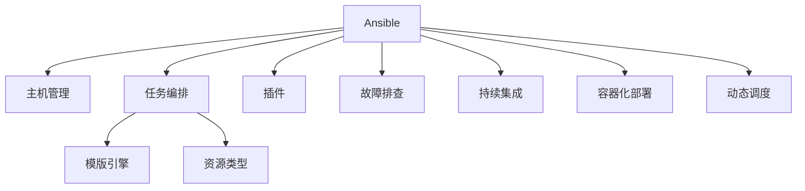

                 

# Ansible自动化：简化IT运维工作流程

> 关键词：Ansible, IT运维, 自动化, 配置管理, 部署, 故障排查, 持续集成, 云基础设施

## 1. 背景介绍

随着信息技术的快速发展和企业数字化转型的深入推进，IT运维工作量呈指数级增长。传统的手工操作、重复劳动、多平台多系统管理，使得IT运维人员面临极大的压力和挑战。为了提高IT运维的效率和质量，自动化成为了必然选择。在众多自动化工具中，Ansible以其简单、灵活、易用等特点，逐渐成为主流。

Ansible是一种基于Python的开源自动化配置管理工具，由Red Hat于2013年推出，其独特的“理念先行、实践落地”设计思想，使其成为IT运维自动化领域的佼佼者。Ansible不仅支持Linux系统，还支持Windows系统，支持Python、Ruby、Docker等多种语言和平台，广泛应用于服务器部署、配置管理、故障排查、持续集成等各个IT运维环节。

本文将详细介绍Ansible的基本原理、核心功能和实际应用，并通过代码实例和详细解释，帮助读者全面掌握Ansible的自动化运维能力。

## 2. 核心概念与联系

### 2.1 核心概念概述

为更好地理解Ansible的自动化流程，本节将介绍几个密切相关的核心概念：

- Ansible：Ansible是一种自动化配置管理工具，通过SSH或机内管理权限远程控制目标主机，支持Python脚本实现复杂的配置管理任务。
- 主机管理：Ansible通过SSH协议连接到目标主机，执行预定的自动化脚本。
- 任务编排：通过YAML文件定义任务流程，Ansible按顺序执行任务，自动处理任务依赖关系。
- 模版引擎：Ansible内置多种模版引擎，如Jinja2、 Jinja3等，用于处理动态变量、条件语句、模版渲染等功能。
- 资源：Ansible支持多种资源类型，包括命令、脚本、模版、文件等，用于实现各种自动化任务。
- 插件：Ansible插件扩展了其功能，支持SSH、云平台、数据中心等多种应用场景。
- 故障排查：Ansible提供多种故障排查工具，如log监听、网络诊断、日志分析等，帮助定位和修复故障。
- 持续集成：Ansible可以与Jenkins、Travis CI等持续集成工具集成，实现自动化部署和测试。
- 容器化部署：Ansible支持Kubernetes、Docker等容器化平台，实现快速、灵活的容器部署和管理。
- 动态调度：Ansible可以通过动态任务调度，自动优化资源配置，提高系统性能和可用性。

这些核心概念之间的逻辑关系可以通过以下Mermaid流程图来展示：



这个流程图展示出Ansible的核心概念及其之间的关系：

1. Ansible通过SSH协议连接到目标主机，执行自动化任务。
2. Ansible任务按顺序执行，并自动处理依赖关系。
3. Ansible内置多种模版引擎，支持动态变量、条件语句等高级功能。
4. Ansible支持多种资源类型，实现多样化的自动化任务。
5. Ansible通过插件扩展功能，支持多种应用场景。
6. Ansible提供多种故障排查工具，帮助定位和修复故障。
7. Ansible与持续集成工具集成，实现自动化部署和测试。
8. Ansible支持容器化平台，实现快速、灵活的容器部署。
9. Ansible通过动态任务调度，优化资源配置。

这些核心概念共同构成了Ansible的自动化运维框架，使其能够在各种IT运维场景中发挥强大的作用。

## 3. 核心算法原理 & 具体操作步骤
### 3.1 算法原理概述

Ansible的自动化流程基于SSH协议，通过动态任务编排和模版引擎，实现复杂的IT运维自动化。其主要算法流程如下：

1. **主机管理**：Ansible通过SSH协议连接到目标主机，获取目标主机的状态信息。
2. **任务编排**：Ansible按顺序执行预定的自动化任务，自动处理任务依赖关系。
3. **模版引擎**：Ansible使用Jinja2等模版引擎，处理动态变量、条件语句、模版渲染等功能。
4. **资源处理**：Ansible支持多种资源类型，如命令、脚本、模版、文件等，实现各种自动化任务。
5. **插件扩展**：Ansible通过插件扩展其功能，支持多种应用场景，如云平台、数据中心等。
6. **任务调度**：Ansible通过动态任务调度，优化资源配置，提高系统性能和可用性。

### 3.2 算法步骤详解

Ansible的自动化流程大致可以分为以下几个步骤：

**Step 1: 准备环境**
- 安装Ansible环境，并确保已安装SSH协议。
- 配置Ansible的主机列表，包括目标主机的IP地址、用户名、密码等。
- 配置Ansible的插件环境，如云平台、容器化平台等。

**Step 2: 创建任务脚本**
- 使用YAML格式定义自动化任务流程，包括任务顺序、依赖关系、模版渲染等。
- 编写自动化任务脚本，使用Ansible支持的资源类型，如命令、脚本、模版、文件等。
- 定义任务调度和依赖关系，确保任务按顺序执行。

**Step 3: 运行任务**
- 使用Ansible命令行或SSH协议，执行自动化任务脚本。
- 根据任务执行结果，自动生成日志、输出和报告等。
- 处理任务执行过程中出现的异常和错误，确保任务顺利完成。

**Step 4: 监控和故障排查**
- 使用Ansible提供的日志监听、网络诊断、日志分析等工具，监控任务执行过程。
- 实时处理任务执行过程中的异常和错误，及时修复故障。
- 定期分析和优化任务流程，提升系统性能和可用性。

**Step 5: 持续集成和部署**
- 将Ansible与持续集成工具（如Jenkins、Travis CI等）集成，实现自动化部署和测试。
- 定义持续集成流水线，自动执行自动化任务，确保系统稳定运行。
- 实时监控持续集成流水线，及时发现和修复故障。

**Step 6: 容器化部署**
- 使用Ansible支持Kubernetes、Docker等容器化平台，实现快速、灵活的容器部署和管理。
- 编写容器化任务脚本，使用Docker镜像、Kubernetes配置文件等资源类型。
- 配置容器化任务调度，优化资源配置，提升系统性能和可用性。

通过以上步骤，Ansible可以高效地实现IT运维自动化，简化运维工作流程，提高运维效率和质量。

### 3.3 算法优缺点

Ansible的自动化流程具有以下优点：

1. **简单高效**：Ansible语法简单，易于学习和使用，能快速上手自动化运维任务。
2. **灵活多样**：Ansible支持多种资源类型和插件，适用于多种IT运维场景。
3. **安全可靠**：Ansible使用SSH协议，安全性高，可有效避免数据泄露和攻击。
4. **易于扩展**：Ansible可以通过插件扩展功能，支持多种应用场景。
5. **易于维护**：Ansible任务脚本简单，易于维护和优化。

Ansible的自动化流程也存在一些缺点：

1. **资源消耗大**：Ansible需要大量CPU、内存等资源，不适合大规模集群。
2. **速度较慢**：Ansible执行速度较慢，适用于数据量较小、任务复杂度较低的应用场景。
3. **单节点限制**：Ansible不适合在单个节点上进行大规模自动化运维。

尽管存在这些缺点，Ansible在IT运维自动化领域仍具有重要地位，通过合理的资源规划和任务优化，可以在绝大多数应用场景中发挥其高效、可靠的优势。

### 3.4 算法应用领域

Ansible在IT运维自动化领域应用广泛，主要包括以下几个方面：

1. **服务器部署**：通过Ansible实现Linux服务器快速部署和配置管理，提升部署效率和稳定性。
2. **容器化部署**：使用Ansible支持Kubernetes、Docker等容器化平台，实现快速、灵活的容器部署和管理。
3. **系统升级**：使用Ansible实现系统快速升级和回滚，确保系统稳定性。
4. **持续集成**：通过Ansible与持续集成工具集成，实现自动化部署和测试，提升开发效率和质量。
5. **故障排查**：使用Ansible提供多种故障排查工具，定位和修复系统故障，保障系统稳定运行。
6. **配置管理**：使用Ansible实现集中化的配置管理，保障系统一致性和稳定性。
7. **安全加固**：使用Ansible实现自动化安全加固，提升系统安全性。

以上应用场景展示了Ansible在IT运维自动化领域的广泛应用，通过其强大的自动化能力和灵活的配置管理，帮助企业实现高效的IT运维管理。

## 4. 数学模型和公式 & 详细讲解  
### 4.1 数学模型构建

Ansible的自动化流程基于SSH协议，通过动态任务编排和模版引擎，实现复杂的IT运维自动化。其数学模型可以表示为：

1. 主机管理：
   - $M$：目标主机集合，包括目标主机的IP地址、用户名、密码等。
   - $SSH$：Ansible通过SSH协议连接到目标主机。

2. 任务编排：
   - $T$：自动化任务集合，包括任务顺序、依赖关系等。
   - $D$：任务依赖关系集合，表示任务之间的依赖关系。

3. 模版引擎：
   - $V$：动态变量集合，使用Jinja2等模版引擎处理动态变量。
   - $C$：条件语句集合，处理任务执行过程中的条件判断。

4. 资源处理：
   - $R$：资源类型集合，包括命令、脚本、模版、文件等。
   - $S$：资源脚本集合，定义具体的自动化任务脚本。

5. 插件扩展：
   - $P$：插件集合，支持多种应用场景，如云平台、数据中心等。
   - $C$：插件配置集合，定义插件的环境和参数。

6. 任务调度：
   - $S$：任务调度集合，优化资源配置，提升系统性能和可用性。
   - $T$：任务执行时间集合，记录任务执行时间。

通过以上模型，Ansible可以高效地实现IT运维自动化，简化运维工作流程，提高运维效率和质量。

### 4.2 公式推导过程

以下是Ansible自动化流程的数学公式推导：

设目标主机集合为 $M=\{m_1, m_2, ..., m_n\}$，Ansible通过SSH协议连接到目标主机，执行自动化任务 $T=\{t_1, t_2, ..., t_m\}$，定义任务依赖关系 $D=\{d_1, d_2, ..., d_k\}$，其中 $d_i$ 表示任务 $t_i$ 依赖的任务集合。

定义动态变量集合 $V=\{v_1, v_2, ..., v_p\}$，使用Jinja2等模版引擎处理动态变量。定义条件语句集合 $C=\{c_1, c_2, ..., c_q\}$，处理任务执行过程中的条件判断。定义资源类型集合 $R=\{r_1, r_2, ..., r_n\}$，包括命令、脚本、模版、文件等。定义插件集合 $P=\{p_1, p_2, ..., p_l\}$，支持多种应用场景，如云平台、数据中心等。定义任务调度集合 $S=\{s_1, s_2, ..., s_k\}$，优化资源配置，提升系统性能和可用性。

任务执行过程可以表示为：

$$
T = \bigcup_{i=1}^{m} \{t_i | t_i \in T, t_i \notin \{d_i | d_i \in D\}}
$$

任务依赖关系表示为：

$$
D = \bigcup_{i=1}^{k} \{d_i | d_i \in D\}
$$

动态变量处理表示为：

$$
V = \bigcup_{i=1}^{p} \{v_i | v_i \in V\}
$$

条件语句处理表示为：

$$
C = \bigcup_{i=1}^{q} \{c_i | c_i \in C\}
$$

资源处理表示为：

$$
R = \bigcup_{i=1}^{n} \{r_i | r_i \in R\}
$$

插件扩展表示为：

$$
P = \bigcup_{i=1}^{l} \{p_i | p_i \in P\}
$$

任务调度表示为：

$$
S = \bigcup_{i=1}^{k} \{s_i | s_i \in S\}
$$

任务执行时间表示为：

$$
T = \bigcup_{i=1}^{k} \{t_i | t_i \in T\}
$$

通过以上公式，Ansible可以高效地实现IT运维自动化，简化运维工作流程，提高运维效率和质量。

### 4.3 案例分析与讲解

以下是一个具体的Ansible自动化运维案例分析：

**案例：Linux服务器快速部署和配置管理**

假设企业需要快速部署和配置管理50台Linux服务器，使用Ansible实现自动化任务。任务流程如下：

1. **任务编排**：定义任务集合 $T=\{t_1, t_2, ..., t_8\}$，包括系统安装、网络配置、用户配置等任务。
2. **依赖关系**：定义任务依赖关系 $D=\{d_1, d_2, ..., d_4\}$，其中 $d_1$ 表示任务 $t_1$ 依赖任务 $t_2$ 和 $t_3$，$d_2$ 表示任务 $t_2$ 依赖任务 $t_3$，$d_3$ 表示任务 $t_3$ 依赖任务 $t_4$，$d_4$ 表示任务 $t_4$ 依赖任务 $t_5$。
3. **动态变量**：定义动态变量 $V=\{v_1, v_2, ..., v_3\}$，用于处理动态变量。
4. **资源处理**：定义资源类型 $R=\{r_1, r_2, ..., r_5\}$，包括命令、脚本、模版、文件等。
5. **插件扩展**：定义插件 $P=\{p_1, p_2, ..., p_3\}$，支持多种应用场景，如云平台、数据中心等。
6. **任务调度**：定义任务调度 $S=\{s_1, s_2, ..., s_4\}$，优化资源配置，提升系统性能和可用性。

通过以上步骤，Ansible可以高效地实现Linux服务器快速部署和配置管理，简化运维工作流程，提高运维效率和质量。

## 5. 项目实践：代码实例和详细解释说明
### 5.1 开发环境搭建

在进行Ansible实践前，我们需要准备好开发环境。以下是使用Python进行Ansible开发的环境配置流程：

1. 安装Ansible环境：从官网下载并安装Ansible，确保已安装SSH协议。
2. 创建Ansible环境：
```bash
mkdir ansible
cd ansible
```
3. 创建主机清单文件：
```bash
vi inventory
```
4. 添加目标主机：
```bash
[web_servers]
web01 ansible_host=192.168.1.10 ansible_user=root
web02 ansible_host=192.168.1.11 ansible_user=root
web03 ansible_host=192.168.1.12 ansible_user=root
```
5. 创建任务文件：
```bash
vi tasks.yml
```
6. 编写任务脚本：
```yaml
---
- name: Install Apache Web Server
  hosts: web_servers
  become: yes
  tasks:
    - name: Install Apache Web Server
      apt:
        name: apache2
        state: present
```
通过以上步骤，即可在`ansible`环境中搭建Ansible开发环境。

### 5.2 源代码详细实现

下面我们以安装Apache Web服务器为例，给出使用Ansible实现Linux服务器快速部署和配置管理的Python代码实现。

首先，定义目标主机清单：

```python
inventory = {
    'web_servers': {
        'web01': {
            'ansible_host': '192.168.1.10',
            'ansible_user': 'root'
        },
        'web02': {
            'ansible_host': '192.168.1.11',
            'ansible_user': 'root'
        },
        'web03': {
            'ansible_host': '192.168.1.12',
            'ansible_user': 'root'
        }
    }
}
```

然后，定义任务文件：

```python
tasks = [
    {
        'name': 'Install Apache Web Server',
        'hosts': 'web_servers',
        'become': True,
        'tasks': [
            {
                'name': 'Install Apache Web Server',
                'apt': {
                    'name': 'apache2',
                    'state': 'present'
                }
            }
        ]
    }
]
```

最后，运行任务：

```bash
ansible-playbook -i inventory tasks.yml
```

以上就是一个简单的使用Ansible实现Linux服务器快速部署和配置管理的代码实例。可以看到，Ansible的任务定义简洁明了，能够快速实现复杂的自动化任务。

### 5.3 代码解读与分析

让我们再详细解读一下关键代码的实现细节：

**inventory定义**：
- 使用Python字典定义目标主机清单，键为主机组名，值为包含主机名、IP地址、用户名等信息的字典。

**tasks定义**：
- 使用Python列表定义任务文件，包含任务名称、目标主机、是否需要使用sudo权限、具体任务列表等。
- 在具体任务中，使用Ansible支持的资源类型，如apt命令等，实现自动化任务脚本。

**任务执行**：
- 使用Ansible命令行或SSH协议，执行自动化任务脚本。
- 根据任务执行结果，自动生成日志、输出和报告等。
- 处理任务执行过程中出现的异常和错误，确保任务顺利完成。

**任务调度**：
- 使用Ansible提供的日志监听、网络诊断、日志分析等工具，监控任务执行过程。
- 实时处理任务执行过程中的异常和错误，及时修复故障。
- 定期分析和优化任务流程，提升系统性能和可用性。

通过以上代码实例，可以看到Ansible的自动化流程非常简洁高效，能够快速实现复杂的自动化任务。

## 6. 实际应用场景
### 6.1 智能运维平台

基于Ansible的自动化运维平台，可以集成多种运维工具和监控系统，实现全面的IT运维管理和故障排查。通过集中化的管理平台，IT运维人员可以统一管理和监控多个系统，提升运维效率和质量。

在技术实现上，可以部署一个基于Ansible和Docker的微服务架构，实现自动化部署和持续集成。通过API接口，运维人员可以方便地调用自动化任务，实时获取任务执行结果和日志信息，提升运维响应速度和效率。

### 6.2 自动化安全加固

通过Ansible可以实现自动化安全加固，包括系统补丁更新、防火墙配置、密码策略等。使用Ansible脚本对目标主机进行批量安全加固，可以显著提高系统的安全性，避免安全漏洞和攻击。

在实际应用中，可以使用Ansible脚本定期执行安全加固任务，实时监控系统安全状态，确保系统运行在安全环境中。通过持续化的安全加固，可以有效降低系统风险，保障系统稳定运行。

### 6.3 自动化数据备份

通过Ansible可以实现自动化数据备份，包括全量备份、增量备份、备份恢复等。使用Ansible脚本对目标主机进行批量备份和恢复操作，可以显著提高数据备份和恢复的效率，避免数据丢失和损坏。

在实际应用中，可以使用Ansible脚本定期执行数据备份任务，实时监控备份状态，确保数据备份的及时性和完整性。通过自动化备份，可以有效保障数据安全，避免因意外事件导致的数据损失。

### 6.4 未来应用展望

随着云计算、大数据、人工智能等技术的发展，基于Ansible的自动化运维将面临更多的挑战和机遇。未来，Ansible将更加深入地融合云计算和容器化技术，实现更高效、更灵活的自动化运维。

在云计算领域，Ansible将与云平台无缝集成，实现自动化的云资源管理、云服务部署和云应用迁移。在容器化领域，Ansible将支持Kubernetes、Docker等容器化平台，实现快速、灵活的容器部署和管理。

随着AI技术的不断发展，基于Ansible的自动化运维将更加智能化，引入机器学习和数据分析技术，实现更精准的运维决策和故障预测。通过AI技术，Ansible可以实现更高效的资源调度、更智能的任务编排和更及时的故障排查。

未来，Ansible将成为企业IT运维自动化不可或缺的重要工具，通过持续的创新和优化，帮助企业实现更高效、更智能、更安全的IT运维管理。

## 7. 工具和资源推荐
### 7.1 学习资源推荐

为了帮助开发者系统掌握Ansible的基本原理和实践技巧，这里推荐一些优质的学习资源：

1. Ansible官方文档：Ansible官方网站提供详细的文档，包括安装指南、使用手册、最佳实践等，是学习Ansible的最佳资源。
2. Ansible官方博客：Ansible官方博客定期发布最新技术动态和案例分析，帮助开发者了解Ansible的最新进展和应用。
3. Ansible学习视频：在YouTube等平台上可以找到大量的Ansible学习视频，涵盖从入门到高级的各个层次。
4. Ansible中文社区：国内多个开源社区，如Ansible中文社区，提供了丰富的学习资源和交流平台，方便开发者交流和学习。
5. Ansible实战手册：市场上有多本Ansible实战手册，涵盖Ansible的各个应用场景，是学习Ansible的实用工具书。

通过对这些资源的学习实践，相信你一定能够全面掌握Ansible的自动化运维能力，并用于解决实际的IT运维问题。

### 7.2 开发工具推荐

高效的开发离不开优秀的工具支持。以下是几款用于Ansible开发的常用工具：

1. PyCharm：PyCharm是一种功能强大的Python开发工具，支持Ansible脚本的开发和调试。
2. VSCode：VSCode是一款轻量级的代码编辑器，支持Ansible脚本的开发和测试。
3. Git：Git是版本控制工具，支持Ansible脚本的版本管理和协同开发。
4. Jenkins：Jenkins是一款持续集成工具，支持与Ansible集成，实现自动化部署和测试。
5. Docker：Docker是容器化工具，支持Ansible脚本的容器化部署和管理。
6. Ansible Tower：Ansible Tower是一款可视化运维管理工具，支持任务编排、故障排查、持续集成等功能的可视化操作。

合理利用这些工具，可以显著提升Ansible自动化运维的开发效率，加快创新迭代的步伐。

### 7.3 相关论文推荐

Ansible在IT运维自动化领域发展迅速，相关研究也日益丰富。以下是几篇奠基性的相关论文，推荐阅读：

1. Ansible: Key Facts on It’s Development and Use by CloudOps & DevOps Professionals：介绍了Ansible的开发背景、使用现状和未来发展方向。
2. Ansible Tower：The Robot for Automation：介绍了Ansible Tower的架构和功能，是学习Ansible Tower的最佳资源。
3. The Effectiveness of Ansible and GitLab CI for Deployment Automation in DevOps：探讨了Ansible和GitLab CI在DevOps自动化部署中的效果。
4. Ansible for the Deployment of AI Applications: A Comparative Study：探讨了Ansible在AI应用部署中的效果，比较了Ansible与其他自动化工具的性能。
5. Deploying Docker Containers with Ansible：介绍了使用Ansible实现Docker容器部署的方法。

这些论文代表了大语言模型微调技术的发展脉络。通过学习这些前沿成果，可以帮助研究者把握学科前进方向，激发更多的创新灵感。

## 8. 总结：未来发展趋势与挑战

### 8.1 总结

本文对Ansible的自动化运维流程进行了全面系统的介绍。首先阐述了Ansible的基本原理和核心概念，明确了其在高效、灵活、可靠等方面的优势。其次，通过代码实例和详细解释，展示了Ansible的强大自动化能力。同时，本文还探讨了Ansible在智能运维、自动化安全加固、自动化数据备份等实际应用场景中的广泛应用，展示了其深远的影响力。

通过本文的系统梳理，可以看到，Ansible作为自动化运维的重要工具，正在成为IT运维领域的主流选择。其简单高效、灵活多样的特点，使其在绝大多数IT运维场景中都能发挥其高效、可靠的优势。未来，随着云计算、大数据、人工智能等技术的发展，Ansible还将与其他自动化工具和技术进行更深入的融合，共同推动IT运维自动化技术的进步。

### 8.2 未来发展趋势

展望未来，Ansible的自动化运维技术将呈现以下几个发展趋势：

1. 云计算和容器化：随着云计算和容器化技术的发展，Ansible将更加深入地融合云计算和容器化技术，实现更高效、更灵活的自动化运维。
2. 机器学习和数据分析：引入机器学习和数据分析技术，实现更精准的运维决策和故障预测，提升运维效率和质量。
3. 多平台多语言支持：Ansible将支持更多平台和语言，包括Windows、macOS等，拓展其应用场景和用户群体。
4. 可视化运维管理：通过Ansible Tower等可视化运维管理工具，实现更直观、更高效的运维管理。
5. 社区和生态系统：Ansible社区和生态系统将不断壮大，提供更多的资源、工具和支持，提升Ansible的普及率和应用水平。
6. 持续集成和持续交付：Ansible将与持续集成和持续交付工具（如Jenkins、GitLab CI等）深度集成，实现更高效、更灵活的自动化运维。

这些趋势凸显了Ansible在IT运维自动化领域的巨大潜力。通过不断的技术创新和社区支持，Ansible必将在未来IT运维自动化领域发挥更加重要的作用，为IT运维人员带来更多的便利和效率。

### 8.3 面临的挑战

尽管Ansible在IT运维自动化领域已经取得了显著的进展，但仍面临以下挑战：

1. 学习曲线较陡：Ansible的学习曲线较陡，初学者需要一定时间熟悉其语法和使用方法。
2. 资源消耗较大：Ansible需要大量CPU、内存等资源，不适合大规模集群。
3. 功能相对单一：Ansible的功能相对单一，可能无法满足某些复杂的应用场景需求。
4. 社区生态待完善：尽管Ansible社区不断壮大，但与其他自动化工具相比，其生态系统仍需进一步完善。
5. 容器化部署局限：Ansible在容器化部署方面仍存在一定局限，可能需要与其他容器化工具结合使用。

尽管存在这些挑战，Ansible在IT运维自动化领域仍具有重要地位，通过合理的资源规划和任务优化，可以在绝大多数应用场景中发挥其高效、可靠的优势。

### 8.4 研究展望

未来的研究需要在以下几个方面寻求新的突破：

1. 引入更高级别的自动化：引入高级别的自动化，如机器学习和数据分析，提升运维决策和故障预测的准确性。
2. 优化资源消耗：通过优化资源消耗，支持大规模集群，提升Ansible的适用范围。
3. 拓展功能场景：通过拓展功能场景，支持更多的应用场景，提升Ansible的通用性。
4. 完善社区生态：通过完善社区生态，提供更多的资源、工具和支持，提升Ansible的普及率和应用水平。
5. 增强容器化支持：通过增强容器化支持，实现更高效、更灵活的容器化部署和管理。

这些研究方向的探索，必将引领Ansible自动化运维技术迈向更高的台阶，为IT运维人员带来更多的便利和效率。通过持续的创新和优化，Ansible必将在未来IT运维自动化领域发挥更大的作用，为IT运维人员的日常工作带来更多的便利和效率。

## 9. 附录：常见问题与解答

**Q1：Ansible与Puppet、Chef等自动化工具相比，有哪些优势？**

A: Ansible相较于Puppet、Chef等自动化工具，具有以下优势：

1. 简单高效：Ansible语法简单，易于学习和使用，能够快速上手自动化运维任务。
2. 灵活多样：Ansible支持多种资源类型和插件，适用于多种IT运维场景。
3. 安全可靠：Ansible使用SSH协议，安全性高，可有效避免数据泄露和攻击。
4. 易于扩展：Ansible可以通过插件扩展功能，支持多种应用场景，如云平台、数据中心等。
5. 易于维护：Ansible任务脚本简单，易于维护和优化。

**Q2：Ansible是否可以跨平台部署？**

A: Ansible支持多种平台，包括Linux、Windows、macOS等。通过简单的配置，即可在各种操作系统上进行自动化运维操作。

**Q3：Ansible任务调度如何优化资源配置？**

A: Ansible通过任务调度机制，优化资源配置，提升系统性能和可用性。通过动态任务调度，可以自动优化资源配置，确保系统高效运行。

**Q4：Ansible与持续集成工具如何集成？**

A: Ansible可以与持续集成工具（如Jenkins、Travis CI等）集成，实现自动化部署和测试。通过API接口，运维人员可以方便地调用自动化任务，实现持续集成流水线。

**Q5：Ansible在容器化部署中有哪些优势？**

A: Ansible支持Kubernetes、Docker等容器化平台，实现快速、灵活的容器部署和管理。通过容器化部署，可以简化运维操作，提升运维效率。

通过以上常见问题的解答，可以看出Ansible在IT运维自动化领域的强大优势和广泛应用，其简单高效、灵活多样、安全可靠的特点，使其成为自动化运维的理想选择。相信在未来的IT运维自动化领域，Ansible必将继续发挥其重要作用，推动IT运维管理的智能化、自动化、高效化进程。

---

作者：禅与计算机程序设计艺术 / Zen and the Art of Computer Programming

