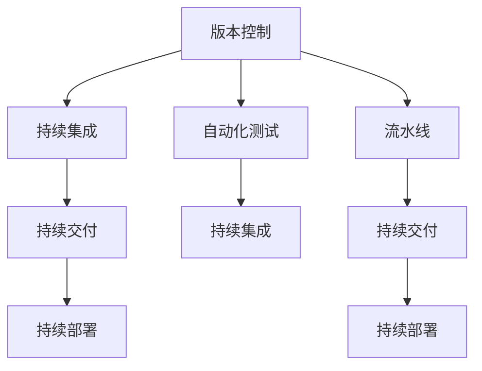

                 

# CI/CD管道：自动化软件交付流程

> 关键词：CI/CD, 自动化, 软件开发, 持续集成, 持续交付, 工具链, 流程优化, 流水线, 版本控制, DevOps

## 1. 背景介绍

在当今数字化快速迭代的时代，软件开发流程的自动化变得越来越重要。传统的瀑布式开发模型已经无法适应日益频繁的产品迭代和市场变化。因此，持续集成（Continuous Integration, CI）和持续交付（Continuous Delivery, CD）成为了软件开发和运维中的两大重要趋势。

### 1.1 问题由来
在过去，软件开发过程中各个阶段（如需求分析、设计、编码、测试等）常常是独立进行的，导致整个流程周期长、成本高、质量难以保证。此外，版本控制混乱、部署过程繁琐等问题也增加了开发人员的工作负担。

CI/CD管道通过自动化和集成化，使得软件开发和部署流程更加高效、可控和灵活。它不仅加快了产品上线速度，提高了代码质量，还能在错误出现时快速定位和修正，极大地提升了开发效率和客户满意度。

### 1.2 问题核心关键点
CI/CD管道的核心在于通过自动化工具链和标准流程，将软件开发和部署的各个阶段串联起来，形成一个持续迭代和反馈的闭环。该管道分为持续集成和持续交付两个部分，通过自动化测试、构建、部署等环节，确保每次提交的代码都能顺利进入下一阶段，最终上线至生产环境。

CI/CD的核心关键点包括：
- 自动化测试：通过自动化测试工具，确保代码质量，及时发现并修复问题。
- 自动化构建：将代码自动编译、打包和部署到目标环境中，确保开发流程的自动化和流水线化。
- 自动化部署：通过自动化脚本和工具，实现无缝的部署流程，提高部署效率和稳定性。
- 持续反馈：通过集成和反馈机制，实时监控代码变化和系统运行状态，持续优化和改进。

CI/CD管道的成功实施，需要团队成员在工具选择、流程设计、协作沟通等方面保持一致，并不断迭代和优化，以达到最佳效果。

### 1.3 问题研究意义
实施CI/CD管道，对于提升软件开发和运维效率、保障代码质量和用户体验具有重要意义：

1. **提高开发效率**：通过自动化测试和构建，开发人员可以更快地完成代码提交，减少手动操作的时间和成本。
2. **提升代码质量**：自动化测试能够及时发现并修复潜在问题，减少后期维护成本。
3. **加速部署进程**：自动化部署能够快速将代码推送至生产环境，缩短产品上线周期。
4. **增强系统稳定性**：持续集成和反馈机制能够实时监控系统运行状态，及时发现和修复问题。
5. **促进团队协作**：CI/CD管道强调团队协作和沟通，通过标准化的流程和工具，提高团队协作效率和代码协同开发能力。
6. **支持持续改进**：通过数据分析和反馈机制，持续优化和改进开发流程，提升开发质量和用户体验。

总之，CI/CD管道是软件开发和运维中的重要工具，能够显著提高开发效率、提升代码质量、加速产品上线速度，是现代软件开发的最佳实践之一。

## 2. 核心概念与联系

### 2.1 核心概念概述

为了更好地理解CI/CD管道的原理和架构，本节将介绍几个核心概念及其之间的联系：

- **持续集成（Continuous Integration, CI）**：将代码变更集成到共享代码库中，并通过自动化测试来验证代码变更的正确性，确保每次提交的代码都能通过测试。
- **持续交付（Continuous Delivery, CD）**：在通过CI测试后，自动将代码部署到目标环境（如测试或生产环境），以确保能够快速发布高质量的软件产品。
- **持续部署（Continuous Deployment, CD）**：在持续交付的基础上，通过自动化脚本和工具，实现完全自动化的部署流程，减少人工干预和错误风险。
- **流水线（Pipeline）**：一种自动化执行流程的方式，通过一系列步骤和任务，实现从代码提交到部署的自动化执行。
- **自动化测试（Automated Testing）**：通过脚本、工具和平台，实现代码和系统的自动化测试，确保产品质量和稳定性。
- **版本控制（Version Control）**：记录和管理代码变更的工具，如Git、SVN等，是CI/CD管道的重要基础。

这些概念之间的联系可以通过以下Mermaid流程图来展示：



这个流程图展示了版本控制作为基础，通过流水线将持续集成、持续交付和持续部署三个主要环节串联起来。同时，自动化测试作为关键组成部分，在CI和CD的每个环节中扮演着重要角色，确保代码质量和系统稳定性。

## 3. 核心算法原理 & 具体操作步骤

### 3.1 算法原理概述

CI/CD管道的核心算法原理是通过自动化工具和脚本，将软件开发和部署的各个环节串联起来，形成一个持续迭代和反馈的闭环。该管道可以分为持续集成和持续交付两个主要阶段，通过自动化测试、构建和部署，确保每次提交的代码都能顺利进入下一阶段，最终上线至生产环境。

持续集成的基本原理是通过自动化测试工具，对每次代码提交进行即时测试，验证代码的正确性和稳定性。持续交付则在此基础上，通过自动化构建和部署工具，将经过测试的代码快速推送至目标环境，确保软件能够快速上线并运行。持续部署则进一步自动化和优化部署流程，实现完全自动化的部署流程。

### 3.2 算法步骤详解

CI/CD管道的实现步骤如下：

**Step 1: 版本控制系统初始化**
- 安装并配置版本控制系统，如Git、SVN等。
- 创建代码库，并分配权限，确保团队成员可以协同开发。

**Step 2: 配置持续集成流水线**
- 使用CI工具（如Jenkins、Travis CI等）搭建持续集成流水线。
- 配置自动化测试任务，自动运行测试用例，验证代码变更的正确性。
- 配置自动化构建任务，自动构建和打包项目，生成可部署的包。

**Step 3: 配置持续交付流水线**
- 使用CD工具（如Jenkins、CircleCI等）搭建持续交付流水线。
- 配置自动化部署任务，自动部署生成的包到目标环境（如测试或生产环境）。
- 配置自动化回滚任务，在部署失败时自动回滚到前一个版本，确保系统的稳定性和可靠性。

**Step 4: 配置持续部署流水线**
- 配置完全自动化的部署流程，使用脚本和工具自动完成部署。
- 配置自动化监控任务，实时监控系统运行状态，及时发现和修复问题。
- 配置自动化反馈机制，收集用户反馈和系统日志，持续优化和改进开发流程。

**Step 5: 监控和优化**
- 使用日志和监控工具（如ELK Stack、Prometheus等）实时监控系统运行状态。
- 定期评估和优化CI/CD管道，提升管道效率和稳定性。

### 3.3 算法优缺点

CI/CD管道具有以下优点：
1. 自动化和流水线化：通过自动化工具和脚本，实现持续集成和交付，减少手动操作的时间和成本。
2. 提高代码质量：自动化测试能够及时发现并修复潜在问题，确保代码质量。
3. 加速产品上线：自动化部署能够快速将代码推送至生产环境，缩短产品上线周期。
4. 实时监控和反馈：通过集成和反馈机制，实时监控系统运行状态，及时发现和修复问题。
5. 支持持续改进：通过数据分析和反馈机制，持续优化和改进开发流程，提升开发质量和用户体验。

但CI/CD管道也存在一些局限性：
1. 对工具和脚本的依赖：CI/CD管道的效率和稳定性依赖于工具和脚本的质量和稳定性，一旦工具出现故障，整个管道可能会受到影响。
2. 配置和维护复杂：搭建和配置CI/CD管道需要一定的技术基础和经验，对于新团队来说，配置和维护可能比较复杂。
3. 安全风险：自动化脚本和工具可能存在安全隐患，需要进行安全审计和防护。
4. 依赖基础架构：CI/CD管道依赖于目标环境的基础设施，如服务器、网络和存储等，基础设施的稳定性直接影响管道的效率和稳定性。

尽管存在这些局限性，但CI/CD管道通过持续的自动化和优化，已经成为软件开发和运维中的最佳实践之一。

### 3.4 算法应用领域

CI/CD管道在软件开发和运维中有着广泛的应用，涵盖各种规模和类型的项目：

- **Web应用开发**：通过CI/CD管道，Web应用开发项目能够实现快速迭代和发布，提高开发效率和用户体验。
- **移动应用开发**：移动应用开发项目同样可以利用CI/CD管道，实现自动化测试和部署，加速产品上线周期。
- **企业应用开发**：大型企业应用开发项目通过CI/CD管道，能够实现复杂的集成和部署流程，确保系统稳定性和可靠性。
- **大数据开发**：大数据开发项目通过CI/CD管道，能够实现数据预处理、模型训练和部署的全流程自动化，提高开发效率和数据质量。
- **人工智能应用开发**：人工智能应用开发项目通过CI/CD管道，能够实现数据预处理、模型训练和部署的全流程自动化，确保模型质量和性能。

CI/CD管道不仅适用于传统的软件开发项目，还适用于各种新型应用和数据处理项目，成为软件开发和运维中的重要工具。

## 4. 数学模型和公式 & 详细讲解 & 举例说明

### 4.1 数学模型构建

在CI/CD管道中，数学模型主要涉及以下几个方面：

- **代码变更频率（Change Frequency, CF）**：表示单位时间内提交代码的次数。
- **测试通过率（Test Pass Rate, TPR）**：表示自动化测试通过的代码提交数量占总提交数量的比例。
- **构建通过率（Build Pass Rate, BPR）**：表示自动化构建成功的代码提交数量占总提交数量的比例。
- **部署通过率（Deployment Pass Rate, DPR）**：表示自动化部署成功的代码提交数量占总提交数量的比例。

假设有一系列代码提交$x_1, x_2, \ldots, x_n$，每个提交都有对应的代码变更频率$CF_i$、测试通过率$TPR_i$、构建通过率$BPR_i$和部署通过率$DPR_i$。

**模型构建目标**：通过数学模型计算每次提交的成功率和总成功率，评估CI/CD管道的整体效率和稳定性。

**基本假设**：
1. 每次提交的变更频率、测试通过率、构建通过率和部署通过率相互独立。
2. 每次提交的成功率和失败率遵循伯努利分布。

**数学模型**：
- 每次提交的成功率$P_i$：
  $$
  P_i = P(CF_i) \times P(TPR_i) \times P(BPR_i) \times P(DPR_i)
  $$

- 总成功率$P_{total}$：
  $$
  P_{total} = \frac{1}{n} \sum_{i=1}^n P_i
  $$

### 4.2 公式推导过程

为了更好地理解上述数学模型，下面对公式进行详细推导：

1. 每次提交的成功率$P_i$：
  - 代码变更频率$CF_i$的概率分布：$P(CF_i)$
  - 测试通过率$TPR_i$的概率分布：$P(TPR_i)$
  - 构建通过率$BPR_i$的概率分布：$P(BPR_i)$
  - 部署通过率$DPR_i$的概率分布：$P(DPR_i)$

  因此，每次提交的成功率$P_i$可以表示为：
  $$
  P_i = P(CF_i) \times P(TPR_i) \times P(BPR_i) \times P(DPR_i)
  $$

2. 总成功率$P_{total}$：
  - 总成功率$P_{total}$是所有提交成功率$P_i$的平均值：
  $$
  P_{total} = \frac{1}{n} \sum_{i=1}^n P_i
  $$

### 4.3 案例分析与讲解

以一个简单的Web应用开发项目为例，分析CI/CD管道的效率和稳定性：

假设项目每天提交50次代码，每次提交的概率分布为：
- 代码变更频率$CF_i \sim Bernoulli(0.9)$
- 测试通过率$TPR_i \sim Bernoulli(0.95)$
- 构建通过率$BPR_i \sim Bernoulli(0.98)$
- 部署通过率$DPR_i \sim Bernoulli(0.99)$

根据上述数学模型，每次提交的成功率为：
$$
P_i = 0.9 \times 0.95 \times 0.98 \times 0.99 \approx 0.87
$$

总成功率为：
$$
P_{total} = \frac{1}{50} \sum_{i=1}^n P_i \approx 0.95
$$

通过计算，我们可以看到，尽管每次提交的成功率并不高，但通过持续集成和交付，项目整体的成功率仍然很高，能够保证项目的稳定性和可靠性。

## 5. 项目实践：代码实例和详细解释说明

### 5.1 开发环境搭建

在进行CI/CD管道实践前，我们需要准备好开发环境。以下是使用Jenkins搭建CI/CD管道的环境配置流程：

1. 安装Jenkins：从官网下载并安装Jenkins，创建独立的用户账号。
2. 配置Jenkins环境：安装Jenkins插件，如Pipeline、Git等，设置系统环境变量。
3. 安装版本控制系统：安装Git，配置版本控制库，确保团队成员可以协同开发。
4. 配置CI流水线：在Jenkins上创建CI流水线，配置自动化测试和构建任务。
5. 配置CD流水线：在Jenkins上创建CD流水线，配置自动化部署任务。

完成上述步骤后，即可在Jenkins上启动CI/CD管道，开始开发实践。

### 5.2 源代码详细实现

这里我们以Jenkins为例，详细讲解如何在Jenkins上搭建CI/CD管道，并对项目进行自动化构建和部署。

首先，定义CI流水线的配置文件`Jenkinsfile`：

```groovy
pipeline {
    agent any
    stages {
        stage('测试') {
            steps {
                // 执行单元测试
                sh 'mvn test'
                // 检查测试结果
                sh 'mvn verify'
            }
        }
        stage('构建') {
            steps {
                // 执行项目构建
                sh 'mvn package'
                // 生成构建报告
                sh 'mvn site:site'
            }
        }
        stage('部署') {
            steps {
                // 执行自动化部署
                sh 'mvn spring-boot:run'
            }
        }
    }
}
```

在Jenkins上创建项目，并关联上述配置文件，即可启动CI/CD管道：

1. 登录Jenkins，创建新项目，选择“New Item”。
2. 在“Configure”页面，选择“Pipeline”配置类型。
3. 在“Pipeline Definition”中，选择“Pipeline script from SCM”。
4. 设置源码库，如Git仓库，并关联上述配置文件`Jenkinsfile`。
5. 保存并启动项目，Jenkins将自动拉取源码，执行CI流水线。

在CI流水线的每个阶段中，通过执行shell脚本或调用构建工具（如Maven），实现自动化测试和构建任务。CI流水线执行完成后，将触发CD流水线，自动将构建的包部署到目标环境。

### 5.3 代码解读与分析

让我们再详细解读一下关键代码的实现细节：

**Jenkinsfile**：
- `pipeline`关键字表示这是一个Pipeline配置文件，`agent any`表示使用任意代理执行任务。
- `stages`关键字表示任务分为多个阶段，每个阶段代表一个独立的任务，如测试、构建和部署。
- 在每个阶段中，通过执行shell脚本，调用构建工具，实现任务的自动化执行。
- `sh`命令用于执行shell脚本，如测试、构建和部署命令。

**配置文件**：
- `mvn test`：执行单元测试，检查代码质量。
- `mvn verify`：检查测试结果，验证测试通过率。
- `mvn package`：执行项目构建，生成可部署的包。
- `mvn site:site`：生成构建报告，供开发人员和测试人员查看。
- `mvn spring-boot:run`：执行自动化部署，将包部署到目标环境。

通过上述代码和配置，我们可以在Jenkins上实现完整的CI/CD管道，实现代码的持续集成和交付，提升开发效率和系统稳定性。

### 5.4 运行结果展示

启动CI/CD管道后，我们可以在Jenkins的控制台实时查看流水线的执行状态和结果：

1. 在Jenkins项目详情页，点击“Build History”，查看最近的构建记录。
2. 在构建详情页，可以看到每次构建的详细信息，包括测试通过率、构建通过率、部署通过率等关键指标。
3. 通过实时监控和数据分析，及时发现和修复问题，确保CI/CD管道的稳定性和可靠性。

## 6. 实际应用场景

### 6.1 自动化测试和构建

在Web应用开发项目中，自动化测试和构建是CI/CD管道的重要组成部分。通过自动化测试和构建，能够及时发现并修复代码中的问题，确保代码质量和系统稳定性。

- **自动化测试**：通过单元测试、集成测试和功能测试，验证代码的正确性和稳定性。自动化测试能够及时发现并修复潜在问题，减少后期维护成本。
- **自动化构建**：将代码自动编译、打包和部署到目标环境，确保开发流程的自动化和流水线化。自动化构建能够快速将代码推送至目标环境，缩短产品上线周期。

### 6.2 持续交付和部署

在产品上线周期中，持续交付和部署是CI/CD管道的关键环节。通过持续交付和部署，能够实现快速迭代和发布，提高开发效率和用户体验。

- **持续交付**：在通过CI测试后，自动将代码推送至目标环境，如测试或生产环境。持续交付能够快速将代码推送至目标环境，确保软件能够快速上线并运行。
- **持续部署**：在持续交付的基础上，通过自动化脚本和工具，实现完全自动化的部署流程。持续部署能够进一步优化部署流程，减少人工干预和错误风险。

### 6.3 持续反馈和优化

在CI/CD管道中，持续反馈和优化是不可或缺的环节。通过持续反馈和优化，能够及时发现和修复问题，持续改进开发流程，提升开发质量和用户体验。

- **持续反馈**：通过集成和反馈机制，实时监控系统运行状态，收集用户反馈和系统日志，持续优化和改进开发流程。持续反馈能够及时发现和修复问题，确保系统的稳定性和可靠性。
- **持续优化**：通过数据分析和反馈机制，评估CI/CD管道的效率和稳定性，持续优化和改进管道。持续优化能够提升管道的效率和稳定性，提高开发效率和用户体验。

## 7. 工具和资源推荐

### 7.1 学习资源推荐

为了帮助开发者系统掌握CI/CD管道的理论基础和实践技巧，这里推荐一些优质的学习资源：

1. **《CI/CD DevOps实践指南》**：一本介绍CI/CD管道的经典书籍，涵盖CI/CD管道的理论基础和实践技巧，适合入门和进阶学习。
2. **Jenkins官方文档**：Jenkins的官方文档提供了详细的配置和使用指南，是搭建CI/CD管道的必备参考资料。
3. **Kubernetes官方文档**：Kubernetes是现代CI/CD管道的重要组成部分，其官方文档提供了详细的部署和使用指南，适合了解容器化和Kubernetes的相关知识。
4. **《DevOps实践指南》**：一本介绍DevOps的权威书籍，涵盖CI/CD管道的理论基础和实践技巧，适合系统学习DevOps相关知识。
5. **《Continuous Delivery for Cloud-Hosted Applications》**：Google开发的优秀实践指南，详细介绍了如何使用Google Cloud Platform实现CI/CD管道，适合了解云计算与CI/CD管道的结合使用。

通过对这些资源的学习实践，相信你一定能够快速掌握CI/CD管道的精髓，并用于解决实际的开发问题。

### 7.2 开发工具推荐

高效的开发离不开优秀的工具支持。以下是几款用于CI/CD管道开发的常用工具：

1. **Jenkins**：开源的持续集成工具，支持多种编程语言和构建工具，是构建CI/CD管道的首选工具。
2. **GitLab CI/CD**：GitLab提供的CI/CD管道工具，支持GitLab版本控制，提供丰富的插件和集成能力。
3. **CircleCI**：基于云的持续集成和持续部署工具，支持多种编程语言和构建工具，适合自动化测试和部署。
4. **Travis CI**：基于云的持续集成工具，支持多种编程语言和构建工具，适合开源项目的CI/CD管道。
5. **Docker**：开源的容器化工具，支持多种操作系统和编程语言，是构建CI/CD管道的重要组成部分。

合理利用这些工具，可以显著提升CI/CD管道的开发效率，加快创新迭代的步伐。

### 7.3 相关论文推荐

CI/CD管道的不断发展得益于学界的持续研究。以下是几篇奠基性的相关论文，推荐阅读：

1. **《A Survey on Continuous Integration and Continuous Deployment》**：系统介绍了CI/CD管道的历史和发展，总结了现有技术和实践，适合全面了解CI/CD管道的理论基础。
2. **《Continuous Integration with Cascading Pipelines》**：介绍了一种基于流水线的持续集成方法，详细讨论了流水线的设计和管理，适合深入理解CI/CD管道的实现细节。
3. **《Effective Continuous Delivery》**：介绍了如何进行有效的持续交付，强调了自动化测试和部署的重要性，适合了解持续交付的实际应用。
4. **《Designing and Evaluating a Source-Code-Based Change-Frequency Model for Information-Rich Software Development Projects》**：研究了代码变更频率的数学模型，适合了解代码变更频率的统计分析方法。
5. **《A Survey of Software Release Management Practices》**：总结了软件发布管理的最佳实践，涵盖持续集成、持续交付和持续部署等内容，适合全面了解软件发布管理的理论基础。

这些论文代表了大语言模型微调技术的发展脉络。通过学习这些前沿成果，可以帮助研究者把握学科前进方向，激发更多的创新灵感。

## 8. 总结：未来发展趋势与挑战

### 8.1 总结

本文对CI/CD管道的原理和实践进行了全面系统的介绍。首先阐述了CI/CD管道的背景和意义，明确了其在软件开发和运维中的重要作用。其次，从原理到实践，详细讲解了CI/CD管道的数学模型和操作步骤，给出了完整的CI/CD管道配置代码实例。同时，本文还探讨了CI/CD管道在实际应用中的各种场景，展示了其在自动化测试、持续交付和持续优化等方面的强大能力。

通过本文的系统梳理，可以看到，CI/CD管道已经成为软件开发和运维中的重要工具，能够显著提高开发效率、提升代码质量、加速产品上线速度，是现代软件开发的最佳实践之一。

### 8.2 未来发展趋势

展望未来，CI/CD管道将呈现以下几个发展趋势：

1. **微服务架构的普及**：随着微服务架构的普及，CI/CD管道将更多地应用于微服务系统的开发和运维，实现微服务的自动化构建和部署。
2. **容器化和Kubernetes的广泛应用**：容器化和Kubernetes技术的普及，使得CI/CD管道能够更好地支持容器化应用，实现高效的自动化部署和管理。
3. **人工智能与CI/CD管道的结合**：人工智能技术（如机器学习、自然语言处理等）的普及，将使得CI/CD管道能够更好地处理复杂的开发任务，提高开发效率和系统稳定性。
4. **云原生应用的兴起**：云原生应用的兴起，将使得CI/CD管道能够更好地支持云上应用，实现快速迭代和部署。
5. **DevSecOps的普及**：DevSecOps理念的普及，将使得CI/CD管道能够更好地融入安全开发和运维，提升系统的安全性和可靠性。
6. **自动化测试和持续交付的深入应用**：自动化测试和持续交付技术的深入应用，将使得CI/CD管道能够更好地支持复杂的开发任务，提高开发效率和系统稳定性。

以上趋势凸显了CI/CD管道的广阔前景。这些方向的探索发展，必将进一步提升CI/CD管道的效率和稳定性，为软件开发和运维带来更多的创新和突破。

### 8.3 面临的挑战

尽管CI/CD管道已经取得了一定的进展，但在实现高效、稳定和自动化的过程中，仍面临诸多挑战：

1. **对工具和脚本的依赖**：CI/CD管道的效率和稳定性依赖于工具和脚本的质量和稳定性，一旦工具出现故障，整个管道可能会受到影响。
2. **配置和维护复杂**：搭建和配置CI/CD管道需要一定的技术基础和经验，对于新团队来说，配置和维护可能比较复杂。
3. **安全风险**：自动化脚本和工具可能存在安全隐患，需要进行安全审计和防护。
4. **依赖基础架构**：CI/CD管道依赖于目标环境的基础设施，如服务器、网络和存储等，基础设施的稳定性直接影响管道的效率和稳定性。
5. **版本控制问题**：版本控制工具的使用不当可能导致版本冲突、分支管理混乱等问题，影响开发效率和协作效果。
6. **跨团队协作**：跨团队的协作和沟通问题可能导致任务分配不清、进度跟踪困难等问题，影响开发效率和协作效果。

尽管存在这些挑战，但通过持续的自动化和优化，CI/CD管道仍能够不断提升开发效率和系统稳定性。

### 8.4 研究展望

面向未来，CI/CD管道的研究需要在以下几个方面寻求新的突破：

1. **微服务架构下的CI/CD**：在微服务架构下，如何设计高效的CI/CD管道，实现微服务的自动化构建和部署，将是重要的研究方向。
2. **容器化和Kubernetes的深度融合**：如何更好地将容器化和Kubernetes技术与CI/CD管道结合，实现高效的自动化部署和管理，是未来的重要课题。
3. **人工智能与CI/CD管道的协同**：如何更好地将人工智能技术（如机器学习、自然语言处理等）与CI/CD管道结合，实现复杂开发任务的自动化处理，是未来的重要方向。
4. **云原生应用的自动化构建和部署**：如何更好地支持云原生应用的自动化构建和部署，实现快速迭代和部署，是未来的重要方向。
5. **DevSecOps的深入应用**：如何更好地将DevSecOps理念融入CI/CD管道，提升系统的安全性和可靠性，是未来的重要课题。
6. **自动化测试和持续交付的优化**：如何更好地实现自动化测试和持续交付，提高开发效率和系统稳定性，是未来的重要方向。

这些研究方向将引领CI/CD管道的进一步发展，为软件开发和运维带来更多的创新和突破。只有勇于创新、敢于突破，才能不断拓展CI/CD管道的边界，推动软件开发和运维技术的进步。

## 9. 附录：常见问题与解答

**Q1：CI/CD管道如何处理版本控制冲突？**

A: 版本控制冲突是CI/CD管道中常见的问题，处理冲突的方法包括：
1. 手动解决冲突：在发生冲突时，手动合并或撤销分支，确保代码一致性。
2. 自动化合并工具：使用Git等版本控制工具的合并功能，自动解决冲突。
3. 分支管理策略：采用分支管理策略，如Git Flow，确保分支稳定和可控，减少冲突风险。
4. 合并前测试：在合并分支前，先进行代码测试和验证，确保代码质量和一致性。

通过合理处理版本控制冲突，可以确保CI/CD管道的稳定性和可靠性。

**Q2：如何提高CI/CD管道的效率？**

A: 提高CI/CD管道的效率，可以从以下几个方面入手：
1. 优化测试策略：通过减少不必要的测试用例，提高测试效率。
2. 使用缓存技术：使用缓存技术，减少重复构建和测试的时间消耗。
3. 配置流水线优化：合理配置流水线，减少不必要的工作，提高流水线效率。
4. 使用异步任务：使用异步任务，并行处理多个任务，提高流水线效率。
5. 集成监控工具：集成监控工具，实时监控流水线状态，及时发现和修复问题。

通过以上措施，可以显著提升CI/CD管道的效率，加快开发进度。

**Q3：如何确保CI/CD管道的安全性和稳定性？**

A: 确保CI/CD管道的安全性和稳定性，可以从以下几个方面入手：
1. 使用安全审计工具：使用安全审计工具，定期检查和管理管道中的安全漏洞。
2. 配置权限管理：合理配置权限管理，确保只有授权用户才能访问和管理管道。
3. 使用可信赖的工具和插件：使用经过严格测试和验证的工具和插件，减少安全风险。
4. 自动化回滚机制：配置自动化回滚机制，在部署失败时自动回滚到前一个版本，确保系统的稳定性。
5. 监控和日志管理：配置监控和日志管理，实时监控系统运行状态，及时发现和修复问题。

通过以上措施，可以确保CI/CD管道的安全性和稳定性，提升系统的可靠性和用户体验。

**Q4：如何优化CI/CD管道的自动化测试？**

A: 优化CI/CD管道的自动化测试，可以从以下几个方面入手：
1. 优化测试用例：通过减少不必要的测试用例，提高测试效率。
2. 使用覆盖率工具：使用测试覆盖率工具，确保测试用例的全面覆盖。
3. 集成静态分析工具：集成静态分析工具，提前发现代码中的潜在问题，减少测试成本。
4. 使用自动化测试框架：使用自动化测试框架，提高测试效率和稳定性。
5. 定期评估和优化测试策略：定期评估和优化测试策略，确保测试的有效性和可靠性。

通过以上措施，可以显著提升CI/CD管道的自动化测试效率和质量，确保代码质量和安全。

**Q5：如何配置CI/CD管道的持续部署策略？**

A: 配置CI/CD管道的持续部署策略，可以从以下几个方面入手：
1. 配置自动化部署工具：使用自动化部署工具，如Jenkins、CircleCI等，实现自动化部署。
2. 配置自动化回滚机制：配置自动化回滚机制，在部署失败时自动回滚到前一个版本，确保系统的稳定性。
3. 集成监控工具：集成监控工具，实时监控系统运行状态，及时发现和修复问题。
4. 配置环境管理：配置环境管理，确保部署环境的一致性和可靠性。
5. 配置安全审计：配置安全审计机制，确保部署过程中的安全性。

通过以上措施，可以确保CI/CD管道的持续部署策略高效、稳定和可靠。

---

作者：禅与计算机程序设计艺术 / Zen and the Art of Computer Programming

