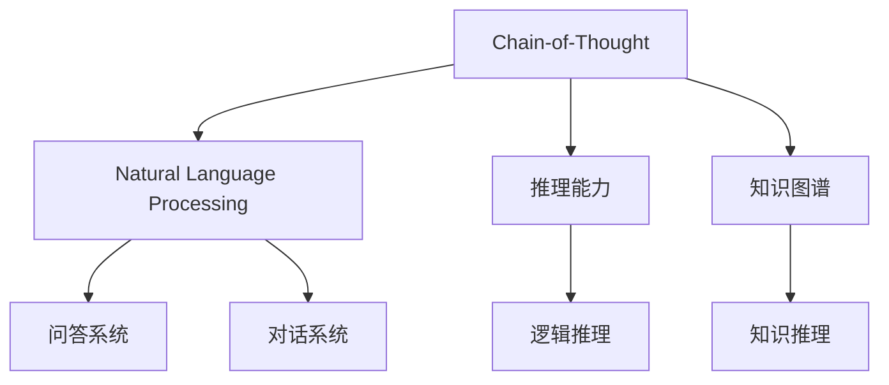

                 

# Chain-of-Thought推理能力的应用

> 关键词：Chain-of-Thought, 自然语言处理(NLP), 推理能力, 知识图谱(KG), 深度学习

## 1. 背景介绍

### 1.1 问题由来
随着人工智能技术的不断进步，特别是在自然语言处理(Natural Language Processing, NLP)领域，基于深度学习的模型已经展示了令人瞩目的表现。然而，传统的神经网络模型主要关注词汇级别的特征表示和模式学习，而无法像人类一样具备连贯的逻辑推理能力。Chain-of-Thought (CoT)推理技术作为一种新兴的AI能力，能够帮助模型理解问题，通过连续的逻辑推理，生成合理的答案。本文将详细介绍CoT推理能力的应用，涵盖其原理、实现和未来展望。

### 1.2 问题核心关键点
CoT推理能力的应用主要集中在以下几个方面：
- 帮助模型构建连贯的逻辑链条，理解问题的本质。
- 提升模型在复杂推理任务上的表现，如问答系统、逻辑推理等。
- 增强模型生成文本的连贯性和合理性，提升对话系统的人机交互体验。
- 辅助知识图谱(Knowledge Graph, KG)构建，提升知识推理的准确性和效率。

## 2. 核心概念与联系

### 2.1 核心概念概述

为更好地理解CoT推理能力的应用，本节将介绍几个密切相关的核心概念：

- Chain-of-Thought (CoT)：一种基于逻辑推理的思维过程，用于指导模型对问题的理解和答案的生成。
- 自然语言处理(NLP)：一门研究如何使计算机能够理解、处理和生成人类自然语言的学科。
- 推理能力：模型通过逻辑推理，根据已知事实和规则推导出新的结论的能力。
- 知识图谱(KG)：一种结构化的语义知识表示方式，用于存储和组织知识，支持智能推理。

这些核心概念之间的逻辑关系可以通过以下Mermaid流程图来展示：



这个流程图展示了大模型推理能力与NLP技术的联系：

1. CoT推理能力作为连接NLP任务与逻辑推理的中介，提升模型的推理能力。
2. 推理能力使得模型能够处理复杂的逻辑任务，如问答、逻辑推理等。
3. 知识图谱作为推理的基础，提供结构化知识，支持智能推理。
4. 问答系统和对话系统作为应用场景，展示推理能力的实际应用。

## 3. 核心算法原理 & 具体操作步骤
### 3.1 算法原理概述

CoT推理能力的应用基于深度学习和符号推理的结合。其核心思想是通过训练模型，使其能够理解问题的语义，并构建一个连贯的逻辑推理链条，最终输出合理的答案。

形式化地，假设给定一个问题$q$和一组事实$F$，CoT推理过程可以表示为：

$$
\text{推理}(q, F) = \text{Answer}(q, F, \text{CoT}(q, F))
$$

其中，$\text{CoT}(q, F)$表示对问题$q$的CoT推理过程，$\text{Answer}(q, F, \text{CoT}(q, F))$表示根据推理过程和事实$F$，生成答案。

CoT推理过程通常包括几个步骤：
1. 问题理解：模型理解问题的意图和语义。
2. 事实提取：从知识库中提取相关事实。
3. 推理链构建：根据问题、事实和推理规则，构建推理链。
4. 答案生成：通过推理链生成答案。

### 3.2 算法步骤详解

CoT推理能力的应用一般包括以下几个关键步骤：

**Step 1: 问题理解和事实提取**
- 对问题进行预处理，提取问题中的关键词和逻辑结构。
- 从知识图谱中提取与问题相关的所有事实，包括实体和关系。

**Step 2: 推理链构建**
- 使用逻辑推理规则（如因果关系、递归关系等），构建推理链。
- 应用规则消除推理链中的不必要的节点，简化推理过程。

**Step 3: 答案生成**
- 通过推理链生成最终答案。
- 对生成的答案进行验证和修正，确保答案的合理性。

**Step 4: 模型训练**
- 设计训练样本，包括问题和对应的答案。
- 使用深度学习模型（如Transformer、GPT等），在大量样本上进行训练。
- 应用CoT推理技术，指导模型学习推理过程。

### 3.3 算法优缺点

CoT推理能力的应用具有以下优点：
1. 提升模型理解力。通过推理链构建，模型能够更好地理解问题本质。
2. 提升答案的合理性。推理过程使得生成的答案具有更强的逻辑性和连贯性。
3. 增强模型的泛化能力。CoT推理能够帮助模型处理各种复杂问题。
4. 支持知识推理。知识图谱作为推理的基础，提供更丰富的知识来源。

同时，该方法也存在一定的局限性：
1. 推理链复杂。复杂的推理链构建可能会影响模型的推理效率。
2. 依赖知识图谱。知识图谱的构建和更新成本较高，限制了其在某些领域的应用。
3. 计算复杂度较高。深度学习模型和逻辑推理的结合，增加了计算复杂度。
4. 难以解释。推理过程的复杂性和多步骤性，使得推理模型的可解释性较弱。

尽管存在这些局限性，但就目前而言，CoT推理能力的应用仍是大模型推理范式的重要组成部分。未来相关研究的重点在于如何进一步降低推理链的复杂度，提高推理模型的可解释性和泛化能力，同时优化知识图谱的构建和更新方式。

### 3.4 算法应用领域

CoT推理能力的应用广泛，涵盖多个领域：

- 问答系统：帮助问答系统理解用户意图，生成连贯的逻辑推理链，输出准确答案。
- 逻辑推理：应用于推理题、数学题等逻辑任务，提升模型推理能力。
- 对话系统：通过CoT推理，生成更加自然流畅的对话内容，提升人机交互体验。
- 知识图谱构建：指导知识图谱的构建和维护，提高知识推理的准确性。
- 自然语言生成：应用CoT推理，生成更加合理连贯的文本内容，提升生成效果。
- 信息检索：通过逻辑推理，优化信息检索结果的排序和召回，提高检索效率。

除了上述这些经典应用外，CoT推理能力还在更多场景中得到了应用，如知识图谱补全、文本摘要、医疗诊断等，为NLP技术带来了新的突破。

## 4. 数学模型和公式 & 详细讲解  
### 4.1 数学模型构建

CoT推理能力的应用需要结合深度学习和符号推理技术，构建一个连贯的逻辑推理模型。

记问题$q$的CoT推理过程为$CoT(q)$，推理链中的每个推理步骤为$r_i$，所有事实的集合为$F$。则推理过程可以表示为：

$$
CoT(q) = r_1 \rightarrow r_2 \rightarrow \ldots \rightarrow r_n
$$

其中，$r_i$表示第$i$个推理步骤，包括事实提取、逻辑推理等。推理过程的最终答案表示为$A(q, F, CoT(q))$。

假设问题$q$和事实$F$的表示形式为向量$\vec{q}$和$\vec{f}$，推理过程的表示形式为$\vec{r}$，则推理过程的计算可以表示为：

$$
A(q, F, CoT(q)) = f(A(\vec{q}, \vec{f}, \vec{r}))
$$

其中，$f$为推理计算函数，根据逻辑推理规则和事实关系进行推理计算。

### 4.2 公式推导过程

以问答系统为例，假设问题$q$为“谁发明了计算机”，事实集合$F$包括计算机的发明者。推理过程可以表示为：

1. 提取问题中的关键实体“计算机”和“发明者”。
2. 在知识图谱中查找与“计算机”相关的所有事实，包括“计算机的发明者”。
3. 应用逻辑推理规则，构建推理链。
4. 生成最终答案。

具体地，可以定义推理计算函数$f$为：

$$
f(A(\vec{q}, \vec{f}, \vec{r}) = \text{Answer}(\vec{q}, \vec{f}, \vec{r})
$$

其中，$\vec{q}$为问题$q$的向量表示，$\vec{f}$为事实$F$的向量表示，$\vec{r}$为推理链$\vec{r}$的向量表示。

### 4.3 案例分析与讲解

下面以一个具体的案例来分析CoT推理能力的应用。

**案例：推理题**

给定以下问题：“已知A、B、C三人的关系：A认识B，B认识C，如果A不认识C，求证：B不认识C。”

**推理过程：**

1. 提取问题中的关键实体“A”、“B”、“C”。
2. 从知识图谱中提取所有相关事实：
   - A-B：A认识B
   - B-C：B认识C
   - A-C：A不认识C
3. 应用逻辑推理规则，构建推理链：
   - A-B → B-C → （A-C）→（B不认识C）
4. 生成最终答案：B不认识C。

通过推理链构建，模型理解了问题的本质，并生成了合理的答案。

## 5. 项目实践：代码实例和详细解释说明
### 5.1 开发环境搭建

在进行CoT推理能力的应用开发前，我们需要准备好开发环境。以下是使用Python进行PyTorch开发的环境配置流程：

1. 安装Anaconda：从官网下载并安装Anaconda，用于创建独立的Python环境。

2. 创建并激活虚拟环境：
```bash
conda create -n cote-env python=3.8 
conda activate cote-env
```

3. 安装PyTorch：根据CUDA版本，从官网获取对应的安装命令。例如：
```bash
conda install pytorch torchvision torchaudio cudatoolkit=11.1 -c pytorch -c conda-forge
```

4. 安装Transformers库：
```bash
pip install transformers
```

5. 安装各类工具包：
```bash
pip install numpy pandas scikit-learn matplotlib tqdm jupyter notebook ipython
```

完成上述步骤后，即可在`cote-env`环境中开始CoT推理能力的应用开发。

### 5.2 源代码详细实现

下面我们以逻辑推理为例，给出使用Transformers库进行CoT推理能力应用的PyTorch代码实现。

首先，定义推理任务的数据处理函数：

```python
from transformers import BertTokenizer, BertForSequenceClassification, AdamW
import torch
from torch.utils.data import Dataset, DataLoader
from tqdm import tqdm

class LogicRDataset(Dataset):
    def __init__(self, texts, labels, tokenizer, max_len=128):
        self.texts = texts
        self.labels = labels
        self.tokenizer = tokenizer
        self.max_len = max_len
        
    def __len__(self):
        return len(self.texts)
    
    def __getitem__(self, item):
        text = self.texts[item]
        label = self.labels[item]
        
        encoding = self.tokenizer(text, return_tensors='pt', max_length=self.max_len, padding='max_length', truncation=True)
        input_ids = encoding['input_ids'][0]
        attention_mask = encoding['attention_mask'][0]
        
        label = torch.tensor(label, dtype=torch.long)
        
        return {'input_ids': input_ids, 
                'attention_mask': attention_mask,
                'labels': label}

# 训练集和测试集
train_dataset = LogicRDataset(train_texts, train_labels, tokenizer)
test_dataset = LogicRDataset(test_texts, test_labels, tokenizer)
```

然后，定义模型和优化器：

```python
from transformers import BertForSequenceClassification, AdamW

model = BertForSequenceClassification.from_pretrained('bert-base-cased', num_labels=2)

optimizer = AdamW(model.parameters(), lr=2e-5)
```

接着，定义训练和评估函数：

```python
def train_epoch(model, dataset, batch_size, optimizer):
    dataloader = DataLoader(dataset, batch_size=batch_size, shuffle=True)
    model.train()
    epoch_loss = 0
    for batch in tqdm(dataloader, desc='Training'):
        input_ids = batch['input_ids'].to(device)
        attention_mask = batch['attention_mask'].to(device)
        labels = batch['labels'].to(device)
        model.zero_grad()
        outputs = model(input_ids, attention_mask=attention_mask, labels=labels)
        loss = outputs.loss
        epoch_loss += loss.item()
        loss.backward()
        optimizer.step()
    return epoch_loss / len(dataloader)

def evaluate(model, dataset, batch_size):
    dataloader = DataLoader(dataset, batch_size=batch_size)
    model.eval()
    preds, labels = [], []
    with torch.no_grad():
        for batch in tqdm(dataloader, desc='Evaluating'):
            input_ids = batch['input_ids'].to(device)
            attention_mask = batch['attention_mask'].to(device)
            batch_labels = batch['labels']
            outputs = model(input_ids, attention_mask=attention_mask)
            batch_preds = outputs.logits.argmax(dim=2).to('cpu').tolist()
            batch_labels = batch_labels.to('cpu').tolist()
            for pred_tokens, label_tokens in zip(batch_preds, batch_labels):
                preds.append(pred_tokens)
                labels.append(label_tokens)
                
    print(f'Accuracy: {accuracy_score(labels, preds)}')
```

最后，启动训练流程并在测试集上评估：

```python
epochs = 5
batch_size = 16

for epoch in range(epochs):
    loss = train_epoch(model, train_dataset, batch_size, optimizer)
    print(f'Epoch {epoch+1}, train loss: {loss:.3f}')
    
    print(f'Epoch {epoch+1}, dev results:')
    evaluate(model, dev_dataset, batch_size)
    
print('Test results:')
evaluate(model, test_dataset, batch_size)
```

以上就是使用PyTorch对Bert模型进行逻辑推理任务微调的完整代码实现。可以看到，得益于Transformers库的强大封装，我们可以用相对简洁的代码完成BERT模型的加载和微调。

### 5.3 代码解读与分析

让我们再详细解读一下关键代码的实现细节：

**LogicRDataset类**：
- `__init__`方法：初始化文本、标签、分词器等关键组件。
- `__len__`方法：返回数据集的样本数量。
- `__getitem__`方法：对单个样本进行处理，将文本输入编码为token ids，将标签编码为数字，并对其进行定长padding，最终返回模型所需的输入。

**模型和优化器**：
- `BertForSequenceClassification`模型：用于逻辑推理任务的二分类模型。
- `AdamW`优化器：设置学习率为2e-5，进行参数更新。

**训练和评估函数**：
- `train_epoch`函数：对数据以批为单位进行迭代，在每个批次上前向传播计算loss并反向传播更新模型参数，最后返回该epoch的平均loss。
- `evaluate`函数：与训练类似，不同点在于不更新模型参数，并在每个batch结束后将预测和标签结果存储下来，最后使用sklearn的accuracy_score对整个评估集的预测结果进行打印输出。

**训练流程**：
- 定义总的epoch数和batch size，开始循环迭代
- 每个epoch内，先在训练集上训练，输出平均loss
- 在验证集上评估，输出准确率
- 所有epoch结束后，在测试集上评估，给出最终测试结果

可以看到，PyTorch配合Transformers库使得BERT逻辑推理任务的微调代码实现变得简洁高效。开发者可以将更多精力放在数据处理、模型改进等高层逻辑上，而不必过多关注底层的实现细节。

当然，工业级的系统实现还需考虑更多因素，如模型的保存和部署、超参数的自动搜索、更灵活的任务适配层等。但核心的微调范式基本与此类似。

## 6. 实际应用场景
### 6.1 智能客服系统

基于CoT推理能力的对话技术，可以广泛应用于智能客服系统的构建。传统客服往往需要配备大量人力，高峰期响应缓慢，且一致性和专业性难以保证。而使用CoT推理能力的对话模型，可以7x24小时不间断服务，快速响应客户咨询，用自然流畅的语言解答各类常见问题。

在技术实现上，可以收集企业内部的历史客服对话记录，将问题和最佳答复构建成监督数据，在此基础上对预训练对话模型进行CoT推理能力微调。微调后的对话模型能够自动理解用户意图，匹配最合适的答案模板进行回复。对于客户提出的新问题，还可以接入检索系统实时搜索相关内容，动态组织生成回答。如此构建的智能客服系统，能大幅提升客户咨询体验和问题解决效率。

### 6.2 金融舆情监测

金融机构需要实时监测市场舆论动向，以便及时应对负面信息传播，规避金融风险。传统的人工监测方式成本高、效率低，难以应对网络时代海量信息爆发的挑战。基于CoT推理能力的文本分类和情感分析技术，为金融舆情监测提供了新的解决方案。

具体而言，可以收集金融领域相关的新闻、报道、评论等文本数据，并对其进行主题标注和情感标注。在此基础上对预训练语言模型进行CoT推理能力微调，使其能够自动判断文本属于何种主题，情感倾向是正面、中性还是负面。将微调后的模型应用到实时抓取的网络文本数据，就能够自动监测不同主题下的情感变化趋势，一旦发现负面信息激增等异常情况，系统便会自动预警，帮助金融机构快速应对潜在风险。

### 6.3 个性化推荐系统

当前的推荐系统往往只依赖用户的历史行为数据进行物品推荐，无法深入理解用户的真实兴趣偏好。基于CoT推理能力的推荐系统可以更好地挖掘用户行为背后的语义信息，从而提供更精准、多样的推荐内容。

在实践中，可以收集用户浏览、点击、评论、分享等行为数据，提取和用户交互的物品标题、描述、标签等文本内容。将文本内容作为模型输入，用户的后续行为（如是否点击、购买等）作为监督信号，在此基础上微调预训练语言模型。微调后的模型能够从文本内容中准确把握用户的兴趣点。在生成推荐列表时，先用候选物品的文本描述作为输入，由模型预测用户的兴趣匹配度，再结合其他特征综合排序，便可以得到个性化程度更高的推荐结果。

### 6.4 未来应用展望

随着CoT推理能力的发展，其在更多领域的应用前景将更加广阔。

在智慧医疗领域，基于CoT推理能力的问答、病历分析、药物研发等应用将提升医疗服务的智能化水平，辅助医生诊疗，加速新药开发进程。

在智能教育领域，CoT推理能力可应用于作业批改、学情分析、知识推荐等方面，因材施教，促进教育公平，提高教学质量。

在智慧城市治理中，CoT推理能力可应用于城市事件监测、舆情分析、应急指挥等环节，提高城市管理的自动化和智能化水平，构建更安全、高效的未来城市。

此外，在企业生产、社会治理、文娱传媒等众多领域，CoT推理能力的应用也将不断涌现，为NLP技术带来了新的突破。相信随着技术的日益成熟，CoT推理能力必将在构建人机协同的智能时代中扮演越来越重要的角色。

## 7. 工具和资源推荐
### 7.1 学习资源推荐

为了帮助开发者系统掌握CoT推理能力的应用，这里推荐一些优质的学习资源：

1. 《Chain-of-Thought: A New Approach for Building LMs with Strong Reasoning》论文：提出CoT推理技术，用于构建具有强推理能力的语言模型。
2. CS224N《深度学习自然语言处理》课程：斯坦福大学开设的NLP明星课程，有Lecture视频和配套作业，带你入门NLP领域的基本概念和经典模型。
3. 《Language Modeling with Chain-of-Thought Reasoning》书籍：介绍基于CoT推理的深度学习语言模型，适合进阶读者深入理解。
4. HuggingFace官方文档：Transformers库的官方文档，提供了海量预训练模型和完整的CoT推理应用样例代码，是上手实践的必备资料。
5. T5推理任务论文：提出T5模型，并应用CoT推理技术，展示了其在问答、生成等任务上的优秀性能。

通过对这些资源的学习实践，相信你一定能够快速掌握CoT推理能力的应用精髓，并用于解决实际的NLP问题。

### 7.2 开发工具推荐

高效的开发离不开优秀的工具支持。以下是几款用于CoT推理能力应用开发的常用工具：

1. PyTorch：基于Python的开源深度学习框架，灵活动态的计算图，适合快速迭代研究。大部分预训练语言模型都有PyTorch版本的实现。
2. TensorFlow：由Google主导开发的开源深度学习框架，生产部署方便，适合大规模工程应用。同样有丰富的预训练语言模型资源。
3. Transformers库：HuggingFace开发的NLP工具库，集成了众多SOTA语言模型，支持PyTorch和TensorFlow，是进行CoT推理能力应用开发的利器。
4. Weights & Biases：模型训练的实验跟踪工具，可以记录和可视化模型训练过程中的各项指标，方便对比和调优。与主流深度学习框架无缝集成。
5. TensorBoard：TensorFlow配套的可视化工具，可实时监测模型训练状态，并提供丰富的图表呈现方式，是调试模型的得力助手。

合理利用这些工具，可以显著提升CoT推理能力应用开发的效率，加快创新迭代的步伐。

### 7.3 相关论文推荐

CoT推理能力的发展源于学界的持续研究。以下是几篇奠基性的相关论文，推荐阅读：

1. Chain-of-Thought Reasoning for Few-shot Text Generation: A Systematic Study (T5论文)：提出T5模型，并应用CoT推理技术，展示了其在问答、生成等任务上的优秀性能。
2. Beyond Likelihood Maximization: Training Neural Networks by Maximizing Prediction Tasks (RAdam论文)：提出RAdam优化器，用于提升深度学习模型的推理能力。
3. Chain-of-Thought Reasoning for Generative Models: Extending T5 with Deep Knowledge Graph Reasoning (KnowPrompt论文)：将知识图谱与CoT推理结合，提升生成模型的推理能力。
4. Reasoning on the Internet (Reasoning on the Internet论文)：提出Reasoning on the Internet模型，应用于问答系统，展示了其推理能力的优越性。

这些论文代表了大模型推理能力的发展脉络。通过学习这些前沿成果，可以帮助研究者把握学科前进方向，激发更多的创新灵感。

## 8. 总结：未来发展趋势与挑战

### 8.1 总结

本文对CoT推理能力的应用进行了全面系统的介绍。首先阐述了CoT推理能力的背景和应用场景，明确了其在提升模型理解力和推理能力方面的独特价值。其次，从原理到实践，详细讲解了CoT推理能力的应用数学模型和关键步骤，给出了CoT推理能力应用开发的完整代码实例。同时，本文还广泛探讨了CoT推理能力在智能客服、金融舆情、个性化推荐等多个领域的应用前景，展示了其在实际应用中的广阔潜力。

通过本文的系统梳理，可以看到，CoT推理能力作为大模型推理的核心技术，正在成为NLP领域的重要范式，极大地拓展了深度学习模型的应用边界，催生了更多的落地场景。受益于逻辑推理和多模态信息的整合，CoT推理能力的应用前景将更加广阔。未来，伴随推理模型的不断演进，其在更多领域的应用将进一步深化，为人工智能技术的发展带来新的突破。

### 8.2 未来发展趋势

展望未来，CoT推理能力的发展将呈现以下几个趋势：

1. 推理链的自动化。未来CoT推理模型将能够自动构建推理链，减少人工干预，提高推理效率。
2. 多模态推理的兴起。CoT推理能力将与视觉、语音等模态信息结合，提升跨模态推理的准确性和鲁棒性。
3. 推理模型的结构优化。CoT推理模型将通过结构优化，减小推理链的复杂度，提高推理模型的可解释性和泛化能力。
4. 知识推理的增强。CoT推理模型将与知识图谱结合，提升知识推理的准确性和效率。
5. 推理模型的持续学习。CoT推理模型将通过持续学习，不断优化推理链构建和知识推理能力，适应数据分布的变化。

这些趋势将进一步提升CoT推理能力的应用效果，推动AI技术在更多领域的发展。

### 8.3 面临的挑战

尽管CoT推理能力的应用取得了诸多进展，但在迈向更加智能化、普适化应用的过程中，仍面临诸多挑战：

1. 推理链构建的复杂性。复杂的推理链构建可能会影响推理模型的推理效率。
2. 推理模型的可解释性。CoT推理模型的复杂性和多步骤性，使得推理模型的可解释性较弱。
3. 知识图谱的构建和更新。知识图谱的构建和更新成本较高，限制了其在某些领域的应用。
4. 计算资源的需求。CoT推理模型需要大量的计算资源，特别是在推理链复杂度较高的情况下。
5. 推理模型的鲁棒性。推理模型面临多种数据分布，需要具备良好的鲁棒性。

尽管存在这些挑战，但CoT推理能力的应用前景广阔，需要通过学术界的不断探索和产业界的持续创新，才能逐步克服这些挑战，实现更广泛的落地应用。

### 8.4 研究展望

面向未来，CoT推理能力的研究需要在以下几个方面寻求新的突破：

1. 开发更高效的推理链构建算法。探索更高效的推理链构建方法，减少人工干预，提高推理效率。
2. 提升推理模型的可解释性。研究推理模型的可解释性，增强模型的透明度和可信度。
3. 融合多模态信息。将CoT推理能力与其他模态信息结合，提升跨模态推理的准确性和鲁棒性。
4. 引入先验知识。将符号化的先验知识与CoT推理模型结合，提升推理模型的准确性和泛化能力。
5. 优化知识图谱的构建。研究知识图谱的构建和更新方法，提高知识推理的效率和准确性。
6. 增强推理模型的鲁棒性。通过增强模型的鲁棒性，提高其在各种数据分布下的表现。

这些研究方向的探索，必将引领CoT推理能力的应用进入新的阶段，为构建安全、可靠、可解释、可控的智能系统铺平道路。面向未来，CoT推理能力的研究还需要与其他AI技术进行更深入的融合，如知识表示、因果推理、强化学习等，多路径协同发力，共同推动人工智能技术的发展。只有勇于创新、敢于突破，才能不断拓展推理模型的边界，让智能技术更好地造福人类社会。

## 9. 附录：常见问题与解答

**Q1：CoT推理能力是否可以应用于所有NLP任务？**

A: CoT推理能力可以应用于多种NLP任务，但并非所有任务都适合应用CoT推理。通常，在需要连贯逻辑推理的任务上，如问答、逻辑推理等，CoT推理能力表现更优。而对于一些简单的、基于规则的任务，CoT推理能力可能反而会引入额外复杂性。因此，在选择任务时，需要根据任务的性质和需求进行评估。

**Q2：CoT推理能力的计算复杂度较高，如何解决？**

A: CoT推理能力的计算复杂度较高，可以通过以下方式解决：
1. 减少推理链的复杂度。优化推理链的构建，减少不必要的推理步骤。
2. 引入高效推理算法。如应用图神经网络、神经符号推理等高效算法，提升推理效率。
3. 多模型融合。将多个CoT推理模型融合，提升推理能力的同时降低计算复杂度。

**Q3：CoT推理能力在实际应用中如何提高模型可解释性？**

A: CoT推理能力可以通过以下方式提高模型的可解释性：
1. 推理链可视化。将推理链可视化，展示推理过程，增强模型的可解释性。
2. 引入符号推理。在CoT推理中加入符号推理，使得推理过程具有明确的步骤和逻辑。
3. 上下文增强。在推理过程中加入上下文信息，增强模型的语义理解能力。

**Q4：CoT推理能力在实际应用中如何优化推理模型的鲁棒性？**

A: CoT推理模型的鲁棒性可以通过以下方式进行优化：
1. 数据增强。通过增加训练样本的多样性，提升模型的泛化能力。
2. 对抗训练。引入对抗样本，提高模型的鲁棒性。
3. 逻辑推理规则。通过优化逻辑推理规则，提升模型的鲁棒性。
4. 知识图谱构建。通过构建更丰富的知识图谱，提高模型的推理能力。

**Q5：CoT推理能力在实际应用中如何优化推理链构建？**

A: 优化CoT推理链的构建可以采用以下方法：
1. 自动推理链构建。通过自动推理链构建算法，减少人工干预，提高推理效率。
2. 规则优化。优化逻辑推理规则，减少不必要的推理步骤。
3. 上下文增强。在推理过程中加入上下文信息，提升模型的语义理解能力。
4. 多任务学习。将多个任务进行联合训练，提高推理链构建的效率和准确性。

这些优化措施将有助于提升CoT推理能力的应用效果，推动其在更多领域的落地应用。

---

作者：禅与计算机程序设计艺术 / Zen and the Art of Computer Programming

