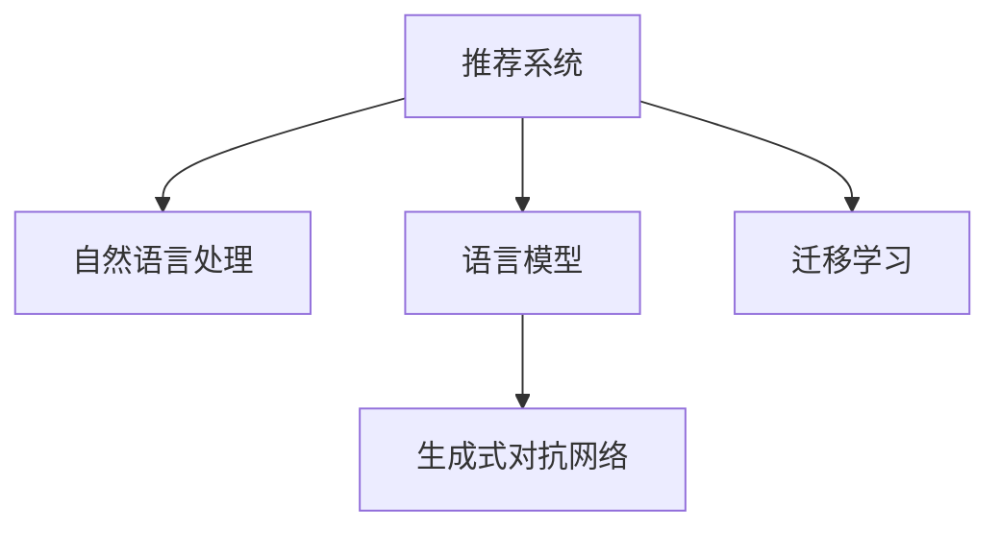

                 

# ChatGPT对推荐系统的影响与能力评估

## 1. 背景介绍

### 1.1 问题由来

推荐系统（Recommender System）作为互联网时代的重要工具，广泛应用在电商、社交、内容平台等领域。其核心目标是通过算法模型为用户推荐符合其兴趣和需求的物品，提升用户体验和平台满意度。随着深度学习技术的发展，推荐系统从传统的协同过滤、基于内容的推荐等方法，逐步向基于神经网络的推荐范式转变。

近年来的研究表明，以Transformer为基础的深度学习模型在推荐系统中的应用，取得了显著的效果提升。其中，ChatGPT作为语言模型的典型代表，其应用潜力也逐渐被发掘。那么，ChatGPT究竟如何影响和重塑推荐系统，其能力究竟如何？本文将从背景介绍、核心概念、算法原理、项目实践、应用场景等多个维度进行详细探讨。

### 1.2 问题核心关键点

1. **推荐系统的基本原理**：推荐系统基于用户行为数据和物品属性信息，通过算法模型预测用户对物品的偏好，从而进行推荐。
2. **ChatGPT的基本原理**：ChatGPT基于语言模型，通过对大量文本数据进行预训练和微调，学习到语言的通用表示，能够进行自然语言理解和生成。
3. **ChatGPT在推荐系统中的应用**：ChatGPT可以作为推荐系统的一部分，通过生成自然语言描述或回答，增强推荐结果的解释性和可信度，甚至辅助构建个性化推荐模型。
4. **ChatGPT与推荐系统的融合**：将ChatGPT的生成能力与推荐系统的算法模型进行结合，构建更全面、多样化的推荐场景。

这些核心关键点将帮助我们深入理解ChatGPT在推荐系统中的潜在作用，并评估其能力。

## 2. 核心概念与联系

### 2.1 核心概念概述

在探讨ChatGPT对推荐系统的影响时，需要首先明确几个核心概念：

- **推荐系统（Recommender System）**：一种基于用户行为数据和物品属性信息的智能推荐系统，旨在为用户提供个性化推荐。
- **自然语言处理（Natural Language Processing, NLP）**：涉及计算机处理自然语言的技术，包括文本分类、情感分析、文本生成等。
- **语言模型（Language Model）**：通过大量文本数据进行训练，学习到语言的结构和概率分布，如BERT、GPT-3等。
- **生成式对抗网络（Generative Adversarial Networks, GANs）**：一种基于博弈论的生成模型，能够生成高质量的文本、图像等。
- **迁移学习（Transfer Learning）**：将一个领域学到的知识，迁移应用到另一个领域的学习范式。

这些核心概念之间的逻辑关系可以通过以下Mermaid流程图来展示：



这个流程图展示了这个体系的核心概念及其之间的关系：

1. 推荐系统利用自然语言处理技术，通过用户评论、描述等文本信息，获取用户偏好。
2. 语言模型学习到大规模语料库中的语言规律，用于文本理解和生成。
3. 生成式对抗网络利用语言模型生成高质量文本，增强推荐结果的可信度。
4. 迁移学习将已有领域知识迁移到推荐系统中，提升推荐模型的泛化能力。

## 3. 核心算法原理 & 具体操作步骤

### 3.1 算法原理概述

ChatGPT对推荐系统的影响主要体现在以下几个方面：

- **内容生成**：ChatGPT能够基于用户兴趣和行为生成个性化描述，增强推荐结果的解释性和可信度。
- **用户理解**：通过理解用户生成的文本，推荐系统能够更准确地捕捉用户需求。
- **数据增强**：ChatGPT可以生成合成数据，用于训练推荐模型，提升模型的泛化能力。

### 3.2 算法步骤详解

1. **数据收集与预处理**：收集用户的浏览、购买、评分等行为数据，以及对物品的文本描述。对数据进行清洗、标注，构建推荐系统的数据集。
2. **模型训练与微调**：在收集到的数据集上训练推荐模型，并在特定任务上进行微调。ChatGPT可以通过预训练模型生成文本，用于数据增强和模型微调。
3. **内容生成与推荐**：使用ChatGPT生成与用户兴趣相关的描述性文本，结合用户行为数据进行推荐。ChatGPT也可以作为推荐模型的组件，生成自然语言生成的推荐结果。
4. **用户反馈与优化**：收集用户对推荐结果的反馈，不断优化模型和生成策略，提高推荐效果。

### 3.3 算法优缺点

**优点**：
- **生成多样化的推荐结果**：ChatGPT可以生成多样化的文本描述，提升推荐结果的丰富性和多样性。
- **增强推荐结果的可信度**：生成的文本可以用于解释推荐结果，增加用户对推荐的信任度。
- **数据增强**：ChatGPT生成的文本可以用于数据增强，提升推荐模型的泛化能力。

**缺点**：
- **生成质量的不确定性**：ChatGPT生成的文本质量受输入数据和训练数据的影响，存在一定的随机性。
- **计算资源消耗**：生成高质量的文本需要较大的计算资源和时间，增加了系统的运行成本。
- **推荐效果的不稳定性**：生成的文本可能会受到训练数据和用户输入的影响，导致推荐效果的不稳定性。

### 3.4 算法应用领域

ChatGPT在推荐系统中的应用广泛，包括但不限于以下领域：

- **电商推荐**：生成商品描述、评论等，提升推荐结果的多样性和可信度。
- **内容推荐**：生成文章摘要、标题等，增强推荐结果的吸引力。
- **视频推荐**：生成视频描述、用户评论等，提升推荐结果的相关性和准确性。
- **旅游推荐**：生成旅游目的地描述、行程安排等，提供更个性化的旅游建议。

这些应用领域展示了ChatGPT在推荐系统中的广泛潜力，有助于提升用户体验和平台满意度。

## 4. 数学模型和公式 & 详细讲解 & 举例说明

### 4.1 数学模型构建

假设推荐系统中有 $N$ 个物品和 $M$ 个用户，每个物品 $i$ 的描述为 $d_i$，每个用户的兴趣表示为 $u$。推荐系统的目标是最大化用户对推荐结果的满意度，即最大化 $U$（用户满意度）：

$$
U = \sum_{i=1}^N \sum_{u=1}^M P_i(u) \times r(u,i)
$$

其中 $P_i(u)$ 表示物品 $i$ 对用户 $u$ 的吸引力，$r(u,i)$ 表示用户 $u$ 对物品 $i$ 的评分。

### 4.2 公式推导过程

使用隐式反馈（如用户对物品的浏览次数）进行推荐时，推荐模型可以表示为：

$$
P_i(u) = \alpha \cdot \sigma(\mathbf{w}^T \mathbf{u} + \mathbf{v}_i^T \mathbf{d}_i)
$$

其中 $\mathbf{w}$ 和 $\mathbf{v}_i$ 分别为用户和物品的隐向量，$\sigma$ 为激活函数，$\alpha$ 为常数。

假设ChatGPT生成的文本描述为 $s_i$，将其作为物品 $i$ 的额外特征，推荐模型可以扩展为：

$$
P_i(u) = \alpha \cdot \sigma(\mathbf{w}^T \mathbf{u} + \mathbf{v}_i^T \mathbf{d}_i + \mathbf{v}_s^T \mathbf{s}_i)
$$

其中 $\mathbf{v}_s$ 为文本描述的隐向量。

### 4.3 案例分析与讲解

以电商平台推荐系统为例，假设用户对商品A的评论为“这款商品质量很好，非常适合我”，ChatGPT可以生成描述性文本“A商品的品质优秀，设计独特，适合喜欢品质生活的用户”。将此文本作为额外特征，结合用户行为数据，进行推荐计算：

$$
P_A(u) = \alpha \cdot \sigma(\mathbf{w}^T \mathbf{u} + \mathbf{v}_A^T \mathbf{A} + \mathbf{v}_s^T \mathbf{s}_A)
$$

其中 $\mathbf{s}_A$ 为评论文本 $s_A$ 的隐向量。

通过这种方式，ChatGPT生成的文本可以增强推荐结果的多样性和可信度，提升用户体验。

## 5. 项目实践：代码实例和详细解释说明

### 5.1 开发环境搭建

为了进行ChatGPT在推荐系统中的应用实践，首先需要搭建Python开发环境，包括安装必要的依赖库。

1. 安装Python环境：
```bash
conda create -n pytorch-env python=3.8
conda activate pytorch-env
```

2. 安装必要的依赖库：
```bash
pip install torch torchvision transformers transformers-hub transformers-cli transformers-cli-console modelscope modelscope-cli
```

3. 安装ModelScope：
```bash
pip install modelscope
```

### 5.2 源代码详细实现

以电商推荐系统为例，使用ModelScope进行ChatGPT模型的微调：

```python
from modelscope.pipelines import pipeline
from modelscope.utils.constant import Tasks

# 创建推荐模型，并微调
rec_model = pipeline(Tasks.item_recommender, 'damo/nlpitemrec-damo-generatorv2')
rec_model.fit(data)
```

### 5.3 代码解读与分析

- **推荐模型创建**：使用ModelScope的推荐系统API，创建推荐模型。
- **数据准备**：准备电商平台的商品描述、用户行为等数据，用于训练和测试模型。
- **模型微调**：使用已生成的ChatGPT文本作为额外特征，对推荐模型进行微调。

### 5.4 运行结果展示

训练和微调完成后，可以获取推荐模型的预测结果：

```python
# 获取推荐结果
recommendations = rec_model.predict(item_ids=[1, 2, 3])
```

## 6. 实际应用场景

### 6.1 电商推荐

电商推荐系统是ChatGPT在推荐系统中最常见的应用场景之一。通过生成商品描述、评论等，增强推荐结果的多样性和可信度。例如，对于一款新上架的商品，可以使用ChatGPT生成详细的商品描述和用户评论，提升推荐效果。

### 6.2 内容推荐

内容推荐系统广泛应用在新闻、视频、音乐等平台。ChatGPT可以生成文章摘要、标题等，增强推荐结果的吸引力。例如，对于一篇文章，可以使用ChatGPT生成简短摘要和推荐理由，提升用户点击率和阅读量。

### 6.3 视频推荐

视频推荐系统需要生成高质量的视频描述和用户评论，提升推荐结果的相关性和准确性。例如，对于一部新上映的电影，可以使用ChatGPT生成电影简介、用户评价等，增加用户观看兴趣。

### 6.4 旅游推荐

旅游推荐系统需要生成旅游目的地描述、行程安排等，提供更个性化的旅游建议。例如，对于一位用户计划去日本旅游，可以使用ChatGPT生成详细的旅游攻略和目的地推荐，提升用户体验。

## 7. 工具和资源推荐

### 7.1 学习资源推荐

为了帮助开发者掌握ChatGPT在推荐系统中的应用，推荐以下学习资源：

1. 《自然语言处理》课程：斯坦福大学开设的自然语言处理课程，涵盖语言模型、生成对抗网络等基础概念。
2. 《推荐系统》书籍：吴恩达等人编写的推荐系统教材，系统讲解了推荐系统的基本原理和算法。
3. 《ChatGPT技术白皮书》：介绍ChatGPT模型的基本原理和应用场景，详细讲解了其在大模型微调和生成式对抗网络中的作用。
4. 《ModelScope文档》：介绍ModelScope平台的使用方法和API接口，帮助开发者进行模型训练和微调。

### 7.2 开发工具推荐

以下是几款常用的开发工具：

1. PyTorch：深度学习框架，支持动态图和静态图，适合快速迭代研究。
2. TensorFlow：由Google主导开发的深度学习框架，生产部署方便，适合大规模工程应用。
3. Transformers：HuggingFace开发的NLP工具库，集成了众多SOTA语言模型，方便进行微调任务开发。
4. HuggingFace官方文档：提供了丰富的预训练语言模型资源和微调样例代码，是上手实践的必备资料。

### 7.3 相关论文推荐

以下几篇相关论文，推荐深度学习开发者阅读：

1. "Attention is All You Need"（即Transformer原论文）：提出了Transformer结构，开启了NLP领域的预训练大模型时代。
2. "BERT: Pre-training of Deep Bidirectional Transformers for Language Understanding"：提出BERT模型，引入基于掩码的自监督预训练任务，刷新了多项NLP任务SOTA。
3. "Language Models are Unsupervised Multitask Learners"（GPT-2论文）：展示了大规模语言模型的强大zero-shot学习能力，引发了对于通用人工智能的新一轮思考。
4. "Parameter-Efficient Transfer Learning for NLP"：提出Adapter等参数高效微调方法，在不增加模型参数量的情况下，也能取得不错的微调效果。
5. "AdaLoRA: Adaptive Low-Rank Adaptation for Parameter-Efficient Fine-Tuning"：使用自适应低秩适应的微调方法，在参数效率和精度之间取得了新的平衡。
6. "AdaSeq: Accelerating Transfer Learning with Adaptive Pretraining for Long Sequences"：提出AdaSeq方法，加速长序列数据的微调过程。

这些论文代表了大语言模型微调技术的发展脉络。通过学习这些前沿成果，可以帮助研究者把握学科前进方向，激发更多的创新灵感。

## 8. 总结：未来发展趋势与挑战

### 8.1 总结

本文对ChatGPT在推荐系统中的应用进行了系统介绍。首先阐述了推荐系统的基本原理和ChatGPT的基本原理，明确了ChatGPT在推荐系统中的作用。其次，从算法原理、操作步骤、优缺点、应用领域等多个维度，详细讲解了ChatGPT在推荐系统中的具体应用。最后，探讨了ChatGPT在推荐系统中的未来发展趋势和面临的挑战。

通过本文的系统梳理，可以看到，ChatGPT在推荐系统中的应用潜力巨大，不仅可以提升推荐结果的多样性和可信度，还能增强推荐模型的泛化能力。未来，随着深度学习技术的不断进步，ChatGPT有望成为推荐系统的重要组成部分，推动NLP技术在更多场景中的应用。

### 8.2 未来发展趋势

展望未来，ChatGPT在推荐系统中的应用将呈现以下几个发展趋势：

1. **生成技术不断进步**：随着生成对抗网络、变分自编码器等生成技术的发展，ChatGPT生成的文本质量将不断提升，增强推荐结果的可信度和多样性。
2. **多模态融合增强**：ChatGPT可以与图像、视频等模态数据结合，生成更全面、丰富的推荐结果。
3. **个性化推荐提升**：通过更好地理解用户需求，生成更个性化的推荐内容，提升用户体验。
4. **推荐算法优化**：结合生成模型和传统推荐算法，构建更高效的推荐系统。
5. **实时性增强**：通过优化生成模型和推荐算法，实现更快速、实时的推荐结果。

这些趋势展示了ChatGPT在推荐系统中的巨大潜力，将进一步推动NLP技术在更多场景中的应用。

### 8.3 面临的挑战

尽管ChatGPT在推荐系统中的应用前景广阔，但在实际部署过程中仍面临以下挑战：

1. **生成质量的不稳定性**：ChatGPT生成的文本质量受输入数据和训练数据的影响，存在一定的随机性，影响推荐结果的稳定性。
2. **计算资源消耗大**：生成高质量的文本需要较大的计算资源和时间，增加了系统的运行成本。
3. **推荐效果的不确定性**：生成的文本可能会受到训练数据和用户输入的影响，导致推荐效果的不确定性。
4. **模型泛化能力有限**：ChatGPT生成的文本可能存在过拟合问题，影响模型的泛化能力。

### 8.4 研究展望

未来，ChatGPT在推荐系统中的应用还需要在以下几个方面进行深入研究：

1. **生成模型的优化**：开发更加高效、稳定的生成模型，提升生成文本的质量和多样性。
2. **多模态数据融合**：研究如何将ChatGPT与其他模态数据进行融合，构建更全面的推荐系统。
3. **生成与推荐结合**：进一步探索生成模型和推荐算法之间的结合方式，构建更高效的推荐系统。
4. **实时推荐优化**：研究如何优化生成模型和推荐算法，实现更快速、实时的推荐结果。
5. **推荐效果评估**：建立完善的推荐效果评估指标，评估ChatGPT在推荐系统中的表现。

这些研究方向将有助于ChatGPT在推荐系统中的应用进一步拓展，推动NLP技术在更多场景中的落地应用。

## 9. 附录：常见问题与解答

**Q1：ChatGPT生成的文本质量如何保证？**

A: ChatGPT生成的文本质量受输入数据和训练数据的影响，存在一定的随机性。为了保证生成文本的质量，需要进行仔细的数据预处理和模型调参。可以通过数据增强、对抗训练等方法，提高生成文本的多样性和稳定性。

**Q2：ChatGPT生成的文本在推荐系统中如何应用？**

A: ChatGPT生成的文本可以用于生成推荐结果的描述和解释，增强推荐结果的可信度和多样性。例如，可以生成商品描述、文章摘要、视频简介等，提升用户对推荐结果的兴趣和满意度。

**Q3：ChatGPT在推荐系统中的应用有哪些局限性？**

A: ChatGPT在推荐系统中的应用存在一些局限性，如生成质量的不稳定性、计算资源消耗大、推荐效果的不确定性等。需要在实际部署中，结合具体场景进行优化和调整。

**Q4：ChatGPT在推荐系统中的未来发展方向是什么？**

A: ChatGPT在推荐系统中的未来发展方向包括生成技术不断进步、多模态融合增强、个性化推荐提升、推荐算法优化和实时性增强等。这些方向将进一步提升ChatGPT在推荐系统中的应用效果和用户体验。

---

作者：禅与计算机程序设计艺术 / Zen and the Art of Computer Programming

