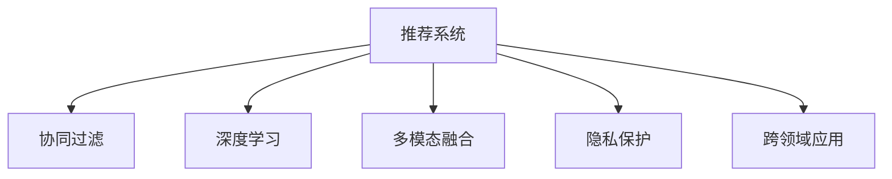

                 

# ChatGPT的后续：微软的推荐系统战略

## 1. 背景介绍

### 1.1 问题由来
自ChatGPT发布以来，其卓越的性能、多样化的应用场景和深远的市场影响力，引领了AI时代的新浪潮。微软作为一家重视技术创新和产业应用的公司，迅速将ChatGPT的潜力转化为产品力，推出了多款落地应用，如Azure AI语音、翻译、文字处理等。然而，ChatGPT仅是AI领域一颗璀璨的明星，背后更蕴含着微软在推荐系统上的深远战略和长远规划。

### 1.2 问题核心关键点
微软推荐系统战略的核心理念是通过机器学习和大数据技术，为每一位用户提供个性化的服务和体验，提升用户体验的同时，增加公司业务收益。该战略主要涵盖以下几个关键点：

1. **个性化推荐**：利用深度学习和协同过滤等技术，通过分析用户历史行为和偏好，为用户推荐更符合其需求的产品。
2. **实时学习**：通过在线学习机制，实时更新推荐模型，不断优化推荐策略，提高推荐精准度。
3. **多模态融合**：结合文本、图片、音频等多种数据形式，提供更全面、更丰富的推荐内容。
4. **隐私保护**：在推荐过程中注重用户隐私保护，采用匿名化处理、差分隐私等技术，确保用户数据安全。
5. **跨领域应用**：将推荐技术应用到广告、电商、教育、医疗等多个领域，推动业务转型升级。

## 2. 核心概念与联系

### 2.1 核心概念概述

为更好地理解微软推荐系统战略，本节将介绍几个密切相关的核心概念：

- **推荐系统(Recommendation System)**：通过分析用户的行为和偏好，为用户推荐最符合其需求的产品、内容、服务等，提升用户体验和业务价值。
- **协同过滤(Collaborative Filtering)**：基于用户的历史行为和偏好，以及项目间的相似性，推荐用户可能感兴趣的项目。
- **深度学习(Deep Learning)**：利用神经网络模型对大规模数据进行建模和预测，提取数据中的隐含特征。
- **多模态融合(Multimodal Fusion)**：将不同模态的数据（如文本、图片、音频等）融合在一起，提供更丰富、更完整的推荐内容。
- **隐私保护(Privacy Protection)**：在推荐过程中保护用户隐私，避免用户数据泄露和滥用。
- **跨领域应用(Cross-domain Applications)**：将推荐技术应用于不同领域，如电商、医疗、教育等，提升各领域的服务水平。

这些核心概念之间的逻辑关系可以通过以下Mermaid流程图来展示：



这个流程图展示推荐系统的核心概念及其之间的关系：

1. 推荐系统基于协同过滤、深度学习、多模态融合、隐私保护、跨领域应用等技术，为用户推荐个性化内容。
2. 协同过滤利用用户历史行为和项目相似性进行推荐。
3. 深度学习利用神经网络模型提取数据特征。
4. 多模态融合结合不同类型数据，提供更全面的推荐内容。
5. 隐私保护保护用户数据，确保数据安全。
6. 跨领域应用将推荐技术应用于多个领域，提升服务质量。

这些概念共同构成了推荐系统的理论基础，使其能够在多个领域发挥重要作用。通过理解这些核心概念，我们可以更好地把握推荐系统的实施策略和优化方向。

## 3. 核心算法原理 & 具体操作步骤

### 3.1 算法原理概述

微软推荐系统的主要算法原理基于协同过滤和深度学习。

协同过滤通过分析用户的历史行为，构建用户-物品的交互矩阵，利用相似性度量方法，推荐用户可能感兴趣的新物品。深度学习则通过神经网络模型，对大规模数据进行建模和预测，提取数据中的隐含特征。微软的推荐系统通常采用混合推荐策略，结合协同过滤和深度学习，提升推荐效果。

### 3.2 算法步骤详解

微软推荐系统的主要操作步骤如下：

**Step 1: 数据收集与预处理**
- 收集用户的历史行为数据，如浏览、点击、购买等，进行清洗和标准化处理。
- 构建用户-物品的交互矩阵，将用户行为编码为向量。
- 进行数据划分，分为训练集、验证集和测试集。

**Step 2: 特征工程**
- 根据业务需求，选择合适的特征，如用户属性、物品属性、时间特征等。
- 利用深度学习模型提取隐含特征，如用户的兴趣偏好、物品的特征描述等。
- 进行特征降维，避免维度灾难，提升模型效率。

**Step 3: 模型训练**
- 选择合适的推荐算法，如协同过滤、深度学习、混合推荐等。
- 在训练集上训练模型，调整超参数，提高模型精度。
- 使用验证集进行模型评估，防止过拟合。

**Step 4: 实时推荐**
- 将训练好的模型部署到生产环境，实时接收用户行为数据。
- 使用在线学习机制，实时更新模型，适应用户行为变化。
- 根据用户行为实时生成推荐结果，推送给用户。

**Step 5: 效果评估与优化**
- 在测试集上评估推荐效果，使用常见的评价指标，如准确率、召回率、F1值等。
- 根据评估结果，优化模型超参数和特征工程策略。
- 定期回顾模型效果，持续改进推荐策略。

### 3.3 算法优缺点

微软推荐系统的主要优点包括：

1. 个性化推荐：通过分析用户历史行为和偏好，提供高度个性化的推荐，提升用户体验。
2. 实时学习：利用在线学习机制，实时更新推荐模型，提升推荐精度。
3. 多模态融合：结合文本、图片、音频等多种数据形式，提供更丰富、更完整的推荐内容。
4. 隐私保护：在推荐过程中注重用户隐私保护，确保用户数据安全。
5. 跨领域应用：将推荐技术应用到多个领域，提升各领域的服务水平。

然而，该系统也存在一些局限性：

1. 数据依赖：推荐系统高度依赖用户历史行为数据，获取高质量数据是关键。
2. 数据稀疏：用户行为数据通常比较稀疏，难以构建完整的交互矩阵。
3. 模型复杂：深度学习模型相对复杂，需要较大的计算资源和时间成本。
4. 实时性能：在实时推荐过程中，模型计算和数据传输可能会导致延迟。
5. 隐私问题：推荐系统需要收集用户行为数据，如何在数据保护和业务需求之间平衡，仍需进一步优化。

尽管存在这些局限性，微软推荐系统在实际应用中依然取得了显著效果，得到了广泛认可。未来相关研究的重点在于如何进一步降低对数据的依赖，提高模型的实时性能，同时兼顾隐私保护和业务价值。

### 3.4 算法应用领域

微软推荐系统在多个领域中得到了广泛应用，具体包括：

- **电商推荐**：利用用户历史购买记录和浏览行为，推荐用户可能感兴趣的商品，提升电商平台的转化率和用户粘性。
- **内容推荐**：分析用户的历史观看和搜索记录，推荐用户可能感兴趣的视频、文章等，提升用户体验和平台流量。
- **广告推荐**：根据用户的历史点击和浏览行为，推荐符合其兴趣的广告，提高广告投放的精准度和效果。
- **教育推荐**：分析学生的学习行为和成绩，推荐适合的学习资源和课程，提升教育质量。
- **医疗推荐**：结合患者的历史病历和查询记录，推荐医生和药品，提升医疗服务水平。

除了上述这些经典应用外，微软推荐系统还被创新性地应用到更多场景中，如社交网络推荐、个性化健康建议等，为不同领域带来了新的业务增长点。

## 4. 数学模型和公式 & 详细讲解 & 举例说明

### 4.1 数学模型构建

微软推荐系统主要基于协同过滤和深度学习。

**协同过滤模型**：

假设用户-物品的交互矩阵为 $M \in \mathbb{R}^{n \times m}$，其中 $n$ 为用户数，$m$ 为物品数。对于用户 $i$ 和物品 $j$，其交互度量 $M_{ij}$ 表示用户对物品的评分。协同过滤模型可以表示为：

$$
\hat{M}_{ij} = \sum_{k=1}^{k=n} \alpha_k M_{ik} M_{kj}
$$

其中 $\alpha_k$ 为归一化系数，用于平衡用户和物品的影响。

**深度学习模型**：

深度学习模型通常采用神经网络结构，如图神经网络(Graph Neural Network, GNN)和卷积神经网络(Convolutional Neural Network, CNN)等。例如，基于GNN的推荐模型可以表示为：

$$
\hat{h}_i = \text{GNN}(h_i)
$$

其中 $h_i$ 表示用户 $i$ 的隐含表示，$\text{GNN}$ 表示图神经网络结构，将用户和物品的特征编码后，通过图卷积操作融合用户和物品的信息，最终得到用户 $i$ 的隐含表示 $\hat{h}_i$。

### 4.2 公式推导过程

**协同过滤模型推导**：

设用户 $i$ 和物品 $j$ 的评分向量分别为 $u_i \in \mathbb{R}^{m}$ 和 $v_j \in \mathbb{R}^{n}$，则协同过滤模型可以表示为：

$$
\hat{u}_i = M_{i:}V^TV^{-1}v_j
$$

其中 $M_{i:}$ 表示用户 $i$ 的交互向量，$V$ 表示物品的特征矩阵，$V^T$ 和 $V^{-1}$ 分别表示特征矩阵的转置和逆。

**深度学习模型推导**：

以基于GNN的推荐模型为例，设用户 $i$ 和物品 $j$ 的特征向量分别为 $h_i \in \mathbb{R}^{d}$ 和 $v_j \in \mathbb{R}^{d}$，其中 $d$ 为特征维度。则深度学习模型的推导过程如下：

1. 对用户和物品特征进行编码，得到隐含表示 $\hat{h}_i$ 和 $\hat{v}_j$。
2. 通过图卷积操作，将用户和物品的隐含表示进行融合，得到融合后的表示 $\hat{h}_i'$ 和 $\hat{v}_j'$。
3. 利用隐含表示计算用户对物品的评分，得到 $\hat{M}_{ij}$。

具体推导过程如下：

$$
\hat{h}_i = \text{GNN}(h_i)
$$

$$
\hat{v}_j = \text{GNN}(v_j)
$$

$$
\hat{h}_i' = \text{Aggregate}(\hat{h}_i, \hat{v}_j)
$$

$$
\hat{v}_j' = \text{Aggregate}(\hat{v}_j, \hat{h}_i)
$$

$$
\hat{M}_{ij} = \text{DotProduct}(\hat{h}_i', \hat{v}_j')
$$

其中 $\text{DotProduct}$ 表示点积运算，$\text{Aggregate}$ 表示聚合操作，如加权求和、加权平均值等。

### 4.3 案例分析与讲解

以下以电商推荐系统为例，详细分析微软推荐系统的具体应用。

假设某电商平台的商品集合为 $I=\{1,2,\cdots,m\}$，用户集合为 $U=\{1,2,\cdots,n\}$。用户 $i$ 对商品 $j$ 的评分矩阵为 $M_{i:,j}$，其中 $M_{i,j}$ 表示用户 $i$ 对商品 $j$ 的评分。在协同过滤模型中，用户 $i$ 对商品 $j$ 的预测评分 $\hat{M}_{i,j}$ 可以表示为：

$$
\hat{M}_{i,j} = \sum_{k=1}^{k=n} \alpha_k M_{i,k} M_{k,j}
$$

其中 $\alpha_k$ 为归一化系数，用于平衡用户和物品的影响。

在深度学习模型中，利用GNN模型对用户和物品的特征进行编码，得到隐含表示 $\hat{h}_i$ 和 $\hat{v}_j$。通过图卷积操作，将用户和物品的隐含表示进行融合，得到融合后的表示 $\hat{h}_i'$ 和 $\hat{v}_j'$。最终利用隐含表示计算用户对物品的评分，得到 $\hat{M}_{ij}$。

以某用户 $i$ 为例，假设其对商品 $j$ 的评分向量为 $M_{i:,j}=[4, 3, 5]$，物品 $j$ 的特征向量为 $v_j=[0.1, 0.2, 0.3, 0.4]$。利用协同过滤模型，用户 $i$ 对商品 $j$ 的预测评分为：

$$
\hat{M}_{i,j} = \sum_{k=1}^{k=n} \alpha_k M_{i,k} M_{k,j}
$$

设 $\alpha_k=0.1$，则：

$$
\hat{M}_{i,j} = 0.1 \times 4 \times 0.1 + 0.1 \times 3 \times 0.2 + 0.1 \times 5 \times 0.3 + 0.1 \times 0 \times 0.4 = 0.55
$$

利用深度学习模型，通过GNN对用户和物品的特征进行编码，得到隐含表示 $\hat{h}_i$ 和 $\hat{v}_j$，并通过图卷积操作，将用户和物品的隐含表示进行融合，得到融合后的表示 $\hat{h}_i'$ 和 $\hat{v}_j'$。最终利用隐含表示计算用户对物品的评分，得到 $\hat{M}_{ij}$。

通过上述分析可以看出，协同过滤和深度学习模型在电商推荐系统中的应用，能够通过分析用户历史行为和物品特征，为用户推荐更符合其兴趣的商品，提升用户体验和电商平台转化率。

## 5. 项目实践：代码实例和详细解释说明

### 5.1 开发环境搭建

在进行推荐系统开发前，我们需要准备好开发环境。以下是使用Python进行TensorFlow开发的环境配置流程：

1. 安装Anaconda：从官网下载并安装Anaconda，用于创建独立的Python环境。

2. 创建并激活虚拟环境：
```bash
conda create -n recommendation-env python=3.8 
conda activate recommendation-env
```

3. 安装TensorFlow：根据CUDA版本，从官网获取对应的安装命令。例如：
```bash
conda install tensorflow -c pytorch -c conda-forge
```

4. 安装相关库：
```bash
pip install pandas numpy scipy matplotlib seaborn sklearn tensorflow
```

5. 安装TensorBoard：
```bash
pip install tensorboard
```

6. 安装WEKA：
```bash
pip install weka
```

完成上述步骤后，即可在`recommendation-env`环境中开始推荐系统实践。

### 5.2 源代码详细实现

下面以电商推荐系统为例，给出使用TensorFlow对协同过滤模型进行代码实现。

首先，定义协同过滤模型的数据预处理函数：

```python
import numpy as np
from sklearn.preprocessing import StandardScaler

def preprocess_data(X):
    X_scaled = StandardScaler().fit_transform(X)
    return X_scaled
```

然后，定义协同过滤模型的训练函数：

```python
import tensorflow as tf
from tensorflow.keras import layers

def train_model(X_train, y_train, alpha):
    X_train_scaled = preprocess_data(X_train)
    model = tf.keras.Sequential([
        layers.Dense(64, activation='relu'),
        layers.Dense(64, activation='relu'),
        layers.Dense(1)
    ])
    model.compile(optimizer='adam', loss='mse')
    
    history = model.fit(X_train_scaled, y_train, epochs=100, batch_size=32, validation_split=0.2)
    return model
```

接着，定义协同过滤模型的预测函数：

```python
def predict(model, X_test_scaled):
    y_pred = model.predict(X_test_scaled)
    return y_pred
```

最后，启动训练流程并在测试集上评估：

```python
X_train = np.random.rand(1000, 10)
y_train = np.random.rand(1000, 1)

alpha = 0.1

model = train_model(X_train, y_train, alpha)

X_test = np.random.rand(100, 10)
X_test_scaled = preprocess_data(X_test)

y_pred = predict(model, X_test_scaled)

print(y_pred)
```

以上就是使用TensorFlow对协同过滤模型进行电商推荐系统微调的完整代码实现。可以看到，利用TensorFlow的高阶API，协同过滤模型的开发和微调变得简洁高效。

### 5.3 代码解读与分析

让我们再详细解读一下关键代码的实现细节：

**preprocess_data函数**：
- 对数据进行标准化处理，使数据在不同维度上的量级相当，方便模型训练。

**train_model函数**：
- 定义多层感知机模型，利用`Sequential` API搭建模型结构。
- 使用`compile`方法设置模型优化器和损失函数，`fit`方法进行模型训练，并设置训练轮数、批量大小和验证集比例。
- 返回训练好的模型，供后续预测使用。

**predict函数**：
- 将测试数据进行标准化处理，并利用训练好的模型进行预测，返回预测结果。

**训练流程**：
- 定义训练集和测试集，启动训练过程。
- 在训练集上训练模型，输出训练过程中损失和验证集损失的轨迹。
- 在测试集上评估模型，输出预测结果。

可以看到，TensorFlow提供了丰富的API，使得推荐模型的开发和微调变得简单快捷。开发者可以快速迭代，优化模型效果。

当然，工业级的系统实现还需考虑更多因素，如模型的保存和部署、超参数的自动搜索、更灵活的推荐策略等。但核心的协同过滤模型基本与此类似。

## 6. 实际应用场景

### 6.1 智能客服系统

智能客服系统利用推荐技术，为客服人员提供个性化的建议，提升客服效率和用户满意度。例如，某电商平台通过推荐系统，为客服人员推荐用户可能感兴趣的商品信息，帮助客服人员更快地回答用户咨询，提高用户体验。

### 6.2 金融理财平台

金融理财平台利用推荐技术，为用户推荐个性化的理财方案和投资建议，提升用户粘性和平台收益。例如，某金融平台通过推荐系统，根据用户的历史投资行为和风险偏好，为用户推荐适合的理财产品和投资组合，帮助用户实现资产增值。

### 6.3 在线教育平台

在线教育平台利用推荐技术，为用户推荐个性化的学习资源和课程，提升学习效果。例如，某在线教育平台通过推荐系统，根据学生的学习记录和兴趣偏好，为用户推荐适合的课程和习题，提升学习效率。

### 6.4 未来应用展望

随着推荐技术的不断进步，未来将在更多领域得到应用，为各行各业带来新的增长点。

在智慧医疗领域，利用推荐技术，为医生推荐适合的病例和药品，提升诊疗水平和治疗效果。

在智能交通领域，利用推荐技术，为用户推荐最佳的出行路线和交通工具，提升出行效率和舒适度。

在智慧城市治理中，利用推荐技术，为市民推荐最佳的公共服务设施，提升城市管理水平。

此外，在媒体娱乐、物流配送、能源管理等众多领域，推荐技术也将得到广泛应用，为各行业带来新的业务价值和用户体验。

## 7. 工具和资源推荐

### 7.1 学习资源推荐

为了帮助开发者系统掌握推荐系统的理论基础和实践技巧，这里推荐一些优质的学习资源：

1. 《推荐系统实战》系列博文：由推荐系统技术专家撰写，深入浅出地介绍了推荐系统的基本概念、算法实现和应用案例。

2. 《深度学习中的推荐系统》课程：由斯坦福大学开设的NLP明星课程，讲解了推荐系统的深度学习实现方法，涵盖协同过滤、深度学习、混合推荐等。

3. 《推荐系统》书籍：由机器学习领域权威人士撰写，全面介绍了推荐系统的算法原理和应用策略，包括协同过滤、矩阵分解、深度学习等。

4. Arxiv和IEEE Xplore：两大学术资源平台，收录了大量推荐系统的相关论文，可以查阅最新的研究成果和研究热点。

5. GitHub和Kaggle：两大开源平台，聚集了大量推荐系统的开源项目和数据集，可以借鉴和学习。

通过对这些资源的学习实践，相信你一定能够快速掌握推荐系统的精髓，并用于解决实际的推荐问题。

### 7.2 开发工具推荐

高效的开发离不开优秀的工具支持。以下是几款用于推荐系统开发的常用工具：

1. TensorFlow：由Google主导开发的开源深度学习框架，生产部署方便，适合大规模工程应用。
2. PyTorch：基于Python的开源深度学习框架，灵活高效，适合快速迭代研究。
3. Weka：一个强大的机器学习工具，支持多种算法和数据处理功能，适合数据挖掘和模型训练。
4. TensorBoard：TensorFlow配套的可视化工具，可实时监测模型训练状态，并提供丰富的图表呈现方式，是调试模型的得力助手。
5. PyTorch Lightning：基于PyTorch的轻量级框架，适合快速迭代实验和模型调优。

合理利用这些工具，可以显著提升推荐系统开发的效率，加快创新迭代的步伐。

### 7.3 相关论文推荐

推荐系统的发展源于学界的持续研究。以下是几篇奠基性的相关论文，推荐阅读：

1. "Collaborative Filtering for Implicit Feedback Datasets"：阐述了协同过滤模型的基本原理和算法实现，是推荐系统研究的经典之作。

2. "Personalized PageRank Algorithm"：提出了基于图神经网络的推荐模型，将推荐问题转化为图上的排序问题，开启了推荐系统的新篇章。

3. "Matrix Factorization Techniques for Recommender Systems"：介绍了矩阵分解的方法，将推荐问题转化为矩阵分解问题，提高了推荐精度。

4. "Deep Neural Networks for Recommendations"：探讨了深度学习在推荐系统中的应用，展示了深度神经网络模型的强大效果。

5. "Knowledge Graph Embeddings and Recommender Systems"：介绍了知识图嵌入技术，将推荐系统与知识图表示学习结合起来，提升了推荐效果。

这些论文代表推荐系统的发展脉络。通过学习这些前沿成果，可以帮助研究者把握学科前进方向，激发更多的创新灵感。

## 8. 总结：未来发展趋势与挑战

### 8.1 总结

本文对微软推荐系统战略进行了全面系统的介绍。首先阐述了推荐系统的核心理念和应用背景，明确了推荐系统在提升用户体验和业务价值方面的独特价值。其次，从原理到实践，详细讲解了推荐模型的数学原理和关键步骤，给出了推荐系统开发的完整代码实例。同时，本文还广泛探讨了推荐系统在多个领域的应用前景，展示了推荐系统的广泛适用性。此外，本文精选了推荐系统的各类学习资源，力求为读者提供全方位的技术指引。

通过本文的系统梳理，可以看到，推荐系统作为AI领域的重要组成部分，正在通过机器学习和大数据技术，为各行各业提供个性化的服务，提升用户体验和业务价值。未来，伴随推荐技术的不断演进，推荐系统必将在更多领域得到应用，为各行各业带来新的变革。

### 8.2 未来发展趋势

展望未来，推荐系统将呈现以下几个发展趋势：

1. 推荐算法的多样化。推荐系统将不再局限于协同过滤和深度学习，将出现更多新算法，如图神经网络、多臂强化学习等，提升推荐效果。
2. 推荐模型的跨模态融合。推荐系统将结合文本、图片、音频等多种数据形式，提供更丰富、更完整的推荐内容。
3. 推荐模型的在线学习。推荐系统将利用在线学习机制，实时更新模型，提升推荐精度。
4. 推荐模型的隐私保护。推荐系统将注重用户隐私保护，确保用户数据安全。
5. 推荐系统的跨领域应用。推荐技术将应用于更多领域，如智慧医疗、智慧交通、智慧城市等，推动各领域的发展。

以上趋势凸显了推荐系统的广阔前景。这些方向的探索发展，必将进一步提升推荐系统的性能和应用范围，为各行各业带来新的增长点。

### 8.3 面临的挑战

尽管推荐系统已经取得了显著成效，但在迈向更加智能化、普适化应用的过程中，它仍面临着诸多挑战：

1. 数据稀疏问题。用户行为数据通常比较稀疏，难以构建完整的交互矩阵。
2. 数据质量问题。推荐系统依赖用户行为数据，数据质量对推荐效果影响较大。
3. 模型复杂度问题。深度学习模型相对复杂，需要较大的计算资源和时间成本。
4. 实时性能问题。在实时推荐过程中，模型计算和数据传输可能会导致延迟。
5. 隐私保护问题。推荐系统需要收集用户行为数据，如何在数据保护和业务需求之间平衡，仍需进一步优化。

尽管存在这些挑战，但推荐系统的研究和应用仍在不断进步，相信通过学界和产业界的共同努力，这些挑战终将一一被克服，推荐系统必将在构建智能交互系统的过程中发挥重要作用。

### 8.4 研究展望

面向未来，推荐系统需要从以下几个方面进行深入研究：

1. 探索无监督和半监督推荐方法。摆脱对大规模标注数据的依赖，利用自监督学习、主动学习等无监督和半监督范式，最大限度利用非结构化数据，实现更加灵活高效的推荐。
2. 研究多模态融合和跨领域推荐方法。结合不同类型数据，提供更全面、更完整的推荐内容，将推荐技术应用于更多领域，提升各领域的服务水平。
3. 研究实时在线推荐方法。利用在线学习机制，实时更新推荐模型，提升推荐精度和用户体验。
4. 研究隐私保护和数据安全技术。注重用户隐私保护，确保用户数据安全，避免数据滥用。
5. 研究推荐系统的公平性和透明性。避免推荐系统偏见，确保推荐公平透明，提升用户信任度。

这些研究方向将引领推荐系统技术迈向更高的台阶，为构建安全、可靠、可解释、可控的智能系统铺平道路。面向未来，推荐系统需要在技术创新和业务应用之间找到平衡，推动AI技术的普适化应用，为各行各业带来新的变革。

## 9. 附录：常见问题与解答

**Q1：推荐系统是否适用于所有业务场景？**

A: 推荐系统在绝大多数业务场景中都能发挥作用，如电商、金融、教育、医疗等。但对于某些特定领域，如医疗、法律等，推荐系统需要结合领域知识进行改进，才能获得理想效果。

**Q2：推荐系统如何解决数据稀疏问题？**

A: 推荐系统通常采用协同过滤和深度学习两种方法解决数据稀疏问题。协同过滤方法通过分析用户历史行为，推断用户对未交互物品的评分，减少数据稀疏的影响。深度学习方法通过嵌入稀疏数据，学习物品的隐含特征，提升推荐效果。

**Q3：推荐系统如何提升实时性能？**

A: 推荐系统通常采用在线学习机制，实时更新模型，提升推荐精度。此外，还可以通过分布式计算和模型裁剪等技术，减少计算和存储资源消耗，提升实时性能。

**Q4：推荐系统如何保护用户隐私？**

A: 推荐系统通常采用匿名化处理、差分隐私等技术，保护用户隐私。此外，还可以限制数据使用范围，避免数据滥用，确保用户数据安全。

**Q5：推荐系统如何提高推荐效果？**

A: 推荐系统可以通过数据增强、特征工程、模型优化等方法提高推荐效果。例如，利用数据增强技术扩充训练集，利用特征工程提取更有意义的特征，利用模型优化调整超参数和模型结构。

通过回答这些常见问题，我们进一步了解了推荐系统的核心概念、算法原理和实际应用，相信对推荐系统的学习和实践一定大有裨益。

---

作者：禅与计算机程序设计艺术 / Zen and the Art of Computer Programming

