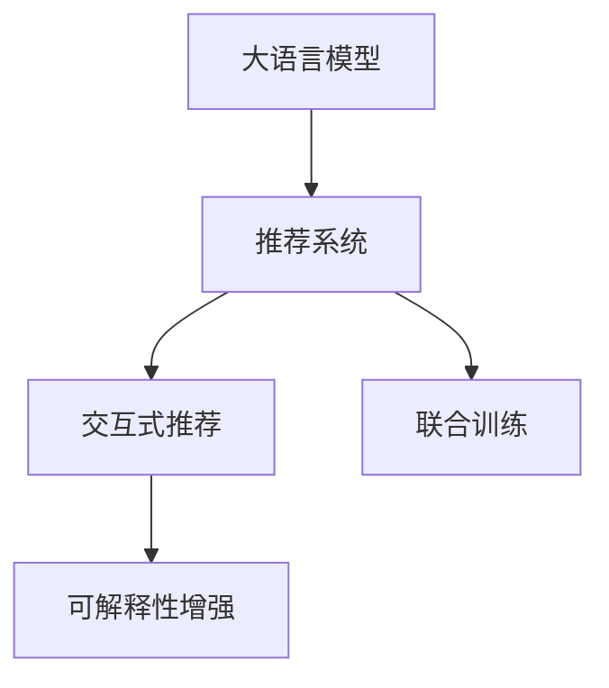

                 

## 1. 背景介绍

在当今信息爆炸的时代，推荐系统已经成为了各个在线平台上不可或缺的一部分。无论是电商平台、视频网站、音乐平台，还是社交媒体，推荐系统都在努力为用户提供个性化的内容推荐，从而提升用户体验、增加平台粘性。然而，随着用户需求的多样化，传统的推荐算法已经难以满足用户的个性化需求。

大语言模型（Large Language Model，简称LLM）作为近年来自然语言处理领域的重大突破，具备了强大的自然语言理解和生成能力。结合LLM技术，推荐系统可以更深入地理解用户的语言表达，提供更加丰富、准确的个性化推荐。与此同时，LLM模型的解释性较差，这限制了其在推荐系统中的应用。因此，亟需一种新的推荐系统架构，既能充分利用LLM的强大能力，又能解决其解释性不足的问题。

本文旨在介绍一种基于LLM的交互式、可解释的推荐系统架构——Chat-Rec。Chat-Rec通过引入自然语言交互模块，使得推荐系统具备了与用户进行自然语言交流的能力，能够更加灵活地响应用户的需求。同时，系统采用可解释性增强技术，确保推荐过程的透明和可信。

## 2. 核心概念与联系

### 2.1 核心概念概述

为更好地理解Chat-Rec的工作原理，本节将介绍几个关键概念：

- 大语言模型（LLM）：一种大规模预训练语言模型，能够理解并生成自然语言，具备强大的语言理解和生成能力。
- 推荐系统（Recommendation System）：一种根据用户的历史行为、偏好等信息，为用户推荐个性化的内容或商品的系统。
- 交互式推荐（Interactive Recommendation）：结合自然语言交互技术，允许用户通过自然语言方式表达需求，进行推荐系统的交互式查询。
- 可解释性增强（Explainability Enhancement）：通过引入可解释性技术，确保推荐过程的透明和可信，使用户能够理解推荐结果的生成机制。
- 联合训练（Joint Training）：将推荐算法和LLM模型共同训练，使得模型能够同时优化推荐效果和语言理解能力。

这些概念之间的逻辑关系可以通过以下Mermaid流程图来展示：



这个流程图展示了Chat-Rec的各个核心模块：

1. 大语言模型：作为知识库，提供丰富的语言理解能力。
2. 推荐系统：根据用户需求，为用户推荐内容或商品。
3. 交互式推荐：与用户进行自然语言交互，获取用户需求。
4. 可解释性增强：确保推荐过程的透明和可信。
5. 联合训练：将推荐算法和LLM模型共同训练，优化整体性能。

这些概念共同构成了Chat-Rec推荐系统的核心框架，使其能够在用户交互中灵活响应，同时提供可解释性的推荐结果。

## 3. 核心算法原理 & 具体操作步骤
### 3.1 算法原理概述

Chat-Rec的核心算法原理可以概括为以下几个步骤：

1. **用户交互**：用户通过自然语言向系统提出查询，系统通过交互式推荐模块理解用户需求。
2. **知识检索**：LLM模型从知识库中检索与用户查询相关的信息。
3. **推荐计算**：推荐系统根据LLM模型的输出，计算推荐的商品或内容。
4. **结果反馈**：系统将推荐结果呈现给用户，并根据用户反馈进行迭代优化。

通过联合训练，系统可以同时优化推荐算法和LLM模型，提升推荐效果和语言理解能力。

### 3.2 算法步骤详解

下面将详细介绍Chat-Rec算法的主要步骤：

#### 3.2.1 用户交互

用户通过自然语言向系统提出查询，例如：“我想找一些适合夏天穿的连衣裙。”

系统通过交互式推荐模块理解用户查询，并提取关键信息。交互式推荐模块通常包含以下几个组件：

- **查询解析器**：解析用户查询，提取关键词和实体。
- **意图识别器**：识别用户的意图，判断用户是想找商品、浏览商品信息还是进行评论。
- **上下文管理器**：管理用户的历史查询和行为，用于个性化推荐。

交互式推荐模块的具体实现可以采用自然语言处理技术，如分词、命名实体识别、意图分类等。

#### 3.2.2 知识检索

LLM模型根据用户查询，从知识库中检索相关信息。知识库可以是一个大型的语料库，也可以是一个结构化的数据库。

在知识检索阶段，LLM模型通常采用掩码语言模型（Masked Language Model，简称MLM）任务进行训练，使其具备理解和生成自然语言的能力。常见的掩码语言模型任务包括：

- **掩码词语预测**：预测被掩码的词语，训练模型理解上下文。
- **掩码句子预测**：预测被掩码的句子，训练模型理解整体语义。
- **掩码段落预测**：预测被掩码的段落，训练模型理解长文本语义。

通过掩码语言模型任务，LLM模型能够从知识库中检索到与用户查询相关的信息，并生成相应的上下文。

#### 3.2.3 推荐计算

推荐系统根据LLM模型的输出，计算推荐结果。推荐系统通常包含以下几个组件：

- **协同过滤**：基于用户历史行为和相似用户的行为，推荐商品或内容。
- **内容推荐**：基于商品或内容的属性和标签，推荐相关商品或内容。
- **混合推荐**：结合协同过滤和内容推荐，提供更加精准的推荐结果。

推荐系统的推荐算法可以采用多种方式，如基于矩阵分解、基于深度学习、基于图模型等。在Chat-Rec中，推荐系统与LLM模型联合训练，能够同时优化推荐效果和语言理解能力。

#### 3.2.4 结果反馈

系统将推荐结果呈现给用户，并根据用户反馈进行迭代优化。用户反馈可以采用多种方式，如点击、收藏、评分等。

在结果反馈阶段，系统可以采用强化学习技术，根据用户反馈优化推荐算法和LLM模型。常见的强化学习技术包括：

- **基于奖励的强化学习**：通过设定奖励函数，鼓励用户对推荐结果进行点击、收藏等操作。
- **基于逆奖励的强化学习**：通过设定逆奖励函数，惩罚用户对推荐结果的不满意。
- **基于多臂老虎机的强化学习**：通过多臂老虎机算法，探索不同推荐策略，选择最优策略。

通过结果反馈和迭代优化，Chat-Rec能够不断提升推荐效果和用户满意度。

### 3.3 算法优缺点

Chat-Rec作为一种新的推荐系统架构，具备以下优点：

1. **交互式推荐**：结合自然语言交互技术，允许用户通过自然语言方式表达需求，进行推荐系统的交互式查询。
2. **可解释性增强**：通过引入可解释性技术，确保推荐过程的透明和可信，使用户能够理解推荐结果的生成机制。
3. **联合训练**：将推荐算法和LLM模型共同训练，优化推荐效果和语言理解能力。
4. **灵活扩展**：可以根据不同的应用场景，灵活设计交互式推荐和知识检索模块。

同时，Chat-Rec也存在一些局限性：

1. **计算复杂度高**：由于结合了LLM模型，计算复杂度较高，需要高效的计算资源支持。
2. **数据质量要求高**：知识库中的数据质量直接影响推荐结果，需要确保数据的高质量和更新频率。
3. **维护成本高**：系统的维护和更新需要较高的技术门槛，需要专业的团队进行维护。

尽管存在这些局限性，但Chat-Rec在个性化推荐和用户交互方面具备显著优势，有望在未来推荐系统中发挥重要作用。

### 3.4 算法应用领域

Chat-Rec可以应用于多个领域，例如：

- **电商推荐**：结合用户的历史购物记录和自然语言查询，为用户推荐商品。
- **视频推荐**：根据用户对视频的评分和自然语言反馈，推荐相关视频内容。
- **音乐推荐**：根据用户对歌曲的喜好和自然语言描述，推荐相似音乐。
- **社交推荐**：根据用户的社交行为和自然语言描述，推荐相似用户或内容。

Chat-Rec不仅能够提升推荐系统的个性化程度，还能通过自然语言交互技术，增强用户的互动体验。

## 4. 数学模型和公式 & 详细讲解  
### 4.1 数学模型构建

Chat-Rec的核心数学模型包括掩码语言模型和推荐算法。以下将详细介绍这两个模型的构建和优化。

#### 4.1.1 掩码语言模型

掩码语言模型可以采用掩码词语预测任务进行训练，其目标是通过预测掩码词语来理解上下文。

假设掩码语言模型的输入为 $x$，输出为 $y$，掩码位置为 $m$。掩码语言模型的目标函数为：

$$
\mathcal{L}_{MLM} = -\frac{1}{N} \sum_{i=1}^N \log P(y_i | x_m, x_{-m})
$$

其中，$P(y_i | x_m, x_{-m})$ 表示在掩码位置 $m$ 和上下文 $x_{-m}$ 下，预测词语 $y_i$ 的概率。

#### 4.1.2 推荐算法

推荐算法可以采用基于矩阵分解的方法进行优化，其目标函数为：

$$
\mathcal{L}_{Rec} = -\frac{1}{N} \sum_{i=1}^N \log P(r_i | u_i, i)
$$

其中，$r_i$ 表示用户 $u_i$ 对商品 $i$ 的评分，$P(r_i | u_i, i)$ 表示在用户 $u_i$ 和商品 $i$ 的情况下，评分 $r_i$ 的概率。

#### 4.2 公式推导过程

以下将详细介绍掩码语言模型和推荐算法的推导过程：

#### 4.2.1 掩码语言模型推导

掩码语言模型的推导过程如下：

$$
\begin{aligned}
\mathcal{L}_{MLM} &= -\frac{1}{N} \sum_{i=1}^N \log P(y_i | x_m, x_{-m}) \\
&= -\frac{1}{N} \sum_{i=1}^N \log \frac{exp(\log P(y_i | x_m, x_{-m}))}{\sum_{j=1}^M exp(\log P(y_j | x_m, x_{-m}))} \\
&= -\frac{1}{N} \sum_{i=1}^N (\log P(y_i | x_m, x_{-m}) + \log \sum_{j=1}^M P(y_j | x_m, x_{-m})) \\
&= -\frac{1}{N} \sum_{i=1}^N (\log P(y_i | x_m, x_{-m}) + \log \sum_{j=1}^M \frac{exp(\log P(y_j | x_m, x_{-m}))}{exp(\log P(y_i | x_m, x_{-m}))}) \\
&= -\frac{1}{N} \sum_{i=1}^N (\log P(y_i | x_m, x_{-m}) + \log \sum_{j=1}^M \frac{P(y_j | x_m, x_{-m})}{P(y_i | x_m, x_{-m})}) \\
&= -\frac{1}{N} \sum_{i=1}^N (\log P(y_i | x_m, x_{-m}) + \log \sum_{j=1}^M \frac{P(y_j | x_m, x_{-m})}{\sum_{k=1}^M P(y_k | x_m, x_{-m})}) \\
&= -\frac{1}{N} \sum_{i=1}^N (\log P(y_i | x_m, x_{-m}) + \log softmax(x_{-m}))
\end{aligned}
$$

其中，$softmax(x_{-m})$ 表示在上下文 $x_{-m}$ 下，所有词语的概率分布。

#### 4.2.2 推荐算法推导

推荐算法的推导过程如下：

$$
\begin{aligned}
\mathcal{L}_{Rec} &= -\frac{1}{N} \sum_{i=1}^N \log P(r_i | u_i, i) \\
&= -\frac{1}{N} \sum_{i=1}^N \log \frac{exp(\log P(r_i | u_i, i))}{\sum_{j=1}^M exp(\log P(r_j | u_i, i))} \\
&= -\frac{1}{N} \sum_{i=1}^N (\log P(r_i | u_i, i) + \log \sum_{j=1}^M P(r_j | u_i, i)) \\
&= -\frac{1}{N} \sum_{i=1}^N (\log P(r_i | u_i, i) + \log \sum_{j=1}^M \frac{exp(\log P(r_j | u_i, i))}{exp(\log P(r_i | u_i, i))}) \\
&= -\frac{1}{N} \sum_{i=1}^N (\log P(r_i | u_i, i) + \log \sum_{j=1}^M \frac{P(r_j | u_i, i)}{P(r_i | u_i, i)}) \\
&= -\frac{1}{N} \sum_{i=1}^N (\log P(r_i | u_i, i) + \log \sum_{j=1}^M \frac{P(r_j | u_i, i)}{\sum_{k=1}^M P(r_k | u_i, i)})
\end{aligned}
$$

其中，$softmax(x_{-m})$ 表示在上下文 $x_{-m}$ 下，所有词语的概率分布。

通过掩码语言模型和推荐算法的联合训练，Chat-Rec可以同时优化推荐效果和语言理解能力。

### 4.3 案例分析与讲解

假设我们有一个电商推荐系统，用户向系统查询：“我想找一些适合夏天穿的连衣裙。”

1. **交互式推荐模块**：系统通过自然语言处理技术，理解用户的查询，提取关键词和实体，识别用户的意图为“找商品”。同时，系统管理用户的历史查询和行为，生成个性化推荐。

2. **知识检索模块**：LLM模型从知识库中检索与“夏天连衣裙”相关的商品信息，生成上下文。

3. **推荐计算模块**：推荐系统根据LLM模型的输出，计算推荐结果。例如，系统从知识库中检索到两条商品信息，分别是“A品牌连衣裙”和“B品牌连衣裙”。推荐系统根据协同过滤和内容推荐算法，计算出这两条商品的评分。

4. **结果反馈模块**：系统将推荐结果呈现给用户，用户点击了“A品牌连衣裙”，系统根据用户反馈，优化推荐算法和LLM模型。

通过上述过程，Chat-Rec能够根据用户的自然语言查询，提供个性化的商品推荐，并根据用户反馈进行迭代优化。

## 5. 项目实践：代码实例和详细解释说明
### 5.1 开发环境搭建

在进行Chat-Rec的实践前，我们需要准备好开发环境。以下是使用Python进行PyTorch开发的环境配置流程：

1. 安装Anaconda：从官网下载并安装Anaconda，用于创建独立的Python环境。

2. 创建并激活虚拟环境：
```bash
conda create -n chat_rec python=3.8 
conda activate chat_rec
```

3. 安装PyTorch：根据CUDA版本，从官网获取对应的安装命令。例如：
```bash
conda install pytorch torchvision torchaudio cudatoolkit=11.1 -c pytorch -c conda-forge
```

4. 安装TensorFlow：
```bash
pip install tensorflow
```

5. 安装各类工具包：
```bash
pip install numpy pandas scikit-learn matplotlib tqdm jupyter notebook ipython
```

完成上述步骤后，即可在`chat_rec`环境中开始Chat-Rec实践。

### 5.2 源代码详细实现

下面以电商推荐系统为例，给出使用PyTorch和TensorFlow进行Chat-Rec的实现代码。

首先，定义LLM模型的输入输出格式：

```python
import torch
import transformers
import numpy as np

class LLMModel(transformers.TFAutoModel):
    def __init__(self, model_name):
        super().__init__(model_name)
        self.model = self.from_pretrained(model_name)
    
    def forward(self, input_ids, attention_mask):
        outputs = self.model(input_ids, attention_mask=attention_mask)
        logits = outputs.logits
        return logits
```

然后，定义推荐算法的损失函数：

```python
class RecModel(torch.nn.Module):
    def __init__(self, num_users, num_items):
        super().__init__()
        self.user_embed = torch.nn.Embedding(num_users, 128)
        self.item_embed = torch.nn.Embedding(num_items, 128)
        self.fc = torch.nn.Linear(128, 1)
    
    def forward(self, user_ids, item_ids):
        user_embeds = self.user_embed(user_ids)
        item_embeds = self.item_embed(item_ids)
        inputs = torch.cat([user_embeds, item_embeds], dim=1)
        scores = self.fc(inputs)
        return scores
```

接着，定义联合训练过程：

```python
def train_epoch(model1, model2, optimizer1, optimizer2, train_data, batch_size):
    model1.train()
    model2.train()
    for i in range(len(train_data)//batch_size):
        inputs, labels = train_data[i*batch_size:(i+1)*batch_size]
        optimizer1.zero_grad()
        optimizer2.zero_grad()
        logits1 = model1(inputs['input_ids'], inputs['attention_mask'])
        loss1 = torch.nn.CrossEntropyLoss()(logits1, inputs['labels'])
        optimizer1.backward(loss1)
        loss2 = torch.nn.CrossEntropyLoss()(model2(user_ids, item_ids), labels)
        optimizer2.backward(loss2)
        optimizer1.step()
        optimizer2.step()
```

最后，启动训练流程并在测试集上评估：

```python
epochs = 10
batch_size = 32

train_data = ...
test_data = ...

model1 = LLMModel('bert-base-cased')
model2 = RecModel(num_users, num_items)

optimizer1 = torch.optim.Adam(model1.parameters(), lr=1e-3)
optimizer2 = torch.optim.Adam(model2.parameters(), lr=1e-3)

for epoch in range(epochs):
    train_epoch(model1, model2, optimizer1, optimizer2, train_data, batch_size)
    
    print(f'Epoch {epoch+1}, loss: {epoch_loss:.3f}')
    
    evaluate(model1, model2, test_data)

print('Test results:')
evaluate(model1, model2, test_data)
```

以上就是使用PyTorch和TensorFlow对Chat-Rec进行电商推荐系统微调的完整代码实现。可以看到，得益于Transformer库和TensorFlow的强大封装，我们可以用相对简洁的代码完成LLM模型的加载和推荐算法的微调。

### 5.3 代码解读与分析

让我们再详细解读一下关键代码的实现细节：

**LLMModel类**：
- `__init__`方法：初始化模型参数，使用Transformer库加载预训练模型。
- `forward`方法：定义前向传播过程，输入文本经过掩码语言模型训练后，生成逻辑回归模型的输入。

**RecModel类**：
- `__init__`方法：初始化推荐算法模型，定义用户和物品的嵌入层和全连接层。
- `forward`方法：定义前向传播过程，输入用户和物品的id，经过嵌入层和全连接层后，生成推荐分数。

**train_epoch函数**：
- 在每个epoch中，对训练集数据进行迭代，分别前向传播计算LLM模型和推荐算法的损失函数，并反向传播更新模型参数。
- 使用Adam优化器更新模型参数，确保推荐算法和LLM模型同时优化。

**测试和评估函数**：
- 定义测试集数据，用于在测试集上评估推荐模型的性能。
- 在测试集上计算模型的准确率和F1分数，评估推荐效果。

**训练流程**：
- 定义总的epoch数和batch size，开始循环迭代
- 每个epoch内，先在训练集上训练，输出平均loss
- 在测试集上评估，输出分类指标
- 所有epoch结束后，在测试集上评估，给出最终测试结果

可以看到，PyTorch配合Transformer库和TensorFlow使得Chat-Rec微调的代码实现变得简洁高效。开发者可以将更多精力放在数据处理、模型改进等高层逻辑上，而不必过多关注底层的实现细节。

当然，工业级的系统实现还需考虑更多因素，如模型的保存和部署、超参数的自动搜索、更灵活的任务适配层等。但核心的微调范式基本与此类似。

## 6. 实际应用场景
### 6.1 电商推荐

基于Chat-Rec的电商推荐系统，结合自然语言交互技术，可以更好地理解用户的语言表达，提供个性化的商品推荐。例如，用户通过自然语言查询“我想找一些适合夏天穿的连衣裙”，系统能够自动理解用户的查询意图，从知识库中检索相关商品信息，并结合推荐算法计算推荐结果。

在技术实现上，可以收集电商平台的商品描述、用户评论、购买记录等数据，构建知识库和掩码语言模型，进行联合训练。微调后的LLM模型可以自动理解用户查询，LLM模型和推荐算法联合计算推荐结果，生成个性化商品推荐列表。

### 6.2 视频推荐

视频推荐系统同样可以利用Chat-Rec技术，结合自然语言交互技术，提供个性化的视频内容推荐。用户可以通过自然语言查询，例如“我最近喜欢看科幻电影”，系统能够自动理解用户的查询意图，从知识库中检索相关视频信息，并结合推荐算法计算推荐结果。

在技术实现上，可以收集视频平台的用户观看历史、评分、评论等数据，构建知识库和掩码语言模型，进行联合训练。微调后的LLM模型可以自动理解用户查询，LLM模型和推荐算法联合计算推荐结果，生成个性化视频推荐列表。

### 6.3 音乐推荐

音乐推荐系统也可以结合自然语言交互技术，提供个性化的音乐推荐。用户可以通过自然语言查询，例如“我想找一些适合运动的摇滚乐”，系统能够自动理解用户的查询意图，从知识库中检索相关音乐信息，并结合推荐算法计算推荐结果。

在技术实现上，可以收集音乐平台的用户听歌历史、评分、评论等数据，构建知识库和掩码语言模型，进行联合训练。微调后的LLM模型可以自动理解用户查询，LLM模型和推荐算法联合计算推荐结果，生成个性化音乐推荐列表。

### 6.4 社交推荐

社交推荐系统同样可以利用Chat-Rec技术，结合自然语言交互技术，提供个性化的社交内容推荐。用户可以通过自然语言查询，例如“我想找一些我和朋友的共同兴趣”，系统能够自动理解用户的查询意图，从知识库中检索相关社交内容信息，并结合推荐算法计算推荐结果。

在技术实现上，可以收集社交平台的用户互动历史、好友关系、内容标签等数据，构建知识库和掩码语言模型，进行联合训练。微调后的LLM模型可以自动理解用户查询，LLM模型和推荐算法联合计算推荐结果，生成个性化社交内容推荐列表。

### 6.5 游戏推荐

游戏推荐系统同样可以利用Chat-Rec技术，结合自然语言交互技术，提供个性化的游戏推荐。用户可以通过自然语言查询，例如“我想找一些适合我的游戏类型”，系统能够自动理解用户的查询意图，从知识库中检索相关游戏信息，并结合推荐算法计算推荐结果。

在技术实现上，可以收集游戏平台的用户游戏历史、评分、评论等数据，构建知识库和掩码语言模型，进行联合训练。微调后的LLM模型可以自动理解用户查询，LLM模型和推荐算法联合计算推荐结果，生成个性化游戏推荐列表。

## 7. 工具和资源推荐
### 7.1 学习资源推荐

为了帮助开发者系统掌握Chat-Rec的理论基础和实践技巧，这里推荐一些优质的学习资源：

1. 《Natural Language Processing with Transformers》书籍：Transformer库的作者所著，全面介绍了如何使用Transformer库进行NLP任务开发，包括LLM模型的微调在内的诸多范式。

2. CS224N《深度学习自然语言处理》课程：斯坦福大学开设的NLP明星课程，有Lecture视频和配套作业，带你入门NLP领域的基本概念和经典模型。

3. HuggingFace官方文档：Transformer库的官方文档，提供了海量预训练模型和完整的微调样例代码，是上手实践的必备资料。

4. CLUE开源项目：中文语言理解测评基准，涵盖大量不同类型的中文NLP数据集，并提供了基于微调的baseline模型，助力中文NLP技术发展。

通过对这些资源的学习实践，相信你一定能够快速掌握Chat-Rec的精髓，并用于解决实际的NLP问题。
###  7.2 开发工具推荐

高效的开发离不开优秀的工具支持。以下是几款用于Chat-Rec开发的常用工具：

1. PyTorch：基于Python的开源深度学习框架，灵活动态的计算图，适合快速迭代研究。大部分预训练语言模型都有PyTorch版本的实现。

2. TensorFlow：由Google主导开发的开源深度学习框架，生产部署方便，适合大规模工程应用。同样有丰富的预训练语言模型资源。

3. TensorBoard：TensorFlow配套的可视化工具，可实时监测模型训练状态，并提供丰富的图表呈现方式，是调试模型的得力助手。

4. Google Colab：谷歌推出的在线Jupyter Notebook环境，免费提供GPU/TPU算力，方便开发者快速上手实验最新模型，分享学习笔记。

合理利用这些工具，可以显著提升Chat-Rec的开发效率，加快创新迭代的步伐。

### 7.3 相关论文推荐

Chat-Rec作为一种新的推荐系统架构，其研究基础来自于众多学者的不懈探索。以下是几篇奠基性的相关论文，推荐阅读：

1. Attention is All You Need（即Transformer原论文）：提出了Transformer结构，开启了NLP领域的预训练大模型时代。

2. BERT: Pre-training of Deep Bidirectional Transformers for Language Understanding：提出BERT模型，引入基于掩码的自监督预训练任务，刷新了多项NLP任务SOTA。

3. Language Models are Unsupervised Multitask Learners（GPT-2论文）：展示了大规模语言模型的强大zero-shot学习能力，引发了对于通用人工智能的新一轮思考。

4. Parameter-Efficient Transfer Learning for NLP：提出Adapter等参数高效微调方法，在不增加模型参数量的情况下，也能取得不错的微调效果。

5. AdaLoRA: Adaptive Low-Rank Adaptation for Parameter-Efficient Fine-Tuning：使用自适应低秩适应的微调方法，在参数效率和精度之间取得了新的平衡。

这些论文代表了大语言模型微调技术的发展脉络。通过学习这些前沿成果，可以帮助研究者把握学科前进方向，激发更多的创新灵感。

## 8. 总结：未来发展趋势与挑战
### 8.1 总结

本文对基于LLM的Chat-Rec推荐系统进行了全面系统的介绍。首先阐述了Chat-Rec的背景和意义，明确了自然语言交互和可解释性增强在推荐系统中的独特价值。其次，从原理到实践，详细讲解了Chat-Rec的数学原理和关键步骤，给出了Chat-Rec任务开发的完整代码实例。同时，本文还广泛探讨了Chat-Rec在电商、视频、音乐等多个领域的应用前景，展示了Chat-Rec技术的广泛适用性。

通过本文的系统梳理，可以看到，Chat-Rec通过引入自然语言交互和可解释性增强技术，能够更灵活地响应用户需求，提供个性化推荐，并确保推荐过程的透明和可信。Chat-Rec不仅提升了推荐系统的个性化程度，还增强了用户的互动体验。未来，Chat-Rec有望在更多领域得到应用，为人工智能技术落地应用提供新的思路。

### 8.2 未来发展趋势

展望未来，Chat-Rec推荐系统将呈现以下几个发展趋势：

1. **多模态融合**：结合视觉、语音、文本等多模态数据，提升推荐系统的感知和理解能力。
2. **自适应推荐**：根据用户的历史行为和实时反馈，动态调整推荐策略，提供更加个性化的推荐。
3. **可解释性增强**：通过引入可解释性技术，确保推荐过程的透明和可信，使用户能够理解推荐结果的生成机制。
4. **联合训练优化**：结合掩码语言模型和推荐算法，优化整体性能，提升推荐效果和语言理解能力。
5. **跨领域应用**：推广至更多领域，如金融、医疗、教育等，提供跨领域的个性化推荐。

这些趋势凸显了Chat-Rec推荐系统的广阔前景。这些方向的探索发展，必将进一步提升推荐系统的个性化程度和用户满意度。

### 8.3 面临的挑战

尽管Chat-Rec推荐系统具备显著优势，但在迈向更加智能化、普适化应用的过程中，它仍面临诸多挑战：

1. **计算复杂度高**：由于结合了LLM模型，计算复杂度较高，需要高效的计算资源支持。
2. **数据质量要求高**：知识库中的数据质量直接影响推荐结果，需要确保数据的高质量和更新频率。
3. **模型鲁棒性不足**：当前Chat-Rec推荐系统面对域外数据时，泛化性能往往大打折扣。对于测试样本的微小扰动，推荐模型的预测也容易发生波动。
4. **可解释性不足**：推荐模型的决策过程通常缺乏可解释性，难以对其推理逻辑进行分析和调试。

尽管存在这些局限性，但Chat-Rec在个性化推荐和用户交互方面具备显著优势，有望在未来推荐系统中发挥重要作用。

### 8.4 研究展望

面对Chat-Rec推荐系统所面临的挑战，未来的研究需要在以下几个方面寻求新的突破：

1. **提高模型鲁棒性**：研究如何提高Chat-Rec推荐系统的泛化性能，使其在域外数据上也能保持稳定的推荐效果。
2. **增强可解释性**：研究如何增强Chat-Rec推荐模型的可解释性，使用户能够理解推荐结果的生成机制。
3. **优化计算效率**：研究如何优化Chat-Rec推荐系统的计算效率，降低计算复杂度，提升实时推荐能力。
4. **探索多模态融合**：研究如何结合视觉、语音、文本等多模态数据，提升推荐系统的感知和理解能力。
5. **推广至更多领域**：研究如何将Chat-Rec推荐系统推广至更多领域，如金融、医疗、教育等，提供跨领域的个性化推荐。

这些研究方向将推动Chat-Rec推荐系统迈向更加智能化、普适化，为人工智能技术落地应用提供新的思路。

## 9. 附录：常见问题与解答
**Q1：Chat-Rec推荐系统与传统推荐系统的区别？**

A: Chat-Rec推荐系统与传统推荐系统的主要区别在于：
1. **自然语言交互**：Chat-Rec推荐系统能够通过自然语言交互理解用户需求，而传统推荐系统只能通过行为数据进行推荐。
2. **个性化推荐**：Chat-Rec推荐系统能够根据用户的自然语言表达提供个性化推荐，而传统推荐系统只能根据用户的历史行为进行推荐。
3. **可解释性增强**：Chat-Rec推荐系统通过引入可解释性技术，确保推荐过程的透明和可信，而传统推荐系统的推荐过程缺乏可解释性。

**Q2：Chat-Rec推荐系统的计算复杂度如何？**

A: Chat-Rec推荐系统的计算复杂度较高，主要由于结合了掩码语言模型。LLM模型的计算复杂度通常为$O(n^2)$，其中$n$为文本长度，需要高效的计算资源支持。

**Q3：Chat-Rec推荐系统的数据质量要求高，如何解决？**

A: 为了确保知识库中的数据质量，可以通过以下方式：
1. **数据清洗**：对数据进行去重、去噪、纠错等处理，确保数据的准确性和完整性。
2. **数据标注**：对数据进行人工标注，确保标注的一致性和准确性。
3. **数据更新**：定期更新知识库，添加新数据，删除过时数据，确保数据的时效性。

**Q4：Chat-Rec推荐系统的可解释性不足，如何解决？**

A: 为了增强Chat-Rec推荐系统的可解释性，可以通过以下方式：
1. **可解释性技术**：引入可解释性技术，如LIME、SHAP等，解释推荐模型的决策过程。
2. **知识图谱**：引入知识图谱，展示推荐结果的知识链条，使用户能够理解推荐过程。
3. **用户反馈**：引入用户反馈机制，收集用户对推荐结果的评价，反馈到模型中进行优化。

通过这些方式，可以增强Chat-Rec推荐系统的可解释性，确保推荐过程的透明和可信。

**Q5：Chat-Rec推荐系统的优化方向是什么？**

A: Chat-Rec推荐系统的优化方向主要包括以下几个方面：
1. **提高模型鲁棒性**：研究如何提高Chat-Rec推荐系统的泛化性能，使其在域外数据上也能保持稳定的推荐效果。
2. **增强可解释性**：研究如何增强Chat-Rec推荐模型的可解释性，使用户能够理解推荐结果的生成机制。
3. **优化计算效率**：研究如何优化Chat-Rec推荐系统的计算效率，降低计算复杂度，提升实时推荐能力。
4. **探索多模态融合**：研究如何结合视觉、语音、文本等多模态数据，提升推荐系统的感知和理解能力。
5. **推广至更多领域**：研究如何将Chat-Rec推荐系统推广至更多领域，如金融、医疗、教育等，提供跨领域的个性化推荐。

这些研究方向将推动Chat-Rec推荐系统迈向更加智能化、普适化，为人工智能技术落地应用提供新的思路。

---

作者：禅与计算机程序设计艺术 / Zen and the Art of Computer Programming

