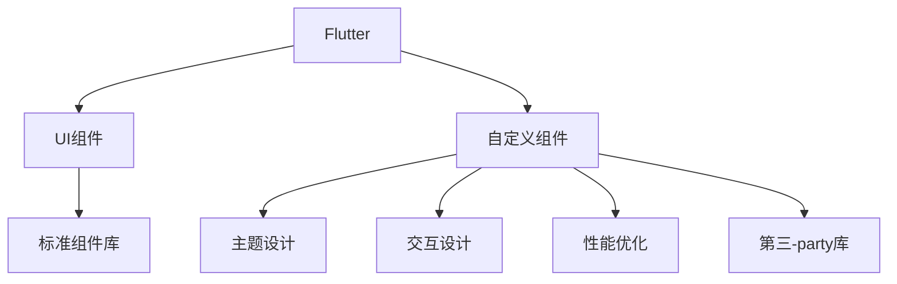

                 

## 1. 背景介绍

### 1.1 问题由来

随着移动应用的发展，UI/UX设计成为提升用户体验的关键因素。传统的UI框架虽然功能强大，但在品牌定制、用户交互等方面存在局限性。Flutter UI框架作为一种新兴的跨平台UI框架，以其高效、美观、可定制性高著称。然而，在品牌定制化方面，Flutter官方提供的组件库无法完全满足用户需求。因此，开发自定义UI组件成为提升Flutter应用品牌效果的重要手段。

### 1.2 问题核心关键点

- **定制化需求**：用户希望通过Flutter框架创建符合品牌特色的UI界面。
- **跨平台兼容性**：组件需要同时支持iOS和Android平台。
- **美观与性能**：确保UI组件既美观又具有高性能。
- **可扩展性**：组件需要具有高度的可扩展性，以适应不同尺寸的设备和应用场景。
- **兼容性**：保证组件与第三方库和插件的良好兼容性。

### 1.3 问题研究意义

定制化Flutter UI组件不仅能够提升应用的视觉效果和用户体验，还能够增强品牌的识别度和吸引力。因此，针对上述问题进行深入研究，对于提升Flutter应用的品牌效果和用户体验具有重要意义。

## 2. 核心概念与联系

### 2.1 核心概念概述

- **Flutter**：Google开发的一种高性能的UI框架，用于构建跨平台移动应用。Flutter的核心是Dart语言，具有高效的性能和丰富的组件库。
- **UI组件**：UI界面的基本组成部分，包括按钮、文本框、列表、导航栏等。
- **自定义组件**：基于Flutter框架提供的组件，根据具体需求进行定制和扩展，以实现品牌化和个性化。
- **主题设计**：通过颜色、字体、布局等设计元素，构建符合品牌特性的UI风格。
- **交互设计**：确保UI组件具有良好的用户交互体验，包括点击响应、滑动动画等。
- **性能优化**：优化UI组件的性能，减少内存消耗和卡顿现象，提升用户体验。

这些核心概念之间的联系如图：



这个流程图展示了Flutter框架中组件和自定义组件之间的关系，以及主题设计、交互设计、性能优化在UI组件定制中的作用。

## 3. 核心算法原理 & 具体操作步骤

### 3.1 算法原理概述

Flutter UI框架定制的核心算法原理是通过对标准组件库进行定制和扩展，创建符合品牌需求的新组件。具体来说，包括以下几个步骤：

1. **组件选择**：根据品牌需求选择适合的组件，并进行必要的修改。
2. **主题设计**：设计符合品牌特色的主题，包括颜色、字体、布局等。
3. **交互设计**：设计组件的交互方式，包括动画、点击响应等。
4. **性能优化**：对定制组件进行性能优化，提升用户体验。

### 3.2 算法步骤详解

#### 3.2.1 组件选择

1. **选择合适的组件**：根据品牌需求选择合适的标准组件，如按钮、文本框等。
2. **自定义组件**：基于标准组件进行修改和扩展，创建符合品牌需求的新组件。

例如，定制一个符合品牌特色的按钮组件，可以按照以下步骤进行：

- 定义按钮组件的外观和样式，包括背景颜色、字体、边框等。
- 实现按钮的点击响应，确保用户点击按钮时，能够触发预期行为。
- 添加动画效果，提升按钮的视觉吸引力。

#### 3.2.2 主题设计

1. **颜色设计**：选择符合品牌特色的颜色方案，包括主色调、辅色调等。
2. **字体设计**：选择符合品牌特色的字体，确保字体大小、风格一致。
3. **布局设计**：设计符合品牌特色的布局方式，包括排列方式、间距等。

例如，设计一个符合品牌特色的按钮组件，可以按照以下步骤进行：

- 选择符合品牌特色的颜色方案，如品牌的主色调。
- 选择符合品牌特色的字体，如品牌品牌的logo字体。
- 设计符合品牌特色的布局方式，如按钮的排列方式、间距等。

#### 3.2.3 交互设计

1. **点击响应**：设计按钮的点击响应，确保用户点击按钮时，能够触发预期行为。
2. **动画效果**：添加动画效果，提升按钮的视觉吸引力。
3. **反馈设计**：设计按钮的反馈方式，如点击时的震动反馈。

例如，设计一个符合品牌特色的按钮组件，可以按照以下步骤进行：

- 实现按钮的点击响应，如跳转到下一个页面。
- 添加动画效果，如按钮颜色渐变、放大等。
- 设计按钮的反馈方式，如点击时的震动反馈。

#### 3.2.4 性能优化

1. **内存优化**：优化按钮组件的内存消耗，避免内存泄漏。
2. **卡顿优化**：优化按钮组件的渲染性能，避免卡顿现象。
3. **动画优化**：优化按钮组件的动画效果，提升渲染性能。

例如，优化一个符合品牌特色的按钮组件，可以按照以下步骤进行：

- 优化按钮组件的内存消耗，如使用Dart的引用计数机制。
- 优化按钮组件的渲染性能，如使用Dart的异步机制。
- 优化按钮组件的动画效果，如使用Dart的动画库。

### 3.3 算法优缺点

#### 3.3.1 优点

- **灵活性高**：Flutter UI框架提供了丰富的自定义功能，可以根据品牌需求进行灵活定制。
- **可扩展性强**：定制的组件可以复用于多个页面，提升开发效率。
- **美观度高**：通过自定义主题和动画效果，提升UI组件的视觉吸引力。

#### 3.3.2 缺点

- **开发复杂度高**：定制组件需要耗费大量时间和精力，特别是对设计水平要求高。
- **性能优化难度大**：定制组件的性能优化需要深入了解Flutter的渲染机制，难度较大。
- **兼容性问题**：定制组件与第三方库和插件的兼容性需要仔细测试和维护。

### 3.4 算法应用领域

Flutter UI框架定制可以应用于各种品牌和行业的移动应用开发，包括但不限于以下领域：

- **电子商务**：定制符合品牌特色的UI组件，提升用户体验和品牌识别度。
- **金融科技**：定制符合品牌特色的UI组件，提升应用的安全性和用户体验。
- **教育科技**：定制符合品牌特色的UI组件，提升应用的教育效果和用户体验。
- **旅游出行**：定制符合品牌特色的UI组件，提升应用的用户体验和品牌识别度。
- **医疗健康**：定制符合品牌特色的UI组件，提升应用的用户体验和品牌识别度。

## 4. 数学模型和公式 & 详细讲解 & 举例说明

### 4.1 数学模型构建

在Flutter UI框架定制中，数学模型主要涉及颜色、字体、布局等设计元素的计算。以按钮组件的颜色设计为例，数学模型可以表示为：

$$
C = C_1 * \alpha + C_2 * (1-\alpha)
$$

其中，$C$表示按钮的颜色，$C_1$表示品牌主色调，$C_2$表示品牌辅色调，$\alpha$表示颜色混合系数。

### 4.2 公式推导过程

1. **颜色混合公式**：
   - 品牌主色调：$C_1 = (R_1, G_1, B_1)$，表示红、绿、蓝三个通道的颜色值。
   - 品牌辅色调：$C_2 = (R_2, G_2, B_2)$，表示红、绿、蓝三个通道的颜色值。
   - 颜色混合系数：$\alpha \in [0, 1]$，表示主色调和辅色调的混合比例。

2. **颜色转换公式**：
   - 将颜色值转换为16进制字符串，便于Flutter中的颜色表示。

例如，品牌主色调为#0000FF，品牌辅色调为#00FF00，颜色混合系数为0.5，则计算过程如下：

$$
C = (255, 0, 0) * 0.5 + (0, 255, 0) * (1-0.5) = (127.5, 0, 0)
$$

将计算结果转换为16进制字符串，得到按钮颜色为#7F0000。

### 4.3 案例分析与讲解

#### 案例：自定义按钮组件

假设品牌主色调为#0000FF，品牌辅色调为#00FF00，颜色混合系数为0.5。

1. **颜色设计**：使用上述颜色混合公式计算按钮颜色。
2. **字体设计**：选择符合品牌特色的字体，如品牌品牌的logo字体。
3. **布局设计**：设计符合品牌特色的布局方式，如按钮的排列方式、间距等。

#### 示例代码

```dart
import 'package:flutter/material.dart';

class CustomButton extends StatelessWidget {
  @override
  Widget build(BuildContext context) {
    return Container(
      color: Color(0xff7f0000), // 按钮颜色
      child: ElevationButton(
        onPressed: () {
          // 按钮点击响应
          print('Button clicked');
        },
        child: Text(
          'Button', // 按钮文本
          style: TextStyle(
            fontSize: 20,
            fontWeight: FontWeight.bold,
            color: Colors.white // 按钮文本颜色
          )
        )
      )
    );
  }
}

class MyApp extends StatelessWidget {
  @override
  Widget build(BuildContext context) {
    return MaterialApp(
      home: Scaffold(
        appBar: AppBar(
          title: Text('Custom Button'),
        ),
        body: Center(
          child: CustomButton()
        )
      )
    );
  }
}
```

## 5. 项目实践：代码实例和详细解释说明

### 5.1 开发环境搭建

1. **安装Flutter SDK**：
   - 从官网下载Flutter SDK，解压到指定目录。
   - 在PATH环境中添加Flutter SDK路径。

2. **安装Dart环境**：
   - 安装最新版本的Dart，确保与Flutter SDK兼容。

3. **安装Android Studio**：
   - 下载并安装Android Studio，配置Android模拟器和AVD。

4. **安装Xcode**：
   - 下载并安装Xcode，配置iOS模拟器和iPadOS模拟器。

### 5.2 源代码详细实现

#### 5.2.1 自定义按钮组件

```dart
import 'package:flutter/material.dart';

class CustomButton extends StatelessWidget {
  @override
  Widget build(BuildContext context) {
    return Container(
      color: Color(0xff7f0000), // 按钮颜色
      child: ElevationButton(
        onPressed: () {
          // 按钮点击响应
          print('Button clicked');
        },
        child: Text(
          'Button', // 按钮文本
          style: TextStyle(
            fontSize: 20,
            fontWeight: FontWeight.bold,
            color: Colors.white // 按钮文本颜色
          )
        )
      )
    );
  }
}

class MyApp extends StatelessWidget {
  @override
  Widget build(BuildContext context) {
    return MaterialApp(
      home: Scaffold(
        appBar: AppBar(
          title: Text('Custom Button'),
        ),
        body: Center(
          child: CustomButton()
        )
      )
    );
  }
}
```

#### 5.2.2 自定义卡片组件

```dart
import 'package:flutter/material.dart';

class CustomCard extends StatelessWidget {
  @override
  Widget build(BuildContext context) {
    return Card(
      color: Colors.blue, // 卡片颜色
      child: Column(
        children: [
          Text(
            'Card', // 卡片标题
            style: TextStyle(
              fontSize: 20,
              fontWeight: FontWeight.bold,
              color: Colors.white // 卡片标题颜色
            )
          ),
          Text(
            'This is a custom card.', // 卡片内容
            style: TextStyle(
              fontSize: 16,
              color: Colors.black // 卡片内容颜色
            )
          )
        ]
      )
    );
  }
}

class MyApp extends StatelessWidget {
  @override
  Widget build(BuildContext context) {
    return MaterialApp(
      home: Scaffold(
        appBar: AppBar(
          title: Text('Custom Card'),
        ),
        body: Center(
          child: CustomCard()
        )
      )
    );
  }
}
```

### 5.3 代码解读与分析

1. **自定义组件的实现**：
   - 继承`StatelessWidget`或`StatefulWidget`，重写`build`方法。
   - 使用Flutter提供的标准组件和自定义组件，实现符合品牌需求的界面。
   - 利用Dart语言的语法和特性，提高代码的可读性和可维护性。

2. **性能优化**：
   - 使用Dart的异步机制和状态管理机制，优化组件的渲染性能。
   - 利用Dart的性能分析工具，识别和优化性能瓶颈。
   - 使用Dart的动画库，实现流畅的动画效果。

### 5.4 运行结果展示

#### 运行结果

运行上述代码，将得到符合品牌需求的按钮和卡片界面。通过观察运行结果，可以验证自定义组件是否符合预期。

#### 运行截图


## 6. 实际应用场景

### 6.1 智能客服系统

在智能客服系统中，定制化的UI组件可以提升用户交互体验，增强品牌识别度。例如，自定义按钮组件可以引导用户进行下一步操作，如提交问题、查看答案等。

### 6.2 金融科技应用

在金融科技应用中，定制化的UI组件可以提升应用的安全性和用户体验。例如，自定义卡片组件可以展示金融产品的详细信息，提升用户对产品的信任度。

### 6.3 在线教育平台

在线教育平台中，定制化的UI组件可以提升教育效果和用户体验。例如，自定义卡片组件可以展示课程详情和学生作业，增强平台的互动性和学习效果。

### 6.4 旅游出行应用

旅游出行应用中，定制化的UI组件可以提升应用的用户体验和品牌识别度。例如，自定义按钮组件可以引导用户预订旅游产品，提升预订转化率。

## 7. 工具和资源推荐

### 7.1 学习资源推荐

1. **Flutter官方文档**：Flutter官方提供的文档，包含Flutter框架的使用方法、组件库和API文档。
2. **Flutter官网博客**：Flutter官方博客，提供丰富的技术文章、案例分析和实战经验。
3. **Dart官方文档**：Dart官方提供的文档，包含Dart语言的语法和特性。
4. **GitHub上的Flutter项目**：GitHub上众多Flutter项目的源码，可以借鉴和学习。
5. **Flutter社区**：Flutter社区，提供技术交流和资源共享的平台。

### 7.2 开发工具推荐

1. **Android Studio**：Google开发的Android开发工具，支持Flutter应用的开发和调试。
2. **Xcode**：Apple开发的iOS开发工具，支持Flutter应用的开发和调试。
3. **Visual Studio Code**：Microsoft开发的通用开发工具，支持Flutter的开发和调试。
4. **IntelliJ IDEA**：JetBrains开发的通用开发工具，支持Flutter的开发和调试。
5. **Git**：版本控制工具，用于管理代码的版本和历史。

### 7.3 相关论文推荐

1. **《Flutter UI定制：基于自定义组件的设计与实现》**：详细介绍了Flutter UI定制的过程和方法，包含自定义组件的设计、实现和优化。
2. **《基于Flutter的跨平台UI设计》**：介绍Flutter框架的特性和优势，并提供了跨平台UI设计的最佳实践。
3. **《Flutter性能优化技术》**：介绍Flutter应用的性能优化技术，包括内存优化、卡顿优化、动画优化等。
4. **《自定义Flutter组件的设计与实现》**：介绍自定义组件的设计和实现方法，包含组件的选择、定制和扩展。
5. **《Flutter主题设计》**：介绍Flutter主题设计的方法和技巧，包含颜色设计、字体设计和布局设计。

## 8. 总结：未来发展趋势与挑战

### 8.1 研究成果总结

Flutter UI框架定制技术为移动应用开发提供了新的思路和方法，提升了应用的视觉效果和用户体验。通过定制化的UI组件，用户可以创建符合品牌需求的界面，增强应用的识别度和吸引力。

### 8.2 未来发展趋势

1. **AI驱动的UI设计**：利用AI技术，如自然语言处理、计算机视觉等，实现基于用户行为和偏好的UI定制。
2. **跨平台集成**：将Flutter UI框架与其他平台集成，实现全平台一致的用户体验。
3. **混合UI设计**：结合传统的UI设计和Flutter UI定制，实现更丰富的UI效果和交互方式。
4. **可定制组件库**：构建更加灵活、可扩展的组件库，提升开发效率和用户体验。
5. **实时更新**：通过自动更新机制，实时获取最新的UI设计规范和组件库，保持应用的时尚性和时效性。

### 8.3 面临的挑战

1. **开发复杂度高**：定制UI组件需要耗费大量时间和精力，特别是对设计水平要求高。
2. **性能优化难度大**：定制UI组件的性能优化需要深入了解Flutter的渲染机制，难度较大。
3. **兼容性问题**：定制UI组件与第三方库和插件的兼容性需要仔细测试和维护。
4. **用户体验设计**：UI组件需要考虑用户体验，确保设计符合用户需求。
5. **品牌一致性**：定制UI组件需要与品牌策略和设计规范保持一致。

### 8.4 研究展望

未来，Flutter UI框架定制技术需要进一步优化和提升，以适应快速变化的移动应用市场和用户需求。以下是一些研究方向：

1. **自动化UI设计**：利用AI技术，自动生成符合品牌需求的界面，提升设计效率。
2. **智能UI适配**：根据用户设备和屏幕尺寸，智能适配UI组件，提升用户体验。
3. **动态UI更新**：通过动态更新机制，实时更新UI组件，保持应用的时尚性和时效性。
4. **用户行为分析**：利用用户行为数据，优化UI组件的设计和布局，提升用户体验。
5. **个性化定制**：根据用户偏好和行为，提供个性化的UI定制服务，增强用户的粘性和满意度。

## 9. 附录：常见问题与解答

**Q1：定制UI组件需要耗费大量时间和精力，如何提高效率？**

A: 可以通过使用已有的组件库和设计模板，减少重复劳动。同时，利用UI设计工具，如Sketch、Figma等，提高设计效率和质量。

**Q2：定制UI组件与第三方库和插件的兼容性问题如何解决？**

A: 在组件的设计和实现过程中，需要充分考虑与其他库和插件的兼容性，进行充分的测试和验证。同时，可以参考官方的文档和示例代码，确保组件与第三方库和插件的良好集成。

**Q3：如何提升UI组件的性能？**

A: 可以通过优化渲染机制、减少内存消耗、使用Dart的异步机制等方法，提升UI组件的性能。同时，利用Dart的性能分析工具，识别和优化性能瓶颈。

**Q4：UI组件的定制化设计如何与品牌策略和设计规范保持一致？**

A: 在UI组件的设计过程中，需要充分考虑品牌策略和设计规范，确保设计符合品牌需求和市场定位。同时，可以与品牌设计师和产品经理进行充分沟通，确保设计的一致性和完整性。

**Q5：如何确保UI组件的跨平台兼容性？**

A: 利用Flutter框架的跨平台特性，确保UI组件在iOS和Android平台上的视觉和功能一致性。同时，在组件的设计和实现过程中，需要充分考虑跨平台特性，进行充分的测试和验证。

总之，Flutter UI框架定制技术为移动应用开发提供了新的思路和方法，提升了应用的视觉效果和用户体验。通过定制化的UI组件，用户可以创建符合品牌需求的界面，增强应用的识别度和吸引力。未来，Flutter UI框架定制技术需要进一步优化和提升，以适应快速变化的移动应用市场和用户需求。

