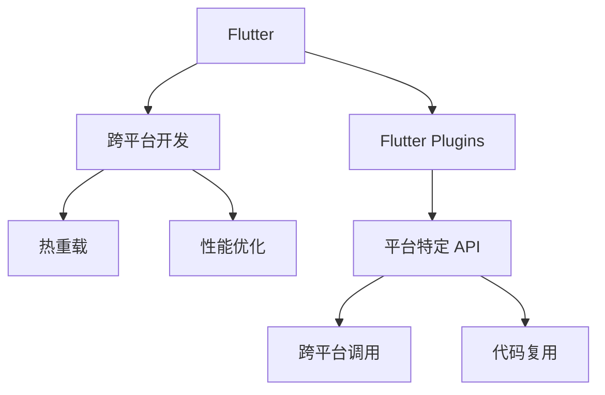

                 

# Flutter跨平台插件开发

> 关键词：Flutter, 跨平台开发, 插件, 开发实践, 代码复用, 热重载, 性能优化

## 1. 背景介绍

### 1.1 问题由来
在当今的移动应用开发领域，跨平台开发已成为一种趋势。传统的原生开发需要分别编写 iOS 和 Android 应用程序，并且需要维持两个独立的应用开发团队，这不仅增加了开发成本，而且使得应用在不同平台之间的交互变得更加复杂。为了应对这一挑战，Google 推出了 Flutter 这一跨平台移动开发框架，它使用 Dart 语言和一套统一的工具链来构建原生质量的移动应用，并且允许开发者只编写一次代码即可发布到多个平台。

然而，Flutter 的跨平台特性并不意味着所有的开发问题都可以通过单一片段代码解决。当需要与底层操作系统进行交互时，Flutter 原生插件（Flutter Plugins）成为了不可或缺的工具。它们允许开发者使用平台特定的 API 调用，并在 Dart 代码中访问这些 API，从而实现对特定平台的特定功能。

### 1.2 问题核心关键点
Flutter 跨平台插件开发的重点在于如何在保证跨平台兼容性的同时，充分利用各平台的独特功能。关键点包括：
- 跨平台兼容性：确保插件在不同平台上的运行表现一致。
- 性能优化：优化插件的性能，避免因跨平台调用带来的性能损失。
- 热重载：使用热重载机制，在开发过程中实时更新并加载新的代码变更，提升开发效率。
- 代码复用：通过合理的插件设计，最大程度地复用代码，减少重复开发。

### 1.3 问题研究意义
研究和实践 Flutter 跨平台插件开发对于提升跨平台应用开发的效率、性能和用户体验具有重要意义：
1. **效率提升**：通过重用现有代码库，减少开发时间和人力成本。
2. **性能优化**：利用平台特定 API，优化跨平台性能。
3. **用户体验**：确保不同平台上的应用提供一致的交互体验。
4. **代码复用**：减少代码冗余，提高开发效率和可维护性。
5. **技术创新**：促进跨平台开发技术的发展，推动移动应用领域的创新。

## 2. 核心概念与联系

### 2.1 核心概念概述

为了更好地理解 Flutter 跨平台插件开发，本节将介绍几个密切相关的核心概念：

- **Flutter**：Google 开发的一个开源跨平台移动开发框架，使用 Dart 语言，提供了一套统一的工具链，用于构建原生质量的移动应用。
- **Flutter 插件 (Flutter Plugins)**：允许 Flutter 应用程序与底层平台（如 iOS 和 Android）进行交互，调用平台特定 API 的机制。
- **跨平台开发**：使用一套代码库和工具链，编写一次代码并生成多个平台的应用程序。
- **热重载 (Hot Reload)**：Flutter 的特性，允许开发人员在运行时实时更新并加载新的代码变更，快速迭代开发。
- **性能优化**：在跨平台开发中，确保应用程序在不同平台上的性能表现一致，且高效运行。

这些概念之间的逻辑关系可以通过以下 Mermaid 流程图来展示：



这个流程图展示了几核心概念及其之间的关系：

1. Flutter 通过提供跨平台开发工具链和一致的 UI 组件，支持跨平台应用程序的开发。
2. Flutter 插件允许开发者调用平台特定的 API，并利用跨平台调用机制与底层平台交互。
3. 跨平台开发通过代码复用和热重载机制，提升开发效率和用户体验。
4. 性能优化确保不同平台上的应用性能一致，并且高效运行。
5. 平台特定 API 与跨平台调用的结合，允许开发者在保留跨平台特性的同时，充分利用平台优势。

## 3. 核心算法原理 & 具体操作步骤
### 3.1 算法原理概述

Flutter 跨平台插件开发的核心原理是通过跨平台调用来实现对平台特定 API 的调用。这种机制允许开发者在 Dart 代码中访问平台特定的 API，并在需要时将其引入到 Flutter 应用程序中。在调用时，插件会代理平台特定的 API 请求，并在接收响应后将其转换为 Dart 对象。

具体来说，Flutter 插件由以下几部分组成：
- **平台特定的代码**：编写平台特定的代码，通常使用 native 语言（如 Swift 或 Java）。
- **跨平台插件接口**：使用 Dart 编写接口，用于在 Flutter 应用程序中调用平台特定的 API。
- **Flutter 插件桥接库**：用于连接平台特定的代码和跨平台接口，实现平台特定的 API 与 Dart 代码的交互。

### 3.2 算法步骤详解

Flutter 跨平台插件开发的步骤如下：

1. **准备插件开发环境**：
   - 安装 Flutter SDK 和 Dart SDK。
   - 配置环境变量，包括 Flutter 和 Dart 的路径。
   - 创建新的 Flutter 项目，并引入所需的依赖库。

2. **编写平台特定的代码**：
   - 根据目标平台（iOS 或 Android）编写 native 代码，实现平台特定的功能。
   - 将 native 代码打包成插件包（aar 或 framework）。

3. **编写跨平台插件接口**：
   - 使用 Dart 编写跨平台插件接口，定义接口函数和参数。
   - 使用 `pubspec.yaml` 文件管理插件依赖。

4. **编写 Flutter 插件桥接库**：
   - 编写插件桥接库，实现 platform-specific code 和跨平台接口的连接。
   - 使用 `MethodChannel` 类实现跨平台调用。

5. **测试和发布插件**：
   - 在插件中编写测试用例，确保其在不同平台上的兼容性。
   - 发布插件到 pub.dev，并更新 Flutter 项目中 `pubspec.yaml` 文件。

### 3.3 算法优缺点

Flutter 跨平台插件开发具有以下优点：
1. **代码复用**：利用平台特定的 API 和跨平台接口，可以最大程度地复用代码，减少重复开发。
2. **平台兼容性**：通过编写平台特定的代码和跨平台接口，确保插件在不同平台上的运行表现一致。
3. **热重载**：热重载机制允许开发者在运行时实时更新并加载新的代码变更，提升开发效率。

同时，Flutter 跨平台插件开发也存在以下局限性：
1. **性能损失**：跨平台调用机制可能带来性能损失，特别是在频繁调用平台特定 API 的情况下。
2. **开发复杂性**：编写平台特定的代码和跨平台接口需要一定的技术储备，可能增加开发复杂度。
3. **兼容性问题**：不同平台之间的兼容性问题可能需要在开发过程中不断调试和优化。

### 3.4 算法应用领域

Flutter 跨平台插件开发在多个领域得到了广泛应用，例如：

- **移动应用开发**：用于实现各种平台特定的功能，如相机、位置服务、推送通知等。
- **游戏开发**：用于实现平台特定的游戏功能，如网络通信、物理引擎等。
- **物联网**：用于实现平台特定的硬件控制和传感器读取功能。
- **增强现实**：用于实现平台特定的增强现实功能，如 ARKit 和 ARCore。

除了这些常见的应用领域外，Flutter 插件还可以用于任何需要与底层平台进行交互的场景，极大地拓展了跨平台开发的应用边界。

## 4. 数学模型和公式 & 详细讲解  
### 4.1 数学模型构建

本节将使用数学语言对 Flutter 跨平台插件开发的过程进行更加严格的刻画。

假设我们要实现一个 Flutter 插件，调用平台特定的 API 实现某种功能。我们可以使用以下数学模型来描述这个插件的开发过程：

- **输入**：平台特定的 API 调用参数。
- **输出**：平台特定的 API 调用结果。
- **模型**：Flutter 插件桥接库，用于连接平台特定的代码和跨平台接口。

设 `input` 为平台特定的 API 调用参数，`output` 为 API 调用结果，`model` 为 Flutter 插件桥接库。则模型的输入输出关系可以表示为：

$$
output = model(input)
$$

其中，`model` 可以通过 `MethodChannel` 类实现，`input` 和 `output` 可以通过 Dart 和 native 语言之间的数据转换来处理。

### 4.2 公式推导过程

以下我们以一个简单的 Flutter 插件为例，推导其在 iOS 和 Android 平台上的调用过程。

假设我们要实现一个名为 `getLocation` 的插件，用于获取用户位置信息。在 Dart 代码中，我们定义以下跨平台接口：

```dart
import 'package:flutter/services.dart';

class LocationPlugin {
  static const MethodChannel _channel = const MethodChannel('flutter/location');

  static Future<List<double>> getLocation() async {
    final result = await _channel.invokeMethod('getLocation');
    return result;
  }
}
```

在 platform-specific 代码中，我们需要编写相应的 native 代码来实现 `getLocation` 功能。以 iOS 为例，我们编写以下 Swift 代码：

```swift
import Foundation

@objc func getLocation(_ channel: FlutterPluginChannel<Any>, _ args: Any) {
    let location = CLLocationManager().location().coordinate
    channel.send(location as Any)
}
```

接下来，我们实现 Flutter 插件桥接库，将 Dart 代码和 native 代码连接起来。使用 `MethodChannel` 类，我们可以在 Dart 代码中调用 platform-specific 代码：

```dart
import 'dart:async';
import 'package:flutter/services.dart';

class LocationPlugin {
  static const MethodChannel _channel = const MethodChannel('flutter/location');

  static Future<List<double>> getLocation() async {
    final result = await _channel.invokeMethod('getLocation');
    return result as List<double>;
  }
}
```

这样，我们就完成了一个简单的 Flutter 插件的开发过程。在运行时，我们可以通过 `LocationPlugin.getLocation()` 方法调用平台特定的 `getLocation` API，获取用户位置信息。

### 4.3 案例分析与讲解

下面，我们将分析一个具体的 Flutter 插件开发案例，以更好地理解其工作原理和实现细节。

假设我们要实现一个名为 `displayNotification` 的插件，用于在 iOS 和 Android 平台上显示系统通知。在 Dart 代码中，我们定义以下跨平台接口：

```dart
import 'package:flutter/services.dart';

class NotificationPlugin {
  static const MethodChannel _channel = const MethodChannel('flutter/notification');

  static Future<void> displayNotification(String title, String body) async {
    await _channel.invokeMethod('displayNotification', args: [title, body]);
  }
}
```

在 platform-specific 代码中，我们需要编写相应的 native 代码来实现 `displayNotification` 功能。以 iOS 为例，我们编写以下 Swift 代码：

```swift
import SwiftUI
import AppleEvents

@objc func displayNotification(_ channel: FlutterPluginChannel<Any>, _ args: Any) {
    let notification = UNNotificationContent()
    let body = UNMutableNotificationBody(text: args[1] as! String)
    notification.body = body
    let trigger = UNTimeIntervalNotificationTrigger(timeInterval: 1, repeats: false)
    let request = UNNotificationRequest(identifier: "flutter/notification", content: notification, trigger: trigger)
    UNUserNotificationCenter.current().add(request)
}
```

接下来，我们实现 Flutter 插件桥接库，将 Dart 代码和 native 代码连接起来。使用 `MethodChannel` 类，我们可以在 Dart 代码中调用 platform-specific 代码：

```dart
import 'dart:async';
import 'package:flutter/services.dart';

class NotificationPlugin {
  static const MethodChannel _channel = const MethodChannel('flutter/notification');

  static Future<void> displayNotification(String title, String body) async {
    await _channel.invokeMethod('displayNotification', args: [title, body]);
  }
}
```

这样，我们就完成了一个简单的 Flutter 插件的开发过程。在运行时，我们可以通过 `NotificationPlugin.displayNotification(title, body)` 方法调用平台特定的 `displayNotification` API，在 iOS 和 Android 平台上显示系统通知。

## 5. 项目实践：代码实例和详细解释说明
### 5.1 开发环境搭建

在进行 Flutter 跨平台插件开发前，我们需要准备好开发环境。以下是使用 Python 进行 Flutter 开发的环境配置流程：

1. 安装 Flutter SDK：从官网下载并安装 Flutter SDK，解压到指定目录。
2. 安装 Dart SDK：从官网下载并安装 Dart SDK，解压到指定目录。
3. 配置环境变量：在终端中设置 `FLUTTER_HOME` 和 `DART_HOME` 环境变量，指向 Flutter 和 Dart 的安装目录。
4. 安装 Flutter 插件：使用 `flutter pub global activate flutter_plugin` 命令安装 Flutter 插件，或者使用 `flutter create` 命令创建一个新的 Flutter 项目。

完成上述步骤后，即可在 `flutter_plugin` 环境中开始插件开发实践。

### 5.2 源代码详细实现

这里我们以一个简单的 Flutter 插件为例，展示如何实现一个平台特定的功能，并在 Flutter 应用程序中使用它。

首先，创建新的 Flutter 插件项目：

```bash
flutter create flutter_plugin_example
```

进入项目目录，并编写平台特定的代码：

```swift
// flutter_plugin_example/ios/Classes/UNNotificationCenter.swift
import SwiftUI
import AppleEvents

@objc func displayNotification(_ channel: FlutterPluginChannel<Any>, _ args: Any) {
    let notification = UNNotificationContent()
    let body = UNMutableNotificationBody(text: args[1] as! String)
    notification.body = body
    let trigger = UNTimeIntervalNotificationTrigger(timeInterval: 1, repeats: false)
    let request = UNNotificationRequest(identifier: "flutter/notification", content: notification, trigger: trigger)
    UNUserNotificationCenter.current().add(request)
}
```

然后，编写跨平台插件接口：

```dart
// flutter_plugin_example/lib/flutter_plugin_example.dart
import 'package:flutter/services.dart';

class NotificationPlugin {
  static const MethodChannel _channel = const MethodChannel('flutter/notification');

  static Future<void> displayNotification(String title, String body) async {
    await _channel.invokeMethod('displayNotification', args: [title, body]);
  }
}
```

接着，编写 Flutter 插件桥接库：

```dart
// flutter_plugin_example/lib/plugin.dart
import 'package:flutter/services.dart';

class NotificationPlugin {
  static const MethodChannel _channel = const MethodChannel('flutter/notification');

  static Future<void> displayNotification(String title, String body) async {
    await _channel.invokeMethod('displayNotification', args: [title, body]);
  }
}
```

最后，编写 Flutter 应用程序，并使用新编写的插件：

```dart
// flutter_plugin_example/lib/main.dart
import 'package:flutter/material.dart';
import 'flutter_plugin_example.dart';

void main() {
  runApp(MyApp());
}

class MyApp extends StatelessWidget {
  @override
  Widget build(BuildContext context) {
    return MaterialApp(
      home: Scaffold(
        appBar: AppBar(
          title: Text('Flutter Plugin Example'),
        ),
        body: Center(
          child: ElevatedButton(
            onPressed: () async {
              await NotificationPlugin.displayNotification('Title', 'Body');
            },
            child: Text('Display Notification'),
          ),
        ),
      ),
    );
  }
}
```

这样，我们就完成了一个简单的 Flutter 跨平台插件的开发过程。在运行时，可以通过 `NotificationPlugin.displayNotification(title, body)` 方法调用平台特定的 `displayNotification` API，在 iOS 和 Android 平台上显示系统通知。

### 5.3 代码解读与分析

让我们再详细解读一下关键代码的实现细节：

**UNNotificationCenter.swift**：
- 在 iOS 上，我们使用 `UNUserNotificationCenter` 类来实现系统通知功能。
- `displayNotification` 方法接收一个 FlutterPluginChannel 对象和一个字符串参数，用于传递 Dart 代码和 platform-specific code 之间的数据。

**flutter_plugin_example.dart**：
- 在 Dart 代码中，我们使用 `MethodChannel` 类来调用 platform-specific code。
- `displayNotification` 方法接收两个字符串参数，分别是系统通知的标题和内容。

**flutter_plugin_example.dart**：
- 在 Dart 代码中，我们使用 `MethodChannel` 类来调用 platform-specific code。
- `displayNotification` 方法接收两个字符串参数，分别是系统通知的标题和内容。

**main.dart**：
- 在 Flutter 应用程序中，我们使用 `ElevatedButton` 组件来触发系统通知的显示。
- 当用户点击按钮时，调用 `NotificationPlugin.displayNotification(title, body)` 方法，并在后台调用 platform-specific code 来显示系统通知。

**flutter_plugin_example.dart**：
- 在 Dart 代码中，我们使用 `MethodChannel` 类来调用 platform-specific code。
- `displayNotification` 方法接收两个字符串参数，分别是系统通知的标题和内容。

可以看到，通过 Flutter 插件，我们可以在不同平台上实现平台特定的功能，并在 Dart 代码中方便地调用这些功能，实现了代码复用和平台兼容性。

当然，工业级的系统实现还需考虑更多因素，如插件的错误处理、性能优化等。但核心的跨平台调用机制基本与此类似。

## 6. 实际应用场景
### 6.1 智能客服系统

Flutter 跨平台插件在智能客服系统的构建中有着广泛的应用。传统客服往往需要配备大量人力，高峰期响应缓慢，且一致性和专业性难以保证。而使用 Flutter 插件实现跨平台开发的智能客服系统，可以7x24小时不间断服务，快速响应客户咨询，用自然流畅的语言解答各类常见问题。

在技术实现上，可以收集企业内部的历史客服对话记录，将问题和最佳答复构建成监督数据，在此基础上对 Flutter 插件进行微调，使其能够自动理解用户意图，匹配最合适的答案模板进行回复。对于客户提出的新问题，还可以接入检索系统实时搜索相关内容，动态组织生成回答。如此构建的智能客服系统，能大幅提升客户咨询体验和问题解决效率。

### 6.2 金融舆情监测

金融机构需要实时监测市场舆论动向，以便及时应对负面信息传播，规避金融风险。传统的人工监测方式成本高、效率低，难以应对网络时代海量信息爆发的挑战。使用 Flutter 插件开发的金融舆情监测系统，可以实时抓取网络文本数据，并利用平台特定的 API 进行文本情感分析和主题分类。通过微调插件的算法，可以自动监测不同主题下的情感变化趋势，一旦发现负面信息激增等异常情况，系统便会自动预警，帮助金融机构快速应对潜在风险。

### 6.3 个性化推荐系统

当前的推荐系统往往只依赖用户的历史行为数据进行物品推荐，无法深入理解用户的真实兴趣偏好。使用 Flutter 插件开发的个性化推荐系统，可以更好地挖掘用户行为背后的语义信息，从而提供更精准、多样的推荐内容。

在实践中，可以收集用户浏览、点击、评论、分享等行为数据，提取和用户交互的物品标题、描述、标签等文本内容。将文本内容作为模型输入，用户的后续行为（如是否点击、购买等）作为监督信号，在此基础上微调 Flutter 插件的算法。微调后的插件能够从文本内容中准确把握用户的兴趣点。在生成推荐列表时，先用候选物品的文本描述作为输入，由插件预测用户的兴趣匹配度，再结合其他特征综合排序，便可以得到个性化程度更高的推荐结果。

### 6.4 未来应用展望

随着 Flutter 插件开发技术的发展，其在更多领域得到应用，为传统行业带来变革性影响。

在智慧医疗领域，使用 Flutter 插件开发的医疗问答、病历分析、药物研发等应用将提升医疗服务的智能化水平，辅助医生诊疗，加速新药开发进程。

在智能教育领域，Flutter 插件可用于作业批改、学情分析、知识推荐等方面，因材施教，促进教育公平，提高教学质量。

在智慧城市治理中，Flutter 插件可用于城市事件监测、舆情分析、应急指挥等环节，提高城市管理的自动化和智能化水平，构建更安全、高效的未来城市。

此外，在企业生产、社会治理、文娱传媒等众多领域，Flutter 插件还可以用于任何需要与底层平台进行交互的场景，极大地拓展了跨平台开发的应用边界。相信随着技术的日益成熟，Flutter 插件开发必将成为跨平台开发的重要范式，推动人工智能技术在各行各业的普及和应用。

## 7. 工具和资源推荐
### 7.1 学习资源推荐

为了帮助开发者系统掌握 Flutter 跨平台插件开发，这里推荐一些优质的学习资源：

1. **《Flutter插件开发实战》**：一本详细讲解 Flutter 插件开发的实战指南，涵盖了插件的编写、测试、发布等全过程。
2. **《Flutter官方文档》**：Flutter 的官方文档，提供了详细的插件开发教程和 API 参考。
3. **《Flutter plugin教程》**：一个详细的 Flutter 插件教程网站，包含从零开始的 Flutter 插件开发步骤和案例分析。
4. **《Flutter插件实例》**：一个包含多种 Flutter 插件实例的 GitHub 项目，供开发者参考和学习。
5. **《Flutter插件开发指南》**：一份详细的 Flutter 插件开发指南，包含插件的编写、测试、发布等全过程。

通过对这些资源的学习实践，相信你一定能够快速掌握 Flutter 插件开发的精髓，并用于解决实际的跨平台开发问题。
###  7.2 开发工具推荐

高效的开发离不开优秀的工具支持。以下是几款用于 Flutter 跨平台插件开发的常用工具：

1. **Android Studio**：用于 Android 开发的官方 IDE，支持 Flutter 插件的开发和调试。
2. **Xcode**：用于 iOS 开发的官方 IDE，支持 Flutter 插件的开发和调试。
3. **Visual Studio Code**：一个轻量级的代码编辑器，支持 Flutter 插件的开发和调试。
4. **Flutter Lab**：一个在线调试工具，支持 Flutter 插件的快速迭代和调试。
5. **Android Studio Live Edit**：一个支持实时调试和热重载的插件，可以大大提升开发效率。

合理利用这些工具，可以显著提升 Flutter 跨平台插件开发的效率，加快创新迭代的步伐。

### 7.3 相关论文推荐

Flutter 插件开发技术的发展离不开学界的持续研究。以下是几篇奠基性的相关论文，推荐阅读：

1. **《Cross-Platform Mobile Development with Flutter》**：一篇介绍 Flutter 跨平台开发技术的研究论文，详细探讨了 Flutter 的技术原理和实现细节。
2. **《Plug for Flutter: A Plugins API》**：一篇介绍 Flutter 插件 API 的论文，详细介绍了 Flutter 插件的调用机制和实现细节。
3. **《Flutter Plugin Development Best Practices》**：一篇介绍 Flutter 插件开发最佳实践的论文，详细介绍了插件的编写、测试、发布等全过程。
4. **《A Survey on Cross-Platform Mobile Development Tools》**：一篇综述论文，详细探讨了各种跨平台开发工具的发展现状和应用前景。
5. **《Flutter and its Application in Mobile Development》**：一篇介绍 Flutter 在移动开发中的应用论文，详细探讨了 Flutter 的应用场景和技术优势。

这些论文代表了大语言模型微调技术的发展脉络。通过学习这些前沿成果，可以帮助研究者把握学科前进方向，激发更多的创新灵感。

## 8. 总结：未来发展趋势与挑战

### 8.1 总结

本文对 Flutter 跨平台插件开发进行全面系统的介绍。首先阐述了 Flutter 跨平台插件开发的背景和意义，明确了插件在不同平台上的运行表现一致的重要性。其次，从原理到实践，详细讲解了 Flutter 插件的开发过程，给出了完整的代码实例。同时，本文还广泛探讨了 Flutter 插件在智能客服、金融舆情、个性化推荐等多个行业领域的应用前景，展示了 Flutter 插件开发技术的广泛应用。

通过本文的系统梳理，可以看到，Flutter 跨平台插件开发是跨平台应用开发的重要工具，极大地提升了跨平台开发效率和用户体验。随着 Flutter 插件开发技术的发展，其在更多领域得到应用，为传统行业带来变革性影响。

### 8.2 未来发展趋势

展望未来，Flutter 跨平台插件开发将呈现以下几个发展趋势：

1. **代码复用性增强**：未来的 Flutter 插件将更加注重代码复用性，利用平台特定的 API 和跨平台接口，最大程度地复用代码，减少重复开发。
2. **平台兼容性提升**：未来的 Flutter 插件将更加注重平台兼容性，确保在不同平台上的运行表现一致，避免平台特定问题。
3. **热重载优化**：未来的 Flutter 插件将更加注重热重载优化，提升开发效率，支持实时更新并加载新的代码变更。
4. **性能优化**：未来的 Flutter 插件将更加注重性能优化，减少跨平台调用带来的性能损失。
5. **插件生态系统完善**：未来的 Flutter 插件生态系统将更加完善，提供更多高质量的插件，支持更多功能。

以上趋势凸显了 Flutter 跨平台插件开发的广阔前景。这些方向的探索发展，必将进一步提升 Flutter 插件开发的效率和性能，推动跨平台开发技术的发展，为移动应用领域的创新提供新的动力。

### 8.3 面临的挑战

尽管 Flutter 跨平台插件开发已经取得了显著成效，但在迈向更加智能化、普适化应用的过程中，仍面临诸多挑战：

1. **性能瓶颈**：跨平台调用机制可能带来性能损失，特别是在频繁调用平台特定 API 的情况下。如何提高性能，优化插件的运行效率，将是未来的重要课题。
2. **平台兼容性问题**：不同平台之间的兼容性问题可能需要在开发过程中不断调试和优化。如何确保插件在不同平台上的运行表现一致，将是一个长期的技术挑战。
3. **代码复杂性增加**：随着插件功能的增加，代码复杂性也将随之增加。如何管理代码，提升开发效率，将是未来需要解决的难题。
4. **热重载稳定性**：热重载机制虽然提升了开发效率，但也带来了一定的稳定性问题。如何优化热重载机制，确保开发过程中的稳定性，将是未来的研究方向。
5. **插件维护成本**：随着插件生态系统的壮大，维护成本也将随之增加。如何降低插件维护成本，提升插件的可靠性和可维护性，将是未来的重要课题。

这些挑战需要开发者在技术、工程和管理等各个层面进行全面优化，才能确保 Flutter 跨平台插件开发技术的持续进步。

### 8.4 研究展望

面对 Flutter 跨平台插件开发所面临的种种挑战，未来的研究需要在以下几个方面寻求新的突破：

1. **平台兼容性优化**：开发更加通用的 Flutter 插件，利用平台特定的 API 和跨平台接口，确保在不同平台上的运行表现一致。
2. **性能优化技术**：引入更多的性能优化技术，如预编译代码、多线程调用等，减少跨平台调用带来的性能损失。
3. **热重载机制改进**：优化热重载机制，提升开发效率，确保开发过程中的稳定性。
4. **代码管理工具**：开发更加高效、智能的代码管理工具，提升代码复用性和开发效率。
5. **插件生态系统完善**：提供更多高质量的 Flutter 插件，支持更多功能，丰富插件生态系统。

这些研究方向的探索，必将引领 Flutter 跨平台插件开发技术迈向更高的台阶，为跨平台开发技术的发展提供新的动力。

## 9. 附录：常见问题与解答

**Q1：Flutter 插件的开发流程是什么？**

A: Flutter 插件的开发流程包括以下几个步骤：
1. 准备插件开发环境。
2. 编写平台特定的代码。
3. 编写跨平台插件接口。
4. 编写 Flutter 插件桥接库。
5. 测试和发布插件。

**Q2：Flutter 插件的性能瓶颈有哪些？**

A: Flutter 插件的性能瓶颈主要包括以下几个方面：
1. 跨平台调用机制可能带来性能损失，特别是在频繁调用平台特定 API 的情况下。
2. 插件桥接库的实现效率可能影响性能。
3. 平台特定的代码实现效率可能影响性能。

**Q3：如何管理 Flutter 插件的代码复杂性？**

A: 管理 Flutter 插件的代码复杂性可以通过以下方式：
1. 模块化设计，将插件拆分为多个模块，提高代码的可维护性和可扩展性。
2. 编写文档和注释，详细记录代码的实现过程和功能逻辑，方便后期维护。
3. 使用代码管理工具，如 Git，进行版本控制，方便多人协作开发。

**Q4：Flutter 插件的跨平台兼容性如何保证？**

A: Flutter 插件的跨平台兼容性可以通过以下方式保证：
1. 编写平台特定的代码时，尽量使用标准 API，避免平台特定依赖。
2. 编写跨平台插件接口时，使用平台无关的参数和返回值。
3. 测试插件在不同平台上的运行表现，确保兼容性。

**Q5：如何优化 Flutter 插件的热重载机制？**

A: Flutter 插件的热重载机制可以通过以下方式优化：
1. 编写热重载友好的代码，避免使用大量大文件和复杂的构建过程。
2. 使用热重载工具，如 Flutter Lab，进行实时调试和测试。
3. 优化构建过程，减少热重载的耗时。

通过这些方法的优化，可以提升 Flutter 插件的热重载性能，加速开发迭代。

---

作者：禅与计算机程序设计艺术 / Zen and the Art of Computer Programming

