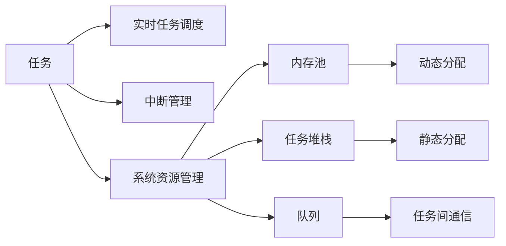

                 

# FreeRTOS：实时操作系统在单片机上的应用

> 关键词：FreeRTOS, 实时操作系统, 单片机, 嵌入式系统, 中断管理, 实时任务调度, 系统资源管理

## 1. 背景介绍

### 1.1 问题由来

在当今物联网和嵌入式设备领域，越来越多的应用场景对实时性和系统响应速度提出了更高的要求。传统的PC架构操作系统，如Linux、Windows等，虽然功能丰富，但在处理实时任务时性能往往不够理想。因此，实时操作系统（RTOS）应运而生，专为实时系统设计，能够提供可靠的时间保障和高效的系统调度。

单片机由于其体积小、成本低、资源有限等特点，成为了嵌入式系统中常见的计算单元。然而，单片机的计算资源有限，实现复杂的实时操作系统面临着诸多挑战。为了解决这些问题，FreeRTOS应运而生。

### 1.2 问题核心关键点

FreeRTOS是一个开源的、跨平台的实时操作系统，支持多种处理器架构，包括x86、ARM、MIPS等。在单片机等嵌入式系统中，FreeRTOS能够提供高效的实时任务调度、中断管理、系统资源管理等功能，非常适合资源受限的环境。

以下是FreeRTOS的几个核心关键点：

- **实时任务调度**：FreeRTOS使用抢占式调度算法，可以优先处理优先级高的任务，确保关键任务的及时响应。
- **中断管理**：FreeRTOS支持中断机制，使系统能够在关键时刻快速响应外部事件。
- **系统资源管理**：FreeRTOS提供内存池、任务堆栈、队列等资源管理功能，可以高效地利用系统资源。
- **跨平台支持**：FreeRTOS支持多种操作系统，包括Windows、Linux、macOS等，能够方便地应用于多种开发环境。
- **开放源代码**：FreeRTOS的开源特性，使得开发者可以自由地使用和修改代码，灵活性高。

## 2. 核心概念与联系

### 2.1 核心概念概述

为了更好地理解FreeRTOS在单片机上的应用，我们需要先了解几个核心概念：

- **实时系统**：能够在严格的时间限制下运行，并提供可靠的时间保障的系统。
- **任务（Task）**：在实时系统中，任务指的是独立的执行单元，每个任务有自己的执行周期和优先级。
- **中断（Interrupt）**：当外部事件发生时，中断机制使系统能够快速响应，中断处理程序可以在短时间内完成处理。
- **资源管理**：实时系统中，系统资源的合理利用至关重要，FreeRTOS提供了内存池、任务堆栈、队列等资源管理功能。

这些核心概念构成了实时操作系统的基础，通过将它们合理地结合在一起，可以构建出一个高性能、可靠的实时系统。

### 2.2 核心概念原理和架构的 Mermaid 流程图



这个流程图展示了实时系统中任务调度的核心流程：

- 任务由实时任务调度模块进行管理，调度算法根据优先级和时间片等参数进行任务调度。
- 中断管理模块负责处理外部中断，确保系统能够及时响应关键事件。
- 系统资源管理模块通过内存池、任务堆栈、队列等机制，高效利用系统资源。

## 3. 核心算法原理 & 具体操作步骤

### 3.1 算法原理概述

FreeRTOS的核心算法包括实时任务调度、中断管理和系统资源管理。以下是这些核心算法的原理概述：

- **实时任务调度**：FreeRTOS使用抢占式调度算法，根据任务优先级和时间片进行任务调度。当一个高优先级的任务就绪时，它会抢占当前正在运行的较低优先级任务。
- **中断管理**：FreeRTOS支持多种中断源，包括外部中断和内部中断。中断处理程序在处理完中断事件后，会恢复之前任务的执行。
- **系统资源管理**：FreeRTOS提供内存池、任务堆栈、队列等资源管理功能，可以高效地利用系统资源。内存池用于动态分配内存，任务堆栈用于存储任务上下文信息，队列用于实现任务间通信。

### 3.2 算法步骤详解

FreeRTOS的实时任务调度、中断管理和系统资源管理等核心算法具有不同的实现步骤，以下是详细的介绍：

#### 3.2.1 实时任务调度

1. **任务创建**：开发者可以通过FreeRTOS API创建一个任务，指定任务的名称、堆栈大小、优先级、入口函数等。
2. **任务调度**：FreeRTOS的调度算法根据任务的优先级和时间片进行任务调度。当一个高优先级的任务就绪时，它会抢占当前正在运行的较低优先级任务。
3. **任务执行**：任务通过循环执行用户定义的入口函数，执行任务逻辑。任务执行过程中，会占用系统资源，并响应中断。

#### 3.2.2 中断管理

1. **中断初始化**：开发者需要初始化中断处理程序，指定中断源和处理函数。
2. **中断响应**：当中断发生时，系统会根据中断源跳转到相应的中断处理程序，执行中断处理逻辑。
3. **中断返回**：中断处理程序执行完毕后，会返回，继续执行之前被中断的任务。

#### 3.2.3 系统资源管理

1. **内存池创建**：开发者可以通过FreeRTOS API创建一个内存池，指定内存大小和分配策略。
2. **内存分配**：任务可以通过调用内存池API获取指定大小的内存块，用于存储任务数据。
3. **内存释放**：任务执行完毕后，需要释放从内存池获取的内存块，以供其他任务使用。

### 3.3 算法优缺点

FreeRTOS作为一种实时操作系统，具有以下优点：

- **实时性高**：FreeRTOS的抢占式调度算法可以确保关键任务的及时响应。
- **跨平台支持**：FreeRTOS支持多种处理器架构，可以方便地应用于不同的开发环境。
- **开放源代码**：FreeRTOS的开源特性，使得开发者可以自由地使用和修改代码。

同时，FreeRTOS也存在一些缺点：

- **资源有限**：由于资源有限，FreeRTOS无法处理过于复杂的系统任务。
- **调试困难**：FreeRTOS的调试工具较少，开发者需要自行解决调试问题。
- **学习曲线陡峭**：由于FreeRTOS是一个实时操作系统，需要开发者具备一定的嵌入式系统开发经验。

### 3.4 算法应用领域

FreeRTOS作为一种实时操作系统，广泛应用于各种嵌入式系统领域，包括但不限于：

- **工业控制**：FreeRTOS可以用于工业控制系统中，实现实时监控和数据采集等功能。
- **医疗设备**：FreeRTOS可以用于医疗设备中，实现实时数据处理和控制等功能。
- **智能家居**：FreeRTOS可以用于智能家居系统中，实现设备的实时控制和数据传输等功能。
- **无人驾驶**：FreeRTOS可以用于无人驾驶系统中，实现实时数据处理和决策等功能。

## 4. 数学模型和公式 & 详细讲解 & 举例说明

### 4.1 数学模型构建

FreeRTOS的实时任务调度、中断管理和系统资源管理等核心算法，涉及许多数学模型和公式。以下是几个常见的数学模型和公式：

- **抢占式调度算法**：FreeRTOS使用基于优先级的抢占式调度算法，可以使用以下公式表示：

  $$
  \text{调度算法} = \text{优先级} + \text{时间片}
  $$

  其中，优先级表示任务的优先级，时间片表示任务执行的时间。

- **内存池分配算法**：FreeRTOS的内存池分配算法可以使用以下公式表示：

  $$
  \text{内存分配} = \text{内存池ID} + \text{分配大小} + \text{分配策略}
  $$

  其中，内存池ID表示内存池的标识符，分配大小表示需要分配的内存大小，分配策略表示分配策略。

### 4.2 公式推导过程

这里我们以抢占式调度算法为例，详细推导其数学模型。

假设系统中有两个任务A和B，它们的优先级分别为1和2，时间片分别为2和1。根据抢占式调度算法的定义，任务A的调度算法为1+2=3，任务B的调度算法为2+1=3。由于任务A和B的调度算法相等，因此它们具有相同的优先级，任务A可以抢占任务B的执行。

### 4.3 案例分析与讲解

我们以FreeRTOS在智能家居系统中的应用为例，进行分析讲解。

在智能家居系统中，FreeRTOS可以用于实现设备的实时控制和数据传输。假设系统中有三个任务：灯光控制任务、温度控制任务和声音控制任务。灯光控制任务的优先级为1，时间片为10，温度控制任务的优先级为2，时间片为5，声音控制任务的优先级为3，时间片为2。

任务调度器会根据任务的优先级和时间片进行任务调度，优先处理优先级高的任务。因此，灯光控制任务将最先被执行，然后是温度控制任务，最后是声音控制任务。

当有外部中断发生时，中断处理程序会立即执行，处理完中断事件后，会恢复之前被中断的任务。例如，当温度传感器检测到温度异常时，中断处理程序会立即执行，处理完中断事件后，系统会恢复灯光控制任务的执行。

## 5. 项目实践：代码实例和详细解释说明

### 5.1 开发环境搭建

为了使用FreeRTOS进行嵌入式系统开发，需要进行以下开发环境搭建：

1. **安装FreeRTOS**：可以从官网下载FreeRTOS的源代码，并进行编译和安装。
2. **配置开发环境**：需要配置开发环境，包括IDE、调试工具等。
3. **连接硬件设备**：需要将单片机和其他硬件设备连接起来，进行系统调试。

### 5.2 源代码详细实现

以下是使用FreeRTOS实现智能家居系统的示例代码：

```c
#include "FreeRTOS.h"
#include "task.h"
#include "queue.h"

void vTask1(void *pvParameters) {
    for(;;) {
        vTaskDelay(1000);
        // 控制灯光
        digitalWrite(LED, HIGH);
    }
}

void vTask2(void *pvParameters) {
    for(;;) {
        vTaskDelay(1000);
        // 控制温度
        analogRead(TEMP);
        // 处理温度异常
    }
}

void vTask3(void *pvParameters) {
    for(;;) {
        vTaskDelay(1000);
        // 控制声音
        digitalWrite(BUZZER, HIGH);
    }
}

int main(void) {
    // 创建任务
    xTaskCreate(vTask1, "Task1", configMINIMAL_STACK_SIZE, NULL, 1, NULL);
    xTaskCreate(vTask2, "Task2", configMINIMAL_STACK_SIZE, NULL, 2, NULL);
    xTaskCreate(vTask3, "Task3", configMINIMAL_STACK_SIZE, NULL, 3, NULL);

    // 启动FreeRTOS
    vTaskStartScheduler();

    while(1) {
        // 主任务不需要执行，进入无限循环
    }
}
```

### 5.3 代码解读与分析

上述代码中，我们使用了FreeRTOS创建了三个任务，分别是灯光控制任务、温度控制任务和声音控制任务。

- `vTaskCreate`函数用于创建任务，需要指定任务名称、堆栈大小、优先级、入口函数等参数。
- `vTaskStartScheduler`函数用于启动FreeRTOS。
- `vTaskDelay`函数用于任务延时，可以模拟任务的执行时间。

## 6. 实际应用场景

### 6.1 智能家居系统

在智能家居系统中，FreeRTOS可以用于实现设备的实时控制和数据传输。通过创建多个任务，可以实现灯光控制、温度控制和声音控制等功能。

### 6.2 工业控制

在工业控制系统中，FreeRTOS可以用于实现实时监控和数据采集等功能。例如，可以使用FreeRTOS实现传感器数据的实时采集和处理，保障生产系统的安全稳定。

### 6.3 医疗设备

在医疗设备中，FreeRTOS可以用于实现实时数据处理和控制等功能。例如，可以使用FreeRTOS实现心电图的实时采集和分析，保障患者的生命安全。

### 6.4 未来应用展望

FreeRTOS作为一种实时操作系统，未来有望在更多的应用场景中得到应用。以下是一些可能的未来应用：

- **无人驾驶**：FreeRTOS可以用于无人驾驶系统中，实现实时数据处理和决策等功能。
- **无人机**：FreeRTOS可以用于无人机系统中，实现实时控制和数据传输等功能。
- **智能交通**：FreeRTOS可以用于智能交通系统中，实现实时监控和数据采集等功能。

## 7. 工具和资源推荐

### 7.1 学习资源推荐

为了学习FreeRTOS，以下是一些推荐的资源：

- **FreeRTOS官方文档**：官方文档详细介绍了FreeRTOS的各个模块和API，是学习FreeRTOS的重要参考资料。
- **嵌入式系统相关书籍**：嵌入式系统相关的书籍可以帮助开发者了解嵌入式系统的基本概念和开发流程。
- **在线课程和视频**：可以通过在线课程和视频学习FreeRTOS的基本原理和应用方法。

### 7.2 开发工具推荐

为了使用FreeRTOS进行嵌入式系统开发，以下是一些推荐的开发工具：

- **STM32CubeIDE**：STM32CubeIDE是一个支持STM32系列单片机的IDE，可以方便地进行开发调试。
- **Arduino IDE**：Arduino IDE是一个支持多种单片机的IDE，可以方便地进行开发调试。
- **Keil uVision**：Keil uVision是一个支持ARM系列单片机的IDE，可以方便地进行开发调试。

### 7.3 相关论文推荐

以下是一些关于FreeRTOS的研究论文：

- **"FreeRTOS: The Real-Time Operating System for Embedded Applications"**：介绍FreeRTOS的基本原理和应用方法。
- **"Real-time and embedded operating systems: concepts, architecture, and design"**：介绍实时操作系统和嵌入式操作系统的基本概念和设计方法。
- **"Safety and security in real-time operating systems"**：介绍实时操作系统中的安全性和可靠性问题。

## 8. 总结：未来发展趋势与挑战

### 8.1 总结

本文对FreeRTOS在单片机上的应用进行了全面系统的介绍。首先阐述了FreeRTOS的基本原理和应用场景，明确了FreeRTOS在嵌入式系统中的独特价值。其次，从原理到实践，详细讲解了FreeRTOS的实时任务调度、中断管理和系统资源管理等核心算法，给出了智能家居系统的代码实现。同时，本文还探讨了FreeRTOS在多个领域的应用前景，展示了其广泛的适用性。

通过本文的系统梳理，可以看到，FreeRTOS作为一种实时操作系统，为嵌入式系统提供了高效的实时任务调度、中断管理和系统资源管理等功能，适合资源受限的环境。未来，伴随嵌入式系统的快速发展，FreeRTOS必将在更多的应用场景中大放异彩，为构建高性能、可靠的系统提供坚实的保障。

### 8.2 未来发展趋势

展望未来，FreeRTOS将呈现以下几个发展趋势：

- **跨平台支持增强**：FreeRTOS将继续支持更多的处理器架构，使得开发者能够更灵活地应用FreeRTOS。
- **性能优化**：FreeRTOS将不断优化其性能，提升系统的实时响应能力。
- **功能扩展**：FreeRTOS将不断扩展其功能，支持更多的系统模块和应用场景。

### 8.3 面临的挑战

尽管FreeRTOS已经取得了显著的成果，但在迈向更加智能化、普适化应用的过程中，它仍面临诸多挑战：

- **资源限制**：由于嵌入式系统资源有限，FreeRTOS需要进一步优化其系统资源管理模块。
- **系统可靠性**：嵌入式系统的稳定性要求极高，FreeRTOS需要在高可靠性的环境下运行。
- **安全性保障**：嵌入式系统的安全性问题需要重点关注，FreeRTOS需要保障系统的安全性和可靠性。

### 8.4 研究展望

为了应对这些挑战，未来需要在以下几个方面进行研究：

- **资源管理优化**：通过改进内存池、任务堆栈等系统资源管理模块，提高系统的资源利用率。
- **高可靠性设计**：在系统中引入冗余设计、故障恢复机制等，保障系统的稳定性和可靠性。
- **安全性和隐私保护**：在系统中引入安全性和隐私保护机制，保障系统安全性和隐私性。

通过这些研究，FreeRTOS将进一步提升其在嵌入式系统中的应用效果，为未来的智能化应用提供坚实的技术保障。

## 9. 附录：常见问题与解答

**Q1: FreeRTOS与Linux系统有何不同？**

A: FreeRTOS是一种实时操作系统，而Linux是一种通用操作系统。FreeRTOS的主要特点在于其高效、轻量级、实时性高，适合资源受限的环境。Linux系统则更注重通用性和灵活性，适合处理复杂的系统任务。

**Q2: FreeRTOS在嵌入式系统中的优劣势是什么？**

A: FreeRTOS在嵌入式系统中的优势在于其高效的实时任务调度、中断管理和系统资源管理等功能。劣势在于其资源有限，无法处理过于复杂的系统任务。

**Q3: FreeRTOS支持哪些处理器架构？**

A: FreeRTOS支持多种处理器架构，包括x86、ARM、MIPS等。具体支持的架构可以参考官方文档。

**Q4: FreeRTOS与其他RTOS有何不同？**

A: FreeRTOS与其他RTOS的不同之处在于其开源性、跨平台支持、实时性高等特点。例如，NuttX和µC/OS等RTOS虽然也有实时性高的特点，但开源性和跨平台支持方面不如FreeRTOS。

---

作者：禅与计算机程序设计艺术 / Zen and the Art of Computer Programming

