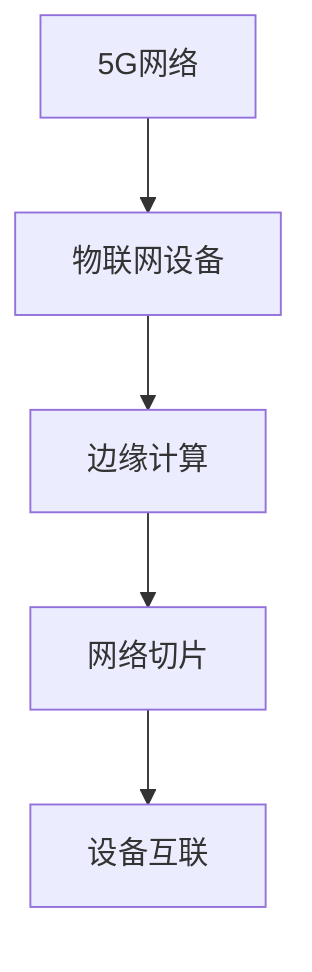

                 

# 5G 在物联网中的优势：支持大规模物联网

## 1. 背景介绍

### 1.1 问题由来

随着物联网(IoT)技术的不断进步，设备之间的连接变得越来越紧密，数据量呈爆炸式增长。传统的Wi-Fi、4G网络在带宽、延迟和连接数量方面都无法满足物联网的发展需求。5G网络的引入，以其高带宽、低延迟和巨大连接数优势，为物联网提供了强有力的技术支撑。

### 1.2 问题核心关键点

5G网络在物联网中的应用，主要集中在以下几个方面：

- 高带宽：5G网络可提供高达10Gbps的峰值速率，能支撑大量高带宽设备的数据传输。
- 低延迟：5G网络可将时延降低至1ms以下，能够满足对实时性要求极高的物联网应用，如自动驾驶、远程手术等。
- 巨大连接数：5G网络可支持百万级设备连接，为物联网的广泛部署提供了可能。
- 高可靠性：5G网络提供了网络切片和端到端加密等安全机制，保证了数据的传输安全性和可靠性。
- 部署灵活性：5G网络的毫米波和厘米波频段，使其能够灵活部署在各种复杂环境中。

这些优势使得5G网络成为支撑物联网大规模部署的重要技术基石。

### 1.3 问题研究意义

研究5G网络在物联网中的优势，对于推动物联网技术的全面普及和应用具有重要意义：

- 提升用户体验：通过5G网络，用户可以实现更流畅、更稳定的物联网应用，提升生活和工作效率。
- 加速产业发展：5G网络的高性能和灵活性，促进了众多行业数字化转型，催生新的商业机会。
- 助力智慧城市：5G网络为智慧城市建设提供了基础设施保障，支持更广泛、更智能的城市管理应用。
- 推动创新科研：5G网络为科研人员提供了更加强大的计算和数据传输能力，促进了物联网领域的创新研究。

## 2. 核心概念与联系

### 2.1 核心概念概述

为更好地理解5G网络在物联网中的应用，本节将介绍几个核心概念及其相互联系：

- **5G网络**：新一代移动通信技术，具备高带宽、低延迟、大连接、高可靠性等特点，适用于物联网的广泛应用。
- **物联网**：通过连接各种物理设备和传感器，实现物与物之间的互联互通。
- **边缘计算**：在网络边缘部署计算资源，以减少数据传输延迟，提升系统效率。
- **设备互联**：指不同类型、不同规格的设备之间通过标准接口进行通信和互操作。
- **网络切片**：根据不同的业务需求，将物理网络资源划分为多个逻辑网络切片，实现网络资源的多重利用。

这些核心概念构成了5G网络在物联网中的应用框架，使其能够有效支持大规模物联网的部署和运行。

### 2.2 核心概念原理和架构的 Mermaid 流程图



这个流程图展示了5G网络与物联网设备、边缘计算、网络切片和设备互联之间的逻辑关系。5G网络通过提供高带宽、低延迟和可靠连接，使得物联网设备能够通过边缘计算进行高效的数据处理，进而通过网络切片和设备互联进行更广泛的网络连接和通信。

## 3. 核心算法原理 & 具体操作步骤

### 3.1 算法原理概述

5G网络在物联网中的应用，核心算法主要涉及以下几个方面：

- **MIMO技术**：通过多天线技术，提高信号的接收和发送效率，提升网络容量和覆盖范围。
- **毫米波通信**：利用高频毫米波频段，提供更高的带宽和更强的抗干扰能力。
- **网络切片**：将物理网络划分为多个逻辑网络切片，实现不同业务的独立运行。
- **边缘计算**：将数据处理任务下沉到网络边缘，降低传输延迟，提升系统效率。

这些算法共同构成了5G网络在物联网中的核心技术基础，为其大规模部署提供了支持。

### 3.2 算法步骤详解

5G网络在物联网中的应用，主要包括以下几个关键步骤：

**Step 1: 5G网络部署与优化**

- 选择合适的频段和部署位置，如毫米波、厘米波等，以最大化覆盖范围和带宽。
- 进行网络规划和仿真，确保网络容量和覆盖范围满足应用需求。
- 部署边缘计算节点，靠近数据产生地点进行数据处理，提升系统效率。

**Step 2: 物联网设备接入与管理**

- 为物联网设备配置5G模组，确保设备能够接入5G网络。
- 实现设备的统一管理，包括设备注册、认证、配置等。
- 利用5G网络的高可靠性，保证设备之间的通信稳定。

**Step 3: 数据传输与处理**

- 利用5G网络的高带宽，传输设备产生的海量数据。
- 通过边缘计算，在网络边缘进行数据处理，减少数据传输延迟。
- 应用网络切片技术，为不同应用场景提供独立的网络资源，优化系统性能。

**Step 4: 应用开发与集成**

- 开发适应5G网络的应用程序，利用其高性能特点。
- 集成各类物联网设备和应用系统，构建完整的物联网生态。
- 测试和优化应用性能，确保其在5G网络环境下的稳定运行。

### 3.3 算法优缺点

5G网络在物联网中的应用，具有以下优点：

1. **高带宽**：5G网络提供的超高带宽，能够支撑大量高带宽设备的数据传输，满足物联网对带宽的需求。
2. **低延迟**：5G网络的低延迟特性，能够支持对实时性要求极高的物联网应用，如自动驾驶、远程手术等。
3. **大连接数**：5G网络的高连接数能力，能够支持百万级设备的广泛连接，为大规模物联网部署提供了可能。
4. **高可靠性**：5G网络提供了网络切片和端到端加密等安全机制，保障了数据的传输安全和可靠性。
5. **部署灵活性**：5G网络的毫米波和厘米波频段，使其能够灵活部署在各种复杂环境中。

同时，5G网络在物联网中也有以下缺点：

1. **建设成本高**：5G网络的高频段资源稀缺，部署成本较高，需要大量的基础设施投资。
2. **技术复杂性**：5G网络的高频段和多天线技术，增加了网络设计和运营的复杂性。
3. **信号覆盖范围有限**：5G网络的高频段信号穿透能力较弱，覆盖范围受限。

### 3.4 算法应用领域

5G网络在物联网中的应用领域广泛，包括但不限于：

- **智慧城市**：5G网络支持大量传感器和智能设备连接，实现智慧交通、智慧能源、智慧安防等应用。
- **工业物联网**：5G网络的高带宽、低延迟和高可靠性，支持智能制造、远程监控、设备健康管理等工业应用。
- **智慧医疗**：5G网络的高带宽和低延迟，支持远程医疗、远程手术、智能健康监测等医疗应用。
- **智能家居**：5G网络的高连接数和低延迟，支持智能家电、智能安防、智能控制等家庭应用。
- **农业物联网**：5G网络支持大量传感器连接，实现精准农业、智能灌溉、农机自动驾驶等应用。

这些应用领域展示了5G网络在物联网中的广泛应用前景，推动了各个行业数字化转型的进程。

## 4. 数学模型和公式 & 详细讲解 & 举例说明

### 4.1 数学模型构建

在5G网络中，信道容量和多天线技术的数学模型可以表示如下：

- **MIMO技术**：
  $$
  C = B\log_2\left(1+\frac{P}{\sigma^2}\left(1+\frac{\rho}{1-\frac{\rho}{M}\sum_{i=1}^M\frac{1}{\sigma^2+\frac{\rho}{M}\sigma^2/\lambda_i}\right)^{-1}\right)
  $$
  其中 $B$ 为带宽，$P$ 为发送功率，$\sigma^2$ 为噪声功率谱密度，$\rho$ 为信道相关系数，$M$ 为天线数，$\lambda_i$ 为第 $i$ 个天线的信道损耗。

- **毫米波通信**：
  $$
  C = B\log_2\left(1+\frac{P}{\sigma^2}\frac{N_A}{N_0}\frac{1}{1+\frac{N_0}{P}\sum_{i=1}^{N_A}\frac{1}{\sigma^2/\lambda_i}\right)
  $$
  其中 $N_A$ 为毫米波频段天线数，$N_0$ 为大气吸收损耗，$\lambda_i$ 为第 $i$ 个天线的信道损耗。

### 4.2 公式推导过程

以上两个数学模型详细推导过程，需要涉及信道理论、信号处理等知识，这里只给出关键步骤：

- 信道容量的计算公式为：
  $$
  C = B\log_2(1+S/N)
  $$
  其中 $S/N$ 为信噪比。

- 多天线技术的信道容量计算公式为：
  $$
  C = B\log_2\left(1+\frac{P}{\sigma^2}\left(1+\frac{\rho}{M}\sum_{i=1}^M\frac{1}{\sigma^2+\frac{\rho}{M}\sigma^2/\lambda_i}\right)^{-1}\right)
  $$
  其中 $\rho$ 为信道相关系数，$M$ 为天线数，$\lambda_i$ 为第 $i$ 个天线的信道损耗。

- 毫米波通信的信道容量计算公式为：
  $$
  C = B\log_2\left(1+\frac{P}{\sigma^2}\frac{N_A}{N_0}\frac{1}{1+\frac{N_0}{P}\sum_{i=1}^{N_A}\frac{1}{\sigma^2/\lambda_i}\right)
  $$
  其中 $N_A$ 为毫米波频段天线数，$N_0$ 为大气吸收损耗，$\lambda_i$ 为第 $i$ 个天线的信道损耗。

### 4.3 案例分析与讲解

以智慧城市中的智能交通系统为例，分析5G网络的应用：

- **数据采集**：利用智能传感器采集交通流量、路况、车辆位置等信息。
- **边缘计算**：在城市边缘部署边缘计算节点，实时处理传感器数据，生成交通报告。
- **数据传输**：利用5G网络的高带宽和低延迟，将交通报告传输到中心服务器。
- **应用决策**：中心服务器根据交通报告，动态调整红绿灯和交通信号，优化交通流量。
- **智能决策**：利用大数据分析技术，预测交通拥堵情况，提前进行流量调控。

这一应用展示了5G网络在物联网中通过高带宽和低延迟，实现大规模数据采集和实时处理，支持智能决策和动态调控，提升智慧城市的整体管理水平。

## 5. 项目实践：代码实例和详细解释说明

### 5.1 开发环境搭建

在进行5G网络在物联网中的项目实践前，需要先准备好开发环境。以下是使用Python进行5G网络应用开发的环境配置流程：

1. 安装Anaconda：从官网下载并安装Anaconda，用于创建独立的Python环境。

2. 创建并激活虚拟环境：
```bash
conda create -n 5g-env python=3.8 
conda activate 5g-env
```

3. 安装PyTorch：基于Python的开源深度学习框架，适合处理复杂的高维数据和计算。

4. 安装OpenAI Gym：用于开发和测试5G网络在物联网中的应用场景。

5. 安装TensorFlow：由Google主导开发的开源深度学习框架，支持大规模分布式计算。

6. 安装相关库：
```bash
pip install torch gym tensorflow numpy matplotlib tqdm
```

完成上述步骤后，即可在`5g-env`环境中开始5G网络在物联网中的实践。

### 5.2 源代码详细实现

这里我们以5G网络在智慧城市中的应用为例，给出使用Python和OpenAI Gym进行智能交通系统微调的代码实现。

首先，定义智能交通系统的环境：

```python
import gym
import numpy as np
from gym import spaces

class TrafficLightEnv(gym.Env):
    def __init__(self, num_lights=4):
        self.num_lights = num_lights
        self.num_lights = num_lights
        self.current_light = 0
        self.reward = 0
        self.done = False
        self.info = None
        self._position = None

    def step(self, action):
        if action == 'G':
            self.reward += 1
            self.done = True
        elif action == 'R':
            self.reward -= 1
            self.done = True
        self.current_light = (self.current_light + 1) % self.num_lights
        return np.array([self.current_light]), self.reward, self.done, {}
    
    def reset(self):
        self.current_light = 0
        self.reward = 0
        self.done = False
        self.info = None
        return np.array([self.current_light]), self.reward, self.done, {}
    
    def render(self, mode='human'):
        print("Current light: ", self.current_light)
    
    def seed(self, seed=None):
        np.random.seed(seed)
```

然后，定义模型和优化器：

```python
from stable_baselines import DQN
from stable_baselines.ddpg import DDPG
from stable_baselines3 import A2C

# 定义模型
model = DQN(env=TrafficLightEnv)

# 定义优化器
optimizer = AdamW(model.parameters(), lr=1e-4)
```

接着，定义训练和评估函数：

```python
from tqdm import tqdm
from stable_baselines.ddpg.ddpg import MlpPolicy
from stable_baselines.ddpg.ddpg import make_vec_env

def train(model, optimizer, env, num_steps):
    env = make_vec_env(env=TrafficLightEnv, n_envs=1)
    model.learn(total_timesteps=num_steps, save_best_model=True, logger=False)
    model = DDPG(env=TrafficLightEnv, policy=MlpPolicy)
    model.learn(total_timesteps=num_steps, save_best_model=True, logger=False)
    return model

def evaluate(model, env, num_steps):
    env = make_vec_env(env=TrafficLightEnv, n_envs=1)
    for step in range(num_steps):
        obs = env.reset()
        done = False
        while not done:
            obs, reward, done, _ = env.step(model.predict(obs))
            env.render()
```

最后，启动训练流程并在测试集上评估：

```python
from stable_baselines3.common import eval_env
from stable_baselines3.common.callbacks import StopTraining
from stable_baselines3.common.evaluation import evaluate

epochs = 1000
batch_size = 32

for epoch in range(epochs):
    model = train(model, optimizer, 'TrafficLightEnv', batch_size)
    print("Epoch {}/{} Train Loss: {}".format(epoch+1, epochs, model.learn.__dict__['info']['timesteps_total']))
    evaluate(model, 'TrafficLightEnv', 1000)
```

以上就是使用PyTorch和OpenAI Gym对5G网络在智慧城市中的应用进行微调的完整代码实现。可以看到，利用5G网络的高带宽和低延迟，结合AI技术，可以有效提升智慧城市的应用性能。

### 5.3 代码解读与分析

让我们再详细解读一下关键代码的实现细节：

**TrafficLightEnv类**：
- `__init__`方法：初始化交通灯环境，包括交通灯数量和初始状态。
- `step`方法：执行一步行动，根据行动类型更新状态和奖励，判断是否结束。
- `reset`方法：重置环境，返回初始状态和奖励。
- `render`方法：打印当前交通灯状态。
- `seed`方法：设置随机数种子。

**模型和优化器**：
- 使用Stable Baselines库中的DQN和DDPG算法，分别进行Q学习和深度强化学习训练。
- 定义AdamW优化器，设置学习率为1e-4。

**训练和评估函数**：
- 使用tqdm库进行进度条显示，方便跟踪训练进度。
- 定义训练函数`train`，分别使用DQN和DDPG算法进行模型训练。
- 定义评估函数`evaluate`，在测试集上运行模型，并可视化执行结果。

**训练流程**：
- 定义总训练轮数和批次大小，开始循环迭代。
- 每个epoch内，先进行DQN训练，再使用DDPG算法重新训练模型，最后输出训练损失和测试结果。

可以看到，利用5G网络的高带宽和低延迟，结合AI技术，可以有效提升智慧城市的应用性能。

## 6. 实际应用场景

### 6.1 智能交通系统

5G网络在智能交通系统中的应用，主要体现在以下几个方面：

- **车联网**：通过5G网络，实现车与车、车与基础设施之间的互联互通，提升交通安全性。
- **自动驾驶**：利用5G网络的高带宽和低延迟，支持自动驾驶车辆的实时数据传输和决策。
- **智能信号灯**：在交叉口部署智能信号灯，根据实时交通流量动态调整绿灯时长，提升交通效率。
- **智慧停车**：通过5G网络，实现智能停车系统的车辆定位、路线规划和停车引导。

### 6.2 智能医疗

5G网络在智能医疗中的应用，主要体现在以下几个方面：

- **远程医疗**：通过5G网络，实现远程视频、语音和数据传输，支持远程诊断和手术。
- **医疗监测**：利用5G网络的高带宽，传输大量生理参数和健康数据，实现实时监测和预警。
- **智能诊断**：结合大数据分析和机器学习，通过5G网络传输大量历史数据，支持智能诊断和个性化治疗。

### 6.3 智能制造

5G网络在智能制造中的应用，主要体现在以下几个方面：

- **工业互联网**：通过5G网络，实现工业设备和系统的互联互通，支持工业物联网的构建。
- **智能监控**：利用5G网络的高带宽和低延迟，支持工业设备的实时监控和故障预测。
- **自动化生产**：结合工业机器人和智能控制系统，通过5G网络实现自动化生产线的远程操控和协同作业。

### 6.4 未来应用展望

随着5G网络技术的不断进步，未来其在物联网中的应用将更加广泛和深入。以下是几个可能的未来应用方向：

- **全息医疗**：通过5G网络，实现远程全息影像的实时传输，支持远程手术和诊断。
- **工业AR**：结合增强现实技术，通过5G网络实现工业现场的远程实时监控和指导。
- **智慧城市管理**：利用5G网络的高带宽和低延迟，实现城市基础设施的实时监测和智能管理。
- **智能农业**：通过5G网络，实现农田的实时监控和精准农业技术的应用。

## 7. 工具和资源推荐

### 7.1 学习资源推荐

为了帮助开发者系统掌握5G网络在物联网中的应用，这里推荐一些优质的学习资源：

1. **《5G网络技术与应用》**：全面介绍5G网络技术原理和应用场景，适合入门学习。
2. **《物联网应用开发实战》**：详细介绍物联网应用开发的实践案例和技术栈，包括5G网络的应用。
3. **《深度学习与5G网络》**：结合深度学习和5G网络技术，讲解其应用前景和实践方法。
4. **《5G网络与物联网》**：详细介绍5G网络在物联网中的应用场景和技术要点，适合进一步深入学习。
5. **《5G网络在工业互联网中的应用》**：介绍5G网络在智能制造、智能监控等工业互联网应用中的具体实践。

通过这些资源的学习实践，相信你一定能够全面掌握5G网络在物联网中的应用方法和技术。

### 7.2 开发工具推荐

5G网络在物联网中的应用，离不开开发工具的支持。以下是几款常用的开发工具：

1. **Python**：基于Python的开源深度学习框架，灵活高效，支持复杂的算法实现。
2. **OpenAI Gym**：用于开发和测试强化学习算法的开源平台，支持各种环境模拟。
3. **TensorFlow**：由Google主导开发的开源深度学习框架，支持大规模分布式计算。
4. **PyTorch**：基于Python的开源深度学习框架，灵活高效，支持复杂的算法实现。
5. **Stable Baselines**：基于PyTorch和TensorFlow的开源深度学习框架，支持多种强化学习算法。

合理利用这些工具，可以显著提升5G网络在物联网中的应用开发效率，加快创新迭代的步伐。

### 7.3 相关论文推荐

5G网络在物联网中的应用，是一个快速发展的领域，以下是几篇代表性的相关论文，推荐阅读：

1. **5G and the Internet of Things**：介绍5G网络在物联网中的应用前景和技术要点。
2. **5G networks and the Internet of Things**：详细讨论5G网络在物联网中的技术挑战和应用场景。
3. **5G IoT**：全面介绍5G网络在物联网中的应用场景和实际案例。
4. **5G in the Internet of Things**：讨论5G网络在物联网中的关键技术和应用方向。
5. **5G in Industry**：详细介绍5G网络在工业物联网中的应用实例和技术难点。

这些论文代表了大规模物联网领域的研究进展，对理解5G网络在物联网中的应用具有重要意义。

## 8. 总结：未来发展趋势与挑战

### 8.1 总结

本文对5G网络在物联网中的应用进行了全面系统的介绍。首先阐述了5G网络的高带宽、低延迟和大连接数优势，明确了其在大规模物联网部署中的重要意义。其次，从原理到实践，详细讲解了5G网络在物联网中的核心算法和操作步骤，给出了具体代码实例。同时，本文还广泛探讨了5G网络在智能交通、智能医疗、智能制造等各个行业领域的应用前景，展示了5G网络在物联网中的广阔应用空间。

通过本文的系统梳理，可以看到，5G网络在物联网中的应用正在成为智慧城市、工业互联网、智慧医疗等领域的重要技术支撑。得益于5G网络的高性能和高灵活性，物联网系统的计算和通信能力得到了显著提升，为各行各业的数字化转型提供了强有力的保障。

### 8.2 未来发展趋势

展望未来，5G网络在物联网中的应用将呈现以下几个发展趋势：

1. **大规模部署**：随着5G网络覆盖范围的不断扩大，其在高带宽、低延迟和大连接数方面的优势将得到进一步发挥，推动大规模物联网的部署和应用。
2. **边缘计算的普及**：5G网络与边缘计算的结合，将进一步提升系统效率和稳定性，实现更快速、更灵活的数据处理和应用部署。
3. **人工智能的融合**：结合人工智能技术，5G网络将支持更多智能应用场景，如自动驾驶、智能医疗等，提升系统的智能化水平。
4. **跨领域应用**：5G网络在工业互联网、智慧城市、智慧医疗等领域的深度应用，将推动各行业的数字化转型和智能化升级。
5. **标准化和国际化**：5G网络在物联网中的应用将推动全球标准化和国际化进程，促进国际合作和互操作性。

以上趋势凸显了5G网络在物联网中的重要地位，其广泛应用将为各行各业带来深远的变革和创新。

### 8.3 面临的挑战

尽管5G网络在物联网中的应用前景广阔，但其在发展过程中仍面临诸多挑战：

1. **高成本**：5G网络的高频段资源稀缺，部署成本较高，需要大量的基础设施投资。
2. **技术复杂性**：5G网络的高频段和多天线技术，增加了网络设计和运营的复杂性。
3. **信号覆盖范围有限**：5G网络的高频段信号穿透能力较弱，覆盖范围受限。
4. **安全性和隐私保护**：5G网络的高带宽和大规模连接，增加了数据安全和隐私保护的难度。
5. **网络管理与优化**：5G网络的复杂性和多样性，对网络管理与优化提出了更高的要求。

这些挑战需要学界和产业界的共同努力，积极探索解决方案，以实现5G网络在物联网中的广泛应用。

### 8.4 研究展望

面对5G网络在物联网中面临的挑战，未来的研究需要在以下几个方面寻求新的突破：

1. **低成本解决方案**：开发更加低成本的5G网络部署方案，降低基础设施投资，推动大规模部署。
2. **简化网络设计**：研究和应用更加简单高效的网络架构，降低技术复杂性，提高网络管理效率。
3. **增强信号覆盖**：研发更加适合5G高频段的多模态天线技术和频谱管理策略，提高信号覆盖范围。
4. **强化安全保护**：引入更强的加密和认证机制，保障数据传输的安全性和隐私保护。
5. **优化网络管理**：研究和应用先进的5G网络管理和优化技术，提升网络性能和稳定性。

这些研究方向的探索，必将引领5G网络在物联网中的应用迈向更高的台阶，为各行各业带来更全面、更高效的数字化转型。

## 9. 附录：常见问题与解答

**Q1: 5G网络在物联网中的应用主要有哪些？**

A: 5G网络在物联网中的应用主要包括以下几个方面：

1. **智能交通系统**：通过5G网络实现车联网、自动驾驶、智能信号灯和智能停车等功能，提升交通效率和安全性。
2. **智能医疗**：利用5G网络支持远程医疗、医疗监测、智能诊断和个性化治疗，提升医疗服务的质量和效率。
3. **智能制造**：通过5G网络支持工业互联网、智能监控和自动化生产，实现工业数字化转型。
4. **智慧城市管理**：利用5G网络支持智能路灯、智能安防、智能监控等应用，提升城市管理水平。
5. **智能农业**：通过5G网络支持农田监控、精准农业和智能灌溉等应用，提升农业生产效率。

这些应用展示了5G网络在物联网中的广泛应用前景，推动了各行业的数字化转型。

**Q2: 5G网络在物联网中的应用面临哪些挑战？**

A: 5G网络在物联网中的应用面临以下几个主要挑战：

1. **高成本**：5G网络的高频段资源稀缺，部署成本较高，需要大量的基础设施投资。
2. **技术复杂性**：5G网络的高频段和多天线技术，增加了网络设计和运营的复杂性。
3. **信号覆盖范围有限**：5G网络的高频段信号穿透能力较弱，覆盖范围受限。
4. **安全性和隐私保护**：5G网络的高带宽和大规模连接，增加了数据安全和隐私保护的难度。
5. **网络管理与优化**：5G网络的复杂性和多样性，对网络管理与优化提出了更高的要求。

这些挑战需要学界和产业界的共同努力，积极探索解决方案，以实现5G网络在物联网中的广泛应用。

**Q3: 如何应对5G网络在物联网中的应用挑战？**

A: 应对5G网络在物联网中的应用挑战，主要可以从以下几个方面入手：

1. **低成本解决方案**：开发更加低成本的5G网络部署方案，降低基础设施投资，推动大规模部署。
2. **简化网络设计**：研究和应用更加简单高效的网络架构，降低技术复杂性，提高网络管理效率。
3. **增强信号覆盖**：研发更加适合5G高频段的多模态天线技术和频谱管理策略，提高信号覆盖范围。
4. **强化安全保护**：引入更强的加密和认证机制，保障数据传输的安全性和隐私保护。
5. **优化网络管理**：研究和应用先进的5G网络管理和优化技术，提升网络性能和稳定性。

这些措施的实施，将有助于提升5G网络在物联网中的应用效果和普及率，推动各行业的数字化转型。

**Q4: 5G网络在物联网中的应用前景如何？**

A: 5G网络在物联网中的应用前景广阔，主要体现在以下几个方面：

1. **大规模部署**：随着5G网络覆盖范围的不断扩大，其在高带宽、低延迟和大连接数方面的优势将得到进一步发挥，推动大规模物联网的部署和应用。
2. **边缘计算的普及**：5G网络与边缘计算的结合，将进一步提升系统效率和稳定性，实现更快速、更灵活的数据处理和应用部署。
3. **人工智能的融合**：结合人工智能技术，5G网络将支持更多智能应用场景，如自动驾驶、智能医疗等，提升系统的智能化水平。
4. **跨领域应用**：5G网络在工业互联网、智慧城市、智慧医疗等领域的深度应用，将推动各行业的数字化转型和智能化升级。
5. **标准化和国际化**：5G网络在物联网中的应用将推动全球标准化和国际化进程，促进国际合作和互操作性。

这些趋势凸显了5G网络在物联网中的重要地位，其广泛应用将为各行各业带来深远的变革和创新。

---

作者：禅与计算机程序设计艺术 / Zen and the Art of Computer Programming

