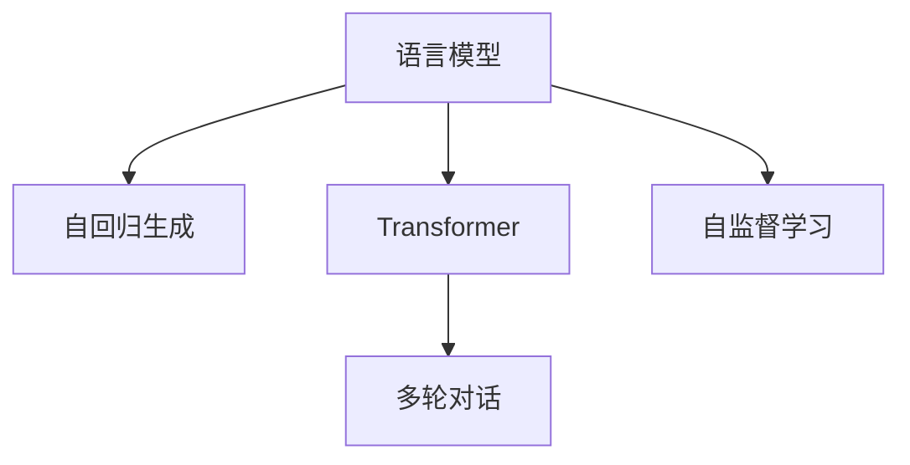

                 

# GPT 系列：语言模型的里程碑

> 关键词：GPT系列,语言模型,自然语言处理,NLP,深度学习,Transformer

## 1. 背景介绍

### 1.1 问题由来
自深度学习时代兴起以来，自然语言处理(Natural Language Processing, NLP)一直是AI技术研究和应用的前沿领域之一。早期NLP的主要挑战在于如何有效地将自然语言数据转化为计算机能够理解的数字信号。而在深度学习的推动下，NLP领域迎来了翻天覆地的变化。其中，语言模型（Language Models）作为核心的基础模型，极大地推动了NLP技术的进步。

特别是近年来，基于自回归（Autoregressive）架构的生成型语言模型（Generative Language Models），以其卓越的生成能力和泛化性能，成为了NLP领域的焦点。GPT系列模型便是在这一背景下应运而生，并迅速在自然语言生成、理解和推理等多个方向上取得了一系列突破。

### 1.2 问题核心关键点
GPT系列模型是通过大规模无标签文本数据进行预训练，获得语言表示，然后在下游任务上进行微调，从而获得特定任务优化的模型。GPT模型系列包括GPT-1, GPT-2, GPT-3, GPT-3.5等，每个版本都在模型架构、参数规模和预训练策略上进行不断的改进和创新，逐步推动了NLP技术的边界。

GPT模型系列的核心关键点包括：
- 自回归生成机制，能够高效生成连贯且高质量的自然语言文本。
- 大规模参数规模，带来了更强的语言建模能力和泛化性能。
- 基于Transformer的架构，能够实现高效的并行计算和可解释性。
- 多轮对话能力，能够进行复杂的人类交互。

这些核心点使得GPT系列模型成为了语言处理领域的里程碑，其发展历程和应用场景也成为研究和应用NLP技术的重要参考。

## 2. 核心概念与联系

### 2.1 核心概念概述

为更好地理解GPT系列模型的原理和架构，本节将介绍几个密切相关的核心概念：

- 生成型语言模型（Generative Language Models）：通过学习文本数据的概率分布，能够生成新的连贯语言文本的模型。
- 自回归（Autoregressive）：指模型利用之前生成的词语预测下一个词语，从而逐步生成完整的文本序列。
- Transformer：一种基于注意力机制（Attention Mechanism）的神经网络架构，能够高效处理长序列数据。
- 自监督学习（Self-Supervised Learning）：利用无标签数据进行训练，自动学习模型参数。

这些概念之间存在紧密的联系，共同构成了GPT系列模型的核心框架。

### 2.2 核心概念原理和架构的 Mermaid 流程图



这个流程图展示了语言模型的核心概念及其相互关系：

1. 语言模型利用自回归机制生成连贯的文本序列。
2. Transformer架构提供了高效的并行计算和可解释性。
3. 自监督学习从大规模无标签数据中自动学习模型参数。
4. 多轮对话能力使得模型能够进行复杂的人类交互。

这些概念共同构成了GPT系列模型的工作原理，推动了其发展与应用。

## 3. 核心算法原理 & 具体操作步骤
### 3.1 算法原理概述

GPT系列模型的核心算法原理包括：自回归生成、Transformer架构、自监督学习和多轮对话。

**自回归生成**：GPT模型通过自回归的方式生成文本，即在每个时间步，模型只依赖于之前生成的词语，逐步构建文本序列。这种机制能够保证生成的文本连贯且语法正确。

**Transformer架构**：Transformer是GPT系列模型的基础架构，采用注意力机制，能够高效处理长序列数据，并且具有可解释性。

**自监督学习**：GPT系列模型通过自监督学习，从大规模无标签数据中自动学习语言模型参数。这种无监督学习方式能够提高模型的泛化能力和语言建模能力。

**多轮对话**：GPT系列模型通过多轮对话机制，能够进行复杂的交互，理解上下文并生成合理的回复。

### 3.2 算法步骤详解

GPT系列模型的训练和应用过程大致可以分为以下几个步骤：

**Step 1: 数据准备**
- 收集大规模无标签文本数据，用于预训练和微调。
- 将文本数据预处理为模型所需的格式，如分词、编码等。

**Step 2: 预训练**
- 使用自监督学习任务，如语言模型预测、掩码语言模型（Masked Language Model）等，对模型进行预训练。
- 预训练的目标是使模型学习到文本的语义结构和语言模式。

**Step 3: 微调**
- 根据具体任务的需求，在预训练模型上进行微调。
- 微调过程可以使用监督学习任务，如分类、匹配、生成等，提高模型在特定任务上的性能。

**Step 4: 推理和应用**
- 使用微调后的模型对新的输入数据进行推理和生成。
- 将模型集成到实际应用系统中，如聊天机器人、文本摘要、翻译等。

### 3.3 算法优缺点

GPT系列模型的优点包括：
1. 生成能力强：自回归机制能够生成高质量、连贯的文本。
2. 泛化能力强：Transformer架构和自监督学习提升了模型的泛化能力。
3. 可解释性强：Transformer的注意力机制使得模型具有可解释性。
4. 应用广泛：GPT系列模型在多种NLP任务上取得了优异的效果。

同时，GPT系列模型也存在一些缺点：
1. 参数量巨大：随着模型规模的增大，模型参数量呈指数增长，训练和推理成本较高。
2. 对抗攻击脆弱：自回归机制使得模型对输入序列中的微小扰动敏感。
3. 长尾分布处理能力不足：对于长尾分布的文本数据，模型可能无法很好地泛化。

尽管存在这些缺点，GPT系列模型的核心算法原理依然为NLP技术的发展提供了重要的参考。

### 3.4 算法应用领域

GPT系列模型在多个NLP应用领域中发挥了重要作用，包括：

- 文本生成：如文章撰写、对话生成、摘要生成等。GPT系列模型能够高效生成连贯且高质量的文本。
- 机器翻译：GPT系列模型在翻译任务上取得了显著的进展，能够实现高效且准确的跨语言翻译。
- 问答系统：通过多轮对话机制，GPT系列模型能够理解和生成合理的问答对。
- 情感分析：能够自动分析文本中的情感倾向，并输出情感分类结果。
- 代码生成：生成符合编程规范的代码片段，辅助编程工作。
- 语音识别：将语音转换为文本，并进行后续处理。

除了这些经典任务外，GPT系列模型还被应用于更多前沿领域，如可控文本生成、推理问答、知识图谱构建等，推动了NLP技术的不断创新和发展。

## 4. 数学模型和公式 & 详细讲解 & 举例说明

### 4.1 数学模型构建

GPT系列模型的核心数学模型包括自回归生成模型和Transformer架构。以下将详细讲解这些模型的构建过程。

**自回归生成模型**：

$$
P(w_1,w_2,...,w_n|w_1^{-1}) = \prod_{i=1}^n P(w_i|w_1^{-1}, w_2^{-1}, ..., w_{i-1}^{-1})
$$

其中，$w_1,...,w_n$为文本序列，$w_1^{-1}$为之前生成的文本。这个公式表示，每个词语的条件概率只依赖于之前生成的文本，而与后续文本无关。

**Transformer架构**：

Transformer包括多个编码器层和解码器层，每个层包含多头自注意力机制（Multi-Head Self-Attention）和前馈神经网络（Feedforward Neural Network）。以下以多头自注意力机制为例，讲解其计算过程。

设输入序列为$x=[x_1,...,x_N]$，多头自注意力机制的输出为$y=[y_1,...,y_N]$，计算公式为：

$$
y_i = \sum_{j=1}^N \alpha_{ij}x_j
$$

其中，$\alpha_{ij}=\frac{e^{\text{dot}(q_i, k_j)}}{\sum_{k=1}^N e^{\text{dot}(q_i, k_k)}}$，$q_i$为查询向量，$k_j$为键向量。

### 4.2 公式推导过程

**自回归生成模型**：

$$
P(w_1,w_2,...,w_n|w_1^{-1}) = \prod_{i=1}^n P(w_i|w_1^{-1}, w_2^{-1}, ..., w_{i-1}^{-1})
$$

通过计算每个词语的条件概率，能够逐步生成完整的文本序列。

**Transformer架构**：

Transformer的注意力机制通过计算查询、键、值向量间的相似度，得到每个位置的注意力权重，从而加权求和生成输出。以多头自注意力机制为例：

$$
\alpha_{ij}=\frac{e^{\text{dot}(q_i, k_j)}}{\sum_{k=1}^N e^{\text{dot}(q_i, k_k)}}
$$

其中，$\text{dot}$表示向量的点积运算。通过调整查询向量$q_i$，可以控制模型对不同位置的关注度。

### 4.3 案例分析与讲解

**案例分析**：以BERT模型为例，分析其在NLP任务上的应用。

BERT模型通过掩码语言模型和下一句预测（Next Sentence Prediction）两种自监督任务进行预训练。掩码语言模型指将文本中的某些词语随机掩盖，预测其原始内容，从而学习词语的上下文关系。下一句预测任务指给定两个句子，判断它们是否为相邻句子，从而学习句子间的逻辑关系。

**讲解**：

1. 掩码语言模型：通过掩盖文本中的某些词语，使模型学习上下文关系，如词语的语义关系、位置关系等。
2. 下一句预测任务：通过判断两个句子是否为相邻句子，学习句子间的逻辑关系，如因果、时间、空间等。
3. 预训练目标：通过这些自监督任务，自动学习模型的语言表示，提高模型的泛化能力。

## 5. 项目实践：代码实例和详细解释说明

### 5.1 开发环境搭建

在进行GPT系列模型的开发和应用前，需要准备开发环境。以下是使用Python进行PyTorch开发的环境配置流程：

1. 安装Anaconda：从官网下载并安装Anaconda，用于创建独立的Python环境。

2. 创建并激活虚拟环境：
```bash
conda create -n gpt-env python=3.8 
conda activate gpt-env
```

3. 安装PyTorch：根据CUDA版本，从官网获取对应的安装命令。例如：
```bash
conda install pytorch torchvision torchaudio cudatoolkit=11.1 -c pytorch -c conda-forge
```

4. 安装Transformer库：
```bash
pip install transformers
```

5. 安装各类工具包：
```bash
pip install numpy pandas scikit-learn matplotlib tqdm jupyter notebook ipython
```

完成上述步骤后，即可在`gpt-env`环境中开始GPT模型的开发和应用。

### 5.2 源代码详细实现

下面我们以GPT-2模型为例，给出使用Transformers库进行训练的PyTorch代码实现。

首先，定义训练函数：

```python
from transformers import GPT2Tokenizer, GPT2LMHeadModel, AdamW, get_linear_schedule_with_warmup

def train_epoch(model, data_loader, optimizer, device, train_scheduler=None):
    model.train()
    epoch_loss = 0
    for batch in data_loader:
        input_ids = batch[0].to(device)
        attention_mask = batch[1].to(device)
        labels = batch[2].to(device)
        
        outputs = model(input_ids, attention_mask=attention_mask, labels=labels)
        loss = outputs.loss
        epoch_loss += loss.item()
        
        optimizer.zero_grad()
        loss.backward()
        optimizer.step()
        
        if train_scheduler:
            train_scheduler.step()
    return epoch_loss / len(data_loader)
```

然后，定义评估函数：

```python
from transformers import SentencePieceProcessor

def evaluate(model, data_loader, device, processor):
    model.eval()
    eval_loss = 0
    eval_samples = 0
    with torch.no_grad():
        for batch in data_loader:
            input_ids = batch[0].to(device)
            attention_mask = batch[1].to(device)
            labels = batch[2].to(device)
            
            outputs = model(input_ids, attention_mask=attention_mask)
            eval_loss += outputs.loss.item()
            eval_samples += labels.size(0)
    
    return eval_loss / eval_samples
```

最后，启动训练流程并在测试集上评估：

```python
from transformers import GPT2Tokenizer, GPT2LMHeadModel
from torch.utils.data import DataLoader
import torch

tokenizer = GPT2Tokenizer.from_pretrained('gpt2')
model = GPT2LMHeadModel.from_pretrained('gpt2')

device = torch.device('cuda') if torch.cuda.is_available() else torch.device('cpu')

train_loader = DataLoader(train_dataset, batch_size=32, shuffle=True)
test_loader = DataLoader(test_dataset, batch_size=32, shuffle=False)

optimizer = AdamW(model.parameters(), lr=2e-5)
train_scheduler = get_linear_schedule_with_warmup(optimizer, num_warmup_steps=0, num_training_steps=len(train_loader) * epochs)

for epoch in range(epochs):
    loss = train_epoch(model, train_loader, optimizer, device, train_scheduler)
    print(f"Epoch {epoch+1}, train loss: {loss:.3f}")
    
    print(f"Epoch {epoch+1}, test results:")
    evaluate(model, test_loader, device, tokenizer.processor)
    
print("All training epochs finished.")
```

以上就是使用PyTorch进行GPT-2模型训练的完整代码实现。可以看到，得益于Transformers库的强大封装，我们能够以相对简洁的代码完成模型的加载和训练。

### 5.3 代码解读与分析

让我们再详细解读一下关键代码的实现细节：

**train_epoch函数**：
- 定义训练函数，每个epoch循环迭代训练数据。
- 使用AdamW优化器和线性调度器，对模型参数进行更新。
- 计算并累加每个批次的损失。
- 在每个epoch结束后，返回平均损失。

**evaluate函数**：
- 定义评估函数，计算模型在测试集上的平均损失。
- 使用SentencePieceProcessor处理输出，转换为可读的文本。

**训练流程**：
- 定义总的epoch数和batch size，开始循环迭代。
- 每个epoch内，先在训练集上训练，输出平均损失。
- 在验证集上评估，输出评估结果。
- 所有epoch结束后，在测试集上评估，给出最终测试结果。

可以看到，PyTorch配合Transformers库使得GPT-2模型的训练代码实现变得简洁高效。开发者可以将更多精力放在数据处理、模型改进等高层逻辑上，而不必过多关注底层的实现细节。

当然，工业级的系统实现还需考虑更多因素，如模型的保存和部署、超参数的自动搜索、更灵活的任务适配层等。但核心的训练流程基本与此类似。

## 6. 实际应用场景

### 6.1 智能客服系统

基于GPT系列模型的对话技术，可以广泛应用于智能客服系统的构建。传统客服往往需要配备大量人力，高峰期响应缓慢，且一致性和专业性难以保证。而使用GPT系列模型的对话模型，可以7x24小时不间断服务，快速响应客户咨询，用自然流畅的语言解答各类常见问题。

在技术实现上，可以收集企业内部的历史客服对话记录，将问题和最佳答复构建成监督数据，在此基础上对预训练对话模型进行微调。微调后的对话模型能够自动理解用户意图，匹配最合适的答案模板进行回复。对于客户提出的新问题，还可以接入检索系统实时搜索相关内容，动态组织生成回答。如此构建的智能客服系统，能大幅提升客户咨询体验和问题解决效率。

### 6.2 金融舆情监测

金融机构需要实时监测市场舆论动向，以便及时应对负面信息传播，规避金融风险。传统的人工监测方式成本高、效率低，难以应对网络时代海量信息爆发的挑战。基于GPT系列模型的文本分类和情感分析技术，为金融舆情监测提供了新的解决方案。

具体而言，可以收集金融领域相关的新闻、报道、评论等文本数据，并对其进行主题标注和情感标注。在此基础上对预训练语言模型进行微调，使其能够自动判断文本属于何种主题，情感倾向是正面、中性还是负面。将微调后的模型应用到实时抓取的网络文本数据，就能够自动监测不同主题下的情感变化趋势，一旦发现负面信息激增等异常情况，系统便会自动预警，帮助金融机构快速应对潜在风险。

### 6.3 个性化推荐系统

当前的推荐系统往往只依赖用户的历史行为数据进行物品推荐，无法深入理解用户的真实兴趣偏好。基于GPT系列模型的个性化推荐系统可以更好地挖掘用户行为背后的语义信息，从而提供更精准、多样的推荐内容。

在实践中，可以收集用户浏览、点击、评论、分享等行为数据，提取和用户交互的物品标题、描述、标签等文本内容。将文本内容作为模型输入，用户的后续行为（如是否点击、购买等）作为监督信号，在此基础上微调预训练语言模型。微调后的模型能够从文本内容中准确把握用户的兴趣点。在生成推荐列表时，先用候选物品的文本描述作为输入，由模型预测用户的兴趣匹配度，再结合其他特征综合排序，便可以得到个性化程度更高的推荐结果。

### 6.4 未来应用展望

随着GPT系列模型的不断发展，其应用场景将不断拓展，为各行各业带来变革性影响。

在智慧医疗领域，基于GPT系列模型的医疗问答、病历分析、药物研发等应用将提升医疗服务的智能化水平，辅助医生诊疗，加速新药开发进程。

在智能教育领域，GPT系列模型的对话技术和知识生成能力，可用于作业批改、学情分析、知识推荐等方面，因材施教，促进教育公平，提高教学质量。

在智慧城市治理中，GPT系列模型的自然语言理解能力，可用于城市事件监测、舆情分析、应急指挥等环节，提高城市管理的自动化和智能化水平，构建更安全、高效的未来城市。

此外，在企业生产、社会治理、文娱传媒等众多领域，GPT系列模型的文本生成和理解能力，也将带来新的突破。相信随着技术的日益成熟，GPT系列模型必将在构建人机协同的智能时代中扮演越来越重要的角色。

## 7. 工具和资源推荐
### 7.1 学习资源推荐

为了帮助开发者系统掌握GPT系列模型的理论基础和实践技巧，这里推荐一些优质的学习资源：

1. 《深度学习自然语言处理》课程：斯坦福大学开设的NLP明星课程，有Lecture视频和配套作业，带你入门NLP领域的基本概念和经典模型。

2. CS224N《Natural Language Processing with Transformers》课程：Coursera上的高级课程，深入讲解Transformer的原理和实践，适合进阶学习者。

3. 《Transformers》书籍：Jurafsky和Martins所著，全面介绍了Transformer架构和相关NLP模型的发展，适合深度学习从业者。

4. HuggingFace官方文档：包含GPT系列模型的详细介绍和应用示例，是学习和实践的重要参考资料。

5. CLUE开源项目：中文语言理解测评基准，涵盖大量不同类型的中文NLP数据集，并提供了基于GPT系列模型的baseline模型，助力中文NLP技术发展。

通过对这些资源的学习实践，相信你一定能够快速掌握GPT系列模型的精髓，并用于解决实际的NLP问题。

### 7.2 开发工具推荐

高效的开发离不开优秀的工具支持。以下是几款用于GPT系列模型微调开发的常用工具：

1. PyTorch：基于Python的开源深度学习框架，灵活动态的计算图，适合快速迭代研究。大部分预训练语言模型都有PyTorch版本的实现。

2. TensorFlow：由Google主导开发的开源深度学习框架，生产部署方便，适合大规模工程应用。同样有丰富的预训练语言模型资源。

3. Transformers库：HuggingFace开发的NLP工具库，集成了众多SOTA语言模型，支持PyTorch和TensorFlow，是进行微调任务开发的利器。

4. Weights & Biases：模型训练的实验跟踪工具，可以记录和可视化模型训练过程中的各项指标，方便对比和调优。与主流深度学习框架无缝集成。

5. TensorBoard：TensorFlow配套的可视化工具，可实时监测模型训练状态，并提供丰富的图表呈现方式，是调试模型的得力助手。

6. Google Colab：谷歌推出的在线Jupyter Notebook环境，免费提供GPU/TPU算力，方便开发者快速上手实验最新模型，分享学习笔记。

合理利用这些工具，可以显著提升GPT系列模型微调的开发效率，加快创新迭代的步伐。

### 7.3 相关论文推荐

GPT系列模型的发展源于学界的持续研究。以下是几篇奠基性的相关论文，推荐阅读：

1. Attention is All You Need：提出Transformer结构，开启了NLP领域的预训练大模型时代。

2. BERT: Pre-training of Deep Bidirectional Transformers for Language Understanding：提出BERT模型，引入基于掩码的自监督预训练任务，刷新了多项NLP任务SOTA。

3. Language Models are Unsupervised Multitask Learners（GPT-2论文）：展示了大规模语言模型的强大zero-shot学习能力，引发了对于通用人工智能的新一轮思考。

4. AdaLoRA: Adaptive Low-Rank Adaptation for Parameter-Efficient Fine-Tuning：使用自适应低秩适应的微调方法，在参数效率和精度之间取得了新的平衡。

这些论文代表了大语言模型微调技术的发展脉络。通过学习这些前沿成果，可以帮助研究者把握学科前进方向，激发更多的创新灵感。

## 8. 总结：未来发展趋势与挑战

### 8.1 总结

本文对GPT系列模型的核心算法原理、操作步骤和应用场景进行了全面系统的介绍。首先阐述了GPT系列模型的研究背景和意义，明确了其在生成文本、自然语言理解、推理问答等多个领域的重要作用。其次，从原理到实践，详细讲解了GPT系列模型的数学模型、算法步骤和代码实现，给出了微调任务开发的完整代码实例。同时，本文还广泛探讨了GPT系列模型在多个行业领域的应用前景，展示了其广阔的应用前景。此外，本文精选了模型开发和应用的相关资源，力求为读者提供全方位的技术指引。

通过本文的系统梳理，可以看到，GPT系列模型通过自回归生成机制、Transformer架构和自监督学习，推动了NLP技术的进步，其发展历程和应用场景也成为研究和应用NLP技术的重要参考。未来，伴随GPT系列模型的不断演进，其在更多领域的应用将带来更深远的变革性影响。

### 8.2 未来发展趋势

展望未来，GPT系列模型将呈现以下几个发展趋势：

1. 模型规模持续增大。随着算力成本的下降和数据规模的扩张，GPT系列模型的参数量还将持续增长，带来更强的语言建模能力和泛化性能。

2. 微调技术日趋多样。除了传统的全参数微调外，未来将涌现更多参数高效的微调方法，如LoRA、Soft-Transformer等，在节省计算资源的同时也能保证微调精度。

3. 多轮对话能力提升。GPT系列模型将在多轮对话中实现更复杂、更智能的交互，提升人机协同能力。

4. 持续学习成为常态。随着数据分布的不断变化，GPT系列模型需要持续学习新知识以保持性能，引入动态更新机制将使其更具适应性。

5. 跨领域迁移能力增强。GPT系列模型将通过多领域数据预训练和微调，具备更强的泛化能力和跨领域迁移能力。

6. 可解释性和安全性加强。模型输出的可解释性和安全性将是未来的重要研究方向，通过引入因果推断、伦理导向等方法，提升模型的透明性和可靠性。

以上趋势凸显了GPT系列模型的强大潜力和发展方向，未来的研究和应用将更加多元化，推动NLP技术迈向更广泛的应用领域。

### 8.3 面临的挑战

尽管GPT系列模型已经取得了瞩目成就，但在迈向更加智能化、普适化应用的过程中，它仍面临着诸多挑战：

1. 标注成本瓶颈。尽管微调过程可以通过少样本学习等技术降低对标注数据的依赖，但对于一些特定领域，仍然难以获得充足的高质量标注数据，成为制约微调性能的瓶颈。

2. 对抗攻击脆弱。GPT系列模型对输入序列中的微小扰动敏感，容易受到对抗攻击的影响，需要进一步提升模型的鲁棒性。

3. 长尾分布处理能力不足。对于长尾分布的文本数据，模型可能无法很好地泛化，需要在模型设计和训练策略上进行优化。

4. 推理效率有待提高。尽管GPT系列模型在生成文本方面表现优异，但在推理速度和资源占用方面仍有提升空间，需要优化模型结构、算法和硬件配置。

5. 知识整合能力不足。当前的GPT系列模型往往局限于任务内数据，难以灵活吸收和运用更广泛的先验知识，需要引入更多外部知识源进行融合。

正视这些挑战，积极应对并寻求突破，将是GPT系列模型迈向成熟的必由之路。相信随着学界和产业界的共同努力，这些挑战终将一一被克服，GPT系列模型必将在构建人机协同的智能时代中扮演越来越重要的角色。

### 8.4 研究展望

面对GPT系列模型所面临的种种挑战，未来的研究需要在以下几个方面寻求新的突破：

1. 探索无监督和半监督微调方法。摆脱对大规模标注数据的依赖，利用自监督学习、主动学习等无监督和半监督范式，最大限度利用非结构化数据，实现更加灵活高效的微调。

2. 研究参数高效和计算高效的微调范式。开发更加参数高效的微调方法，在固定大部分预训练参数的同时，只更新极少量的任务相关参数。同时优化微调模型的计算图，减少前向传播和反向传播的资源消耗，实现更加轻量级、实时性的部署。

3. 融合因果和对比学习范式。通过引入因果推断和对比学习思想，增强GPT系列模型建立稳定因果关系的能力，学习更加普适、鲁棒的语言表征，从而提升模型泛化性和抗干扰能力。

4. 引入更多先验知识。将符号化的先验知识，如知识图谱、逻辑规则等，与神经网络模型进行巧妙融合，引导微调过程学习更准确、合理的语言模型。同时加强不同模态数据的整合，实现视觉、语音等多模态信息与文本信息的协同建模。

5. 结合因果分析和博弈论工具。将因果分析方法引入GPT系列模型，识别出模型决策的关键特征，增强输出解释的因果性和逻辑性。借助博弈论工具刻画人机交互过程，主动探索并规避模型的脆弱点，提高系统稳定性。

6. 纳入伦理道德约束。在模型训练目标中引入伦理导向的评估指标，过滤和惩罚有偏见、有害的输出倾向。同时加强人工干预和审核，建立模型行为的监管机制，确保输出符合人类价值观和伦理道德。

这些研究方向的探索，必将引领GPT系列模型迈向更高的台阶，为构建安全、可靠、可解释、可控的智能系统铺平道路。面向未来，GPT系列模型还需要与其他人工智能技术进行更深入的融合，如知识表示、因果推理、强化学习等，多路径协同发力，共同推动自然语言理解和智能交互系统的进步。只有勇于创新、敢于突破，才能不断拓展语言模型的边界，让智能技术更好地造福人类社会。

## 9. 附录：常见问题与解答

**Q1：GPT系列模型如何处理长文本？**

A: GPT系列模型基于Transformer架构，天然支持长文本的生成和理解。在处理长文本时，可以通过分段处理、编码器解码器并行化等方法，提高模型的效率和性能。此外，GPT系列模型还可以结合多轮对话机制，逐步解析长文本，提高对长文本的理解和生成能力。

**Q2：GPT系列模型在多轮对话中的表现如何？**

A: GPT系列模型在多轮对话中表现优异，能够理解和生成符合上下文的自然语言文本。其多轮对话机制通过记录对话历史，动态更新模型参数，使得模型能够逐步掌握对话情境，生成更加连贯和合理的回复。通过微调和优化，GPT系列模型在多轮对话任务上已经取得了诸多突破性进展。

**Q3：GPT系列模型的训练成本如何？**

A: GPT系列模型的训练成本较高，主要是因为其大规模参数量需要大量的计算资源和时间。为了降低训练成本，可以采用分布式训练、混合精度训练、模型剪枝等技术。同时，使用预训练模型和微调技术，也可以显著降低标注数据的成本，提高模型的训练效率。

**Q4：GPT系列模型在多语言处理中的表现如何？**

A: GPT系列模型在多语言处理中表现良好，能够自动学习多种语言的语言模型。通过多语言预训练和微调，GPT系列模型能够在多种语言中实现高效的语言生成和理解。此外，模型还可以结合语言翻译技术，实现跨语言的文本处理和生成。

**Q5：GPT系列模型在生成文本时的质量如何？**

A: GPT系列模型在生成文本时的质量非常高，能够生成连贯、语法正确、符合语境的自然语言文本。其自回归生成机制和Transformer架构使得模型能够逐步构建高质量的文本序列。通过微调和优化，GPT系列模型在生成文本任务上已经取得了显著的效果，是自然语言生成领域的重要参考。

---

作者：禅与计算机程序设计艺术 / Zen and the Art of Computer Programming

