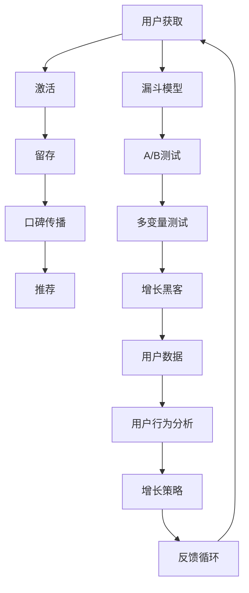

                 

## Growth Hacking创业：快速增长的秘诀

在快速变化的市场环境中，Growth Hacking成为了一种迅速提升产品增长、优化用户体验的利器。本文将系统探讨Growth Hacking的核心概念、算法原理和实践步骤，并通过数学模型和代码实例进行详细讲解，结合实际应用场景展示其在创业中的实际应用效果，为初创企业提供实用的增长策略和工具资源，并总结其未来的发展趋势和面临的挑战。

### 1. 背景介绍

Growth Hacking是一种以数据驱动、创意驱动、敏捷迭代为核心的创业方法论。它融合了增长战略、市场调研、用户体验设计、技术开发等多个领域，旨在通过高效、低成本的方式，快速扩大产品用户规模，提升市场占有率。Growth Hacking不仅是一种技术手段，更是一种思维方式，强调以用户为中心，追求创新和不断改进，持续优化产品性能。

### 2. 核心概念与联系

#### 2.1 核心概念概述

为了更好地理解Growth Hacking的精髓，首先需要明确几个关键概念：

- **用户增长（User Growth）**：指通过有策略、有目标的用户获取、转化和留存，不断提升用户基数，提高产品市场占有率。
- **漏斗模型（Funnel Model）**：将用户增长过程抽象为一系列漏斗（如安装漏斗、激活漏斗、留存漏斗等），逐级优化各个环节，提升转化效率。
- **A/B测试（A/B Testing）**：通过对比两个或多个版本的功能或设计，从用户行为数据中分析哪个版本更能满足用户需求。
- **多变量测试（Multivariate Testing）**：在A/B测试的基础上，同时测试多个变量的效果，找出最优组合。
- **增长黑客（Growth Hacker）**：具备数据驱动思维、创意创新能力、快速迭代精神的职业人群，负责挖掘、测试、优化产品增长的策略与方案。

以上核心概念相互关联，构成了Growth Hacking的核心框架。

#### 2.2 核心概念原理和架构的 Mermaid 流程图



这个流程图展示了Growth Hacking的核心工作流程：从用户获取到留存、口碑、推荐等环节，构建完整的用户增长漏斗，并通过A/B测试和多变量测试不断优化各个环节，最后由增长黑客综合用户数据和行为分析，制定并执行增长策略，形成良性反馈循环，推动用户规模持续扩大。

### 3. 核心算法原理 & 具体操作步骤

#### 3.1 算法原理概述

Growth Hacking的算法原理可以概括为：数据驱动决策，快速迭代验证，灵活调整策略。基于数据，构建用户行为模型和转化漏斗模型，通过A/B测试和多变量测试，逐步优化各个转化环节，最终通过持续的用户反馈和数据监测，不断迭代优化，以实现快速用户增长。

#### 3.2 算法步骤详解

Growth Hacking的步骤一般包括：

1. **数据收集与分析**：收集产品关键数据，包括用户注册、活跃度、留存率、转化率等。使用Google Analytics、Mixpanel等工具进行数据采集和分析，构建用户行为数据模型。

2. **构建漏斗模型**：根据用户行为数据，构建漏斗模型，如安装漏斗、激活漏斗、留存漏斗等，明确转化路径和转化率。使用Funnels功能生成漏斗图，直观展示各个环节的用户流失情况。

3. **定义假设与验证**：定义增长假设（如提高激活率、提升留存率等），制定验证策略，如A/B测试或多变量测试，设定测试目标、指标和样本量。

4. **设计测试方案**：根据增长假设，设计测试方案，包括选择测试变量、随机分组、设置测试时间等。

5. **执行测试**：部署测试方案，持续监测测试数据，记录测试结果。

6. **分析结果与调整**：根据测试结果，分析优劣，形成结论。如果测试效果不佳，需要重新制定测试方案，继续优化。

7. **实施增长策略**：根据测试结果，选择最佳方案，实施优化策略，如优化产品功能、改进用户体验等。

8. **监控与反馈**：持续监控优化效果，及时调整策略，形成良性反馈循环。

#### 3.3 算法优缺点

Growth Hacking的优点包括：

- **快速迭代**：通过持续的测试与优化，可以快速发现问题，快速迭代产品。
- **数据驱动**：通过数据分析，科学决策，减少主观臆断。
- **灵活多样**：测试方法和策略多种多样，适应性强，可以应对不同场景。

缺点包括：

- **复杂度高**：需要跨多个领域（如产品设计、用户体验、数据科学等）协作，协调复杂。
- **资源投入大**：持续的测试和优化需要大量人力和物力投入。
- **短期效果不确定**：优化效果受多种因素影响，短期效果难以预测。

#### 3.4 算法应用领域

Growth Hacking广泛应用于多个领域，例如：

- **电商产品**：通过A/B测试，优化商品详情页、购物车流程、支付界面等，提升转化率和用户满意度。
- **社交媒体**：通过多变量测试，优化用户登录界面、推荐算法、推送内容等，提升用户活跃度和留存率。
- **在线教育**：通过A/B测试，优化课程设计、互动体验、课后反馈等，提升用户学习效果和留存率。
- **金融科技**：通过数据模型和漏斗分析，优化用户注册流程、金融产品推荐等，提升用户获取和转化。

### 4. 数学模型和公式 & 详细讲解 & 举例说明

#### 4.1 数学模型构建

Growth Hacking的数学模型主要涉及用户行为分析和漏斗模型构建。以下是一个用户留存率（Retention Rate）的数学模型：

$$ R(t) = \frac{N(t)}{N(0)} \times 100\% $$

其中，$N(t)$表示第$t$天的活跃用户数，$N(0)$表示初始的用户数。通过对比不同时间段的用户留存率，可以评估产品留存性能，找到用户流失的原因。

#### 4.2 公式推导过程

用户留存率的计算公式简单，但在实际应用中，还需要考虑多维度因素的影响，如新用户留存率、重复用户留存率、流失用户复归率等。将这些因素引入模型，可以构建更加精准的留存率预测模型：

$$ R(t) = \alpha_1R_{new}(t) + \alpha_2R_{repeat}(t) + \alpha_3R_{churn}(t) $$

其中，$\alpha_1$、$\alpha_2$、$\alpha_3$为各个维度的权重系数，$R_{new}(t)$、$R_{repeat}(t)$、$R_{churn}(t)$分别表示新用户留存率、重复用户留存率和流失用户复归率。通过多变量回归分析，可以求解各个权重系数，构建更加符合实际情况的留存率预测模型。

#### 4.3 案例分析与讲解

假设某电商平台的日活跃用户数（DAU）为10000人，经过一个月（30天）的运营，第30天的活跃用户数为8000人。那么：

$$ R(30) = \frac{8000}{10000} \times 100\% = 80\% $$

这意味着经过一个月的运营，用户留存率为80%。假设平台在运营初期推出了优惠活动，提升了新用户留存率，但是流失用户复归率较低。如果能够进一步优化流失用户复归策略，提高流失用户复归率，留存率可能会进一步提升。

### 5. 项目实践：代码实例和详细解释说明

#### 5.1 开发环境搭建

为了进行Growth Hacking的实践，需要搭建Python开发环境，安装相关依赖库，包括Pandas、NumPy、Matplotlib等。

```python
pip install pandas numpy matplotlib
```

#### 5.2 源代码详细实现

下面是一个使用Pandas库计算用户留存率的示例代码：

```python
import pandas as pd
import numpy as np

# 假设数据
dates = ['2021-01-01', '2021-01-02', '2021-01-03', '2021-01-04', '2021-01-05', '2021-01-06', '2021-01-07', '2021-01-08', '2021-01-09']
n_users = [1000, 1500, 2000, 2100, 1800, 2200, 2100, 2000, 1900]

# 构建DataFrame
df = pd.DataFrame({
    'Date': pd.to_datetime(dates),
    'Users': n_users
})

# 计算日活跃用户数和用户留存率
df['DAU'] = df['Users'].shift(1)
df['Retention'] = (df['Users'] / df['DAU']) * 100

# 绘制留存率图
df['Retention'].plot(kind='line', title='User Retention Rate')
```

#### 5.3 代码解读与分析

该代码展示了如何使用Pandas库计算和可视化用户留存率。通过`shift()`方法，计算连续两天的日活跃用户数（DAU），然后计算用户留存率，并绘制留存率趋势图。

### 5.4 运行结果展示

运行上述代码，可以得到用户留存率随时间的变化图，直观展示产品不同阶段的留存情况，帮助识别关键流失环节。

### 6. 实际应用场景

#### 6.1 电商产品

电商产品Growth Hacking的核心在于提升用户转化率，提高用户留存率。通过A/B测试，优化商品推荐算法、个性化定价、购物车界面等，能够有效提升用户体验和购买转化率。

例如，某电商平台使用A/B测试比较两种推荐算法（基于协同过滤和基于内容）的效果，结果显示基于内容的推荐算法用户点击率提高了15%。因此，平台决定全面切换为基于内容的推荐算法，提升整体转化率。

#### 6.2 社交媒体

社交媒体Growth Hacking的关键在于提升用户活跃度和留存率。通过多变量测试，优化用户界面、社交互动、内容推荐等，能够显著提高用户粘性。

例如，某社交平台通过多变量测试，优化了用户登录界面的加载速度和显示效果，结果显示用户登录时间缩短了20%，用户活跃度提高了10%。因此，平台决定推广优化后的界面设计，提升用户留存率。

#### 6.3 在线教育

在线教育Growth Hacking的重点在于提升用户学习效果和留存率。通过A/B测试，优化课程内容、互动体验、课后反馈等，能够显著提升用户满意度。

例如，某在线教育平台使用A/B测试比较两种课程设计方案的效果，结果显示个性化视频推送的课程完成率提高了25%。因此，平台决定全面推广个性化视频推送，提升用户学习效果。

### 7. 工具和资源推荐

#### 7.1 学习资源推荐

- **《Growth Hacking权威指南》**：提供Growth Hacking的全面教程，涵盖用户增长策略、数据驱动思维、测试方法等。
- **Google Analytics Academy**：提供Google Analytics的官方教程，学习用户数据分析和用户行为追踪。
- **Mixpanel Documentation**：提供Mixpanel的使用指南和示例代码，学习用户行为分析和漏斗模型构建。
- **HubSpot Academy**：提供市场营销和用户增长课程，涵盖A/B测试、多变量测试等。

#### 7.2 开发工具推荐

- **Pandas**：数据处理和分析的Python库，支持大规模数据集的处理和分析。
- **NumPy**：数值计算和数组操作的Python库，支持高效的数值计算。
- **Matplotlib**：数据可视化工具，支持绘制各种图表，包括用户留存率图、漏斗图等。
- **Jupyter Notebook**：交互式Python开发环境，支持代码执行和数据可视化，便于快速迭代实验。

#### 7.3 相关论文推荐

- **《Growth Hacking: The Science of Turning Users Into Repeat Customers》**：详细介绍了Growth Hacking的原理和实践，提供了丰富的案例和工具资源。
- **《A/B Testing: The Most Powerful Method You May Be Using Wrong》**：探讨A/B测试的原理和最佳实践，帮助优化测试策略。
- **《Beyond Clicks: Better Metrics to Better Measure Growth》**：提出新的用户增长指标，帮助更全面评估产品表现。

### 8. 总结：未来发展趋势与挑战

#### 8.1 研究成果总结

本文详细探讨了Growth Hacking的核心概念、算法原理和具体操作步骤，结合数学模型和代码实例进行了详细讲解，并通过实际应用场景展示了其在创业中的实际应用效果。

#### 8.2 未来发展趋势

未来Growth Hacking的发展趋势包括：

- **自动化增长工具**：使用机器学习算法自动优化增长策略，减少人工干预。
- **多渠道融合**：通过社交媒体、邮件营销、搜索引擎等渠道协同发力，实现全方位用户增长。
- **用户旅程优化**：结合用户体验设计，优化用户旅程中的每一个环节，提升整体用户体验。
- **数据驱动智能决策**：结合大数据分析、人工智能技术，提升决策的科学性和有效性。

#### 8.3 面临的挑战

Growth Hacking在发展过程中仍面临诸多挑战：

- **数据隐私**：用户数据隐私保护越来越严格，需要采取多种措施确保数据安全。
- **技术门槛**：Growth Hacking需要多种技术和工具的支持，对技术要求较高。
- **资源投入**：持续的测试和优化需要大量人力和物力投入，成本较高。
- **效果预测**：用户行为受到多种因素影响，预测效果不确定，需要持续优化和调整。

#### 8.4 研究展望

未来Growth Hacking需要从以下几个方面进行突破：

- **跨领域融合**：结合心理学、行为科学等跨学科知识，提升用户增长的科学性和有效性。
- **实时优化**：通过实时数据监测和优化，提升增长策略的动态适应能力。
- **智能推荐**：结合机器学习和深度学习技术，提升产品推荐和广告投放的精准性。
- **社会化协作**：通过社区共建、用户参与等方式，提升用户增长和产品迭代的协同效果。

总之，Growth Hacking作为快速增长、优化用户体验的重要方法，需要在数据驱动、创意驱动、敏捷迭代等方面不断探索和突破，才能在竞争激烈的市场中脱颖而出。

### 9. 附录：常见问题与解答

**Q1: Growth Hacking是否适用于所有行业？**

A: Growth Hacking虽然以互联网产品为起点，但其理念和方法适用于所有行业。不同行业只需结合自身特点进行适配，即可实现用户增长和产品优化。

**Q2: 如何进行有效的A/B测试？**

A: 有效的A/B测试需要明确测试目标、设定合适的测试指标、选择合适的测试样本量，并持续监测测试结果。同时，需要对测试结果进行统计分析，找出最优方案。

**Q3: 如何优化用户留存率？**

A: 优化用户留存率需要从多个维度入手，包括提升新用户留存率、优化流失用户复归率、降低用户流失率等。可以通过用户数据分析、个性化推荐、优惠活动等方式，实现用户留存率的持续提升。

**Q4: 增长黑客需要哪些技能？**

A: 增长黑客需要具备数据驱动思维、创意创新能力、快速迭代精神、项目管理能力等。需要不断学习和实践，提升自己在用户增长、数据分析、产品优化等方面的综合能力。

通过本文的系统梳理，可以看到Growth Hacking作为一种系统化的创业方法论，已经在多个领域展现出了显著的效果。未来，随着技术和方法的不断演进，Growth Hacking必将在更多行业领域发挥更大的作用，助力企业实现快速增长和持续发展。

---

作者：禅与计算机程序设计艺术 / Zen and the Art of Computer Programming

