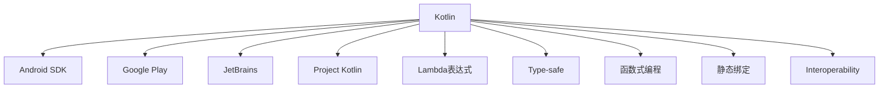

                 

# Kotlin 语言：现代 Android 开发语言

## 1. 背景介绍

### 1.1 问题由来
随着移动设备的普及和移动互联网的迅猛发展，Android操作系统成为全球最主流的智能手机操作系统之一。Android应用的开发也成为了开发者最重要的技能之一。然而，Android应用的开发环境存在着语言复杂度高、代码可读性差、跨语言通信困难等问题。这极大地增加了开发成本，降低了开发效率。

为了解决这些问题，谷歌推出了基于Java语言的Android SDK，并逐步推出了基于C++和Objective-C的开发框架。但这些技术在开发效率、代码维护性和跨语言通信等方面依然存在缺陷。

为了提升Android应用的开发体验，谷歌于2011年启动了Project Kotlin，旨在通过引入更为简单、高效的编程语言，使Android应用开发更为方便快捷。经过几年的研发和迭代，Kotlin已经成为Android应用开发的事实标准。

## 2. 核心概念与联系

### 2.1 核心概念概述

为了更好地理解Kotlin在Android开发中的应用，本节将介绍几个关键的概念：

- Kotlin：一种由JetBrains开发的高性能编程语言，基于JVM运行，语法简洁、类型安全、函数式编程友好，适合于Android等移动应用的开发。

- Android SDK：Android软件开发工具包，包含开发Android应用所需的所有组件和工具。

- Google Play：Android应用的全球分发平台，为Android应用提供高质量的全球曝光机会。

- JetBrains：Kotlin语言的发起者，同时也是Android Studio等开发工具的开发者，提供一站式的Android开发解决方案。

- Project Kotlin：谷歌发起的项目，旨在通过引入Kotlin语言，提升Android应用开发效率。

- Lambda表达式：Kotlin中的Lambda函数，是Java 8中的函数式编程特性，在Android开发中广泛应用。

- Type-safe：Kotlin中的类型安全性，可以在编译时发现代码中的类型错误，降低运行时异常的风险。

- 函数式编程：Kotlin中支持函数式编程的特性，包括Lambda表达式、高阶函数、柯里化等，使得开发更为简洁和高效。

- 静态绑定：Kotlin中的静态绑定特性，可以在编译时进行类型检查，提升代码的可读性和可维护性。

- Interoperability：Kotlin与Java的互操作性，通过JVM实现了Java和Kotlin的无缝集成，使开发者可以平滑过渡。

这些核心概念之间的逻辑关系可以通过以下Mermaid流程图来展示：



这个流程图展示了一些关键概念之间的关系：

1. Kotlin语言作为Android应用开发的主要工具。
2. Android SDK为Kotlin语言提供编程框架。
3. Google Play提供应用分发平台。
4. JetBrains提供Kotlin语言的开发工具。
5. Project Kotlin项目旨在推动Kotlin语言在Android中的应用。
6. Lambda表达式和函数式编程特性丰富了Kotlin的编程范式。
7. Type-safe和静态绑定特性提升了代码质量。
8. Interoperability特性使Kotlin与Java代码无缝集成。

## 3. 核心算法原理 & 具体操作步骤
### 3.1 算法原理概述

Kotlin在Android开发中的应用，主要通过将Kotlin编译成Java字节码来实现。Kotlin与Java代码之间的交互，通过JVM的虚拟机机制实现。这种编译方式既保证了Kotlin语言的简洁性和易用性，又保证了与Java代码的无缝集成，使得开发者可以平滑过渡，无须重新学习或修改现有的Java代码。

在Android开发中，Kotlin的原理如下：

- Kotlin代码在编译时通过Kotlin编译器编译成Java字节码。
- 编译后的Java字节码通过Java虚拟机运行。
- 在运行时，Kotlin代码与Java代码混合使用，互操作性强。

### 3.2 算法步骤详解

以下是Kotlin在Android开发中的核心步骤：

**Step 1: 安装Android Studio**

Android Studio是Android开发的官方工具，支持Kotlin语言。通过安装Android Studio，开发者可以方便地创建和管理Android项目，进行代码编写、调试、测试和部署。

**Step 2: 创建Android项目**

打开Android Studio，创建新的Android项目，选择Kotlin作为代码语言。在项目创建向导中，选择应用类型、名称和保存路径。

**Step 3: 编写Kotlin代码**

在项目中，编写Kotlin代码。Android Studio提供了代码高亮、自动补全、即时代码重构等功能，可以极大地提升开发效率。

**Step 4: 运行和调试**

运行项目，Android Studio会自动将Kotlin代码编译成Java字节码，通过JVM运行。开发者可以通过Android Studio的调试工具，对项目进行调试和测试。

**Step 5: 发布应用**

在项目构建完成后，开发者可以通过Android Studio将应用打包并发布到Google Play等平台上。

### 3.3 算法优缺点

Kotlin在Android开发中的应用具有以下优点：

1. 语法简洁：Kotlin语言的语法更为简洁，使得代码更加易读易懂，降低了开发成本。
2. 类型安全：Kotlin中的类型检查在编译时进行，可以极大地降低运行时异常的风险，提升代码质量。
3. 函数式编程：Kotlin支持函数式编程特性，如Lambda表达式、高阶函数、柯里化等，使得开发更为简洁和高效。
4. 与Java无缝集成：Kotlin与Java代码之间通过JVM无缝集成，开发者可以平滑过渡，无须重新学习或修改现有的Java代码。
5. 官方支持：谷歌作为Kotlin语言的主要推动者，提供了强大的开发工具和生态支持，推动了Kotlin在Android应用开发中的应用。

Kotlin在Android开发中也存在一些缺点：

1. 学习曲线：对于习惯了Java语言的开发者来说，Kotlin的学习曲线较陡，需要一段时间适应。
2. 生态系统：虽然Kotlin的生态系统已经较为成熟，但在一些第三方库和工具支持上，仍存在不足。
3. 工具链：虽然Android Studio支持Kotlin，但在一些特定的工具链上，如ProGuard优化等，仍需开发者进行额外的配置。

### 3.4 算法应用领域

Kotlin在Android开发中的应用，已经涵盖了Android应用开发的各个方面，具体应用领域如下：

- 界面开发：Kotlin可以用于Android应用的UI开发，通过XML布局文件和Kotlin代码，实现界面的布局和事件处理。
- 数据处理：Kotlin可以用于Android应用的数据处理，通过Lambda表达式和函数式编程特性，实现数据的过滤、排序、转换等操作。
- 网络请求：Kotlin可以用于Android应用的网络请求处理，通过Retrofit等网络库，实现数据的获取和处理。
- 数据库操作：Kotlin可以用于Android应用的数据库操作，通过Room等数据访问库，实现数据的存储和查询。
- 多线程编程：Kotlin可以用于Android应用的多线程编程，通过协程和异步编程特性，实现高效的数据处理和UI更新。
- 单元测试：Kotlin可以用于Android应用的单元测试，通过JUnit和Mockito等测试框架，实现单元测试和测试驱动开发。

除了上述这些核心应用领域外，Kotlin在Android应用开发中的应用还在不断拓展，为开发者提供了更为便捷和高效的开发工具。

## 4. 数学模型和公式 & 详细讲解  
### 4.1 数学模型构建

Kotlin在Android开发中的应用，主要涉及Android应用的开发模型和算法模型。以下我们将通过数学模型来对Kotlin在Android开发中的应用进行详细讲解。

假设Android应用的开发流程如下：

1. 用户通过Java代码编写Android应用。
2. Kotlin代码通过编译器编译成Java字节码。
3. 编译后的Java字节码通过JVM运行。
4. 在运行时，Kotlin代码与Java代码混合使用。

我们可以通过以下数学模型来描述Kotlin在Android开发中的应用：

$$
\text{应用开发流程} = \text{用户Java代码} \rightarrow \text{Kotlin编译器} \rightarrow \text{Java字节码} \rightarrow \text{JVM} \rightarrow \text{Java代码} \rightarrow \text{Kotlin代码} \rightarrow \text{应用运行}
$$

其中，$x$ 表示输入，$y$ 表示输出，$Kotlin编译器$ 和 $JVM$ 表示中间过程。

### 4.2 公式推导过程

在上述模型中，Kotlin编译器将Kotlin代码编译成Java字节码，而JVM则将Java字节码运行。我们可以通过以下公式来描述Kotlin编译器和JVM的功能：

$$
Kotlin编译器: Kotlin代码 \rightarrow Java字节码
$$

$$
JVM: Java字节码 \rightarrow 应用运行
$$

具体而言，Kotlin编译器将Kotlin代码编译成Java字节码的过程如下：

1. 首先，Kotlin编译器解析Kotlin代码，将其转化为Java中间代码。
2. 然后，Kotlin编译器对Java中间代码进行优化和生成，最终得到Java字节码。

JVM将Java字节码运行的过程如下：

1. 首先，JVM对Java字节码进行加载和解析。
2. 然后，JVM对Java字节码进行验证和优化。
3. 最后，JVM对Java字节码进行执行和运行。

### 4.3 案例分析与讲解

以下我们将以一个简单的Android应用为例，说明Kotlin在Android开发中的应用。

假设我们需要开发一个简单的Android应用，功能为显示一个按钮，点击后弹出一个对话框。以下是Java代码实现：

```java
Button button = findViewById(R.id.button);
button.setOnClickListener(new View.OnClickListener() {
    @Override
    public void onClick(View view) {
        new AlertDialog.Builder(this)
                .setTitle("Hello World!")
                .setMessage("You clicked the button!")
                .setPositiveButton("OK", new DialogInterface.OnClickListener() {
                    @Override
                    public void onClick(DialogInterface dialog, int which) {}
                })
                .show();
    }
});
```

以下是Kotlin代码实现：

```kotlin
button.setOnClickListener {
    AlertDialog.Builder(this)
        .setTitle("Hello World!")
        .setMessage("You clicked the button!")
        .setPositiveButton("OK") {
            when (which) {
                0 -> {}
            }
        }
        .show()
}
```

可以看到，Kotlin代码的实现更为简洁和易读。使用Lambda表达式，可以将传统的匿名内部类替换为简洁的Lambda函数。同时，Kotlin中的when语句可以用于多分支条件判断，更为直观和易读。

## 5. 项目实践：代码实例和详细解释说明
### 5.1 开发环境搭建

在进行Kotlin项目实践前，我们需要准备好开发环境。以下是使用Android Studio进行Android应用开发的开发环境配置流程：

1. 下载并安装Android Studio：从官网下载并安装Android Studio。

2. 创建新项目：打开Android Studio，选择File > New > New Project。

3. 配置项目：在项目创建向导中，选择应用类型、名称和保存路径。

4. 编写代码：在项目中编写Kotlin代码，使用Android Studio提供的代码高亮、自动补全、即时代码重构等功能，可以极大地提升开发效率。

5. 运行和调试：运行项目，Android Studio会自动将Kotlin代码编译成Java字节码，通过JVM运行。开发者可以通过Android Studio的调试工具，对项目进行调试和测试。

### 5.2 源代码详细实现

以下是使用Kotlin编写的Android应用示例代码：

```kotlin
package com.example.myapplication

import android.os.Bundle
import android.widget.Button
import android.widget.AlertDialog
import androidx.appcompat.app.AppCompatActivity

class MainActivity : AppCompatActivity() {

    override fun onCreate(savedInstanceState: Bundle?) {
        super.onCreate(savedInstanceState)
        setContentView(R.layout.activity_main)

        val button = findViewById<Button>(R.id.button)
        button.setOnClickListener {
            AlertDialog.Builder(this)
                .setTitle("Hello World!")
                .setMessage("You clicked the button!")
                .setPositiveButton("OK") {
                    when (which) {
                        0 -> {}
                    }
                }
                .show()
        }
    }
}
```

### 5.3 代码解读与分析

让我们再详细解读一下关键代码的实现细节：

**Button的定义**：

```kotlin
val button = findViewById<Button>(R.id.button)
```

- `findViewById`：根据ID获取控件，并转化为指定类型。

**Lambda表达式的应用**：

```kotlin
button.setOnClickListener {
    AlertDialog.Builder(this)
        .setTitle("Hello World!")
        .setMessage("You clicked the button!")
        .setPositiveButton("OK") {
            when (which) {
                0 -> {}
            }
        }
        .show()
}
```

- `setOnClickListener`：设置点击事件处理函数。
- `AlertDialog.Builder`：创建对话框，并设置标题、消息、按钮等属性。
- `when`语句：多分支条件判断，简化代码实现。

可以看到，Kotlin中的Lambda表达式和when语句，可以极大地提升代码的简洁性和可读性。

### 5.4 运行结果展示

运行上述Kotlin代码，可以展示一个简单的Android应用，点击按钮后弹出一个对话框，显示“Hello World!”消息。

## 6. 实际应用场景
### 6.1 智能移动应用

Kotlin在智能移动应用中的应用非常广泛，包括游戏、社交、娱乐、教育等多个领域。智能移动应用需要高效、灵活、易维护的开发工具，而Kotlin正是这一领域的不二选择。

在智能移动应用开发中，Kotlin可以用于UI界面开发、数据处理、网络请求、数据库操作、多线程编程、单元测试等多个方面。使用Kotlin开发智能移动应用，可以提高开发效率，降低开发成本，提升应用性能和用户体验。

### 6.2 金融移动应用

Kotlin在金融移动应用中的应用也非常广泛，包括银行、证券、保险等多个领域。金融移动应用需要高度安全、稳定、可靠的开发工具，而Kotlin正是这一领域的不二选择。

在金融移动应用开发中，Kotlin可以用于数据处理、网络请求、数据库操作、多线程编程、单元测试等多个方面。使用Kotlin开发金融移动应用，可以提高开发效率，降低开发成本，提升应用性能和安全性。

### 6.3 医疗移动应用

Kotlin在医疗移动应用中的应用也非常广泛，包括医疗、健康、保健等多个领域。医疗移动应用需要高效、灵活、易维护的开发工具，而Kotlin正是这一领域的不二选择。

在医疗移动应用开发中，Kotlin可以用于UI界面开发、数据处理、网络请求、数据库操作、多线程编程、单元测试等多个方面。使用Kotlin开发医疗移动应用，可以提高开发效率，降低开发成本，提升应用性能和用户体验。

## 7. 工具和资源推荐
### 7.1 学习资源推荐

为了帮助开发者系统掌握Kotlin在Android开发中的应用，这里推荐一些优质的学习资源：

1. Kotlin官方文档：Kotlin语言的官方文档，详细介绍了Kotlin语言的语法、特性和API。

2. Android开发文档：Android官方开发文档，包含Android开发所需的各类组件和工具的详细说明。

3. Android Architecture Components：谷歌推出的Android应用架构组件，提供组件化、模块化的开发框架。

4. Android Jetpack：谷歌推出的Android开发工具包，包含多个开发组件，简化开发流程。

5. JetBrains Academy：JetBrains推出的免费编程课程，包含Kotlin、Java、Android等多个方向的内容。

通过对这些资源的学习实践，相信你一定能够快速掌握Kotlin在Android开发中的应用，并用于解决实际的开发问题。

### 7.2 开发工具推荐

高效的开发离不开优秀的工具支持。以下是几款用于Kotlin开发常用的工具：

1. Android Studio：谷歌推出的Android开发工具，支持Kotlin语言，提供了强大的开发工具和生态支持。

2. IntelliJ IDEA：JetBrains推出的集成开发环境，支持Kotlin语言，提供了丰富的开发工具和插件支持。

3. Kotlin Compiler：Kotlin语言的编译器，将Kotlin代码编译成Java字节码，并运行。

4. Gradle：Android开发中常用的构建工具，支持Kotlin语言。

5. ProGuard：Android开发中常用的优化工具，用于代码压缩、混淆等。

6. JUnit：Android开发中常用的测试框架，支持Kotlin语言。

合理利用这些工具，可以显著提升Kotlin项目的开发效率，加快创新迭代的步伐。

### 7.3 相关论文推荐

Kotlin在Android开发中的应用，涉及语言设计、编译器实现、应用架构等多个领域。以下是几篇奠基性的相关论文，推荐阅读：

1. Kotlin in Action：Kotlin语言的权威指南，详细介绍了Kotlin语言的设计思想和特性。

2. Kotlin for Android Developers：Kotlin语言在Android应用开发中的应用指南，提供了详细的开发实践和案例分析。

3. Android Architecture Components Design: Building Blocks for Scalable, Modular Android Apps：介绍了Android架构组件的设计思想和实现方法，提供了组件化、模块化的开发框架。

4. JetBrains Android Studio Architecture Compatibility Guide：介绍了Android Studio中架构组件的兼容性和使用方式，提供了详细的开发实践和案例分析。

这些论文代表了大语言模型微调技术的发展脉络。通过学习这些前沿成果，可以帮助研究者把握学科前进方向，激发更多的创新灵感。

## 8. 总结：未来发展趋势与挑战
### 8.1 总结

本文对Kotlin在Android开发中的应用进行了全面系统的介绍。首先阐述了Kotlin语言的背景和意义，明确了Kotlin在Android开发中的应用场景和价值。其次，从原理到实践，详细讲解了Kotlin在Android开发中的应用流程和核心技术。最后，本文还探讨了Kotlin在实际应用中的表现和未来发展趋势。

通过本文的系统梳理，可以看到，Kotlin语言在Android开发中的应用已经非常广泛，极大地提升了Android应用的开发效率和开发质量。未来，伴随Kotlin语言和Android开发环境的不断进步，相信Kotlin将在Android应用开发中发挥更大的作用。

### 8.2 未来发展趋势

展望未来，Kotlin在Android开发中的应用将呈现以下几个发展趋势：

1. 语法和特性：Kotlin语言的语法和特性将不断完善，提高开发效率和代码质量。

2. 生态和工具：Kotlin的生态和工具将持续丰富，提供更多的开发组件和插件支持。

3. 编译器和JVM：Kotlin编译器和JVM将不断优化，提高编译效率和运行性能。

4. 教育和培训：Kotlin教育的普及和培训的推广，将培养更多的Kotlin开发者，提升Android应用的开发质量。

5. 跨平台开发：Kotlin将进一步支持跨平台开发，提升开发效率和应用性能。

6. 微服务架构：Kotlin将支持微服务架构，提升应用的可维护性和可扩展性。

以上趋势凸显了Kotlin在Android开发中的广阔前景。这些方向的探索发展，必将进一步提升Kotlin在Android应用开发中的应用，为开发者提供更为便捷和高效的开发工具。

### 8.3 面临的挑战

尽管Kotlin在Android开发中的应用已经取得了显著成就，但在迈向更加智能化、普适化应用的过程中，仍面临诸多挑战：

1. 学习曲线：Kotlin语言相对于Java语言有一定的学习曲线，部分开发者可能需要适应一段时间。

2. 生态系统：Kotlin的生态系统虽然已经较为成熟，但在一些第三方库和工具支持上，仍存在不足。

3. 工具链：虽然Android Studio支持Kotlin，但在一些特定的工具链上，如ProGuard优化等，仍需开发者进行额外的配置。

4. 性能优化：Kotlin编译器在编译和优化过程中，可能需要消耗更多的计算资源。

5. 兼容性问题：Kotlin与Java代码的混合使用，可能导致一些兼容性问题，需要进行额外的测试和调试。

6. 生态扩展：Kotlin生态的进一步扩展和优化，需要社区和开发者共同努力。

以上挑战需要开发者在实际应用中，不断探索和优化，才能进一步提升Kotlin在Android应用开发中的应用效果。

### 8.4 研究展望

面对Kotlin在Android开发中面临的挑战，未来的研究需要在以下几个方面寻求新的突破：

1. 语法和特性：优化Kotlin语言的语法和特性，提升开发效率和代码质量。

2. 生态和工具：丰富Kotlin的生态和工具，提供更多的开发组件和插件支持。

3. 编译器和JVM：优化Kotlin编译器和JVM，提高编译效率和运行性能。

4. 教育和培训：普及Kotlin教育的推广和培训，培养更多的Kotlin开发者。

5. 跨平台开发：支持跨平台开发，提升开发效率和应用性能。

6. 微服务架构：支持微服务架构，提升应用的可维护性和可扩展性。

这些研究方向的探索，必将引领Kotlin语言在Android应用开发中的应用走向更高的台阶，为开发者提供更为便捷和高效的开发工具。面向未来，Kotlin语言将在Android应用开发中发挥更大的作用，带来更为广阔的发展前景。

## 9. 附录：常见问题与解答

**Q1：Kotlin与Java的区别是什么？**

A: Kotlin与Java的区别主要在于语法、特性和性能等方面：

1. 语法：Kotlin的语法更为简洁，支持Lambda表达式、高阶函数、类型推断等特性。
2. 特性：Kotlin支持函数式编程、协程、对象表达式、空安全等特性。
3. 性能：Kotlin在性能上与Java基本相同，但Kotlin编译器在编译过程中进行了一些优化，使得Kotlin代码更为高效。

**Q2：Kotlin代码如何与Java代码混合使用？**

A: Kotlin代码与Java代码可以通过JVM进行混合使用，实现无缝集成。具体而言，Java代码可以通过Kotlin扩展函数和内联注解，与Kotlin代码进行交互，使用Kotlin的函数式编程特性和类型推断，提升开发效率和代码质量。

**Q3：Kotlin在Android开发中如何进行单元测试？**

A: Kotlin可以使用JUnit和Mockito等测试框架进行单元测试，支持函数式编程和协程等特性，使得测试更为便捷和高效。

**Q4：Kotlin在Android开发中如何进行多线程编程？**

A: Kotlin可以使用协程和异步编程特性进行多线程编程，支持异步任务、线程池、取消等特性，提升应用性能和用户体验。

**Q5：Kotlin在Android开发中如何进行数据处理？**

A: Kotlin可以使用Lambda表达式和函数式编程特性进行数据处理，支持高阶函数、柯里化、map、filter等操作，提升数据处理的效率和可读性。

---

作者：禅与计算机程序设计艺术 / Zen and the Art of Computer Programming

