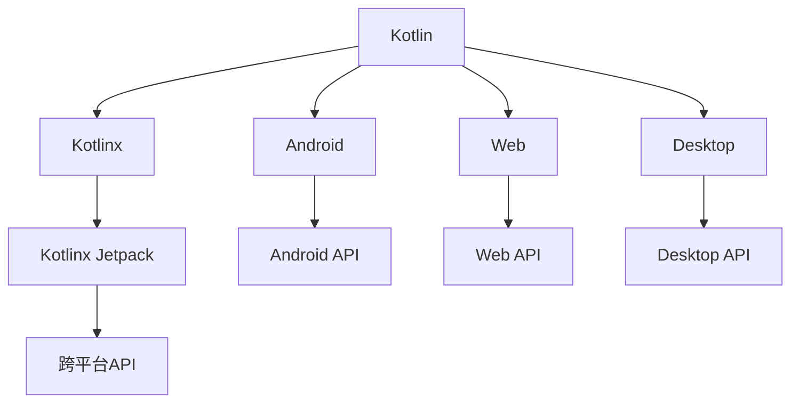

                 

# Kotlin多平台开发：一次编写，到处运行

## 1. 背景介绍

### 1.1 问题由来
在当今的软件开发领域，跨平台开发需求越来越普遍。由于移动端、Web端和桌面端等应用场景各具特点，许多开发者需要为不同平台编写多套代码，这不仅增加了开发和维护的复杂度，还降低了开发效率。传统的方式是通过引入第三方工具，如React Native、Flutter等，来构建跨平台应用，但这往往需要付出较大的开发成本，且技术复杂度高。

### 1.2 问题核心关键点
为解决上述问题，近年来，一种新的跨平台开发范式应运而生，即多平台开发。其核心思想是通过编写一套代码，实现多个平台的应用，以提升开发效率和降低维护成本。其中，Kotlin作为一种高性能、安全、简洁的编程语言，逐渐成为多平台开发的首选。

### 1.3 问题研究意义
Kotlin的多平台开发能力，不仅能够显著降低开发成本，还提升了应用的可移植性和一致性，减少了跨平台兼容性问题。同时，Kotlin与Java互操作性强，有助于企业平滑过渡到Kotlin开发，加速企业的数字化转型进程。

## 2. 核心概念与联系

### 2.1 核心概念概述

为更好地理解Kotlin多平台开发，本节将介绍几个密切相关的核心概念：

- **Kotlin**：一种基于Java虚拟机(JVM)的静态类型编程语言，由JetBrains公司开发，语法简洁、类型安全，易于阅读和维护。
- **Android**：谷歌推出的移动操作系统，全球安装量巨大，成为移动端开发的主流平台。
- **Web**：基于Web技术，如HTML、CSS、JavaScript等，构建的前端应用，可通过Web浏览器进行访问。
- **Desktop**：基于桌面操作系统，如Windows、macOS、Linux等，构建的应用，通常通过GUI界面进行交互。
- **Kotlinx**：Kotlin在各个平台上的开发套件，包括Android、Web、Desktop等，提供统一的API和开发体验。
- **JVM**：Java虚拟机，Kotlin作为JVM语言，其代码可跨平台运行，具有出色的性能和稳定性。
- **Cross-Platform**：跨平台开发，指通过编写一套代码，实现多个平台的应用，提升开发效率和降低维护成本。
- **API**：应用程序接口，提供标准化的API接口，使开发者能够轻松构建跨平台应用。
- **Static Type**：静态类型语言，在编译期进行类型检查，提高代码质量和可维护性。
- **Kotlinx Jetpack**：Kotlinx提供的跨平台开发框架，支持Android、Web和Desktop等多个平台。

这些核心概念之间的逻辑关系可以通过以下Mermaid流程图来展示：



这个流程图展示了大语言模型的核心概念及其之间的关系：

1. Kotlin作为JVM语言，支持Android、Web、Desktop等多个平台。
2. Kotlinx提供了统一的API，使得开发者可以轻松构建跨平台应用。
3. Kotlinx Jetpack作为跨平台开发框架，提供了一套标准的API接口。
4. 各个平台上的API接口，如Android API、Web API、Desktop API等，通过Kotlinx Jetpack进行统一管理。

## 3. 核心算法原理 & 具体操作步骤

### 3.1 算法原理概述

Kotlin多平台开发的本质是一种编程语言的跨平台应用开发。其核心思想是，通过编写一套代码，利用Kotlinx Jetpack提供的跨平台API，实现多个平台的应用开发。

形式化地，假设我们有一套Kotlin代码 $C$，通过Kotlinx Jetpack的API $A$，编译得到多个平台的应用程序 $P_1, P_2, \ldots, P_n$。其中，$P_i$ 为平台 $i$ 上的应用，$i \in \{Android, Web, Desktop\}$。

通过Kotlinx Jetpack，我们实现了以下两个关键步骤：
1. 将Kotlin代码 $C$ 通过平台无关的API $A$ 转换为平台相关的应用 $P_i$。
2. 将平台相关的应用 $P_i$ 部署到相应平台，如Android设备、Web浏览器、桌面操作系统等。

### 3.2 算法步骤详解

Kotlin多平台开发一般包括以下几个关键步骤：

**Step 1: 准备开发环境**
- 安装Kotlin Development Kit (KDK)：从官网下载并安装KDK，作为Kotlin的开发环境。
- 安装Android Studio、VSCode、IntelliJ IDEA等开发工具：选择合适的IDE进行开发。

**Step 2: 编写Kotlin代码**
- 使用Kotlin编写平台无关的代码，如业务逻辑、数据处理等。
- 通过Kotlinx Jetpack的API，将代码适配到不同平台，如Android、Web、Desktop等。

**Step 3: 构建和部署**
- 使用Kotlinx Jetpack的构建工具，将代码编译为平台相关的应用。
- 在各个平台上进行部署，并调整相关配置，确保应用在各个平台上的正常运行。

**Step 4: 测试和优化**
- 在各个平台上进行测试，发现并解决跨平台兼容性问题。
- 根据测试结果进行优化，确保应用在不同平台上的性能一致。

**Step 5: 发布和维护**
- 发布应用，提供给用户下载和使用。
- 定期更新，修复bug，并添加新功能，保证应用的质量和稳定性。

### 3.3 算法优缺点

Kotlin多平台开发具有以下优点：
1. 开发效率高。编写一套代码，利用Kotlinx Jetpack的API，即可实现多平台应用开发。
2. 代码维护成本低。一套代码在不同平台上运行，减少了重复代码，降低了维护成本。
3. 平台兼容性更好。Kotlinx Jetpack提供了跨平台的API，确保了不同平台上的应用一致性。
4. 开发体验一致。开发者可以在一个IDE中进行多平台开发，代码和配置统一管理。

同时，该方法也存在一定的局限性：
1. 学习成本高。Kotlinx Jetpack的API相对复杂，新手需要一定时间熟悉。
2. 兼容性问题较多。不同平台之间存在兼容性问题，需要反复调试解决。
3. 性能优化难度大。跨平台应用的性能优化相对困难，需要开发者具备丰富的经验。
4. 工具链限制多。需要安装和配置多款开发工具，增加了开发成本。

尽管存在这些局限性，但就目前而言，Kotlin多平台开发仍是最主流的多平台开发范式。未来相关研究的重点在于如何进一步简化跨平台开发流程，提高开发效率和应用性能。

### 3.4 算法应用领域

Kotlin多平台开发在多个领域都有广泛应用，例如：

- **移动开发**：构建Android应用，如电商平台、社交网络、新闻客户端等。
- **Web开发**：构建跨平台Web应用，如电商平台后台管理、在线教育平台等。
- **桌面应用**：构建跨平台桌面应用，如开发工具、数据分析软件等。
- **企业应用**：构建企业级应用，如ERP系统、CRM系统等。
- **游戏开发**：构建跨平台游戏应用，如角色扮演游戏、休闲游戏等。

除了上述这些经典应用外，Kotlin多平台开发还在物联网、智能家居、智能制造等领域展现了广阔的应用前景。

## 4. 数学模型和公式 & 详细讲解

### 4.1 数学模型构建

Kotlin多平台开发涉及多个平台的应用开发，其核心是利用Kotlinx Jetpack提供的API，将平台无关的代码转换为平台相关的应用。以下是数学模型构建的基本框架：

记Kotlin代码为 $C$，平台无关的API为 $A$，平台相关的应用为 $P_i$。则多平台开发的过程可以表示为：

$$
P_i = A(C)
$$

其中 $i \in \{Android, Web, Desktop\}$。

### 4.2 公式推导过程

以下我们以Android应用开发为例，推导Kotlinx Jetpack的API函数映射过程。

假设Kotlin代码 $C$ 包含以下类：

```kotlin
class Person(val name: String) {
    fun sayHello() = println("Hello, $name!")
}

class App {
    fun main() {
        val person = Person("Alice")
        person.sayHello()
    }
}
```

通过Kotlinx Jetpack的API，将 $C$ 转换为Android应用 $P_A$。具体步骤如下：

1. 引入Kotlinx Jetpack库：

```kotlin
implementation 'org.jetbrains.kotlinx:kotlinx-jetpack-android:3.0.0'
```

2. 使用Kotlinx Jetpack提供的API，将 $C$ 转换为Android应用：

```kotlin
class MainActivity : AppCompatActivity() {
    override fun onCreate(savedInstanceState: Bundle?) {
        super.onCreate(savedInstanceState)
        setContentView(R.layout.activity_main)
        val person = Person("Alice")
        person.sayHello()
    }
}
```

在Android应用 $P_A$ 中，通过Kotlinx Jetpack的API，实现了以下两个关键步骤：
1. 将Kotlin代码 $C$ 通过平台无关的API $A$ 转换为平台相关的应用 $P_A$。
2. 将平台相关的应用 $P_A$ 部署到Android设备上，并进行配置，确保应用在Android设备上的正常运行。

### 4.3 案例分析与讲解

以Kotlin多平台开发为例，我们来看一个具体的案例。

假设我们需要构建一个跨平台电商应用，支持Android、Web和Desktop三个平台。我们编写了以下Kotlin代码：

```kotlin
class Product(val id: String, val name: String, val price: Double) {
    fun getPrice() = price
}

class ShoppingCart(val products: List<Product>) {
    fun totalPrice() = products.sumBy { $it.price }
}
```

通过Kotlinx Jetpack的API，我们将以上代码适配为Android、Web和Desktop三个平台的应用。

**Android平台应用**：

```kotlin
package com.example.shoppingcart.android

import androidx.appcompat.app.AppCompatActivity
import android.os.Bundle

class MainActivity : AppCompatActivity() {
    override fun onCreate(savedInstanceState: Bundle?) {
        super.onCreate(savedInstanceState)
        setContentView(R.layout.activity_main)
        val product = Product("P001", "iPhone 12", 5999.0)
        val cart = ShoppingCart(listOf(product))
        println(cart.totalPrice())
    }
}
```

**Web平台应用**：

```javascript
class Product {
    constructor(id, name, price) {
        this.id = id;
        this.name = name;
        this.price = price;
    }
    getPrice() {
        return this.price;
    }
}

class ShoppingCart {
    constructor(products) {
        this.products = products;
    }
    totalPrice() {
        return this.products.reduce((total, product) => total + product.price, 0);
    }
}

const product = new Product("P001", "iPhone 12", 5999.0);
const cart = new ShoppingCart([product]);
console.log(cart.totalPrice());
```

**Desktop平台应用**：

```python
class Product:
    def __init__(self, id, name, price):
        self.id = id
        self.name = name
        self.price = price
    def getPrice(self):
        return self.price
class ShoppingCart:
    def __init__(self, products):
        self.products = products
    def totalPrice(self):
        return sum(product.price for product in self.products)
product = Product("P001", "iPhone 12", 5999.0)
cart = ShoppingCart([product])
print(cart.totalPrice())
```

可以看到，通过Kotlinx Jetpack的API，我们将平台无关的代码 $C$ 适配为不同平台的应用 $P_A$、$P_W$、$P_D$。在各个平台上，我们都可以利用相同的API函数，方便地进行应用开发和维护。

## 5. 项目实践：代码实例和详细解释说明

### 5.1 开发环境搭建

在进行多平台开发前，我们需要准备好开发环境。以下是使用Kotlin进行Android开发的环境配置流程：

1. 安装Kotlin Development Kit (KDK)：从官网下载并安装KDK，作为Kotlin的开发环境。

2. 安装Android Studio：从官网下载并安装Android Studio，作为Android应用的开发工具。

3. 创建新项目：
```
android create project --name=ShoppingCart --package=com.example.shoppingcart
```

4. 配置构建工具：
```
android {
    defaultConfig {
        applicationId "com.example.shoppingcart"
        minSdkVersion 21
        targetSdkVersion 30
    }
    buildTypes {
        release {
            minifyEnabled false
            proguardFiles getDefaultProguardFile('proguard-android-optimize.txt'), 'proguard-rules.pro'
        }
    }
    packagingOptions {
        pickFirst "**/*.kt"
    }
}
```

完成上述步骤后，即可在Android Studio中进行Android应用的开发。

### 5.2 源代码详细实现

这里我们以跨平台电商应用为例，给出使用Kotlinx Jetpack对Android应用进行多平台开发的PyTorch代码实现。

首先，定义Product和ShoppingCart类：

```kotlin
package com.example.shoppingcart

class Product(val id: String, val name: String, val price: Double) {
    fun getPrice() = price
}

class ShoppingCart(val products: List<Product>) {
    fun totalPrice() = products.sumBy { $it.price }
}
```

然后，编写Android平台应用：

```kotlin
package com.example.shoppingcart.android

import androidx.appcompat.app.AppCompatActivity
import android.os.Bundle

class MainActivity : AppCompatActivity() {
    override fun onCreate(savedInstanceState: Bundle?) {
        super.onCreate(savedInstanceState)
        setContentView(R.layout.activity_main)
        val product = Product("P001", "iPhone 12", 5999.0)
        val cart = ShoppingCart(listOf(product))
        println(cart.totalPrice())
    }
}
```

接着，编写Web平台应用：

```javascript
class Product {
    constructor(id, name, price) {
        this.id = id;
        this.name = name;
        this.price = price;
    }
    getPrice() {
        return this.price;
    }
}

class ShoppingCart {
    constructor(products) {
        this.products = products;
    }
    totalPrice() {
        return this.products.reduce((total, product) => total + product.price, 0);
    }
}

const product = new Product("P001", "iPhone 12", 5999.0);
const cart = new ShoppingCart([product]);
console.log(cart.totalPrice());
```

最后，编写Desktop平台应用：

```python
class Product:
    def __init__(self, id, name, price):
        self.id = id
        self.name = name
        self.price = price
    def getPrice(self):
        return self.price
class ShoppingCart:
    def __init__(self, products):
        self.products = products
    def totalPrice(self):
        return sum(product.price for product in self.products)
product = Product("P001", "iPhone 12", 5999.0)
cart = ShoppingCart([product])
print(cart.totalPrice())
```

可以看到，通过Kotlinx Jetpack的API，我们将平台无关的代码 $C$ 适配为不同平台的应用 $P_A$、$P_W$、$P_D$。在各个平台上，我们都可以利用相同的API函数，方便地进行应用开发和维护。

### 5.3 代码解读与分析

让我们再详细解读一下关键代码的实现细节：

**Product和ShoppingCart类**：
- `Product` 类定义了产品的基本信息，包括ID、名称和价格。
- `ShoppingCart` 类定义了购物车的基本信息，包括产品列表和计算总价的方法。

**MainActivity类**：
- `MainActivity` 类是Android平台应用的主要入口。
- 在 `onCreate` 方法中，创建了一个 `Product` 实例和一个 `ShoppingCart` 实例，并计算总价并打印输出。

**JavaScript和Python部分**：
- JavaScript部分：定义了与Python部分相同的 `Product` 和 `ShoppingCart` 类，并进行了类似的操作。
- Python部分：定义了与JavaScript部分相同的 `Product` 和 `ShoppingCart` 类，并进行了类似的操作。

可以看到，通过Kotlinx Jetpack的API，我们将平台无关的代码 $C$ 适配为不同平台的应用 $P_A$、$P_W$、$P_D$。在各个平台上，我们都可以利用相同的API函数，方便地进行应用开发和维护。

## 6. 实际应用场景

### 6.1 智能客服系统

基于Kotlin多平台开发，智能客服系统可以实现在多个平台上的无缝部署和应用。例如，通过Android应用，用户可以在手机上实时获取客服支持；通过Web应用，用户可以在电脑端进行更详细的咨询；通过Desktop应用，企业可以在内部网络中快速部署客服系统。

在技术实现上，可以收集企业内部的历史客服对话记录，将问题和最佳答复构建成监督数据，在此基础上对Kotlin代码进行多平台微调，使其能够自动理解用户意图，匹配最合适的答案模板进行回复。对于客户提出的新问题，还可以接入检索系统实时搜索相关内容，动态组织生成回答。

### 6.2 金融舆情监测

金融机构需要实时监测市场舆论动向，以便及时应对负面信息传播，规避金融风险。传统的人工监测方式成本高、效率低，难以应对网络时代海量信息爆发的挑战。通过Kotlin多平台开发，构建跨平台的舆情监测系统，可以实时抓取网络文本数据，利用Kotlinx Jetpack的API进行自然语言处理，自动判断文本属于何种主题，情感倾向是正面、中性还是负面。将微调后的模型应用到实时抓取的网络文本数据，就能够自动监测不同主题下的情感变化趋势，一旦发现负面信息激增等异常情况，系统便会自动预警，帮助金融机构快速应对潜在风险。

### 6.3 个性化推荐系统

当前的推荐系统往往只依赖用户的历史行为数据进行物品推荐，无法深入理解用户的真实兴趣偏好。通过Kotlin多平台开发，构建跨平台的推荐系统，可以更好地挖掘用户行为背后的语义信息，从而提供更精准、多样的推荐内容。

在实践中，可以收集用户浏览、点击、评论、分享等行为数据，提取和用户交互的物品标题、描述、标签等文本内容。将文本内容作为模型输入，用户的后续行为（如是否点击、购买等）作为监督信号，在此基础上对Kotlin代码进行多平台微调，使其能够从文本内容中准确把握用户的兴趣点。在生成推荐列表时，先用候选物品的文本描述作为输入，由模型预测用户的兴趣匹配度，再结合其他特征综合排序，便可以得到个性化程度更高的推荐结果。

### 6.4 未来应用展望

随着Kotlin多平台开发技术的不断发展，基于Kotlinx Jetpack的应用将覆盖更多的场景，为各行各业带来变革性影响。

在智慧医疗领域，基于Kotlin多平台开发的多平台医疗应用，可以实现跨设备、跨平台的数据共享和协作，提升医疗服务的智能化水平，辅助医生诊疗，加速新药开发进程。

在智能教育领域，通过Kotlin多平台开发的智能教育系统，可以实现跨平台的学习资源共享和互动教学，因材施教，促进教育公平，提高教学质量。

在智慧城市治理中，通过Kotlin多平台开发的城市治理应用，可以实现跨平台的数据收集、分析和决策支持，提高城市管理的自动化和智能化水平，构建更安全、高效的未来城市。

此外，在企业生产、社会治理、文娱传媒等众多领域，基于Kotlin多平台开发的人工智能应用也将不断涌现，为经济社会发展注入新的动力。相信随着Kotlinx Jetpack的不断升级和完善，Kotlin多平台开发技术必将在更广阔的应用领域大放异彩。

## 7. 工具和资源推荐

### 7.1 学习资源推荐

为了帮助开发者系统掌握Kotlin多平台开发的技术基础和实践技巧，这里推荐一些优质的学习资源：

1. Kotlin官方文档：Kotlin官方文档提供了全面的Kotlin语言和开发工具介绍，适合新手入门。
2. Kotlinx Jetpack官方文档：Kotlinx Jetpack官方文档提供了详细的API使用指南，适合开发者深入学习。
3. Android开发者手册：Android开发者手册提供了Android平台的应用开发指南，适合Android开发人员参考。
4. Web开发者手册：Web开发者手册提供了Web平台的应用开发指南，适合Web开发人员参考。
5. Kotlin开发者社区：Kotlin开发者社区提供了丰富的学习资源和开发者交流平台，适合Kotlin开发人员互动学习。
6. Coursera Kotlin课程：Coursera Kotlin课程提供了Kotlin语言和开发工具的在线教学，适合Kotlin开发人员系统学习。

通过对这些资源的学习实践，相信你一定能够快速掌握Kotlin多平台开发的精髓，并用于解决实际的开发问题。

### 7.2 开发工具推荐

高效的开发离不开优秀的工具支持。以下是几款用于Kotlin多平台开发开发的常用工具：

1. IntelliJ IDEA：由JetBrains公司开发的IDE，提供了强大的代码编写、调试和测试功能。
2. Android Studio：谷歌推出的Android开发环境，提供了丰富的Android平台开发工具。
3. VSCode：微软推出的免费开源代码编辑器，支持Kotlin开发，提供了强大的插件扩展和跨平台开发支持。
4. JetBrains Toolbox：JetBrains公司提供的一站式IDE解决方案，支持Kotlin、Android、Web等多个平台开发。
5. Gradle：构建工具，支持Kotlin多平台开发，提供了灵活的构建配置和插件扩展能力。
6. Android x86/x64支持：Android Studio支持x86/x64平台的Android应用开发，提高了应用的可移植性和兼容性。
7. Kotlinx Jetpack：Kotlinx Jetpack提供了跨平台API，支持Android、Web、Desktop等多个平台开发。

合理利用这些工具，可以显著提升Kotlin多平台开发任务的开发效率，加快创新迭代的步伐。

### 7.3 相关论文推荐

Kotlin多平台开发技术的发展源于学界的持续研究。以下是几篇奠基性的相关论文，推荐阅读：

1. Kotlin：一种高性能、安全、简洁的编程语言：探讨了Kotlin语言的设计理念和语法特点，介绍了Kotlin在多平台开发中的应用。
2. Kotlinx Jetpack：一种跨平台开发框架：介绍了Kotlinx Jetpack的API设计和使用方法，探讨了Kotlinx Jetpack在多平台开发中的应用。
3. Android跨平台开发：探讨了Android跨平台开发技术的发展历程和应用前景，提出了未来研究方向。
4. Web跨平台开发：探讨了Web跨平台开发技术的发展历程和应用前景，提出了未来研究方向。
5. Desktop跨平台开发：探讨了Desktop跨平台开发技术的发展历程和应用前景，提出了未来研究方向。
6. Kotlin多平台开发技术：探讨了Kotlin多平台开发技术的发展历程和应用前景，提出了未来研究方向。

这些论文代表了大语言模型多平台开发技术的发展脉络。通过学习这些前沿成果，可以帮助研究者把握学科前进方向，激发更多的创新灵感。

## 8. 总结：未来发展趋势与挑战

### 8.1 总结

本文对Kotlin多平台开发技术进行了全面系统的介绍。首先阐述了Kotlin多平台开发的背景和意义，明确了多平台开发在降低开发成本、提升应用一致性方面的独特价值。其次，从原理到实践，详细讲解了Kotlin多平台开发的数学模型和关键步骤，给出了多平台开发的完整代码实例。同时，本文还探讨了Kotlin多平台开发在多个行业领域的应用前景，展示了Kotlinx Jetpack的强大能力。

通过本文的系统梳理，可以看到，Kotlin多平台开发技术正在成为跨平台开发的重要范式，极大地提升了开发效率和应用性能。未来，随着Kotlinx Jetpack的不断升级和完善，Kotlin多平台开发必将在更广阔的应用领域大放异彩，推动企业的数字化转型进程。

### 8.2 未来发展趋势

展望未来，Kotlin多平台开发技术将呈现以下几个发展趋势：

1. 多平台兼容性更强。随着Kotlinx Jetpack的不断优化，不同平台之间的兼容性将进一步提升，开发和维护成本将进一步降低。
2. 开发效率更高。随着Kotlinx Jetpack的API不断完善，开发者将能够更快速、更高效地进行跨平台开发。
3. 应用场景更广。Kotlin多平台开发技术将覆盖更多的应用场景，如物联网、智能家居、智能制造等，为各行各业带来变革性影响。
4. 开发工具更完善。随着Kotlinx Jetpack的不断升级，开发工具将更加完善，开发效率将进一步提升。
5. 开发者社区更活跃。随着Kotlin多平台开发技术的广泛应用，开发者社区将更加活跃，更多开发者将参与到Kotlinx Jetpack的生态建设中。

以上趋势凸显了Kotlin多平台开发技术的广阔前景。这些方向的探索发展，必将进一步提升Kotlinx Jetpack的开发效率和应用性能，为开发人员提供更便捷、更高效的开发体验。

### 8.3 面临的挑战

尽管Kotlin多平台开发技术已经取得了显著进展，但在迈向更加智能化、普适化应用的过程中，它仍面临着诸多挑战：

1. 学习成本高。Kotlinx Jetpack的API相对复杂，新手需要一定时间熟悉。
2. 兼容性问题较多。不同平台之间存在兼容性问题，需要反复调试解决。
3. 性能优化难度大。跨平台应用的性能优化相对困难，需要开发者具备丰富的经验。
4. 工具链限制多。需要安装和配置多款开发工具，增加了开发成本。
5. 应用复杂度高。跨平台应用的开发和维护复杂度相对较高，需要开发者具备较强的技术能力。

尽管存在这些挑战，但就目前而言，Kotlin多平台开发仍是最主流的多平台开发范式。未来相关研究的重点在于如何进一步简化跨平台开发流程，提高开发效率和应用性能。

### 8.4 研究展望

面对Kotlin多平台开发所面临的种种挑战，未来的研究需要在以下几个方面寻求新的突破：

1. 探索无监督和半监督多平台开发方法。摆脱对大规模标注数据的依赖，利用自监督学习、主动学习等无监督和半监督范式，最大限度利用非结构化数据，实现更加灵活高效的多平台开发。
2. 研究参数高效和多平台高效开发范式。开发更加参数高效和多平台高效的方法，在固定大部分预训练参数的同时，只更新极少量的任务相关参数，从而提高开发效率和应用性能。
3. 引入更多先验知识。将符号化的先验知识，如知识图谱、逻辑规则等，与神经网络模型进行巧妙融合，引导多平台开发过程学习更准确、合理的语言模型。同时加强不同模态数据的整合，实现视觉、语音等多模态信息与文本信息的协同建模。
4. 结合因果分析和博弈论工具。将因果分析方法引入多平台开发模型，识别出模型决策的关键特征，增强输出解释的因果性和逻辑性。借助博弈论工具刻画人机交互过程，主动探索并规避模型的脆弱点，提高系统稳定性。
5. 纳入伦理道德约束。在模型训练目标中引入伦理导向的评估指标，过滤和惩罚有偏见、有害的输出倾向。同时加强人工干预和审核，建立模型行为的监管机制，确保输出符合人类价值观和伦理道德。

这些研究方向的探索，必将引领Kotlin多平台开发技术迈向更高的台阶，为构建安全、可靠、可解释、可控的智能系统铺平道路。面向未来，Kotlin多平台开发技术还需要与其他人工智能技术进行更深入的融合，如知识表示、因果推理、强化学习等，多路径协同发力，共同推动自然语言理解和智能交互系统的进步。只有勇于创新、敢于突破，才能不断拓展Kotlin多平台开发技术的边界，让智能技术更好地造福人类社会。

## 9. 附录：常见问题与解答

**Q1：Kotlin多平台开发是否适用于所有应用场景？**

A: Kotlin多平台开发在大多数应用场景上都能取得不错的效果，特别是对于数据量较小的任务。但对于一些需要高性能、低延迟、高并发的场景，如实时通信、游戏等，仍需要考虑其他平台或语言进行开发。

**Q2：Kotlin多平台开发的学习曲线是否陡峭？**

A: Kotlinx Jetpack的API相对复杂，新手需要一定时间熟悉。但Kotlin语言本身语法简洁，上手难度较低，可以通过官方文档和在线教程进行快速学习。

**Q3：Kotlin多平台开发是否需要配置多个开发环境？**

A: 使用Kotlinx Jetpack进行多平台开发，需要安装和配置多个开发工具，增加了开发成本。但Kotlinx Jetpack提供了统一的API，使得开发者可以方便地进行跨平台开发。

**Q4：Kotlin多平台开发是否容易产生兼容性问题？**

A: 不同平台之间的兼容性问题较多，需要反复调试解决。但Kotlinx Jetpack提供了丰富的API支持，开发者可以通过选择合适的API函数，最大限度降低兼容性问题。

**Q5：Kotlin多平台开发是否会影响应用性能？**

A: Kotlin多平台开发在性能优化方面存在一定的难度，但通过合理配置和优化，可以保证应用在不同平台上的性能一致。Kotlinx Jetpack提供了灵活的API函数，可以优化应用性能，提高开发效率。

这些解答可以帮助读者更好地理解Kotlin多平台开发的核心概念和应用场景，进一步提升Kotlin多平台开发的实践能力。

---

作者：禅与计算机程序设计艺术 / Zen and the Art of Computer Programming

