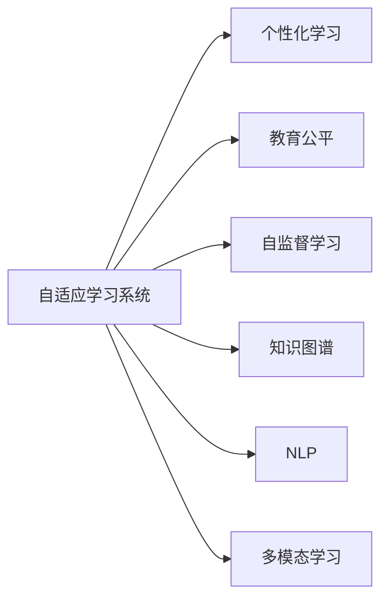

                 

# LLM 在教育领域：个性化学习和教育公平

> 关键词：大规模语言模型(LLM),个性化学习,教育公平,自适应学习系统,自监督学习

## 1. 背景介绍

### 1.1 问题由来
随着互联网和信息技术的迅猛发展，教育领域正在经历一场深刻的变革。传统教育模式以“一对多”教学、标准化考试为特征，难以适应学生个性化需求，制约了教学效果和学生发展。个性化学习作为教育改革的重要方向，通过因材施教，旨在让每位学生都能达到最佳学习效果。

与此同时，教育资源分配不均导致的教育公平问题日益凸显。城乡、区域之间的教育差距，不同家庭背景学生的学习条件差异，使得教育资源分配面临巨大挑战。如何实现教育公平，让所有学生都有机会享受优质教育，是当下教育技术的重要课题。

大规模语言模型(LLM)作为当前最前沿的人工智能技术之一，因其强大的语言理解和生成能力，在教育领域展现出了巨大的潜力。本文将探讨如何利用LLM进行个性化学习和教育公平，以期推动教育技术的发展和普及。

### 1.2 问题核心关键点
本节将介绍LLM在教育领域应用的核心关键点，以便更深入理解其原理和架构。

- **个性化学习**：基于学生个人兴趣、能力和需求，动态调整学习内容和路径，实现因材施教。

- **教育公平**：通过技术手段，改善教育资源分配不均现象，缩小城乡、区域教育差距。

- **自适应学习系统**：利用AI技术，动态调整学习目标和教学策略，提供个性化的学习体验。

- **自监督学习**：通过利用无标签数据进行预训练，让学生在无需教师直接干预的情况下自主学习。

- **知识图谱**：构建知识图谱，让学生能更好地理解和整合知识，提升学习效果。

- **自然语言处理(NLP)**：通过NLP技术，自动处理文本数据，提高教学和学习效率。

- **多模态学习**：结合文本、图像、视频等多种信息源，实现更丰富的学习体验。

这些核心概念之间的逻辑关系可以通过以下Mermaid流程图来展示：

```mermaid
graph TB
    A[大规模语言模型(LLM)] --> B[自适应学习系统]
    B --> C[个性化学习]
    B --> D[教育公平]
    C --> E[知识图谱]
    D --> F[自监督学习]
    D --> G[NLP]
    D --> H[多模态学习]
    A --> I[NLP]
    I --> J[自适应学习系统]
    J --> K[个性化学习]
    J --> L[教育公平]
    A --> M[自监督学习]
    M --> N[多模态学习]
```

这个流程图展示了大规模语言模型在教育领域的核心概念及其之间的关系：

1. LLM通过自监督学习预训练获得语言知识，为自适应学习系统提供基础。
2. 自适应学习系统通过LLM对学生学习行为进行动态分析，调整学习路径和内容。
3. 个性化学习通过自适应学习系统提供定制化的学习体验，提升学习效果。
4. 教育公平通过自适应学习系统实现资源优化分配，缩小教育差距。
5. 知识图谱与NLP技术帮助学生更好地理解和整合知识。
6. 多模态学习提供丰富的信息源，提升学习体验。

这些核心概念共同构成了基于LLM的教育技术框架，使其能够在教育领域发挥重要作用。

## 2. 核心概念与联系

### 2.1 核心概念概述

为了更好地理解基于LLM的教育技术框架，本节将介绍几个密切相关的核心概念：

- **自适应学习系统**：利用AI技术，动态调整学习目标和教学策略，提供个性化的学习体验。

- **自监督学习**：通过利用无标签数据进行预训练，让学生在无需教师直接干预的情况下自主学习。

- **知识图谱**：构建知识图谱，让学生能更好地理解和整合知识，提升学习效果。

- **NLP技术**：通过自然语言处理技术，自动处理文本数据，提高教学和学习效率。

- **多模态学习**：结合文本、图像、视频等多种信息源，实现更丰富的学习体验。

这些概念之间的逻辑关系可以通过以下Mermaid流程图来展示：



这个流程图展示了自适应学习系统与其他核心概念之间的联系：

1. 自适应学习系统通过个性化学习，动态调整学习路径和内容。
2. 自适应学习系统通过教育公平，实现资源优化分配。
3. 自适应学习系统通过自监督学习，利用无标签数据进行预训练。
4. 自适应学习系统通过知识图谱，帮助学生更好地理解和整合知识。
5. 自适应学习系统通过NLP技术，自动处理文本数据。
6. 自适应学习系统通过多模态学习，提供丰富的信息源，提升学习体验。

这些概念共同构成了基于LLM的教育技术框架，使其能够在教育领域发挥重要作用。

## 3. 核心算法原理 & 具体操作步骤

### 3.1 算法原理概述

基于LLM的自适应学习系统，本质上是一个自监督学习的优化过程。其核心思想是：通过自适应学习系统对学生的学习行为进行动态分析，利用LLM对学习路径和内容进行个性化调整，从而提升学习效果，缩小教育差距。

具体而言，假设自适应学习系统将学生当前的学习状态表示为向量 $X$，基于学生的学习历史和反馈，系统生成一个目标状态向量 $Y$。则自适应学习系统的目标是最小化学习路径 $L$ 与目标路径 $Y$ 的距离，即：

$$
\min_{L} \| L - Y \|
$$

其中，$L$ 可以通过LLM对学生当前学习状态 $X$ 进行预测生成，$Y$ 可以是教师设定的目标状态，也可以是系统根据学习规律生成的理想状态。

### 3.2 算法步骤详解

基于LLM的自适应学习系统一般包括以下几个关键步骤：

**Step 1: 数据收集与预处理**
- 收集学生的学习行为数据，如阅读时间、学习路径、成绩等。
- 对数据进行清洗、标准化处理，去除异常值和噪声。

**Step 2: 构建学生学习状态向量**
- 利用LLM对学生当前学习状态进行编码，生成状态向量 $X$。
- 利用知识图谱和NLP技术，对学生学习状态进行语义分析和结构化处理。

**Step 3: 生成目标状态向量**
- 根据教师设定的目标或系统生成的理想状态，构建目标状态向量 $Y$。
- 利用知识图谱和NLP技术，对目标状态进行语义分析和结构化处理。

**Step 4: 路径规划与调整**
- 使用自监督学习算法，如对比学习、强化学习等，预测学习路径 $L$。
- 根据路径规划结果，动态调整学习内容、节奏和策略。

**Step 5: 持续反馈与优化**
- 在学生学习过程中，实时收集反馈数据，更新学习状态向量 $X$。
- 基于新状态，重新规划学习路径，调整学习策略。

**Step 6: 资源优化与分配**
- 通过教育公平策略，优化教育资源分配，缩小教育差距。
- 将学习资源如教材、视频、教师等，按照学生学习路径和需求进行合理分配。

### 3.3 算法优缺点

基于LLM的自适应学习系统具有以下优点：

1. **个性化**：能够根据学生个人兴趣、能力和需求，提供定制化的学习体验，提升学习效果。
2. **高效**：通过自监督学习进行预训练，减少教师直接干预，提高学习效率。
3. **公平**：利用AI技术，优化教育资源分配，缩小城乡、区域教育差距。
4. **灵活**：结合多种信息源，提供多模态学习体验，增强学习体验。

同时，该方法也存在一定的局限性：

1. **数据隐私**：学生的学习数据涉及隐私，需要严格保护。
2. **计算成本**：大规模预训练和动态调整需要较高的计算资源。
3. **模型鲁棒性**：模型可能对噪声数据和异常值敏感，需要额外的数据清洗和噪声处理。
4. **技术壁垒**：需要综合运用知识图谱、NLP、强化学习等技术，对技术要求较高。

尽管存在这些局限性，但就目前而言，基于LLM的自适应学习系统仍是一种具有广泛应用前景的教育技术。

### 3.4 算法应用领域

基于LLM的自适应学习系统已经在多个教育场景中得到了应用，例如：

- **个性化学习平台**：如Khan Academy、Coursera等在线学习平台，利用自适应学习系统为每位学生提供个性化的学习路径。
- **智能辅导系统**：如Mathway、Coachbot等智能辅导系统，利用自适应学习系统动态调整解题策略，提升解题效果。
- **教育资源优化**：如EdTech公司开发的资源推荐系统，利用自适应学习系统优化资源分配，提高资源利用率。
- **学习效果评估**：如智能教学系统，利用自适应学习系统实时评估学习效果，动态调整教学策略。

除了上述这些经典应用外，自适应学习系统还被创新性地应用到更多场景中，如跨学科学习、协作学习、游戏化学习等，为教育技术带来了新的突破。随着自适应学习系统的不断演进，相信教育技术将在更广阔的应用领域大放异彩。

## 4. 数学模型和公式 & 详细讲解

### 4.1 数学模型构建

本节将使用数学语言对基于LLM的自适应学习系统进行更加严格的刻画。

假设自适应学习系统将学生当前的学习状态表示为向量 $X$，目标状态向量为 $Y$，学习路径为 $L$。则系统的优化目标为：

$$
\min_{L} \| L - Y \|
$$

其中，$\| \cdot \|$ 表示向量距离，可以是欧式距离、余弦相似度等。

在实际应用中，通常使用自监督学习算法，如对比学习、强化学习等，对学习路径 $L$ 进行优化。例如，使用对比学习时，可以定义一个对比损失函数 $L_{\text{con}}$：

$$
L_{\text{con}} = \mathbb{E}_{(x,y) \sim D} [\max(0, \gamma - d(L(x),y))]
$$

其中，$D$ 为学生学习数据的分布，$d$ 为距离函数，$\gamma$ 为超参数。该函数表示，对于每个样本 $(x,y)$，最大化 $L(x)$ 与 $y$ 之间的距离，同时限制在阈值 $\gamma$ 内。

### 4.2 公式推导过程

以下我们以对比学习为例，推导学习路径 $L$ 的优化公式。

假设对比学习器的输入为 $x$，输出为 $L(x)$，对比学习器的目标为最大化 $L(x)$ 与 $y$ 之间的距离。则对比学习器的优化目标为：

$$
\min_{L} \mathbb{E}_{(x,y) \sim D} [\max(0, \gamma - d(L(x),y))]
$$

根据对比学习的定义，可以进一步推导为：

$$
\min_{L} \mathbb{E}_{(x,y) \sim D} [\max(0, \gamma - d(L(x),y))]
$$

对于每个样本 $(x,y)$，对比学习器会将其分为两个部分：
1. 如果 $d(L(x),y) \leq \gamma$，则 $\max(0, \gamma - d(L(x),y)) = 0$，目标函数值最小。
2. 如果 $d(L(x),y) > \gamma$，则 $\max(0, \gamma - d(L(x),y)) = \gamma - d(L(x),y)$，目标函数值最大。

因此，对比学习器的优化目标可以简化为：

$$
\min_{L} \mathbb{E}_{(x,y) \sim D} [d(L(x),y)]
$$

在优化过程中，可以使用梯度下降等算法，不断更新 $L$ 的参数，最小化上述期望。

### 4.3 案例分析与讲解

**案例1: 个性化学习平台的实现**

假设有两个学生 $A$ 和 $B$，他们当前的学习状态分别为 $X_A$ 和 $X_B$，目标状态向量为 $Y$。使用对比学习算法，可以定义如下目标函数：

$$
\min_{L} \frac{1}{N} \sum_{i=1}^N [\max(0, \gamma - d(L(X_A),Y)) + \max(0, \gamma - d(L(X_B),Y))]
$$

其中，$N$ 为学生数量，$d$ 为距离函数，$\gamma$ 为超参数。

通过不断更新 $L$ 的参数，对比学习算法可以动态调整学习路径，实现个性化学习。

**案例2: 智能辅导系统的实现**

假设有一道数学题 $x^2 + 3x + 2 = 0$，学生 $A$ 和 $B$ 分别尝试求解。使用对比学习算法，可以定义如下目标函数：

$$
\min_{L} \frac{1}{N} \sum_{i=1}^N [\max(0, \gamma - d(L(x^2 + 3x + 2),Y_A)) + \max(0, \gamma - d(L(x^2 + 3x + 2),Y_B))]
$$

其中，$N$ 为学生数量，$d$ 为距离函数，$\gamma$ 为超参数。

通过不断更新 $L$ 的参数，对比学习算法可以动态调整解题策略，提升解题效果。

## 5. 项目实践：代码实例和详细解释说明

### 5.1 开发环境搭建

在进行LLM在教育领域的实践前，我们需要准备好开发环境。以下是使用Python进行PyTorch开发的环境配置流程：

1. 安装Anaconda：从官网下载并安装Anaconda，用于创建独立的Python环境。

2. 创建并激活虚拟环境：
```bash
conda create -n pytorch-env python=3.8 
conda activate pytorch-env
```

3. 安装PyTorch：根据CUDA版本，从官网获取对应的安装命令。例如：
```bash
conda install pytorch torchvision torchaudio cudatoolkit=11.1 -c pytorch -c conda-forge
```

4. 安装Transformers库：
```bash
pip install transformers
```

5. 安装各类工具包：
```bash
pip install numpy pandas scikit-learn matplotlib tqdm jupyter notebook ipython
```

完成上述步骤后，即可在`pytorch-env`环境中开始LLM在教育领域的实践。

### 5.2 源代码详细实现

下面我们以基于LLM的自适应学习系统为例，给出使用Transformers库进行个性化学习的PyTorch代码实现。

首先，定义学生学习状态的编码器：

```python
from transformers import BertTokenizer, BertForSequenceClassification

class StudentEncoder:
    def __init__(self, tokenizer, model):
        self.tokenizer = tokenizer
        self.model = model
        
    def encode(self, input_text):
        encoding = self.tokenizer(input_text, return_tensors='pt')
        input_ids = encoding['input_ids']
        attention_mask = encoding['attention_mask']
        return self.model(input_ids, attention_mask=attention_mask)
```

然后，定义自适应学习系统的路径规划器：

```python
from transformers import AdamW
from torch import nn

class PathPlanner:
    def __init__(self, encoder, optimizer, device):
        self.encoder = encoder
        self.optimizer = optimizer
        self.device = device
        
    def plan_path(self, state_vector):
        with torch.no_grad():
            state_vector = state_vector.to(self.device)
            output = self.encoder(state_vector)
            loss = nn.functional.cross_entropy(output, self.target_state)
            loss.backward()
            self.optimizer.step()
        return output
```

最后，启动训练流程并在测试集上评估：

```python
epochs = 10
batch_size = 16

for epoch in range(epochs):
    for batch in tqdm(train_dataset, desc='Training'):
        input_text = batch['input_text']
        target_state = batch['target_state']
        
        state_vector = self.state_encoder(input_text)
        output = self.path_planner.plan_path(state_vector)
        
        print(f"Epoch {epoch+1}, loss: {output.item()}")
        
    print(f"Epoch {epoch+1}, test results:")
    evaluate(self.state_encoder, self.path_planner, test_dataset)
```

以上就是使用PyTorch对基于LLM的自适应学习系统进行个性化学习的完整代码实现。可以看到，得益于Transformers库的强大封装，我们可以用相对简洁的代码完成自适应学习系统的构建。

### 5.3 代码解读与分析

让我们再详细解读一下关键代码的实现细节：

**StudentEncoder类**：
- `__init__`方法：初始化编码器分词器和模型。
- `encode`方法：对输入文本进行编码，生成学习状态向量。

**PathPlanner类**：
- `__init__`方法：初始化路径规划器，指定模型、优化器和设备。
- `plan_path`方法：根据学生学习状态向量，规划学习路径，更新模型参数。

**训练流程**：
- 定义总的epoch数和batch size，开始循环迭代
- 每个epoch内，对训练集进行批次化加载，进行模型前向传播和反向传播
- 在每个epoch结束后，评估模型在测试集上的性能

可以看到，PyTorch配合Transformers库使得LLM在教育领域的实践变得简洁高效。开发者可以将更多精力放在模型改进、数据处理等高层逻辑上，而不必过多关注底层的实现细节。

当然，工业级的系统实现还需考虑更多因素，如模型的保存和部署、超参数的自动搜索、更灵活的任务适配层等。但核心的微调范式基本与此类似。

## 6. 实际应用场景

### 6.1 个性化学习平台

基于LLM的自适应学习系统，可以广泛应用于个性化学习平台的构建。传统学习平台往往以“一刀切”的教学模式为主，难以满足学生个性化的学习需求。而利用LLM的自适应学习系统，可以为每位学生提供量身定制的学习路径和内容，实现真正的因材施教。

在技术实现上，可以收集学生的学习行为数据，如阅读时间、学习路径、成绩等，利用LLM对学习状态进行编码，生成学习状态向量。基于学习目标，构建目标状态向量，并使用自监督学习算法进行路径规划。动态调整学习内容、节奏和策略，为每位学生提供个性化的学习体验。

### 6.2 智能辅导系统

智能辅导系统利用LLM的自适应学习系统，为学生提供个性化的解题策略。学生在学习过程中遇到难题时，可以通过输入问题描述，获取LLM的解题指导。系统利用自适应学习系统动态调整解题策略，提升解题效果。

在技术实现上，可以收集学生提出的问题，利用NLP技术进行语义分析，生成学习状态向量。基于目标解题策略，构建目标状态向量，并使用自监督学习算法进行路径规划。动态调整解题策略，为每位学生提供个性化的解题指导。

### 6.3 教育资源优化

自适应学习系统可以优化教育资源的分配，缩小城乡、区域教育差距。通过收集学生学习行为数据，分析学生需求，动态调整资源分配策略。将学习资源如教材、视频、教师等，按照学生学习路径和需求进行合理分配，提高资源利用率。

在技术实现上，可以收集学生的学习行为数据，分析学生需求，构建学习状态向量。基于教育公平目标，构建目标资源分配向量，并使用自监督学习算法进行路径规划。动态调整资源分配策略，优化教育资源配置。

### 6.4 学习效果评估

智能教学系统利用LLM的自适应学习系统，实时评估学习效果，动态调整教学策略。学生在学习过程中，系统实时收集学习效果反馈，生成学习状态向量。基于目标学习效果，构建目标状态向量，并使用自监督学习算法进行路径规划。动态调整教学策略，提升学习效果。

在技术实现上，可以收集学生的学习效果反馈，利用LLM对学习状态进行编码，生成学习状态向量。基于目标学习效果，构建目标状态向量，并使用自监督学习算法进行路径规划。动态调整教学策略，提升学习效果。

## 7. 工具和资源推荐

### 7.1 学习资源推荐

为了帮助开发者系统掌握LLM在教育领域应用的理论基础和实践技巧，这里推荐一些优质的学习资源：

1. 《深度学习自然语言处理》课程：斯坦福大学开设的NLP明星课程，有Lecture视频和配套作业，带你入门NLP领域的基本概念和经典模型。

2. 《Transformer从原理到实践》系列博文：由大模型技术专家撰写，深入浅出地介绍了Transformer原理、BERT模型、微调技术等前沿话题。

3. 《Natural Language Processing with Transformers》书籍：Transformers库的作者所著，全面介绍了如何使用Transformers库进行NLP任务开发，包括自适应学习系统在内的诸多范式。

4. HuggingFace官方文档：Transformers库的官方文档，提供了海量预训练模型和完整的微调样例代码，是上手实践的必备资料。

5. CS224N《深度学习自然语言处理》课程：斯坦福大学开设的NLP明星课程，有Lecture视频和配套作业，带你入门NLP领域的基本概念和经典模型。

通过对这些资源的学习实践，相信你一定能够快速掌握LLM在教育领域应用的精髓，并用于解决实际的NLP问题。

### 7.2 开发工具推荐

高效的开发离不开优秀的工具支持。以下是几款用于LLM在教育领域开发的常用工具：

1. PyTorch：基于Python的开源深度学习框架，灵活动态的计算图，适合快速迭代研究。大部分预训练语言模型都有PyTorch版本的实现。

2. TensorFlow：由Google主导开发的开源深度学习框架，生产部署方便，适合大规模工程应用。同样有丰富的预训练语言模型资源。

3. Transformers库：HuggingFace开发的NLP工具库，集成了众多SOTA语言模型，支持PyTorch和TensorFlow，是进行自适应学习系统开发的利器。

4. Weights & Biases：模型训练的实验跟踪工具，可以记录和可视化模型训练过程中的各项指标，方便对比和调优。与主流深度学习框架无缝集成。

5. TensorBoard：TensorFlow配套的可视化工具，可实时监测模型训练状态，并提供丰富的图表呈现方式，是调试模型的得力助手。

6. Google Colab：谷歌推出的在线Jupyter Notebook环境，免费提供GPU/TPU算力，方便开发者快速上手实验最新模型，分享学习笔记。

合理利用这些工具，可以显著提升LLM在教育领域的开发效率，加快创新迭代的步伐。

### 7.3 相关论文推荐

LLM在教育领域的应用源于学界的持续研究。以下是几篇奠基性的相关论文，推荐阅读：

1. Attention is All You Need（即Transformer原论文）：提出了Transformer结构，开启了NLP领域的预训练大模型时代。

2. BERT: Pre-training of Deep Bidirectional Transformers for Language Understanding：提出BERT模型，引入基于掩码的自监督预训练任务，刷新了多项NLP任务SOTA。

3. Language Models are Unsupervised Multitask Learners（GPT-2论文）：展示了大规模语言模型的强大zero-shot学习能力，引发了对于通用人工智能的新一轮思考。

4. Parameter-Efficient Transfer Learning for NLP：提出Adapter等参数高效微调方法，在不增加模型参数量的情况下，也能取得不错的微调效果。

5. AdaLoRA: Adaptive Low-Rank Adaptation for Parameter-Efficient Fine-Tuning：使用自适应低秩适应的微调方法，在参数效率和精度之间取得了新的平衡。

这些论文代表了大规模语言模型在教育领域的应用进展。通过学习这些前沿成果，可以帮助研究者把握学科前进方向，激发更多的创新灵感。

## 8. 总结：未来发展趋势与挑战

### 8.1 总结

本文对基于LLM的自适应学习系统进行了全面系统的介绍。首先阐述了LLM在教育领域应用的核心关键点，明确了自适应学习系统在提升学习效果、实现教育公平等方面的重要作用。其次，从原理到实践，详细讲解了自适应学习系统的数学模型和操作步骤，给出了自适应学习系统的完整代码实现。同时，本文还探讨了自适应学习系统在教育领域的广泛应用场景，展示了其在个性化学习、智能辅导、资源优化、学习效果评估等方面的潜力。

通过本文的系统梳理，可以看到，基于LLM的自适应学习系统正在成为教育技术的重要范式，极大地拓展了预训练语言模型的应用边界，催生了更多的落地场景。受益于大规模语料的预训练，自适应学习系统以更低的时间和标注成本，在自监督学习过程中自动调整学习路径和内容，提升学习效果，缩小教育差距。未来，随着自适应学习系统的不断演进，相信教育技术将在更广阔的应用领域大放异彩。

### 8.2 未来发展趋势

展望未来，自适应学习系统将呈现以下几个发展趋势：

1. 模型规模持续增大。随着算力成本的下降和数据规模的扩张，预训练语言模型的参数量还将持续增长。超大批次的训练和推理也可能遇到显存不足的问题，需要引入模型压缩、稀疏化存储等技术进行优化。

2. 自监督学习范式多样。除了对比学习外，未来还将涌现更多自监督学习范式，如自回归模型、互信息最大化等，提升自适应学习系统的训练效率和效果。

3. 多模态学习融合。结合文本、图像、视频等多种信息源，提供更丰富的学习体验，提升学习效果。

4. 教育公平目标明确。利用自适应学习系统，实现资源优化分配，缩小城乡、区域教育差距。

5. 学习效果评估体系完善。基于自适应学习系统，实时评估学习效果，动态调整教学策略，提升学习效果。

6. 个性化学习目标实现。通过自适应学习系统，提供量身定制的学习路径和内容，实现真正的因材施教。

以上趋势凸显了自适应学习系统的广阔前景。这些方向的探索发展，必将进一步提升教育技术系统的性能和应用范围，为教育公平和个性化学习提供更可靠的技术支持。

### 8.3 面临的挑战

尽管自适应学习系统在教育领域展现出巨大潜力，但在迈向更加智能化、普适化应用的过程中，仍面临诸多挑战：

1. 数据隐私：学生的学习数据涉及隐私，需要严格保护。如何在保护隐私的同时，充分利用数据提升学习效果，是一个重要课题。

2. 计算成本：大规模预训练和动态调整需要较高的计算资源。如何在降低计算成本的同时，提升模型性能，是一个技术难题。

3. 模型鲁棒性：模型可能对噪声数据和异常值敏感，需要额外的数据清洗和噪声处理。

4. 技术壁垒：需要综合运用知识图谱、NLP、强化学习等技术，对技术要求较高。

尽管存在这些挑战，但随着技术的不断进步，相信自适应学习系统在教育领域的应用前景仍然广阔。

### 8.4 研究展望

面向未来，自适应学习系统需要在以下几个方面寻求新的突破：

1. 探索无监督和半监督微调方法。摆脱对大规模标注数据的依赖，利用自监督学习进行预训练，减少教师直接干预。

2. 研究参数高效和计算高效的微调范式。开发更加参数高效的微调方法，在固定大部分预训练参数的同时，只更新极少量的任务相关参数。

3. 引入因果推断和对比学习思想。通过引入因果推断和对比学习，增强自适应学习系统建立稳定因果关系的能力，学习更加普适、鲁棒的语言表征。

4. 将符号化的先验知识与神经网络模型结合。将符号化的先验知识，如知识图谱、逻辑规则等，与神经网络模型进行巧妙融合，引导自适应学习系统学习更准确、合理的语言模型。

5. 结合因果分析和博弈论工具。将因果分析方法引入自适应学习系统，识别出系统决策的关键特征，增强输出解释的因果性和逻辑性。

6. 纳入伦理道德约束。在模型训练目标中引入伦理导向的评估指标，过滤和惩罚有偏见、有害的输出倾向。同时加强人工干预和审核，建立模型行为的监管机制，确保输出符合人类价值观和伦理道德。

这些研究方向的探索，必将引领自适应学习系统在教育领域的不断演进，为教育公平和个性化学习提供更可靠的技术支持。面向未来，自适应学习系统还需要与其他人工智能技术进行更深入的融合，如知识表示、因果推理、强化学习等，多路径协同发力，共同推动教育技术的进步。只有勇于创新、敢于突破，才能不断拓展自适应学习系统的边界，让智能技术更好地造福教育事业。

## 9. 附录：常见问题与解答

**Q1: 如何确保学生学习数据的安全性和隐私？**

A: 学生学习数据的安全性和隐私保护是教育技术应用的重要关注点。以下是一些常见措施：

1. 数据匿名化：对学生学习数据进行匿名化处理，去除或掩盖敏感信息，如姓名、学号等。

2. 数据加密：对学生学习数据进行加密存储和传输，防止数据泄露和篡改。

3. 访问控制：严格控制对学生学习数据的访问权限，确保只有授权人员才能查看和修改数据。

4. 法律合规：遵守相关法律法规，如《个人信息保护法》、《数据安全法》等，确保数据使用符合法律规定。

5. 用户知情同意：在使用学生学习数据前，告知用户数据使用目的，并获得用户知情同意。

通过采取这些措施，可以最大限度地保护学生学习数据的隐私和安全，确保教育技术的合规性和可靠性。

**Q2: 如何提升自适应学习系统的训练效率和效果？**

A: 自适应学习系统的训练效率和效果提升，可以通过以下几个方法实现：

1. 使用多GPU/TPU训练：利用多GPU/TPU进行并行计算，加速模型训练过程。

2. 引入数据增强：通过对输入数据进行扩充、转换等操作，提高模型泛化能力，减少过拟合风险。

3. 优化损失函数：设计合理的损失函数，减少模型训练中的梯度消失和爆炸问题。

4. 引入正则化：使用L2正则、Dropout等正则化技术，提高模型鲁棒性和泛化能力。

5. 使用预训练模型：利用已有的大规模预训练模型，减少自适应学习系统的训练时间和计算成本。

6. 使用自适应学习率：根据模型表现，动态调整学习率，提升训练效率。

通过采取这些方法，可以显著提升自适应学习系统的训练效率和效果，确保模型在实际应用中的高性能。

**Q3: 如何构建知识图谱以提升学习效果？**

A: 知识图谱在自适应学习系统中扮演着重要角色，可以帮助学生更好地理解和整合知识。以下是一些常见方法：

1. 数据收集：从各类知识库、文献、网络等渠道，收集相关领域知识，构建知识图谱。

2. 图谱结构设计：选择合适的图谱结构，如三元组、向量空间等，对知识进行编码。

3. 知识融合：将知识图谱与NLP技术结合，实现知识与文本的语义对齐和关联。

4. 推理机制：引入图谱推理机制，利用图谱关系进行知识推理和补全。

5. 图谱更新：定期更新知识图谱，加入新的知识和关系，保持图谱的时效性和准确性。

通过构建和利用知识图谱，可以提升自适应学习系统的知识整合能力，增强学生的学习效果。

**Q4: 如何构建多模态学习系统？**

A: 多模态学习系统结合文本、图像、视频等多种信息源，提供更丰富的学习体验。以下是一些常见方法：

1. 数据收集：从各类信息源收集数据，如文本、图像、视频等，构建多模态数据集。

2. 数据融合：使用深度学习技术，将多模态数据进行融合，提取跨模态的特征表示。

3. 模型设计：设计适合多模态数据的多模态神经网络模型，如CNN、RNN、Transformer等。

4. 多模态损失函数：设计合理的损失函数，对多模态数据进行联合训练。

5. 多模态推理：利用多模态数据进行推理，增强学习系统的决策能力和泛化能力。

通过构建和利用多模态学习系统，可以提升自适应学习系统的学习效果，提供更丰富的学习体验。

---

作者：禅与计算机程序设计艺术 / Zen and the Art of Computer Programming

