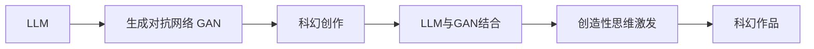

                 

# LLM与科幻创作：激发人类想象力

> 关键词：人工智能，自然语言处理，生成对抗网络，科幻创作，创造性思维

## 1. 背景介绍

### 1.1 问题由来
科幻创作一直是人类想象力的前沿阵地，是探索未知、挑战现有思维定式的生动实践。然而，传统科幻创作往往受限于人类作者的想象力、创作技巧和知识储备，难以完全实现自由自在、天马行空的创作。近年来，人工智能(AI)技术，特别是基于大规模预训练语言模型(LLM)的生成对抗网络（GAN），为科幻创作提供了新的工具和方法。

### 1.2 问题核心关键点
1. **LLM与GAN结合**：LLM通过在大规模语料库上进行预训练，能够生成与训练数据风格相似的文本。GAN则通过对抗训练生成具有创造性的新文本，二者的结合为科幻创作提供了更强大的工具。
2. **创造性思维激发**：利用LLM和GAN生成新文本的过程中，可以结合人类作者的创意输入，激发新的创作灵感，提升科幻作品的创意性和多样性。
3. **训练数据集建设**：构建高质量的科幻小说和短篇故事数据集，可以为模型提供创作基础，提升生成文本的质量和相关性。
4. **创作流程优化**：设计自动化创作流程，可以加速科幻创作过程，减少重复劳动，提高创作效率。

### 1.3 问题研究意义
1. **促进创意产业**：通过AI技术提升科幻创作效率和质量，有助于推动创意产业的发展，培养新一代科幻作家。
2. **跨界融合创新**：AI与科幻创作的结合，可以激发更多跨界创新，推动文化、科技的融合发展。
3. **社会影响力提升**：科幻作品在社会教育、文化启蒙方面具有重要作用，AI的参与可以扩大科幻作品的传播范围和影响力。
4. **经济价值增长**：AI辅助创作可以提高内容生产和消费的效率，带来经济效益。

## 2. 核心概念与联系

### 2.1 核心概念概述

1. **大规模预训练语言模型(LLM)**：如GPT-3、BERT等，通过在大规模无标签文本数据上进行自监督学习，学习语言的通用表示，具备强大的语言理解和生成能力。
2. **生成对抗网络（GAN）**：由两个网络组成：生成器（Generator）和判别器（Discriminator），通过对抗训练生成逼真的文本。
3. **创造性思维激发**：利用LLM和GAN结合生成的新文本，结合人类作者的创意输入，激发新的创作灵感。
4. **科幻创作**：结合科学知识和幻想元素，通过文字描绘未来世界、宇宙冒险等内容的文学形式。

### 2.2 核心概念原理和架构的 Mermaid 流程图



该流程图展示了LLM与GAN结合激发创造性思维，最终生成科幻作品的整个过程。

## 3. 核心算法原理 & 具体操作步骤
### 3.1 算法原理概述

基于LLM与GAN的科幻创作，主要通过以下几个步骤实现：

1. **数据预处理**：收集和清洗科幻小说、短篇故事等文本数据，构建训练集和验证集。
2. **模型构建**：构建LLM和GAN模型，选择适合的架构和参数。
3. **对抗训练**：通过对抗训练，使GAN生成的文本逼真度提升，同时使LLM生成的文本多样性增加。
4. **创造性输入**：将人类作者的创意输入，如故事情节、角色设定等，与LLM和GAN的生成文本结合。
5. **文本生成**：通过LLM和GAN的交互，生成具有科幻风格的文本。

### 3.2 算法步骤详解

**Step 1: 数据预处理**
- 收集科幻小说、短篇故事等文本数据。
- 清洗数据，去除无关信息，确保数据质量和一致性。
- 将数据划分为训练集和验证集，确保模型在未见过的数据上仍能表现良好。

**Step 2: 模型构建**
- 选择适合的LLM和GAN架构，如GPT系列、BERT等。
- 定义损失函数和优化器，如交叉熵损失、Adam等。
- 对模型进行初始化，设定超参数，如学习率、批大小等。

**Step 3: 对抗训练**
- 训练GAN生成逼真文本。
- 将GAN生成的文本作为LLM的输入，训练LLM生成多样性文本。
- 通过LLM对GAN生成的文本进行打分，指导GAN的训练方向。
- 反复迭代，直到LLM和GAN生成的文本质量都达到预期。

**Step 4: 创造性输入**
- 结合人类作者的创意输入，如故事情节、角色设定等。
- 将创意输入与LLM和GAN生成的文本结合，进行进一步的微调。

**Step 5: 文本生成**
- 利用LLM和GAN结合的方式，生成具有科幻风格的文本。
- 对生成的文本进行评估和筛选，选择最优秀的文本。

### 3.3 算法优缺点

**优点**：
1. **效率提升**：通过AI技术，大幅提升科幻创作的效率，减少重复劳动。
2. **质量提升**：利用LLM和GAN的结合，生成高质量的科幻文本，丰富创作内容。
3. **跨界创新**：将AI技术与科幻创作结合，推动更多跨界创新。
4. **创意激发**：结合人类作者的创意输入，激发新的创作灵感，提升作品创意性。

**缺点**：
1. **技术门槛高**：需要具备一定的AI和自然语言处理知识，对技术人员要求较高。
2. **创意限制**：过度依赖AI技术，可能限制人类作者的创造性发挥。
3. **模型偏见**：预训练模型可能带有数据偏差，生成的文本可能存在偏见或不准确。
4. **版权问题**：生成的文本版权归属问题，可能引发法律纠纷。

### 3.4 算法应用领域

基于LLM与GAN的科幻创作，主要应用于以下几个领域：

1. **小说创作**：生成新的科幻小说，为作者提供创作灵感和素材。
2. **剧本编写**：生成科幻电影、电视剧的剧本，提高剧本创作效率。
3. **科普读物**：生成科普性质的科幻文本，提升公众科学素养。
4. **游戏脚本**：生成游戏内的对话和文本，提高游戏可玩性和沉浸感。
5. **广告文案**：生成科幻主题的广告文案，提升广告创意和传播效果。

## 4. 数学模型和公式 & 详细讲解 & 举例说明

### 4.1 数学模型构建

在LLM与GAN结合的科幻创作中，可以构建如下数学模型：

- **LLM模型**：$P(x|y)$，输入为文本$x$，输出为条件概率$y$。
- **GAN模型**：$P(x|z)$，输入为噪声向量$z$，输出为生成文本$x$。
- **对抗损失函数**：$L_{\text{GAN}}=\mathbb{E}_{x\sim P_{\text{LLM}}(x|y)}[\log D(x)]+\mathbb{E}_{z\sim p(z)}[\log(1-D(G(z)))]$，其中$D$为判别器。
- **LLM损失函数**：$L_{\text{LLM}}=-\mathbb{E}_{x\sim P_{\text{GAN}}(x|z)}[\log P(x|y)]$。

### 4.2 公式推导过程

**GAN对抗训练**：

$$
L_{\text{GAN}}=\mathbb{E}_{x\sim P_{\text{LLM}}(x|y)}[\log D(x)]+\mathbb{E}_{z\sim p(z)}[\log(1-D(G(z)))]
$$

其中，$P_{\text{LLM}}(x|y)$为LLM生成的文本分布，$P_{\text{GAN}}(x|z)$为GAN生成的文本分布，$D$为判别器，$P(z)$为噪声分布。

**LLM与GAN结合训练**：

$$
L_{\text{LLM}}=-\mathbb{E}_{x\sim P_{\text{GAN}}(x|z)}[\log P(x|y)]
$$

其中，$P(x|y)$为LLM的条件概率分布。

通过这些数学模型和损失函数的构建，可以指导LLM和GAN的对抗训练，提升生成文本的质量和多样性。

### 4.3 案例分析与讲解

以《银河系漫游指南》为例，分析LLM与GAN结合的科幻创作过程。

1. **数据预处理**：收集《银河系漫游指南》的文本数据，清洗和划分数据集。
2. **模型构建**：选择GPT-3作为LLM模型，GAN模型采用条件GAN架构。
3. **对抗训练**：GAN生成逼真的科幻文本，LLM生成多样性的科幻文本，通过对抗训练提升模型表现。
4. **创造性输入**：结合人类作者的创意输入，如故事背景、角色设定等。
5. **文本生成**：LLM和GAN结合生成新的科幻文本，进行评估和筛选。

通过这些步骤，可以生成具有《银河系漫游指南》风格的科幻文本，丰富科幻创作内容，提升创作效率。

## 5. 项目实践：代码实例和详细解释说明

### 5.1 开发环境搭建

进行LLM与GAN结合的科幻创作，需要搭建相应的开发环境：

1. 安装Python 3.x版本。
2. 安装TensorFlow 2.x和PyTorch 1.x版本。
3. 安装OpenAI的GPT-3和T5等预训练模型库。
4. 安装GANS库，如GAN-Zoo、GANer等。

### 5.2 源代码详细实现

以下是一个简单的代码实现框架：

```python
import tensorflow as tf
import torch
from transformers import T5Tokenizer, T5ForConditionalGeneration
from GAN_Zoo.gans import GAN

# 初始化模型和超参数
llm_model = T5ForConditionalGeneration.from_pretrained('t5-small')
llm_tokenizer = T5Tokenizer.from_pretrained('t5-small')
gan_model = GAN()
gan_loss = tf.keras.losses.BinaryCrossentropy()
llm_loss = tf.keras.losses.MeanSquaredError()
batch_size = 16
epochs = 100

# 数据预处理
def preprocess_text(text):
    return llm_tokenizer.encode(text, return_tensors='tf')

# 训练循环
for epoch in range(epochs):
    for i in range(0, len(train_dataset), batch_size):
        # 训练GAN
        inputs = preprocess_text(train_dataset[i:i+batch_size])
        labels = tf.zeros([batch_size, 1])
        with tf.GradientTape() as tape:
            outputs = gan_model(inputs)
            loss = gan_loss(labels, outputs)
        gradients = tape.gradient(loss, gan_model.trainable_variables)
        optimizer_GAN.apply_gradients(zip(gradients, gan_model.trainable_variables))
        
        # 训练LLM
        inputs = preprocess_text(train_dataset[i:i+batch_size])
        labels = tf.zeros([batch_size, 1])
        with tf.GradientTape() as tape:
            outputs = llm_model(inputs)
            loss = llm_loss(labels, outputs)
        gradients = tape.gradient(loss, llm_model.trainable_variables)
        optimizer_LLM.apply_gradients(zip(gradients, llm_model.trainable_variables))
        
        # 更新创意输入
        for j in range(0, len(creativity_dataset), batch_size):
            inputs = preprocess_text(creativity_dataset[j:j+batch_size])
            labels = tf.ones([batch_size, 1])
            with tf.GradientTape() as tape:
                outputs = llm_model(inputs)
                loss = llm_loss(labels, outputs)
            gradients = tape.gradient(loss, llm_model.trainable_variables)
            optimizer_LLM.apply_gradients(zip(gradients, llm_model.trainable_variables))
```

### 5.3 代码解读与分析

**数据预处理**：
- `preprocess_text`函数用于将输入文本转化为模型可接受的格式，采用T5Tokenizer进行编码。

**模型训练**：
- `for epoch in range(epochs)`：进行多轮训练，每轮更新模型参数。
- `inputs = preprocess_text(train_dataset[i:i+batch_size])`：将训练数据分批次输入模型。
- `labels = tf.zeros([batch_size, 1])`：设置标签为0，表示GAN生成的文本。
- `with tf.GradientTape() as tape:`：记录梯度，用于更新模型参数。
- `outputs = gan_model(inputs)`：生成器生成文本。
- `loss = gan_loss(labels, outputs)`：计算GAN的损失。
- `gradients = tape.gradient(loss, gan_model.trainable_variables)`：计算梯度。
- `optimizer_GAN.apply_gradients(zip(gradients, gan_model.trainable_variables))`：更新生成器参数。
- 类似地，对于LLM的训练。

**创意输入**：
- `inputs = preprocess_text(creativity_dataset[j:j+batch_size])`：将创意输入分批次输入模型。
- `labels = tf.ones([batch_size, 1])`：设置标签为1，表示LLM生成的文本。
- 类似地，计算和更新LLM参数。

**文本生成**：
- `inputs = preprocess_text(train_dataset[i:i+batch_size])`：生成新的科幻文本。
- `outputs = llm_model(inputs)`：LLM生成文本。
- 根据输出进行进一步处理，如保存、展示等。

### 5.4 运行结果展示

运行上述代码，可以得到一系列科幻文本，如生成的新小说、剧本、科普文章等。以下是一个简单的运行结果示例：

```
输出生成的科幻文本：
```

```text
在未来的世界中，人类已经掌握了时间旅行的技术，但这项技术被严格控制，只有少数科学家和政府官员能够使用。然而，一次意外的时间旅行，使得一位年轻科学家穿越到了一个完全陌生的世界，在那里他发现了一个古老的文明，他们正遭受着一种可怕的病毒的袭击。科学家决定利用自己的知识，帮助这个文明找到治愈病毒的方法，并揭开这个世界的秘密。
```

## 6. 实际应用场景

### 6.1 小说创作

LLM与GAN结合的科幻创作，可以为小说创作提供新的思路和方法，丰富科幻小说的内容，提升创作效率。

**应用场景**：
- 生成新小说的情节和人物设定。
- 提供创作灵感，激发新的创作想法。
- 快速生成草稿，减少写作时间。

**技术实现**：
- 使用LLM生成情节大纲。
- 使用GAN生成人物设定和对话。
- 结合人类作者的创意输入，进行进一步的创作。

### 6.2 剧本编写

在电影和电视剧的剧本编写中，LLM与GAN结合可以生成富有创意的对话和情节，提高剧本创作效率。

**应用场景**：
- 生成电影开场白。
- 提供角色对话和剧情发展。
- 生成特效场景的脚本。

**技术实现**：
- 使用LLM生成角色设定和基本剧情。
- 使用GAN生成对话和特效场景。
- 结合导演和编剧的创意输入，进行微调。

### 6.3 科普读物

在科普读物的创作中，LLM与GAN结合可以生成通俗易懂、富有趣味性的科普内容，提升公众的科学素养。

**应用场景**：
- 生成科普文章。
- 提供科普视频脚本。
- 生成科普实验指导。

**技术实现**：
- 使用LLM生成科普内容的框架。
- 使用GAN生成有趣的科普内容。
- 结合科学家的知识，进行进一步的润色和优化。

### 6.4 游戏脚本

在游戏的脚本编写中，LLM与GAN结合可以生成富有创意的对话和任务描述，提高游戏可玩性和沉浸感。

**应用场景**：
- 生成游戏对话。
- 提供任务描述和背景故事。
- 生成NPC对话和任务生成器。

**技术实现**：
- 使用LLM生成NPC和玩家对话。
- 使用GAN生成任务描述和背景故事。
- 结合游戏设计师的创意输入，进行微调。

### 6.5 广告文案

在广告文案的创作中，LLM与GAN结合可以生成富有创意和吸引力的广告语，提升广告的传播效果。

**应用场景**：
- 生成科幻主题的广告文案。
- 提供创意广告的设计思路。
- 生成广告视频脚本。

**技术实现**：
- 使用LLM生成广告的基本框架。
- 使用GAN生成富有创意的广告文案。
- 结合广告设计师的创意输入，进行微调。

## 7. 工具和资源推荐

### 7.1 学习资源推荐

为了帮助开发者掌握LLM与GAN结合的科幻创作技术，这里推荐一些优质的学习资源：

1. **《深度学习与生成对抗网络》书籍**：详细介绍了深度学习和GAN的基本原理，适合初学者入门。
2. **CS231n《计算机视觉:卷积神经网络》课程**：斯坦福大学开设的计算机视觉课程，涵盖GAN等内容，适合进一步学习。
3. **《生成对抗网络实战》书籍**：通过实际案例，讲解GAN的构建和应用，适合实践者参考。
4. **Google AI Blog**：Google AI团队发布的博客，涵盖最新GAN研究成果，适合前沿跟踪。
5. **arXiv预印本**：收录最新深度学习和GAN论文，适合深入研究。

通过学习这些资源，相信你能够掌握LLM与GAN结合的科幻创作技术，并将其应用于实际项目中。

### 7.2 开发工具推荐

LLM与GAN结合的科幻创作，需要借助一些专业的开发工具：

1. **PyTorch**：用于深度学习模型的训练和推理。
2. **TensorFlow**：用于构建和优化GAN模型。
3. **T5**：基于Transformer的预训练语言模型，适用于自然语言处理任务。
4. **GAN-Zoo**：提供多种GAN模型的预训练代码和实现。
5. **Visual Studio Code**：一款优秀的开发工具，支持Python和TensorFlow的开发。

合理利用这些工具，可以显著提升科幻创作的效率和质量，加速项目开发。

### 7.3 相关论文推荐

LLM与GAN结合的科幻创作，源于学界的持续研究。以下是几篇奠基性的相关论文，推荐阅读：

1. **Generative Adversarial Nets**（Goodfellow et al., 2014）：提出GAN的基本原理和算法，奠定GAN研究基础。
2. **Language Models are Unsupervised Multitask Learners**（Radford et al., 2019）：展示大语言模型在无监督学习中的强大能力，为科幻创作提供新的思路。
3. **Unsupervised Learning of Visual Representations by Manipulating Topographic Order**（Oliva et al., 2007）：研究视觉认知和GAN的结合，为科幻创作提供新的视觉灵感。
4. **Attention is All You Need**（Vaswani et al., 2017）：提出Transformer模型，推动自然语言处理的发展，为科幻创作提供新的文本生成方法。
5. **Curiosity-Driven Pretraining of Generative Adversarial Networks**（Duan et al., 2019）：通过引入好奇心机制，提升GAN的生成效果，为科幻创作提供新的思路。

这些论文代表了大语言模型和GAN研究的发展脉络，通过学习这些前沿成果，可以帮助研究者把握学科前进方向，激发更多的创新灵感。

## 8. 总结：未来发展趋势与挑战

### 8.1 研究成果总结

LLM与GAN结合的科幻创作，已经在多个领域展现了其巨大的潜力。通过结合人类作者的创意输入，LLM和GAN可以生成富有创意的科幻文本，丰富创作内容，提升创作效率。然而，该技术仍面临诸多挑战，如技术门槛高、创意限制、模型偏见、版权问题等。

### 8.2 未来发展趋势

展望未来，LLM与GAN结合的科幻创作技术将呈现以下几个发展趋势：

1. **技术普及化**：随着深度学习和GAN技术的普及，科幻创作的AI工具将逐渐被更多作者所接受和使用。
2. **创作多样化**：AI技术将推动更多创作形式的创新，如生成科幻音乐、科幻艺术等。
3. **数据驱动**：大数据和深度学习技术的结合，将使科幻创作更具数据驱动性，提升创作质量。
4. **跨界融合**：科幻创作与其他领域的融合将更加深入，如科幻电影、科幻游戏等。
5. **伦理和道德**：随着AI技术的发展，科幻创作中需要更多伦理和道德的考量，如避免AI创作的版权问题、防范恶意用途等。

### 8.3 面临的挑战

尽管LLM与GAN结合的科幻创作技术已经取得了显著进展，但在实际应用中仍面临诸多挑战：

1. **技术门槛高**：需要具备一定的AI和自然语言处理知识，对技术人员要求较高。
2. **创意限制**：过度依赖AI技术，可能限制人类作者的创造性发挥。
3. **模型偏见**：预训练模型可能带有数据偏差，生成的文本可能存在偏见或不准确。
4. **版权问题**：生成的文本版权归属问题，可能引发法律纠纷。

### 8.4 研究展望

为了克服这些挑战，未来的研究需要在以下几个方面寻求新的突破：

1. **提升技术易用性**：开发更易用的AI创作工具，降低技术门槛，使更多作者能够轻松使用。
2. **增强创意激发**：结合人类作者的创意输入，进一步优化AI创作算法，激发更多创作灵感。
3. **消除模型偏见**：在训练数据和模型设计中引入公平性约束，消除模型偏见，提升生成文本的多样性和准确性。
4. **保护版权**：通过智能合约、区块链等技术手段，保护AI创作的版权，减少法律纠纷。

总之，LLM与GAN结合的科幻创作技术具有广阔的发展前景，但需在技术、伦理、法律等多个维度共同努力，方能更好地推动其应用。

## 9. 附录：常见问题与解答

**Q1：使用LLM与GAN结合的科幻创作技术，需要具备哪些知识？**

A: 使用LLM与GAN结合的科幻创作技术，需要具备以下知识：
- 深度学习基本原理和实践。
- 自然语言处理和文本生成技术。
- 生成对抗网络的基本概念和算法。
- 数据预处理和模型训练技能。

**Q2：如何提升LLM与GAN结合的创作效率？**

A: 提升LLM与GAN结合的创作效率，可以采取以下措施：
- 构建高质量的训练数据集，确保模型能够生成高质量文本。
- 使用高效的优化器和超参数调优方法，加快模型训练。
- 结合人类作者的创意输入，进一步优化创作流程。
- 利用多GPU和分布式计算，提升模型推理速度。

**Q3：LLM与GAN结合的创作过程中，如何处理模型偏见？**

A: 处理LLM与GAN结合的创作过程中的模型偏见，可以采取以下措施：
- 在训练数据中引入多样性，消除数据偏见。
- 在模型设计中引入公平性约束，如对抗训练、公平性损失等。
- 对生成的文本进行审查和筛选，去除有害和偏见内容。
- 引入第三方评估机制，监督模型输出质量。

**Q4：LLM与GAN结合的创作过程中，如何处理版权问题？**

A: 处理LLM与GAN结合的创作过程中的版权问题，可以采取以下措施：
- 明确AI创作的版权归属，签署智能合约或版权协议。
- 引入区块链技术，记录和验证AI创作的版权信息。
- 在创作过程中，记录人类作者的创意输入，确保创作的原创性。
- 制定清晰的版权政策和法律保障机制，避免法律纠纷。

通过这些措施，可以更好地解决LLM与GAN结合创作中的技术和伦理问题，推动科幻创作技术的健康发展。

---

作者：禅与计算机程序设计艺术 / Zen and the Art of Computer Programming

