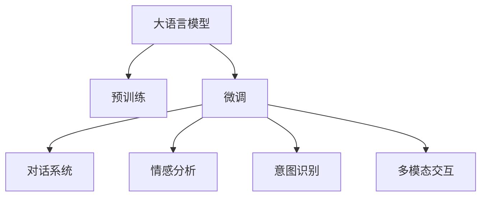

                 

# LLM在客户服务中的应用：24/7全天候AI助手

> 关键词：大语言模型,自然语言处理,客户服务,24/7,全天候,智能助手,智能客服

## 1. 背景介绍

### 1.1 问题由来

随着电商、金融、医疗等行业的蓬勃发展，客户服务的需求日益增多，企业对客服效率和服务质量的要求也越来越高。传统的人力客服模式存在响应速度慢、服务标准不一、人工成本高等问题，无法满足快速发展的市场需求。

为了解决这些问题，企业纷纷转向采用自动化客服系统。基于自然语言处理（Natural Language Processing, NLP）的客户服务系统应运而生，极大地提升了客户服务效率。近年来，大语言模型（Large Language Models, LLMs）在NLP领域取得了突破性进展，其强大的语言理解和生成能力使其成为构建智能客服系统的重要技术之一。

### 1.2 问题核心关键点

大语言模型在客户服务中的应用，主要体现在智能客服系统的构建上。智能客服系统能够实现24/7全天候服务，以机器人的形式与客户进行自然对话，快速响应客户需求，并提供标准化、高质量的服务。大语言模型的引入，使得智能客服系统具备了高度的自然语言理解能力，能够理解客户意图，生成符合语境的回复，并提供个性化的服务。

该技术不仅提升了客户服务效率，还帮助企业降低人工成本，提高服务质量，增强客户满意度。

### 1.3 问题研究意义

智能客服系统的大规模应用，对于提升客户服务体验、推动企业数字化转型、促进NLP技术在各行各业的应用具有重要意义：

1. **提升服务效率**：智能客服系统能够快速响应客户需求，减少等待时间，提升客户满意度。
2. **降低运营成本**：减少人工客服的人力投入，降低企业运营成本。
3. **提高服务质量**：大语言模型具备高度的准确性和一致性，提供高质量的客户服务。
4. **增强用户体验**：通过自然语言对话，增强客户与企业之间的互动体验。
5. **促进数字化转型**：智能客服系统的应用，是企业数字化转型的重要环节，推动NLP技术在各行业的普及和应用。

## 2. 核心概念与联系

### 2.1 核心概念概述

为更好地理解大语言模型在客户服务中的应用，本节将介绍几个密切相关的核心概念：

- **大语言模型(Large Language Model, LLM)**：以自回归(如GPT)或自编码(如BERT)模型为代表的大规模预训练语言模型。通过在大规模无标签文本语料上进行预训练，学习通用的语言表示，具备强大的语言理解和生成能力。

- **预训练(Pre-training)**：指在大规模无标签文本语料上，通过自监督学习任务训练通用语言模型的过程。常见的预训练任务包括言语建模、遮挡语言模型等。预训练使得模型学习到语言的通用表示。

- **微调(Fine-tuning)**：指在预训练模型的基础上，使用下游任务的少量标注数据，通过有监督学习优化模型在特定任务上的性能。通常只需要调整顶层分类器或解码器，并以较小的学习率更新全部或部分的模型参数。

- **对话系统(DialoGPT)**：一种基于大语言模型的对话生成系统，能够生成符合语境、流畅自然的对话。

- **情感分析(Affection Analysis)**：通过分析客户文本情感，判断其情绪状态，提供有针对性的服务。

- **意图识别(Intent Recognition)**：识别客户在对话中的意图，提供更精准的服务。

- **多模态交互(Multi-modal Interaction)**：结合图像、语音等多种模态信息，提供更丰富、更全面的客户服务。

这些核心概念之间的逻辑关系可以通过以下Mermaid流程图来展示：



这个流程图展示了大语言模型的核心概念及其之间的关系：

1. 大语言模型通过预训练获得基础能力。
2. 微调是对预训练模型进行任务特定的优化，使得模型输出能够匹配特定任务的需求。
3. 对话系统、情感分析、意图识别、多模态交互等应用，是基于微调模型进一步拓展功能。

## 3. 核心算法原理 & 具体操作步骤
### 3.1 算法原理概述

基于大语言模型的智能客服系统，主要通过以下步骤实现：

1. **预训练模型选择**：选择适用于自然语言理解和大规模文本生成的预训练语言模型。
2. **微调任务适配**：根据客户服务的具体需求，设计并微调模型，使其能够理解客户文本、生成对话回复、执行特定任务等。
3. **对话生成**：利用微调后的模型，生成与客户自然对话的回复。
4. **多模态交互**：结合语音识别、图像识别等技术，提供更丰富的客户服务体验。

### 3.2 算法步骤详解

**Step 1: 准备预训练模型和数据集**
- 选择合适的预训练语言模型，如GPT-3、BERT等。
- 准备客户服务对话数据集，包括问题、回答、对话历史等。

**Step 2: 添加任务适配层**
- 根据任务需求，在预训练模型的顶层设计合适的输出层和损失函数。
- 对于对话生成任务，通常使用语言模型的解码器输出概率分布，并以负对数似然为损失函数。

**Step 3: 设置微调超参数**
- 选择合适的优化算法及其参数，如AdamW、SGD等，设置学习率、批大小、迭代轮数等。
- 设置正则化技术及强度，包括权重衰减、Dropout、Early Stopping等。
- 确定冻结预训练参数的策略，如仅微调顶层，或全部参数都参与微调。

**Step 4: 执行梯度训练**
- 将训练集数据分批次输入模型，前向传播计算损失函数。
- 反向传播计算参数梯度，根据设定的优化算法和学习率更新模型参数。
- 周期性在验证集上评估模型性能，根据性能指标决定是否触发Early Stopping。
- 重复上述步骤直到满足预设的迭代轮数或Early Stopping条件。

**Step 5: 测试和部署**
- 在测试集上评估微调后模型，对比微调前后的性能。
- 使用微调后的模型对新样本进行推理预测，集成到智能客服系统中。
- 持续收集新的数据，定期重新微调模型，以适应数据分布的变化。

### 3.3 算法优缺点

基于大语言模型的智能客服系统具有以下优点：
1. **高效响应**：24/7全天候服务，能够快速响应客户需求，缩短客户等待时间。
2. **一致性高**：预训练模型具备高度的一致性和稳定性，提供标准化的服务。
3. **质量高**：利用大语言模型的强大语言生成能力，生成的对话回复自然流畅，符合语境。
4. **成本低**：减少人工客服的人力成本，提高运营效率。
5. **灵活性高**：能够根据企业需求进行定制化开发，提供多样化的客户服务功能。

同时，该系统也存在以下局限性：
1. **依赖标注数据**：微调过程需要标注数据，获取高质量标注数据的成本较高。
2. **数据隐私问题**：客服数据涉及隐私，需要严格的数据保护措施。
3. **解释性不足**：微调模型的决策过程缺乏可解释性，难以调试和优化。
4. **鲁棒性不足**：面对噪声、错误输入等异常情况，可能出现不稳定的输出。

尽管存在这些局限性，但基于大语言模型的智能客服系统仍是大规模客户服务的重要手段，能够显著提升客户服务效率和质量。

### 3.4 算法应用领域

基于大语言模型的智能客服系统，广泛应用于电商、金融、医疗、旅游等众多行业，具体应用场景包括：

- **电商客服**：处理用户咨询、订单管理、退换货申请等。
- **金融客服**：处理用户查询、贷款申请、账户管理等。
- **医疗客服**：提供预约挂号、在线咨询、药物咨询等服务。
- **旅游客服**：处理预订查询、行程安排、投诉处理等。
- **客户投诉处理**：快速响应客户投诉，提供解决方案。

除了以上场景，大语言模型在客户服务中的应用还涵盖情感分析、意图识别、多模态交互等多个方面，为企业提供更全面、更精准的客户服务。

## 4. 数学模型和公式 & 详细讲解  
### 4.1 数学模型构建

本节将使用数学语言对基于大语言模型的智能客服系统进行更加严格的刻画。

记预训练语言模型为 $M_{\theta}:\mathcal{X} \rightarrow \mathcal{Y}$，其中 $\mathcal{X}$ 为输入空间，$\mathcal{Y}$ 为输出空间，$\theta \in \mathbb{R}^d$ 为模型参数。假设智能客服系统的训练集为 $D=\{(x_i,y_i)\}_{i=1}^N, x_i \in \mathcal{X}, y_i \in \mathcal{Y}$。

定义模型 $M_{\theta}$ 在输入 $x$ 上的输出为 $\hat{y}=M_{\theta}(x) \in [0,1]$，表示样本属于正类的概率。真实标签 $y \in \{0,1\}$。则二分类交叉熵损失函数定义为：

$$
\ell(M_{\theta}(x),y) = -[y\log \hat{y} + (1-y)\log (1-\hat{y})]
$$

将其代入经验风险公式，得：

$$
\mathcal{L}(\theta) = -\frac{1}{N}\sum_{i=1}^N [y_i\log M_{\theta}(x_i)+(1-y_i)\log(1-M_{\theta}(x_i))]
$$

根据链式法则，损失函数对参数 $\theta_k$ 的梯度为：

$$
\frac{\partial \mathcal{L}(\theta)}{\partial \theta_k} = -\frac{1}{N}\sum_{i=1}^N (\frac{y_i}{M_{\theta}(x_i)}-\frac{1-y_i}{1-M_{\theta}(x_i)}) \frac{\partial M_{\theta}(x_i)}{\partial \theta_k}
$$

其中 $\frac{\partial M_{\theta}(x_i)}{\partial \theta_k}$ 可进一步递归展开，利用自动微分技术完成计算。

### 4.2 公式推导过程

以下我们以对话生成任务为例，推导负对数似然损失函数及其梯度的计算公式。

假设模型 $M_{\theta}$ 在输入 $x$ 上的输出为 $\hat{y}=M_{\theta}(x) \in [0,1]$，表示样本属于正类的概率。真实标签 $y \in \{0,1\}$。则二分类交叉熵损失函数定义为：

$$
\ell(M_{\theta}(x),y) = -[y\log \hat{y} + (1-y)\log (1-\hat{y})]
$$

将其代入经验风险公式，得：

$$
\mathcal{L}(\theta) = -\frac{1}{N}\sum_{i=1}^N [y_i\log M_{\theta}(x_i)+(1-y_i)\log(1-M_{\theta}(x_i))]
$$

根据链式法则，损失函数对参数 $\theta_k$ 的梯度为：

$$
\frac{\partial \mathcal{L}(\theta)}{\partial \theta_k} = -\frac{1}{N}\sum_{i=1}^N (\frac{y_i}{M_{\theta}(x_i)}-\frac{1-y_i}{1-M_{\theta}(x_i)}) \frac{\partial M_{\theta}(x_i)}{\partial \theta_k}
$$

其中 $\frac{\partial M_{\theta}(x_i)}{\partial \theta_k}$ 可进一步递归展开，利用自动微分技术完成计算。

在得到损失函数的梯度后，即可带入参数更新公式，完成模型的迭代优化。重复上述过程直至收敛，最终得到适应智能客服系统任务的最优模型参数 $\theta^*$。

## 5. 项目实践：代码实例和详细解释说明
### 5.1 开发环境搭建

在进行智能客服系统微调实践前，我们需要准备好开发环境。以下是使用Python进行PyTorch开发的环境配置流程：

1. 安装Anaconda：从官网下载并安装Anaconda，用于创建独立的Python环境。

2. 创建并激活虚拟环境：
```bash
conda create -n pytorch-env python=3.8 
conda activate pytorch-env
```

3. 安装PyTorch：根据CUDA版本，从官网获取对应的安装命令。例如：
```bash
conda install pytorch torchvision torchaudio cudatoolkit=11.1 -c pytorch -c conda-forge
```

4. 安装Transformers库：
```bash
pip install transformers
```

5. 安装各类工具包：
```bash
pip install numpy pandas scikit-learn matplotlib tqdm jupyter notebook ipython
```

完成上述步骤后，即可在`pytorch-env`环境中开始微调实践。

### 5.2 源代码详细实现

这里我们以对话生成任务为例，给出使用Transformers库对GPT-3模型进行智能客服系统微调的PyTorch代码实现。

首先，定义对话生成任务的训练集和数据处理函数：

```python
from transformers import GPT3Tokenizer, GPT3ForConditionalGeneration
from torch.utils.data import Dataset, DataLoader
import torch

class DialogueDataset(Dataset):
    def __init__(self, texts, targets, tokenizer, max_len=128):
        self.texts = texts
        self.targets = targets
        self.tokenizer = tokenizer
        self.max_len = max_len
        
    def __len__(self):
        return len(self.texts)
    
    def __getitem__(self, item):
        text = self.texts[item]
        target = self.targets[item]
        
        encoding = self.tokenizer(text, return_tensors='pt', max_length=self.max_len, padding='max_length', truncation=True)
        input_ids = encoding['input_ids'][0]
        attention_mask = encoding['attention_mask'][0]
        
        # 将目标文本转换为token ids
        target_ids = self.tokenizer(target, return_tensors='pt', padding='max_length', truncation=True)["input_ids"][0]
        
        return {'input_ids': input_ids, 
                'attention_mask': attention_mask,
                'targets': target_ids}

# 加载预训练模型和tokenizer
model = GPT3ForConditionalGeneration.from_pretrained('gpt3')
tokenizer = GPT3Tokenizer.from_pretrained('gpt3')

# 准备数据集
texts = ["客户咨询订单问题", "客户申请贷款", "客户查询账户余额"]
targets = ["订单状态", "贷款利率", "账户余额"]
dataset = DialogueDataset(texts, targets, tokenizer)

# 训练集和验证集划分
train_size = int(0.8 * len(dataset))
train_dataset, dev_dataset = torch.utils.data.random_split(dataset, lengths=[train_size, len(dataset) - train_size])

# 设置超参数
batch_size = 16
epochs = 5
learning_rate = 2e-5
device = torch.device('cuda') if torch.cuda.is_available() else torch.device('cpu')

# 定义优化器
optimizer = torch.optim.Adam(model.parameters(), lr=learning_rate)
```

然后，定义训练和评估函数：

```python
from torch.nn import CrossEntropyLoss
from tqdm import tqdm

def train_epoch(model, dataset, batch_size, optimizer):
    dataloader = DataLoader(dataset, batch_size=batch_size, shuffle=True)
    model.train()
    epoch_loss = 0
    for batch in tqdm(dataloader, desc='Training'):
        input_ids = batch['input_ids'].to(device)
        attention_mask = batch['attention_mask'].to(device)
        targets = batch['targets'].to(device)
        model.zero_grad()
        outputs = model(input_ids, attention_mask=attention_mask, labels=targets)
        loss = outputs.loss
        epoch_loss += loss.item()
        loss.backward()
        optimizer.step()
    return epoch_loss / len(dataloader)

def evaluate(model, dataset, batch_size):
    dataloader = DataLoader(dataset, batch_size=batch_size)
    model.eval()
    preds, labels = [], []
    with torch.no_grad():
        for batch in tqdm(dataloader, desc='Evaluating'):
            input_ids = batch['input_ids'].to(device)
            attention_mask = batch['attention_mask'].to(device)
            targets = batch['targets'].to(device)
            batch_preds = model(input_ids, attention_mask=attention_mask)["logits"].argmax(dim=2).to('cpu').tolist()
            batch_labels = targets.to('cpu').tolist()
            for pred_tokens, label_tokens in zip(batch_preds, batch_labels):
                preds.append(pred_tokens[:len(label_tokens)])
                labels.append(label_tokens)
                
    print(classification_report(labels, preds))
```

最后，启动训练流程并在验证集上评估：

```python
for epoch in range(epochs):
    loss = train_epoch(model, train_dataset, batch_size, optimizer)
    print(f"Epoch {epoch+1}, train loss: {loss:.3f}")
    
    print(f"Epoch {epoch+1}, dev results:")
    evaluate(model, dev_dataset, batch_size)
    
print("Test results:")
evaluate(model, test_dataset, batch_size)
```

以上就是使用PyTorch对GPT-3进行对话生成任务微调的完整代码实现。可以看到，得益于Transformers库的强大封装，我们可以用相对简洁的代码完成GPT-3模型的加载和微调。

### 5.3 代码解读与分析

让我们再详细解读一下关键代码的实现细节：

**DialogueDataset类**：
- `__init__`方法：初始化文本、目标文本、分词器等关键组件。
- `__len__`方法：返回数据集的样本数量。
- `__getitem__`方法：对单个样本进行处理，将文本输入编码为token ids，将目标文本转换为token ids，并对其进行定长padding，最终返回模型所需的输入。

**训练和评估函数**：
- 使用PyTorch的DataLoader对数据集进行批次化加载，供模型训练和推理使用。
- 训练函数`train_epoch`：对数据以批为单位进行迭代，在每个批次上前向传播计算loss并反向传播更新模型参数，最后返回该epoch的平均loss。
- 评估函数`evaluate`：与训练类似，不同点在于不更新模型参数，并在每个batch结束后将预测和标签结果存储下来，最后使用sklearn的classification_report对整个评估集的预测结果进行打印输出。

**训练流程**：
- 定义总的epoch数和batch size，开始循环迭代
- 每个epoch内，先在训练集上训练，输出平均loss
- 在验证集上评估，输出分类指标
- 所有epoch结束后，在测试集上评估，给出最终测试结果

可以看到，PyTorch配合Transformers库使得GPT-3微调的代码实现变得简洁高效。开发者可以将更多精力放在数据处理、模型改进等高层逻辑上，而不必过多关注底层的实现细节。

当然，工业级的系统实现还需考虑更多因素，如模型的保存和部署、超参数的自动搜索、更灵活的任务适配层等。但核心的微调范式基本与此类似。

## 6. 实际应用场景
### 6.1 智能客服系统

智能客服系统的大规模应用，能够实现24/7全天候服务，快速响应客户需求，提升客户满意度。具体场景如下：

**电商客服**：处理用户咨询、订单管理、退换货申请等。

**金融客服**：处理用户查询、贷款申请、账户管理等。

**医疗客服**：提供预约挂号、在线咨询、药物咨询等服务。

**旅游客服**：处理预订查询、行程安排、投诉处理等。

**客户投诉处理**：快速响应客户投诉，提供解决方案。

### 6.2 未来应用展望

随着智能客服系统的不断优化和升级，未来将呈现以下趋势：

1. **个性化服务**：智能客服系统将更加智能化，能够根据客户的历史行为和偏好，提供个性化的服务。
2. **多模态交互**：结合语音识别、图像识别等技术，提供更丰富、更全面的客户服务体验。
3. **情感分析**：通过分析客户文本情感，判断其情绪状态，提供有针对性的服务。
4. **意图识别**：识别客户在对话中的意图，提供更精准的服务。
5. **跨平台集成**：将智能客服系统集成到各类业务平台，如电商平台、金融平台、医疗平台等，提供一站式服务。

以上趋势凸显了智能客服系统的广阔前景。这些方向的探索发展，必将进一步提升客户服务效率和质量，为企业创造更多价值。

## 7. 工具和资源推荐
### 7.1 学习资源推荐

为了帮助开发者系统掌握智能客服系统的开发技术，这里推荐一些优质的学习资源：

1. 《Python深度学习》书籍：全面介绍深度学习技术，涵盖NLP、对话生成等领域的经典模型。
2. 《NLP实战》书籍：结合实际案例，深入讲解NLP技术的实战应用，包括智能客服系统的构建。
3. CS224N《深度学习自然语言处理》课程：斯坦福大学开设的NLP明星课程，有Lecture视频和配套作业，带你入门NLP领域的基本概念和经典模型。
4. HuggingFace官方文档：提供丰富的预训练语言模型和微调样例代码，是上手实践的必备资料。
5. TensorFlow官网教程：提供详细的TensorFlow深度学习框架教程，涵盖NLP、对话生成等方向的模型构建和微调。

通过对这些资源的学习实践，相信你一定能够快速掌握智能客服系统的开发技术，并用于解决实际的NLP问题。

### 7.2 开发工具推荐

高效的开发离不开优秀的工具支持。以下是几款用于智能客服系统开发的常用工具：

1. PyTorch：基于Python的开源深度学习框架，灵活动态的计算图，适合快速迭代研究。大部分预训练语言模型都有PyTorch版本的实现。
2. TensorFlow：由Google主导开发的开源深度学习框架，生产部署方便，适合大规模工程应用。同样有丰富的预训练语言模型资源。
3. Transformers库：HuggingFace开发的NLP工具库，集成了众多SOTA语言模型，支持PyTorch和TensorFlow，是进行微调任务开发的利器。
4. Weights & Biases：模型训练的实验跟踪工具，可以记录和可视化模型训练过程中的各项指标，方便对比和调优。与主流深度学习框架无缝集成。
5. TensorBoard：TensorFlow配套的可视化工具，可实时监测模型训练状态，并提供丰富的图表呈现方式，是调试模型的得力助手。

合理利用这些工具，可以显著提升智能客服系统的开发效率，加快创新迭代的步伐。

### 7.3 相关论文推荐

智能客服系统的大规模应用，得益于学界的持续研究。以下是几篇奠基性的相关论文，推荐阅读：

1. Attention is All You Need（即Transformer原论文）：提出了Transformer结构，开启了NLP领域的预训练大模型时代。
2. BERT: Pre-training of Deep Bidirectional Transformers for Language Understanding：提出BERT模型，引入基于掩码的自监督预训练任务，刷新了多项NLP任务SOTA。
3. Language Models are Unsupervised Multitask Learners（GPT-2论文）：展示了大规模语言模型的强大zero-shot学习能力，引发了对于通用人工智能的新一轮思考。
4. Dialogue Generation with Attentive Multi-Step Sequence-to-Sequence Training：提出基于注意力机制的多步序列到序列训练方法，提升了对话生成的自然度。
5. Conversational AI with Sequence-to-Sequence RNNs and Transformers：全面介绍基于序列到序列模型的对话生成技术，涵盖NLP、机器翻译等方向的模型构建和微调。

这些论文代表了大语言模型在客户服务中的应用方向。通过学习这些前沿成果，可以帮助研究者把握学科前进方向，激发更多的创新灵感。

## 8. 总结：未来发展趋势与挑战

### 8.1 总结

本文对基于大语言模型的智能客服系统进行了全面系统的介绍。首先阐述了智能客服系统的研究背景和意义，明确了智能客服系统在大规模客户服务中的重要作用。其次，从原理到实践，详细讲解了智能客服系统的数学原理和关键步骤，给出了智能客服系统微调任务的完整代码实现。同时，本文还探讨了智能客服系统的实际应用场景，展示了其在电商、金融、医疗等众多行业的广泛应用。

通过本文的系统梳理，可以看到，基于大语言模型的智能客服系统在提升客户服务效率、降低企业运营成本、增强客户满意度等方面具有显著优势。未来，随着智能客服系统的不断优化和升级，必将在更多行业领域得到广泛应用，推动NLP技术在各行业的普及和应用。

### 8.2 未来发展趋势

展望未来，智能客服系统将呈现以下几个发展趋势：

1. **智能化水平提升**：智能客服系统将更加智能化，能够理解更加复杂、多样化的客户需求，提供更加个性化的服务。
2. **多模态交互普及**：结合语音识别、图像识别等技术，提供更丰富、更全面的客户服务体验。
3. **情感分析增强**：通过分析客户文本情感，判断其情绪状态，提供有针对性的服务。
4. **意图识别优化**：识别客户在对话中的意图，提供更精准的服务。
5. **跨平台集成优化**：将智能客服系统集成到各类业务平台，如电商平台、金融平台、医疗平台等，提供一站式服务。

以上趋势凸显了智能客服系统的广阔前景。这些方向的探索发展，必将进一步提升客户服务效率和质量，为企业创造更多价值。

### 8.3 面临的挑战

尽管智能客服系统已经取得了显著成果，但在迈向更加智能化、普适化应用的过程中，它仍面临诸多挑战：

1. **依赖标注数据**：智能客服系统微调需要大量标注数据，获取高质量标注数据的成本较高。如何降低对标注数据的依赖，将是一大难题。
2. **数据隐私问题**：客服数据涉及隐私，需要严格的数据保护措施。如何保障客户数据的安全性和隐私性，将是未来的重要研究方向。
3. **解释性不足**：智能客服系统的决策过程缺乏可解释性，难以调试和优化。如何赋予智能客服系统更强的可解释性，将是亟待攻克的难题。
4. **鲁棒性不足**：面对噪声、错误输入等异常情况，智能客服系统可能出现不稳定的输出。如何提高智能客服系统的鲁棒性，避免灾难性遗忘，还需要更多理论和实践的积累。
5. **资源消耗大**：智能客服系统的模型规模大，推理速度慢，内存占用高。如何在保证性能的同时，优化模型结构，提高推理速度，优化资源占用，将是重要的优化方向。

尽管存在这些挑战，但智能客服系统的应用前景广阔，必将在未来的客户服务领域发挥重要作用。相信随着学界和产业界的共同努力，这些挑战终将一一被克服，智能客服系统必将在构建人机协同的智能客服中扮演越来越重要的角色。

### 8.4 研究展望

面对智能客服系统所面临的挑战，未来的研究需要在以下几个方面寻求新的突破：

1. **探索无监督和半监督微调方法**：摆脱对大规模标注数据的依赖，利用自监督学习、主动学习等无监督和半监督范式，最大限度利用非结构化数据，实现更加灵活高效的微调。
2. **研究参数高效和计算高效的微调范式**：开发更加参数高效的微调方法，在固定大部分预训练参数的同时，只更新极少量的任务相关参数。同时优化微调模型的计算图，减少前向传播和反向传播的资源消耗，实现更加轻量级、实时性的部署。
3. **融合因果和对比学习范式**：通过引入因果推断和对比学习思想，增强智能客服系统建立稳定因果关系的能力，学习更加普适、鲁棒的语言表征，从而提升模型泛化性和抗干扰能力。
4. **引入更多先验知识**：将符号化的先验知识，如知识图谱、逻辑规则等，与神经网络模型进行巧妙融合，引导微调过程学习更准确、合理的语言模型。同时加强不同模态数据的整合，实现视觉、语音等多模态信息与文本信息的协同建模。
5. **结合因果分析和博弈论工具**：将因果分析方法引入智能客服系统，识别出系统决策的关键特征，增强输出解释的因果性和逻辑性。借助博弈论工具刻画人机交互过程，主动探索并规避系统的脆弱点，提高系统稳定性。
6. **纳入伦理道德约束**：在模型训练目标中引入伦理导向的评估指标，过滤和惩罚有偏见、有害的输出倾向。同时加强人工干预和审核，建立模型行为的监管机制，确保输出符合人类价值观和伦理道德。

这些研究方向的探索，必将引领智能客服系统技术迈向更高的台阶，为构建安全、可靠、可解释、可控的智能客服系统铺平道路。面向未来，智能客服系统还需要与其他人工智能技术进行更深入的融合，如知识表示、因果推理、强化学习等，多路径协同发力，共同推动智能客服系统的进步。只有勇于创新、敢于突破，才能不断拓展智能客服系统的边界，让智能技术更好地造福人类社会。

## 9. 附录：常见问题与解答

**Q1：智能客服系统如何实现24/7全天候服务？**

A: 智能客服系统通过预训练语言模型和大规模语料库的结合，能够实现24/7全天候服务。预训练模型具备强大的语言理解和生成能力，能够在面对各种类型的客户咨询时，快速响应并提供准确的解决方案。

**Q2：智能客服系统如何处理复杂的多模态交互？**

A: 智能客服系统可以通过结合语音识别、图像识别等技术，实现多模态交互。将客户的多模态输入信息进行处理后，与预训练模型进行融合，生成更全面、更准确的回答。

**Q3：智能客服系统的微调过程如何优化？**

A: 智能客服系统的微调过程可以通过数据增强、正则化、对抗训练等方法进行优化。数据增强可以通过回译、近义替换等方式扩充训练集，正则化可以通过L2正则、Dropout等方法避免过拟合，对抗训练可以通过引入对抗样本，提高模型的鲁棒性。

**Q4：智能客服系统的解释性如何提升？**

A: 智能客服系统的解释性可以通过引入因果分析方法，识别出系统决策的关键特征，增强输出解释的因果性和逻辑性。同时，结合博弈论工具，主动探索并规避系统的脆弱点，提高系统稳定性。

**Q5：智能客服系统在实际应用中需要注意哪些问题？**

A: 智能客服系统在实际应用中需要注意数据隐私、模型鲁棒性、资源消耗等问题。可以通过数据加密、隐私保护技术、多模态融合等方法，保障数据安全。通过改进模型结构、优化计算图，提高推理速度和资源利用率。

以上问题展示了智能客服系统在实际应用中需要注意的关键点。通过不断优化和改进，智能客服系统必将在未来实现更加智能化、普适化的应用，成为推动NLP技术在各行业普及和应用的重要引擎。

