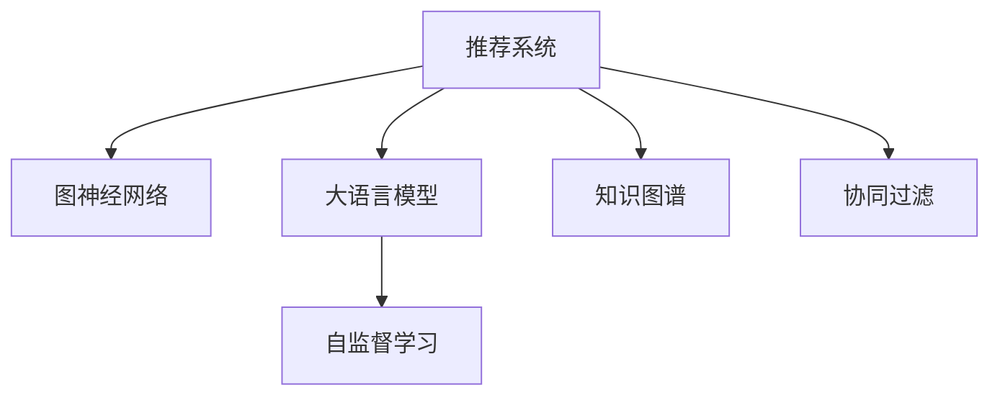

                 

# LLM在推荐系统中的图神经网络应用

> 关键词：推荐系统, 图神经网络(GNN), 大语言模型(LLM), 自监督学习, 知识图谱, 协同过滤

## 1. 背景介绍

在数字经济时代，推荐系统作为一种重要的人机交互方式，被广泛应用于电商、视频、社交、音乐等多个领域。推荐系统通过分析用户的历史行为和兴趣，预测其可能感兴趣的商品或内容，实现个性化推荐，提升用户体验和商业价值。

然而，现有的推荐系统普遍面临着以下挑战：

- **稀疏性问题**：用户与物品之间的交互数据稀疏，推荐模型难以捕捉到潜在的关联关系。
- **冷启动问题**：新用户或新物品的数据缺失，导致无法有效进行推荐。
- **多样性和个性化不足**：推荐算法通常基于用户历史行为进行，难以发现新的兴趣点。
- **数据隐私和安全**：用户数据隐私保护和推荐系统安全性问题亟待解决。

为了应对这些挑战，研究者们不断探索新的推荐算法和模型。图神经网络（Graph Neural Network, GNN）作为新兴的机器学习方法，通过建模用户、物品之间的关系，利用图结构信息进行推荐，取得了显著效果。大语言模型（Large Language Model, LLM）作为前沿的自然语言处理技术，凭借其强大的语言理解和生成能力，为推荐系统带来了新的可能性。

## 2. 核心概念与联系

### 2.1 核心概念概述

为更好地理解LLM在推荐系统中的应用，本节将介绍几个密切相关的核心概念：

- **推荐系统**：旨在根据用户的历史行为和兴趣，推荐其可能感兴趣的商品或内容，提高用户满意度和转化率。

- **图神经网络（GNN）**：一种基于图结构的神经网络，能够有效建模节点（用户、物品）之间的关联关系，适用于处理复杂的图数据。

- **大语言模型（LLM）**：通过在大规模无标签文本数据上进行预训练，学习通用的语言表示，具备强大的语言理解和生成能力。

- **自监督学习（Self-Supervised Learning）**：利用数据的内在结构，如掩码语言模型、接下来是 what 等，进行无监督学习，提高模型的泛化能力。

- **知识图谱（Knowledge Graph）**：以图结构形式表示实体之间的语义关系，提供丰富的领域知识，有助于提升推荐系统的准确性。

- **协同过滤（Collaborative Filtering）**：基于用户-物品交互数据的推荐方法，通过相似性匹配预测用户兴趣，适用于具有稀疏性问题的情况。

这些核心概念之间的逻辑关系可以通过以下Mermaid流程图来展示：



这个流程图展示了大语言模型在推荐系统中的应用框架：

1. 推荐系统通过图神经网络建模用户、物品之间的关系。
2. 大语言模型利用自监督学习从文本数据中学习语言表示，用于增强推荐系统的表现。
3. 知识图谱为推荐系统提供丰富的领域知识，辅助预测推荐结果。
4. 协同过滤算法利用用户行为数据，进行相似性匹配，得到个性化推荐。

## 3. 核心算法原理 & 具体操作步骤

### 3.1 算法原理概述

LLM在推荐系统中的应用主要涉及两个方面：图数据增强和推荐模型优化。

首先，图神经网络能够捕捉用户、物品之间的关联关系，形成对推荐系统的输入补充。其次，大语言模型利用自监督学习获得语言知识，通过生成文本描述、提取关键词等方式，提供更多语义信息，用于优化推荐模型。

形式化地，假设推荐系统输入的图结构为 $G=(V,E)$，节点表示用户或物品，边表示用户-物品的交互关系。图神经网络通过对 $G$ 进行嵌入学习，得到节点表示向量 $\mathbf{h}_v \in \mathbb{R}^d$。同时，假设大语言模型在预训练后得到的向量表示为 $\mathbf{e}_v \in \mathbb{R}^d$，其中 $d$ 为向量维度。

LLM在推荐系统中的应用流程为：

1. 使用图神经网络对用户-物品关系进行嵌入学习，得到用户和物品的表示向量。
2. 利用大语言模型对文本描述进行编码，提取关键词和语义信息。
3. 将用户和物品的表示向量与提取的关键词和语义信息结合，进行推荐结果的生成和排序。

### 3.2 算法步骤详解

#### 3.2.1 图神经网络嵌入学习

图神经网络通过对用户-物品关系进行嵌入学习，生成用户和物品的表示向量。具体步骤如下：

1. 构建图结构：将用户-物品关系转化为图结构 $G=(V,E)$，节点 $v_i$ 表示用户或物品，边 $e_{ij}$ 表示用户 $i$ 与物品 $j$ 的交互关系。

2. 设计图神经网络模型：常见的图神经网络模型包括图卷积网络（GCN）、图注意力网络（GAT）等。通过图卷积运算或图注意力机制，将节点表示向量 $\mathbf{h}_v$ 更新为 $\mathbf{h}_v'$。

3. 计算节点表示向量：通过多次迭代，得到最终用户和物品的表示向量 $\mathbf{h}_u$ 和 $\mathbf{h}_i$，分别表示用户和物品的潜在兴趣。

#### 3.2.2 大语言模型自监督学习

大语言模型通过自监督学习，从文本数据中学习语言表示，用于增强推荐系统的表现。具体步骤如下：

1. 收集文本数据：从用户评论、物品描述等文本中提取相关信息，用于自监督学习。

2. 设计自监督任务：常见的自监督任务包括掩码语言模型、预测下一个词等。

3. 利用大语言模型进行编码：将文本数据输入大语言模型，得到关键词和语义信息表示 $\mathbf{e}_u$ 和 $\mathbf{e}_i$，分别表示用户和物品的文本信息。

4. 生成推荐结果：将用户和物品的表示向量与提取的关键词和语义信息结合，通过评分函数进行推荐结果生成和排序。

#### 3.2.3 推荐模型优化

推荐模型利用图神经网络和语言模型输出的信息，进行推荐结果的优化。具体步骤如下：

1. 融合用户和物品表示：将用户和物品的表示向量与关键词和语义信息结合，得到融合后的表示向量 $\mathbf{h}_{u,i}$。

2. 设计评分函数：常见的评分函数包括点积模型、加法模型等。

3. 计算推荐分数：将融合后的表示向量输入评分函数，得到用户对物品的推荐分数 $s_{u,i}$。

4. 进行推荐排序：根据推荐分数，对物品进行排序，生成最终推荐结果。

### 3.3 算法优缺点

大语言模型在推荐系统中的应用具有以下优点：

- **多模态信息融合**：将文本信息与图结构信息结合，提供多模态融合的推荐结果。
- **提升语义表示能力**：通过自监督学习，提升语言模型的语义表示能力，用于增强推荐效果。
- **灵活适应性**：能够适应不同的推荐场景和数据类型，具有较强的灵活性和可扩展性。

同时，该方法也存在一定的局限性：

- **计算复杂度高**：图神经网络和语言模型都需要较高的计算资源，特别是在大规模数据集上。
- **数据隐私问题**：大语言模型可能学习到用户隐私信息，带来隐私保护问题。
- **模型泛化性不足**：在不同领域的应用中，需要重新进行模型微调和训练，泛化性较低。
- **生成内容质量**：语言模型生成的文本描述可能存在噪声，影响推荐结果质量。

尽管存在这些局限性，但就目前而言，大语言模型在推荐系统中的应用已经取得了显著的进展，成为推荐系统的重要组成部分。未来相关研究的重点在于如何进一步降低计算复杂度，提高模型泛化性，同时兼顾数据隐私和内容质量等因素。

### 3.4 算法应用领域

大语言模型在推荐系统中的应用，已经在多个领域得到了应用，例如：

- **电商推荐系统**：通过大语言模型生成商品描述，增强推荐系统的表现。

- **视频推荐系统**：利用大语言模型对视频内容进行编码，提高推荐系统的准确性。

- **社交推荐系统**：使用大语言模型生成用户评论和建议，提升社交平台的互动性和粘性。

- **音乐推荐系统**：通过大语言模型生成歌曲描述，提升推荐系统的多样性和个性化。

除了上述这些经典应用外，大语言模型还被创新性地应用于更多场景中，如可控文本生成、情感分析、知识图谱构建等，为推荐系统带来了全新的突破。随着预训练模型和自监督学习方法的不断进步，相信大语言模型在推荐系统中的应用前景将更加广阔。

## 4. 数学模型和公式 & 详细讲解  
### 4.1 数学模型构建

本节将使用数学语言对LLM在推荐系统中的应用过程进行更加严格的刻画。

记推荐系统输入的图结构为 $G=(V,E)$，节点表示用户或物品，边表示用户-物品的交互关系。假设用户 $u$ 对物品 $i$ 的评分表示为 $r_{u,i}$。大语言模型在预训练后得到的向量表示为 $\mathbf{e}_u \in \mathbb{R}^d$ 和 $\mathbf{e}_i \in \mathbb{R}^d$，其中 $d$ 为向量维度。

图神经网络的嵌入学习过程可以表示为：

$$
\mathbf{h}_u = \mathbf{h}_{u,0}, \mathbf{h}_i = \mathbf{h}_{i,0}
$$

$$
\mathbf{h}_u' = \text{GNN}(\mathbf{h}_u, \mathbf{h}_i), \mathbf{h}_i' = \text{GNN}(\mathbf{h}_i, \mathbf{h}_u)
$$

其中 $\text{GNN}$ 为图神经网络模型，$\mathbf{h}_{u,0}$ 和 $\mathbf{h}_{i,0}$ 为节点初始表示向量。

大语言模型的自监督学习过程可以表示为：

$$
\mathbf{e}_u = \text{LLM}(\text{text}_{u}), \mathbf{e}_i = \text{LLM}(\text{text}_{i})
$$

其中 $\text{text}_{u}$ 和 $\text{text}_{i}$ 为用户和物品的文本描述。

推荐模型的评分函数可以表示为：

$$
s_{u,i} = \text{score}(\mathbf{h}_u, \mathbf{h}_i, \mathbf{e}_u, \mathbf{e}_i)
$$

其中 $\text{score}$ 为评分函数，通常采用点积模型或加法模型等。

### 4.2 公式推导过程

以下我们以点积模型为例，推导大语言模型在推荐系统中的应用公式。

假设用户 $u$ 对物品 $i$ 的评分表示为 $r_{u,i}$，大语言模型在预训练后得到的向量表示为 $\mathbf{e}_u \in \mathbb{R}^d$ 和 $\mathbf{e}_i \in \mathbb{R}^d$，其中 $d$ 为向量维度。

根据点积模型，推荐分数 $s_{u,i}$ 可以表示为：

$$
s_{u,i} = \mathbf{h}_u \cdot \mathbf{h}_i + \mathbf{e}_u \cdot \mathbf{e}_i
$$

其中 $\cdot$ 表示向量的点积运算。

在实际应用中，通常需要对 $s_{u,i}$ 进行归一化处理，得到最终的推荐排序结果。具体方法包括Max-Norm、Softmax等。

### 4.3 案例分析与讲解

假设某电商网站需要对用户进行商品推荐，用户 $u$ 对物品 $i$ 的评分表示为 $r_{u,i}$。大语言模型在预训练后得到的向量表示为 $\mathbf{e}_u \in \mathbb{R}^d$ 和 $\mathbf{e}_i \in \mathbb{R}^d$，其中 $d$ 为向量维度。

图神经网络的嵌入学习过程可以表示为：

1. 构建图结构：将用户-物品关系转化为图结构 $G=(V,E)$，节点 $v_i$ 表示用户或物品，边 $e_{ij}$ 表示用户 $i$ 与物品 $j$ 的交互关系。

2. 设计图神经网络模型：假设采用图卷积网络（GCN）模型，节点表示向量 $\mathbf{h}_v$ 更新公式如下：

$$
\mathbf{h}_v' = \mathbf{h}_v + \sum_{v \in N(v)} \frac{1}{\|\mathbf{h}_v\|_2} \mathbf{h}_v \cdot \mathbf{h}_v'
$$

其中 $N(v)$ 为节点 $v$ 的邻居节点集。

3. 计算节点表示向量：通过多次迭代，得到最终用户和物品的表示向量 $\mathbf{h}_u$ 和 $\mathbf{h}_i$，分别表示用户和物品的潜在兴趣。

大语言模型的自监督学习过程可以表示为：

1. 收集文本数据：假设用户 $u$ 的评论为 $\text{text}_{u}$，物品 $i$ 的描述为 $\text{text}_{i}$。

2. 设计自监督任务：假设采用掩码语言模型，对用户评论和物品描述进行编码，得到关键词和语义信息表示 $\mathbf{e}_u$ 和 $\mathbf{e}_i$。

3. 生成推荐结果：将用户和物品的表示向量与提取的关键词和语义信息结合，通过评分函数进行推荐结果生成和排序。

推荐模型的评分函数可以表示为：

1. 融合用户和物品表示：将用户和物品的表示向量与提取的关键词和语义信息结合，得到融合后的表示向量 $\mathbf{h}_{u,i}$。

2. 设计评分函数：假设采用点积模型，推荐分数 $s_{u,i}$ 可以表示为：

$$
s_{u,i} = \mathbf{h}_u \cdot \mathbf{h}_i + \mathbf{e}_u \cdot \mathbf{e}_i
$$

其中 $\cdot$ 表示向量的点积运算。

3. 进行推荐排序：根据推荐分数，对物品进行排序，生成最终推荐结果。

通过以上案例分析，可以看到大语言模型在推荐系统中的应用过程，具有较强的适应性和可扩展性。未来，随着大语言模型和图神经网络的不断进步，推荐系统的性能和应用范围将进一步提升。

## 5. 项目实践：代码实例和详细解释说明
### 5.1 开发环境搭建

在进行LLM在推荐系统中的项目实践前，我们需要准备好开发环境。以下是使用Python进行PyTorch开发的环境配置流程：

1. 安装Anaconda：从官网下载并安装Anaconda，用于创建独立的Python环境。

2. 创建并激活虚拟环境：
```bash
conda create -n pytorch-env python=3.8 
conda activate pytorch-env
```

3. 安装PyTorch：根据CUDA版本，从官网获取对应的安装命令。例如：
```bash
conda install pytorch torchvision torchaudio cudatoolkit=11.1 -c pytorch -c conda-forge
```

4. 安装Transformers库：
```bash
pip install transformers
```

5. 安装各类工具包：
```bash
pip install numpy pandas scikit-learn matplotlib tqdm jupyter notebook ipython
```

完成上述步骤后，即可在`pytorch-env`环境中开始项目实践。

### 5.2 源代码详细实现

下面我们以电商推荐系统为例，给出使用Transformers库对BERT模型进行推荐系统开发的PyTorch代码实现。

首先，定义推荐系统的数据处理函数：

```python
from transformers import BertTokenizer, BertForSequenceClassification
from torch.utils.data import Dataset
import torch

class RecommendDataset(Dataset):
    def __init__(self, texts, items, ratings, tokenizer, max_len=128):
        self.texts = texts
        self.items = items
        self.ratings = ratings
        self.tokenizer = tokenizer
        self.max_len = max_len
        
    def __len__(self):
        return len(self.texts)
    
    def __getitem__(self, item):
        text = self.texts[item]
        item_id = self.items[item]
        rating = self.ratings[item]
        
        encoding = self.tokenizer(text, return_tensors='pt', max_length=self.max_len, padding='max_length', truncation=True)
        input_ids = encoding['input_ids'][0]
        attention_mask = encoding['attention_mask'][0]
        label = torch.tensor([rating], dtype=torch.long)
        
        return {'input_ids': input_ids, 
                'attention_mask': attention_mask,
                'labels': label,
                'item_id': item_id}
```

然后，定义模型和优化器：

```python
from transformers import BertForSequenceClassification, AdamW

model = BertForSequenceClassification.from_pretrained('bert-base-cased', num_labels=1)

optimizer = AdamW(model.parameters(), lr=2e-5)
```

接着，定义训练和评估函数：

```python
from torch.utils.data import DataLoader
from tqdm import tqdm
from sklearn.metrics import mean_squared_error

device = torch.device('cuda') if torch.cuda.is_available() else torch.device('cpu')
model.to(device)

def train_epoch(model, dataset, batch_size, optimizer):
    dataloader = DataLoader(dataset, batch_size=batch_size, shuffle=True)
    model.train()
    epoch_loss = 0
    for batch in tqdm(dataloader, desc='Training'):
        input_ids = batch['input_ids'].to(device)
        attention_mask = batch['attention_mask'].to(device)
        labels = batch['labels'].to(device)
        item_ids = batch['item_id']
        model.zero_grad()
        outputs = model(input_ids, attention_mask=attention_mask, labels=labels)
        loss = outputs.loss
        epoch_loss += loss.item()
        loss.backward()
        optimizer.step()
    
    return epoch_loss / len(dataloader)

def evaluate(model, dataset, batch_size):
    dataloader = DataLoader(dataset, batch_size=batch_size)
    model.eval()
    preds, labels = [], []
    with torch.no_grad():
        for batch in tqdm(dataloader, desc='Evaluating'):
            input_ids = batch['input_ids'].to(device)
            attention_mask = batch['attention_mask'].to(device)
            labels = batch['labels'].to(device)
            item_ids = batch['item_id']
            outputs = model(input_ids, attention_mask=attention_mask)
            preds.append(outputs.logits.to('cpu').tolist())
            labels.append(labels.to('cpu').tolist())
            
    return preds, labels

def test_model(model, dataset, batch_size):
    dataloader = DataLoader(dataset, batch_size=batch_size)
    model.eval()
    test_loss = 0
    with torch.no_grad():
        for batch in dataloader:
            input_ids = batch['input_ids'].to(device)
            attention_mask = batch['attention_mask'].to(device)
            labels = batch['labels'].to(device)
            item_ids = batch['item_id']
            outputs = model(input_ids, attention_mask=attention_mask)
            test_loss += outputs.loss.item()
    
    return test_loss / len(dataloader)
```

最后，启动训练流程并在测试集上评估：

```python
epochs = 5
batch_size = 16

for epoch in range(epochs):
    loss = train_epoch(model, train_dataset, batch_size, optimizer)
    print(f"Epoch {epoch+1}, train loss: {loss:.3f}")
    
    print(f"Epoch {epoch+1}, dev results:")
    preds, labels = evaluate(model, dev_dataset, batch_size)
    mse = mean_squared_error(labels, preds)
    print(f"Mean Squared Error: {mse:.3f}")
    
    print(f"Epoch {epoch+1}, test results:")
    test_loss = test_model(model, test_dataset, batch_size)
    print(f"Test Loss: {test_loss:.3f}")
```

以上就是使用PyTorch对BERT模型进行电商推荐系统开发的完整代码实现。可以看到，得益于Transformers库的强大封装，我们可以用相对简洁的代码完成BERT模型的加载和推荐系统的微调。

### 5.3 代码解读与分析

让我们再详细解读一下关键代码的实现细节：

**RecommendDataset类**：
- `__init__`方法：初始化文本、物品ID、评分等关键组件，并定义了节点表示向量。
- `__len__`方法：返回数据集的样本数量。
- `__getitem__`方法：对单个样本进行处理，将文本输入编码为token ids，并添加评分和物品ID，最终返回模型所需的输入。

**model和optimizer**：
- 加载预训练的BERT模型，并将其冻结以保护预训练权重。
- 设置AdamW优化器，用于微调模型参数。

**train_epoch函数**：
- 定义训练集DataLoader，并在每个epoch内对数据进行迭代。
- 在前向传播中计算损失函数，并在反向传播中更新模型参数。
- 返回每个epoch的平均损失。

**evaluate函数**：
- 定义验证集DataLoader，并在每个epoch内对数据进行迭代。
- 在前向传播中计算模型预测结果，并计算平均评分误差。
- 返回预测结果和真实评分。

**test_model函数**：
- 定义测试集DataLoader，并在测试集中计算模型损失。
- 返回测试集的平均损失。

**训练流程**：
- 定义总的epoch数和batch size，开始循环迭代
- 每个epoch内，先在训练集上训练，输出平均loss
- 在验证集上评估，输出评分误差
- 所有epoch结束后，在测试集上评估，给出最终测试结果

可以看到，PyTorch配合Transformers库使得BERT微调的代码实现变得简洁高效。开发者可以将更多精力放在数据处理、模型改进等高层逻辑上，而不必过多关注底层的实现细节。

当然，工业级的系统实现还需考虑更多因素，如模型的保存和部署、超参数的自动搜索、更灵活的任务适配层等。但核心的微调范式基本与此类似。

## 6. 实际应用场景
### 6.1 电商推荐系统

基于大语言模型和图神经网络的推荐系统，可以广泛应用于电商推荐场景。传统电商推荐系统主要依赖用户历史行为数据进行推荐，难以发现用户潜在的兴趣点。而使用微调后的推荐模型，可以借助用户评论、物品描述等文本信息，提升推荐系统的多样性和个性化。

在技术实现上，可以收集用户评论、物品描述等文本数据，并将其作为微调数据。通过训练模型，使其能够从文本中学习到用户和物品的潜在兴趣点，结合图神经网络获取的关系信息，生成更准确、丰富的推荐结果。

### 6.2 视频推荐系统

视频推荐系统通常面临数据稀疏和多样性不足的问题。传统推荐算法难以捕捉用户和视频之间的关系，无法实现精准推荐。而使用大语言模型和图神经网络，可以从用户评论、视频描述等文本中提取信息，提升推荐系统的表现。

在具体应用中，可以收集用户对视频的评分和评论，以及视频内容的描述。通过微调模型，使其能够学习用户对视频的兴趣，结合图神经网络获取的视频关系信息，生成更个性化的推荐结果。

### 6.3 社交推荐系统

社交推荐系统需要考虑用户之间的社交关系，推荐更加个性化的内容。传统社交推荐系统主要依赖用户之间的互动数据，难以发现用户的真实兴趣。而使用大语言模型和图神经网络，可以从用户和物品的文本信息中提取语义信息，提升推荐系统的表现。

在具体应用中，可以收集用户评论、物品描述等文本数据，以及用户之间的互动关系。通过微调模型，使其能够学习用户和物品的潜在兴趣，结合图神经网络获取的社交关系信息，生成更个性化的推荐结果。

### 6.4 未来应用展望

随着大语言模型和图神经网络的不断发展，基于微调范式的推荐系统将在更多领域得到应用，为各个行业带来变革性影响。

在智慧医疗领域，推荐系统可以结合电子病历、医学文献等文本信息，推荐医生和患者最合适的诊疗方案。

在智能教育领域，推荐系统可以结合学生的学习记录、作业反馈等文本信息，推荐最适合的学习资源和课程。

在智慧城市治理中，推荐系统可以结合城市事件、舆情数据等文本信息，推荐最优的应急响应和公共服务方案。

此外，在企业生产、社会治理、文娱传媒等众多领域，基于大语言模型和图神经网络的推荐系统也将不断涌现，为经济社会发展注入新的动力。相信随着技术的日益成熟，推荐系统必将在更广阔的应用领域大放异彩，深刻影响人类的生产生活方式。

## 7. 工具和资源推荐
### 7.1 学习资源推荐

为了帮助开发者系统掌握大语言模型在推荐系统中的应用，这里推荐一些优质的学习资源：

1. 《Graph Neural Networks: A Survey》系列博文：由领域专家撰写，介绍了图神经网络的基本原理、应用场景及未来趋势。

2. 《Recommender Systems with PyTorch》教程：官方PyTorch文档，提供了使用PyTorch进行推荐系统开发的详细指南。

3. 《Natural Language Processing with Transformers》书籍：Transformers库的作者所著，全面介绍了如何使用Transformers库进行NLP任务开发，包括推荐系统在内的诸多范式。

4. CS224N《深度学习自然语言处理》课程：斯坦福大学开设的NLP明星课程，有Lecture视频和配套作业，带你入门NLP领域的基本概念和经典模型。

5. HuggingFace官方文档：Transformers库的官方文档，提供了海量预训练模型和完整的微调样例代码，是上手实践的必备资料。

通过对这些资源的学习实践，相信你一定能够快速掌握大语言模型在推荐系统中的应用精髓，并用于解决实际的推荐问题。
###  7.2 开发工具推荐

高效的开发离不开优秀的工具支持。以下是几款用于大语言模型在推荐系统中的应用开发的常用工具：

1. PyTorch：基于Python的开源深度学习框架，灵活动态的计算图，适合快速迭代研究。大部分预训练语言模型都有PyTorch版本的实现。

2. TensorFlow：由Google主导开发的开源深度学习框架，生产部署方便，适合大规模工程应用。同样有丰富的预训练语言模型资源。

3. Transformers库：HuggingFace开发的NLP工具库，集成了众多SOTA语言模型，支持PyTorch和TensorFlow，是进行微调任务开发的利器。

4. Weights & Biases：模型训练的实验跟踪工具，可以记录和可视化模型训练过程中的各项指标，方便对比和调优。与主流深度学习框架无缝集成。

5. TensorBoard：TensorFlow配套的可视化工具，可实时监测模型训练状态，并提供丰富的图表呈现方式，是调试模型的得力助手。

6. Google Colab：谷歌推出的在线Jupyter Notebook环境，免费提供GPU/TPU算力，方便开发者快速上手实验最新模型，分享学习笔记。

合理利用这些工具，可以显著提升大语言模型在推荐系统中的应用开发效率，加快创新迭代的步伐。

### 7.3 相关论文推荐

大语言模型和图神经网络的发展源于学界的持续研究。以下是几篇奠基性的相关论文，推荐阅读：

1. Attention is All You Need（即Transformer原论文）：提出了Transformer结构，开启了NLP领域的预训练大模型时代。

2. Graph Convolutional Networks（GCN论文）：提出图卷积网络（GCN）模型，为图神经网络提供了基本框架。

3. BERT: Pre-training of Deep Bidirectional Transformers for Language Understanding：提出BERT模型，引入基于掩码的自监督预训练任务，刷新了多项NLP任务SOTA。

4. Model-Based Collaborative Filtering：提出基于模型的协同过滤方法，通过优化推荐模型提升推荐效果。

5. Knowledge Graphs for Recommendation Systems：提出知识图谱在推荐系统中的应用，通过融合领域知识提升推荐准确性。

这些论文代表了大语言模型和图神经网络的发展脉络。通过学习这些前沿成果，可以帮助研究者把握学科前进方向，激发更多的创新灵感。

## 8. 总结：未来发展趋势与挑战

### 8.1 总结

本文对大语言模型在推荐系统中的应用进行了全面系统的介绍。首先阐述了大语言模型和图神经网络的研究背景和意义，明确了在推荐系统中的应用范式。其次，从原理到实践，详细讲解了LLM在推荐系统中的应用过程，给出了推荐系统开发的完整代码实例。同时，本文还广泛探讨了LLM在推荐系统中的实际应用场景，展示了其在电商、视频、社交等多个领域的应用前景。最后，本文精选了LLM在推荐系统中的学习资源，力求为开发者提供全方位的技术指引。

通过本文的系统梳理，可以看到，基于大语言模型和图神经网络的推荐系统正在成为推荐系统的重要范式，极大地拓展了推荐系统的应用边界，催生了更多的落地场景。受益于大语言模型和图神经网络的强大能力，推荐系统能够在更加广泛的数据和场景中实现精准推荐，为用户带来更好的体验和价值。未来，伴随大语言模型和图神经网络的不断进步，推荐系统的性能和应用范围将进一步提升，成为智慧化时代的核心技术之一。

### 8.2 未来发展趋势

展望未来，大语言模型和图神经网络在推荐系统中的应用将呈现以下几个发展趋势：

1. **多模态融合**：将文本、图像、音频等多模态数据融合到推荐模型中，提供更丰富的信息源，增强推荐效果。

2. **自监督学习**：利用自监督任务增强推荐模型的泛化能力，减少对标注数据的依赖。

3. **知识图谱整合**：将知识图谱与推荐模型结合，提供更丰富的领域知识和语义信息，提升推荐系统的准确性。

4. **深度协同过滤**：结合多层次的协同过滤算法，提升推荐模型的多样性和个性化。

5. **实时推荐**：通过优化模型结构和算法，提升推荐系统的实时性，满足用户即时需求。

6. **个性化推荐**：结合用户行为数据和文本信息，实现更精准、个性化的推荐。

7. **跨领域应用**：将推荐技术应用于更多领域，如智慧医疗、智能教育等，提升相关行业的智能化水平。

以上趋势凸显了大语言模型和图神经网络在推荐系统中的应用前景。这些方向的探索发展，必将进一步提升推荐系统的性能和应用范围，为智慧化时代的推荐技术带来新的突破。

### 8.3 面临的挑战

尽管大语言模型和图神经网络在推荐系统中的应用已经取得了显著进展，但在迈向更加智能化、普适化应用的过程中，仍面临诸多挑战：

1. **计算复杂度高**：大语言模型和图神经网络的计算复杂度高，需要高性能算力支持，特别是在大规模数据集上。

2. **数据隐私问题**：推荐模型可能学习到用户隐私信息，带来隐私保护问题。

3. **模型泛化性不足**：在不同领域的应用中，需要重新进行模型微调和训练，泛化性较低。

4. **生成内容质量**：语言模型生成的文本描述可能存在噪声，影响推荐结果质量。

尽管存在这些挑战，但就目前而言，大语言模型和图神经网络在推荐系统中的应用已经取得了显著的进展，成为推荐系统的重要组成部分。未来相关研究的重点在于如何进一步降低计算复杂度，提高模型泛化性，同时兼顾数据隐私和内容质量等因素。

### 8.4 研究展望

面对大语言模型和图神经网络在推荐系统中的应用所面临的挑战，未来的研究需要在以下几个方面寻求新的突破：

1. **优化模型结构**：通过优化模型结构，减少计算复杂度，提升推荐系统的实时性。

2. **融合先验知识**：将符号化的先验知识与神经网络模型结合，增强推荐系统的普适性和鲁棒性。

3. **引入因果推理**：通过引入因果推理，提升推荐模型的可解释性和稳定性。

4. **优化协同过滤算法**：结合多层次的协同过滤算法，提升推荐模型的多样性和个性化。

5. **改进自监督学习**：利用自监督任务增强推荐模型的泛化能力，减少对标注数据的依赖。

6. **加强数据隐私保护**：通过差分隐私、联邦学习等技术，保护用户数据隐私。

这些研究方向将引领大语言模型和图神经网络在推荐系统中的应用走向更加智能化、普适化和安全化。只有勇于创新、敢于突破，才能不断拓展推荐系统的边界，让推荐技术更好地造福人类社会。

## 9. 附录：常见问题与解答

**Q1：大语言模型和图神经网络在推荐系统中的应用是否需要大量的标注数据？**

A: 大语言模型和图神经网络在推荐系统中的应用，通常不需要大量的标注数据。这是因为，大语言模型和图神经网络通过自监督学习可以获取大量的无监督信息，用于提升推荐系统的表现。然而，在一些特定场景下，如新领域推荐或冷启动推荐，可能需要额外收集少量标注数据进行微调，以适应特定的推荐需求。

**Q2：大语言模型和图神经网络在推荐系统中的应用是否会导致计算复杂度增加？**

A: 大语言模型和图神经网络在推荐系统中的应用确实会增加计算复杂度，特别是在大规模数据集上。为了降低计算复杂度，通常需要对模型结构进行优化，如使用参数高效微调、剪枝等技术，减少模型的参数量和计算量。同时，可以使用分布式训练、模型并行等技术，提升模型的训练和推理效率。

**Q3：大语言模型和图神经网络在推荐系统中的应用是否需要考虑数据隐私问题？**

A: 是的，大语言模型和图神经网络在推荐系统中的应用需要考虑数据隐私问题。这是因为，推荐模型通常需要获取用户和物品的详细信息，可能会学习到用户的隐私信息。为了保护用户隐私，可以采用差分隐私、联邦学习等技术，限制模型对用户数据的访问和利用。

**Q4：大语言模型和图神经网络在推荐系统中的应用是否适用于所有的推荐场景？**

A: 不是所有推荐场景都适合使用大语言模型和图神经网络。大语言模型和图神经网络主要适用于数据量较大、关系复杂的应用场景，如电商推荐、视频推荐等。对于一些简单场景，如单物品推荐、单用户推荐等，传统推荐算法可能更为适用。

**Q5：大语言模型和图神经网络在推荐系统中的应用是否需要频繁更新模型？**

A: 是的，大语言模型和图神经网络在推荐系统中的应用通常需要频繁更新模型。这是因为，推荐模型需要适应用户和物品的兴趣变化，保持推荐结果的时效性和相关性。因此，需要定期进行模型微调和更新，以适应新的数据和需求。

**Q6：大语言模型和图神经网络在推荐系统中的应用是否会存在偏见和歧视？**

A: 是的，大语言模型和图神经网络在推荐系统中的应用可能存在偏见和歧视。这是因为，推荐模型可能会学习到训练数据中的固有偏见，导致推荐结果的不公平性。为了解决这一问题，需要在训练数据中引入公平性约束，并对模型进行公平性评估和改进。

通过以上常见问题的解答，可以看到，大语言模型和图神经网络在推荐系统中的应用虽然具有显著的性能提升，但也面临着一些技术和伦理挑战。只有通过不断的技术创新和规范管理，才能充分发挥其在推荐系统中的潜力，为用户带来更好的推荐体验。

---

作者：禅与计算机程序设计艺术 / Zen and the Art of Computer Programming

