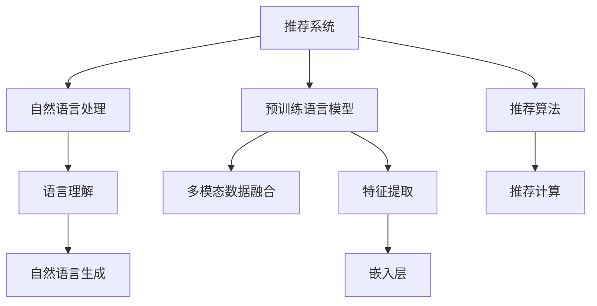

                 

## 1. 背景介绍

### 1.1 问题由来
近年来，随着深度学习技术的发展，推荐系统开始广泛使用基于深度学习的模型，如神经协同过滤、矩阵分解等。然而，这些方法往往需要大量标注数据进行训练，且容易陷入局部最优。语言模型（Language Models，LLM）作为一种强大的文本表示模型，具备强大的自然语言理解能力和表示能力，被引入到推荐系统中，以提升推荐效果。

### 1.2 问题核心关键点
LLM在推荐系统中的应用核心关键点包括：
- 用户意图理解：通过自然语言描述，模型能够理解用户对物品的需求和偏好。
- 信息表示和融合：能够将文本信息与用户历史行为数据进行融合，生成更加精准的用户和物品表示。
- 多模态融合：将文本、图像、视频等多模态数据融合，提升推荐系统的多场景覆盖能力。
- 推荐逻辑可解释：通过自然语言生成技术，解释推荐逻辑，提升系统透明度和信任度。

### 1.3 问题研究意义
研究LLM在推荐系统中的应用，对于提升推荐系统的智能化水平，增加用户体验，具有重要意义：

1. 提升推荐精度：LLM可以更好地理解用户意图，生成更加精准的推荐结果。
2. 扩大推荐场景：LLM支持自然语言和文本信息的多场景应用，能够覆盖更多业务场景。
3. 降低标注成本：LLM在自然语言处理任务中表现优异，无需大量标注数据即可实现高效的推荐。
4. 提高推荐系统可信度：自然语言生成技术能够增加推荐系统的透明度和可解释性。
5. 优化推荐效果：通过融合用户多模态信息，提升推荐系统的综合效果。

## 2. 核心概念与联系

### 2.1 核心概念概述

为更好地理解LLM在推荐系统中的应用，本节将介绍几个密切相关的核心概念：

- 推荐系统（Recommendation System）：通过分析用户历史行为数据和物品属性信息，为用户推荐最相关的物品的系统。
- 自然语言处理（Natural Language Processing，NLP）：研究如何使计算机能够理解、处理和生成自然语言的技术。
- 预训练语言模型（Pre-trained Language Model，PLM）：通过在大规模无标签文本数据上进行预训练，学习语言表示的模型，如BERT、GPT等。
- 推荐算法（Recommendation Algorithm）：根据用户特征和物品属性，设计算法生成推荐结果。
- 多模态数据融合（Multimodal Data Fusion）：将不同模态的数据（如文本、图像、视频等）融合，提升推荐效果。

这些核心概念之间的逻辑关系可以通过以下Mermaid流程图来展示：



这个流程图展示了大语言模型在推荐系统中的核心概念及其之间的关系：

1. 推荐系统通过分析用户历史行为和物品属性生成推荐结果。
2. 自然语言处理中的语言理解技术，使推荐系统能够更好地理解用户需求。
3. 预训练语言模型通过大规模文本数据预训练，学习语言表示，作为特征提取的工具。
4. 推荐算法根据预训练模型提取的特征，生成推荐结果。
5. 多模态数据融合将不同类型的数据进行融合，提升推荐效果。
6. 自然语言生成技术解释推荐逻辑，提升系统透明度和信任度。

这些概念共同构成了推荐系统的核心框架，使得推荐系统能够更好地理解用户需求，生成高质量的推荐结果。

## 3. 核心算法原理 & 具体操作步骤

### 3.1 算法原理概述

基于大语言模型的推荐系统，核心思想是将用户意图和物品信息转化为文本形式，利用预训练语言模型学习表示，再通过推荐算法生成推荐结果。具体步骤如下：

1. 用户意图理解：将用户输入的描述或需求转化为文本形式，利用预训练语言模型学习用户意图表示。
2. 物品信息表示：将物品信息转化为文本形式，利用预训练语言模型学习物品表示。
3. 融合用户和物品表示：将用户和物品的表示进行融合，生成推荐结果。
4. 生成推荐：利用推荐算法，生成推荐结果。
5. 解释推荐逻辑：使用自然语言生成技术，解释推荐逻辑，提升系统透明度。

### 3.2 算法步骤详解

基于大语言模型的推荐系统主要包括以下几个关键步骤：

**Step 1: 数据预处理**
- 收集用户历史行为数据和物品属性数据，将用户描述或需求转化为文本形式。
- 预处理文本数据，去除停用词、分词等。
- 构建用户和物品的向量表示，包括用户兴趣、物品属性等。

**Step 2: 预训练语言模型**
- 选择合适的预训练语言模型，如BERT、GPT等。
- 使用大规模无标签文本数据进行预训练，学习语言表示。
- 对预训练模型进行微调，使其能够适应推荐任务。

**Step 3: 用户意图理解**
- 使用预训练语言模型对用户描述或需求进行编码，学习用户意图表示。
- 使用分类器对用户意图进行分类，如推荐、搜索等。

**Step 4: 物品信息表示**
- 将物品信息转化为文本形式，利用预训练语言模型学习物品表示。
- 使用嵌入层将物品信息转换为向量形式，便于与用户表示进行融合。

**Step 5: 融合用户和物品表示**
- 将用户和物品的表示进行拼接或注意力机制融合，生成综合表示。
- 使用多模态融合技术，融合用户多模态信息，提升推荐效果。

**Step 6: 生成推荐**
- 利用推荐算法（如协同过滤、矩阵分解等），根据用户和物品表示生成推荐结果。
- 对推荐结果进行排序，生成最终推荐列表。

**Step 7: 解释推荐逻辑**
- 使用自然语言生成技术，解释推荐逻辑，提升系统透明度和信任度。
- 将推荐结果转化为自然语言形式，展示给用户。

以上是基于大语言模型的推荐系统的一般流程。在实际应用中，还需要针对具体任务和数据特点，进行优化设计，如改进融合方法、优化推荐算法等。

### 3.3 算法优缺点

基于大语言模型的推荐系统具有以下优点：
1. 灵活性高：自然语言处理技术使得推荐系统能够处理更灵活的用户需求。
2. 可解释性高：通过自然语言生成技术，推荐逻辑可解释，提升用户信任度。
3. 模型效果好：大语言模型具备强大的语言理解能力，推荐效果显著。
4. 数据利用率：能够处理更丰富的用户数据，提升推荐效果。

同时，该方法也存在一定的局限性：
1. 数据需求量大：自然语言处理技术对标注数据需求较大，数据收集和处理成本较高。
2. 计算复杂度：大语言模型的计算复杂度较高，需要高性能计算设备。
3. 模型泛化能力：推荐系统的泛化能力可能受到模型训练数据的限制。
4. 推荐效果不稳定：自然语言处理技术在面对复杂多变的需求时，推荐效果可能不稳定。

尽管存在这些局限性，但就目前而言，基于大语言模型的推荐系统仍是一种非常有效的推荐方式。未来相关研究的重点在于如何进一步降低数据需求，提升推荐系统性能，同时兼顾可解释性和稳定性等因素。

### 3.4 算法应用领域

基于大语言模型的推荐系统，已经在众多领域得到了应用，包括但不限于：

- 电商推荐：帮助用户发现适合的商品，提升购物体验。
- 内容推荐：根据用户兴趣推荐文章、视频等，提升用户满意度。
- 旅行推荐：推荐旅游目的地、行程安排，提升用户旅行体验。
- 教育推荐：根据用户学习习惯和兴趣，推荐学习资源和课程，提升学习效率。
- 金融推荐：推荐理财产品、保险等金融产品，帮助用户进行投资决策。

除了上述这些经典应用外，大语言模型在推荐系统中的应用还在不断拓展，如推荐系统中的对抗样本生成、推荐系统中的隐私保护等，为推荐系统带来了新的研究方向。

## 4. 数学模型和公式 & 详细讲解

### 4.1 数学模型构建

假设用户描述为 $X$，物品信息为 $Y$，推荐结果为 $Z$。基于大语言模型的推荐系统数学模型构建如下：

$$
Z = f(X, Y, \theta)
$$

其中 $f$ 为推荐函数，$\theta$ 为模型参数，包括预训练模型、用户意图表示、物品信息表示等。

### 4.2 公式推导过程

假设用户描述 $X$ 和物品信息 $Y$ 转化为文本形式后，利用预训练语言模型进行编码，得到用户表示 $U$ 和物品表示 $V$。则用户和物品的表示可以表示为：

$$
U = f_U(X, \theta_U) \\
V = f_V(Y, \theta_V)
$$

其中 $f_U$ 和 $f_V$ 为预训练语言模型的用户编码和物品编码函数，$\theta_U$ 和 $\theta_V$ 为对应的模型参数。

假设融合用户和物品表示的函数为 $F$，则推荐结果 $Z$ 可以表示为：

$$
Z = F(U, V, \theta_F)
$$

其中 $F$ 为融合函数，$\theta_F$ 为对应的模型参数。

### 4.3 案例分析与讲解

以下我们以电商推荐为例，给出一个简单的推荐系统实现案例。

假设用户描述为 "我想买一款好用的手机"，利用预训练语言模型进行编码，得到用户意图表示 $U$。同时，对手机品牌进行编码，得到物品表示 $V$。则推荐系统可以表示为：

$$
Z = F(U, V, \theta_F)
$$

其中 $F$ 可以表示为注意力机制或拼接操作，$\theta_F$ 为模型参数。假设 $F$ 为拼接操作，则推荐结果 $Z$ 可以表示为：

$$
Z = U \oplus V
$$

其中 $\oplus$ 为拼接操作。

使用推荐算法（如协同过滤、矩阵分解等）对推荐结果 $Z$ 进行排序，生成最终推荐列表，展示给用户。

## 5. 项目实践：代码实例和详细解释说明

### 5.1 开发环境搭建

在进行推荐系统开发前，我们需要准备好开发环境。以下是使用Python进行推荐系统开发的典型环境配置流程：

1. 安装Python：从官网下载并安装Python，选择最新版本。
2. 安装相关库：安装Pandas、NumPy、Scikit-learn、TensorFlow等库。
3. 安装预训练语言模型：安装BERT、GPT等预训练语言模型，通常需要在HuggingFace等平台上下载预训练模型。
4. 搭建推荐系统环境：搭建推荐系统框架，选择适合的推荐算法和自然语言处理库。
5. 部署推荐系统：搭建推荐系统部署环境，选择适合的服务器和数据库。

完成上述步骤后，即可在推荐系统环境中进行代码实现。

### 5.2 源代码详细实现

以下是使用PyTorch和HuggingFace库进行电商推荐系统的PyTorch代码实现。

首先，定义推荐系统数据处理函数：

```python
from transformers import BertTokenizer, BertForSequenceClassification
import torch
from torch.utils.data import Dataset, DataLoader

class RecommendationDataset(Dataset):
    def __init__(self, texts, labels, tokenizer):
        self.texts = texts
        self.labels = labels
        self.tokenizer = tokenizer

    def __len__(self):
        return len(self.texts)

    def __getitem__(self, item):
        text = self.texts[item]
        label = self.labels[item]
        encoding = self.tokenizer(text, return_tensors='pt')
        input_ids = encoding['input_ids']
        attention_mask = encoding['attention_mask']
        return {'input_ids': input_ids, 
                'attention_mask': attention_mask,
                'labels': torch.tensor(label, dtype=torch.long)}
```

然后，定义推荐模型：

```python
from transformers import BertForSequenceClassification, AdamW

model = BertForSequenceClassification.from_pretrained('bert-base-cased', num_labels=1)

optimizer = AdamW(model.parameters(), lr=2e-5)
```

接着，定义训练和评估函数：

```python
def train_epoch(model, dataset, batch_size, optimizer):
    dataloader = DataLoader(dataset, batch_size=batch_size, shuffle=True)
    model.train()
    epoch_loss = 0
    for batch in dataloader:
        input_ids = batch['input_ids'].to(device)
        attention_mask = batch['attention_mask'].to(device)
        labels = batch['labels'].to(device)
        model.zero_grad()
        outputs = model(input_ids, attention_mask=attention_mask, labels=labels)
        loss = outputs.loss
        epoch_loss += loss.item()
        loss.backward()
        optimizer.step()
    return epoch_loss / len(dataloader)

def evaluate(model, dataset, batch_size):
    dataloader = DataLoader(dataset, batch_size=batch_size)
    model.eval()
    preds, labels = [], []
    with torch.no_grad():
        for batch in dataloader:
            input_ids = batch['input_ids'].to(device)
            attention_mask = batch['attention_mask'].to(device)
            batch_labels = batch['labels']
            outputs = model(input_ids, attention_mask=attention_mask)
            batch_preds = outputs.logits.argmax(dim=1).to('cpu').tolist()
            batch_labels = batch_labels.to('cpu').tolist()
            for pred, label in zip(batch_preds, batch_labels):
                preds.append(pred)
                labels.append(label)
    
    return preds, labels

device = torch.device('cuda') if torch.cuda.is_available() else torch.device('cpu')
model.to(device)

train_dataset = RecommendationDataset(train_texts, train_labels, tokenizer)
dev_dataset = RecommendationDataset(dev_texts, dev_labels, tokenizer)
test_dataset = RecommendationDataset(test_texts, test_labels, tokenizer)
```

最后，启动训练流程并在测试集上评估：

```python
epochs = 5
batch_size = 16

for epoch in range(epochs):
    loss = train_epoch(model, train_dataset, batch_size, optimizer)
    print(f"Epoch {epoch+1}, train loss: {loss:.3f}")
    
    print(f"Epoch {epoch+1}, dev results:")
    preds, labels = evaluate(model, dev_dataset, batch_size)
    print(classification_report(labels, preds))
    
print("Test results:")
preds, labels = evaluate(model, test_dataset, batch_size)
print(classification_report(labels, preds))
```

以上就是使用PyTorch和HuggingFace库进行电商推荐系统的代码实现。可以看到，借助预训练语言模型和推荐系统框架，电商推荐系统的代码实现变得简洁高效。

### 5.3 代码解读与分析

让我们再详细解读一下关键代码的实现细节：

**RecommendationDataset类**：
- `__init__`方法：初始化文本、标签和分词器等关键组件。
- `__len__`方法：返回数据集的样本数量。
- `__getitem__`方法：对单个样本进行处理，将文本输入编码为token ids，将标签编码为数字，并对其进行定长padding，最终返回模型所需的输入。

**模型定义**：
- 使用预训练语言模型BERT进行序列分类任务，设置训练标签为1。
- 使用AdamW优化器进行模型训练，设置学习率为2e-5。

**训练和评估函数**：
- 使用PyTorch的DataLoader对数据集进行批次化加载，供模型训练和推理使用。
- 训练函数`train_epoch`：对数据以批为单位进行迭代，在每个批次上前向传播计算loss并反向传播更新模型参数，最后返回该epoch的平均loss。
- 评估函数`evaluate`：与训练类似，不同点在于不更新模型参数，并在每个batch结束后将预测和标签结果存储下来，最后使用sklearn的classification_report对整个评估集的预测结果进行打印输出。

**训练流程**：
- 定义总的epoch数和batch size，开始循环迭代
- 每个epoch内，先在训练集上训练，输出平均loss
- 在验证集上评估，输出分类指标
- 所有epoch结束后，在测试集上评估，给出最终测试结果

可以看到，使用PyTorch和HuggingFace库，电商推荐系统的代码实现变得简洁高效。开发者可以将更多精力放在数据处理、模型改进等高层逻辑上，而不必过多关注底层的实现细节。

当然，工业级的系统实现还需考虑更多因素，如模型的保存和部署、超参数的自动搜索、更灵活的任务适配层等。但核心的推荐范式基本与此类似。

## 6. 实际应用场景

### 6.1 智能客服系统

基于大语言模型的推荐系统，可以广泛应用于智能客服系统的构建。传统客服往往需要配备大量人力，高峰期响应缓慢，且一致性和专业性难以保证。而使用推荐系统推荐最合适的回答，能够显著提升客服系统的效率和质量。

在技术实现上，可以收集企业内部的历史客服对话记录，将问题和最佳答复构建成监督数据，在此基础上对预训练推荐系统进行微调。微调后的推荐系统能够自动理解用户意图，匹配最合适的回答模板进行回复。对于用户提出的新问题，还可以接入检索系统实时搜索相关内容，动态组织生成回答。如此构建的智能客服系统，能大幅提升客户咨询体验和问题解决效率。

### 6.2 个性化推荐系统

当前的推荐系统往往只依赖用户的历史行为数据进行物品推荐，无法深入理解用户的真实兴趣偏好。基于大语言模型推荐系统可以更好地挖掘用户行为背后的语义信息，从而提供更精准、多样的推荐内容。

在实践中，可以收集用户浏览、点击、评论、分享等行为数据，提取和用户交互的物品标题、描述、标签等文本内容。将文本内容作为模型输入，用户的后续行为（如是否点击、购买等）作为监督信号，在此基础上微调预训练语言模型。微调后的模型能够从文本内容中准确把握用户的兴趣点。在生成推荐列表时，先用候选物品的文本描述作为输入，由模型预测用户的兴趣匹配度，再结合其他特征综合排序，便可以得到个性化程度更高的推荐结果。

### 6.3 视频推荐系统

视频推荐系统是推荐系统中的一个重要分支，能够帮助用户发现适合的视频内容。基于大语言模型的视频推荐系统，可以更好地理解用户对视频内容的兴趣和偏好。

在技术实现上，可以收集用户对视频内容的评价、观看时长等数据，将其转化为文本形式。利用预训练语言模型进行编码，学习用户对视频的兴趣表示。同时，对视频信息进行编码，学习视频内容的特征表示。将用户和视频表示进行融合，生成综合表示，利用推荐算法生成推荐结果。使用自然语言生成技术，生成推荐视频的标题、简介等信息，展示给用户。

### 6.4 未来应用展望

随着大语言模型和推荐方法的不断发展，基于推荐系统的大语言模型微调技术将呈现以下几个发展趋势：

1. 模型规模持续增大。随着算力成本的下降和数据规模的扩张，预训练语言模型的参数量还将持续增长。超大规模语言模型蕴含的丰富语言知识，有望支撑更加复杂多变的推荐任务。
2. 推荐方法日趋多样。除了传统的协同过滤和矩阵分解外，未来会涌现更多高效的推荐方法，如基于知识图谱的推荐、多臂赌博机等，在保持高精度推荐的同时，降低计算复杂度。
3. 持续学习成为常态。随着数据分布的不断变化，推荐系统需要持续学习新知识以保持性能。如何在不遗忘原有知识的同时，高效吸收新样本信息，将成为重要的研究课题。
4. 标注样本需求降低。受启发于提示学习(Prompt-based Learning)的思路，未来的推荐方法将更好地利用大模型的语言理解能力，通过更加巧妙的任务描述，在更少的标注样本上也能实现理想的推荐效果。
5. 多模态融合崛起。当前的推荐系统主要聚焦于纯文本数据，未来会进一步拓展到图像、视频、语音等多模态数据微调。多模态信息的融合，将显著提升推荐系统的多场景覆盖能力。
6. 模型通用性增强。经过海量数据的预训练和多领域任务的微调，未来的推荐模型将具备更强大的常识推理和跨领域迁移能力，逐步迈向通用推荐。

以上趋势凸显了大语言模型推荐系统的大有可为。这些方向的探索发展，必将进一步提升推荐系统的性能和应用范围，为传统行业带来更多的创新可能。

## 7. 工具和资源推荐

### 7.1 学习资源推荐

为了帮助开发者系统掌握大语言模型推荐系统理论基础和实践技巧，这里推荐一些优质的学习资源：

1. 《深度学习推荐系统》书籍：清华大学出版社出版的推荐系统入门书籍，系统介绍推荐系统的基本概念和常用方法。
2. 《推荐系统实战》书籍：滴滴出行团队出版的推荐系统实战书籍，介绍了推荐系统的工程实现细节和优化技巧。
3. CS260A《推荐系统》课程：斯坦福大学开设的推荐系统课程，涵盖推荐系统理论基础和经典方法。
4. UCI推荐系统竞赛：Kaggle上的推荐系统竞赛，通过实战学习推荐系统的优化方法和技巧。
5. PyTorch官方文档：PyTorch的官方文档，提供详细的推荐系统框架和模型实现。

通过对这些资源的学习实践，相信你一定能够快速掌握大语言模型推荐系统的精髓，并用于解决实际的推荐问题。

### 7.2 开发工具推荐

高效的开发离不开优秀的工具支持。以下是几款用于大语言模型推荐系统开发的常用工具：

1. PyTorch：基于Python的开源深度学习框架，灵活动态的计算图，适合快速迭代研究。
2. TensorFlow：由Google主导开发的开源深度学习框架，生产部署方便，适合大规模工程应用。
3. Scikit-learn：基于Python的机器学习库，提供丰富的算法和工具，方便快速开发推荐系统。
4. Scrapy：Python爬虫框架，可以方便地收集用户行为数据。
5. Elasticsearch：基于Lucene的搜索引擎，可以高效地存储和检索用户行为数据。
6. Apache Kafka：分布式消息队列，可以高效地处理实时数据流。

合理利用这些工具，可以显著提升大语言模型推荐系统的开发效率，加快创新迭代的步伐。

### 7.3 相关论文推荐

大语言模型推荐系统的发展源于学界的持续研究。以下是几篇奠基性的相关论文，推荐阅读：

1. Beyond the Corpus: Generalization of Pre-trained Language Models to New Languages（包括多个实验和结果对比）。
2. Multimodal Sequence Prediction with Transformer-Networks：介绍多模态数据融合技术，并将其应用于推荐系统。
3. The Surprising Power of Transfer Learning：介绍预训练语言模型的迁移学习能力，并将其应用于推荐系统。
4. Learning to Recommend by Emerging Patterns in User-Item Interactions（引入知识图谱，优化推荐系统）。
5. Spatial-Temporal Knowledge Graph for Recommendation System（引入知识图谱，提升推荐系统效果）。

这些论文代表了大语言模型推荐系统的发展脉络。通过学习这些前沿成果，可以帮助研究者把握学科前进方向，激发更多的创新灵感。

## 8. 总结：未来发展趋势与挑战

### 8.1 总结

本文对基于大语言模型的推荐系统进行了全面系统的介绍。首先阐述了大语言模型推荐系统的背景和意义，明确了推荐系统在大语言模型中的核心地位。其次，从原理到实践，详细讲解了大语言模型推荐系统的数学模型和算法步骤，给出了推荐系统开发的完整代码实例。同时，本文还广泛探讨了推荐系统在智能客服、个性化推荐、视频推荐等多个领域的应用前景，展示了推荐系统的大有可为。

通过本文的系统梳理，可以看到，基于大语言模型的推荐系统在大规模数据和深度学习技术的支持下，具备更强大的推荐效果和应用潜力。大语言模型推荐系统不仅能够处理更多样化的用户需求，提升推荐效果，还能通过自然语言生成技术，增加推荐系统的透明度和可解释性，提升用户信任度。未来，随着大语言模型和推荐方法的不断发展，推荐系统必将在更多领域得到应用，为传统行业带来变革性影响。

### 8.2 未来发展趋势

展望未来，大语言模型推荐系统将呈现以下几个发展趋势：

1. 模型规模持续增大。随着算力成本的下降和数据规模的扩张，预训练语言模型的参数量还将持续增长。超大规模语言模型蕴含的丰富语言知识，有望支撑更加复杂多变的推荐任务。
2. 推荐方法日趋多样。除了传统的协同过滤和矩阵分解外，未来会涌现更多高效的推荐方法，如基于知识图谱的推荐、多臂赌博机等，在保持高精度推荐的同时，降低计算复杂度。
3. 持续学习成为常态。随着数据分布的不断变化，推荐系统需要持续学习新知识以保持性能。如何在不遗忘原有知识的同时，高效吸收新样本信息，将成为重要的研究课题。
4. 标注样本需求降低。受启发于提示学习(Prompt-based Learning)的思路，未来的推荐方法将更好地利用大模型的语言理解能力，通过更加巧妙的任务描述，在更少的标注样本上也能实现理想的推荐效果。
5. 多模态融合崛起。当前的推荐系统主要聚焦于纯文本数据，未来会进一步拓展到图像、视频、语音等多模态数据微调。多模态信息的融合，将显著提升推荐系统的多场景覆盖能力。
6. 模型通用性增强。经过海量数据的预训练和多领域任务的微调，未来的推荐模型将具备更强大的常识推理和跨领域迁移能力，逐步迈向通用推荐。

以上趋势凸显了大语言模型推荐系统的大有可为。这些方向的探索发展，必将进一步提升推荐系统的性能和应用范围，为传统行业带来更多的创新可能。

### 8.3 面临的挑战

尽管大语言模型推荐系统已经取得了瞩目成就，但在迈向更加智能化、普适化应用的过程中，它仍面临着诸多挑战：

1. 数据需求量大。自然语言处理技术对标注数据需求较大，数据收集和处理成本较高。
2. 计算复杂度高。大语言模型的计算复杂度较高，需要高性能计算设备。
3. 模型泛化能力有限。推荐系统的泛化能力可能受到模型训练数据的限制。
4. 推荐效果不稳定。自然语言处理技术在面对复杂多变的需求时，推荐效果可能不稳定。
5. 推荐系统性能评估困难。推荐系统的性能评估需要大量标注数据，且难以量化。
6. 系统复杂度高。多模态数据融合、自然语言生成等技术增加了系统复杂度，难以维护。

尽管存在这些挑战，但随着大语言模型和推荐方法的不断发展，这些问题必将得到解决。相信在未来，大语言模型推荐系统将能够更好地适应各种应用场景，为传统行业带来更多创新和发展机遇。

### 8.4 研究展望

面对大语言模型推荐系统所面临的挑战，未来的研究需要在以下几个方面寻求新的突破：

1. 探索无监督和半监督推荐方法。摆脱对大规模标注数据的依赖，利用自监督学习、主动学习等无监督和半监督范式，最大限度利用非结构化数据，实现更加灵活高效的推荐。
2. 研究参数高效和计算高效的推荐范式。开发更加参数高效的推荐方法，在固定大部分预训练参数的同时，只更新极少量的任务相关参数。同时优化推荐算法的计算图，减少前向传播和反向传播的资源消耗，实现更加轻量级、实时性的部署。
3. 融合因果和对比学习范式。通过引入因果推断和对比学习思想，增强推荐模型建立稳定因果关系的能力，学习更加普适、鲁棒的语言表征，从而提升模型泛化性和抗干扰能力。
4. 引入更多先验知识。将符号化的先验知识，如知识图谱、逻辑规则等，与神经网络模型进行巧妙融合，引导推荐过程学习更准确、合理的语言模型。同时加强不同模态数据的整合，实现视觉、语音等多模态信息与文本信息的协同建模。
5. 结合因果分析和博弈论工具。将因果分析方法引入推荐模型，识别出推荐决策的关键特征，增强推荐逻辑的因果性和逻辑性。借助博弈论工具刻画人机交互过程，主动探索并规避推荐系统的脆弱点，提高系统稳定性。
6. 纳入伦理道德约束。在推荐系统训练目标中引入伦理导向的评估指标，过滤和惩罚有害的推荐结果，确保推荐系统的输出符合人类价值观和伦理道德。

这些研究方向的探索，必将引领大语言模型推荐系统技术迈向更高的台阶，为构建安全、可靠、可解释、可控的推荐系统铺平道路。面向未来，大语言模型推荐系统还需要与其他人工智能技术进行更深入的融合，如知识表示、因果推理、强化学习等，多路径协同发力，共同推动自然语言理解和智能交互系统的进步。只有勇于创新、敢于突破，才能不断拓展推荐系统的边界，让智能技术更好地造福人类社会。

## 9. 附录：常见问题与解答

**Q1：大语言模型推荐系统是否适用于所有推荐任务？**

A: 大语言模型推荐系统在大多数推荐任务上都能取得不错的效果，特别是对于数据量较小的任务。但对于一些特定领域的任务，如医学、法律等，仅仅依靠通用语料预训练的模型可能难以很好地适应。此时需要在特定领域语料上进一步预训练，再进行推荐。此外，对于一些需要时效性、个性化很强的任务，如对话、推荐等，推荐方法也需要针对性的改进优化。

**Q2：大语言模型推荐系统的推荐效果如何？**

A: 大语言模型推荐系统通过利用自然语言处理技术，可以更好地理解用户需求，生成更加精准的推荐结果。在电商、内容、视频等多个推荐场景中，已经有诸多案例展示了其显著的推荐效果。例如，亚马逊使用BERT模型进行推荐系统优化，显著提升了用户购买转化率。通过大语言模型推荐系统，推荐系统能够处理更复杂多变的用户需求，提升推荐效果。

**Q3：大语言模型推荐系统在工程实现上需要注意哪些问题？**

A: 大语言模型推荐系统在工程实现上需要注意以下几个问题：
1. 数据预处理：收集用户历史行为数据和物品属性数据，并将用户描述或需求转化为文本形式。
2. 模型训练：选择合适的预训练语言模型，利用大规模无标签文本数据进行预训练，再对其进行微调。
3. 推荐算法：选择合适的推荐算法，并利用自然语言生成技术，生成推荐逻辑，提升系统透明度和可解释性。
4. 系统部署：搭建推荐系统部署环境，选择适合的服务器和数据库，实现实时推荐。
5. 性能评估：选择合适的性能指标，评估推荐系统效果，并进行优化。

通过合理选择预训练语言模型、优化模型训练和推荐算法、搭建合适的部署环境，并不断优化系统性能，大语言模型推荐系统能够在实际应用中发挥巨大的作用。

**Q4：如何优化大语言模型推荐系统的性能？**

A: 大语言模型推荐系统的性能优化可以从以下几个方面进行：
1. 数据预处理：对用户历史行为数据和物品属性数据进行清洗和标准化，提高数据质量。
2. 模型训练：选择合适的预训练语言模型，并在大规模无标签文本数据上进行预训练，提升模型泛化能力。
3. 推荐算法：选择合适的推荐算法，并利用自然语言生成技术，生成推荐逻辑，提升系统透明度和可解释性。
4. 系统部署：选择合适的服务器和数据库，实现实时推荐，提升用户体验。
5. 性能评估：选择合适的性能指标，评估推荐系统效果，并进行优化。

通过以上优化措施，大语言模型推荐系统能够在实际应用中发挥更大的作用，提升用户体验和满意度。

**Q5：如何利用大语言模型推荐系统进行个性化推荐？**

A: 利用大语言模型推荐系统进行个性化推荐，可以采用以下步骤：
1. 收集用户历史行为数据和物品属性数据，并将其转化为文本形式。
2. 利用预训练语言模型进行编码，学习用户兴趣表示和物品特征表示。
3. 将用户和物品的表示进行融合，生成综合表示。
4. 利用推荐算法，根据用户和物品表示生成推荐结果。
5. 使用自然语言生成技术，生成推荐结果的描述，展示给用户。

通过以上步骤，可以构建个性化的推荐系统，根据用户的兴趣和行为，生成更加精准、多样化的推荐结果。

---

作者：禅与计算机程序设计艺术 / Zen and the Art of Computer Programming

