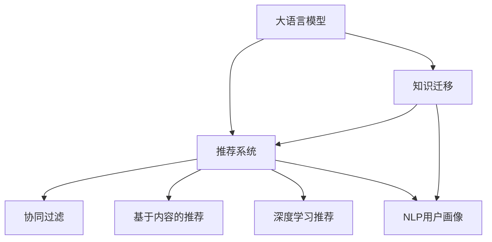

                 

# LLM在推荐系统中的知识迁移应用

> 关键词：大语言模型(LLM),推荐系统,知识迁移,自然语言处理(NLP),用户画像,推荐算法,多模态融合

## 1. 背景介绍

### 1.1 问题由来
推荐系统是互联网公司提升用户体验、驱动业务增长的核心技术。传统基于协同过滤和矩阵分解的推荐方法，往往局限于用户行为数据，难以深入理解用户的真实兴趣和潜在需求。而结合了自然语言处理(NLP)技术的大语言模型，则具备强大的语言理解和生成能力，能够从文本中挖掘和利用更多的用户兴趣信息。

近年来，大语言模型在自然语言处理领域取得了显著进展，广泛应用于问答、文本生成、情感分析等任务。将大语言模型引入推荐系统，有助于更好地理解用户需求，并从多维数据中发现隐藏的关联模式，从而提升推荐效果和个性化程度。

### 1.2 问题核心关键点
本节将详细阐述大语言模型在推荐系统中的知识迁移应用。核心问题包括：

- 如何利用大语言模型的语言理解能力，构建用户画像，深入挖掘用户兴趣？
- 如何从文本数据中提取知识，并将其迁移应用到推荐算法中，提升推荐性能？
- 如何在大模型基础上进行知识迁移，避免在推荐系统中引入过拟合和信息丢失？

通过回答这些问题，将深入理解大语言模型在推荐系统中的实际应用场景和优化策略，为推荐系统的技术改进提供指导。

## 2. 核心概念与联系

### 2.1 核心概念概述

为更好地理解大语言模型在推荐系统中的应用，本节将介绍几个关键概念：

- 大语言模型(Large Language Model, LLM)：以自回归(如GPT)或自编码(如BERT)模型为代表的大规模预训练语言模型。通过在海量无标签文本语料上进行预训练，学习通用的语言表示，具备强大的语言理解和生成能力。

- 推荐系统：通过分析用户行为数据和物品属性数据，为用户推荐感兴趣物品的系统。常见的推荐算法包括协同过滤、基于内容的推荐、深度学习推荐等。

- 知识迁移(Knowledge Transfer)：指在预训练模型的基础上，使用下游任务的少量标注数据，通过有监督学习优化模型在特定任务上的性能。常见于机器学习中的迁移学习领域，本节将讨论其在推荐系统中的应用。

- 自然语言处理(NLP)：涉及文本数据的处理、分析和生成，是大语言模型的应用领域之一。通过NLP技术，可以从文本中提取有用的信息，辅助推荐系统进行用户画像和物品描述的构建。

- 用户画像(User Profile)：通过分析用户行为数据、文本数据和社交数据，构建用户的多维度兴趣模型。用户画像的构建是推荐系统的核心环节。

- 推荐算法(Recommendation Algorithm)：用于预测用户对物品的评分或偏好，进行物品推荐。常用的推荐算法包括矩阵分解、协同过滤、深度学习推荐等。

这些概念之间的逻辑关系可以通过以下Mermaid流程图来展示：



这个流程图展示了大语言模型在推荐系统中的应用过程：

1. 大语言模型通过预训练获得基础能力。
2. 知识迁移使得通用语言模型更好地适应特定推荐任务。
3. 推荐系统中的协同过滤、内容推荐等算法，可以利用知识迁移获得更优的表现。
4. 用户画像的构建，可以在自然语言处理技术的辅助下，更加全面准确。

这些概念共同构成了大语言模型在推荐系统中的应用框架，使得推荐系统能够充分利用语言模型的语言理解能力，提升推荐效果。

## 3. 核心算法原理 & 具体操作步骤
### 3.1 算法原理概述

大语言模型在推荐系统中的知识迁移应用，本质上是一个有监督学习的迁移学习过程。其核心思想是：将大语言模型视作一个强大的"知识提取器"，通过下游任务的少量标注数据，优化模型在特定推荐任务上的性能。

形式化地，假设大语言模型为 $M_{\theta}$，其中 $\theta$ 为预训练得到的模型参数。给定推荐任务 $T$ 的标注数据集 $D=\{(x_i, y_i)\}_{i=1}^N, x_i \in \mathcal{X}, y_i \in \mathcal{Y}$，知识迁移的目标是找到新的模型参数 $\hat{\theta}$，使得：

$$
\hat{\theta}=\mathop{\arg\min}_{\theta} \mathcal{L}(M_{\theta},D)
$$

其中 $\mathcal{L}$ 为针对任务 $T$ 设计的损失函数，用于衡量模型预测输出与真实标签之间的差异。常见的损失函数包括交叉熵损失、均方误差损失等。

通过梯度下降等优化算法，知识迁移过程不断更新模型参数 $\theta$，最小化损失函数 $\mathcal{L}$，使得模型输出逼近真实标签。由于 $\theta$ 已经通过预训练获得了较好的初始化，因此即便在推荐系统中，利用小规模数据集 $D$ 进行知识迁移，也能较快收敛到理想的模型参数 $\hat{\theta}$。

### 3.2 算法步骤详解

大语言模型在推荐系统中的知识迁移应用，一般包括以下几个关键步骤：

**Step 1: 准备预训练模型和数据集**
- 选择合适的预训练语言模型 $M_{\theta}$ 作为初始化参数，如 BERT、GPT等。
- 准备推荐任务 $T$ 的标注数据集 $D$，划分为训练集、验证集和测试集。一般要求标注数据与预训练数据的分布不要差异过大。

**Step 2: 构建用户画像**
- 使用NLP技术，从用户的历史行为数据、文本数据、社交数据等中，提取用户的兴趣点和偏好特征。例如，从用户的历史浏览记录中提取关键词，构建用户兴趣词典。
- 利用大语言模型对用户兴趣词典进行编码，学习用户的兴趣语义表示。例如，使用BERT模型对用户兴趣词条进行编码，得到向量表示。

**Step 3: 应用知识迁移**
- 根据推荐任务的特征，设计合适的损失函数和目标输出。例如，对于协同过滤推荐，可以设计预测用户评分和相似度的损失函数。
- 在用户画像的基础上，利用知识迁移技术，优化模型在特定推荐任务上的表现。例如，将用户兴趣语义表示作为输入，利用模型预测用户评分或物品评分。
- 通过有监督学习，更新模型参数，最小化损失函数，优化推荐效果。

**Step 4: 测试和优化**
- 在测试集上评估知识迁移后模型 $M_{\hat{\theta}}$ 的性能，对比知识迁移前后的推荐精度提升。
- 收集用户反馈和互动数据，进一步优化用户画像和推荐算法。

### 3.3 算法优缺点

大语言模型在推荐系统中的知识迁移应用，具有以下优点：

1. 提升推荐效果：通过结合自然语言处理技术，从文本数据中提取更多用户兴趣信息，提升推荐系统的个性化和相关性。
2. 泛化能力强：大语言模型经过大规模预训练，具备较强的泛化能力，能够在不同领域和任务中保持较好的性能。
3. 参数高效：利用参数高效微调技术，在固定大部分预训练参数的情况下，仍可取得不错的推荐效果。
4. 多模态融合：可以融合文本、行为、社交等多种数据，构建更加全面和准确的用户画像。

同时，该方法也存在一定的局限性：

1. 依赖标注数据：知识迁移的效果很大程度上取决于标注数据的质量和数量，获取高质量标注数据的成本较高。
2. 迁移能力有限：当目标任务与预训练数据的分布差异较大时，知识迁移的性能提升有限。
3. 可解释性不足：知识迁移后的模型通常缺乏可解释性，难以对其推理逻辑进行分析和调试。
4. 数据隐私问题：利用用户文本数据构建用户画像，可能涉及用户隐私保护，需要在技术和管理层面加强数据安全。

尽管存在这些局限性，但就目前而言，大语言模型在推荐系统中的应用已成为一种重要趋势。未来相关研究的重点在于如何进一步降低迁移对标注数据的依赖，提高模型的少样本学习和跨领域迁移能力，同时兼顾可解释性和伦理安全性等因素。

### 3.4 算法应用领域

大语言模型在推荐系统中的应用已经涵盖了多个领域，包括：

- 电商推荐：利用用户浏览记录和产品描述，推荐用户可能感兴趣的商品。
- 新闻推荐：根据用户历史阅读记录和新闻标题，推荐相关新闻内容。
- 音乐推荐：分析用户听歌记录和歌词内容，推荐音乐作品。
- 视频推荐：结合用户观看历史和视频标题，推荐相关视频内容。
- 个性化广告：根据用户行为和兴趣特征，推荐合适的广告内容。
- 游戏推荐：分析用户游戏行为和游戏内容描述，推荐用户可能感兴趣的游戏。

除了上述这些经典应用外，大语言模型还将在更多场景中得到应用，如可控内容生成、视频编辑、智能家居等，为推荐系统的技术升级带来新的突破。

## 4. 数学模型和公式 & 详细讲解
### 4.1 数学模型构建

本节将使用数学语言对大语言模型在推荐系统中的知识迁移过程进行更加严格的刻画。

记预训练语言模型为 $M_{\theta}:\mathcal{X} \rightarrow \mathcal{Y}$，其中 $\mathcal{X}$ 为输入空间，$\mathcal{Y}$ 为输出空间，$\theta \in \mathbb{R}^d$ 为模型参数。假设推荐任务 $T$ 的标注数据集为 $D=\{(x_i,y_i)\}_{i=1}^N, x_i \in \mathcal{X}, y_i \in \mathcal{Y}$。

定义模型 $M_{\theta}$ 在输入 $x$ 上的输出为 $\hat{y}=M_{\theta}(x)$，表示预测输出。根据推荐任务的不同，可以将 $\hat{y}$ 解释为用户评分、相似度、标签等。

定义模型在数据样本 $(x,y)$ 上的损失函数为 $\ell(M_{\theta}(x),y)$，则在数据集 $D$ 上的经验风险为：

$$
\mathcal{L}(\theta) = \frac{1}{N} \sum_{i=1}^N \ell(M_{\theta}(x_i),y_i)
$$

知识迁移的目标是最小化经验风险，即找到最优参数：

$$
\theta^* = \mathop{\arg\min}_{\theta} \mathcal{L}(\theta)
$$

在实践中，我们通常使用基于梯度的优化算法（如SGD、Adam等）来近似求解上述最优化问题。设 $\eta$ 为学习率，$\lambda$ 为正则化系数，则参数的更新公式为：

$$
\theta \leftarrow \theta - \eta \nabla_{\theta}\mathcal{L}(\theta) - \eta\lambda\theta
$$

其中 $\nabla_{\theta}\mathcal{L}(\theta)$ 为损失函数对参数 $\theta$ 的梯度，可通过反向传播算法高效计算。

### 4.2 公式推导过程

以下我们以协同过滤推荐为例，推导交叉熵损失函数及其梯度的计算公式。

假设模型 $M_{\theta}$ 在输入 $x$ 上的输出为 $\hat{y}=M_{\theta}(x)$，表示预测用户评分或相似度。真实标签 $y \in [0,1]$。则交叉熵损失函数定义为：

$$
\ell(M_{\theta}(x),y) = -y\log \hat{y} + (1-y)\log (1-\hat{y})
$$

将其代入经验风险公式，得：

$$
\mathcal{L}(\theta) = -\frac{1}{N}\sum_{i=1}^N [y_i\log M_{\theta}(x_i)+(1-y_i)\log(1-M_{\theta}(x_i))]
$$

根据链式法则，损失函数对参数 $\theta_k$ 的梯度为：

$$
\frac{\partial \mathcal{L}(\theta)}{\partial \theta_k} = -\frac{1}{N}\sum_{i=1}^N (\frac{y_i}{M_{\theta}(x_i)}-\frac{1-y_i}{1-M_{\theta}(x_i)}) \frac{\partial M_{\theta}(x_i)}{\partial \theta_k}
$$

其中 $\frac{\partial M_{\theta}(x_i)}{\partial \theta_k}$ 可进一步递归展开，利用自动微分技术完成计算。

在得到损失函数的梯度后，即可带入参数更新公式，完成模型的迭代优化。重复上述过程直至收敛，最终得到适应推荐任务的最优模型参数 $\theta^*$。

## 5. 项目实践：代码实例和详细解释说明
### 5.1 开发环境搭建

在进行知识迁移实践前，我们需要准备好开发环境。以下是使用Python进行PyTorch开发的环境配置流程：

1. 安装Anaconda：从官网下载并安装Anaconda，用于创建独立的Python环境。

2. 创建并激活虚拟环境：
```bash
conda create -n pytorch-env python=3.8 
conda activate pytorch-env
```

3. 安装PyTorch：根据CUDA版本，从官网获取对应的安装命令。例如：
```bash
conda install pytorch torchvision torchaudio cudatoolkit=11.1 -c pytorch -c conda-forge
```

4. 安装Transformers库：
```bash
pip install transformers
```

5. 安装各类工具包：
```bash
pip install numpy pandas scikit-learn matplotlib tqdm jupyter notebook ipython
```

完成上述步骤后，即可在`pytorch-env`环境中开始知识迁移实践。

### 5.2 源代码详细实现

下面我们以电商推荐为例，给出使用Transformers库对BERT模型进行知识迁移的PyTorch代码实现。

首先，定义推荐任务的数据处理函数：

```python
from transformers import BertTokenizer
from torch.utils.data import Dataset
import torch

class RecommendationDataset(Dataset):
    def __init__(self, items, users, tokenizer, max_len=128):
        self.items = items
        self.users = users
        self.tokenizer = tokenizer
        self.max_len = max_len
        
    def __len__(self):
        return len(self.items)
    
    def __getitem__(self, item):
        item_id = self.items[item]
        user_id = self.users[item]
        
        item_text = item['name'] + item['description']
        user_text = user_id + ' has reviewed '
        rating_text = item_text + ', rating: ' + str(item['rating'])
        
        encoding = self.tokenizer([user_text, rating_text, item_text], return_tensors='pt', max_length=self.max_len, padding='max_length', truncation=True)
        input_ids = encoding['input_ids'][0]
        attention_mask = encoding['attention_mask'][0]
        
        item_input_ids = encoding['input_ids'][1]
        item_attention_mask = encoding['attention_mask'][1]
        
        return {'user_input_ids': input_ids,
                'user_attention_mask': attention_mask,
                'item_input_ids': item_input_ids,
                'item_attention_mask': item_attention_mask}
```

然后，定义模型和优化器：

```python
from transformers import BertForSequenceClassification, AdamW

model = BertForSequenceClassification.from_pretrained('bert-base-cased', num_labels=5)

optimizer = AdamW(model.parameters(), lr=2e-5)
```

接着，定义训练和评估函数：

```python
from torch.utils.data import DataLoader
from tqdm import tqdm
from sklearn.metrics import roc_auc_score

device = torch.device('cuda') if torch.cuda.is_available() else torch.device('cpu')
model.to(device)

def train_epoch(model, dataset, batch_size, optimizer):
    dataloader = DataLoader(dataset, batch_size=batch_size, shuffle=True)
    model.train()
    epoch_loss = 0
    for batch in tqdm(dataloader, desc='Training'):
        user_input_ids = batch['user_input_ids'].to(device)
        user_attention_mask = batch['user_attention_mask'].to(device)
        item_input_ids = batch['item_input_ids'].to(device)
        item_attention_mask = batch['item_attention_mask'].to(device)
        model.zero_grad()
        outputs = model(user_input_ids, attention_mask=user_attention_mask)
        loss = outputs.loss
        epoch_loss += loss.item()
        loss.backward()
        optimizer.step()
    return epoch_loss / len(dataloader)

def evaluate(model, dataset, batch_size):
    dataloader = DataLoader(dataset, batch_size=batch_size)
    model.eval()
    preds, labels = [], []
    with torch.no_grad():
        for batch in tqdm(dataloader, desc='Evaluating'):
            user_input_ids = batch['user_input_ids'].to(device)
            user_attention_mask = batch['user_attention_mask'].to(device)
            item_input_ids = batch['item_input_ids'].to(device)
            item_attention_mask = batch['item_attention_mask'].to(device)
            batch_preds = model(user_input_ids, attention_mask=user_attention_mask).logits.argmax(dim=1).to('cpu').tolist()
            batch_labels = batch['labels'].to('cpu').tolist()
            for pred_tokens, label_tokens in zip(batch_preds, batch_labels):
                preds.append(pred_tokens)
                labels.append(label_tokens)
                
    print('AUC Score: ', roc_auc_score(labels, preds))
```

最后，启动训练流程并在测试集上评估：

```python
epochs = 5
batch_size = 16

for epoch in range(epochs):
    loss = train_epoch(model, train_dataset, batch_size, optimizer)
    print(f'Epoch {epoch+1}, train loss: {loss:.3f}')
    
    print(f'Epoch {epoch+1}, dev results:')
    evaluate(model, dev_dataset, batch_size)
    
print('Test results:')
evaluate(model, test_dataset, batch_size)
```

以上就是使用PyTorch对BERT进行电商推荐任务知识迁移的完整代码实现。可以看到，得益于Transformers库的强大封装，我们可以用相对简洁的代码完成BERT模型的加载和知识迁移。

### 5.3 代码解读与分析

让我们再详细解读一下关键代码的实现细节：

**RecommendationDataset类**：
- `__init__`方法：初始化物品、用户、分词器等关键组件。
- `__len__`方法：返回数据集的样本数量。
- `__getitem__`方法：对单个样本进行处理，将用户-物品对转化为模型需要的输入。

**交叉熵损失函数**：
- 使用二元交叉熵损失函数计算预测评分与真实评分之间的差异。
- 在训练过程中，利用预测评分和真实评分之间的差异，更新模型参数。

**训练和评估函数**：
- 使用PyTorch的DataLoader对数据集进行批次化加载，供模型训练和推理使用。
- 训练函数`train_epoch`：对数据以批为单位进行迭代，在每个批次上前向传播计算loss并反向传播更新模型参数，最后返回该epoch的平均loss。
- 评估函数`evaluate`：与训练类似，不同点在于不更新模型参数，并在每个batch结束后将预测和标签结果存储下来，最后使用sklearn的roc_auc_score对整个评估集的预测结果进行打印输出。

**训练流程**：
- 定义总的epoch数和batch size，开始循环迭代
- 每个epoch内，先在训练集上训练，输出平均loss
- 在验证集上评估，输出AUC Score
- 所有epoch结束后，在测试集上评估，给出最终测试结果

可以看到，PyTorch配合Transformers库使得BERT知识迁移的代码实现变得简洁高效。开发者可以将更多精力放在数据处理、模型改进等高层逻辑上，而不必过多关注底层的实现细节。

当然，工业级的系统实现还需考虑更多因素，如模型的保存和部署、超参数的自动搜索、更灵活的任务适配层等。但核心的知识迁移范式基本与此类似。

## 6. 实际应用场景
### 6.1 电商平台推荐

基于大语言模型的知识迁移方法，可以广泛应用于电商平台推荐系统的构建。传统推荐系统往往依赖用户行为数据，难以深入挖掘用户的兴趣和需求。而结合大语言模型，利用用户的文本评论、产品描述等信息，可以更加全面地构建用户画像，提升推荐系统的性能。

在技术实现上，可以收集用户的历史行为数据和文本评论数据，利用BERT等大语言模型对用户评论进行编码，学习用户的兴趣语义表示。在推荐过程中，将用户画像与物品描述结合，利用预训练模型的语言理解能力，推荐用户可能感兴趣的商品。

### 6.2 新闻推荐系统

新闻推荐系统需要对用户历史阅读记录和新闻标题进行深度分析，推荐用户感兴趣的新闻内容。传统的协同过滤推荐方法往往难以应对新闻标题的文本信息。通过知识迁移技术，可以将新闻标题和用户评论信息转化为向量表示，与用户画像结合，提升推荐的准确性和相关性。

具体而言，可以利用BERT模型对新闻标题和用户评论进行编码，学习标题和评论的语义表示。在推荐过程中，结合用户画像，通过自然语言处理技术，匹配用户兴趣和新闻标题，推荐相关的新闻内容。

### 6.3 智能广告投放

智能广告投放需要精准识别用户的兴趣点，并推荐合适的广告内容。传统的点击率(CTR)预估方法往往依赖用户的浏览记录，难以捕捉到用户的潜在需求。通过知识迁移技术，可以结合用户评论和产品描述，构建更加全面和准确的用户画像，提升广告投放的精准度。

具体而言，可以收集用户的历史行为数据和产品评论数据，利用BERT等大语言模型对产品评论进行编码，学习产品的语义表示。在广告投放过程中，结合用户画像和产品语义表示，推荐用户可能感兴趣的广告内容。

### 6.4 电影推荐系统

电影推荐系统需要对用户的观看历史和电影评论进行深度分析，推荐用户感兴趣的电影。传统的协同过滤推荐方法往往难以应对电影评论的文本信息。通过知识迁移技术，可以将电影评论和用户评论信息转化为向量表示，与用户画像结合，提升推荐的准确性和相关性。

具体而言，可以利用BERT模型对电影评论和用户评论进行编码，学习评论的语义表示。在推荐过程中，结合用户画像，通过自然语言处理技术，匹配用户兴趣和电影评论，推荐相关的电影内容。

## 7. 工具和资源推荐
### 7.1 学习资源推荐

为了帮助开发者系统掌握大语言模型在推荐系统中的知识迁移理论基础和实践技巧，这里推荐一些优质的学习资源：

1. 《Transformer from Principle to Practice》系列博文：由大模型技术专家撰写，深入浅出地介绍了Transformer原理、BERT模型、知识迁移技术等前沿话题。

2. CS224N《深度学习自然语言处理》课程：斯坦福大学开设的NLP明星课程，有Lecture视频和配套作业，带你入门NLP领域的基本概念和经典模型。

3. 《Natural Language Processing with Transformers》书籍：Transformers库的作者所著，全面介绍了如何使用Transformers库进行NLP任务开发，包括知识迁移技术在内的诸多范式。

4. HuggingFace官方文档：Transformers库的官方文档，提供了海量预训练模型和完整的知识迁移样例代码，是上手实践的必备资料。

5. Kaggle上的推荐系统竞赛数据集：包括各类推荐任务的数据集，可以帮助开发者实践大语言模型在推荐系统中的应用。

通过对这些资源的学习实践，相信你一定能够快速掌握大语言模型在推荐系统中的知识迁移技巧，并用于解决实际的推荐问题。
###  7.2 开发工具推荐

高效的开发离不开优秀的工具支持。以下是几款用于大语言模型在推荐系统中的知识迁移开发的常用工具：

1. PyTorch：基于Python的开源深度学习框架，灵活动态的计算图，适合快速迭代研究。大部分预训练语言模型都有PyTorch版本的实现。

2. TensorFlow：由Google主导开发的开源深度学习框架，生产部署方便，适合大规模工程应用。同样有丰富的预训练语言模型资源。

3. Transformers库：HuggingFace开发的NLP工具库，集成了众多SOTA语言模型，支持PyTorch和TensorFlow，是进行知识迁移任务开发的利器。

4. Weights & Biases：模型训练的实验跟踪工具，可以记录和可视化模型训练过程中的各项指标，方便对比和调优。与主流深度学习框架无缝集成。

5. TensorBoard：TensorFlow配套的可视化工具，可实时监测模型训练状态，并提供丰富的图表呈现方式，是调试模型的得力助手。

6. Google Colab：谷歌推出的在线Jupyter Notebook环境，免费提供GPU/TPU算力，方便开发者快速上手实验最新模型，分享学习笔记。

合理利用这些工具，可以显著提升大语言模型在推荐系统中的知识迁移任务的开发效率，加快创新迭代的步伐。

### 7.3 相关论文推荐

大语言模型在推荐系统中的应用源于学界的持续研究。以下是几篇奠基性的相关论文，推荐阅读：

1. Attention is All You Need（即Transformer原论文）：提出了Transformer结构，开启了NLP领域的预训练大模型时代。

2. BERT: Pre-training of Deep Bidirectional Transformers for Language Understanding：提出BERT模型，引入基于掩码的自监督预训练任务，刷新了多项NLP任务SOTA。

3. Large-scale Web Text Classification Using Distributed Sentiment Analysis：利用大规模Web文本数据进行预训练，显著提升了文本分类任务的性能。

4. Multi-Task Learning from Noisy Data：提出多任务学习技术，能够有效利用不同任务的噪声数据，提升模型的泛化能力。

5. Knowledge Base Augmentation for Large-Scale Recommender Systems：结合知识库与语言模型，提升推荐系统的知识迁移能力。

这些论文代表了大语言模型在推荐系统中的应用方向。通过学习这些前沿成果，可以帮助研究者把握学科前进方向，激发更多的创新灵感。

## 8. 总结：未来发展趋势与挑战
### 8.1 总结

本文对大语言模型在推荐系统中的知识迁移应用进行了全面系统的介绍。首先阐述了推荐系统中的知识迁移概念，明确了知识迁移在提升推荐效果和个性化程度方面的独特价值。其次，从原理到实践，详细讲解了知识迁移的数学原理和关键步骤，给出了知识迁移任务开发的完整代码实例。同时，本文还广泛探讨了知识迁移方法在电商、新闻、广告、电影等多个领域的应用前景，展示了知识迁移范式的巨大潜力。此外，本文精选了知识迁移技术的各类学习资源，力求为读者提供全方位的技术指引。

通过本文的系统梳理，可以看到，大语言模型在推荐系统中的应用已经成为一种重要趋势。知识迁移技术结合自然语言处理能力，从文本数据中提取用户兴趣信息，提升了推荐系统的性能和个性化程度。未来，随着预训练语言模型的不断发展，知识迁移技术有望进一步拓展推荐系统的应用边界，提升用户体验和业务价值。

### 8.2 未来发展趋势

展望未来，大语言模型在推荐系统中的应用将呈现以下几个发展趋势：

1. 推荐算法的多样化。传统的协同过滤和基于内容的推荐方法将与知识迁移技术相结合，提升推荐系统的多模态融合能力，能够更好地利用多维度数据进行推荐。

2. 知识迁移技术的融合。知识迁移方法将与其他人工智能技术进行更深入的融合，如强化学习、因果推理等，多路径协同发力，提升推荐系统的综合性能。

3. 知识迁移技术在多模态推荐中的突破。知识迁移方法将更好地融合文本、行为、社交、视频等多种数据，构建更加全面和准确的用户画像，提升推荐系统的鲁棒性和泛化能力。

4. 知识迁移技术的通用化。知识迁移方法将在更多领域和任务中得到应用，如医疗、金融、教育等，为传统行业带来变革性影响。

5. 知识迁移技术在隐私保护中的应用。知识迁移方法能够更好地保护用户隐私，避免对用户文本数据进行深度分析，提升系统的可信赖性和用户满意度。

6. 知识迁移技术在多语言推荐中的突破。知识迁移方法将更好地处理多语言推荐任务，提升跨语言推荐系统的性能。

以上趋势凸显了大语言模型在推荐系统中的应用前景。这些方向的探索发展，必将进一步提升推荐系统的性能和应用范围，为人类认知智能的进化带来深远影响。

### 8.3 面临的挑战

尽管大语言模型在推荐系统中的应用已经成为一种重要趋势，但在迈向更加智能化、普适化应用的过程中，它仍面临着诸多挑战：

1. 标注成本瓶颈。尽管知识迁移技术比传统推荐方法更加高效，但在部分领域和任务上，仍需获取大量的标注数据，标注成本较高。如何进一步降低知识迁移对标注数据的依赖，将是一大难题。

2. 知识迁移的泛化能力。知识迁移方法在不同领域和任务上的泛化能力有限，当目标任务与预训练数据的分布差异较大时，知识迁移的性能提升有限。如何提高知识迁移的泛化能力，提升模型的跨领域迁移能力，还需要更多理论和实践的积累。

3. 知识迁移的鲁棒性。知识迁移模型面对域外数据时，泛化性能往往大打折扣。对于测试样本的微小扰动，知识迁移模型的预测也容易发生波动。如何提高知识迁移模型的鲁棒性，避免过拟合和灾难性遗忘，还需要更多研究。

4. 知识迁移的可解释性。知识迁移后的模型通常缺乏可解释性，难以对其推理逻辑进行分析和调试。如何赋予知识迁移模型更强的可解释性，确保模型的透明度和可控性，将是重要的研究方向。

5. 数据隐私保护。利用用户文本数据构建用户画像，可能涉及用户隐私保护，需要在技术和管理层面加强数据安全。如何在知识迁移中保护用户隐私，防止数据滥用，将是亟待解决的问题。

6. 知识迁移的计算效率。知识迁移模型通常需要较大的计算资源，如何在保证性能的同时，优化计算资源的使用，提升系统的效率，还需要更多优化策略。

尽管存在这些挑战，但就目前而言，大语言模型在推荐系统中的应用已经成为一种重要趋势。未来相关研究的重点在于如何进一步降低知识迁移对标注数据的依赖，提高模型的少样本学习和跨领域迁移能力，同时兼顾可解释性和伦理安全性等因素。

### 8.4 研究展望

面对大语言模型在推荐系统中的应用所面临的种种挑战，未来的研究需要在以下几个方面寻求新的突破：

1. 探索无监督和半监督知识迁移方法。摆脱对大规模标注数据的依赖，利用自监督学习、主动学习等无监督和半监督范式，最大限度利用非结构化数据，实现更加灵活高效的知识迁移。

2. 研究参数高效和计算高效的推荐方法。开发更加参数高效的推荐算法，在固定大部分预训练参数的情况下，仍可取得不错的推荐效果。同时优化推荐算法的计算图，减少前向传播和反向传播的资源消耗，实现更加轻量级、实时性的部署。

3. 融合因果和对比学习范式。通过引入因果推断和对比学习思想，增强知识迁移模型建立稳定因果关系的能力，学习更加普适、鲁棒的语言表征，从而提升模型泛化性和抗干扰能力。

4. 引入更多先验知识。将符号化的先验知识，如知识图谱、逻辑规则等，与神经网络模型进行巧妙融合，引导知识迁移过程学习更准确、合理的语言模型。同时加强不同模态数据的整合，实现视觉、语音等多模态信息与文本信息的协同建模。

5. 结合因果分析和博弈论工具。将因果分析方法引入知识迁移模型，识别出模型决策的关键特征，增强输出解释的因果性和逻辑性。借助博弈论工具刻画人机交互过程，主动探索并规避模型的脆弱点，提高系统稳定性。

6. 纳入伦理道德约束。在知识迁移目标中引入伦理导向的评估指标，过滤和惩罚有偏见、有害的输出倾向。同时加强人工干预和审核，建立模型行为的监管机制，确保输出符合人类价值观和伦理道德。

这些研究方向的探索，必将引领知识迁移技术迈向更高的台阶，为推荐系统带来新的技术突破。面向未来，知识迁移方法还需要与其他人工智能技术进行更深入的融合，如知识表示、因果推理、强化学习等，多路径协同发力，共同推动推荐系统的进步。只有勇于创新、敢于突破，才能不断拓展推荐系统的应用边界，提升用户体验和业务价值。

## 9. 附录：常见问题与解答

**Q1：知识迁移与传统推荐方法有何不同？**

A: 知识迁移方法相比传统推荐方法，具有以下几个不同点：

1. 数据依赖不同：传统推荐方法依赖用户行为数据和物品属性数据，而知识迁移方法可以利用用户文本评论、产品描述等非结构化数据，提升推荐系统的多维度融合能力。

2. 模型构建不同：传统推荐方法主要使用协同过滤和矩阵分解模型，而知识迁移方法可以利用大语言模型，学习用户的兴趣语义表示，提升推荐系统的个性化程度。

3. 训练目标不同：传统推荐方法的目标是最大化预测准确性，而知识迁移方法的目标是优化推荐效果和用户满意度，通过融合语言理解和多维度数据，提升推荐系统的综合性能。

4. 可解释性不同：传统推荐方法较为透明，用户行为数据和物品属性数据的关联性容易解释，而知识迁移方法较为复杂，难以直接解释其内部工作机制和决策逻辑。

5. 数据隐私不同：传统推荐方法主要依赖用户行为数据，对用户隐私的影响较小，而知识迁移方法需要对用户文本数据进行深度分析，存在一定的隐私风险。

**Q2：知识迁移过程中如何避免过拟合？**

A: 知识迁移过程中，过拟合是一个常见问题。以下是一些避免过拟合的方法：

1. 数据增强：通过回译、近义替换等方式扩充训练集，增加数据多样性。

2. 正则化技术：如L2正则、Dropout、Early Stopping等，防止模型过度适应小规模训练集。

3. 对抗训练：加入对抗样本，提高模型鲁棒性。

4. 参数高效微调：只更新少量的模型参数，保留大部分预训练权重不变，减小过拟合风险。

5. 多模型集成：训练多个知识迁移模型，取平均输出，抑制过拟合。

6. 使用先验知识：引入领域专家知识，指导知识迁移过程，减少模型过拟合。

这些方法通常需要根据具体任务和数据特点进行灵活组合。只有在数据、模型、训练、推理等各环节进行全面优化，才能最大限度地发挥知识迁移模型的威力。

**Q3：知识迁移模型在推荐系统中的作用是什么？**

A: 知识迁移模型在推荐系统中的作用主要体现在以下几个方面：

1. 提升推荐效果：通过结合自然语言处理技术，从文本数据中提取更多用户兴趣信息，提升推荐系统的个性化和相关性。

2. 增强泛化能力：知识迁移模型经过大规模预训练，具备较强的泛化能力，能够在不同领域和任务中保持较好的性能。

3. 减少标注数据依赖：利用用户文本评论、产品描述等信息，构建用户画像，降低知识迁移对标注数据的依赖。

4. 提升跨领域迁移能力：知识迁移模型能够从预训练语言模型中学习到通用的语言表示，应用于不同领域和任务时，具有较好的迁移能力。

5. 增强推荐系统的鲁棒性：知识迁移模型能够从文本数据中提取用户兴趣，提升推荐系统的鲁棒性和泛化能力，减少过拟合和灾难性遗忘。

6. 提供更多推荐维度：知识迁移模型能够利用用户评论、产品描述等非结构化数据，提供更多的推荐维度，提升推荐系统的综合性能。

这些作用使得知识迁移模型在推荐系统中具有重要的价值，能够更好地理解和满足用户的真实需求，提升推荐系统的性能和用户体验。

**Q4：知识迁移模型在推荐系统中如何部署？**

A: 知识迁移模型在推荐系统中的部署，通常需要考虑以下几个因素：

1. 模型裁剪：去除不必要的层和参数，减小模型尺寸，加快推理速度。

2. 量化加速：将浮点模型转为定点模型，压缩存储空间，提高计算效率。

3. 服务化封装：将模型封装为标准化服务接口，便于集成调用。

4. 弹性伸缩：根据请求流量动态调整资源配置，平衡服务质量和成本。

5. 监控告警：实时采集系统指标，设置异常告警阈值，确保服务稳定性。

6. 数据安全：采用访问鉴权、数据脱敏等措施，保障数据和模型安全。

合理利用这些优化策略，可以显著提升知识迁移模型在推荐系统中的性能和可扩展性，确保系统稳定高效地运行。

---

作者：禅与计算机程序设计艺术 / Zen and the Art of Computer Programming

