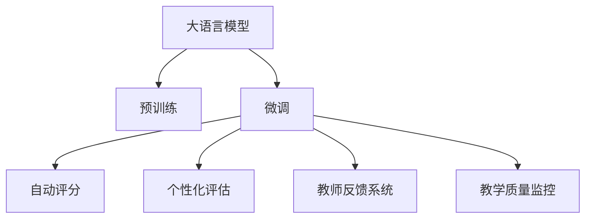

                 

# 大语言模型在教育评估中的应用：公平公正的AI评分

> 关键词：大语言模型,教育评估,公平性,标准化测试,自适应学习,个性化评估,教师反馈系统,教学质量监控

## 1. 背景介绍

### 1.1 问题由来
在当前的教育体系中，评估学生的学习成果通常依赖于标准化测试。这些测试往往标准化、机械化，难以全面评估学生的知识水平、能力素养和综合素质。同时，大量批改作业、试卷的任务也增加了教师的负担，使得教育评估的效果和效率难以兼顾。

人工智能（AI）技术的快速进步为教育评估带来了新的可能。特别是大语言模型（Large Language Model, LLM），通过在海量文本数据上进行预训练，具备强大的自然语言理解和生成能力。近年来，LLM在教育评估中的应用研究逐渐兴起，通过结合文本处理和深度学习技术，开发出更加科学、高效的教育评估系统。

### 1.2 问题核心关键点
基于大语言模型的教育评估系统，通常包括以下几个关键步骤：
1. **预训练和微调**：首先在大规模语料库上进行预训练，然后使用针对特定教育任务的标注数据进行微调。
2. **自动化评分**：将学生提交的作业或文章输入到微调后的模型中进行自动评分。
3. **个性化评估**：根据学生的特点和反馈，进行个性化评估和指导。
4. **教学质量监控**：通过监控教师评分的一致性和合理性，评估教学质量。

这些核心关键点共同构成了基于大语言模型的教育评估系统，旨在提高评估的公平性、准确性和效率。

## 2. 核心概念与联系

### 2.1 核心概念概述

为更好地理解基于大语言模型的教育评估方法，本节将介绍几个密切相关的核心概念：

- **大语言模型（LLM）**：一种基于自回归或自编码模型的大规模预训练语言模型，具备强大的语言理解和生成能力。
- **标准化测试**：通过严格控制试题类型、难度和评价标准的测试，用于衡量学生的基础知识水平和基本能力。
- **自适应学习**：根据学生的学习状态和反馈，动态调整学习内容和节奏，实现个性化学习。
- **个性化评估**：根据学生的特点和兴趣，定制个性化的评估指标和标准。
- **教师反馈系统**：通过AI技术辅助教师进行学生评估，减轻教师负担，提高反馈质量。
- **教学质量监控**：通过监控教师评分的一致性、准确性和合理性，评估教学质量。

这些核心概念之间的逻辑关系可以通过以下Mermaid流程图来展示：



这个流程图展示了大语言模型的核心概念及其之间的关系：

1. 大语言模型通过预训练获得基础能力。
2. 微调是对预训练模型进行任务特定的优化，以适应教育评估任务。
3. 自动评分、个性化评估、教师反馈系统和教学质量监控都是基于微调后的模型实现的功能。

这些概念共同构成了基于大语言模型的教育评估框架，使得模型能够更好地应用于教育领域，提升评估的公平性和效率。

## 3. 核心算法原理 & 具体操作步骤
### 3.1 算法原理概述

基于大语言模型的教育评估系统，本质上是一个有监督的细粒度迁移学习过程。其核心思想是：将预训练的大语言模型视作一个强大的"特征提取器"，通过在教育任务的标注数据上进行有监督的微调，使得模型输出能够匹配任务标签，从而获得针对特定教育任务优化的模型。

形式化地，假设预训练语言模型为 $M_{\theta}$，其中 $\theta$ 为预训练得到的模型参数。给定教育任务 $T$ 的标注数据集 $D=\{(x_i, y_i)\}_{i=1}^N$，其中 $x_i$ 为学生提交的作业或文章，$y_i$ 为标准答案或评估结果。微调的目标是找到新的模型参数 $\hat{\theta}$，使得：

$$
\hat{\theta}=\mathop{\arg\min}_{\theta} \mathcal{L}(M_{\theta},D)
$$

其中 $\mathcal{L}$ 为针对任务 $T$ 设计的损失函数，用于衡量模型预测输出与真实标签之间的差异。常见的损失函数包括交叉熵损失、均方误差损失等。

通过梯度下降等优化算法，微调过程不断更新模型参数 $\theta$，最小化损失函数 $\mathcal{L}$，使得模型输出逼近真实标签。由于 $\theta$ 已经通过预训练获得了较好的初始化，因此即便在规模较小、标注数据较少的情况下，也能较快收敛到理想的模型参数 $\hat{\theta}$。

### 3.2 算法步骤详解

基于大语言模型的教育评估系统一般包括以下几个关键步骤：

**Step 1: 准备预训练模型和数据集**
- 选择合适的预训练语言模型 $M_{\theta}$ 作为初始化参数，如 BERT、GPT 等。
- 准备教育任务 $T$ 的标注数据集 $D$，划分为训练集、验证集和测试集。一般要求标注数据与预训练数据的分布不要差异过大。

**Step 2: 添加任务适配层**
- 根据教育任务类型，在预训练模型顶层设计合适的输出层和损失函数。
- 对于标准化测试评分，通常在顶层添加线性分类器和交叉熵损失函数。
- 对于自适应学习评估，通常使用语言模型的解码器输出概率分布，并以负对数似然为损失函数。

**Step 3: 设置微调超参数**
- 选择合适的优化算法及其参数，如 AdamW、SGD 等，设置学习率、批大小、迭代轮数等。
- 设置正则化技术及强度，包括权重衰减、Dropout、Early Stopping 等。
- 确定冻结预训练参数的策略，如仅微调顶层，或全部参数都参与微调。

**Step 4: 执行梯度训练**
- 将训练集数据分批次输入模型，前向传播计算损失函数。
- 反向传播计算参数梯度，根据设定的优化算法和学习率更新模型参数。
- 周期性在验证集上评估模型性能，根据性能指标决定是否触发 Early Stopping。
- 重复上述步骤直到满足预设的迭代轮数或 Early Stopping 条件。

**Step 5: 测试和部署**
- 在测试集上评估微调后模型 $M_{\hat{\theta}}$ 的性能，对比微调前后的精度提升。
- 使用微调后的模型对新样本进行推理预测，集成到实际的教育评估系统中。
- 持续收集新的数据，定期重新微调模型，以适应数据分布的变化。

以上是基于监督学习微调大语言模型的一般流程。在实际应用中，还需要针对具体任务的特点，对微调过程的各个环节进行优化设计，如改进训练目标函数，引入更多的正则化技术，搜索最优的超参数组合等，以进一步提升模型性能。

### 3.3 算法优缺点

基于大语言模型的教育评估方法具有以下优点：
1. 评估效率高。使用大语言模型进行自动评分，可以显著减少教师工作量，提高评估效率。
2. 评分一致性好。模型评分标准统一，避免教师主观因素带来的评分差异。
3. 个性化评估。根据学生的特点和反馈，进行个性化评估和指导，提升学习效果。
4. 教学质量监控。通过监控教师评分的一致性和合理性，评估教学质量。

同时，该方法也存在一定的局限性：
1. 依赖标注数据。评估系统的效果很大程度上取决于标注数据的质量和数量，获取高质量标注数据的成本较高。
2. 模型泛化能力有限。当目标任务与预训练数据的分布差异较大时，模型泛化能力可能不足。
3. 负面效果传递。预训练模型的固有偏见、有害信息等，可能通过微调传递到评估任务，造成负面影响。
4. 可解释性不足。评估模型的决策过程通常缺乏可解释性，难以对其推理逻辑进行分析和调试。

尽管存在这些局限性，但就目前而言，基于大语言模型的教育评估方法仍是一种高效、可靠的教育评估手段。未来相关研究的重点在于如何进一步降低对标注数据的依赖，提高模型的泛化能力，同时兼顾可解释性和伦理安全性等因素。

### 3.4 算法应用领域

基于大语言模型的教育评估方法，已在教育评估的多个领域得到应用，例如：

- **标准化测试评分**：对学生的标准化测试答卷进行自动评分，提升评分效率和一致性。
- **作业和论文评估**：对学生的作业和论文进行自动评分和反馈，提升教师评分质量。
- **自适应学习评估**：根据学生的学习状态和反馈，进行动态调整和个性化评估，提升学习效果。
- **教师反馈系统**：辅助教师进行学生评估，减轻教师负担，提高反馈质量。
- **教学质量监控**：通过监控教师评分的一致性和合理性，评估教学质量。

这些核心应用领域展示了基于大语言模型的教育评估系统的广泛适用性和深远影响。通过深入研究和优化，相信未来在教育评估领域会有更多创新应用。

## 4. 数学模型和公式 & 详细讲解  
### 4.1 数学模型构建

本节将使用数学语言对基于大语言模型的教育评估过程进行更加严格的刻画。

记预训练语言模型为 $M_{\theta}$，其中 $\theta$ 为预训练得到的模型参数。假设教育任务 $T$ 的训练集为 $D=\{(x_i,y_i)\}_{i=1}^N, x_i \in \mathcal{X}, y_i \in \mathcal{Y}$。

定义模型 $M_{\theta}$ 在输入 $x$ 上的输出为 $\hat{y}=M_{\theta}(x)$，表示模型对输入的评估结果。真实标签 $y \in \mathcal{Y}$。则针对标准化测试评分的损失函数为：

$$
\ell(M_{\theta}(x),y) = -[y\log \hat{y} + (1-y)\log (1-\hat{y})]
$$

将其代入经验风险公式，得：

$$
\mathcal{L}(\theta) = -\frac{1}{N}\sum_{i=1}^N [y_i\log M_{\theta}(x_i)+(1-y_i)\log(1-M_{\theta}(x_i))]
$$

根据链式法则，损失函数对参数 $\theta_k$ 的梯度为：

$$
\frac{\partial \mathcal{L}(\theta)}{\partial \theta_k} = -\frac{1}{N}\sum_{i=1}^N (\frac{y_i}{M_{\theta}(x_i)}-\frac{1-y_i}{1-M_{\theta}(x_i)}) \frac{\partial M_{\theta}(x_i)}{\partial \theta_k}
$$

其中 $\frac{\partial M_{\theta}(x_i)}{\partial \theta_k}$ 可进一步递归展开，利用自动微分技术完成计算。

### 4.2 公式推导过程

以下我们以标准化测试评分为例，推导交叉熵损失函数及其梯度的计算公式。

假设模型 $M_{\theta}$ 在输入 $x$ 上的输出为 $\hat{y}=M_{\theta}(x) \in [0,1]$，表示模型对输入的评分。真实标签 $y \in \{0,1\}$。则二分类交叉熵损失函数定义为：

$$
\ell(M_{\theta}(x),y) = -[y\log \hat{y} + (1-y)\log (1-\hat{y})]
$$

将其代入经验风险公式，得：

$$
\mathcal{L}(\theta) = -\frac{1}{N}\sum_{i=1}^N [y_i\log M_{\theta}(x_i)+(1-y_i)\log(1-M_{\theta}(x_i))]
$$

根据链式法则，损失函数对参数 $\theta_k$ 的梯度为：

$$
\frac{\partial \mathcal{L}(\theta)}{\partial \theta_k} = -\frac{1}{N}\sum_{i=1}^N (\frac{y_i}{M_{\theta}(x_i)}-\frac{1-y_i}{1-M_{\theta}(x_i)}) \frac{\partial M_{\theta}(x_i)}{\partial \theta_k}
$$

其中 $\frac{\partial M_{\theta}(x_i)}{\partial \theta_k}$ 可进一步递归展开，利用自动微分技术完成计算。

在得到损失函数的梯度后，即可带入参数更新公式，完成模型的迭代优化。重复上述过程直至收敛，最终得到适应教育任务的最优模型参数 $\theta^*$。

## 5. 项目实践：代码实例和详细解释说明
### 5.1 开发环境搭建

在进行教育评估系统开发前，我们需要准备好开发环境。以下是使用Python进行PyTorch开发的环境配置流程：

1. 安装Anaconda：从官网下载并安装Anaconda，用于创建独立的Python环境。

2. 创建并激活虚拟环境：
```bash
conda create -n pytorch-env python=3.8 
conda activate pytorch-env
```

3. 安装PyTorch：根据CUDA版本，从官网获取对应的安装命令。例如：
```bash
conda install pytorch torchvision torchaudio cudatoolkit=11.1 -c pytorch -c conda-forge
```

4. 安装Transformer库：
```bash
pip install transformers
```

5. 安装各类工具包：
```bash
pip install numpy pandas scikit-learn matplotlib tqdm jupyter notebook ipython
```

完成上述步骤后，即可在`pytorch-env`环境中开始教育评估系统的开发。

### 5.2 源代码详细实现

这里我们以标准化测试评分为例，给出使用Transformers库对BERT模型进行微调的PyTorch代码实现。

首先，定义标准化测试评分任务的数据处理函数：

```python
from transformers import BertTokenizer
from torch.utils.data import Dataset
import torch

class StandardizedTestDataset(Dataset):
    def __init__(self, texts, labels, tokenizer, max_len=128):
        self.texts = texts
        self.labels = labels
        self.tokenizer = tokenizer
        self.max_len = max_len
        
    def __len__(self):
        return len(self.texts)
    
    def __getitem__(self, item):
        text = self.texts[item]
        label = self.labels[item]
        
        encoding = self.tokenizer(text, return_tensors='pt', max_length=self.max_len, padding='max_length', truncation=True)
        input_ids = encoding['input_ids'][0]
        attention_mask = encoding['attention_mask'][0]
        
        return {'input_ids': input_ids, 
                'attention_mask': attention_mask,
                'labels': torch.tensor(label, dtype=torch.long)}
```

然后，定义模型和优化器：

```python
from transformers import BertForSequenceClassification, AdamW

model = BertForSequenceClassification.from_pretrained('bert-base-cased', num_labels=2)

optimizer = AdamW(model.parameters(), lr=2e-5)
```

接着，定义训练和评估函数：

```python
from torch.utils.data import DataLoader
from tqdm import tqdm
from sklearn.metrics import classification_report

device = torch.device('cuda') if torch.cuda.is_available() else torch.device('cpu')
model.to(device)

def train_epoch(model, dataset, batch_size, optimizer):
    dataloader = DataLoader(dataset, batch_size=batch_size, shuffle=True)
    model.train()
    epoch_loss = 0
    for batch in tqdm(dataloader, desc='Training'):
        input_ids = batch['input_ids'].to(device)
        attention_mask = batch['attention_mask'].to(device)
        labels = batch['labels'].to(device)
        model.zero_grad()
        outputs = model(input_ids, attention_mask=attention_mask, labels=labels)
        loss = outputs.loss
        epoch_loss += loss.item()
        loss.backward()
        optimizer.step()
    return epoch_loss / len(dataloader)

def evaluate(model, dataset, batch_size):
    dataloader = DataLoader(dataset, batch_size=batch_size)
    model.eval()
    preds, labels = [], []
    with torch.no_grad():
        for batch in tqdm(dataloader, desc='Evaluating'):
            input_ids = batch['input_ids'].to(device)
            attention_mask = batch['attention_mask'].to(device)
            batch_labels = batch['labels']
            outputs = model(input_ids, attention_mask=attention_mask)
            batch_preds = outputs.logits.argmax(dim=2).to('cpu').tolist()
            batch_labels = batch_labels.to('cpu').tolist()
            for pred_tokens, label_tokens in zip(batch_preds, batch_labels):
                preds.append(pred_tokens)
                labels.append(label_tokens)
                
    print(classification_report(labels, preds))
```

最后，启动训练流程并在测试集上评估：

```python
epochs = 5
batch_size = 16

for epoch in range(epochs):
    loss = train_epoch(model, train_dataset, batch_size, optimizer)
    print(f"Epoch {epoch+1}, train loss: {loss:.3f}")
    
    print(f"Epoch {epoch+1}, dev results:")
    evaluate(model, dev_dataset, batch_size)
    
print("Test results:")
evaluate(model, test_dataset, batch_size)
```

以上就是使用PyTorch对BERT进行标准化测试评分任务微调的完整代码实现。可以看到，得益于Transformers库的强大封装，我们可以用相对简洁的代码完成BERT模型的加载和微调。

### 5.3 代码解读与分析

让我们再详细解读一下关键代码的实现细节：

**StandardizedTestDataset类**：
- `__init__`方法：初始化文本、标签、分词器等关键组件。
- `__len__`方法：返回数据集的样本数量。
- `__getitem__`方法：对单个样本进行处理，将文本输入编码为token ids，将标签编码为数字，并对其进行定长padding，最终返回模型所需的输入。

**训练和评估函数**：
- 使用PyTorch的DataLoader对数据集进行批次化加载，供模型训练和推理使用。
- 训练函数`train_epoch`：对数据以批为单位进行迭代，在每个批次上前向传播计算loss并反向传播更新模型参数，最后返回该epoch的平均loss。
- 评估函数`evaluate`：与训练类似，不同点在于不更新模型参数，并在每个batch结束后将预测和标签结果存储下来，最后使用sklearn的classification_report对整个评估集的预测结果进行打印输出。

**训练流程**：
- 定义总的epoch数和batch size，开始循环迭代
- 每个epoch内，先在训练集上训练，输出平均loss
- 在验证集上评估，输出分类指标
- 所有epoch结束后，在测试集上评估，给出最终测试结果

可以看到，PyTorch配合Transformers库使得BERT微调的代码实现变得简洁高效。开发者可以将更多精力放在数据处理、模型改进等高层逻辑上，而不必过多关注底层的实现细节。

当然，工业级的系统实现还需考虑更多因素，如模型的保存和部署、超参数的自动搜索、更灵活的任务适配层等。但核心的微调范式基本与此类似。

## 6. 实际应用场景
### 6.1 智能题库构建

基于大语言模型的教育评估系统，可以应用于智能题库的构建。传统题库往往依赖人工出题，工作量大且难以保证题库的多样性和覆盖面。而使用微调后的评估模型，可以自动生成各类题型和难度，构建高效、完备的题库。

在技术实现上，可以设计一个任务生成器，自动将教育任务转换为语言描述，输入到微调后的模型中进行评估。模型根据任务难度自动生成相应类型的题目，生成完毕后将其添加到题库中。如此构建的智能题库，能够持续更新，适应教育需求的变化。

### 6.2 个性化学习推荐

在教育评估系统的基础上，可以进一步引入个性化学习推荐功能。根据学生的历史作业、测试成绩和兴趣爱好，进行综合评估，生成个性化的学习推荐。

具体而言，可以收集学生的学习数据，包括历史成绩、答题情况、教材阅读等，输入到微调后的模型中进行评估。模型根据学生的特点，推荐适合的学习材料和习题，帮助学生掌握薄弱环节。如此构建的个性化学习推荐系统，能够显著提升学生的学习效果。

### 6.3 教学质量监控

通过教育评估系统的反馈数据，可以进一步开发教学质量监控系统，实时监测教师评分的一致性和合理性。

具体而言，可以收集不同教师对同一批次的评分数据，输入到微调后的模型中进行评估。模型根据评分的一致性，判断教师评分是否合理。若存在较大的差异，系统将自动提示相关教师，并进行进一步审核。如此构建的教学质量监控系统，能够帮助学校及时发现和解决教学问题，提升教学质量。

### 6.4 未来应用展望

随着大语言模型和教育评估方法的不断发展，未来在教育领域的应用将更加广泛，带来更多的创新和变革。

在智慧教育平台中，基于大语言模型的评估和推荐系统，可以为学生提供更加个性化、高效的学习体验。在智能题库构建、自适应学习推荐、教学质量监控等方面，评估系统将发挥重要作用，推动教育行业的数字化转型。

同时，随着AI技术的不断进步，基于大语言模型的教育评估系统也将更加智能化、多样化。未来的教育评估系统，将能够根据学生的个性化需求，动态生成适合的评估内容和推荐方案，真正实现因材施教，促进教育公平。

## 7. 工具和资源推荐
### 7.1 学习资源推荐

为了帮助开发者系统掌握基于大语言模型的教育评估理论基础和实践技巧，这里推荐一些优质的学习资源：

1. 《Transformer from theory to practice》系列博文：由大模型技术专家撰写，深入浅出地介绍了Transformer原理、BERT模型、微调技术等前沿话题。

2. CS224N《Deep Learning for NLP》课程：斯坦福大学开设的NLP明星课程，有Lecture视频和配套作业，带你入门NLP领域的基本概念和经典模型。

3. 《Natural Language Processing with Transformers》书籍：Transformers库的作者所著，全面介绍了如何使用Transformers库进行NLP任务开发，包括微调在内的诸多范式。

4. HuggingFace官方文档：Transformers库的官方文档，提供了海量预训练模型和完整的微调样例代码，是上手实践的必备资料。

5. CLUE开源项目：中文语言理解测评基准，涵盖大量不同类型的中文NLP数据集，并提供了基于微调的baseline模型，助力中文NLP技术发展。

通过对这些资源的学习实践，相信你一定能够快速掌握大语言模型在教育评估中的应用技巧，并用于解决实际的NLP问题。
###  7.2 开发工具推荐

高效的开发离不开优秀的工具支持。以下是几款用于大语言模型教育评估开发的常用工具：

1. PyTorch：基于Python的开源深度学习框架，灵活动态的计算图，适合快速迭代研究。大部分预训练语言模型都有PyTorch版本的实现。

2. TensorFlow：由Google主导开发的开源深度学习框架，生产部署方便，适合大规模工程应用。同样有丰富的预训练语言模型资源。

3. Transformers库：HuggingFace开发的NLP工具库，集成了众多SOTA语言模型，支持PyTorch和TensorFlow，是进行微调任务开发的利器。

4. Weights & Biases：模型训练的实验跟踪工具，可以记录和可视化模型训练过程中的各项指标，方便对比和调优。与主流深度学习框架无缝集成。

5. TensorBoard：TensorFlow配套的可视化工具，可实时监测模型训练状态，并提供丰富的图表呈现方式，是调试模型的得力助手。

6. Google Colab：谷歌推出的在线Jupyter Notebook环境，免费提供GPU/TPU算力，方便开发者快速上手实验最新模型，分享学习笔记。

合理利用这些工具，可以显著提升大语言模型教育评估任务的开发效率，加快创新迭代的步伐。

### 7.3 相关论文推荐

大语言模型和教育评估技术的发展源于学界的持续研究。以下是几篇奠基性的相关论文，推荐阅读：

1. Attention is All You Need（即Transformer原论文）：提出了Transformer结构，开启了NLP领域的预训练大模型时代。

2. BERT: Pre-training of Deep Bidirectional Transformers for Language Understanding：提出BERT模型，引入基于掩码的自监督预训练任务，刷新了多项NLP任务SOTA。

3. Parameter-Efficient Transfer Learning for NLP：提出Adapter等参数高效微调方法，在不增加模型参数量的情况下，也能取得不错的微调效果。

4. Prompt Learning: A Framework for Modeling the Effects of NLP Tasks with Textual Prompts：引入基于连续型Prompt的微调范式，为如何充分利用预训练知识提供了新的思路。

5. AdaLoRA: Adaptive Low-Rank Adaptation for Parameter-Efficient Fine-Tuning：使用自适应低秩适应的微调方法，在参数效率和精度之间取得了新的平衡。

这些论文代表了大语言模型在教育评估领域的发展脉络。通过学习这些前沿成果，可以帮助研究者把握学科前进方向，激发更多的创新灵感。

## 8. 总结：未来发展趋势与挑战

### 8.1 总结

本文对基于大语言模型的教育评估方法进行了全面系统的介绍。首先阐述了教育评估系统的背景和重要性，明确了教育评估系统的核心目标和设计原则。其次，从原理到实践，详细讲解了教育评估的数学模型和微调算法，给出了教育评估任务开发的完整代码实例。同时，本文还广泛探讨了教育评估系统在智能题库构建、个性化学习推荐、教学质量监控等多个领域的应用前景，展示了教育评估系统的广阔适用性和深远影响。

通过本文的系统梳理，可以看到，基于大语言模型的教育评估系统正在成为教育评估领域的重要范式，极大地提升了评估的效率和公平性。借助大语言模型，教育评估系统能够从繁琐的批改工作中解放出来，为教师和学生提供更高效、公平的教育体验。未来，伴随大语言模型和教育评估方法的持续演进，相信教育评估系统将不断拓展应用场景，带来教育评估领域的新变革。

### 8.2 未来发展趋势

展望未来，基于大语言模型的教育评估系统将呈现以下几个发展趋势：

1. **评估内容多样化**：教育评估系统将更加注重内容的多样性和全面性，涵盖各类题型、难度和知识点，适应不同层次学生的学习需求。
2. **个性化评估普及**：通过个性化的评估模型和推荐系统，教育评估系统将能够针对每个学生的特点和需求，提供更精准、个性化的评估和指导，提升学习效果。
3. **多模态评估发展**：评估系统将融合文本、图像、视频等多模态数据，全面评估学生的综合素质和能力，提供更全面、客观的评估结果。
4. **智能题库生成**：通过自然语言生成技术，教育评估系统将能够自动生成各类题目，构建高效、完备的题库，适应不断变化的教育需求。
5. **教学质量监控强化**：通过实时监控教师评分的一致性和合理性，教育评估系统将能够更有效地评估教学质量，帮助学校及时发现和解决教学问题，提升整体教学水平。
6. **泛化能力提升**：未来评估系统将通过进一步优化模型架构和训练策略，提升模型的泛化能力，使其能够适应更多、更复杂的教育任务。

这些趋势凸显了大语言模型在教育评估领域的广阔前景。这些方向的探索发展，必将进一步提升教育评估系统的性能和应用范围，为教育公平和质量提升提供新的技术支持。

### 8.3 面临的挑战

尽管基于大语言模型的教育评估系统已经取得了显著进展，但在迈向更加智能化、普适化应用的过程中，它仍面临以下挑战：

1. **数据隐私保护**：教育评估系统需要收集和处理大量的学生数据，如何保护学生隐私、确保数据安全，是一个亟待解决的问题。
2. **评估结果可信性**：评估系统生成的评估结果是否公正、客观，以及与教师评分的一致性，是需要进一步验证的。
3. **模型鲁棒性**：教育评估系统面对不同类型、不同难度的问题时，模型的泛化能力和鲁棒性是否达标，是另一个重要挑战。
4. **资源优化**：大规模评估任务对计算资源的需求，如何实现资源的高效利用和优化，是系统能否大规模应用的关键。
5. **教师接受度**：如何提高教师对教育评估系统的接受度和使用率，使其能够充分发挥其优势，是一个重要的推广难题。

尽管存在这些挑战，但未来相关研究的重点在于如何进一步降低对标注数据的依赖，提高模型的泛化能力，同时兼顾可解释性和伦理安全性等因素。相信随着技术的不断进步，这些挑战终将逐一被克服，大语言模型在教育评估系统中的应用将更加广泛和深入。

### 8.4 研究展望

面向未来，教育评估系统需要在以下几个方面寻求新的突破：

1. **无监督和半监督评估方法**：探索无监督和半监督学习范式，降低对大规模标注数据的依赖，利用自监督学习、主动学习等方法，提高评估系统的数据利用效率。
2. **多模态评估框架**：研究多模态评估模型，将文本、图像、视频等多种数据融合，提供更全面、客观的评估结果。
3. **个性化评估模型**：开发更加个性化的评估模型，根据学生的特点和需求，提供更精准、个性化的评估和指导。
4. **教师反馈系统**：通过AI技术辅助教师进行学生评估，减轻教师负担，提高反馈质量，提升教学效果。
5. **教学质量监控系统**：实时监控教师评分的一致性和合理性，评估教学质量，提供教学改进建议。
6. **教育评估标准**：制定教育评估系统的行业标准和评估指标，确保系统评估结果的可信性和公平性。

这些研究方向将引领教育评估系统的进一步发展和完善，推动教育评估系统的智能化和个性化，为教育公平和质量提升提供新的技术支持。

## 9. 附录：常见问题与解答

**Q1：基于大语言模型的教育评估系统是否适用于所有教育任务？**

A: 基于大语言模型的教育评估系统在大多数教育任务上都能取得不错的效果，特别是对于数据量较小的任务。但对于一些特定领域的任务，如医学、法律等，仅仅依靠通用语料预训练的模型可能难以很好地适应。此时需要在特定领域语料上进一步预训练，再进行微调，才能获得理想效果。此外，对于一些需要时效性、个性化很强的任务，如对话、推荐等，微调方法也需要针对性的改进优化。

**Q2：大语言模型微调过程中如何选择合适的学习率？**

A: 教育评估系统中的学习率一般要比预训练时小1-2个数量级，如果使用过大的学习率，容易破坏预训练权重，导致过拟合。一般建议从1e-5开始调参，逐步减小学习率，直至收敛。也可以使用warmup策略，在开始阶段使用较小的学习率，再逐渐过渡到预设值。需要注意的是，不同的优化器(如AdamW、Adafactor等)以及不同的学习率调度策略，可能需要设置不同的学习率阈值。

**Q3：教育评估系统在落地部署时需要注意哪些问题？**

A: 将教育评估系统转化为实际应用，还需要考虑以下因素：
1. 模型裁剪：去除不必要的层和参数，减小模型尺寸，加快推理速度。
2. 量化加速：将浮点模型转为定点模型，压缩存储空间，提高计算效率。
3. 服务化封装：将模型封装为标准化服务接口，便于集成调用。
4. 弹性伸缩：根据请求流量动态调整资源配置，平衡服务质量和成本。
5. 监控告警：实时采集系统指标，设置异常告警阈值，确保服务稳定性。
6. 安全防护：采用访问鉴权、数据脱敏等措施，保障数据和模型安全。

大语言模型教育评估系统能够提升教育评估的效率和公平性，但如何在保证系统稳定性和安全性的同时，提供高效、可靠的评估服务，还需要工程实践的不断打磨。

---

作者：禅与计算机程序设计艺术 / Zen and the Art of Computer Programming

