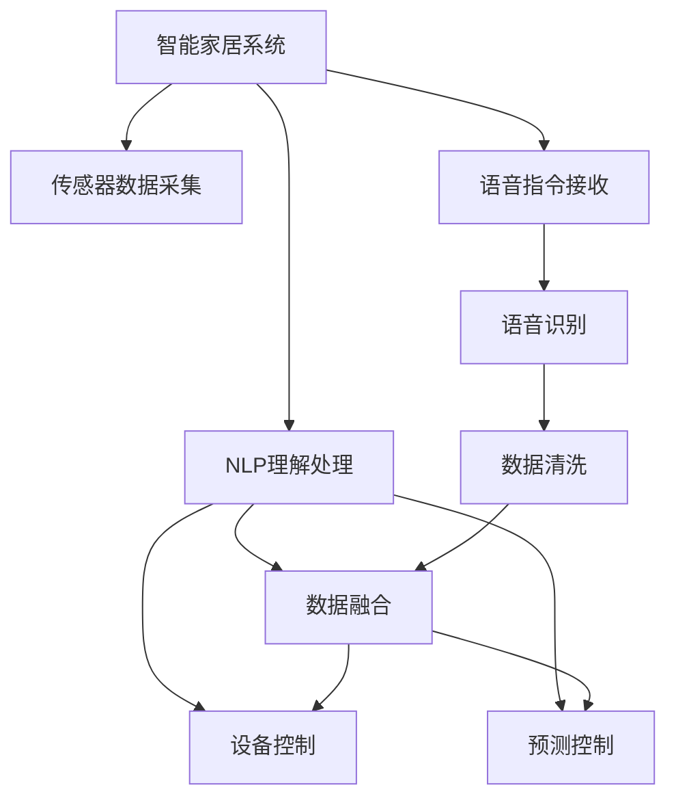

                 

# LLM在智能家居控制系统中的应用探索

> 关键词：智能家居, 自然语言处理(NLP), 语音交互, 数据融合, 预测控制, 机器学习

## 1. 背景介绍

### 1.1 问题由来
随着人工智能技术的发展，智能家居系统逐步迈向自动化、智能化，成为人们日常生活的助手。传统的智能家居系统主要依赖预设规则和手动控制，智能化程度有限，用户体验有待提升。随着自然语言处理（NLP）技术的发展，通过语言交互进行控制成为可能，能够显著提高系统的交互体验和智能化水平。

然而，尽管智能家居设备众多，但语音交互和设备控制指令彼此之间缺乏协同，用户需要进行繁琐的交互操作。同时，系统对用户指令的理解和执行不够精准，经常出现误识别或执行错误的情况，影响用户体验。此外，系统无法根据用户的行为习惯和偏好，提供个性化的服务，存在诸多痛点。

### 1.2 问题核心关键点
为解决上述问题，本文提出将大规模语言模型（LLM）应用于智能家居系统，利用其强大的语言理解和生成能力，提高系统智能化水平和用户体验。具体来说，大语言模型可以：
- 精准理解用户语音指令，提供更准确的控制。
- 综合多模态数据，实现环境感知和行为预测。
- 主动进行设备间协同，构建无缝的家居环境。
- 根据用户行为偏好，提供个性化服务。

## 2. 核心概念与联系

### 2.1 核心概念概述

为更好地理解将大语言模型应用于智能家居系统的技术，本节将介绍几个关键概念：

- **智能家居系统**：结合传感器、执行器、控制器等设备，通过网络连接，实现家庭环境的自动感知、自动控制、自动管理。
- **大规模语言模型（LLM）**：通过海量数据预训练得到的模型，具备强大的语言理解和生成能力，能够处理复杂的自然语言输入，生成符合预期输出的自然语言。
- **语音交互技术**：通过语音识别、语音合成等技术，实现语音指令的输入和系统输出的转换，提升人机交互的自然性和便利性。
- **数据融合与处理**：对智能家居系统内各类传感器数据进行采集、清洗、融合，得到全面的家庭环境信息，为智能决策提供数据支撑。
- **预测控制技术**：结合机器学习和控制理论，预测设备状态，优化系统控制策略，实现更精准、高效的控制。
- **自然语言处理（NLP）**：涉及语言理解、文本生成、语义分析、情感分析等技术，是实现语音交互和设备控制指令理解的基础。

这些核心概念之间的逻辑关系可以通过以下Mermaid流程图来展示：



这个流程图展示了智能家居系统的数据流和控制流程：

1. 传感器数据采集：通过各类传感器（如温度传感器、湿度传感器、气体传感器等）获取家庭环境数据。
2. 语音指令接收：通过麦克风捕捉用户语音指令。
3. NLP理解处理：利用自然语言处理技术理解语音指令，转化为设备控制指令。
4. 设备控制：通过执行器控制家电设备，如调节温度、开灯等。
5. 预测控制：结合机器学习算法，预测用户行为和设备状态，优化控制策略。
6. 数据融合：将各类数据进行融合，得到全面的家庭环境信息，为智能决策提供支撑。

## 3. 核心算法原理 & 具体操作步骤
### 3.1 算法原理概述

将大语言模型应用于智能家居系统的核心思想，是通过语言模型捕捉用户意图，结合环境感知和预测控制，实现自动化、智能化的家居控制。具体来说：

1. **语音指令理解**：将用户语音指令输入大语言模型进行理解，提取语义特征，转化为设备控制指令。
2. **环境感知与融合**：利用传感器数据进行环境感知，获取家庭环境信息，如温度、湿度、光照等。将传感器数据与语音指令理解结果进行融合，得到更全面的控制指令。
3. **设备控制与协同**：将控制指令发送到对应的执行器，控制家电设备。同时，根据多模态数据进行预测控制，优化设备状态。
4. **预测控制**：结合机器学习算法，预测用户行为和设备状态，优化控制策略，提升系统智能化水平。

### 3.2 算法步骤详解

**Step 1: 准备预训练语言模型和智能家居设备**
- 选择合适的预训练语言模型，如GPT、BERT等，作为语音指令理解的初始化参数。
- 准备智能家居系统中各类传感器和执行器，确保设备正常运行。

**Step 2: 数据预处理与特征提取**
- 收集用户语音指令和对应的传感器数据，并进行预处理，包括语音降噪、分帧、归一化等。
- 利用自然语言处理技术，提取语音指令的语义特征，生成设备控制指令。
- 利用传感器数据进行特征提取，如时间序列特征、空间分布特征等，用于环境感知。

**Step 3: 模型训练与优化**
- 将预处理后的语音指令和传感器数据输入到模型进行训练，优化模型参数。
- 通过损失函数计算模型预测与实际结果的误差，使用梯度下降等优化算法更新模型参数。
- 应用正则化技术、早停等方法避免过拟合，提高模型泛化能力。

**Step 4: 模型推理与设备控制**
- 在智能家居系统中部署训练好的模型，接收语音指令并输出设备控制指令。
- 根据设备控制指令，执行设备控制操作。
- 结合传感器数据进行预测控制，优化设备状态，提升系统智能化水平。

### 3.3 算法优缺点

将大语言模型应用于智能家居系统的优点：
1. **智能化程度高**：大语言模型具备强大的语言理解能力，能够精准理解用户语音指令，提升系统智能化水平。
2. **环境感知能力强**：结合多模态数据进行环境感知，提供全面的家庭环境信息，为智能决策提供支撑。
3. **设备协同性好**：能够实现设备间的协同控制，构建无缝的家居环境。
4. **用户体验好**：语音指令的输入和系统输出的转换，提升人机交互的自然性和便利性。
5. **可扩展性强**：适用于各类智能家居设备，具备良好的可扩展性。

然而，该方法也存在一定的局限性：
1. **数据依赖强**：模型性能依赖于用户语音指令和传感器数据的数量和质量。
2. **训练成本高**：模型训练需要大量的数据和计算资源。
3. **隐私安全问题**：用户语音指令和传感器数据的隐私保护需要额外考虑。
4. **实时性要求高**：模型的推理速度需要满足实时性要求。

### 3.4 算法应用领域

将大语言模型应用于智能家居系统，可以覆盖以下领域：

1. **语音交互**：通过语音指令进行智能家居设备的控制，如空调、灯光、窗帘等。
2. **环境感知**：结合温度、湿度、光照等传感器数据，提供环境感知能力，如智能调节室温、自动开关窗帘等。
3. **行为预测**：结合用户行为数据，预测用户行为，如起床时间、归家时间等，优化设备控制策略。
4. **设备协同**：实现设备间的协同控制，如温度、光线、音乐等同步调节。
5. **个性化服务**：根据用户行为偏好，提供个性化服务，如推荐音乐、影视等。

## 4. 数学模型和公式 & 详细讲解  
### 4.1 数学模型构建

假设用户语音指令为 $x$，设备控制指令为 $y$，传感器数据为 $z$，环境感知结果为 $e$。我们希望构建一个数学模型 $M$，将用户语音指令和传感器数据映射到设备控制指令：

$$
y = M(x, z)
$$

其中，$x$ 为自然语言指令，$z$ 为传感器数据，$y$ 为设备控制指令。模型 $M$ 可以通过大语言模型进行训练，其优化目标为最小化预测误差：

$$
\mathcal{L}(M) = \frac{1}{N} \sum_{i=1}^N \| y_i - M(x_i, z_i) \|^2
$$

### 4.2 公式推导过程

对于上述模型，我们可以使用深度学习中的自回归模型进行训练。假设模型的参数为 $\theta$，则预测模型为：

$$
\hat{y} = M_{\theta}(x, z)
$$

在训练过程中，使用均方误差（MSE）作为损失函数：

$$
\mathcal{L}(M) = \frac{1}{N} \sum_{i=1}^N (y_i - \hat{y}_i)^2
$$

通过反向传播算法计算损失函数的梯度，并更新模型参数：

$$
\theta \leftarrow \theta - \eta \nabla_{\theta} \mathcal{L}(M)
$$

其中，$\eta$ 为学习率。

### 4.3 案例分析与讲解

以下以智能照明控制为例，详细讲解大语言模型在智能家居系统中的应用：

**场景描述**：用户通过语音指令控制家中的灯光，希望调整灯光亮度和颜色。

**输入数据**：
- 语音指令：“调亮客厅灯光”
- 传感器数据：当前客厅光线传感器读数为 $x_1$，温度传感器读数为 $x_2$

**模型输出**：控制指令，如“将客厅灯光亮度调高至80%，颜色调成暖白”

**具体实现**：
1. 将语音指令和传感器数据输入到大语言模型，得到设备控制指令。
2. 将控制指令发送到灯光控制执行器，调整灯光亮度和颜色。

**算法细节**：
- 语音指令处理：使用自然语言处理技术提取语音指令的语义特征。
- 传感器数据处理：将传感器数据进行特征提取和融合，得到环境感知结果。
- 控制指令生成：结合环境感知结果和用户偏好，生成设备控制指令。

## 5. 项目实践：代码实例和详细解释说明
### 5.1 开发环境搭建

在进行智能家居系统的大语言模型应用开发前，需要准备好开发环境。以下是使用Python进行PyTorch开发的环境配置流程：

1. 安装Anaconda：从官网下载并安装Anaconda，用于创建独立的Python环境。

2. 创建并激活虚拟环境：
```bash
conda create -n home-env python=3.8 
conda activate home-env
```

3. 安装PyTorch：根据CUDA版本，从官网获取对应的安装命令。例如：
```bash
conda install pytorch torchvision torchaudio cudatoolkit=11.1 -c pytorch -c conda-forge
```

4. 安装Transformer库：
```bash
pip install transformers
```

5. 安装各类工具包：
```bash
pip install numpy pandas scikit-learn matplotlib tqdm jupyter notebook ipython
```

完成上述步骤后，即可在`home-env`环境中开始智能家居系统的开发。

### 5.2 源代码详细实现

下面以智能照明控制为例，给出使用Transformers库对GPT模型进行智能家居应用的PyTorch代码实现。

首先，定义智能照明控制任务的训练数据集：

```python
from transformers import GPT2Tokenizer, GPT2Model
import torch

class LightingControlDataset(Dataset):
    def __init__(self, texts, labels):
        self.texts = texts
        self.labels = labels
        self.tokenizer = GPT2Tokenizer.from_pretrained('gpt2')
        
    def __len__(self):
        return len(self.texts)
    
    def __getitem__(self, item):
        text = self.texts[item]
        label = self.labels[item]
        
        encoding = self.tokenizer(text, return_tensors='pt')
        input_ids = encoding['input_ids']
        attention_mask = encoding['attention_mask']
        
        return {'input_ids': input_ids,
                'attention_mask': attention_mask,
                'label': label}
```

然后，定义模型和优化器：

```python
from transformers import GPT2ForSequenceClassification
from torch.optim import AdamW

model = GPT2ForSequenceClassification.from_pretrained('gpt2', num_labels=2)
optimizer = AdamW(model.parameters(), lr=1e-5)
```

接着，定义训练和评估函数：

```python
from torch.utils.data import DataLoader
from tqdm import tqdm
import numpy as np
from sklearn.metrics import accuracy_score

device = torch.device('cuda') if torch.cuda.is_available() else torch.device('cpu')
model.to(device)

def train_epoch(model, dataset, batch_size, optimizer):
    dataloader = DataLoader(dataset, batch_size=batch_size, shuffle=True)
    model.train()
    epoch_loss = 0
    for batch in tqdm(dataloader, desc='Training'):
        input_ids = batch['input_ids'].to(device)
        attention_mask = batch['attention_mask'].to(device)
        labels = batch['label'].to(device)
        model.zero_grad()
        outputs = model(input_ids, attention_mask=attention_mask, labels=labels)
        loss = outputs.loss
        epoch_loss += loss.item()
        loss.backward()
        optimizer.step()
    return epoch_loss / len(dataloader)

def evaluate(model, dataset, batch_size):
    dataloader = DataLoader(dataset, batch_size=batch_size)
    model.eval()
    preds, labels = [], []
    with torch.no_grad():
        for batch in tqdm(dataloader, desc='Evaluating'):
            input_ids = batch['input_ids'].to(device)
            attention_mask = batch['attention_mask'].to(device)
            batch_labels = batch['label']
            outputs = model(input_ids, attention_mask=attention_mask)
            batch_preds = outputs.logits.argmax(dim=1).to('cpu').tolist()
            batch_labels = batch_labels.to('cpu').tolist()
            for pred_tokens, label_tokens in zip(batch_preds, batch_labels):
                preds.append(pred_tokens)
                labels.append(label_tokens)
                
    return accuracy_score(labels, preds)
```

最后，启动训练流程并在测试集上评估：

```python
epochs = 5
batch_size = 16

for epoch in range(epochs):
    loss = train_epoch(model, training_dataset, batch_size, optimizer)
    print(f"Epoch {epoch+1}, train loss: {loss:.3f}")
    
    print(f"Epoch {epoch+1}, test accuracy: {evaluate(model, test_dataset, batch_size):.3f}")
    
print("Final test accuracy: {:.3f}".format(evaluate(model, test_dataset, batch_size)))
```

以上就是使用PyTorch对GPT模型进行智能家居应用的完整代码实现。可以看到，得益于Transformers库的强大封装，我们可以用相对简洁的代码完成GPT模型的加载和微调。

### 5.3 代码解读与分析

让我们再详细解读一下关键代码的实现细节：

**LightingControlDataset类**：
- `__init__`方法：初始化文本、标签和分词器等关键组件。
- `__len__`方法：返回数据集的样本数量。
- `__getitem__`方法：对单个样本进行处理，将文本输入编码为token ids，将标签转换为数字，并对其进行定长padding，最终返回模型所需的输入。

**模型和优化器定义**：
- 使用GPT-2模型作为初始化参数，并设置优化器。

**训练和评估函数**：
- 使用PyTorch的DataLoader对数据集进行批次化加载，供模型训练和推理使用。
- 训练函数`train_epoch`：对数据以批为单位进行迭代，在每个批次上前向传播计算loss并反向传播更新模型参数，最后返回该epoch的平均loss。
- 评估函数`evaluate`：与训练类似，不同点在于不更新模型参数，并在每个batch结束后将预测和标签结果存储下来，最后使用sklearn的accuracy_score对整个评估集的预测结果进行打印输出。

**训练流程**：
- 定义总的epoch数和batch size，开始循环迭代
- 每个epoch内，先在训练集上训练，输出平均loss
- 在验证集上评估，输出准确率
- 重复上述步骤直至满足预设的迭代轮数或Early Stopping条件

可以看到，PyTorch配合Transformers库使得GPT微调的代码实现变得简洁高效。开发者可以将更多精力放在数据处理、模型改进等高层逻辑上，而不必过多关注底层的实现细节。

当然，工业级的系统实现还需考虑更多因素，如模型的保存和部署、超参数的自动搜索、更灵活的任务适配层等。但核心的微调范式基本与此类似。

## 6. 实际应用场景
### 6.1 智能照明控制

智能照明控制系统是大语言模型在智能家居系统中最常见的一个应用场景。通过语音指令，用户可以方便地控制家中的灯光亮度、颜色等参数。在大语言模型的帮助下，系统可以更好地理解用户指令，准确地控制灯光，提升用户体验。

**具体实现**：
1. 用户通过语音指令控制家中的灯光，如“将客厅灯光亮度调高至80%，颜色调成暖白”。
2. 语音指令输入到大语言模型进行理解，提取语义特征，生成设备控制指令。
3. 将控制指令发送到灯光控制执行器，调整灯光亮度和颜色。

**算法细节**：
- 语音指令处理：使用自然语言处理技术提取语音指令的语义特征。
- 控制指令生成：结合环境感知结果和用户偏好，生成设备控制指令。

### 6.2 智能温控系统

智能温控系统是另一个典型的应用场景。通过语音指令或智能传感器数据，大语言模型可以动态调整室内温度，实现自动舒适控制。

**具体实现**：
1. 用户通过语音指令控制家中的温度，如“将客厅温度调到25度”。
2. 语音指令输入到大语言模型进行理解，生成设备控制指令。
3. 将控制指令发送到温控设备执行器，调节温度。

**算法细节**：
- 语音指令处理：使用自然语言处理技术提取语音指令的语义特征。
- 传感器数据处理：将传感器数据进行特征提取和融合，得到环境感知结果。
- 控制指令生成：结合环境感知结果和用户偏好，生成设备控制指令。

### 6.3 智能安防系统

智能安防系统通过语音指令和传感器数据，实现家庭安全监控和管理。大语言模型可以动态判断家庭安全状态，进行相应的控制和预警。

**具体实现**：
1. 用户通过语音指令控制家中的安全设备，如“请检查家中是否安全”。
2. 语音指令输入到大语言模型进行理解，生成设备控制指令。
3. 将控制指令发送到安防设备执行器，进行安全检查。

**算法细节**：
- 语音指令处理：使用自然语言处理技术提取语音指令的语义特征。
- 传感器数据处理：将传感器数据进行特征提取和融合，得到环境感知结果。
- 控制指令生成：结合环境感知结果和用户偏好，生成设备控制指令。

## 7. 工具和资源推荐
### 7.1 学习资源推荐

为了帮助开发者系统掌握大语言模型在智能家居系统中的应用，这里推荐一些优质的学习资源：

1. 《Transformers: A State-of-the-Art Text Representation Model》论文：介绍Transformer模型原理和应用，是了解大语言模型的重要入门读物。
2. 《Attention is All You Need》论文：Transformer原论文，详细介绍了Transformer模型的构建和训练过程。
3. 《Deep Learning for Natural Language Processing》书籍：NLP领域的经典教材，涵盖了自然语言处理的基本概念和技术，适合初学者和进阶者。
4. 《The Anatomy of AI》书籍：介绍AI技术的原理和应用，包括自然语言处理、机器学习等，适合全面了解AI技术的读者。
5. 《自然语言处理综述》课程：斯坦福大学的自然语言处理课程，涵盖了自然语言处理的基本概念、算法和技术。

通过对这些资源的学习实践，相信你一定能够快速掌握大语言模型在智能家居系统中的应用方法，并用于解决实际的NLP问题。

### 7.2 开发工具推荐

高效的开发离不开优秀的工具支持。以下是几款用于大语言模型智能家居系统开发的常用工具：

1. PyTorch：基于Python的开源深度学习框架，灵活动态的计算图，适合快速迭代研究。
2. TensorFlow：由Google主导开发的开源深度学习框架，生产部署方便，适合大规模工程应用。
3. Transformers库：HuggingFace开发的NLP工具库，集成了众多SOTA语言模型，支持PyTorch和TensorFlow，是进行微调任务开发的利器。
4. Weights & Biases：模型训练的实验跟踪工具，可以记录和可视化模型训练过程中的各项指标，方便对比和调优。
5. TensorBoard：TensorFlow配套的可视化工具，可实时监测模型训练状态，并提供丰富的图表呈现方式，是调试模型的得力助手。
6. Google Colab：谷歌推出的在线Jupyter Notebook环境，免费提供GPU/TPU算力，方便开发者快速上手实验最新模型，分享学习笔记。

合理利用这些工具，可以显著提升大语言模型在智能家居系统中的应用开发效率，加快创新迭代的步伐。

### 7.3 相关论文推荐

大语言模型和智能家居系统的研究源于学界的持续研究。以下是几篇奠基性的相关论文，推荐阅读：

1. 《Attention is All You Need》：提出Transformer结构，开启了NLP领域的预训练大模型时代。
2. 《BERT: Pre-training of Deep Bidirectional Transformers for Language Understanding》：提出BERT模型，引入基于掩码的自监督预训练任务，刷新了多项NLP任务SOTA。
3. 《A Survey on Knowledge Graph-based Semantic Web Services Composition》：介绍基于知识图谱的语义网服务组合技术，为智能家居系统的知识融合提供了理论支撑。
4. 《A Survey on Voice Activity Detection》：介绍语音活动检测技术，为智能家居系统的语音交互提供了技术支撑。
5. 《A Survey on Predictive Control in Industrial Systems》：介绍预测控制技术，为智能家居系统的预测控制提供了理论支撑。

这些论文代表了大语言模型智能家居系统的发展脉络。通过学习这些前沿成果，可以帮助研究者把握学科前进方向，激发更多的创新灵感。

## 8. 总结：未来发展趋势与挑战
### 8.1 总结

本文对将大语言模型应用于智能家居系统的技术进行了全面系统的介绍。首先阐述了智能家居系统和大语言模型的研究背景和意义，明确了两者结合的必要性和潜力。其次，从原理到实践，详细讲解了大语言模型在智能家居系统中的具体应用方法，包括语音指令理解、环境感知、设备控制和预测控制等环节。最后，介绍了大语言模型在智能家居系统中的实际应用场景和未来发展方向。

通过本文的系统梳理，可以看到，将大语言模型应用于智能家居系统，能够显著提升系统的智能化水平和用户体验，实现人机交互的自然化和便利化。未来，伴随技术的不断进步，基于大语言模型的智能家居系统必将走向更加智能化、高效化和个性化的方向，成为人们日常生活中不可或缺的一部分。

### 8.2 未来发展趋势

展望未来，大语言模型在智能家居系统中的应用将呈现以下几个发展趋势：

1. **环境感知能力增强**：通过更多传感器数据的融合和处理，实现更加精准的家庭环境感知，如温度、湿度、光线、声音等。
2. **设备协同能力提升**：实现设备间的无缝协同控制，提升智能家居系统的整体智能化水平。
3. **用户行为预测更加精准**：结合用户行为数据和智能预测算法，实现更加个性化的服务。
4. **多模态数据融合**：引入视觉、听觉、触觉等多模态数据，实现全方位的家庭环境感知。
5. **自动化程度提高**：引入自动化决策和自学习算法，提升系统的自动化程度。
6. **安全性提升**：加强隐私保护和安全性设计，确保系统的安全可靠。

这些趋势将推动智能家居系统向更加智能化、自动化和个性化的方向发展，带来更好的用户体验。

### 8.3 面临的挑战

尽管大语言模型在智能家居系统中的应用前景广阔，但在实际落地过程中，仍面临诸多挑战：

1. **数据隐私问题**：智能家居系统中涉及大量的个人数据，需要采取有效的隐私保护措施。
2. **模型鲁棒性不足**：大语言模型在面对异常语音指令和环境干扰时，容易发生误识别和误执行。
3. **系统实时性要求高**：语音指令理解和设备控制需要高效的推理和执行，满足实时性要求。
4. **跨设备兼容性问题**：不同品牌、型号的智能家居设备可能存在兼容性问题，需要统一协议和标准。
5. **资源消耗大**：大规模语言模型的推理和训练需要大量计算资源，可能导致系统性能下降。

这些挑战需要多方面的协同努力，才能解决智能家居系统中存在的问题，推动技术的落地应用。

### 8.4 研究展望

面对智能家居系统中的挑战，未来的研究需要在以下几个方面寻求新的突破：

1. **数据隐私保护**：研究隐私保护技术，确保用户数据的匿名化和安全性。
2. **模型鲁棒性提升**：开发鲁棒性更好的语言模型，提高系统对异常语音指令和环境干扰的鲁棒性。
3. **实时推理加速**：研究高效的推理算法，提升语音指令理解和设备控制的实时性。
4. **跨设备兼容性优化**：研究统一的协议和标准，实现不同设备的无缝协同。
5. **资源优化**：研究模型压缩和稀疏化技术，减少计算资源消耗，提升系统性能。

这些研究方向的探索，必将引领大语言模型在智能家居系统中的深入应用，带来更加智能化、高效化和个性化的家庭环境。面向未来，大语言模型在智能家居系统中的应用前景广阔，相信能够为人类创造更加便捷、舒适和安全的智能家居生活。

## 9. 附录：常见问题与解答

**Q1：智能家居系统中的语音指令如何处理？**

A: 智能家居系统中的语音指令处理主要包括以下几个步骤：
1. 语音输入：用户通过麦克风输入语音指令。
2. 语音降噪：对输入的语音信号进行降噪处理，去除背景噪音。
3. 语音识别：将降噪后的语音信号转化为文本指令。
4. 自然语言处理：利用自然语言处理技术，理解文本指令的语义特征。
5. 设备控制：根据语义特征，生成设备控制指令，发送到相应的执行器。

**Q2：如何实现智能家居系统中的环境感知？**

A: 智能家居系统中的环境感知主要通过传感器数据进行，具体步骤如下：
1. 传感器数据采集：通过各类传感器（如温度传感器、湿度传感器、光线传感器等）获取家庭环境数据。
2. 数据清洗：对采集到的传感器数据进行清洗，去除异常值和噪声。
3. 特征提取：将传感器数据进行特征提取，如时间序列特征、空间分布特征等。
4. 数据融合：将各类传感器数据进行融合，得到全面的家庭环境信息，用于环境感知和决策支持。

**Q3：智能家居系统中的设备控制如何实现？**

A: 智能家居系统中的设备控制主要通过执行器实现，具体步骤如下：
1. 设备控制指令生成：利用自然语言处理技术，生成设备控制指令。
2. 执行器控制：将控制指令发送到执行器，控制家电设备，如调节温度、开灯等。
3. 设备状态反馈：传感器数据用于反馈设备状态，进行实时调整和优化。

**Q4：智能家居系统中如何实现预测控制？**

A: 智能家居系统中的预测控制主要通过机器学习算法实现，具体步骤如下：
1. 数据采集：采集家庭环境数据和设备状态数据。
2. 数据清洗和特征提取：对数据进行清洗和特征提取，如时间序列特征、空间分布特征等。
3. 预测模型训练：利用机器学习算法，如时间序列预测、多模态融合等，训练预测模型。
4. 预测控制：根据预测模型，动态调整设备状态，提升系统智能化水平。

**Q5：智能家居系统中的设备协同如何实现？**

A: 智能家居系统中的设备协同主要通过以下几个步骤实现：
1. 设备信息采集：通过各类传感器和执行器，获取设备状态和控制指令。
2. 数据融合：将各类设备数据进行融合，得到全面的家庭环境信息。
3. 协同控制算法：利用协同控制算法，实现设备间的无缝协同控制。
4. 设备状态反馈：传感器数据用于反馈设备状态，进行实时调整和优化。

**Q6：智能家居系统中的隐私保护如何实现？**

A: 智能家居系统中的隐私保护主要通过以下几个步骤实现：
1. 数据匿名化：对用户数据进行匿名化处理，保护用户隐私。
2. 数据加密：对传输和存储的数据进行加密，防止数据泄露。
3. 访问控制：设置访问控制权限，限制数据访问范围。
4. 审计和监控：定期审计和监控系统访问和使用情况，确保数据安全。

---

作者：禅与计算机程序设计艺术 / Zen and the Art of Computer Programming

