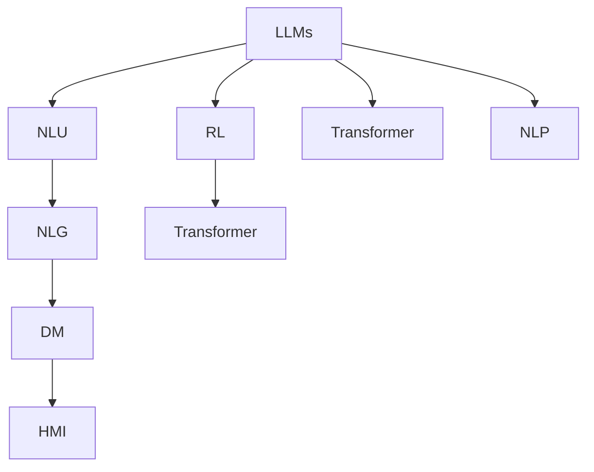

                 

# LLM在智能对话系统中的潜力

> 关键词：
- Large Language Models (LLM)
- Natural Language Understanding (NLU)
- Natural Language Generation (NLG)
- Conversational AI
- Reinforcement Learning (RL)
- Transformer
- Dialogue Management (DM)
- Human-Machine Interaction (HMI)

## 1. 背景介绍

### 1.1 问题由来

随着人工智能技术的快速发展，智能对话系统成为了自然语言处理(NLP)领域的一个热门话题。传统基于规则的对话系统虽然能够处理一些简单的对话，但在面对复杂多变的用户需求时显得力不从心。智能对话系统需要具备高度的自然语言理解能力，能够在多轮对话中保持上下文一致性，灵活应对用户的各种意图和表达方式。

近年来，预训练语言模型(LLMs)在对话系统中的应用日益广泛，这些模型通过大规模无标签文本数据的预训练，能够学习到丰富的语言知识，为智能对话系统的构建提供了坚实的基础。LLMs在对话系统中的应用，不仅能够显著提升系统的智能水平，还能够增强用户体验，提高系统覆盖面的广度。

### 1.2 问题核心关键点

智能对话系统中的LLM应用主要集中在自然语言理解(NLU)和自然语言生成(NLG)两个方面：

- **自然语言理解(NLU)**：指系统能够理解用户的自然语言输入，并将其转换为结构化的信息供系统后续处理。LLM通过自监督学习或监督学习的方式，学习语言和语义表示，能够准确识别用户意图和上下文信息，为对话管理提供基础。

- **自然语言生成(NLG)**：指系统能够根据用户的意图和上下文信息，生成自然流畅的回答。LLM能够学习语言规则和语义结构，生成上下文一致、逻辑连贯的回复。

智能对话系统中的LLM应用需要结合对话管理和对话历史，进行动态推理和响应生成，保证对话过程流畅自然。同时，LLM在智能对话系统中的应用也需要考虑计算效率、推理稳定性等问题。

## 2. 核心概念与联系

### 2.1 核心概念概述

为更好地理解LLM在智能对话系统中的应用，本节将介绍几个关键概念及其联系：

- **Large Language Models (LLMs)**：指通过大规模无标签文本数据预训练得到的语言模型，具有强大的语言理解和生成能力。例如GPT、BERT、T5等。

- **Natural Language Understanding (NLU)**：指系统能够理解自然语言输入，并将其转换为结构化的信息。NLU是智能对话系统的基础，通过NLU模型可以准确理解用户的意图和上下文信息。

- **Natural Language Generation (NLG)**：指系统能够根据用户的意图和上下文信息，生成自然流畅的回答。NLG是智能对话系统的重要组成部分，通过NLG模型能够生成上下文一致、逻辑连贯的回复。

- **Conversational AI**：指利用自然语言理解和生成的技术，构建能够进行多轮对话的系统。智能对话系统是Conversational AI的重要应用场景之一。

- **Reinforcement Learning (RL)**：指通过奖励机制训练模型，使其在特定任务上表现更好的学习范式。在智能对话系统中，RL可以用于优化对话管理策略，提升对话体验。

- **Transformer**：指一种高效的神经网络结构，常用于构建预训练语言模型。Transformer能够处理长序列数据，适合于对话系统的多轮对话处理。

- **Dialogue Management (DM)**：指系统根据用户的意图和上下文信息，动态生成响应，保持对话流畅自然。DM是智能对话系统的核心部分，需要结合NLU、NLG和RL技术。

- **Human-Machine Interaction (HMI)**：指人机交互的过程，智能对话系统通过NLU、NLG和DM技术，提升人机交互的自然流畅性。

这些核心概念之间的逻辑关系可以通过以下Mermaid流程图来展示：



这个流程图展示了大语言模型在智能对话系统中的应用框架：

1. 大语言模型通过自监督或监督学习的方式，学习语言和语义表示，为NLU和NLG提供基础。
2. NLU模型能够准确理解用户的意图和上下文信息，是对话管理的基础。
3. NLG模型能够生成自然流畅的回答，是对话系统的重要组成部分。
4. 对话管理模型结合NLU和NLG，动态生成响应，保持对话流畅自然。
5. 对话管理模型结合RL技术，优化对话策略，提升对话体验。
6. Transformer结构用于构建预训练语言模型，适合于对话系统的多轮对话处理。

这些概念共同构成了智能对话系统的技术框架，使得大语言模型在对话系统中的应用变得可行和高效。

## 3. 核心算法原理 & 具体操作步骤

### 3.1 算法原理概述

LLM在智能对话系统中的应用，主要依赖于其在NLU和NLG方面的能力。NLU和NLG的算法原理如下：

- **NLU算法**：NLU算法通过训练一个文本分类器，将输入文本分为不同的意图类别。例如，将用户输入的文本分类为询问信息、请求服务、反馈建议等类别。NLU算法通常采用监督学习或迁移学习的方法，通过标注数据进行训练。

- **NLG算法**：NLG算法通过训练一个生成模型，根据用户的意图和上下文信息，生成自然流畅的回答。NLG算法通常采用生成对抗网络(GAN)、变分自编码器(VAE)等生成模型，通过大量的对话数据进行训练。

### 3.2 算法步骤详解

基于LLM的智能对话系统构建过程大致分为以下几个步骤：

**Step 1: 准备数据集**

1. **收集对话数据**：收集包含多轮对话的对话数据集，例如客服对话、智能客服、虚拟助手等对话记录。
2. **数据预处理**：对对话数据进行清洗、标注等预处理，将其转换为模型训练所需的格式。

**Step 2: 训练NLU模型**

1. **构建模型架构**：选择合适的NLU模型架构，例如Transformer、LSTM等。
2. **数据集划分**：将对话数据划分为训练集、验证集和测试集。
3. **模型训练**：使用训练集对NLU模型进行监督学习或迁移学习，优化模型参数。
4. **模型评估**：在验证集上评估模型性能，调整模型参数。

**Step 3: 训练NLG模型**

1. **构建模型架构**：选择合适的NLG模型架构，例如GPT-3、T5等。
2. **数据集划分**：将对话数据划分为训练集、验证集和测试集。
3. **模型训练**：使用训练集对NLG模型进行监督学习或迁移学习，优化模型参数。
4. **模型评估**：在验证集上评估模型性能，调整模型参数。

**Step 4: 对话管理**

1. **构建对话管理模型**：选择合适的对话管理模型架构，例如Seq2Seq、RL等。
2. **数据集划分**：将对话数据划分为训练集、验证集和测试集。
3. **模型训练**：使用训练集对对话管理模型进行监督学习或迁移学习，优化模型参数。
4. **模型评估**：在验证集上评估模型性能，调整模型参数。

**Step 5: 模型集成**

1. **模型集成**：将NLU、NLG和对话管理模型进行集成，形成完整的智能对话系统。
2. **系统测试**：在测试集上测试系统的各项功能，包括意图识别、上下文理解、动态推理和回复生成等。
3. **系统优化**：根据测试结果，调整模型参数和系统配置，优化系统性能。

### 3.3 算法优缺点

基于LLM的智能对话系统具有以下优点：

1. **高准确性**：LLM在NLU和NLG方面具有强大的语言理解和生成能力，能够准确理解用户意图和生成自然流畅的回答。
2. **灵活性**：LLM能够适应多种对话场景，灵活应对用户的各种意图和表达方式。
3. **可扩展性**：LLM可以通过微调或迁移学习的方式，轻松适应新任务和新场景。

同时，该方法也存在以下局限性：

1. **计算资源需求高**：LLM通常需要大量的计算资源进行训练和推理，对硬件要求较高。
2. **数据依赖性高**：LLM需要大量的标注数据进行训练，数据获取和标注成本较高。
3. **可解释性不足**：LLM的内部决策过程较为复杂，难以解释其推理逻辑和决策依据。

尽管存在这些局限性，但就目前而言，基于LLM的智能对话系统仍是大规模自然语言处理任务的重要范式。未来相关研究的重点在于如何进一步降低对计算资源和标注数据的依赖，提高模型的可解释性和鲁棒性。

### 3.4 算法应用领域

基于LLM的智能对话系统已经在多个领域得到了广泛的应用，例如：

- **客户服务**：智能客服系统通过对话管理模型和NLG模型，自动回答客户咨询，提升服务效率和用户体验。
- **医疗咨询**：智能医疗咨询系统通过对话管理模型和NLU模型，准确理解患者需求，提供个性化的医疗建议。
- **金融顾问**：智能金融顾问系统通过对话管理模型和NLU模型，提供个性化的金融咨询和理财建议。
- **教育辅助**：智能教育系统通过对话管理模型和NLU模型，辅助教师和学生进行互动学习，提升教育效果。
- **娱乐交互**：智能娱乐系统通过对话管理模型和NLG模型，与用户进行多轮对话，提升互动体验。

除了上述这些经典应用外，智能对话系统还被创新性地应用到更多场景中，如虚拟助手、智能家居、智能交通等，为各行各业带来了新的解决方案。

## 4. 数学模型和公式 & 详细讲解 & 举例说明

### 4.1 数学模型构建

本节将使用数学语言对基于LLM的智能对话系统进行更加严格的刻画。

记对话数据集为 $D=\{(\text{input}_i, \text{output}_i)\}_{i=1}^N$，其中 $\text{input}_i$ 为用户的自然语言输入，$\text{output}_i$ 为系统的自然语言输出。假设NLU模型为 $F_{\theta_{\text{NLU}}}$，NLG模型为 $G_{\theta_{\text{NLG}}}$，对话管理模型为 $H_{\theta_{\text{DM}}}$。

**NLU模型**：NLU模型通过训练一个文本分类器，将输入文本分为不同的意图类别。例如，将用户输入的文本分类为询问信息、请求服务、反馈建议等类别。NLU模型可以表示为：

$$
\text{category}_i = F_{\theta_{\text{NLU}}}(\text{input}_i)
$$

其中 $\text{category}_i$ 表示第 $i$ 次对话的意图类别。

**NLG模型**：NLG模型通过训练一个生成模型，根据用户的意图和上下文信息，生成自然流畅的回答。NLG模型可以表示为：

$$
\text{response}_i = G_{\theta_{\text{NLG}}}(\text{input}_i, \text{context}_i, \text{category}_i)
$$

其中 $\text{response}_i$ 表示第 $i$ 次对话的回复，$\text{context}_i$ 表示对话历史信息。

**对话管理模型**：对话管理模型通过动态推理和生成响应，保持对话流畅自然。对话管理模型可以表示为：

$$
\text{response}_i = H_{\theta_{\text{DM}}}(\text{input}_i, \text{context}_i, \text{category}_i)
$$

在实践中，NLU、NLG和对话管理模型的训练过程通常是交替进行的。首先，使用标注数据对NLU和NLG模型进行训练，然后在训练后的模型上进行对话管理模型的训练。

### 4.2 公式推导过程

以下我们以多轮对话为例，推导基于LLM的智能对话系统的工作流程。

假设用户输入 $u_1$，系统输出的意图类别为 $c_1$，对话历史为 $C_0$，系统回复为 $r_1$。根据对话管理模型的定义，有：

$$
\text{response}_1 = H_{\theta_{\text{DM}}}(\text{input}_1, \text{context}_0, \text{category}_1)
$$

系统将 $r_1$ 作为新的上下文信息 $C_1$，继续与用户交互。假设用户输入 $u_2$，系统输出的意图类别为 $c_2$，对话历史为 $C_1$，系统回复为 $r_2$。根据对话管理模型的定义，有：

$$
\text{response}_2 = H_{\theta_{\text{DM}}}(\text{input}_2, \text{context}_1, \text{category}_2)
$$

依次类推，通过多轮对话，系统能够动态生成自然流畅的回答，保持对话流畅自然。

### 4.3 案例分析与讲解

以智能客服系统为例，分析基于LLM的智能对话系统的工作流程：

1. **NLU模型**：系统通过NLU模型，准确理解用户输入的意图和上下文信息。例如，用户输入 "我想查询余额"，系统通过NLU模型识别出意图为查询余额，并记录上下文信息。

2. **对话管理模型**：系统通过对话管理模型，动态生成响应。例如，系统查询用户的账户信息，并生成回复 "您的余额为 X 元"。

3. **NLG模型**：系统通过NLG模型，生成自然流畅的回答。例如，系统将生成的回复转换为自然语言，回答用户问题。

4. **用户反馈**：系统将用户反馈信息作为新的上下文信息，继续与用户交互。例如，用户反馈 "余额不对"，系统重新查询用户账户信息，并生成新的回复。

通过上述过程，系统能够自动理解用户意图，动态生成响应，保持对话流畅自然。

## 5. 项目实践：代码实例和详细解释说明

### 5.1 开发环境搭建

在进行LLM在智能对话系统中的应用实践前，我们需要准备好开发环境。以下是使用Python进行PyTorch开发的环境配置流程：

1. 安装Anaconda：从官网下载并安装Anaconda，用于创建独立的Python环境。

2. 创建并激活虚拟环境：
```bash
conda create -n pytorch-env python=3.8 
conda activate pytorch-env
```

3. 安装PyTorch：根据CUDA版本，从官网获取对应的安装命令。例如：
```bash
conda install pytorch torchvision torchaudio cudatoolkit=11.1 -c pytorch -c conda-forge
```

4. 安装Transformers库：
```bash
pip install transformers
```

5. 安装各类工具包：
```bash
pip install numpy pandas scikit-learn matplotlib tqdm jupyter notebook ipython
```

完成上述步骤后，即可在`pytorch-env`环境中开始实践。

### 5.2 源代码详细实现

下面我们以智能客服系统为例，给出使用Transformers库对BERT模型进行对话管理模型微调的PyTorch代码实现。

首先，定义对话管理模型的训练函数：

```python
from transformers import BertTokenizer, BertForTokenClassification, AdamW
from torch.utils.data import Dataset, DataLoader

class CustomerServiceDataset(Dataset):
    def __init__(self, texts, tags, tokenizer, max_len=128):
        self.texts = texts
        self.tags = tags
        self.tokenizer = tokenizer
        self.max_len = max_len
        
    def __len__(self):
        return len(self.texts)
    
    def __getitem__(self, item):
        text = self.texts[item]
        tags = self.tags[item]
        
        encoding = self.tokenizer(text, return_tensors='pt', max_length=self.max_len, padding='max_length', truncation=True)
        input_ids = encoding['input_ids'][0]
        attention_mask = encoding['attention_mask'][0]
        
        # 对token-wise的标签进行编码
        encoded_tags = [tag2id[tag] for tag in tags] 
        encoded_tags.extend([tag2id['O']] * (self.max_len - len(encoded_tags)))
        labels = torch.tensor(encoded_tags, dtype=torch.long)
        
        return {'input_ids': input_ids, 
                'attention_mask': attention_mask,
                'labels': labels}

# 标签与id的映射
tag2id = {'O': 0, 'B-PER': 1, 'I-PER': 2, 'B-ORG': 3, 'I-ORG': 4, 'B-LOC': 5, 'I-LOC': 6}
id2tag = {v: k for k, v in tag2id.items()}

# 创建dataset
tokenizer = BertTokenizer.from_pretrained('bert-base-cased')

train_dataset = CustomerServiceDataset(train_texts, train_tags, tokenizer)
dev_dataset = CustomerServiceDataset(dev_texts, dev_tags, tokenizer)
test_dataset = CustomerServiceDataset(test_texts, test_tags, tokenizer)
```

然后，定义模型和优化器：

```python
from transformers import BertForTokenClassification, AdamW

model = BertForTokenClassification.from_pretrained('bert-base-cased', num_labels=len(tag2id))

optimizer = AdamW(model.parameters(), lr=2e-5)
```

接着，定义训练和评估函数：

```python
from torch.utils.data import DataLoader
from tqdm import tqdm
from sklearn.metrics import classification_report

device = torch.device('cuda') if torch.cuda.is_available() else torch.device('cpu')
model.to(device)

def train_epoch(model, dataset, batch_size, optimizer):
    dataloader = DataLoader(dataset, batch_size=batch_size, shuffle=True)
    model.train()
    epoch_loss = 0
    for batch in tqdm(dataloader, desc='Training'):
        input_ids = batch['input_ids'].to(device)
        attention_mask = batch['attention_mask'].to(device)
        labels = batch['labels'].to(device)
        model.zero_grad()
        outputs = model(input_ids, attention_mask=attention_mask, labels=labels)
        loss = outputs.loss
        epoch_loss += loss.item()
        loss.backward()
        optimizer.step()
    return epoch_loss / len(dataloader)

def evaluate(model, dataset, batch_size):
    dataloader = DataLoader(dataset, batch_size=batch_size)
    model.eval()
    preds, labels = [], []
    with torch.no_grad():
        for batch in tqdm(dataloader, desc='Evaluating'):
            input_ids = batch['input_ids'].to(device)
            attention_mask = batch['attention_mask'].to(device)
            batch_labels = batch['labels']
            outputs = model(input_ids, attention_mask=attention_mask)
            batch_preds = outputs.logits.argmax(dim=2).to('cpu').tolist()
            batch_labels = batch_labels.to('cpu').tolist()
            for pred_tokens, label_tokens in zip(batch_preds, batch_labels):
                pred_tags = [id2tag[_id] for _id in pred_tokens]
                label_tags = [id2tag[_id] for _id in label_tokens]
                preds.append(pred_tags[:len(label_tags)])
                labels.append(label_tags)
                
    print(classification_report(labels, preds))
```

最后，启动训练流程并在测试集上评估：

```python
epochs = 5
batch_size = 16

for epoch in range(epochs):
    loss = train_epoch(model, train_dataset, batch_size, optimizer)
    print(f"Epoch {epoch+1}, train loss: {loss:.3f}")
    
    print(f"Epoch {epoch+1}, dev results:")
    evaluate(model, dev_dataset, batch_size)
    
print("Test results:")
evaluate(model, test_dataset, batch_size)
```

以上就是使用PyTorch对BERT模型进行对话管理模型微调的完整代码实现。可以看到，得益于Transformers库的强大封装，我们可以用相对简洁的代码完成BERT模型的加载和微调。

### 5.3 代码解读与分析

让我们再详细解读一下关键代码的实现细节：

**CustomerServiceDataset类**：
- `__init__`方法：初始化文本、标签、分词器等关键组件。
- `__len__`方法：返回数据集的样本数量。
- `__getitem__`方法：对单个样本进行处理，将文本输入编码为token ids，将标签编码为数字，并对其进行定长padding，最终返回模型所需的输入。

**tag2id和id2tag字典**：
- 定义了标签与数字id之间的映射关系，用于将token-wise的预测结果解码回真实的标签。

**训练和评估函数**：
- 使用PyTorch的DataLoader对数据集进行批次化加载，供模型训练和推理使用。
- 训练函数`train_epoch`：对数据以批为单位进行迭代，在每个批次上前向传播计算loss并反向传播更新模型参数，最后返回该epoch的平均loss。
- 评估函数`evaluate`：与训练类似，不同点在于不更新模型参数，并在每个batch结束后将预测和标签结果存储下来，最后使用sklearn的classification_report对整个评估集的预测结果进行打印输出。

**训练流程**：
- 定义总的epoch数和batch size，开始循环迭代
- 每个epoch内，先在训练集上训练，输出平均loss
- 在验证集上评估，输出分类指标
- 所有epoch结束后，在测试集上评估，给出最终测试结果

可以看到，PyTorch配合Transformers库使得BERT微调的代码实现变得简洁高效。开发者可以将更多精力放在数据处理、模型改进等高层逻辑上，而不必过多关注底层的实现细节。

当然，工业级的系统实现还需考虑更多因素，如模型的保存和部署、超参数的自动搜索、更灵活的任务适配层等。但核心的微调范式基本与此类似。

## 6. 实际应用场景

### 6.1 智能客服系统

基于大语言模型微调的对话技术，可以广泛应用于智能客服系统的构建。传统客服往往需要配备大量人力，高峰期响应缓慢，且一致性和专业性难以保证。而使用微调后的对话模型，可以7x24小时不间断服务，快速响应客户咨询，用自然流畅的语言解答各类常见问题。

在技术实现上，可以收集企业内部的历史客服对话记录，将问题和最佳答复构建成监督数据，在此基础上对预训练对话模型进行微调。微调后的对话模型能够自动理解用户意图，匹配最合适的答案模板进行回复。对于客户提出的新问题，还可以接入检索系统实时搜索相关内容，动态组织生成回答。如此构建的智能客服系统，能大幅提升客户咨询体验和问题解决效率。

### 6.2 金融舆情监测

金融机构需要实时监测市场舆论动向，以便及时应对负面信息传播，规避金融风险。传统的人工监测方式成本高、效率低，难以应对网络时代海量信息爆发的挑战。基于大语言模型微调的文本分类和情感分析技术，为金融舆情监测提供了新的解决方案。

具体而言，可以收集金融领域相关的新闻、报道、评论等文本数据，并对其进行主题标注和情感标注。在此基础上对预训练语言模型进行微调，使其能够自动判断文本属于何种主题，情感倾向是正面、中性还是负面。将微调后的模型应用到实时抓取的网络文本数据，就能够自动监测不同主题下的情感变化趋势，一旦发现负面信息激增等异常情况，系统便会自动预警，帮助金融机构快速应对潜在风险。

### 6.3 个性化推荐系统

当前的推荐系统往往只依赖用户的历史行为数据进行物品推荐，无法深入理解用户的真实兴趣偏好。基于大语言模型微调技术，个性化推荐系统可以更好地挖掘用户行为背后的语义信息，从而提供更精准、多样的推荐内容。

在实践中，可以收集用户浏览、点击、评论、分享等行为数据，提取和用户交互的物品标题、描述、标签等文本内容。将文本内容作为模型输入，用户的后续行为（如是否点击、购买等）作为监督信号，在此基础上微调预训练语言模型。微调后的模型能够从文本内容中准确把握用户的兴趣点。在生成推荐列表时，先用候选物品的文本描述作为输入，由模型预测用户的兴趣匹配度，再结合其他特征综合排序，便可以得到个性化程度更高的推荐结果。

### 6.4 未来应用展望

随着大语言模型和微调方法的不断发展，基于微调范式将在更多领域得到应用，为传统行业带来变革性影响。

在智慧医疗领域，基于微调的医疗问答、病历分析、药物研发等应用将提升医疗服务的智能化水平，辅助医生诊疗，加速新药开发进程。

在智能教育领域，微调技术可应用于作业批改、学情分析、知识推荐等方面，因材施教，促进教育公平，提高教学质量。

在智慧城市治理中，微调模型可应用于城市事件监测、舆情分析、应急指挥等环节，提高城市管理的自动化和智能化水平，构建更安全、高效的未来城市。

此外，在企业生产、社会治理、文娱传媒等众多领域，基于大模型微调的人工智能应用也将不断涌现，为经济社会发展注入新的动力。相信随着技术的日益成熟，微调方法将成为人工智能落地应用的重要范式，推动人工智能技术向更广阔的领域加速渗透。

## 7. 工具和资源推荐

### 7.1 学习资源推荐

为了帮助开发者系统掌握大语言模型微调的理论基础和实践技巧，这里推荐一些优质的学习资源：

1. 《Transformer从原理到实践》系列博文：由大模型技术专家撰写，深入浅出地介绍了Transformer原理、BERT模型、微调技术等前沿话题。

2. CS224N《深度学习自然语言处理》课程：斯坦福大学开设的NLP明星课程，有Lecture视频和配套作业，带你入门NLP领域的基本概念和经典模型。

3. 《Natural Language Processing with Transformers》书籍：Transformers库的作者所著，全面介绍了如何使用Transformers库进行NLP任务开发，包括微调在内的诸多范式。

4. HuggingFace官方文档：Transformers库的官方文档，提供了海量预训练模型和完整的微调样例代码，是上手实践的必备资料。

5. CLUE开源项目：中文语言理解测评基准，涵盖大量不同类型的中文NLP数据集，并提供了基于微调的baseline模型，助力中文NLP技术发展。

通过对这些资源的学习实践，相信你一定能够快速掌握大语言模型微调的精髓，并用于解决实际的NLP问题。
###  7.2 开发工具推荐

高效的开发离不开优秀的工具支持。以下是几款用于大语言模型微调开发的常用工具：

1. PyTorch：基于Python的开源深度学习框架，灵活动态的计算图，适合快速迭代研究。大部分预训练语言模型都有PyTorch版本的实现。

2. TensorFlow：由Google主导开发的开源深度学习框架，生产部署方便，适合大规模工程应用。同样有丰富的预训练语言模型资源。

3. Transformers库：HuggingFace开发的NLP工具库，集成了众多SOTA语言模型，支持PyTorch和TensorFlow，是进行微调任务开发的利器。

4. Weights & Biases：模型训练的实验跟踪工具，可以记录和可视化模型训练过程中的各项指标，方便对比和调优。与主流深度学习框架无缝集成。

5. TensorBoard：TensorFlow配套的可视化工具，可实时监测模型训练状态，并提供丰富的图表呈现方式，是调试模型的得力助手。

6. Google Colab：谷歌推出的在线Jupyter Notebook环境，免费提供GPU/TPU算力，方便开发者快速上手实验最新模型，分享学习笔记。

合理利用这些工具，可以显著提升大语言模型微调任务的开发效率，加快创新迭代的步伐。

### 7.3 相关论文推荐

大语言模型和微调技术的发展源于学界的持续研究。以下是几篇奠基性的相关论文，推荐阅读：

1. Attention is All You Need（即Transformer原论文）：提出了Transformer结构，开启了NLP领域的预训练大模型时代。

2. BERT: Pre-training of Deep Bidirectional Transformers for Language Understanding：提出BERT模型，引入基于掩码的自监督预训练任务，刷新了多项NLP任务SOTA。

3. Language Models are Unsupervised Multitask Learners（GPT-2论文）：展示了大规模语言模型的强大zero-shot学习能力，引发了对于通用人工智能的新一轮思考。

4. Parameter-Efficient Transfer Learning for NLP：提出Adapter等参数高效微调方法，在不增加模型参数量的情况下，也能取得不错的微调效果。

5. Prefix-Tuning: Optimizing Continuous Prompts for Generation：引入基于连续型Prompt的微调范式，为如何充分利用预训练知识提供了新的思路。

6. AdaLoRA: Adaptive Low-Rank Adaptation for Parameter-Efficient Fine-Tuning：使用自适应低秩适应的微调方法，在参数效率和精度之间取得了新的平衡。

这些论文代表了大语言模型微调技术的发展脉络。通过学习这些前沿成果，可以帮助研究者把握学科前进方向，激发更多的创新灵感。

## 8. 总结：未来发展趋势与挑战

### 8.1 总结

本文对基于LLM的智能对话系统进行了全面系统的介绍。首先阐述了LLM在智能对话系统中的应用背景和意义，明确了微调在拓展预训练模型应用、提升对话系统性能方面的独特价值。其次，从原理到实践，详细讲解了基于LLM的对话管理模型的数学原理和关键步骤，给出了微调任务开发的完整代码实例。同时，本文还广泛探讨了微调方法在智能对话系统中的实际应用，展示了微调范式的巨大潜力。此外，本文精选了微调技术的各类学习资源，力求为读者提供全方位的技术指引。

通过本文的系统梳理，可以看到，基于大语言模型的对话管理模型在智能对话系统中的应用变得可行和高效。LLM通过强大的语言理解和生成能力，使得对话系统能够自动理解用户意图，生成自然流畅的回答，从而提升系统的智能水平和用户体验。未来，随着LLM和微调技术的不断进步，基于LLM的智能对话系统将在更广阔的领域得到应用，为各行各业带来全新的解决方案。

### 8.2 未来发展趋势

展望未来，基于LLM的智能对话系统将呈现以下几个发展趋势：

1. **多模态对话**：未来的智能对话系统将不再局限于文本对话，而是能够支持语音、图像、视频等多种模态的对话。多模态对话系统将能够更好地模拟人类的自然交互方式，提升用户体验。

2. **个性化推荐**：智能对话系统将不仅能够回答用户的问题，还能根据用户的兴趣和行为，推荐个性化的内容。基于LLM的推荐系统将更加精准、多样，能够更好地满足用户需求。

3. **多轮对话能力**：未来的智能对话系统将具备更强多轮对话能力，能够处理更加复杂的对话场景。通过对话管理模型和NLG模型的优化，智能对话系统将能够进行更加流畅、自然的对话。

4. **情感识别**：智能对话系统将能够更好地识别用户的情感状态，根据情感状态调整回答策略。基于LLM的情感识别技术将更加准确、自然，能够更好地提升用户体验。

5. **跨语言对话**：智能对话系统将能够支持多种语言的对话，通过多语言预训练和微调，使得系统能够处理多种语言的用户需求。

6. **连续学习和自适应**：智能对话系统将具备更好的连续学习和自适应能力，能够根据新数据和新用户不断优化对话策略，提升系统的泛化能力和鲁棒性。

以上趋势凸显了大语言模型在智能对话系统中的应用前景。这些方向的探索发展，必将进一步提升智能对话系统的性能和用户体验，为人工智能技术在更多领域的应用奠定基础。

### 8.3 面临的挑战

尽管基于LLM的智能对话系统已经取得了显著进展，但在迈向更加智能化、普适化应用的过程中，仍面临诸多挑战：

1. **数据质量和多样性**：高质量的对话数据对于LLM的微调至关重要。如何获取更多样、更丰富的对话数据，是智能对话系统需要解决的首要问题。

2. **计算资源消耗**：基于LLM的智能对话系统对计算资源的需求较高。如何优化模型架构和训练过程，降低资源消耗，提高系统的实时性和可扩展性，仍然是一个重要研究方向。

3. **可解释性不足**：LLM的内部决策过程较为复杂，难以解释其推理逻辑和决策依据。如何提高系统的可解释性和透明度，增强用户信任感，仍需进一步探索。

4. **安全性和隐私保护**：智能对话系统处理敏感信息的风险较高，如何保护用户隐私和数据安全，防止数据泄露和滥用，是系统开发过程中需要重点考虑的问题。

5. **跨领域泛化能力**：LLM在不同领域之间的泛化能力有限，如何提高系统在多领域之间的适应性和鲁棒性，仍需进一步研究。

尽管存在这些挑战，但通过学术界和工业界的共同努力，相信基于LLM的智能对话系统将在不断克服这些挑战中取得更大的进展，为智能交互的未来发展贡献力量。

### 8.4 研究展望

面对智能对话系统面临的种种挑战，未来的研究需要在以下几个方面寻求新的突破：

1. **数据增强和数据扩充**：如何通过数据增强和数据扩充技术，提高智能对话系统的数据质量和多样性，减少对标注数据的依赖，是未来的一个重要研究方向。

2. **模型压缩和加速**：如何通过模型压缩和加速技术，优化模型架构和训练过程，提高系统的实时性和可扩展性，是未来的一个重要研究方向。

3. **可解释性增强**：如何通过可解释性增强技术，提高系统的可解释性和透明度，增强用户信任感，是未来的一个重要研究方向。

4. **隐私保护技术**：如何通过隐私保护技术，保护用户隐私和数据安全，防止数据泄露和滥用，是未来的一个重要研究方向。

5. **多领域泛化**：如何通过多领域泛化技术，提高系统在不同领域之间的适应性和鲁棒性，是未来的一个重要研究方向。

这些研究方向的探索，必将引领智能对话系统走向更加智能化、普适化，为人工智能技术的广泛应用提供新的动力。面向未来，基于LLM的智能对话系统需要与其他人工智能技术进行更深入的融合，如知识表示、因果推理、强化学习等，多路径协同发力，共同推动智能交互系统的进步。只有勇于创新、敢于突破，才能不断拓展语言模型的边界，让智能技术更好地造福人类社会。

## 9. 附录：常见问题与解答

**Q1：大语言模型在智能对话系统中有什么优势？**

A: 大语言模型在智能对话系统中具有以下优势：
1. **高准确性**：大语言模型能够准确理解用户的自然语言输入，并生成自然流畅的回答。
2. **灵活性**：大语言模型能够适应多种对话场景，灵活应对用户的各种意图和表达方式。
3. **可扩展性**：大语言模型可以通过微调或迁移学习的方式，轻松适应新任务和新场景。

**Q2：如何选择合适的学习率？**

A: 在智能对话系统的微调过程中，选择合适的学习率至关重要。一般建议从较小的学习率开始，逐步增加。可以使用warmup策略，在开始阶段使用较小的学习率，再逐渐过渡到预设值。同时，需要根据具体的模型和任务调整学习率，以保证模型稳定收敛。

**Q3：基于LLM的智能对话系统面临哪些挑战？**

A: 基于LLM的智能对话系统面临以下挑战：
1. **数据质量和多样性**：高质量的对话数据对于LLM的微调至关重要。如何获取更多样、更丰富的对话数据，是智能对话系统需要解决的首要问题。
2. **计算资源消耗**：基于LLM的智能对话系统对计算资源的需求较高。如何优化模型架构和训练过程，降低资源消耗，提高系统的实时性和可扩展性，仍然是一个重要研究方向。
3. **可解释性不足**：LLM的内部决策过程较为复杂，难以解释其推理逻辑和决策依据。如何提高系统的可解释性和透明度，增强用户信任感，仍需进一步探索。
4. **安全性和隐私保护**：智能对话系统处理敏感信息的风险较高，如何保护用户隐私和数据安全，防止数据泄露和滥用，是系统开发过程中需要重点考虑的问题。
5. **跨领域泛化能力**：LLM在不同领域之间的泛化能力有限，如何提高系统在多领域之间的适应性和鲁棒性，仍需进一步研究。

**Q4：基于LLM的智能对话系统的实际应用有哪些？**

A: 基于LLM的智能对话系统已经在多个领域得到了广泛的应用，例如：
1. **智能客服系统**：通过对话管理模型和NLG模型，自动回答客户咨询，提升服务效率和用户体验。
2. **金融舆情监测**：通过NLU模型和情感分析模型，自动监测市场舆论动向，及时应对负面信息传播。
3. **个性化推荐系统**：通过NLU模型和NLG模型，根据用户的兴趣和行为，推荐个性化的内容。
4. **医疗咨询系统**：通过对话管理模型和NLG模型，提供个性化的医疗建议。

**Q5：如何进一步提升基于LLM的智能对话系统的性能？**

A: 为了进一步提升基于LLM的智能对话系统的性能，可以考虑以下方法：
1. **数据增强**：通过数据增强技术，提高对话数据的丰富性和多样性，减少对标注数据的依赖。
2. **模型压缩和加速**：通过模型压缩和加速技术，优化模型架构和训练过程，提高系统的实时性和可扩展性。
3. **可解释性增强**：通过可解释性增强技术，提高系统的可解释性和透明度，增强用户信任感。
4. **隐私保护技术**：通过隐私保护技术，保护用户隐私和数据安全，防止数据泄露和滥用。
5. **多领域泛化**：通过多领域泛化技术，提高系统在不同领域之间的适应性和鲁棒性。

通过上述方法，可以进一步提升基于LLM的智能对话系统的性能，使其在更广泛的场景中发挥作用。

---

作者：禅与计算机程序设计艺术 / Zen and the Art of Computer Programming

