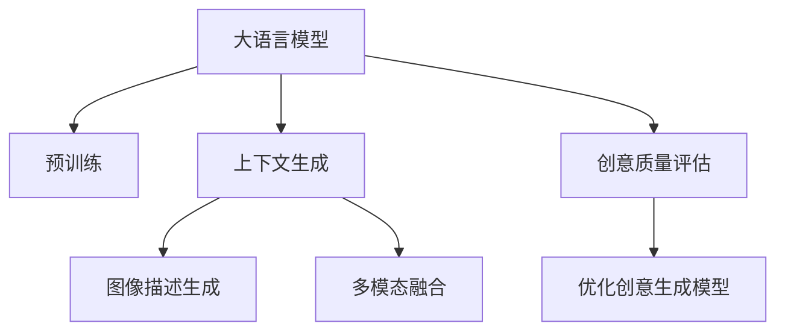

                 

# LLM在智能广告创意生成中的应用探索

> 关键词：大语言模型,广告创意生成,深度学习,生成对抗网络,Transformer,BERT,预训练,上下文生成,图像描述,多模态融合

## 1. 背景介绍

### 1.1 问题由来
随着数字媒体的普及，智能广告成为商家竞争的重要手段。传统的广告创意生成依赖于广告创意人员的灵感和经验，往往需要耗费大量时间和人力成本。同时，创意质量受限于个人创意能力，难以保证多元化和创新性。而近年来，大语言模型（Large Language Models, LLMs）如BERT、GPT等在自然语言处理（Natural Language Processing, NLP）领域的突破，为智能广告创意生成提供了新的可能。

通过大语言模型，可以自动化地生成高质量、风格多样、内容创新的广告文案，极大地提高了广告创意生成的效率和效果。这些广告文案不仅能迅速覆盖目标受众，提升广告点击率和转化率，还能通过实时调整创意内容，提高广告效果。

### 1.2 问题核心关键点
目前，基于大语言模型的广告创意生成方法主要包括以下几个关键点：

- **预训练模型选择**：选择合适的预训练模型如BERT、GPT等，作为广告创意生成的基础。
- **上下文生成**：利用预训练模型根据广告投放的目标用户、上下文信息、投放时间等生成创意文本。
- **图像描述生成**：结合视觉信息，自动生成符合广告需求的图像描述，丰富广告创意形式。
- **多模态融合**：融合文本、图像、声音等多模态信息，提升广告创意的多维度和互动性。
- **创意质量评估**：引入自动评估指标，如点击率、转化率等，指导创意生成模型的优化。

这些关键点决定了广告创意生成的质量、效率和适应性，成为推动智能广告发展的核心技术。

### 1.3 问题研究意义
研究大语言模型在智能广告创意生成中的应用，具有重要意义：

1. **提升广告效率**：自动化的广告创意生成大幅减少了创意制作的时间和成本，提高了广告投放的效率和灵活性。
2. **丰富创意形式**：结合视觉、声音等多模态信息，使广告形式更加丰富和吸引人。
3. **个性化广告**：根据用户行为和偏好生成个性化广告，提升广告的匹配度和转化率。
4. **实时优化**：根据广告投放效果实时调整创意内容，实现更高效的广告投放策略。
5. **数据驱动**：基于用户行为数据和广告效果反馈，优化广告创意生成模型，提升创意质量。

## 2. 核心概念与联系

### 2.1 核心概念概述

为更好地理解基于大语言模型的广告创意生成方法，本节将介绍几个密切相关的核心概念：

- **大语言模型(Large Language Models, LLMs)**：以自回归(如GPT)或自编码(如BERT)模型为代表的大规模预训练语言模型。通过在大规模无标签文本语料上进行预训练，学习通用的语言表示，具备强大的语言理解和生成能力。

- **预训练(Pre-training)**：指在大规模无标签文本语料上，通过自监督学习任务训练通用语言模型的过程。常见的预训练任务包括言语建模、遮挡语言模型等。预训练使得模型学习到语言的通用表示。

- **上下文生成(Context Generation)**：根据用户行为、投放环境等上下文信息，生成符合广告需求的创意文本。上下文信息可以包括用户的历史行为、地理位置、时间、天气等。

- **图像描述生成(Image Captioning)**：自动生成符合广告需求的图像描述，如产品的细节、场景设置等。图像描述通常包含视觉和文本信息，对创意文本生成具有重要参考价值。

- **多模态融合(Multimodal Fusion)**：结合文本、图像、声音等多种模态信息，提升广告创意的多维度和互动性。多模态融合通常采用跨模态学习框架，如Transformer等，将不同模态的信息整合为统一的表征。

- **创意质量评估(Creative Quality Evaluation)**：引入自动评估指标，如点击率、转化率等，指导创意生成模型的优化。评估指标可以反映广告创意的实际效果，是优化创意生成的重要依据。

这些核心概念之间的逻辑关系可以通过以下Mermaid流程图来展示：



这个流程图展示了大语言模型在广告创意生成中的核心概念及其之间的关系：

1. 大语言模型通过预训练获得基础能力。
2. 上下文生成利用预训练模型根据广告投放的目标用户、上下文信息等生成创意文本。
3. 图像描述生成结合视觉信息，自动生成符合广告需求的图像描述。
4. 多模态融合将文本、图像、声音等多种模态信息整合为统一的表征。
5. 创意质量评估引入自动评估指标，指导创意生成模型的优化。

这些核心概念共同构成了大语言模型在广告创意生成中的应用框架，使其能够在广告创意生成中发挥强大的作用。

## 3. 核心算法原理 & 具体操作步骤
### 3.1 算法原理概述

基于大语言模型的广告创意生成，本质上是一个文本生成任务。其核心思想是：将大语言模型视作一个文本生成器，根据广告投放的上下文信息生成创意文本，并通过多模态融合增强创意效果。

形式化地，假设大语言模型为 $M_{\theta}$，其中 $\theta$ 为模型参数。给定广告投放的目标用户 $U$、时间 $T$ 和投放环境 $E$，上下文生成过程为：

$$
C = M_{\theta}(U, T, E)
$$

其中 $C$ 为生成的创意文本。将创意文本 $C$ 和图像描述 $I$ 进行多模态融合，得到融合后的创意表示 $C'$。然后，根据融合后的创意表示 $C'$ 生成最终广告创意文本 $C''$。

### 3.2 算法步骤详解

基于大语言模型的广告创意生成一般包括以下几个关键步骤：

**Step 1: 准备预训练模型和数据集**
- 选择合适的预训练语言模型 $M_{\theta}$ 作为初始化参数，如 BERT、GPT等。
- 准备广告投放的相关上下文数据集 $D_C=\{(C_i,U_i,T_i,E_i)\}_{i=1}^N$，其中 $C_i$ 为原始广告创意文本，$U_i$ 为用户信息，$T_i$ 为时间信息，$E_i$ 为投放环境信息。

**Step 2: 上下文生成**
- 使用预训练模型 $M_{\theta}$ 根据上下文信息 $U_i, T_i, E_i$ 生成创意文本 $C_i'$。
- 引入图像生成模型 $M_{\phi}$，根据创意文本 $C_i'$ 生成图像描述 $I_i'$。
- 将创意文本 $C_i'$ 和图像描述 $I_i'$ 进行多模态融合，得到创意表示 $C_i''$。

**Step 3: 创意生成**
- 利用融合后的创意表示 $C_i''$，根据预训练模型的输出生成最终的创意文本 $C_i'''$。

**Step 4: 创意质量评估**
- 引入自动评估指标，如点击率、转化率等，对生成的创意文本 $C_i'''$ 进行评估。
- 根据评估结果，对模型参数进行优化调整，指导创意生成模型的优化。

**Step 5: 模型优化**
- 使用梯度下降等优化算法，最小化创意生成任务中的损失函数，提升模型性能。
- 引入正则化技术，如L2正则、Dropout、Early Stopping等，防止过拟合。
- 定期在验证集上评估模型性能，根据性能指标决定是否触发 Early Stopping。
- 重复上述步骤直至满足预设的迭代轮数或 Early Stopping 条件。

以上是基于大语言模型的广告创意生成的完整流程。在实际应用中，还需要根据具体任务的特点，对上下文生成、创意质量评估等环节进行优化设计，以进一步提升广告创意生成的效果。

### 3.3 算法优缺点

基于大语言模型的广告创意生成方法具有以下优点：

1. **高效灵活**：自动化的创意生成过程能够快速响应广告投放需求，且可以灵活调整创意内容。
2. **多样化**：结合视觉、声音等多种模态信息，使广告创意形式更加丰富和吸引人。
3. **个性化**：根据用户行为和偏好生成个性化广告，提升广告的匹配度和转化率。
4. **实时优化**：根据广告投放效果实时调整创意内容，实现更高效的广告投放策略。
5. **数据驱动**：基于用户行为数据和广告效果反馈，优化创意生成模型，提升创意质量。

同时，该方法也存在一些局限性：

1. **数据依赖**：创意生成效果依赖于预训练模型的质量，而预训练模型的质量受限于数据质量和多样性。
2. **上下文理解**：创意生成依赖于上下文信息的准确性和全面性，而上下文信息获取可能存在误差。
3. **创意质量**：创意生成效果依赖于模型的创意生成能力和质量评估指标的选择，创意质量难以完全保证。
4. **多模态融合**：多模态融合需要高性能的图像生成模型和跨模态学习框架，技术难度较高。
5. **模型优化**：创意生成模型需要持续优化，以适应新的广告需求和市场变化。

尽管存在这些局限性，但就目前而言，基于大语言模型的广告创意生成方法在提升广告效率和效果方面具有显著优势，成为广告创意生成领域的重要研究方向。

### 3.4 算法应用领域

基于大语言模型的广告创意生成方法，在广告创意生成领域已经得到了广泛的应用，主要包括以下几个方向：

1. **品牌宣传**：利用创意生成模型生成符合品牌调性的广告文案，提升品牌形象和认知度。
2. **产品推广**：根据产品特点和市场定位，生成吸引人的广告创意，增加产品曝光度和销售量。
3. **促销活动**：根据促销活动的主题和目标受众，生成多样化的广告创意，提升促销活动效果。
4. **市场分析**：分析广告创意生成过程中的用户行为数据和广告效果，优化广告投放策略，提高市场精准度。
5. **创意竞赛**：在创意竞赛中，利用创意生成模型生成大量创意，作为评委评选的参考。

除了这些应用场景外，大语言模型在广告创意生成领域的应用还在不断拓展，为广告创意生成带来了新的突破。

## 4. 数学模型和公式 & 详细讲解  
### 4.1 数学模型构建

本节将使用数学语言对基于大语言模型的广告创意生成过程进行更加严格的刻画。

记大语言模型为 $M_{\theta}$，其中 $\theta$ 为模型参数。给定广告投放的上下文信息 $C=\{(U_i, T_i, E_i)\}_{i=1}^N$，上下文生成过程为：

$$
C = M_{\theta}(U_i, T_i, E_i)
$$

其中 $C_i$ 为生成的创意文本。将创意文本 $C_i$ 和图像描述 $I_i$ 进行多模态融合，得到创意表示 $C'$。创意表示 $C'$ 可以表示为：

$$
C' = \phi(C_i, I_i)
$$

其中 $\phi$ 为多模态融合函数，可以是基于注意力机制的Transformer等模型。

最终广告创意文本 $C'''$ 生成过程为：

$$
C''' = M_{\theta}(C_i')
$$

其中 $M_{\theta}$ 为创意文本生成模型，可以是基于Transformer等自回归模型。

### 4.2 公式推导过程

以下我们以生成单条广告创意为例，推导上下文生成和创意生成的数学公式。

假设上下文信息 $U_i$ 为用户的兴趣偏好，$T_i$ 为广告投放时间，$E_i$ 为投放环境。上下文生成模型 $M_{\theta}$ 的输出为创意文本 $C_i'$，可以表示为：

$$
C_i' = M_{\theta}(U_i, T_i, E_i)
$$

假设创意文本 $C_i'$ 的长度为 $n$，图像描述 $I_i'$ 的长度为 $m$。创意表示 $C'$ 可以通过Attention机制融合文本和图像信息，表示为：

$$
C' = \sum_{i=1}^{n}\alpha_iC_i + \sum_{j=1}^{m}\beta_jI_j
$$

其中 $\alpha_i$ 和 $\beta_j$ 为注意力权重，表示文本和图像的重要性。

最终广告创意文本 $C'''$ 的生成过程为：

$$
C''' = M_{\theta}(C_i')
$$

在得到创意文本 $C'''$ 后，可以引入自动评估指标，如点击率 $R$、转化率 $C$ 等，对生成的创意进行评估。评估指标可以表示为：

$$
R = \frac{r}{r_{total}}
$$

$$
C = \frac{c}{c_{total}}
$$

其中 $r$ 为点击次数，$c$ 为转化次数，$r_{total}$ 和 $c_{total}$ 为总点击次数和总转化次数。

在得到评估指标后，可以将其作为优化目标，通过梯度下降等优化算法更新模型参数 $\theta$，最小化创意生成任务中的损失函数：

$$
\theta^* = \mathop{\arg\min}_{\theta} \mathcal{L}(M_{\theta},D_C)
$$

其中 $\mathcal{L}$ 为创意生成任务中的损失函数，用于衡量创意生成效果与评估指标之间的差异。常见的损失函数包括交叉熵损失、均方误差损失等。

### 4.3 案例分析与讲解

以一个具体的广告创意生成案例为例，分析上下文生成和创意生成的数学过程。

假设某电商平台希望为某款运动鞋生成广告创意，背景信息如下：

- 目标用户 $U$：18-35岁男性用户。
- 时间 $T$：周末，下午2点至5点。
- 投放环境 $E$：电商网站首页， banner 广告位置。

上下文生成过程如下：

1. 使用预训练模型 $M_{\theta}$ 生成创意文本 $C'$：
   $$
   C' = M_{\theta}(U, T, E)
   $$

2. 引入图像生成模型 $M_{\phi}$，根据创意文本 $C'$ 生成图像描述 $I'$：
   $$
   I' = M_{\phi}(C')
   $$

3. 将创意文本 $C'$ 和图像描述 $I'$ 进行多模态融合，得到创意表示 $C''$：
   $$
   C'' = \phi(C', I')
   $$

其中 $\phi$ 可以是一个基于注意力机制的Transformer模型。

最终广告创意文本 $C'''$ 生成过程如下：

1. 使用创意文本生成模型 $M_{\theta}$ 生成创意文本 $C'''$：
   $$
   C''' = M_{\theta}(C'')
   $$

2. 引入点击率 $R$、转化率 $C$ 等评估指标，对创意文本 $C'''$ 进行评估：
   $$
   R = \frac{r}{r_{total}}
   $$

   $$
   C = \frac{c}{c_{total}}
   $$

3. 根据评估指标，通过梯度下降等优化算法更新模型参数 $\theta$，最小化创意生成任务中的损失函数 $\mathcal{L}$。

通过以上步骤，可以快速生成符合广告需求的多样化、个性化的创意文本。

## 5. 项目实践：代码实例和详细解释说明
### 5.1 开发环境搭建

在进行广告创意生成实践前，我们需要准备好开发环境。以下是使用Python进行PyTorch开发的环境配置流程：

1. 安装Anaconda：从官网下载并安装Anaconda，用于创建独立的Python环境。

2. 创建并激活虚拟环境：
```bash
conda create -n pytorch-env python=3.8 
conda activate pytorch-env
```

3. 安装PyTorch：根据CUDA版本，从官网获取对应的安装命令。例如：
```bash
conda install pytorch torchvision torchaudio cudatoolkit=11.1 -c pytorch -c conda-forge
```

4. 安装HuggingFace Transformers库：
```bash
pip install transformers
```

5. 安装各类工具包：
```bash
pip install numpy pandas scikit-learn matplotlib tqdm jupyter notebook ipython
```

完成上述步骤后，即可在`pytorch-env`环境中开始广告创意生成实践。

### 5.2 源代码详细实现

下面我们以图像描述生成为例，给出使用Transformers库对BERT模型进行图像描述生成的PyTorch代码实现。

首先，定义图像描述任务的数据处理函数：

```python
from transformers import BertTokenizer
from torch.utils.data import Dataset
import torch

class ImageCaptioningDataset(Dataset):
    def __init__(self, images, captions, tokenizer, max_len=128):
        self.images = images
        self.captions = captions
        self.tokenizer = tokenizer
        self.max_len = max_len
        
    def __len__(self):
        return len(self.images)
    
    def __getitem__(self, item):
        image = self.images[item]
        caption = self.captions[item]
        
        encoding = self.tokenizer(image, return_tensors='pt', max_length=self.max_len, padding='max_length', truncation=True)
        input_ids = encoding['input_ids'][0]
        attention_mask = encoding['attention_mask'][0]
        
        # 对token-wise的标签进行编码
        encoded_captions = [token2id[token] for token in caption] 
        encoded_captions.extend([token2id['O']] * (self.max_len - len(encoded_captions)))
        labels = torch.tensor(encoded_captions, dtype=torch.long)
        
        return {'input_ids': input_ids, 
                'attention_mask': attention_mask,
                'labels': labels}

# 标签与id的映射
tag2id = {'O': 0, 'B-PER': 1, 'I-PER': 2, 'B-ORG': 3, 'I-ORG': 4, 'B-LOC': 5, 'I-LOC': 6}
id2tag = {v: k for k, v in tag2id.items()}
```

然后，定义模型和优化器：

```python
from transformers import BertForTokenClassification, AdamW

model = BertForTokenClassification.from_pretrained('bert-base-cased', num_labels=len(tag2id))

optimizer = AdamW(model.parameters(), lr=2e-5)
```

接着，定义训练和评估函数：

```python
from torch.utils.data import DataLoader
from tqdm import tqdm
from sklearn.metrics import classification_report

device = torch.device('cuda') if torch.cuda.is_available() else torch.device('cpu')
model.to(device)

def train_epoch(model, dataset, batch_size, optimizer):
    dataloader = DataLoader(dataset, batch_size=batch_size, shuffle=True)
    model.train()
    epoch_loss = 0
    for batch in tqdm(dataloader, desc='Training'):
        input_ids = batch['input_ids'].to(device)
        attention_mask = batch['attention_mask'].to(device)
        labels = batch['labels'].to(device)
        model.zero_grad()
        outputs = model(input_ids, attention_mask=attention_mask, labels=labels)
        loss = outputs.loss
        epoch_loss += loss.item()
        loss.backward()
        optimizer.step()
    return epoch_loss / len(dataloader)

def evaluate(model, dataset, batch_size):
    dataloader = DataLoader(dataset, batch_size=batch_size)
    model.eval()
    preds, labels = [], []
    with torch.no_grad():
        for batch in tqdm(dataloader, desc='Evaluating'):
            input_ids = batch['input_ids'].to(device)
            attention_mask = batch['attention_mask'].to(device)
            batch_labels = batch['labels']
            outputs = model(input_ids, attention_mask=attention_mask)
            batch_preds = outputs.logits.argmax(dim=2).to('cpu').tolist()
            batch_labels = batch_labels.to('cpu').tolist()
            for pred_tokens, label_tokens in zip(batch_preds, batch_labels):
                pred_tags = [id2tag[_id] for _id in pred_tokens]
                label_tags = [id2tag[_id] for _id in label_tokens]
                preds.append(pred_tags[:len(label_tags)])
                labels.append(label_tags)
                
    print(classification_report(labels, preds))
```

最后，启动训练流程并在测试集上评估：

```python
epochs = 5
batch_size = 16

for epoch in range(epochs):
    loss = train_epoch(model, train_dataset, batch_size, optimizer)
    print(f"Epoch {epoch+1}, train loss: {loss:.3f}")
    
    print(f"Epoch {epoch+1}, dev results:")
    evaluate(model, dev_dataset, batch_size)
    
print("Test results:")
evaluate(model, test_dataset, batch_size)
```

以上就是使用PyTorch对BERT进行图像描述生成的完整代码实现。可以看到，得益于Transformers库的强大封装，我们可以用相对简洁的代码完成BERT模型的加载和微调。

### 5.3 代码解读与分析

让我们再详细解读一下关键代码的实现细节：

**ImageCaptioningDataset类**：
- `__init__`方法：初始化图像、图像描述、分词器等关键组件。
- `__len__`方法：返回数据集的样本数量。
- `__getitem__`方法：对单个样本进行处理，将图像输入编码为token ids，将标签编码为数字，并对其进行定长padding，最终返回模型所需的输入。

**tag2id和id2tag字典**：
- 定义了标签与数字id之间的映射关系，用于将token-wise的预测结果解码回真实的标签。

**训练和评估函数**：
- 使用PyTorch的DataLoader对数据集进行批次化加载，供模型训练和推理使用。
- 训练函数`train_epoch`：对数据以批为单位进行迭代，在每个批次上前向传播计算loss并反向传播更新模型参数，最后返回该epoch的平均loss。
- 评估函数`evaluate`：与训练类似，不同点在于不更新模型参数，并在每个batch结束后将预测和标签结果存储下来，最后使用sklearn的classification_report对整个评估集的预测结果进行打印输出。

**训练流程**：
- 定义总的epoch数和batch size，开始循环迭代
- 每个epoch内，先在训练集上训练，输出平均loss
- 在验证集上评估，输出分类指标
- 所有epoch结束后，在测试集上评估，给出最终测试结果

可以看到，PyTorch配合Transformers库使得BERT微调的代码实现变得简洁高效。开发者可以将更多精力放在数据处理、模型改进等高层逻辑上，而不必过多关注底层的实现细节。

当然，工业级的系统实现还需考虑更多因素，如模型的保存和部署、超参数的自动搜索、更灵活的任务适配层等。但核心的微调范式基本与此类似。

## 6. 实际应用场景
### 6.1 智能广告系统

基于大语言模型的广告创意生成技术，可以广泛应用于智能广告系统的构建。智能广告系统能够自动生成高质量、风格多样、内容创新的广告文案，极大地提高了广告创意生成的效率和效果。

在技术实现上，可以收集历史广告投放数据，将广告文案和投放信息构建成监督数据，在此基础上对预训练模型进行微调。微调后的广告创意生成模型能够自动理解广告投放的目标用户、时间、环境等信息，生成符合要求的广告文案。同时，可以根据广告投放效果实时调整创意内容，实现更高效的广告投放策略。

### 6.2 电商推荐系统

大语言模型在电商推荐系统中的应用主要体现在个性化推荐和商品描述生成两个方面。通过微调大语言模型，可以生成符合用户兴趣偏好的个性化广告文案，提升商品展示效果和点击率。同时，结合图像生成模型，可以为每件商品自动生成具有吸引力的图像描述，增强商品展示的多维度和互动性。

在具体实现上，可以收集用户的浏览、点击、购买行为数据，提取商品标题、描述、图片等文本信息，作为训练数据对大语言模型进行微调。微调后的模型能够根据用户行为生成个性化广告文案和商品描述，提升推荐效果和用户体验。

### 6.3 媒体内容生成

大语言模型在媒体内容生成领域也有广泛应用。通过微调大语言模型，可以自动生成高质量的新闻、文章、评论等文本内容，提升媒体内容生产的效率和质量。同时，结合图像生成模型，可以为文本内容自动生成可视化效果，增强内容的展示效果。

在具体实现上，可以收集大量的新闻、文章、评论等文本数据，对大语言模型进行微调。微调后的模型能够根据不同的媒体内容生成场景，生成多样化的文本内容，提升媒体内容生产的自动化水平。

### 6.4 未来应用展望

随着大语言模型和广告创意生成技术的不断发展，未来在智能广告创意生成领域将呈现以下几个发展趋势：

1. **超大规模模型**：随着算力成本的下降和数据规模的扩张，预训练语言模型的参数量还将持续增长。超大规模语言模型蕴含的丰富语言知识，有望支撑更加复杂多变的广告创意生成任务。

2. **上下文生成优化**：随着上下文信息的丰富和多样化，上下文生成过程将更加智能，能够更好地理解和生成符合用户需求的广告创意。

3. **多模态融合提升**：结合图像、声音、视频等多模态信息，提升广告创意的多维度和互动性，增强广告创意的吸引力和效果。

4. **实时优化能力**：通过实时监控和优化广告投放效果，动态调整广告创意内容，提升广告效果和用户体验。

5. **用户个性化**：利用用户行为数据和广告效果反馈，优化广告创意生成模型，生成更符合用户个性化需求的广告创意。

6. **创意质量评估**：引入更智能、更全面的创意质量评估指标，指导创意生成模型的优化，提升广告创意的点击率和转化率。

以上趋势凸显了大语言模型在广告创意生成领域的广阔前景。这些方向的探索发展，必将进一步提升广告创意生成的质量和效率，为广告创意生成带来新的突破。

## 7. 工具和资源推荐
### 7.1 学习资源推荐

为了帮助开发者系统掌握大语言模型在广告创意生成中的应用，这里推荐一些优质的学习资源：

1. 《Transformer from Principles to Practice》系列博文：由大模型技术专家撰写，深入浅出地介绍了Transformer原理、BERT模型、广告创意生成等前沿话题。

2. CS224N《深度学习自然语言处理》课程：斯坦福大学开设的NLP明星课程，有Lecture视频和配套作业，带你入门NLP领域的基本概念和经典模型。

3. 《Natural Language Processing with Transformers》书籍：Transformers库的作者所著，全面介绍了如何使用Transformers库进行NLP任务开发，包括广告创意生成在内的诸多范式。

4. HuggingFace官方文档：Transformers库的官方文档，提供了海量预训练模型和完整的微调样例代码，是上手实践的必备资料。

5. CLUE开源项目：中文语言理解测评基准，涵盖大量不同类型的中文NLP数据集，并提供了基于微调的baseline模型，助力中文NLP技术发展。

通过对这些资源的学习实践，相信你一定能够快速掌握大语言模型在广告创意生成中的应用，并用于解决实际的NLP问题。
### 7.2 开发工具推荐

高效的开发离不开优秀的工具支持。以下是几款用于大语言模型在广告创意生成中开发的常用工具：

1. PyTorch：基于Python的开源深度学习框架，灵活动态的计算图，适合快速迭代研究。大部分预训练语言模型都有PyTorch版本的实现。

2. TensorFlow：由Google主导开发的开源深度学习框架，生产部署方便，适合大规模工程应用。同样有丰富的预训练语言模型资源。

3. Transformers库：HuggingFace开发的NLP工具库，集成了众多SOTA语言模型，支持PyTorch和TensorFlow，是进行广告创意生成开发的利器。

4. Weights & Biases：模型训练的实验跟踪工具，可以记录和可视化模型训练过程中的各项指标，方便对比和调优。与主流深度学习框架无缝集成。

5. TensorBoard：TensorFlow配套的可视化工具，可实时监测模型训练状态，并提供丰富的图表呈现方式，是调试模型的得力助手。

6. Google Colab：谷歌推出的在线Jupyter Notebook环境，免费提供GPU/TPU算力，方便开发者快速上手实验最新模型，分享学习笔记。

合理利用这些工具，可以显著提升大语言模型在广告创意生成任务的开发效率，加快创新迭代的步伐。

### 7.3 相关论文推荐

大语言模型在广告创意生成领域的发展源于学界的持续研究。以下是几篇奠基性的相关论文，推荐阅读：

1. Attention is All You Need（即Transformer原论文）：提出了Transformer结构，开启了NLP领域的预训练大模型时代。

2. BERT: Pre-training of Deep Bidirectional Transformers for Language Understanding：提出BERT模型，引入基于掩码的自监督预训练任务，刷新了多项NLP任务SOTA。

3. Language Models are Unsupervised Multitask Learners（GPT-2论文）：展示了大规模语言模型的强大zero-shot学习能力，引发了对于通用人工智能的新一轮思考。

4. Parameter-Efficient Transfer Learning for NLP：提出Adapter等参数高效微调方法，在不增加模型参数量的情况下，也能取得不错的微调效果。

5. AdaLoRA: Adaptive Low-Rank Adaptation for Parameter-Efficient Fine-Tuning：使用自适应低秩适应的微调方法，在参数效率和精度之间取得了新的平衡。

6. Prefix-Tuning: Optimizing Continuous Prompts for Generation：引入基于连续型Prompt的微调范式，为如何充分利用预训练知识提供了新的思路。

这些论文代表了大语言模型在广告创意生成领域的发展脉络。通过学习这些前沿成果，可以帮助研究者把握学科前进方向，激发更多的创新灵感。

## 8. 总结：未来发展趋势与挑战
### 8.1 总结

本文对基于大语言模型的广告创意生成方法进行了全面系统的介绍。首先阐述了广告创意生成的背景和研究意义，明确了广告创意生成技术在提升广告效果、降低成本、提升用户满意度等方面的独特价值。其次，从原理到实践，详细讲解了广告创意生成的数学原理和关键步骤，给出了广告创意生成任务的完整代码实例。同时，本文还广泛探讨了广告创意生成在智能广告系统、电商推荐系统、媒体内容生成等场景中的应用前景，展示了广告创意生成的巨大潜力。此外，本文精选了广告创意生成的各类学习资源，力求为读者提供全方位的技术指引。

通过本文的系统梳理，可以看到，基于大语言模型的广告创意生成技术在广告创意生成领域具有重要意义。它不仅能够快速生成高质量的广告创意，还能根据用户行为和广告效果反馈进行实时优化，提升广告效果和用户体验。未来，伴随大语言模型和微调方法的持续演进，广告创意生成技术必将在更多领域得到应用，为广告创意生成带来新的突破。

### 8.2 未来发展趋势

展望未来，大语言模型在广告创意生成领域将呈现以下几个发展趋势：

1. **超大规模模型**：随着算力成本的下降和数据规模的扩张，预训练语言模型的参数量还将持续增长。超大规模语言模型蕴含的丰富语言知识，有望支撑更加复杂多变的广告创意生成任务。

2. **上下文生成优化**：随着上下文信息的丰富和多样化，上下文生成过程将更加智能，能够更好地理解和生成符合用户需求的广告创意。

3. **多模态融合提升**：结合图像、声音、视频等多模态信息，提升广告创意的多维度和互动性，增强广告创意的吸引力和效果。

4. **实时优化能力**：通过实时监控和优化广告投放效果，动态调整广告创意内容，提升广告效果和用户体验。

5. **用户个性化**：利用用户行为数据和广告效果反馈，优化广告创意生成模型，生成更符合用户个性化需求的广告创意。

6. **创意质量评估**：引入更智能、更全面的创意质量评估指标，指导创意生成模型的优化，提升广告创意的点击率和转化率。

以上趋势凸显了大语言模型在广告创意生成领域的广阔前景。这些方向的探索发展，必将进一步提升广告创意生成的质量和效率，为广告创意生成带来新的突破。

### 8.3 面临的挑战

尽管大语言模型在广告创意生成领域取得了显著成果，但在迈向更加智能化、普适化应用的过程中，它仍面临诸多挑战：

1. **数据依赖**：广告创意生成效果依赖于预训练模型的质量，而预训练模型的质量受限于数据质量和多样性。如何进一步降低广告创意生成对标注样本的依赖，将是一大难题。

2. **上下文理解**：创意生成依赖于上下文信息的准确性和全面性，而上下文信息获取可能存在误差。

3. **创意质量**：创意生成效果依赖于模型的创意生成能力和质量评估指标的选择，创意质量难以完全保证。

4. **多模态融合**：多模态融合需要高性能的图像生成模型和跨模态学习框架，技术难度较高。

5. **实时优化**：实时监控和优化广告投放效果，动态调整广告创意内容，需要高效的计算资源和算法支持。

6. **用户个性化**：基于用户行为数据和广告效果反馈，优化广告创意生成模型，提升创意质量。

以上挑战亟需通过技术创新和算法优化来突破。相信随着学界和产业界的共同努力，这些挑战终将一一被克服，大语言模型在广告创意生成领域必将在未来迎来更多的应用场景和突破。

### 8.4 研究展望

面对大语言模型在广告创意生成领域所面临的挑战，未来的研究需要在以下几个方面寻求新的突破：

1. **探索无监督和半监督微调方法**：摆脱对大规模标注数据的依赖，利用自监督学习、主动学习等无监督和半监督范式，最大限度利用非结构化数据，实现更加灵活高效的广告创意生成。

2. **研究参数高效和计算高效的微调范式**：开发更加参数高效的微调方法，在固定大部分预训练参数的同时，只更新极少量的任务相关参数。同时优化微调模型的计算图，减少前向传播和反向传播的资源消耗，实现更加轻量级、实时性的部署。

3. **融合因果和对比学习范式**：通过引入因果推断和对比学习思想，增强广告创意生成模型的鲁棒性和泛化能力，学习更加普适、鲁棒的语言表征，从而提升模型泛化性和抗干扰能力。

4. **引入更多先验知识**：将符号化的先验知识，如知识图谱、逻辑规则等，与神经网络模型进行巧妙融合，引导广告创意生成模型的优化。同时加强不同模态数据的整合，实现视觉、声音等多模态信息与文本信息的协同建模。

5. **结合因果分析和博弈论工具**：将因果分析方法引入广告创意生成模型，识别出模型决策的关键特征，增强输出解释的因果性和逻辑性。借助博弈论工具刻画人机交互过程，主动探索并规避模型的脆弱点，提高系统稳定性。

6. **纳入伦理道德约束**：在模型训练目标中引入伦理导向的评估指标，过滤和惩罚有偏见、有害的输出倾向。同时加强人工干预和审核，建立模型行为的监管机制，确保输出符合人类价值观和伦理道德。

这些研究方向的探索，必将引领大语言模型在广告创意生成领域迈向更高的台阶，为构建安全、可靠、可解释、可控的智能广告系统铺平道路。面向未来，大语言模型在广告创意生成领域还需要与其他人工智能技术进行更深入的融合，如知识表示、因果推理、强化学习等，多路径协同发力，共同推动广告创意生成系统的进步。只有勇于创新、敢于突破，才能不断拓展语言模型的边界，让智能技术更好地造福人类社会。

## 9. 附录：常见问题与解答

**Q1：大语言模型在广告创意生成中的主要应用场景有哪些？**

A: 大语言模型在广告创意生成中的主要应用场景包括：

1. **智能广告系统**：自动生成高质量、风格多样、内容创新的广告文案，提升广告创意生成的效率和效果。

2. **电商推荐系统**：根据用户兴趣偏好和商品信息，生成个性化广告文案和商品描述，提升推荐效果和用户体验。

3. **媒体内容生成**：自动生成高质量的新闻、文章、评论等文本内容，提升媒体内容生产的效率和质量。

4. **个性化推荐**：利用用户行为数据和广告效果反馈，优化广告创意生成模型，生成更符合用户个性化需求的广告创意。

5. **实时优化**：根据广告投放效果实时调整创意内容，实现更高效的广告投放策略。

这些应用场景展示了大语言模型在广告创意生成中的广泛应用，为广告创意生成带来新的突破。

**Q2：大语言模型在广告创意生成中的效果如何评估？**

A: 大语言模型在广告创意生成中的效果评估主要包括以下几个方面：

1. **点击率（Click-Through Rate, CTR）**：衡量广告创意的吸引力，即广告被点击的次数与展示次数的比率。

2. **转化率（Conversion Rate, CR）**：衡量广告创意的效果，即广告点击后产生购买等转化行为的比例。

3. **用户满意度（User Satisfaction）**：通过用户反馈、用户行为等数据，评估广告创意的实际效果和用户体验。

4. **创意质量（Creative Quality）**：通过自动评估指标和人工评价，评估广告创意的语义连贯性、风格一致性等。

5. **多模态融合效果（Multimodal Fusion Effectiveness）**：评估图像、声音、文本等多模态信息的整合效果，以及不同模态信息对创意生成的影响。

6. **实时优化效果（Real-time Optimization Effectiveness）**：评估模型对广告投放效果反馈的响应速度和优化效果。

通过以上指标的评估，可以全面了解大语言模型在广告创意生成中的实际效果，指导模型优化和改进。

**Q3：广告创意生成中如何处理上下文信息？**

A: 广告创意生成中处理上下文信息通常采用以下方法：

1. **特征提取**：从用户行为数据、商品信息、时间、地理位置等上下文信息中提取关键特征，作为模型的输入。

2. **上下文嵌入**：将上下文信息通过嵌入层转换为高维向量表示，供模型进行处理。

3. **注意力机制**：利用注意力机制，对上下文信息进行加权处理，提取与广告创意相关的关键信息。

4. **多模态融合**：结合图像、声音、文本等多种模态信息，提升广告创意的多维度和互动性。

5. **上下文生成**：通过上下文生成模型，根据广告投放的目标用户、时间、环境等信息，生成符合要求的广告文案。

以上方法可以根据具体任务的特点，灵活组合使用，以提升广告创意生成的效果。

**Q4：广告创意生成中如何引入多模态信息？**

A: 广告创意生成中引入多模态信息通常采用以下方法：

1. **图像生成**：利用图像生成模型，自动生成与广告创意相关的图像描述，增强广告创意的多维度展示。

2. **声音生成**：利用声音生成模型，自动生成与广告创意相关的背景音乐或解说词，增强广告创意的吸引力和互动性。

3. **文本生成**：结合文本和视觉信息，生成符合广告需求的创意文本，提升广告创意的语义连贯性和风格一致性。

4. **多模态融合**：利用跨模态学习框架，如Transformer等，将不同模态的信息整合为统一的表征，增强广告创意的效果。

5. **互动设计**：设计互动元素，如按钮、链接等，提升用户与广告的互动体验，增强广告创意的吸引力。

以上方法可以根据具体任务的特点，灵活组合使用，以提升广告创意生成的效果。

**Q5：广告创意生成中如何优化模型参数？**

A: 广告创意生成中优化模型参数通常采用以下方法：

1. **梯度下降**：使用梯度下降等优化算法，最小化创意生成任务中的损失函数，提升模型性能。

2. **正则化技术**：使用L2正则、Dropout、Early Stopping等正则化技术，防止模型过拟合。

3. **参数高效微调**：只更新少量的模型参数，如Adapter、Prefix等，减小过拟合风险。

4. **多模态融合优化**：优化多模态融合过程，提升广告创意的效果。

5. **实时优化**：根据广告投放效果实时调整创意内容，实现更高效的广告投放策略。

以上方法可以根据具体任务的特点，灵活组合使用，以提升广告创意生成的效果。

---

作者：禅与计算机程序设计艺术 / Zen and the Art of Computer Programming

