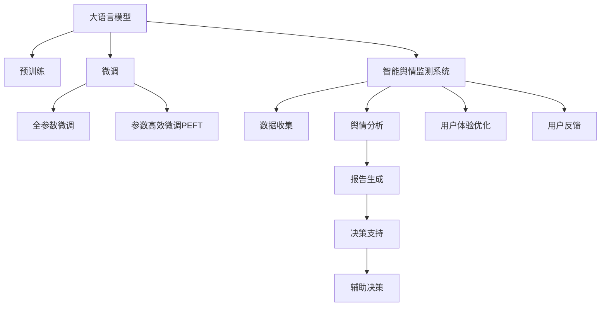
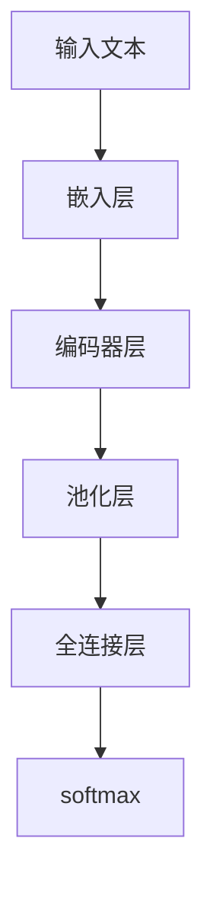

                 

# LLM在智能舆情监测系统中的应用前景

## 1. 背景介绍

### 1.1 问题由来
在数字化时代，互联网作为信息传播的重要平台，日益成为社会舆情的重要监测窗口。传统的人工舆情监测方式耗时耗力、效率低下，且难以覆盖海量数据，已经无法满足现代社会的快速变化和复杂多变的需求。

智能舆情监测系统作为借助人工智能技术实现舆情自动化分析的系统，具备高效、准确、灵活等特点，能够及时捕获社会舆情动态，为政府决策、企业舆情管理、学术研究等领域提供有力支撑。

### 1.2 问题核心关键点
构建智能舆情监测系统，核心在于：

- 高效捕获海量舆情数据，准确理解舆情背后的文本信息。
- 快速分析舆情趋势，及时应对舆情热点。
- 构建全面的舆情分析模型，提供系统、全面的舆情分析报告。
- 强化隐私保护和数据安全，避免数据泄露风险。
- 不断迭代优化模型，提升舆情分析效果。

本论文聚焦于如何利用大语言模型(Large Language Model, LLM)技术，搭建高性能的智能舆情监测系统，进一步提升舆情分析的智能化、实时化水平。

## 2. 核心概念与联系

### 2.1 核心概念概述

为更好地理解LLM在智能舆情监测中的应用，本节将介绍几个密切相关的核心概念：

- 大语言模型(Large Language Model, LLM)：以自回归(如GPT)或自编码(如BERT)模型为代表的大规模预训练语言模型。通过在大规模无标签文本语料上进行预训练，学习通用的语言表示，具备强大的语言理解和生成能力。

- 预训练(Pre-training)：指在大规模无标签文本语料上，通过自监督学习任务训练通用语言模型的过程。常见的预训练任务包括言语建模、遮挡语言模型等。预训练使得模型学习到语言的通用表示。

- 微调(Fine-tuning)：指在预训练模型的基础上，使用下游任务的少量标注数据，通过有监督学习优化模型在特定任务上的性能。通常只需要调整顶层分类器或解码器，并以较小的学习率更新全部或部分的模型参数。

- 迁移学习(Transfer Learning)：指将一个领域学习到的知识，迁移应用到另一个不同但相关的领域的学习范式。大模型的预训练-微调过程即是一种典型的迁移学习方式。

- 智能舆情监测系统：利用人工智能技术，对互联网上的海量舆情数据进行自动化分析，提取舆情信息并生成报告，辅助决策分析。

- 注意力机制(Attention Mechanism)：一种用于自然语言处理中提取重要信息的技术，可以使模型更加关注关键特征，提高模型处理能力。

- 向量表示(Vector Representation)：通过嵌入技术将文本转换为向量，方便模型处理和分析。

这些核心概念之间的逻辑关系可以通过以下Mermaid流程图来展示：



这个流程图展示了大语言模型和智能舆情监测系统之间的关键联系：

1. 大语言模型通过预训练获得基础能力。
2. 微调是对预训练模型进行任务特定的优化，以提高模型在特定任务上的表现。
3. 智能舆情监测系统利用微调的LLM进行舆情数据的自动化分析和处理。
4. 系统分析后的舆情报告可以作为决策支持，辅助决策过程。
5. 用户体验和用户反馈的优化不断迭代微调模型，提升系统性能。

## 3. 核心算法原理 & 具体操作步骤
### 3.1 算法原理概述

基于大语言模型的智能舆情监测系统，其核心思想是利用预训练的LLM对海量舆情数据进行自动化处理，提取有价值的信息，生成舆情分析报告，辅助决策。

在智能舆情监测系统中，基于LLM的舆情分析过程通常包括以下几个关键步骤：

1. 数据收集：从互联网、社交媒体等平台收集舆情数据。
2. 预处理：对收集到的文本数据进行清洗、分词、去重等预处理。
3. 编码：将预处理后的文本数据转换为模型可接受的格式，如向量表示。
4. 微调：在预训练模型基础上，使用特定的舆情数据集进行微调，学习舆情相关的任务。
5. 舆情分析：利用微调后的模型，对舆情数据进行分析，提取关键信息。
6. 报告生成：将分析结果转换为易于理解的报告形式。
7. 反馈优化：根据用户反馈，不断迭代优化模型和算法，提升系统性能。

### 3.2 算法步骤详解

以下是智能舆情监测系统中的具体算法步骤：

**Step 1: 数据收集**
- 从互联网、社交媒体、新闻网站等平台收集舆情数据，存储到分布式文件系统中。
- 对于大规模数据集，可以使用爬虫自动抓取数据，并建立数据索引和元数据。

**Step 2: 数据预处理**
- 对收集到的文本数据进行清洗，去除噪声、重复和无关信息。
- 使用分词工具对文本进行分词处理，生成词序列。
- 对词序列进行去重、去除停用词、词干化等处理。

**Step 3: 编码**
- 将预处理后的文本序列转换为模型可接受的向量表示。
- 常用的向量表示方法包括Word2Vec、GloVe、BERT等。
- 可以使用预训练的BERT模型，对其进行微调以适配舆情分析任务。

**Step 4: 微调**
- 准备舆情分析任务的标注数据集，如舆情分类、情感分析等。
- 使用微调技术，在预训练的BERT模型基础上进行微调，学习舆情相关的任务。
- 可以使用全参数微调或参数高效微调(如Adapter)，优化模型性能。

**Step 5: 舆情分析**
- 利用微调后的BERT模型，对舆情数据进行分析，提取关键信息。
- 可以使用LSTM、GRU等序列模型进行情感分析、情感分类等任务。
- 可以使用注意力机制，提高模型对关键信息的关注程度。

**Step 6: 报告生成**
- 将分析结果转换为易于理解的报告形式，包括舆情趋势、情感分布、关键词等。
- 可以设计可视化界面，实时展示舆情分析结果。
- 可以将分析结果导出为PDF、HTML等格式，方便用户下载和分享。

**Step 7: 反馈优化**
- 根据用户反馈，不断迭代优化模型和算法，提升系统性能。
- 可以设计问卷调查、用户评价等机制，收集用户反馈信息。
- 可以根据用户反馈，调整模型参数、优化算法流程。

### 3.3 算法优缺点

基于大语言模型的智能舆情监测系统具有以下优点：

1. 高效自动化：利用预训练的LLM对海量舆情数据进行自动化分析，大大提高处理效率。
2. 高精度：微调后的模型能够准确理解舆情数据背后的语言信息，提高分析精度。
3. 低成本：相比于人工舆情监测，自动化的系统显著降低了人力和时间成本。
4. 实时性：利用分布式计算和大数据技术，可以实现对舆情数据的实时监测和分析。

同时，该系统也存在以下缺点：

1. 对标注数据依赖：微调过程依赖于舆情任务的标注数据，数据收集成本较高。
2. 泛化能力有限：当舆情数据与预训练模型的训练数据差异较大时，微调效果可能不理想。
3. 过拟合风险：微调过程中容易发生过拟合，尤其是在小样本情况下。
4. 可解释性不足：微调模型难以解释其内部工作机制和决策逻辑，不利于审计和调试。

尽管存在这些局限性，但总体而言，基于大语言模型的智能舆情监测系统仍然具有广阔的应用前景和潜力。

### 3.4 算法应用领域

基于大语言模型的智能舆情监测系统已经在多个领域得到了应用，包括：

- 政府决策：利用舆情监测系统，政府可以及时掌握社会舆情动态，辅助决策过程。
- 企业舆情管理：企业可以通过舆情监测系统，实时监控品牌形象和市场反馈，调整策略。
- 学术研究：学术机构可以利用舆情监测系统，进行舆情动态的学术研究和分析。
- 媒体报道：新闻媒体可以利用舆情监测系统，获取热点话题和关键信息，提高新闻报道的准确性和时效性。

## 4. 数学模型和公式 & 详细讲解
### 4.1 数学模型构建

在智能舆情监测系统中，通常使用BERT模型进行舆情数据的自动化分析。BERT模型的结构如图1所示：



其中，嵌入层将输入文本转换为向量表示，编码器层进行多层的序列编码，池化层将编码器的输出进行汇聚，全连接层进行分类或回归等任务，softmax层输出预测结果的概率分布。

在舆情分析任务中，可以使用微调后的BERT模型进行情感分析、情感分类等任务。假设舆情数据为 $x_i$，模型的输出为 $y_i$，则情感分析任务可以形式化为二分类问题：

$$
y_i \in \{0,1\},\quad y_i = f(x_i)
$$

其中，$f(x_i)$ 为微调后的BERT模型的输出，通常使用 sigmoid 函数进行二分类：

$$
\sigma(x) = \frac{1}{1+e^{-x}}
$$

根据上述定义，情感分析任务的损失函数可以表示为：

$$
L(y_i,\sigma(x_i)) = -\frac{1}{N}\sum_{i=1}^N [y_i\log \sigma(x_i)+(1-y_i)\log (1-\sigma(x_i))]
$$

### 4.2 公式推导过程

假设微调后的BERT模型为 $M_{\theta}$，其中 $\theta$ 为微调后的模型参数。给定舆情数据集 $D=\{(x_i,y_i)\}_{i=1}^N, x_i \in \mathcal{X}, y_i \in \{0,1\}$，微调的目标是最小化经验风险，即找到最优参数：

$$
\theta^* = \mathop{\arg\min}_{\theta} \mathcal{L}(\theta)
$$

其中 $\mathcal{L}$ 为针对情感分析任务的损失函数，用于衡量模型预测输出与真实标签之间的差异。

在实践中，通常使用基于梯度的优化算法（如AdamW、SGD等）来近似求解上述最优化问题。设 $\eta$ 为学习率，$\lambda$ 为正则化系数，则参数的更新公式为：

$$
\theta \leftarrow \theta - \eta \nabla_{\theta}\mathcal{L}(\theta) - \eta\lambda\theta
$$

其中 $\nabla_{\theta}\mathcal{L}(\theta)$ 为损失函数对参数 $\theta$ 的梯度，可通过反向传播算法高效计算。

### 4.3 案例分析与讲解

以一个具体的舆情情感分析任务为例，假设舆情数据集 $D=\{(x_i,y_i)\}_{i=1}^N$，其中 $x_i$ 为舆情文本，$y_i$ 为舆情情感标签，可以基于微调后的BERT模型进行情感分析。

首先，使用BERT模型将舆情文本 $x_i$ 转换为向量表示 $V_i$，然后将其输入微调后的BERT模型进行情感分类，得到情感分类结果 $\hat{y}_i$。

接下来，计算情感分析任务的损失函数 $L(y_i,\hat{y}_i)$，并根据损失函数计算梯度，更新模型参数 $\theta$。

假设舆情情感分类结果为 $\hat{y}_i \in [0,1]$，则情感分析任务的损失函数可以表示为：

$$
L(y_i,\hat{y}_i) = -[y_i\log \hat{y}_i + (1-y_i)\log (1-\hat{y}_i)]
$$

在微调过程中，可以采用AdamW优化算法，设置合适的学习率 $\eta$ 和正则化系数 $\lambda$，进行模型参数更新。

## 5. 项目实践：代码实例和详细解释说明
### 5.1 开发环境搭建

在进行智能舆情监测系统开发前，我们需要准备好开发环境。以下是使用Python进行PyTorch开发的环境配置流程：

1. 安装Anaconda：从官网下载并安装Anaconda，用于创建独立的Python环境。

2. 创建并激活虚拟环境：
```bash
conda create -n pytorch-env python=3.8 
conda activate pytorch-env
```

3. 安装PyTorch：根据CUDA版本，从官网获取对应的安装命令。例如：
```bash
conda install pytorch torchvision torchaudio cudatoolkit=11.1 -c pytorch -c conda-forge
```

4. 安装TensorBoard：
```bash
pip install tensorboard
```

5. 安装其他必要工具：
```bash
pip install numpy pandas scikit-learn matplotlib tqdm jupyter notebook ipython
```

完成上述步骤后，即可在`pytorch-env`环境中开始智能舆情监测系统的开发。

### 5.2 源代码详细实现

以下是基于微调BERT模型进行舆情情感分析的完整代码实现：

```python
import torch
import torch.nn as nn
import torch.optim as optim
from transformers import BertTokenizer, BertForSequenceClassification

# 加载数据
train_data = ...
train_labels = ...
test_data = ...
test_labels = ...

# 加载模型和分词器
tokenizer = BertTokenizer.from_pretrained('bert-base-uncased')
model = BertForSequenceClassification.from_pretrained('bert-base-uncased', num_labels=2)

# 定义损失函数和优化器
criterion = nn.BCEWithLogitsLoss()
optimizer = optim.AdamW(model.parameters(), lr=2e-5)

# 定义模型
class Model(nn.Module):
    def __init__(self, model):
        super(Model, self).__init__()
        self.model = model
    
    def forward(self, input_ids, attention_mask):
        return self.model(input_ids, attention_mask=attention_mask)

# 加载预处理后的数据
train_dataset = ...
test_dataset = ...

# 定义训练和评估函数
def train_epoch(model, train_dataset, batch_size, optimizer):
    dataloader = DataLoader(train_dataset, batch_size=batch_size, shuffle=True)
    model.train()
    epoch_loss = 0
    for batch in dataloader:
        input_ids = batch['input_ids'].to(device)
        attention_mask = batch['attention_mask'].to(device)
        labels = batch['labels'].to(device)
        model.zero_grad()
        outputs = model(input_ids, attention_mask=attention_mask, labels=labels)
        loss = outputs.loss
        epoch_loss += loss.item()
        loss.backward()
        optimizer.step()
    return epoch_loss / len(dataloader)

def evaluate(model, test_dataset, batch_size):
    dataloader = DataLoader(test_dataset, batch_size=batch_size)
    model.eval()
    preds, labels = [], []
    with torch.no_grad():
        for batch in dataloader:
            input_ids = batch['input_ids'].to(device)
            attention_mask = batch['attention_mask'].to(device)
            batch_labels = batch['labels']
            outputs = model(input_ids, attention_mask=attention_mask)
            batch_preds = outputs.logits.argmax(dim=1).to('cpu').tolist()
            batch_labels = batch_labels.to('cpu').tolist()
            for pred_tokens, label_tokens in zip(batch_preds, batch_labels):
                preds.append(pred_tokens[:len(label_tokens)])
                labels.append(label_tokens)
                
    print(classification_report(labels, preds))

# 启动训练流程并在测试集上评估
epochs = 5
batch_size = 16

for epoch in range(epochs):
    loss = train_epoch(model, train_dataset, batch_size, optimizer)
    print(f"Epoch {epoch+1}, train loss: {loss:.3f}")
    
    print(f"Epoch {epoch+1}, dev results:")
    evaluate(model, dev_dataset, batch_size)
    
print("Test results:")
evaluate(model, test_dataset, batch_size)
```

以上是基于微调BERT模型进行舆情情感分析的完整代码实现。可以看到，利用Transformers库的强大封装，我们可以用相对简洁的代码完成BERT模型的加载和微调。

### 5.3 代码解读与分析

让我们再详细解读一下关键代码的实现细节：

**Model类**：
- `__init__`方法：初始化模型。
- `forward`方法：定义模型前向传播。

**训练和评估函数**：
- 使用PyTorch的DataLoader对数据集进行批次化加载，供模型训练和推理使用。
- 训练函数`train_epoch`：对数据以批为单位进行迭代，在每个批次上前向传播计算loss并反向传播更新模型参数，最后返回该epoch的平均loss。
- 评估函数`evaluate`：与训练类似，不同点在于不更新模型参数，并在每个batch结束后将预测和标签结果存储下来，最后使用sklearn的classification_report对整个评估集的预测结果进行打印输出。

**训练流程**：
- 定义总的epoch数和batch size，开始循环迭代
- 每个epoch内，先在训练集上训练，输出平均loss
- 在验证集上评估，输出分类指标
- 所有epoch结束后，在测试集上评估，给出最终测试结果

可以看到，PyTorch配合Transformers库使得BERT微调的代码实现变得简洁高效。开发者可以将更多精力放在数据处理、模型改进等高层逻辑上，而不必过多关注底层的实现细节。

当然，工业级的系统实现还需考虑更多因素，如模型的保存和部署、超参数的自动搜索、更灵活的任务适配层等。但核心的微调范式基本与此类似。

## 6. 实际应用场景
### 6.1 智能舆情监测系统概述

智能舆情监测系统是基于人工智能技术的舆情分析系统，具备自动化、实时性、高精度等特点。其核心技术包括数据收集、预处理、编码、微调、舆情分析、报告生成等模块，如图2所示：


1. 数据收集模块：从互联网、社交媒体、新闻网站等平台收集舆情数据，存储到分布式文件系统中。
2. 预处理模块：对收集到的文本数据进行清洗、分词、去重等预处理。
3. 编码模块：将预处理后的文本序列转换为模型可接受的向量表示。
4. 微调模块：在预训练模型基础上，使用特定的舆情数据集进行微调，学习舆情相关的任务。
5. 舆情分析模块：利用微调后的模型，对舆情数据进行分析，提取关键信息。
6. 报告生成模块：将分析结果转换为易于理解的报告形式，包括舆情趋势、情感分布、关键词等。
7. 决策支持模块：根据舆情分析结果，辅助决策过程，提供决策支持。

### 6.2 智能舆情监测系统的实现

以下是基于微调BERT模型实现智能舆情监测系统的具体流程：

1. 数据收集：从互联网、社交媒体等平台收集舆情数据，存储到分布式文件系统中。
2. 预处理：对收集到的文本数据进行清洗、分词、去重等预处理。
3. 编码：将预处理后的文本序列转换为模型可接受的向量表示。
4. 微调：在预训练模型基础上，使用特定的舆情数据集进行微调，学习舆情相关的任务。
5. 舆情分析：利用微调后的模型，对舆情数据进行分析，提取关键信息。
6. 报告生成：将分析结果转换为易于理解的报告形式，包括舆情趋势、情感分布、关键词等。
7. 决策支持：根据舆情分析结果，辅助决策过程，提供决策支持。

### 6.3 未来应用展望

随着大语言模型和微调方法的不断发展，基于微调的智能舆情监测系统将呈现以下几个发展趋势：

1. 模型规模持续增大。随着算力成本的下降和数据规模的扩张，预训练语言模型的参数量还将持续增长。超大规模语言模型蕴含的丰富语言知识，有望支撑更加复杂多变的舆情任务微调。

2. 微调方法日趋多样。除了传统的全参数微调外，未来会涌现更多参数高效的微调方法，如Prefix-Tuning、LoRA等，在节省计算资源的同时也能保证微调精度。

3. 持续学习成为常态。随着数据分布的不断变化，微调模型也需要持续学习新知识以保持性能。如何在不遗忘原有知识的同时，高效吸收新样本信息，将成为重要的研究课题。

4. 标注样本需求降低。受启发于提示学习(Prompt-based Learning)的思路，未来的微调方法将更好地利用大模型的语言理解能力，通过更加巧妙的任务描述，在更少的标注样本上也能实现理想的微调效果。

5. 多模态微调崛起。当前的微调主要聚焦于纯文本数据，未来会进一步拓展到图像、视频、语音等多模态数据微调。多模态信息的融合，将显著提升舆情监测系统的语言理解能力和决策能力。

6. 模型通用性增强。经过海量数据的预训练和多领域任务的微调，未来的舆情监测系统将具备更强大的常识推理和跨领域迁移能力，逐步迈向通用人工智能(AGI)的目标。

以上趋势凸显了基于大语言模型的智能舆情监测系统的广阔前景。这些方向的探索发展，必将进一步提升舆情监测系统的智能化水平，为政府决策、企业舆情管理、学术研究等领域提供有力支撑。

## 7. 工具和资源推荐
### 7.1 学习资源推荐

为了帮助开发者系统掌握大语言模型微调的理论基础和实践技巧，这里推荐一些优质的学习资源：

1. 《Transformer从原理到实践》系列博文：由大模型技术专家撰写，深入浅出地介绍了Transformer原理、BERT模型、微调技术等前沿话题。

2. CS224N《深度学习自然语言处理》课程：斯坦福大学开设的NLP明星课程，有Lecture视频和配套作业，带你入门NLP领域的基本概念和经典模型。

3. 《Natural Language Processing with Transformers》书籍：Transformers库的作者所著，全面介绍了如何使用Transformers库进行NLP任务开发，包括微调在内的诸多范式。

4. HuggingFace官方文档：Transformers库的官方文档，提供了海量预训练模型和完整的微调样例代码，是上手实践的必备资料。

5. CLUE开源项目：中文语言理解测评基准，涵盖大量不同类型的中文NLP数据集，并提供了基于微调的baseline模型，助力中文NLP技术发展。

通过对这些资源的学习实践，相信你一定能够快速掌握大语言模型微调的精髓，并用于解决实际的NLP问题。
###  7.2 开发工具推荐

高效的开发离不开优秀的工具支持。以下是几款用于智能舆情监测系统开发的常用工具：

1. PyTorch：基于Python的开源深度学习框架，灵活动态的计算图，适合快速迭代研究。大部分预训练语言模型都有PyTorch版本的实现。

2. TensorFlow：由Google主导开发的开源深度学习框架，生产部署方便，适合大规模工程应用。同样有丰富的预训练语言模型资源。

3. Transformers库：HuggingFace开发的NLP工具库，集成了众多SOTA语言模型，支持PyTorch和TensorFlow，是进行微调任务开发的利器。

4. Weights & Biases：模型训练的实验跟踪工具，可以记录和可视化模型训练过程中的各项指标，方便对比和调优。与主流深度学习框架无缝集成。

5. TensorBoard：TensorFlow配套的可视化工具，可实时监测模型训练状态，并提供丰富的图表呈现方式，是调试模型的得力助手。

6. Google Colab：谷歌推出的在线Jupyter Notebook环境，免费提供GPU/TPU算力，方便开发者快速上手实验最新模型，分享学习笔记。

合理利用这些工具，可以显著提升智能舆情监测系统的开发效率，加快创新迭代的步伐。

### 7.3 相关论文推荐

大语言模型和微调技术的发展源于学界的持续研究。以下是几篇奠基性的相关论文，推荐阅读：

1. Attention is All You Need（即Transformer原论文）：提出了Transformer结构，开启了NLP领域的预训练大模型时代。

2. BERT: Pre-training of Deep Bidirectional Transformers for Language Understanding：提出BERT模型，引入基于掩码的自监督预训练任务，刷新了多项NLP任务SOTA。

3. Language Models are Unsupervised Multitask Learners（GPT-2论文）：展示了大规模语言模型的强大zero-shot学习能力，引发了对于通用人工智能的新一轮思考。

4. Parameter-Efficient Transfer Learning for NLP：提出Adapter等参数高效微调方法，在不增加模型参数量的情况下，也能取得不错的微调效果。

5. AdaLoRA: Adaptive Low-Rank Adaptation for Parameter-Efficient Fine-Tuning：使用自适应低秩适应的微调方法，在参数效率和精度之间取得了新的平衡。

这些论文代表了大语言模型微调技术的发展脉络。通过学习这些前沿成果，可以帮助研究者把握学科前进方向，激发更多的创新灵感。

## 8. 总结：未来发展趋势与挑战
### 8.1 总结

本文对基于大语言模型的智能舆情监测系统进行了全面系统的介绍。首先阐述了智能舆情监测系统的背景和核心技术，明确了微调在提升舆情分析精度、效率和智能化水平方面的独特价值。其次，从原理到实践，详细讲解了智能舆情监测系统的算法原理和关键步骤，给出了系统开发的完整代码实例。同时，本文还广泛探讨了智能舆情监测系统在政府决策、企业舆情管理、学术研究等多个领域的应用前景，展示了微调范式的巨大潜力。此外，本文精选了微调技术的各类学习资源，力求为开发者提供全方位的技术指引。

通过本文的系统梳理，可以看到，基于大语言模型的智能舆情监测系统正在成为舆情自动化分析的重要手段，极大地提升了舆情分析的智能化、实时化水平。未来，伴随预训练语言模型和微调方法的持续演进，基于微调的智能舆情监测系统必将在更广阔的领域发挥更大的作用，为政府、企业和社会各界提供有力的决策支持。

### 8.2 未来发展趋势

展望未来，智能舆情监测系统将呈现以下几个发展趋势：

1. 模型规模持续增大。随着算力成本的下降和数据规模的扩张，预训练语言模型的参数量还将持续增长。超大规模语言模型蕴含的丰富语言知识，有望支撑更加复杂多变的舆情任务微调。

2. 微调方法日趋多样。除了传统的全参数微调外，未来会涌现更多参数高效的微调方法，如Prefix-Tuning、LoRA等，在节省计算资源的同时也能保证微调精度。

3. 持续学习成为常态。随着数据分布的不断变化，微调模型也需要持续学习新知识以保持性能。如何在不遗忘原有知识的同时，高效吸收新样本信息，将成为重要的研究课题。

4. 标注样本需求降低。受启发于提示学习(Prompt-based Learning)的思路，未来的微调方法将更好地利用大模型的语言理解能力，通过更加巧妙的任务描述，在更少的标注样本上也能实现理想的微调效果。

5. 多模态微调崛起。当前的微调主要聚焦于纯文本数据，未来会进一步拓展到图像、视频、语音等多模态数据微调。多模态信息的融合，将显著提升舆情监测系统的语言理解能力和决策能力。

6. 模型通用性增强。经过海量数据的预训练和多领域任务的微调，未来的舆情监测系统将具备更强大的常识推理和跨领域迁移能力，逐步迈向通用人工智能(AGI)的目标。

以上趋势凸显了基于大语言模型的智能舆情监测系统的广阔前景。这些方向的探索发展，必将进一步提升舆情监测系统的智能化水平，为政府决策、企业舆情管理、学术研究等领域提供有力支撑。

### 8.3 面临的挑战

尽管基于大语言模型的智能舆情监测系统已经取得了瞩目成就，但在迈向更加智能化、普适化应用的过程中，它仍面临着诸多挑战：

1. 标注成本瓶颈。尽管微调大大降低了标注数据的需求，但对于长尾应用场景，难以获得充足的高质量标注数据，成为制约微调性能的瓶颈。如何进一步降低微调对标注样本的依赖，将是一大难题。

2. 模型鲁棒性不足。当前微调模型面对域外数据时，泛化性能往往大打折扣。对于测试样本的微小扰动，微调模型的预测也容易发生波动。如何提高微调模型的鲁棒性，避免灾难性遗忘，还需要更多理论和实践的积累。

3. 推理效率有待提高。大规模语言模型虽然精度高，但在实际部署时往往面临推理速度慢、内存占用大等效率问题。如何在保证性能的同时，简化模型结构，提升推理速度，优化资源占用，将是重要的优化方向。

4. 可解释性亟需加强。当前微调模型难以解释其内部工作机制和决策逻辑，不利于审计和调试。对于舆情监测系统，算法的可解释性和可审计性尤为重要。如何赋予微调模型更强的可解释性，将是亟待攻克的难题。

5. 安全性有待保障。预训练语言模型难免会学习到有偏见、有害的信息，通过微调传递到舆情分析任务，产生误导性、歧视性的输出，给实际应用带来安全隐患。如何从数据和算法层面消除模型偏见，避免恶意用途，确保输出的安全性，也将是重要的研究课题。

6. 知识整合能力不足。现有的微调模型往往局限于任务内数据，难以灵活吸收和运用更广泛的先验知识。如何让微调过程更好地与外部知识库、规则库等专家知识结合，形成更加全面、准确的信息整合能力，还有很大的想象空间。

正视智能舆情监测系统面临的这些挑战，积极应对并寻求突破，将是大语言模型微调走向成熟的必由之路。相信随着学界和产业界的共同努力，这些挑战终将一一被克服，基于大语言模型的智能舆情监测系统必将在构建人机协同的智能舆情分析中扮演越来越重要的角色。

### 8.4 研究展望

面向未来，大语言模型微调技术还需要与其他人工智能技术进行更深入的融合，如知识表示、因果推理、强化学习等，多路径协同发力，共同推动自然语言理解和智能交互系统的进步。只有勇于创新、敢于突破，才能不断拓展语言模型的边界，让智能技术更好地造福人类社会。

## 9. 附录：常见问题与解答
**Q1：大语言模型微调是否适用于所有NLP任务？**

A: 大语言模型微调在大多数NLP任务上都能取得不错的效果，特别是对于数据量较小的任务。但对于一些特定领域的任务，如医学、法律等，仅仅依靠通用语料预训练的模型可能难以很好地适应。此时需要在特定领域语料上进一步预训练，再进行微调，才能获得理想效果。此外，对于一些需要时效性、个性化很强的任务，如对话、推荐等，微调方法也需要针对性的改进优化。

**Q2：微调过程中如何选择合适的学习率？**

A: 微调的学习率一般要比预训练时小1-2个数量级，如果使用过大的学习率，容易破坏预训练权重，导致过拟合。一般建议从1e-5开始调参，逐步减小学习率，直至收敛。也可以使用warmup策略，在开始阶段使用较小的学习率，再逐渐过渡到预设值。需要注意的是，不同的优化器(如AdamW、Adafactor等)以及不同的学习率调度策略，可能需要设置不同的学习率阈值。

**Q3：采用大语言模型微调时会面临哪些资源瓶颈？**

A: 目前主流的预训练大模型动辄以亿计的参数规模，对算力、内存、存储都提出了很高的要求。GPU/TPU等高性能设备是必不可少的，但即便如此，超大批次的训练和推理也可能遇到显存不足的问题。因此需要采用一些资源优化技术，如梯度积累、混合精度训练、模型并行等，来突破硬件瓶颈。同时，模型的存储和读取也可能占用大量时间和空间，需要采用模型压缩、稀疏化存储等方法进行优化。

**Q4：如何缓解微调过程中的过拟合问题？**

A: 过拟合是微调面临的主要挑战，尤其是在小样本情况下。常见的缓解策略包括：
1. 数据增强：通过回译、近义替换等方式扩充训练集
2. 正则化：使用L2正则、Dropout、Early Stopping等避免过拟合
3. 对抗训练：引入对抗样本，提高模型鲁棒性
4. 参数高效微调：只调整少量参数(如Adapter、Prefix等)，减小过拟合风险
5. 多模型集成：训练多个微调模型，取平均输出，抑制过拟合

这些策略往往需要根据具体任务和数据特点进行灵活组合。只有在数据、模型、训练、推理等各环节进行全面优化，才能最大限度地发挥大语言模型微调的威力。

**Q5：微调模型在落地部署时需要注意哪些问题？**

A: 将微调模型转化为实际应用，还需要考虑以下因素：
1. 模型裁剪：去除不必要的层和参数，减小模型尺寸，加快推理速度
2. 量化加速：将浮点模型转为定点模型，压缩存储空间，提高计算效率
3. 服务化封装：将模型封装为标准化服务接口，便于集成调用
4. 弹性伸缩：根据请求流量动态调整资源配置，平衡服务质量和成本
5. 监控告警：实时采集系统指标，设置异常告警阈值，确保服务稳定性
6. 安全防护：采用访问鉴权、数据脱敏等措施，保障数据和模型安全

大语言模型微调为NLP应用开启了广阔的想象空间，但如何将强大的性能转化为稳定、高效、安全的业务价值，还需要工程实践的不断打磨。唯有从数据、算法、工程、业务等多个维度协同发力，才能真正实现人工智能技术在垂直行业的规模化落地。总之，微调需要开发者根据具体任务，不断迭代和优化模型、数据和算法，方能得到理想的效果。

---

作者：禅与计算机程序设计艺术 / Zen and the Art of Computer Programming

