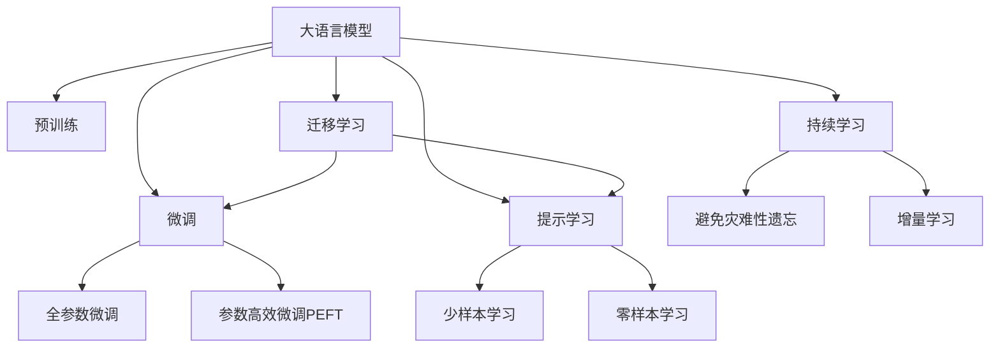

                 

# LLM在智能财务分析中的潜在贡献

## 1. 背景介绍

### 1.1 问题由来

随着人工智能（AI）技术的不断发展，大语言模型（Large Language Models, LLMs）在自然语言处理（NLP）领域展现了巨大潜力。LLMs如GPT、BERT等，能够通过大规模无监督学习获取丰富的语言知识，进而通过微调（Fine-Tuning）应用到特定领域，如智能财务分析（Smart Financial Analysis）中。然而，LLMs在财务分析领域的应用仍处于起步阶段，尚未形成系统的解决方案。

### 1.2 问题核心关键点

智能财务分析涉及对财务数据的深度分析和预测，需要模型具备高度的智能识别和决策能力。LLMs在理解自然语言和处理复杂语义方面具有天然优势，但在财务领域的应用还需解决以下关键问题：

- 如何高效处理海量财务数据并从中提取有价值的信息？
- 如何在模型中整合领域知识以提升预测准确性？
- 如何保证模型在财务数据中的鲁棒性和稳定性？
- 如何保证模型的可解释性和公平性？

### 1.3 问题研究意义

智能财务分析通过使用LLMs，能够大幅提升财务分析的效率和精度，帮助企业做出更准确的财务决策。具体来说：

- 加速决策过程：LLMs能够在短时间内处理大量复杂信息，加速财务分析过程。
- 提高预测准确性：通过整合财务领域知识和LLMs的通用语言能力，提升预测模型的准确性。
- 降低成本：减少人工干预和提高模型自动化，降低财务分析的人力和时间成本。
- 促进财务创新：LLMs在财务领域的应用可以带来新的分析方法和工具，推动财务技术的进步。

## 2. 核心概念与联系

### 2.1 核心概念概述

为更好地理解LLM在智能财务分析中的应用，本节将介绍几个关键概念：

- **大语言模型（LLMs）**：以自回归（如GPT）或自编码（如BERT）模型为代表，通过大规模无监督学习获得丰富语言知识的模型。
- **预训练**：在大量无监督数据上进行自监督学习，学习通用语言表示，为特定任务提供初始化知识。
- **微调（Fine-Tuning）**：在预训练模型基础上，通过有监督学习优化模型在特定任务上的性能。
- **迁移学习**：通过迁移预训练模型到特定领域，减少在该领域的数据和资源需求。
- **参数高效微调（PEFT）**：仅更新模型的一部分参数，保持预训练权重不变，提高微调效率。
- **提示学习**：通过特定格式的提示（Prompts）引导模型进行推理和生成，减少微调参数。

这些概念之间的联系可以通过以下Mermaid流程图展示：



## 3. 核心算法原理 & 具体操作步骤
### 3.1 算法原理概述

LLM在智能财务分析中的应用，本质上是通过有监督学习对预训练模型进行微调，以适应特定财务任务的需求。具体来说，可以按照以下步骤进行：

1. **数据收集与预处理**：收集财务领域的数据集，如财务报表、市场数据等，并进行清洗、标注和格式化处理。
2. **预训练模型的选择与准备**：选择适合的预训练模型（如BERT、GPT），并进行必要的初始化处理，如分词、填充等。
3. **任务适配层的添加**：根据财务分析任务，添加相应的输出层和损失函数。例如，分类任务可以使用交叉熵损失，回归任务可以使用均方误差损失。
4. **微调超参数的设置**：选择合适的优化器（如AdamW、SGD），设置学习率、批大小、迭代轮数等超参数。
5. **执行微调过程**：通过前向传播计算损失，反向传播更新模型参数，重复迭代直至收敛。
6. **模型评估与部署**：在验证集和测试集上评估微调后的模型性能，将其部署到实际应用系统中。

### 3.2 算法步骤详解

以**财务报表分类任务**为例，具体步骤可以描述如下：

1. **数据收集**：收集财务报表数据，标注每个报表属于的类别（如资产负债表、利润表）。
2. **预处理**：对数据进行清洗，去除无关内容，确保格式统一。
3. **预训练模型选择**：选择BERT作为预训练模型，利用其强大的语言理解能力。
4. **适配层添加**：添加线性分类器，使用交叉熵损失函数。
5. **微调超参数设置**：设置学习率为2e-5，使用AdamW优化器，设置批大小为16。
6. **执行微调**：使用训练集进行微调，在验证集上评估性能。
7. **模型评估**：在测试集上评估模型性能，记录准确率、召回率、F1-score等指标。
8. **模型部署**：将模型部署到实际应用中，进行财务报表分类预测。

### 3.3 算法优缺点

#### 优点：

- **效率高**：相较于从头训练模型，微调可以在短时间内获得较为精确的预测结果。
- **效果好**：利用预训练模型中的通用知识，微调后的模型在特定任务上表现优秀。
- **灵活性高**：通过调整任务适配层和损失函数，适用于多种财务分析任务。

#### 缺点：

- **数据依赖性高**：微调效果依赖于标注数据的质量和数量，数据不足会影响模型性能。
- **泛化能力有限**：预训练模型在特定领域的数据上表现较好，但在不同领域或数据分布发生变化时，可能泛化能力较弱。
- **潜在风险**：模型可能会继承预训练数据中的偏见，导致输出结果不公平或不准确。

### 3.4 算法应用领域

LLM在智能财务分析中的应用场景广泛，例如：

- **财务报表分类**：将财务报表分为资产负债表、利润表、现金流量表等类别。
- **财务预测**：利用历史财务数据预测未来的收入、成本、利润等财务指标。
- **异常检测**：通过分析财务数据，检测潜在的财务异常和风险。
- **情景分析**：根据不同情景下的财务数据，预测企业未来的财务状况。
- **审计支持**：辅助审计人员进行财务数据的分析和合规性检查。

## 4. 数学模型和公式 & 详细讲解 & 举例说明

### 4.1 数学模型构建

假设预训练模型为 $M_{\theta}$，其中 $\theta$ 为预训练得到的模型参数。财务分析任务为分类任务，假设数据集 $D=\{(x_i, y_i)\}_{i=1}^N$，其中 $x_i$ 为财务报表文本，$y_i$ 为类别标签。

定义模型 $M_{\theta}$ 在输入 $x_i$ 上的损失函数为 $\ell(M_{\theta}(x_i),y_i)$，则在数据集 $D$ 上的经验风险为：

$$
\mathcal{L}(\theta) = \frac{1}{N} \sum_{i=1}^N \ell(M_{\theta}(x_i),y_i)
$$

其中 $\ell$ 为交叉熵损失函数，具体为：

$$
\ell(M_{\theta}(x_i),y_i) = -y_i\log M_{\theta}(x_i) - (1-y_i)\log(1-M_{\theta}(x_i))
$$

### 4.2 公式推导过程

根据链式法则，损失函数对参数 $\theta_k$ 的梯度为：

$$
\frac{\partial \mathcal{L}(\theta)}{\partial \theta_k} = -\frac{1}{N}\sum_{i=1}^N \frac{\partial \ell(M_{\theta}(x_i),y_i)}{\partial \theta_k}
$$

代入 $\ell$ 函数，得：

$$
\frac{\partial \mathcal{L}(\theta)}{\partial \theta_k} = -\frac{1}{N}\sum_{i=1}^N \left[ y_i\frac{\partial \log M_{\theta}(x_i)}{\partial \theta_k} - (1-y_i)\frac{\partial \log(1-M_{\theta}(x_i))}{\partial \theta_k} \right]
$$

其中 $\frac{\partial \log M_{\theta}(x_i)}{\partial \theta_k}$ 可以通过反向传播算法计算得到。

### 4.3 案例分析与讲解

以**财务报表分类**为例，给定一个资产负债表文本：

```
资产负债表 2021
资产总额：100000000元
负债总额：50000000元
所有者权益：50000000元
```

假设使用BERT作为预训练模型，微调任务为分类资产负债表、利润表、现金流量表。首先，需要将文本输入BERT模型，获得每个词汇的表示：

$$
x = [x_1, x_2, ..., x_n]
$$

其中 $x_i$ 表示文本中第 $i$ 个词汇的BERT嵌入向量。接着，将嵌入向量通过适配层：

$$
y = M_{\theta}(x) = [y_1, y_2, ..., y_n]
$$

其中 $y_i$ 表示第 $i$ 个词汇的输出。最后，使用交叉熵损失函数计算模型输出与真实标签之间的差距：

$$
\ell(y, y_i) = -y_i\log y_i - (1-y_i)\log(1-y_i)
$$

将损失函数对 $\theta$ 求导，得到模型参数的更新公式：

$$
\theta \leftarrow \theta - \eta \nabla_{\theta}\mathcal{L}(\theta) - \eta\lambda\theta
$$

其中 $\eta$ 为学习率，$\lambda$ 为正则化系数。

## 5. 项目实践：代码实例和详细解释说明

### 5.1 开发环境搭建

为了进行财务分析的微调实践，需要搭建Python开发环境，并引入必要的库。以下是一个简单的环境搭建流程：

1. **安装Python**：选择Python版本（如3.7+），确保其与所选的预训练模型和微调库兼容。
2. **安装Anaconda**：从官网下载并安装Anaconda，用于创建虚拟环境和包管理。
3. **创建虚拟环境**：
```bash
conda create -n financial-env python=3.8
conda activate financial-env
```
4. **安装预训练模型**：使用pip或conda安装预训练模型（如BERT）的库。
5. **安装微调库**：安装HuggingFace的Transformers库，用于微调模型的接口和优化器。

### 5.2 源代码详细实现

以财务报表分类为例，以下是使用HuggingFace Transformers库进行BERT微调的Python代码实现：

```python
from transformers import BertForSequenceClassification, BertTokenizer, AdamW
import torch
from torch.utils.data import Dataset, DataLoader
from sklearn.model_selection import train_test_split

# 定义财务报表分类数据集
class FinancialReportDataset(Dataset):
    def __init__(self, texts, labels):
        self.texts = texts
        self.labels = labels
        self.tokenizer = BertTokenizer.from_pretrained('bert-base-uncased')
        self.max_len = 128

    def __len__(self):
        return len(self.texts)

    def __getitem__(self, item):
        text = self.texts[item]
        label = self.labels[item]
        encoding = self.tokenizer(text, truncation=True, max_length=self.max_len, padding='max_length', return_tensors='pt')
        input_ids = encoding['input_ids']
        attention_mask = encoding['attention_mask']
        return {'input_ids': input_ids, 'attention_mask': attention_mask, 'labels': torch.tensor(label, dtype=torch.long)}

# 加载财务报表分类数据
train_texts, test_texts, train_labels, test_labels = train_test_split(train_data, test_data, test_size=0.2, random_state=42)
train_dataset = FinancialReportDataset(train_texts, train_labels)
test_dataset = FinancialReportDataset(test_texts, test_labels)

# 初始化BERT模型和优化器
model = BertForSequenceClassification.from_pretrained('bert-base-uncased', num_labels=3)
optimizer = AdamW(model.parameters(), lr=2e-5)

# 微调过程
for epoch in range(5):
    train_loss = 0
    for batch in DataLoader(train_dataset, batch_size=16):
        input_ids = batch['input_ids'].to(device)
        attention_mask = batch['attention_mask'].to(device)
        labels = batch['labels'].to(device)
        model.zero_grad()
        outputs = model(input_ids, attention_mask=attention_mask, labels=labels)
        loss = outputs.loss
        train_loss += loss.item()
        loss.backward()
        optimizer.step()
    print(f'Epoch {epoch+1}, train loss: {train_loss/len(train_dataset)}')

# 评估模型性能
eval_loss = 0
for batch in DataLoader(test_dataset, batch_size=16):
    input_ids = batch['input_ids'].to(device)
    attention_mask = batch['attention_mask'].to(device)
    labels = batch['labels'].to(device)
    with torch.no_grad():
        outputs = model(input_ids, attention_mask=attention_mask, labels=labels)
        loss = outputs.loss
        eval_loss += loss.item()
print(f'Test loss: {eval_loss/len(test_dataset)}')
```

### 5.3 代码解读与分析

上述代码实现了财务报表分类的微调过程，包含以下关键步骤：

1. **数据处理**：定义自定义数据集，对财务报表文本进行分词、填充和截断。
2. **模型初始化**：选择BERT作为预训练模型，并使用其对应的分词器。
3. **优化器设置**：使用AdamW优化器，设置学习率为2e-5。
4. **模型训练**：在训练集上迭代训练，计算损失并更新模型参数。
5. **模型评估**：在测试集上评估模型性能，输出损失。

## 6. 实际应用场景

### 6.1 智能财务报告生成

智能财务报告生成系统能够自动从原始财务数据中提取关键信息，生成简洁明了的财务报告。使用微调后的LLM，可以将原始数据转化为结构化的报表和分析图表。例如，对于资产负债表，LLM能够识别资产和负债的具体项目，生成精确的财务指标，并在报告中插入关键数据和趋势分析。

### 6.2 财务预测与分析

LLM能够根据历史财务数据，预测未来的收入、成本、利润等财务指标。例如，利用微调后的模型，对企业的销售数据进行预测，生成销售增长趋势图。通过分析这些预测结果，企业可以更好地制定经营策略。

### 6.3 财务风险评估

LLM能够识别财务数据中的异常和风险点，辅助企业进行风险评估。例如，通过微调后的模型，对企业财务报表进行异常检测，识别潜在的财务风险，如债务过高、现金流不足等。

## 7. 工具和资源推荐

### 7.1 学习资源推荐

为系统掌握LLM在财务分析中的应用，以下是一些推荐的学习资源：

1. **《Transformers》书籍**：深入介绍Transformer架构和其在NLP中的应用，包括微调技术。
2. **CS224N《深度学习自然语言处理》课程**：斯坦福大学开设的NLP经典课程，涵盖财务NLP的基础知识和高级技巧。
3. **HuggingFace官方文档**：提供详细的微调接口和示例代码，适合初学者和进阶者。
4. **Kaggle竞赛**：参加Kaggle财务NLP竞赛，实战练习和应用LLM技术。

### 7.2 开发工具推荐

以下是一些推荐的使用工具：

1. **PyTorch**：用于深度学习模型的训练和推理。
2. **TensorFlow**：Google开发的深度学习框架，支持分布式计算和GPU加速。
3. **HuggingFace Transformers**：提供了丰富的预训练模型和微调接口。
4. **Jupyter Notebook**：交互式编程环境，适合开发和调试模型。
5. **Google Colab**：Google提供的免费GPU环境，适合快速实验。

### 7.3 相关论文推荐

为了深入了解LLM在财务分析中的应用，以下是一些推荐的相关论文：

1. **A Survey of Transformer Models for Financial NLP**：综述了当前主流的Transformer模型在财务NLP中的应用。
2. **Fine-Tuning BERT for Financial Text Classification**：介绍使用BERT进行财务文本分类的微调方法。
3. **Semantic Similarity-based Financial Risk Assessment Using LSTM-based Models**：使用LSTM模型进行财务风险评估。

## 8. 总结：未来发展趋势与挑战

### 8.1 研究成果总结

本文系统介绍了LLM在智能财务分析中的应用，包括数据处理、模型微调、实际应用等方面。通过系统学习，读者可以掌握财务领域的LLM微调技术，提升财务分析的智能化水平。

### 8.2 未来发展趋势

未来，LLM在财务分析中的应用将呈现以下趋势：

1. **自动化程度提升**：LLM将更广泛地应用于财务报告生成、预测分析等自动化任务。
2. **数据处理能力增强**：LLM能够更好地处理复杂的多模态数据，如文本、图像、语音等。
3. **多领域融合**：LLM将与其他AI技术（如知识图谱、因果推理）结合，提升财务分析的深度和广度。
4. **模型优化**：LLM将进一步优化模型结构，提高计算效率，降低资源消耗。

### 8.3 面临的挑战

尽管LLM在财务分析中展现了巨大潜力，但仍面临以下挑战：

1. **数据隐私与安全**：财务数据敏感，如何保护数据隐私和安全是重要问题。
2. **模型公平性**：避免模型偏见，保证不同背景下的公平性。
3. **模型可解释性**：提升模型的可解释性，帮助用户理解其决策过程。
4. **模型泛化能力**：在财务领域之外，模型的泛化能力需进一步提升。
5. **资源限制**：高性能计算资源的高成本限制了模型的应用范围。

### 8.4 研究展望

未来的研究将集中在以下几个方向：

1. **模型优化与加速**：开发更加高效的模型架构和算法，提高财务分析的速度和效率。
2. **知识融合与推理**：整合财务领域的知识库和规则库，增强模型的推理能力。
3. **跨模态分析**：将文本、图像、语音等多模态数据结合，提升财务分析的全面性。
4. **隐私保护与公平性**：研究隐私保护技术和公平性算法，保证模型的合法合规。

## 9. 附录：常见问题与解答

**Q1：LLM在财务分析中如何避免数据隐私问题？**

A: 采用差分隐私技术，对数据进行扰动处理，保护用户隐私。同时，使用本地计算模型，避免数据泄露。

**Q2：如何保证微调模型的公平性？**

A: 在微调过程中，引入公平性约束，如对抗性样本生成、公平性损失函数等，保证不同群体的公平性。

**Q3：如何提升模型的可解释性？**

A: 使用可解释性技术，如LIME、SHAP等，生成模型的特征重要性解释。同时，结合领域知识，解释模型输出。

**Q4：如何处理多模态数据？**

A: 将不同模态的数据进行统一处理，提取特征向量，输入LLM模型进行分析和推理。

**Q5：如何优化模型性能？**

A: 使用混合精度训练、模型剪枝、知识蒸馏等技术，优化模型结构和计算效率。

通过上述分析和实践，LLM在智能财务分析中的应用将更加广泛和深入。相信未来在AI技术的推动下，财务分析的智能化水平将进一步提升，为企业决策提供更强大、更可靠的支持。

