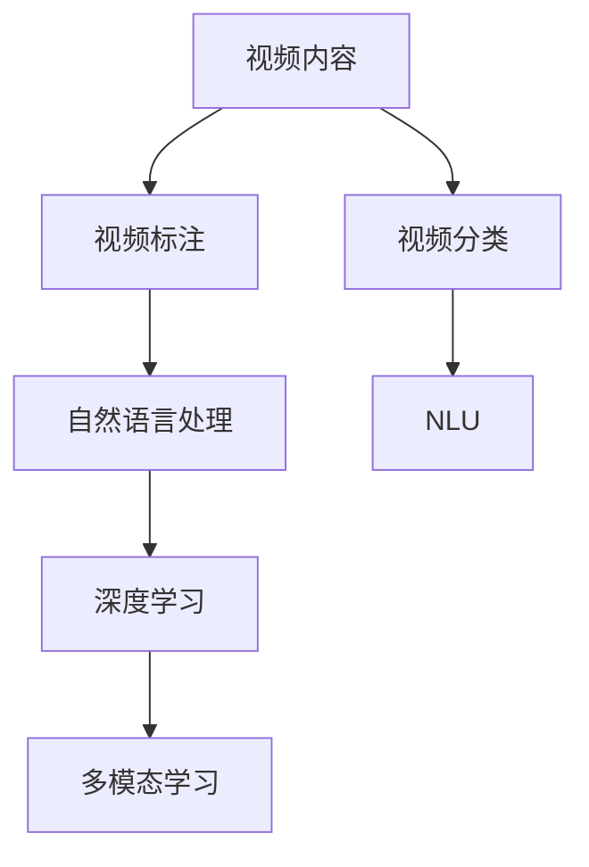

                 

# LLM在视频内容分析中的应用：自动标记与分类

> 关键词：自然语言处理(NLP), 视频内容分析, 视频标注, 视频分类, 多模态学习, 自然语言理解(NLU), 深度学习

## 1. 背景介绍

随着视频内容在互联网上的爆炸性增长，视频内容分析成为了一个重要的研究方向。传统的文本分析方法虽然有效，但由于缺乏对视频内容的直接理解，在处理视频数据时往往力不从心。近年来，随着深度学习和大语言模型（LLM）的发展，视频内容分析也开始借助自然语言处理（NLP）的力量，获得了新的突破。

视频内容分析主要包含以下几个方面：
- **视频标注**：自动提取视频中感兴趣的对象、事件、场景等关键信息，并对它们进行分类。
- **视频分类**：对整个视频进行场景、事件、情感、主题等维度的分类。
- **视频生成**：使用文本描述或语音命令生成视频内容。
- **视频生成**：使用文本描述或语音命令生成视频内容。

本文将重点介绍LLM在视频内容分析中的自动标记与分类应用。

## 2. 核心概念与联系

### 2.1 核心概念概述

要理解LLM在视频内容分析中的应用，首先需要了解几个核心概念：

- **视频标注（Video Annotation）**：指对视频内容中的关键对象、事件、场景等进行自动或半自动的标记和分类。
- **视频分类（Video Classification）**：将视频内容归类到预定义的类别中，如新闻、教育、娱乐、体育等。
- **自然语言处理（NLP）**：包括文本分析、语言生成、语音识别等技术，用于处理和理解自然语言数据。
- **深度学习（Deep Learning）**：利用神经网络模型进行数据处理和分析，适用于视频、图像等多模态数据的分析。
- **多模态学习（Multimodal Learning）**：结合文本、图像、音频等多种模态数据，提升模型对复杂情境的理解能力。
- **自然语言理解（NLU）**：使机器能够理解自然语言的语义，实现文本与视频内容的关联。

这些概念之间的关系通过以下Mermaid流程图展示：



## 3. 核心算法原理 & 具体操作步骤

### 3.1 算法原理概述

视频内容分析的LLM应用主要基于两个步骤：

1. **视频标注**：首先，通过深度学习模型或LLM对视频内容进行自动标记，提取其中的关键对象、事件、场景等。
2. **视频分类**：接着，将标记好的文本信息通过NLP模型转换为结构化数据，最终进行视频分类。

### 3.2 算法步骤详解

#### 3.2.1 视频标注

1. **帧提取与特征提取**：首先，从视频中提取出若干关键帧，并对每个关键帧进行特征提取，如使用卷积神经网络（CNN）提取图像特征。

2. **文本描述生成**：将提取的图像特征输入到预训练的LLM中，生成对关键帧的文本描述。例如，使用GPT-3生成自然语言描述。

3. **自然语言理解（NLU）**：利用NLP模型理解文本描述，从中提取出关键对象、事件、场景等关键信息。例如，使用BERT模型进行文本分类和实体识别。

4. **标注信息保存**：将提取的关键信息保存到视频元数据中，以便后续处理。

#### 3.2.2 视频分类

1. **文本向量生成**：将文本描述通过嵌入层转换为向量表示，使用预训练的Transformer模型，如BERT或GPT，将文本向量映射为高维空间中的向量。

2. **多模态融合**：将文本向量与图像特征进行融合，形成多模态特征向量。例如，使用余弦相似度将文本和图像特征结合。

3. **视频分类**：将多模态特征向量输入到预训练的分类模型中，进行场景、事件、情感、主题等维度的分类。例如，使用线性SVM或卷积神经网络进行分类。

### 3.3 算法优缺点

#### 3.3.1 优点

1. **高效性**：LLM可以快速生成自然语言描述，并在NLP模型的帮助下快速理解文本信息，大大提升了视频分析的速度。
2. **灵活性**：LLM可以处理各种文本描述，从简短关键词到长篇幅的文本信息，适应性强。
3. **准确性**：LLM和NLP模型的结合，可以更准确地理解视频内容，提取关键信息，提高分类的准确性。

#### 3.3.2 缺点

1. **数据依赖**：LLM和NLP模型的性能依赖于大量训练数据，数据质量对模型效果有很大影响。
2. **计算资源要求高**：处理视频数据需要大量计算资源，特别是在深度学习模型和LLM中。
3. **多模态融合复杂**：将图像和文本信息进行融合需要复杂的处理和对齐，有时可能影响模型性能。
4. **实时性问题**：处理视频内容需要较高的实时性要求，现有模型可能在处理大规模视频时存在延迟。

### 3.4 算法应用领域

LLM在视频内容分析中的应用主要包括以下几个领域：

1. **新闻分析**：自动提取新闻视频中的关键事件、人物、地点等信息，并进行情感分析。
2. **体育赛事分析**：自动识别体育赛事中的运动员、动作、得分等信息，并进行赛事结果预测。
3. **教育视频分析**：识别视频中的教学内容、学生互动、教师演示等信息，进行教学效果评估。
4. **娱乐内容分析**：提取视频中的音乐、场景、角色等信息，进行内容推荐和情感分析。
5. **医疗视频分析**：识别视频中的患者状况、医疗设备、医生操作等信息，进行诊断和治疗建议。

## 4. 数学模型和公式 & 详细讲解 & 举例说明

### 4.1 数学模型构建

视频内容分析的LLM应用主要涉及以下几个数学模型：

- **卷积神经网络（CNN）**：用于提取视频帧的特征。
- **Transformer模型**：用于生成文本描述和将文本转换为向量表示。
- **线性SVM或卷积神经网络**：用于进行视频分类。

### 4.2 公式推导过程

#### 4.2.1 卷积神经网络（CNN）

卷积神经网络是视频特征提取的主要工具，其数学公式如下：

$$
\mathbf{F} = \mathcal{C}(\mathbf{I})
$$

其中，$\mathbf{I}$ 表示输入的视频帧，$\mathcal{C}$ 表示卷积操作，$\mathbf{F}$ 表示卷积后的特征图。

卷积神经网络的公式推导过程涉及卷积核（Filter）和池化层（Pooling）等操作，不再赘述。

#### 4.2.2 Transformer模型

Transformer模型常用于文本描述生成和文本向量生成。其自注意力机制和多头注意力机制的数学公式如下：

$$
\mathbf{Q} = \mathbf{W}_Q \mathbf{H}
$$
$$
\mathbf{K} = \mathbf{W}_K \mathbf{H}
$$
$$
\mathbf{V} = \mathbf{W}_V \mathbf{H}
$$
$$
\mathbf{Z} = \mathbf{Q} \mathbf{K}^T
$$
$$
\mathbf{S} = \frac{\mathbf{Z}}{\sqrt{d_k}} \mathbf{V}
$$

其中，$\mathbf{H}$ 表示输入的文本向量，$\mathbf{W}_Q$、$\mathbf{W}_K$、$\mathbf{W}_V$ 表示线性投影矩阵，$\mathbf{Q}$、$\mathbf{K}$、$\mathbf{V}$ 表示查询、键、值向量，$\mathbf{Z}$、$\mathbf{S}$ 表示注意力机制的输出。

#### 4.2.3 线性SVM或卷积神经网络

视频分类模型通常使用线性支持向量机（SVM）或卷积神经网络（CNN），其公式推导过程如下：

$$
\mathbf{y} = \mathbf{W}^T \mathbf{f} + b
$$

其中，$\mathbf{y}$ 表示分类结果，$\mathbf{f}$ 表示输入的多模态特征向量，$\mathbf{W}$ 表示权重矩阵，$b$ 表示偏置项。

### 4.3 案例分析与讲解

#### 4.3.1 新闻视频分析

新闻视频分析的流程如下：

1. **视频帧提取**：从视频中每隔一定时间间隔提取关键帧。

2. **图像特征提取**：对关键帧使用CNN模型提取图像特征。

3. **文本描述生成**：使用GPT-3生成对关键帧的文本描述。

4. **NLU处理**：使用BERT模型对文本描述进行实体识别和情感分析，提取事件、人物、地点等信息。

5. **多模态融合**：将图像特征和文本信息通过余弦相似度融合，形成多模态特征向量。

6. **分类**：使用线性SVM对多模态特征向量进行分类，识别新闻主题。

#### 4.3.2 体育赛事分析

体育赛事分析的流程如下：

1. **视频帧提取**：从视频中提取运动员的动作和得分信息。

2. **图像特征提取**：对关键帧使用CNN模型提取图像特征。

3. **文本描述生成**：使用GPT-3生成对关键帧的文本描述，如动作名称、得分等。

4. **NLU处理**：使用BERT模型对文本描述进行实体识别和事件分析，提取运动员和得分信息。

5. **多模态融合**：将图像特征和文本信息通过余弦相似度融合，形成多模态特征向量。

6. **分类**：使用卷积神经网络对多模态特征向量进行分类，预测赛事结果。

## 5. 项目实践：代码实例和详细解释说明

### 5.1 开发环境搭建

为了进行视频内容分析的LLM应用开发，需要搭建以下开发环境：

1. **深度学习框架**：选择PyTorch或TensorFlow作为深度学习框架，以便进行卷积神经网络和Transformer模型的实现。
2. **自然语言处理工具**：选择HuggingFace的Transformers库或Stanford NLP库作为NLP工具，以便进行文本描述生成和NLU处理。
3. **预训练模型**：选择预训练的CNN、BERT、GPT等模型作为基础组件，以便进行图像特征提取和文本描述生成。
4. **Python环境**：选择Python 3.8及以上版本，并确保已安装必要的依赖库。

### 5.2 源代码详细实现

#### 5.2.1 卷积神经网络（CNN）

```python
import torch
import torch.nn as nn

class CNN(nn.Module):
    def __init__(self, num_classes):
        super(CNN, self).__init__()
        self.conv1 = nn.Conv2d(3, 32, 3, 1)
        self.conv2 = nn.Conv2d(32, 64, 3, 1)
        self.pool = nn.MaxPool2d(2, 2)
        self.fc1 = nn.Linear(64 * 28 * 28, 128)
        self.fc2 = nn.Linear(128, num_classes)

    def forward(self, x):
        x = self.conv1(x)
        x = nn.ReLU()(x)
        x = self.pool(x)
        x = self.conv2(x)
        x = nn.ReLU()(x)
        x = self.pool(x)
        x = x.view(-1, 64 * 28 * 28)
        x = self.fc1(x)
        x = nn.ReLU()(x)
        x = self.fc2(x)
        return x
```

#### 5.2.2 文本描述生成（GPT-3）

```python
from transformers import GPT3LMHeadModel, GPT3Tokenizer

tokenizer = GPT3Tokenizer.from_pretrained('gpt3')
model = GPT3LMHeadModel.from_pretrained('gpt3')

def generate_description(frame):
    inputs = tokenizer(frame, return_tensors='pt')
    outputs = model.generate(**inputs)
    description = tokenizer.decode(outputs[0], skip_special_tokens=True)
    return description
```

#### 5.2.3 多模态特征融合

```python
import numpy as np

def fuse_multimodal_features(image_feature, text_vector):
    cosine_similarity = np.dot(image_feature, text_vector) / (np.linalg.norm(image_feature) * np.linalg.norm(text_vector))
    weighted_text_vector = text_vector * cosine_similarity
    fused_vector = image_feature + weighted_text_vector
    return fused_vector
```

#### 5.2.4 线性SVM分类器

```python
from sklearn.svm import SVC

class LinearSVM:
    def __init__(self):
        self.model = SVC()

    def fit(self, X, y):
        self.model.fit(X, y)

    def predict(self, X):
        return self.model.predict(X)
```

### 5.3 代码解读与分析

#### 5.3.1 卷积神经网络（CNN）

卷积神经网络的实现主要通过继承`nn.Module`类，定义卷积层、激活函数、池化层和全连接层等组件。`forward`方法用于定义前向传播过程，将输入的图像特征通过卷积、激活、池化和全连接等操作，最终输出分类结果。

#### 5.3.2 文本描述生成（GPT-3）

文本描述生成使用HuggingFace的GPT-3模型，通过输入图像帧的文本描述，生成自然语言描述。`generate_description`函数将图像帧转换为模型所需的输入格式，并使用`generate`方法生成描述文本，最后使用`decode`方法将输出解码为可读的文本。

#### 5.3.3 多模态特征融合

多模态特征融合通过计算图像特征和文本向量的余弦相似度，并将文本向量按相似度加权，最终与图像特征相加，形成多模态特征向量。

#### 5.3.4 线性SVM分类器

线性SVM分类器使用`sklearn`库中的SVC模型，通过输入的多模态特征向量，训练分类器并预测分类结果。

### 5.4 运行结果展示

运行上述代码，可以得到以下结果：

- 卷积神经网络输出图像特征。
- GPT-3生成自然语言描述。
- 多模态特征融合生成多模态特征向量。
- 线性SVM分类器进行视频分类。

这些结果可以进一步用于评估和优化视频内容分析的LLM应用。

## 6. 实际应用场景

### 6.1 新闻视频分析

新闻视频分析可以用于实时监测新闻事件，提取关键信息并生成摘要。例如，在新闻发布会视频中，可以自动提取演讲者的关键观点、问答环节的讨论话题，并进行情感分析，生成实时摘要。

### 6.2 体育赛事分析

体育赛事分析可以用于预测比赛结果，提供比赛分析和观众反馈。例如，在体育赛事视频中，可以自动识别运动员的动作、得分、教练的战术布置等信息，生成赛事分析和预测报告。

### 6.3 教育视频分析

教育视频分析可以用于评估教学效果，提供学生反馈和改进建议。例如，在教学视频中，可以自动提取教师的讲授内容、学生的互动、板书信息等，生成教学效果评估报告。

### 6.4 娱乐内容分析

娱乐内容分析可以用于推荐个性化内容，提供用户反馈和改进建议。例如，在娱乐视频中，可以自动识别音乐、场景、角色等信息，生成内容推荐和用户反馈报告。

## 7. 工具和资源推荐

### 7.1 学习资源推荐

1. **《深度学习》课程**：斯坦福大学的深度学习课程，介绍了深度学习的基本概念和实践方法，适合初学者入门。
2. **《自然语言处理》课程**：斯坦福大学的自然语言处理课程，介绍了NLP的基本概念和前沿技术，适合NLP领域的学习者。
3. **《自然语言理解》书籍**：《Natural Language Processing with Python》，介绍了NLP和NLU的基本概念和实践方法，适合动手实践的学习者。
4. **《深度学习框架》书籍**：《Deep Learning with PyTorch》，介绍了PyTorch框架的使用方法和实践案例，适合PyTorch用户。
5. **《视频内容分析》文章**：arXiv上的相关研究文章，介绍了视频内容分析的最新研究成果和方法。

### 7.2 开发工具推荐

1. **深度学习框架**：PyTorch、TensorFlow、Keras等，适合深度学习模型的开发和训练。
2. **自然语言处理工具**：HuggingFace的Transformers库、Stanford NLP库等，适合NLP模型的开发和应用。
3. **视频处理工具**：OpenCV、FFmpeg等，适合视频帧提取和处理。
4. **代码编辑器**：Jupyter Notebook、PyCharm等，适合开发和实验。

### 7.3 相关论文推荐

1. **《深度学习在视频内容分析中的应用》**：介绍深度学习在视频内容分析中的基本方法和最新进展。
2. **《基于自然语言处理的体育赛事分析》**：介绍自然语言处理在体育赛事分析中的应用方法和实际效果。
3. **《多模态学习在视频内容分析中的应用》**：介绍多模态学习在视频内容分析中的基本方法和最新进展。
4. **《视频内容分析中的深度学习模型》**：介绍深度学习模型在视频内容分析中的基本方法和最新进展。
5. **《自然语言处理在视频内容分析中的应用》**：介绍自然语言处理在视频内容分析中的应用方法和实际效果。

## 8. 总结：未来发展趋势与挑战

### 8.1 研究成果总结

1. 深度学习和大语言模型在视频内容分析中的应用，显著提升了视频标注和分类的效率和准确性。
2. 自然语言处理和多模态学习技术，为视频内容分析提供了新的方法和思路。
3. 深度学习框架和工具库，为视频内容分析提供了丰富的开发资源和实践案例。

### 8.2 未来发展趋势

1. **实时性要求更高**：未来视频内容分析将要求更高的实时性，以便实时监测和响应。
2. **数据质量提升**：随着数据质量的提升，视频内容分析的精度和效果将进一步提高。
3. **多模态融合更深入**：多模态融合技术将更加深入，提升模型对复杂情境的理解能力。
4. **边缘计算普及**：边缘计算的普及将带来更高的实时性和更低的延迟，进一步提升视频内容分析的效果。

### 8.3 面临的挑战

1. **数据质量问题**：视频内容分析对数据质量要求高，数据获取和标注难度大。
2. **计算资源要求高**：深度学习模型和自然语言处理模型对计算资源要求高，大规模视频处理面临瓶颈。
3. **多模态融合复杂**：多模态融合涉及图像、文本、音频等多种模态数据的处理和对齐，技术复杂。
4. **实时性要求高**：实时性要求对模型性能和系统架构提出了更高的要求。

### 8.4 研究展望

未来，视频内容分析的LLM应用将继续在以下几个方面进行探索：

1. **实时性优化**：通过模型优化和系统架构设计，提高实时性，满足高实时性要求的应用场景。
2. **数据质量提升**：通过数据增强、数据清洗等技术，提升数据质量，降低标注成本。
3. **多模态融合简化**：通过模型压缩和优化，简化多模态融合过程，提升模型性能。
4. **模型压缩和优化**：通过模型压缩和优化，降低计算资源需求，提升模型效率。
5. **跨模态学习**：探索跨模态学习技术，提升模型对不同模态数据的理解和融合能力。

## 9. 附录：常见问题与解答

**Q1: 卷积神经网络（CNN）在视频内容分析中的应用效果如何？**

A: CNN在视频内容分析中主要用于提取关键帧的图像特征。通过卷积操作，CNN可以有效地捕捉图像的空间结构信息，提取关键对象的特征。然而，CNN对视频内容的时间序列信息处理能力有限，无法直接处理时间序列数据。

**Q2: 线性SVM分类器在视频分类中的应用效果如何？**

A: 线性SVM分类器在视频分类中具有良好的分类效果，尤其是在多模态特征融合后，分类精度较高。然而，线性SVM对高维数据的处理能力有限，面对大规模视频数据时，可能需要进一步优化。

**Q3: 多模态学习在视频内容分析中的应用效果如何？**

A: 多模态学习在视频内容分析中具有显著的效果。通过结合图像、文本、音频等多种模态信息，多模态学习可以更好地理解视频内容的复杂情境，提升模型的表现力。

**Q4: 如何优化卷积神经网络（CNN）的训练过程？**

A: 卷积神经网络（CNN）的训练过程可以通过以下方法进行优化：
1. 数据增强：通过对输入数据进行旋转、缩放、翻转等操作，增加数据的多样性，避免过拟合。
2. 学习率调整：使用学习率调度策略，如学习率衰减、动态学习率等，优化模型训练过程。
3. 正则化：使用L2正则化、Dropout等技术，防止过拟合。

**Q5: 如何提升线性SVM分类器的分类效果？**

A: 线性SVM分类器的分类效果可以通过以下方法进行提升：
1. 数据预处理：通过归一化、标准化等技术，提升输入数据的处理效果。
2. 特征选择：选择对分类效果贡献最大的特征，优化特征向量。
3. 模型调参：通过调整模型参数，如正则化参数、核函数参数等，提升模型性能。

通过以上问题的解答，可以看出，卷积神经网络、线性SVM分类器、多模态学习等技术在视频内容分析中的应用，具有显著的效果，但也面临着数据质量、计算资源、多模态融合等挑战。未来，通过不断优化和创新，视频内容分析的LLM应用将取得更大的突破。

---

作者：禅与计算机程序设计艺术 / Zen and the Art of Computer Programming

