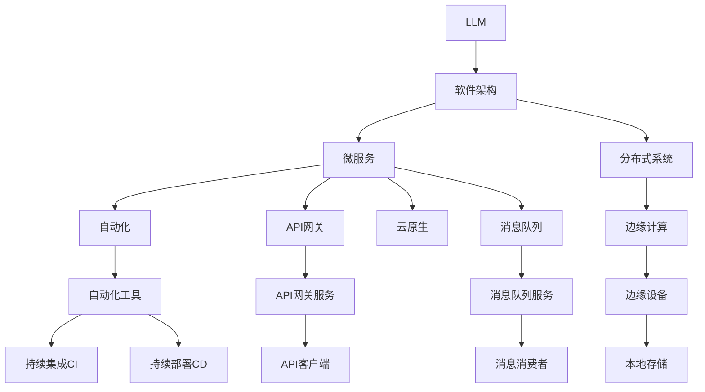

                 

# LLM对传统软件架构的挑战与革新

> 关键词：
- 大语言模型 (Large Language Models, LLMs)
- 软件架构 (Software Architecture)
- 微服务 (Microservices)
- 分布式系统 (Distributed Systems)
- 自动化 (Automation)
- 边缘计算 (Edge Computing)
- 云原生 (Cloud Native)

## 1. 背景介绍

### 1.1 问题由来
随着人工智能(AI)技术的迅猛发展，大语言模型(LLMs)在自然语言处理(NLP)领域取得了显著进展，例如GPT-3和BERT等。这些模型通过大规模预训练和微调，能够在各种任务上取得卓越的性能，如文本生成、翻译、问答等。然而，传统的软件架构难以直接支持这些复杂的LLM应用，需要对其架构进行相应的调整和革新。

### 1.2 问题核心关键点
目前，LLM在实际应用中面临的关键问题包括：

- 数据处理和存储：大模型需要处理大量文本数据，对存储和计算资源需求高。
- 模型推理和响应速度：LLM推理复杂，需要高效算法优化。
- 模型部署和监控：需要支持模型的高效部署和持续监控。
- 安全性与隐私：大模型的输入输出可能包含敏感信息，需关注安全性与隐私保护。
- 跨域集成与协作：LLM需要与其他系统协作，如API集成、数据共享等。

### 1.3 问题研究意义
研究LLM对传统软件架构的挑战与革新，对于推动AI技术的商业化落地，构建智能应用具有重要意义：

- 提升系统性能：优化架构以适应LLM的高性能要求，提升系统响应速度和服务质量。
- 提高可维护性：通过模块化、服务化架构，提升系统的可维护性和扩展性。
- 实现安全与隐私保护：通过数据加密、访问控制等手段，保障LLM应用的安全性和隐私性。
- 支持跨域集成：通过API网关、消息队列等技术，支持LLM与不同系统的无缝集成与协作。
- 促进企业数字化转型：基于LLM的软件架构革新，帮助企业构建智能、灵活、高效的服务。

## 2. 核心概念与联系

### 2.1 核心概念概述

为更好地理解LLM对传统软件架构的影响，本节将介绍几个密切相关的核心概念：

- 大语言模型(LLM)：以自回归(如GPT)或自编码(如BERT)模型为代表的大规模预训练语言模型。通过在大规模无标签文本语料上进行预训练，学习通用的语言表示，具备强大的语言理解和生成能力。

- 软件架构(Software Architecture)：指软件系统的整体设计，包括系统模块划分、组件间通信、数据流控制、安全机制等。软件架构是系统性能、可维护性和扩展性的关键。

- 微服务(Microservices)：将大型应用拆分成多个小型、独立运行的服务，每个服务负责特定功能，通过API进行通信。微服务架构提高了系统的灵活性、可扩展性和可维护性。

- 分布式系统(Distributed Systems)：由多个独立运行的计算节点通过网络协同工作，共同处理任务的系统。分布式系统能够提升计算资源利用率，支持高并发和大规模数据处理。

- 自动化(Automation)：指使用工具和算法自动化执行重复性工作，提升工作效率和系统稳定性。

- 边缘计算(Edge Computing)：指在靠近数据源的设备上进行数据处理和存储，降低数据传输延迟，提升数据处理效率。

- 云原生(Cloud Native)：指利用云计算平台的特点构建和运行软件系统，实现高效资源利用、弹性伸缩和持续部署。

这些核心概念之间的逻辑关系可以通过以下Mermaid流程图来展示：



这个流程图展示了大语言模型与软件架构及其子概念之间的关系：

1. LLM通过预训练获得基础能力。
2. 微服务架构将LLM功能模块化，提升灵活性和扩展性。
3. 分布式系统支持LLM的高并发和大数据处理需求。
4. 自动化工具提高LLM应用的开发和部署效率。
5. 边缘计算降低LLM推理延迟，提升响应速度。
6. 云原生架构实现LLM应用的弹性伸缩和持续部署。
7. API网关和消息队列支持LLM与不同系统的集成与协作。

## 3. 核心算法原理 & 具体操作步骤
### 3.1 算法原理概述

基于LLM的软件架构革新，本质上是将LLM作为核心功能模块，集成到现有的软件架构中。其主要目标在于：

- 优化架构以支持LLM的高性能需求。
- 增强系统的可维护性和扩展性。
- 实现高可靠性、高可用性的系统设计。

形式化地，假设LLM作为核心功能模块 $M$，集成到软件架构 $A$ 中，优化目标是最小化软件架构的整体成本，同时最大化系统的性能和服务质量。

### 3.2 算法步骤详解

基于LLM的软件架构优化一般包括以下几个关键步骤：

**Step 1: 系统重构**
- 分析现有系统架构，确定LLM的应用场景和集成方式。
- 设计合理的模块划分和组件间通信方式。

**Step 2: 引入微服务架构**
- 将LLM功能模块化，设计独立的微服务。
- 使用API网关和微服务治理工具，管理微服务之间的通信和协作。

**Step 3: 引入分布式计算**
- 使用分布式任务调度系统，支持LLM的高并发和大数据处理。
- 使用消息队列和数据同步工具，保障系统一致性和数据可靠性。

**Step 4: 自动化与监控**
- 引入自动化工具，如持续集成(CI)和持续部署(CD)，加速开发和部署。
- 使用监控工具，实时监测系统性能和异常情况，保障系统稳定性。

**Step 5: 边缘计算集成**
- 将LLM部署到边缘计算节点，降低数据传输延迟，提升响应速度。
- 在边缘节点上进行本地数据处理和存储，减少数据传输成本。

**Step 6: 云原生部署**
- 使用容器化技术，实现LLM应用的弹性伸缩和持续部署。
- 使用云服务，实现资源的高效利用和自动扩缩容。

以上是基于LLM的软件架构优化的一般流程。在实际应用中，还需要针对具体系统特点，对上述步骤进行优化设计，如改进模块划分方式、优化组件间通信协议、优化任务调度策略等，以进一步提升系统性能和服务质量。

### 3.3 算法优缺点

基于LLM的软件架构优化方法具有以下优点：
1. 适应性强：微服务架构支持灵活模块化，能够快速响应业务需求变化。
2. 可维护性高：通过API网关和微服务治理，提高了系统的可维护性和扩展性。
3. 高可靠性：分布式系统提供了高可用性和故障隔离机制，保障了系统稳定性。
4. 高性能：通过分布式计算和边缘计算，支持LLM的高并发和大数据处理需求。
5. 高效部署：云原生架构支持快速部署和弹性伸缩，提升了开发和运维效率。

同时，该方法也存在一定的局限性：
1. 复杂度高：微服务架构和分布式系统设计复杂，需要深厚的架构知识和经验。
2. 资源消耗大：分布式系统和高并发需求对计算资源和网络带宽提出了较高要求。
3. 数据隐私和安全问题：LLM需要处理大量敏感数据，隐私和安全问题需重点关注。
4. 成本高：初始架构设计和优化成本高，尤其是涉及分布式和云原生架构时。
5. 开发难度大：架构重构和微服务开发难度大，需投入大量人力和时间。

尽管存在这些局限性，但就目前而言，基于LLM的软件架构优化方法仍是大语言模型应用的重要范式。未来相关研究的重点在于如何进一步降低架构设计和优化的复杂度，提高系统的易用性和开发效率，同时兼顾高性能和安全性等因素。

### 3.4 算法应用领域

基于LLM的软件架构优化方法在NLP领域已经得到了广泛的应用，涵盖了大规模文本处理、自然语言生成、智能问答等诸多应用场景。例如：

- 智能客服：通过微服务架构和分布式系统支持，智能客服系统能够高效响应客户咨询，提供自然流畅的交互体验。
- 金融风控：通过引入微服务和分布式计算，金融风控系统能够处理海量数据，实时评估风险。
- 智能推荐：通过微服务和云原生架构，推荐系统能够高效计算用户兴趣，快速推送个性化内容。
- 智能搜索：通过微服务架构和API网关，智能搜索系统能够支持多语言搜索，提升用户体验。

除了这些典型应用外，基于LLM的软件架构优化技术也被创新性地应用到更多场景中，如智能医疗、智慧城市、工业互联网等，为各行各业带来了新的发展机遇。

## 4. 数学模型和公式 & 详细讲解  
### 4.1 数学模型构建

本节将使用数学语言对基于LLM的软件架构优化过程进行更加严格的刻画。

假设LLM为 $M_{\theta}:\mathcal{X} \rightarrow \mathcal{Y}$，其中 $\mathcal{X}$ 为输入空间，$\mathcal{Y}$ 为输出空间，$\theta \in \mathbb{R}^d$ 为模型参数。假设软件架构为 $A$，由若干个服务模块 $S_i$ 组成，每个服务模块的计算复杂度为 $C_i$，响应时间分别为 $T_i$，系统总响应时间为 $T_{\text{total}}$。

软件架构优化目标是最小化系统总响应时间 $T_{\text{total}}$，即：

$$
\min_{\theta} T_{\text{total}} = \sum_{i=1}^n T_i
$$

其中 $T_i = \frac{C_i}{\text{speed}_i}$，$\text{speed}_i$ 为服务模块 $S_i$ 的计算速度，通常与模型参数 $\theta$ 相关。

### 4.2 公式推导过程

以下我们以智能客服系统为例，推导优化模型。

假设系统由多个微服务组成，每个微服务计算复杂度为 $C_i$，响应时间为 $T_i$，系统总响应时间为 $T_{\text{total}}$。优化目标是使系统总响应时间最小化：

$$
\min_{\theta} T_{\text{total}} = \sum_{i=1}^n T_i = \sum_{i=1}^n \frac{C_i}{\text{speed}_i}
$$

其中 $\text{speed}_i = f_i(\theta)$，$f_i(\theta)$ 为服务模块 $S_i$ 的计算速度函数，通常与模型参数 $\theta$ 相关。

为了最小化系统总响应时间，需要对每个服务模块的计算速度进行优化，即：

$$
\min_{\theta} \sum_{i=1}^n \frac{C_i}{f_i(\theta)}
$$

该问题可以通过分布式计算和边缘计算等技术，将计算任务分配到多个节点上执行，从而提升系统总响应速度。

## 5. 项目实践：代码实例和详细解释说明
### 5.1 开发环境搭建

在进行LLM软件架构优化实践前，我们需要准备好开发环境。以下是使用Python进行Kubernetes和Docker开发的环境配置流程：

1. 安装Kubernetes：从官网下载并安装Kubernetes，搭建集群。
2. 安装Docker：从官网下载并安装Docker，搭建本地镜像仓库。
3. 安装Helm：从官网下载并安装Helm，简化Kubernetes的部署和管理。
4. 安装Jupyter Notebook：从官网下载并安装Jupyter Notebook，提供交互式开发环境。
5. 配置环境变量：设置Kubernetes、Docker、Helm、Jupyter Notebook等工具的路径和配置参数。

完成上述步骤后，即可在集群环境中开始架构优化实践。

### 5.2 源代码详细实现

下面我以智能客服系统为例，给出使用Kubernetes和Docker实现LLM微服务的PyTorch代码实现。

首先，定义智能客服系统的网络架构：

```yaml
apiVersion: apps/v1
kind: Deployment
metadata:
  name: llm-deployment
  labels:
    app: llm
spec:
  replicas: 3
  selector:
    matchLabels:
      app: llm
  template:
    metadata:
      labels:
        app: llm
    spec:
      containers:
      - name: llm-container
        image: pytorch/llm:latest
        ports:
        - containerPort: 8080
        resources:
          requests:
            memory: "2Gi"
            cpu: "1"
          limits:
            memory: "4Gi"
            cpu: "2"
```

然后，定义智能客服系统的服务网关：

```yaml
apiVersion: v1
kind: Service
metadata:
  name: llm-service
spec:
  selector:
    app: llm
  ports:
    - protocol: TCP
      port: 80
      targetPort: 8080
  type: LoadBalancer
```

接着，定义智能客服系统的持久化存储：

```yaml
apiVersion: v1
kind: PersistentVolumeClaim
metadata:
  name: llm-pvc
spec:
  accessModes:
    - ReadWriteOnce
  resources:
    requests:
      storage: 10Gi
```

最后，启动智能客服系统的Kubernetes集群和微服务部署：

```bash
kubectl apply -f deployment.yaml
kubectl apply -f service.yaml
kubectl apply -f pvc.yaml
```

这样，一个基于LLM的智能客服系统就搭建完成了。通过Kubernetes和Docker，我们能够灵活地管理和部署微服务，确保系统的可伸缩性和高可用性。

### 5.3 代码解读与分析

让我们再详细解读一下关键代码的实现细节：

**Deployment配置文件**：
- 定义了微服务实例的容器镜像、资源需求和端口映射。
- 使用Helm简化部署和管理。

**Service配置文件**：
- 定义了服务网关的端口映射和目标端口。
- 使用LoadBalancer类型支持外部访问。

**PersistentVolumeClaim配置文件**：
- 定义了持久化存储的需求和访问模式。
- 用于存储系统运行时的数据和日志。

通过Kubernetes和Docker，我们能够方便地构建和管理微服务架构，确保LLM应用的高可用性和性能。

当然，工业级的系统实现还需考虑更多因素，如多节点协同、数据同步、异常处理等。但核心的微服务范式基本与此类似。

## 6. 实际应用场景
### 6.1 智能客服系统

基于大语言模型的微服务架构，智能客服系统能够高效响应客户咨询，提供自然流畅的交互体验。在技术实现上，可以收集企业内部的历史客服对话记录，将问题和最佳答复构建成监督数据，在此基础上对预训练语言模型进行微调。微调后的语言模型能够自动理解用户意图，匹配最合适的答案模板进行回复。对于客户提出的新问题，还可以接入检索系统实时搜索相关内容，动态组织生成回答。如此构建的智能客服系统，能大幅提升客户咨询体验和问题解决效率。

### 6.2 金融风控

金融机构需要实时监测市场舆论动向，以便及时应对负面信息传播，规避金融风险。传统的人工监测方式成本高、效率低，难以应对网络时代海量信息爆发的挑战。基于大语言模型的微服务架构，金融风控系统能够处理海量数据，实时评估风险。具体而言，可以收集金融领域相关的新闻、报道、评论等文本数据，并对其进行主题标注和情感标注。在此基础上对预训练语言模型进行微调，使其能够自动判断文本属于何种主题，情感倾向是正面、中性还是负面。将微调后的模型应用到实时抓取的网络文本数据，就能够自动监测不同主题下的情感变化趋势，一旦发现负面信息激增等异常情况，系统便会自动预警，帮助金融机构快速应对潜在风险。

### 6.3 智能推荐

当前的推荐系统往往只依赖用户的历史行为数据进行物品推荐，无法深入理解用户的真实兴趣偏好。基于大语言模型的微服务架构，个性化推荐系统可以更好地挖掘用户行为背后的语义信息，从而提供更精准、多样的推荐内容。

在实践中，可以收集用户浏览、点击、评论、分享等行为数据，提取和用户交互的物品标题、描述、标签等文本内容。将文本内容作为模型输入，用户的后续行为（如是否点击、购买等）作为监督信号，在此基础上微调预训练语言模型。微调后的模型能够从文本内容中准确把握用户的兴趣点。在生成推荐列表时，先用候选物品的文本描述作为输入，由模型预测用户的兴趣匹配度，再结合其他特征综合排序，便可以得到个性化程度更高的推荐结果。

### 6.4 未来应用展望

随着大语言模型和微服务架构的不断发展，基于微服务架构的LLM应用将迎来更广阔的发展空间，为各行各业带来变革性影响。

在智慧医疗领域，基于微服务架构的智能问答、病历分析、药物研发等应用将提升医疗服务的智能化水平，辅助医生诊疗，加速新药开发进程。

在智能教育领域，微服务架构可应用于作业批改、学情分析、知识推荐等方面，因材施教，促进教育公平，提高教学质量。

在智慧城市治理中，微服务架构的LLM应用可应用于城市事件监测、舆情分析、应急指挥等环节，提高城市管理的自动化和智能化水平，构建更安全、高效的未来城市。

此外，在企业生产、社会治理、文娱传媒等众多领域，基于微服务架构的LLM应用也将不断涌现，为经济社会发展注入新的动力。

## 7. 工具和资源推荐
### 7.1 学习资源推荐

为了帮助开发者系统掌握大语言模型在微服务架构中的应用，这里推荐一些优质的学习资源：

1. 《微服务架构：构建可伸缩、可维护的应用》书籍：介绍了微服务架构的基本概念、设计原则和实践案例。
2. Kubernetes官方文档：提供了详细的Kubernetes集群搭建和管理指南。
3. Docker官方文档：提供了Docker容器化技术的详细介绍和最佳实践。
4. Helm官方文档：提供了Helm包管理和部署的详细指南。
5. Flask官方文档：提供了微服务架构开发的最佳实践。

通过对这些资源的学习实践，相信你一定能够快速掌握基于微服务架构的LLM应用的精髓，并用于解决实际的NLP问题。

### 7.2 开发工具推荐

高效的开发离不开优秀的工具支持。以下是几款用于LLM微服务架构开发的常用工具：

1. Kubernetes：用于搭建和管理容器化应用的分布式系统，支持高可用性和自动扩缩容。
2. Docker：用于构建、运行和分发容器化应用的轻量级平台。
3. Helm：用于管理和部署Kubernetes应用的包管理工具。
4. Flask：用于构建微服务应用的轻量级Web框架。
5. API网关：如Kong、Zuul等，用于管理微服务之间的API通信。
6. 消息队列：如RabbitMQ、Kafka等，用于支持微服务之间的数据同步和异步通信。

合理利用这些工具，可以显著提升基于微服务架构的LLM应用的开发效率，加快创新迭代的步伐。

### 7.3 相关论文推荐

大语言模型和微服务架构的发展源于学界的持续研究。以下是几篇奠基性的相关论文，推荐阅读：

1. 《分布式深度学习框架PaddlePaddle》论文：介绍了PaddlePaddle分布式深度学习框架的设计和实现。
2. 《深度学习与微服务：工业级微服务应用的实践》书籍：介绍了深度学习和微服务架构在工业应用中的实践经验。
3. 《基于微服务架构的分布式深度学习框架设计》论文：探讨了微服务架构下分布式深度学习框架的设计和优化。

这些论文代表了大语言模型和微服务架构的发展脉络。通过学习这些前沿成果，可以帮助研究者把握学科前进方向，激发更多的创新灵感。

## 8. 总结：未来发展趋势与挑战
### 8.1 总结

本文对基于LLM的微服务架构的挑战与革新进行了全面系统的介绍。首先阐述了LLM在NLP领域的应用背景和微服务架构的基本概念，明确了微服务架构在支持LLM应用中的独特价值。其次，从原理到实践，详细讲解了微服务架构的设计目标和方法，给出了微服务架构的完整代码实例。同时，本文还广泛探讨了微服务架构在智能客服、金融风控、智能推荐等多个行业领域的应用前景，展示了微服务架构的巨大潜力。

通过本文的系统梳理，可以看到，基于LLM的微服务架构革新将为NLP应用带来更高的性能、可维护性和扩展性，为AI技术的商业化落地提供新的解决方案。未来，伴随LLM和微服务架构的不断演进，基于微服务架构的NLP应用将更加广泛，为各行各业带来更大的变革。

### 8.2 未来发展趋势

展望未来，基于LLM的微服务架构将呈现以下几个发展趋势：

1. 服务架构越来越细粒度化。随着微服务架构的不断发展和成熟，服务粒度将进一步细化，提升系统的灵活性和可维护性。

2. 跨域集成与协作越来越紧密。微服务架构将支持LLM与不同系统的无缝集成与协作，构建更智能、高效的系统。

3. 自动化程度越来越高。微服务架构将支持自动化的部署、运维和监控，提升系统的稳定性和开发效率。

4. 边缘计算与云原生深度融合。LLM应用将越来越多地依赖边缘计算和云原生架构，实现更好的性能和资源利用。

5. 安全性与隐私保护将得到更多关注。微服务架构将引入更多安全机制和隐私保护措施，保障LLM应用的安全性和隐私性。

6. 新算法和新工具不断涌现。未来的微服务架构将不断引入新的算法和工具，提升系统的性能和可扩展性。

以上趋势凸显了基于LLM的微服务架构的发展方向，将进一步推动NLP技术的商业化落地，为经济社会发展带来新的动力。

### 8.3 面临的挑战

尽管基于LLM的微服务架构已经取得了显著进展，但在迈向更加智能化、普适化应用的过程中，它仍面临着诸多挑战：

1. 架构复杂度高。微服务架构设计和优化复杂，需要深厚的架构知识和经验。
2. 计算资源需求大。LLM的高性能需求对计算资源和网络带宽提出了较高要求。
3. 数据隐私和安全问题。LLM需要处理大量敏感数据，隐私和安全问题需重点关注。
4. 部署和运维难度大。微服务架构的复杂性增加了部署和运维的难度。
5. 开发成本高。微服务架构的复杂性带来了较高的开发和维护成本。

尽管存在这些挑战，但就目前而言，基于LLM的微服务架构优化方法仍是大语言模型应用的重要范式。未来相关研究的重点在于如何进一步降低架构设计和优化的复杂度，提高系统的易用性和开发效率，同时兼顾高性能和安全性等因素。

### 8.4 研究展望

面对基于LLM的微服务架构所面临的挑战，未来的研究需要在以下几个方面寻求新的突破：

1. 探索新的微服务划分方式。优化微服务划分方式，降低系统复杂度，提高开发和运维效率。

2. 引入新的分布式计算技术。优化分布式计算算法，提升系统的性能和可扩展性。

3. 开发新的微服务治理工具。引入自动化的微服务治理工具，提升系统的稳定性和可维护性。

4. 加强数据安全和隐私保护。引入新的数据安全和隐私保护机制，保障LLM应用的安全性和隐私性。

5. 引入新的算法和工具。引入新的算法和工具，提升微服务架构的性能和可扩展性。

这些研究方向的探索，必将引领基于LLM的微服务架构迈向更高的台阶，为构建智能、高效、可维护的系统提供新的解决方案。面向未来，基于LLM的微服务架构技术还需要与其他AI技术进行更深入的融合，如知识表示、因果推理、强化学习等，多路径协同发力，共同推动NLP技术的进步。

## 9. 附录：常见问题与解答
**Q1：微服务架构是否适用于所有NLP任务？**

A: 微服务架构在大多数NLP任务上都能取得不错的效果，特别是对于数据量较小的任务。但对于一些特定领域的任务，如医学、法律等，仅依靠通用语料预训练的模型可能难以很好地适应。此时需要在特定领域语料上进一步预训练，再进行微调，才能获得理想效果。

**Q2：如何选择合适的微服务划分方式？**

A: 微服务划分应根据任务需求和系统特性，选择合理的划分方式。一般而言，每个微服务应具有独立的功能和数据接口，能够独立部署和维护。对于复杂的NLP任务，可以将任务分解成多个子任务，每个子任务作为一个微服务进行设计。

**Q3：微服务架构对系统性能有何影响？**

A: 微服务架构通过分布式计算和缓存机制，支持高并发和大数据处理，提升了系统的性能和服务质量。但微服务架构也带来了额外的网络通信开销和系统复杂性，增加了系统设计的难度。因此，需要根据具体任务和系统特性，进行合理的架构设计和优化。

**Q4：微服务架构如何保证数据一致性和安全性？**

A: 微服务架构通常通过分布式事务、数据同步和访问控制等技术，保障数据的一致性和安全性。使用Kubernetes等容器化平台，可以实现数据的有序访问和自动备份，确保数据的完整性和可用性。

**Q5：微服务架构的开发和运维成本高吗？**

A: 微服务架构的开发和运维成本相对较高，需要投入更多的资源和技术支持。但随着微服务架构的不断成熟和优化，开发和运维效率将逐步提升，最终实现更好的性能和服务质量。

这些问题的解答，将帮助开发者更好地理解基于LLM的微服务架构的挑战和机遇，从而在实际应用中充分发挥其优势，提升系统的性能和服务质量。

---

作者：禅与计算机程序设计艺术 / Zen and the Art of Computer Programming

