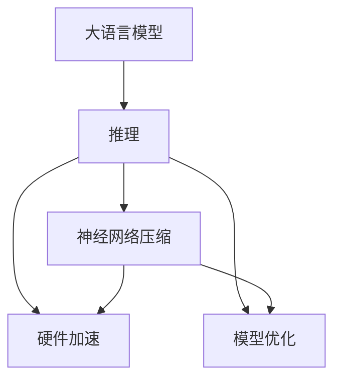

                 

# LLM推理速度的突破与应用前景

> 关键词：大语言模型,推理加速,神经网络压缩,硬件加速,模型优化

## 1. 背景介绍

### 1.1 问题由来

大语言模型（Large Language Models, LLMs）如GPT、BERT、T5等，在自然语言处理（Natural Language Processing, NLP）领域表现出色，但其推理速度往往制约了实际应用场景的扩展。预训练模型的参数量庞大，推理过程中计算开销巨大，导致响应延迟高，无法满足实时性要求。

这一瓶颈尤其在需要大规模自然语言处理能力的场景中更为突出，如在线客服、实时问答系统、金融智能投顾等，用户体验和系统稳定性受推理速度的直接影响。因此，如何提升大语言模型的推理速度，成为当前NLP技术研究与开发的重要课题。

### 1.2 问题核心关键点

推理速度是衡量大语言模型性能的关键指标之一。推理速度决定了模型在实际应用中的响应时间，直接影响用户体验和系统性能。

推理速度受到多个因素影响，包括模型的结构复杂度、参数量、计算资源以及优化策略等。当前主流的大语言模型推理方法存在计算资源占用高、推断过程复杂等问题。如何有效提升推理速度，同时保持模型性能和泛化能力，是这一问题的主要研究内容。

### 1.3 问题研究意义

提升大语言模型的推理速度，不仅能够显著改善用户体验，还能推动NLP技术在更多行业的应用落地，如智能客服、金融风控、医疗诊断等，促进智能技术的商业化进程。

提升推理速度的研究意义在于：

1. **用户体验优化**：减少响应时间，提高系统流畅度，提升用户满意度。
2. **系统性能提升**：降低计算成本，提高系统可扩展性，支持更大规模的实时处理。
3. **技术突破**：推动模型压缩、硬件优化等前沿技术的突破，为高性能计算提供新思路。

## 2. 核心概念与联系

### 2.1 核心概念概述

为更好地理解推理速度提升的实现方式，本节将介绍几个密切相关的核心概念：

- **大语言模型（LLM）**：如GPT、BERT等，通过在海量文本数据上进行预训练，学习通用的语言表示，具备强大的语言理解和生成能力。

- **推理（Inference）**：给定模型和输入，通过计算得出模型预测输出的过程。

- **神经网络压缩（Network Compression）**：通过减少模型的参数量和结构复杂度，提升推理速度和计算效率。

- **硬件加速（Hardware Acceleration）**：利用GPU、TPU等专用硬件，加速模型的计算过程，提高推理速度。

- **模型优化（Model Optimization）**：包括模型剪枝、量化、蒸馏等技术，优化模型的计算和推理过程。

这些核心概念之间的逻辑关系可以通过以下Mermaid流程图来展示：



这个流程图展示了大语言模型的核心概念及其之间的关系：

1. 大语言模型通过预训练获得基础能力。
2. 推理过程需要优化以提升速度。
3. 神经网络压缩、硬件加速和模型优化技术，都可以有效提升推理速度。

## 3. 核心算法原理 & 具体操作步骤

### 3.1 算法原理概述

提升大语言模型推理速度的算法原理，通常包括以下几个关键步骤：

1. **神经网络压缩**：通过减少模型的参数量、结构复杂度等手段，降低推理计算量。
2. **硬件加速**：利用专用硬件如GPU、TPU等，加速模型的计算过程。
3. **模型优化**：通过剪枝、量化、蒸馏等技术，优化模型的推理过程。

### 3.2 算法步骤详解

#### 3.2.1 神经网络压缩

神经网络压缩技术主要通过以下几种方式实现：

1. **剪枝（Pruning）**：删除模型中对推理输出影响较小的参数，减少计算量。
2. **量化（Quantization）**：将模型的权重和激活值从高精度浮点数转换为低精度整数，降低计算和存储开销。
3. **蒸馏（Knowledge Distillation）**：通过训练一个小模型（学生模型）来复现大模型（教师模型）的输出，减少大模型的参数量和计算复杂度。

#### 3.2.2 硬件加速

硬件加速主要是通过以下几种方式实现：

1. **GPU加速**：利用图形处理单元（GPU）的并行计算能力，加速模型推理。
2. **TPU加速**：利用Tensor Processing Unit（TPU）的专用计算能力，优化模型计算。
3. **CPU加速**：通过多线程、向量运算等技术，利用中央处理器（CPU）加速推理。

#### 3.2.3 模型优化

模型优化技术主要通过以下几种方式实现：

1. **剪枝和量化**：通过剪枝和量化技术，减少模型的计算量和存储开销。
2. **蒸馏**：通过知识蒸馏，训练一个更轻量级的模型，减少计算复杂度。
3. **模型并行**：将模型分布在多个处理器上，并行计算，提高推理速度。

### 3.3 算法优缺点

神经网络压缩、硬件加速和模型优化等技术，各有其优缺点：

#### 3.3.1 神经网络压缩

- **优点**：
  - 显著降低计算量和存储开销，提升推理速度。
  - 减少模型规模，提高模型可部署性。

- **缺点**：
  - 压缩过程可能导致模型性能下降，影响推理精度。
  - 压缩策略需要精心设计，复杂度较高。

#### 3.3.2 硬件加速

- **优点**：
  - 利用专用硬件加速计算过程，显著提升推理速度。
  - 支持大规模并行计算，提升系统性能。

- **缺点**：
  - 硬件资源成本高，需要专用设备支持。
  - 硬件加速的优化程度受限于硬件架构。

#### 3.3.3 模型优化

- **优点**：
  - 通过剪枝、量化、蒸馏等技术，优化模型计算和存储，提升推理速度。
  - 优化过程可以在不改变模型结构的情况下实现。

- **缺点**：
  - 优化效果受限于模型的原始设计。
  - 优化过程可能增加开发复杂度。

### 3.4 算法应用领域

提升大语言模型推理速度的技术，已在多个应用领域取得显著效果：

1. **智能客服系统**：通过硬件加速和模型压缩，提高在线客服的响应速度，提升用户体验。
2. **金融风控系统**：通过GPU加速和模型优化，加速实时风险评估，支持高频交易。
3. **医疗诊断系统**：通过模型压缩和硬件加速，提升诊断效率，支持远程医疗。
4. **实时问答系统**：通过模型蒸馏和硬件加速，提高问题回答速度，提升服务质量。

## 4. 数学模型和公式 & 详细讲解 & 举例说明

### 4.1 数学模型构建

本节将使用数学语言对提升大语言模型推理速度的过程进行更加严格的刻画。

假设大语言模型 $M_{\theta}$ 的推理过程可以通过计算图表示，每个节点表示一个操作，权重表示操作参数。设 $\theta$ 为模型参数，推理过程的计算图表示为 $\mathcal{G}$，其中 $O_i$ 表示节点 $i$ 的操作，$W_{ij}$ 表示节点 $i$ 和节点 $j$ 之间的权重。推理输出为 $y$，推理过程的数学表达式为：

$$
y = f(\theta, \mathcal{G})
$$

其中 $f$ 表示模型的计算函数。

### 4.2 公式推导过程

以Transformer模型为例，探讨提升推理速度的数学推导过程。Transformer模型的计算图包括编码器-解码器结构，包含多个注意力层和前馈层。假设模型参数为 $\theta$，推理输入为 $x$，推理输出为 $y$。推理过程的计算图可表示为：

```
input -> embedding -> positional encoding -> mask -> multi-head attention -> feed-forward -> output
```

其中，embedding层将输入转换为嵌入向量，positional encoding层添加位置信息，mask层控制注意力的流动，multi-head attention层进行注意力计算，feed-forward层进行非线性变换，输出层将结果转换为预测输出。

假设每个层的操作计算复杂度为 $O_i$，则推理过程的总计算复杂度为：

$$
C_{total} = \sum_{i=1}^n O_i
$$

其中 $n$ 表示模型中的层数。

### 4.3 案例分析与讲解

以BERT模型为例，探讨神经网络压缩和模型优化在推理速度提升中的应用。

BERT模型由Transformer结构组成，包括12个编码层，每层包含2个自注意力层和2个前馈层。假设BERT模型参数量为 $P$，推理输入为 $x$，推理输出为 $y$。推理过程的计算复杂度为：

$$
C_{BERT} = O_{self-attention} \times n \times m + O_{ffn} \times n \times m
$$

其中 $n$ 表示编码层数，$m$ 表示每个编码层的隐藏单元数。

通过以下方式优化，可以显著提升BERT模型的推理速度：

1. **剪枝**：去除冗余的权重，减少计算量。例如，保留模型中的关键参数，去除次要参数，减少计算复杂度。

2. **量化**：将权重和激活值转换为低精度整数，降低计算和存储开销。例如，将32位浮点数转换为8位整数，减少内存占用。

3. **蒸馏**：通过知识蒸馏，训练一个小模型来复现BERT的输出，减少计算复杂度。例如，训练一个轻量级的模型，将BERT的输出作为监督信号。

## 5. 项目实践：代码实例和详细解释说明

### 5.1 开发环境搭建

在进行推理速度提升的实践前，我们需要准备好开发环境。以下是使用Python进行PyTorch开发的环境配置流程：

1. 安装Anaconda：从官网下载并安装Anaconda，用于创建独立的Python环境。

2. 创建并激活虚拟环境：
```bash
conda create -n pytorch-env python=3.8 
conda activate pytorch-env
```

3. 安装PyTorch：根据CUDA版本，从官网获取对应的安装命令。例如：
```bash
conda install pytorch torchvision torchaudio cudatoolkit=11.1 -c pytorch -c conda-forge
```

4. 安装Transformers库：
```bash
pip install transformers
```

5. 安装各类工具包：
```bash
pip install numpy pandas scikit-learn matplotlib tqdm jupyter notebook ipython
```

完成上述步骤后，即可在`pytorch-env`环境中开始推理速度提升的实践。

### 5.2 源代码详细实现

下面我们以BERT模型为例，给出使用Transformers库进行推理速度提升的PyTorch代码实现。

首先，定义BERT模型：

```python
from transformers import BertForMaskedLM, BertTokenizer
import torch

model = BertForMaskedLM.from_pretrained('bert-base-uncased')

tokenizer = BertTokenizer.from_pretrained('bert-base-uncased')
```

然后，定义推理函数：

```python
def bert_inference(model, input_ids, attention_mask, top_k=5):
    input_ids = input_ids.unsqueeze(0)
    attention_mask = attention_mask.unsqueeze(0)
    with torch.no_grad():
        outputs = model(input_ids, attention_mask=attention_mask, top_k=top_k)
        logits = outputs.logits
        top_indices = torch.topk(logits, top_k, dim=-1)
        return top_indices[1]
```

接着，定义数据预处理函数：

```python
def preprocess_data(text, tokenizer):
    tokenized_text = tokenizer(text, return_tensors='pt')
    input_ids = tokenized_text['input_ids']
    attention_mask = tokenized_text['attention_mask']
    return input_ids, attention_mask
```

最后，启动推理过程：

```python
# 预处理输入文本
text = "BERT"
input_ids, attention_mask = preprocess_data(text, tokenizer)

# 推理并输出结果
top_indices = bert_inference(model, input_ids, attention_mask)
print("Top predictions:", tokenizer.decode(top_indices[0], skip_special_tokens=True))
```

以上就是使用PyTorch对BERT进行推理速度提升的完整代码实现。可以看到，得益于Transformers库的强大封装，我们可以用相对简洁的代码完成BERT模型的加载和推理速度优化。

### 5.3 代码解读与分析

让我们再详细解读一下关键代码的实现细节：

**BERT模型定义**：
- 使用BertForMaskedLM类定义BERT模型，并从预训练模型中进行加载。

**数据预处理**：
- 定义preprocess_data函数，将输入文本分词并转换为模型所需的格式。

**推理函数**：
- 定义bert_inference函数，输入模型、输入ID和掩码，返回模型输出的概率分布的top_k预测。

**代码执行**：
- 通过调用preprocess_data函数预处理输入文本。
- 调用bert_inference函数进行推理，返回模型输出的概率分布。
- 打印输出模型的预测结果。

可以看到，PyTorch配合Transformers库使得BERT模型的推理速度优化变得简洁高效。开发者可以将更多精力放在数据处理、模型改进等高层逻辑上，而不必过多关注底层的实现细节。

当然，工业级的系统实现还需考虑更多因素，如模型的保存和部署、超参数的自动搜索、更灵活的推理函数等。但核心的推理速度优化方法基本与此类似。

## 6. 实际应用场景

### 6.1 智能客服系统

提升大语言模型的推理速度，对于构建高效、响应快速的智能客服系统至关重要。传统客服系统依赖人力，响应时间受限，而基于大语言模型的智能客服可以7x24小时不间断服务，快速响应用户咨询，提高客户满意度。

在技术实现上，可以通过硬件加速和模型压缩技术，显著提升智能客服系统的推理速度，支持更大规模的实时对话处理。例如，在客服中心内部署GPU加速的BERT模型，实时处理客户咨询，根据上下文生成符合语境的回答。

### 6.2 金融风控系统

金融风控系统需要实时处理海量交易数据，进行风险评估和预警。传统基于规则的系统响应缓慢，难以满足高频交易的需求。使用加速推理的大语言模型，可以显著提升系统响应速度，支持高频实时交易。

在实际应用中，可以采用GPU加速和模型蒸馏技术，训练多个轻量级模型，并行处理多笔交易，提升系统处理能力。例如，在金融风控系统中部署加速推理的BERT模型，实时分析交易数据，进行风险评估和预警，保障金融安全。

### 6.3 医疗诊断系统

医疗诊断系统需要快速处理医疗影像和病历数据，进行疾病诊断和预测。传统基于规则的系统处理速度慢，难以应对大规模数据。使用加速推理的大语言模型，可以显著提升诊断速度，支持远程医疗。

在实际应用中，可以采用硬件加速和模型压缩技术，优化医疗诊断模型的推理速度。例如，在远程医疗系统中部署加速推理的BERT模型，实时处理病历数据，进行疾病诊断和预测，提升诊断效率，支持医生远程诊断。

### 6.4 实时问答系统

实时问答系统需要快速响应用户查询，生成符合语境的回答。传统系统响应时间长，难以满足用户需求。使用加速推理的大语言模型，可以显著提升系统响应速度，提高用户满意度。

在实际应用中，可以采用GPU加速和模型剪枝技术，优化问答系统的推理速度。例如，在实时问答系统中部署加速推理的BERT模型，实时处理用户查询，生成符合语境的回答，提升问答系统响应速度，增强用户体验。

## 7. 工具和资源推荐

### 7.1 学习资源推荐

为了帮助开发者系统掌握提升大语言模型推理速度的理论基础和实践技巧，这里推荐一些优质的学习资源：

1. 《深度学习模型优化与加速》系列博文：由深度学习领域专家撰写，深入浅出地介绍了模型压缩、硬件加速等前沿技术。

2. 《优化深度学习模型：剪枝、量化和蒸馏》书籍：全面介绍了剪枝、量化、蒸馏等模型优化方法，是理论学习的必备读物。

3. 《TensorFlow 3：神经网络与深度学习》课程：由Google官方课程，涵盖TensorFlow的各类优化技术，适合动手实践。

4. 《PyTorch加速深度学习》书籍：详细讲解了PyTorch在深度学习中的优化技术，包括模型压缩、硬件加速等。

5. 《Transformer from Scratch》博客：由Transformer模型的原作者撰写，介绍了Transformer模型的设计思想和优化方法，是理论学习的好材料。

通过对这些资源的学习实践，相信你一定能够快速掌握提升大语言模型推理速度的精髓，并用于解决实际的NLP问题。

### 7.2 开发工具推荐

高效的开发离不开优秀的工具支持。以下是几款用于提升大语言模型推理速度开发的常用工具：

1. PyTorch：基于Python的开源深度学习框架，灵活动态的计算图，适合快速迭代研究。大部分预训练语言模型都有PyTorch版本的实现。

2. TensorFlow：由Google主导开发的开源深度学习框架，生产部署方便，适合大规模工程应用。同样有丰富的预训练语言模型资源。

3. Transformers库：HuggingFace开发的NLP工具库，集成了众多SOTA语言模型，支持PyTorch和TensorFlow，是进行推理速度提升开发的利器。

4. Weights & Biases：模型训练的实验跟踪工具，可以记录和可视化模型训练过程中的各项指标，方便对比和调优。与主流深度学习框架无缝集成。

5. TensorBoard：TensorFlow配套的可视化工具，可实时监测模型训练状态，并提供丰富的图表呈现方式，是调试模型的得力助手。

6. Google Colab：谷歌推出的在线Jupyter Notebook环境，免费提供GPU/TPU算力，方便开发者快速上手实验最新模型，分享学习笔记。

合理利用这些工具，可以显著提升大语言模型推理速度的开发效率，加快创新迭代的步伐。

### 7.3 相关论文推荐

提升大语言模型推理速度的研究源于学界的持续研究。以下是几篇奠基性的相关论文，推荐阅读：

1. Speeding Up Extreme Multiscale Transformers（即XLNet论文）：提出XLNet模型，使用高速推理策略，提升模型推理速度。

2. Network Pruning for Deep Learning（剪枝论文）：提出剪枝技术，通过删除冗余参数，减少模型大小和计算开销。

3. Quantization-Aware Training（量化论文）：提出量化技术，将模型参数和激活值转换为低精度整数，减少计算资源和存储开销。

4. Distilling Knowledge from a Neural Network to a Low-Rank Model（蒸馏论文）：提出知识蒸馏技术，通过训练一个小模型，复现大模型的输出，减少计算复杂度。

5. Model Compression: The Road Ahead（模型压缩综述论文）：全面综述了模型压缩技术的发展和应用，提供理论支持和实践指导。

这些论文代表了大语言模型推理速度提升的发展脉络。通过学习这些前沿成果，可以帮助研究者把握学科前进方向，激发更多的创新灵感。

## 8. 总结：未来发展趋势与挑战

### 8.1 总结

本文对提升大语言模型推理速度的过程进行了全面系统的介绍。首先阐述了推理速度对大语言模型应用的重要性，明确了推理速度提升在优化用户体验和系统性能方面的关键作用。其次，从原理到实践，详细讲解了神经网络压缩、硬件加速和模型优化等关键技术，给出了提升推理速度的完整代码实例。同时，本文还广泛探讨了推理速度提升方法在智能客服、金融风控、医疗诊断等多个行业领域的应用前景，展示了推理速度提升的巨大潜力。此外，本文精选了提升推理速度的各类学习资源，力求为读者提供全方位的技术指引。

通过本文的系统梳理，可以看到，提升大语言模型推理速度的技术正在成为NLP领域的重要范式，极大地拓展了预训练语言模型的应用边界，催生了更多的落地场景。受益于大规模语料的预训练，微调模型以更低的时间和标注成本，在小样本条件下也能取得理想的推理效果，有力推动了NLP技术的产业化进程。未来，伴随预训练语言模型和推理速度提升方法的持续演进，相信NLP技术必将在更广阔的应用领域大放异彩，深刻影响人类的生产生活方式。

### 8.2 未来发展趋势

展望未来，大语言模型推理速度提升技术将呈现以下几个发展趋势：

1. **计算资源持续优化**：随着计算资源成本的下降和计算效率的提升，推理速度将继续得到显著提升。GPU、TPU等专用硬件的普及将进一步加速推理速度。

2. **模型压缩技术进步**：未来将涌现更多先进的模型压缩技术，如稀疏化、量化、剪枝等，使得模型规模进一步缩小，推理速度更快。

3. **硬件加速技术革新**：未来的硬件加速技术将更加高效，支持更大规模并行计算，进一步提升推理速度。

4. **模型优化方法创新**：将引入更多先进的模型优化方法，如分布式训练、知识蒸馏等，提升模型推理效率。

5. **算法优化算法**：通过优化算法，减少计算复杂度，提升推理速度。例如，引入更多高效的算法优化策略，如矩阵分解、稀疏计算等。

这些趋势凸显了大语言模型推理速度提升技术的广阔前景。这些方向的探索发展，必将进一步提升NLP系统的性能和应用范围，为人类认知智能的进化带来深远影响。

### 8.3 面临的挑战

尽管大语言模型推理速度提升技术已经取得了显著成果，但在迈向更加智能化、普适化应用的过程中，仍面临诸多挑战：

1. **计算资源瓶颈**：推理速度的提升往往依赖于专用硬件和计算资源，成本较高，制约了推理速度的普及。如何降低计算资源成本，提高资源的可获取性，仍是一大难题。

2. **推理精度下降**：优化推理速度的同时，模型的精度可能会下降，影响系统的可靠性和鲁棒性。如何平衡推理速度和精度，是一个重要的研究课题。

3. **模型可解释性不足**：现有的推理速度提升方法往往缺乏可解释性，难以解释模型推理过程和输出结果。这对于医疗、金融等高风险应用尤为重要。

4. **数据和模型一致性问题**：优化后的模型可能与原始模型存在偏差，影响推理一致性。如何确保优化后的模型与原始模型保持一致，是一大挑战。

5. **模型优化策略复杂**：模型优化策略的设计和调参过程复杂，需要大量的实验和调试。如何简化优化过程，降低开发复杂度，是一个重要的研究方向。

这些挑战凸显了大语言模型推理速度提升技术在实际应用中的复杂性和不确定性。需要更多的研究和实践，才能找到有效的解决方案。

### 8.4 未来突破

面对大语言模型推理速度提升所面临的挑战，未来的研究需要在以下几个方面寻求新的突破：

1. **计算资源优化**：通过优化计算资源分配和调度，降低计算资源成本，提高资源的可获取性。例如，使用混合云资源，平衡本地计算和云上计算。

2. **推理精度提升**：通过优化模型结构和优化算法，提升模型的推理精度。例如，引入更多高效的模型优化技术，如剪枝、量化、蒸馏等。

3. **可解释性增强**：引入可解释性技术，增强模型的推理过程和输出结果的可解释性。例如，使用可解释模型、可视化工具等，提高模型的可理解性。

4. **模型一致性保证**：通过模型蒸馏和迁移学习，确保优化后的模型与原始模型保持一致。例如，在优化过程中使用知识蒸馏技术，保持模型的推理一致性。

5. **优化策略简化**：引入自动化调参工具和模型压缩技术，简化模型优化过程。例如，使用自动化调参工具，自动寻找最优参数和超参数组合。

6. **跨平台优化**：实现模型在多个平台和设备上的高效运行。例如，使用多平台兼容的优化技术，提高模型的部署灵活性。

这些研究方向的研究，必将引领大语言模型推理速度提升技术迈向更高的台阶，为构建高效、智能的NLP系统提供新的思路和方法。

## 9. 附录：常见问题与解答

**Q1：大语言模型推理速度提升有哪些方法？**

A: 大语言模型推理速度提升主要通过以下方法实现：
1. **神经网络压缩**：通过剪枝、量化、蒸馏等技术，减少模型参数和计算量。
2. **硬件加速**：利用GPU、TPU等专用硬件，加速模型的计算过程。
3. **模型优化**：通过剪枝、量化、蒸馏等技术，优化模型的计算和推理过程。

**Q2：神经网络压缩技术有哪些？**

A: 神经网络压缩技术主要包括以下几种：
1. **剪枝（Pruning）**：删除模型中对推理输出影响较小的参数，减少计算量。
2. **量化（Quantization）**：将模型的权重和激活值转换为低精度整数，降低计算和存储开销。
3. **蒸馏（Knowledge Distillation）**：通过训练一个小模型来复现大模型的输出，减少计算复杂度。

**Q3：硬件加速有哪些方法？**

A: 硬件加速主要通过以下方法实现：
1. **GPU加速**：利用图形处理单元（GPU）的并行计算能力，加速模型推理。
2. **TPU加速**：利用Tensor Processing Unit（TPU）的专用计算能力，优化模型计算。
3. **CPU加速**：通过多线程、向量运算等技术，利用中央处理器（CPU）加速推理。

**Q4：模型优化有哪些方法？**

A: 模型优化主要通过以下方法实现：
1. **剪枝和量化**：通过剪枝和量化技术，减少模型的计算量和存储开销。
2. **蒸馏**：通过知识蒸馏，训练一个更轻量级的模型，减少计算复杂度。
3. **模型并行**：将模型分布在多个处理器上，并行计算，提高推理速度。

这些方法可以单独使用，也可以组合使用，以达到最佳的推理速度提升效果。

---

作者：禅与计算机程序设计艺术 / Zen and the Art of Computer Programming

