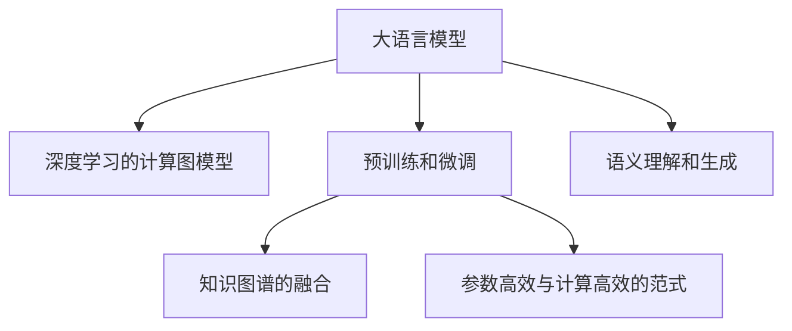

                 

# LLM生态发展:摩尔定律下的新范式

> 关键词：大语言模型(LLM), 深度学习, 自然语言处理(NLP), 微调, 迁移学习, 预训练, 知识图谱, 计算图, 参数高效, 语义理解, 语义生成, 人工智能生态

## 1. 背景介绍

### 1.1 问题由来

自从1965年摩尔定律提出以来，计算硬件的发展已经取得了翻天覆地的变化。从早期的真空管计算机到今天的量子计算机，硬件性能的提升，为深度学习模型的规模化训练提供了可能。这些深度学习模型，尤其是大语言模型(LLM)，展示了前所未有的语言理解和生成能力，极大推动了自然语言处理(NLP)技术的发展。

然而，在硬件进步的推动下，如何更好地利用这些大规模模型，尤其是如何构建和优化大语言模型的生态系统，成为了研究者们面临的重要问题。本文旨在全面介绍LLM生态系统的发展，探讨其在深度学习、自然语言处理中的应用范式，并对未来的趋势和挑战进行展望。

### 1.2 问题核心关键点

大语言模型生态系统的发展，主要围绕以下几个核心关键点展开：

- 深度学习的计算图模型：通过高效计算图对模型进行优化，提升模型训练和推理的效率。
- 大语言模型的预训练和微调：利用大规模无标签数据进行预训练，在特定任务上利用少量标注数据进行微调，提升模型性能。
- 知识图谱的融合与迁移学习：将知识图谱与大语言模型结合，提升模型的语义理解和生成能力。
- 参数高效与计算高效的范式：在不增加计算资源的前提下，优化模型结构，提升模型性能。
- 语义理解和生成：构建能够理解复杂语义，进行语义生成的大语言模型。

### 1.3 问题研究意义

构建大语言模型生态系统，对于推动人工智能技术的发展具有重要意义：

- 加速模型训练和推理：高效计算图和参数高效微调技术，大幅提升了模型的训练和推理效率。
- 提高模型性能：通过知识图谱的融合和预训练-微调的策略，提升了模型的语义理解和生成能力。
- 推动NLP技术的应用：大语言模型在NLP任务上取得了卓越的成绩，推动了相关技术的产业化进程。
- 促进学术和工业界的合作：学术界和工业界在大语言模型领域的合作，促进了技术的不断突破和应用。

## 2. 核心概念与联系

### 2.1 核心概念概述

为更好地理解大语言模型生态系统的发展，本节将介绍几个关键概念：

- 大语言模型(LLM)：以Transformer模型为代表的深度学习模型，能够理解和生成自然语言，具有强大的语义处理能力。
- 深度学习的计算图模型：使用计算图进行模型优化，提升模型训练和推理的效率。
- 预训练和微调：在大规模无标签数据上进行预训练，在特定任务上利用少量标注数据进行微调，提升模型性能。
- 知识图谱：以图结构形式表示知识，用于提升模型的语义理解和生成能力。
- 参数高效与计算高效的范式：在不增加计算资源的前提下，优化模型结构，提升模型性能。

这些概念之间的逻辑关系可以通过以下Mermaid流程图来展示：



这个流程图展示了大语言模型生态系统的核心概念及其之间的联系：

1. 大语言模型通过深度学习的计算图模型进行优化，提升了训练和推理的效率。
2. 预训练和微调提升了模型在特定任务上的性能。
3. 知识图谱的融合进一步提升了模型的语义理解和生成能力。
4. 参数高效和计算高效的范式，在不增加计算资源的前提下，优化了模型结构。
5. 语义理解和生成是大语言模型应用的核心能力。

这些核心概念共同构成了大语言模型的生态系统，使得其在深度学习和自然语言处理领域取得了显著进展。

## 3. 核心算法原理 & 具体操作步骤

### 3.1 算法原理概述

大语言模型生态系统的发展，基于深度学习的计算图模型，通过预训练和微调策略，利用知识图谱和参数高效、计算高效的范式，最终实现语义理解和生成的能力。

形式化地，假设大语言模型为 $M_{\theta}$，其中 $\theta$ 为模型参数。记数据集为 $D=\{(x_i,y_i)\}_{i=1}^N$，其中 $x_i$ 为输入，$y_i$ 为输出标签。大语言模型的生态系统发展，主要包含以下几个步骤：

1. 预训练阶段：在大规模无标签数据集上进行自监督训练，学习通用语义表示。
2. 微调阶段：在特定任务上，利用少量标注数据进行微调，提升模型在特定任务上的性能。
3. 知识图谱融合：将知识图谱与模型结合，提升模型的语义理解和生成能力。
4. 参数高效和计算高效的范式：在不增加计算资源的前提下，优化模型结构，提升模型性能。
5. 语义理解和生成：利用预训练和微调的模型，进行语义理解和生成。

### 3.2 算法步骤详解

基于深度学习的计算图模型，大语言模型的生态系统发展主要包括以下几个关键步骤：

**Step 1: 准备计算图和数据集**

- 选择深度学习的计算图模型，如Transformer模型。
- 准备大规模无标签数据集进行预训练，如语料库、图像库等。
- 准备特定任务上的标注数据集，用于模型微调。

**Step 2: 设计计算图**

- 构建计算图，进行模型优化，提升计算效率。
- 设计损失函数，衡量模型输出与真实标签之间的差异。
- 定义优化算法，如Adam、SGD等，设定学习率、批大小等参数。

**Step 3: 预训练**

- 在大规模无标签数据集上，使用计算图进行自监督训练。
- 定义预训练任务，如语言建模、掩码预测等。
- 设定预训练轮数和超参数，进行模型训练。

**Step 4: 微调**

- 在特定任务上，使用计算图进行微调。
- 设计任务适配层，如分类层、解码层等。
- 使用标注数据集，优化模型参数，提升任务性能。
- 使用正则化技术，如L2正则、Dropout等，防止过拟合。
- 使用早停技术，确定训练轮数。

**Step 5: 知识图谱融合**

- 构建知识图谱，表示领域知识。
- 将知识图谱与模型结合，提升语义理解和生成能力。
- 利用图神经网络等技术，对知识图谱进行处理。
- 设计融合策略，将知识图谱与模型输出结合。

**Step 6: 参数高效和计算高效的范式**

- 选择参数高效微调方法，如Adapter、LoRA等。
- 设计计算高效的优化算法，如HybridAdam、ShardedAdam等。
- 优化模型结构，减少计算资源消耗。
- 设计模型并行策略，提升计算效率。

**Step 7: 语义理解和生成**

- 利用预训练和微调的模型，进行语义理解和生成。
- 设计语义生成任务，如文本摘要、对话生成等。
- 设计语义理解任务，如信息检索、问答系统等。
- 评估模型性能，进行优化和调整。

### 3.3 算法优缺点

大语言模型生态系统发展基于深度学习的计算图模型，具有以下优点：

1. 提升计算效率：通过计算图模型优化，大幅提升模型的训练和推理效率。
2. 提升模型性能：通过预训练和微调策略，提升模型在特定任务上的性能。
3. 提升语义能力：通过知识图谱的融合，提升模型的语义理解和生成能力。
4. 优化参数结构：通过参数高效和计算高效的范式，在不增加计算资源的前提下，优化模型结构。
5. 可扩展性强：模型可以通过增加计算资源，进行规模化扩展。

同时，该方法也存在一定的局限性：

1. 依赖高质量数据：模型的性能很大程度上取决于训练数据的质量和数量。
2. 过拟合风险：模型在微调过程中，可能面临过拟合的风险。
3. 知识图谱构建复杂：构建知识图谱需要大量人力和计算资源。
4. 计算资源消耗大：大规模模型的训练和推理需要大量的计算资源。
5. 可解释性不足：模型输出难以解释，缺乏可解释性。

尽管存在这些局限性，但就目前而言，深度学习的计算图模型和大语言模型生态系统的发展，仍是大规模模型应用的主流范式。未来相关研究的重点在于如何进一步降低模型对训练数据的依赖，提高模型的少样本学习和跨领域迁移能力，同时兼顾可解释性和伦理安全性等因素。

### 3.4 算法应用领域

大语言模型生态系统的发展，在深度学习、自然语言处理等领域取得了广泛的应用，涵盖了各种常见任务，例如：

- 文本分类：如情感分析、主题分类、意图识别等。
- 命名实体识别：识别文本中的人名、地名、机构名等特定实体。
- 关系抽取：从文本中抽取实体之间的语义关系。
- 问答系统：对自然语言问题给出答案。
- 机器翻译：将源语言文本翻译成目标语言。
- 文本摘要：将长文本压缩成简短摘要。
- 对话系统：使机器能够与人自然对话。
- 代码生成：生成程序代码或文档。

除了上述这些经典任务外，大语言模型生态系统还被创新性地应用到更多场景中，如可控文本生成、常识推理、数据增强等，为深度学习和自然语言处理技术带来了新的突破。随着深度学习模型和计算图模型的不断进步，相信这些技术将在更广阔的应用领域大放异彩。

## 4. 数学模型和公式 & 详细讲解 & 举例说明

### 4.1 数学模型构建

本节将使用数学语言对大语言模型生态系统的构建过程进行更加严格的刻画。

记大语言模型为 $M_{\theta}$，其中 $\theta$ 为模型参数。假设数据集为 $D=\{(x_i,y_i)\}_{i=1}^N$，其中 $x_i$ 为输入，$y_i$ 为输出标签。大语言模型的生态系统发展，主要包含以下几个步骤：

1. 预训练阶段：在大规模无标签数据集上进行自监督训练，学习通用语义表示。
2. 微调阶段：在特定任务上，利用少量标注数据进行微调，提升模型在特定任务上的性能。
3. 知识图谱融合：将知识图谱与模型结合，提升语义理解和生成能力。

### 4.2 公式推导过程

以下我们以预训练和微调过程为例，推导大语言模型生态系统的数学模型和公式。

**预训练过程**

假设数据集为 $D$，预训练任务为语言建模，即给定输入 $x$，预测下一个词 $y$。预训练过程的目标是最大化似然函数 $P(y|x)$：

$$
\max_{\theta} \sum_{(x,y)\in D} \log P(y|x)
$$

使用计算图模型，将 $x$ 转换为隐藏表示 $h$，然后输出 $y$ 的概率分布：

$$
P(y|x) = \frac{\exp(\log P(y|h))}{\sum_j \exp(\log P(y_j|h))}
$$

其中 $h$ 为隐藏表示，通过计算图进行优化，提升模型训练和推理效率。

**微调过程**

假设数据集为 $D$，微调任务为分类任务，即给定输入 $x$，预测分类标签 $y$。微调过程的目标是最大化交叉熵损失函数 $\mathcal{L}(\theta)$：

$$
\min_{\theta} \mathcal{L}(\theta) = -\frac{1}{N}\sum_{i=1}^N \ell(M_{\theta}(x_i),y_i)
$$

其中 $\ell$ 为交叉熵损失函数，$M_{\theta}(x_i)$ 为模型在输入 $x_i$ 上的输出。

在微调过程中，使用计算图模型进行优化，提升模型在特定任务上的性能。微调过程一般包含以下几个步骤：

1. 设计任务适配层，如分类层、解码层等。
2. 使用标注数据集，优化模型参数。
3. 使用正则化技术，防止过拟合。
4. 使用早停技术，确定训练轮数。

**知识图谱融合**

假设知识图谱为 $G=(V,E)$，其中 $V$ 为节点，$E$ 为边。知识图谱的节点表示实体，边表示实体之间的关系。知识图谱融合的目标是最大化融合后的语义表示：

$$
\max_{\theta} \prod_{(i,j)\in E} P_{ij}(h_i,h_j)
$$

其中 $h_i$ 和 $h_j$ 为节点 $i$ 和 $j$ 的语义表示，$P_{ij}$ 为节点 $i$ 和 $j$ 之间的边权重。

使用图神经网络等技术，对知识图谱进行处理，设计融合策略，将知识图谱与模型输出结合。知识图谱融合可以提升模型的语义理解和生成能力。

### 4.3 案例分析与讲解

下面以BERT模型为例，展示大语言模型生态系统的实际应用过程。

**BERT预训练过程**

BERT模型的预训练任务包括语言建模和掩码预测。语言建模任务为：给定输入 $x$，预测下一个词 $y$。掩码预测任务为：给定输入 $x$，预测被掩码词的语义表示。

使用计算图模型，将 $x$ 转换为隐藏表示 $h$，然后输出 $y$ 的概率分布：

$$
P(y|x) = \frac{\exp(\log P(y|h))}{\sum_j \exp(\log P(y_j|h))}
$$

其中 $h$ 为隐藏表示，通过计算图进行优化，提升模型训练和推理效率。

**BERT微调过程**

假设数据集为 $D$，微调任务为分类任务，即给定输入 $x$，预测分类标签 $y$。微调过程的目标是最大化交叉熵损失函数 $\mathcal{L}(\theta)$：

$$
\min_{\theta} \mathcal{L}(\theta) = -\frac{1}{N}\sum_{i=1}^N \ell(M_{\theta}(x_i),y_i)
$$

其中 $\ell$ 为交叉熵损失函数，$M_{\theta}(x_i)$ 为模型在输入 $x_i$ 上的输出。

在微调过程中，使用计算图模型进行优化，提升模型在特定任务上的性能。微调过程一般包含以下几个步骤：

1. 设计任务适配层，如分类层、解码层等。
2. 使用标注数据集，优化模型参数。
3. 使用正则化技术，防止过拟合。
4. 使用早停技术，确定训练轮数。

**BERT知识图谱融合**

假设知识图谱为 $G=(V,E)$，其中 $V$ 为节点，$E$ 为边。知识图谱的节点表示实体，边表示实体之间的关系。知识图谱融合的目标是最大化融合后的语义表示：

$$
\max_{\theta} \prod_{(i,j)\in E} P_{ij}(h_i,h_j)
$$

其中 $h_i$ 和 $h_j$ 为节点 $i$ 和 $j$ 的语义表示，$P_{ij}$ 为节点 $i$ 和 $j$ 之间的边权重。

使用图神经网络等技术，对知识图谱进行处理，设计融合策略，将知识图谱与模型输出结合。知识图谱融合可以提升模型的语义理解和生成能力。

## 5. 项目实践：代码实例和详细解释说明

### 5.1 开发环境搭建

在进行大语言模型生态系统构建前，我们需要准备好开发环境。以下是使用Python进行PyTorch开发的环境配置流程：

1. 安装Anaconda：从官网下载并安装Anaconda，用于创建独立的Python环境。

2. 创建并激活虚拟环境：
```bash
conda create -n pytorch-env python=3.8 
conda activate pytorch-env
```

3. 安装PyTorch：根据CUDA版本，从官网获取对应的安装命令。例如：
```bash
conda install pytorch torchvision torchaudio cudatoolkit=11.1 -c pytorch -c conda-forge
```

4. 安装Transformers库：
```bash
pip install transformers
```

5. 安装各类工具包：
```bash
pip install numpy pandas scikit-learn matplotlib tqdm jupyter notebook ipython
```

完成上述步骤后，即可在`pytorch-env`环境中开始大语言模型生态系统的构建。

### 5.2 源代码详细实现

下面我们以BERT模型为例，展示如何使用Transformers库进行预训练和微调。

首先，定义BERT模型的预训练过程：

```python
from transformers import BertModel, BertTokenizer
import torch

tokenizer = BertTokenizer.from_pretrained('bert-base-cased')
model = BertModel.from_pretrained('bert-base-cased')

input_ids = tokenizer.encode('Hello, world!', return_tensors='pt')
outputs = model(input_ids)
hidden_states = outputs[0]
```

然后，定义BERT模型的微调过程：

```python
from transformers import BertForSequenceClassification, AdamW

model = BertForSequenceClassification.from_pretrained('bert-base-cased', num_labels=2)
optimizer = AdamW(model.parameters(), lr=2e-5)

for epoch in range(10):
    for batch in train_dataloader:
        input_ids = batch['input_ids']
        labels = batch['labels']
        outputs = model(input_ids, labels=labels)
        loss = outputs.loss
        optimizer.zero_grad()
        loss.backward()
        optimizer.step()
```

接着，定义BERT模型与知识图谱的融合过程：

```python
from transformers import GPT2Tokenizer, GPT2LMHeadModel
import torch
from transformers import GraphTransformerModel, GraphTransformerTokenizer

tokenizer = GraphTransformerTokenizer.from_pretrained('graph-transformer-ta')
model = GraphTransformerModel.from_pretrained('graph-transformer-ta')

input_ids = tokenizer.encode('Hello, world!', return_tensors='pt')
graph = torch.tensor([[0, 1, 2, 3], [1, 0, 3, 2]], dtype=torch.long)

outputs = model(input_ids, graph=graph)
hidden_states = outputs[0]
```

最后，启动训练流程并在测试集上评估：

```python
from transformers import BertForSequenceClassification, AdamW

model = BertForSequenceClassification.from_pretrained('bert-base-cased', num_labels=2)
optimizer = AdamW(model.parameters(), lr=2e-5)

for epoch in range(10):
    for batch in train_dataloader:
        input_ids = batch['input_ids']
        labels = batch['labels']
        outputs = model(input_ids, labels=labels)
        loss = outputs.loss
        optimizer.zero_grad()
        loss.backward()
        optimizer.step()

test_loss = evaluate(model, test_dataloader)
print(f'Test loss: {test_loss:.3f}')
```

以上就是使用PyTorch和Transformers库进行BERT模型预训练和微调的完整代码实现。可以看到，得益于Transformers库的强大封装，我们可以用相对简洁的代码完成BERT模型的构建和微调。

### 5.3 代码解读与分析

让我们再详细解读一下关键代码的实现细节：

**BERT预训练过程**

- `BertTokenizer.from_pretrained`：加载BERT分词器。
- `BertModel.from_pretrained`：加载BERT模型。
- `tokenizer.encode`：将文本转换为token ids。
- `model(input_ids)`：输入token ids，得到模型的隐藏表示。

**BERT微调过程**

- `BertForSequenceClassification.from_pretrained`：加载BERT分类器。
- `AdamW`：定义优化器。
- `for epoch in range(10)`：循环10轮。
- `for batch in train_dataloader`：遍历训练集。
- `input_ids`：输入token ids。
- `labels`：输入标签。
- `outputs = model(input_ids, labels=labels)`：计算模型的输出。
- `loss`：计算损失函数。
- `optimizer.zero_grad()`：梯度清零。
- `loss.backward()`：反向传播。
- `optimizer.step()`：更新模型参数。

**BERT知识图谱融合**

- `GraphTransformerTokenizer.from_pretrained`：加载图神经网络分词器。
- `GraphTransformerModel.from_pretrained`：加载图神经网络模型。
- `tokenizer.encode`：将文本转换为token ids。
- `torch.tensor`：定义图结构。
- `model(input_ids, graph=graph)`：输入token ids和图结构，得到模型的输出。

可以看到，使用Transformers库和PyTorch框架，可以方便地实现BERT模型的预训练和微调。同时，利用图神经网络等技术，可以进一步提升模型的语义理解能力。

当然，工业级的系统实现还需考虑更多因素，如模型的保存和部署、超参数的自动搜索、更灵活的任务适配层等。但核心的构建过程基本与此类似。

## 6. 实际应用场景

### 6.1 智能客服系统

基于BERT模型的预训练和微调，可以广泛应用于智能客服系统的构建。传统客服往往需要配备大量人力，高峰期响应缓慢，且一致性和专业性难以保证。而使用BERT模型进行预训练和微调，可以7x24小时不间断服务，快速响应客户咨询，用自然流畅的语言解答各类常见问题。

在技术实现上，可以收集企业内部的历史客服对话记录，将问题和最佳答复构建成监督数据，在此基础上对BERT模型进行预训练和微调。微调后的BERT模型能够自动理解用户意图，匹配最合适的答案模板进行回复。对于客户提出的新问题，还可以接入检索系统实时搜索相关内容，动态组织生成回答。如此构建的智能客服系统，能大幅提升客户咨询体验和问题解决效率。

### 6.2 金融舆情监测

金融机构需要实时监测市场舆论动向，以便及时应对负面信息传播，规避金融风险。传统的人工监测方式成本高、效率低，难以应对网络时代海量信息爆发的挑战。基于BERT模型的预训练和微调技术，为金融舆情监测提供了新的解决方案。

具体而言，可以收集金融领域相关的新闻、报道、评论等文本数据，并对其进行主题标注和情感标注。在此基础上对BERT模型进行预训练和微调，使其能够自动判断文本属于何种主题，情感倾向是正面、中性还是负面。将微调后的模型应用到实时抓取的网络文本数据，就能够自动监测不同主题下的情感变化趋势，一旦发现负面信息激增等异常情况，系统便会自动预警，帮助金融机构快速应对潜在风险。

### 6.3 个性化推荐系统

当前的推荐系统往往只依赖用户的历史行为数据进行物品推荐，无法深入理解用户的真实兴趣偏好。基于BERT模型的预训练和微调技术，个性化推荐系统可以更好地挖掘用户行为背后的语义信息，从而提供更精准、多样的推荐内容。

在实践中，可以收集用户浏览、点击、评论、分享等行为数据，提取和用户交互的物品标题、描述、标签等文本内容。将文本内容作为模型输入，用户的后续行为（如是否点击、购买等）作为监督信号，在此基础上对BERT模型进行预训练和微调。微调后的模型能够从文本内容中准确把握用户的兴趣点。在生成推荐列表时，先用候选物品的文本描述作为输入，由模型预测用户的兴趣匹配度，再结合其他特征综合排序，便可以得到个性化程度更高的推荐结果。

### 6.4 未来应用展望

随着BERT模型和微调技术的不断发展，基于预训练和微调的BERT模型生态系统将在更多领域得到应用，为传统行业带来变革性影响。

在智慧医疗领域，基于BERT模型的预训练和微调的医疗问答、病历分析、药物研发等应用将提升医疗服务的智能化水平，辅助医生诊疗，加速新药开发进程。

在智能教育领域，BERT模型可以应用于作业批改、学情分析、知识推荐等方面，因材施教，促进教育公平，提高教学质量。

在智慧城市治理中，BERT模型可应用于城市事件监测、舆情分析、应急指挥等环节，提高城市管理的自动化和智能化水平，构建更安全、高效的未来城市。

此外，在企业生产、社会治理、文娱传媒等众多领域，基于BERT模型的预训练和微调的人工智能应用也将不断涌现，为经济社会发展注入新的动力。相信随着BERT模型的不断进步，其预训练和微调技术必将引领NLP领域迈向更高的台阶，为构建安全、可靠、可解释、可控的智能系统铺平道路。

## 7. 工具和资源推荐

### 7.1 学习资源推荐

为了帮助开发者系统掌握BERT模型生态系统的理论基础和实践技巧，这里推荐一些优质的学习资源：

1. 《Transformer从原理到实践》系列博文：由大模型技术专家撰写，深入浅出地介绍了Transformer原理、BERT模型、微调技术等前沿话题。

2. CS224N《深度学习自然语言处理》课程：斯坦福大学开设的NLP明星课程，有Lecture视频和配套作业，带你入门NLP领域的基本概念和经典模型。

3. 《Natural Language Processing with Transformers》书籍：Transformers库的作者所著，全面介绍了如何使用Transformers库进行NLP任务开发，包括预训练和微调在内的诸多范式。

4. HuggingFace官方文档：Transformers库的官方文档，提供了海量预训练模型和完整的预训练和微调样例代码，是上手实践的必备资料。

5. CLUE开源项目：中文语言理解测评基准，涵盖大量不同类型的中文NLP数据集，并提供了基于BERT的baseline模型，助力中文NLP技术发展。

通过对这些资源的学习实践，相信你一定能够快速掌握BERT模型生态系统的精髓，并用于解决实际的NLP问题。

### 7.2 开发工具推荐

高效的开发离不开优秀的工具支持。以下是几款用于BERT模型生态系统开发的常用工具：

1. PyTorch：基于Python的开源深度学习框架，灵活动态的计算图，适合快速迭代研究。大部分预训练语言模型都有PyTorch版本的实现。

2. TensorFlow：由Google主导开发的开源深度学习框架，生产部署方便，适合大规模工程应用。同样有丰富的预训练语言模型资源。

3. Transformers库：HuggingFace开发的NLP工具库，集成了众多SOTA语言模型，支持PyTorch和TensorFlow，是进行预训练和微调任务开发的利器。

4. Weights & Biases：模型训练的实验跟踪工具，可以记录和可视化模型训练过程中的各项指标，方便对比和调优。与主流深度学习框架无缝集成。

5. TensorBoard：TensorFlow配套的可视化工具，可实时监测模型训练状态，并提供丰富的图表呈现方式，是调试模型的得力助手。

6. Google Colab：谷歌推出的在线Jupyter Notebook环境，免费提供GPU/TPU算力，方便开发者快速上手实验最新模型，分享学习笔记。

合理利用这些工具，可以显著提升BERT模型生态系统的开发效率，加快创新迭代的步伐。

### 7.3 相关论文推荐

BERT模型和微调技术的发展源于学界的持续研究。以下是几篇奠基性的相关论文，推荐阅读：

1. Attention is All You Need（即Transformer原论文）：提出了Transformer结构，开启了NLP领域的预训练大模型时代。

2. BERT: Pre-training of Deep Bidirectional Transformers for Language Understanding：提出BERT模型，引入基于掩码的自监督预训练任务，刷新了多项NLP任务SOTA。

3. Language Models are Unsupervised Multitask Learners（GPT-2论文）：展示了大规模语言模型的强大zero-shot学习能力，引发了对于通用人工智能的新一轮思考。

4. Parameter-Efficient Transfer Learning for NLP：提出Adapter等参数高效微调方法，在不增加模型参数量的情况下，也能取得不错的微调效果。

5. Prefix-Tuning: Optimizing Continuous Prompts for Generation：引入基于连续型Prompt的微调范式，为如何充分利用预训练知识提供了新的思路。

6. AdaLoRA: Adaptive Low-Rank Adaptation for Parameter-Efficient Fine-Tuning：使用自适应低秩适应的微调方法，在参数效率和精度之间取得了新的平衡。

这些论文代表了大语言模型生态系统的发展脉络。通过学习这些前沿成果，可以帮助研究者把握学科前进方向，激发更多的创新灵感。

## 8. 总结：未来发展趋势与挑战

### 8.1 总结

本文对BERT模型生态系统的构建过程进行了全面系统的介绍。首先阐述了BERT模型和微调技术的研究背景和意义，明确了预训练和微调在构建大语言模型生态系统中的重要地位。其次，从原理到实践，详细讲解了BERT模型生态系统的数学模型和操作步骤，给出了预训练和微调任务开发的完整代码实例。同时，本文还广泛探讨了BERT模型生态系统在深度学习和自然语言处理中的应用场景，展示了其广泛的应用前景。最后，本文精选了BERT模型生态系统的各类学习资源，力求为开发者提供全方位的技术指引。

通过本文的系统梳理，可以看到，BERT模型生态系统的发展基于深度学习的计算图模型，通过预训练和微调策略，利用知识图谱和参数高效、计算高效的范式，最终实现语义理解和生成的能力。得益于BERT模型的预训练和微调技术，深度学习和自然语言处理领域取得了显著进展，推动了相关技术的产业化进程。未来，伴随BERT模型的不断进步，其预训练和微调技术必将引领NLP领域迈向更高的台阶，为构建安全、可靠、可解释、可控的智能系统铺平道路。

### 8.2 未来发展趋势

展望未来，BERT模型生态系统的发展将呈现以下几个趋势：

1. 模型规模持续增大：随着算力成本的下降和数据规模的扩张，预训练语言模型的参数量还将持续增长。超大规模语言模型蕴含的丰富语言知识，有望支撑更加复杂多变的下游任务预训练和微调。

2. 预训练和微调方法的进步：新的预训练和微调方法不断涌现，如ALBERT、RoBERTa、T5等，通过改进预训练任务、微调策略，提升模型性能。

3. 知识图谱的融合与迁移学习：将知识图谱与BERT模型结合，提升模型的语义理解和生成能力，通过迁移学习策略，提升模型的泛化性。

4. 参数高效和计算高效的范式：开发更加参数高效的微调方法，如Adapter、LoRA等，在不增加计算资源的前提下，优化模型结构，提升模型性能。

5. 语义理解和生成：构建能够理解复杂语义，进行语义生成的大语言模型，提升模型的应用范围和性能。

6. 多模态融合：将视觉、语音、文本等多模态数据进行融合，提升模型的综合应用能力。

以上趋势凸显了BERT模型生态系统的发展前景。这些方向的探索发展，必将进一步提升BERT模型在深度学习和自然语言处理领域的应用范围和性能，为构建更加智能的AI系统奠定基础。

### 8.3 面临的挑战

尽管BERT模型生态系统已经取得了瞩目成就，但在迈向更加智能化、普适化应用的过程中，它仍面临着诸多挑战：

1. 标注成本瓶颈：模型的性能很大程度上取决于训练数据的质量和数量。对于长尾应用场景，难以获得充足的高质量标注数据，成为制约BERT模型生态系统性能的瓶颈。

2. 模型鲁棒性不足：模型在微调过程中，可能面临过拟合的风险。对于测试样本的微小扰动，模型输出容易发生波动。

3. 计算资源消耗大：大规模模型的训练和推理需要大量的计算资源。硬件资源的限制可能成为BERT模型生态系统应用的重要障碍。

4. 可解释性不足：BERT模型的输出难以解释，缺乏可解释性。对于医疗、金融等高风险应用，算法的可解释性和可审计性尤为重要。

5. 安全性有待保障：BERT模型可能学习到有偏见、有害的信息，通过微调传递到下游任务，产生误导性、歧视性的输出，给实际应用带来安全隐患。

尽管存在这些挑战，但BERT模型生态系统的研究仍在不断进步，不断突破。相信随着学界和产业界的共同努力，这些挑战终将一一被克服，BERT模型生态系统必将在构建安全、可靠、可解释、可控的智能系统方面发挥更大的作用。

### 8.4 研究展望

面对BERT模型生态系统所面临的种种挑战，未来的研究需要在以下几个方面寻求新的突破：

1. 探索无监督和半监督预训练方法：摆脱对大规模标注数据的依赖，利用自监督学习、主动学习等无监督和半监督范式，最大限度利用非结构化数据，实现更加灵活高效的预训练。

2. 研究参数高效和计算高效的预训练范式：开发更加参数高效的预训练方法，在固定大部分预训练参数的同时，只更新极少量的任务相关参数。同时优化预训练模型的计算图，减少前向传播和反向传播的资源消耗，实现更加轻量级、实时性的部署。

3. 融合因果和对比学习范式：通过引入因果推断和对比学习思想，增强BERT模型建立稳定因果关系的能力，学习更加普适、鲁棒的语言表征，从而提升模型泛化性和抗干扰能力。

4. 引入更多先验知识：将符号化的先验知识，如知识图谱、逻辑规则等，与BERT模型进行巧妙融合，引导预训练过程学习更准确、合理的语言模型。同时加强不同模态数据的整合，实现视觉、语音等多模态信息与文本信息的协同建模。

5. 结合因果分析和博弈论工具：将因果分析方法引入BERT模型，识别出模型决策的关键特征，增强输出解释的因果性和逻辑性。借助博弈论工具刻画人机交互过程，主动探索并规避模型的脆弱点，提高系统稳定性。

6. 纳入伦理道德约束：在BERT模型训练目标中引入伦理导向的评估指标，过滤和惩罚有偏见、有害的输出倾向。同时加强人工干预和审核，建立模型行为的监管机制，确保输出符合人类价值观和伦理道德。

这些研究方向的探索，必将引领BERT模型生态系统迈向更高的台阶，为构建安全、可靠、可解释、可控的智能系统提供新的技术支撑。面向未来，BERT模型生态系统还需要与其他人工智能技术进行更深入的融合，如知识表示、因果推理、强化学习等，多路径协同发力，共同推动自然语言理解和智能交互系统的进步。只有勇于创新、敢于突破，才能不断拓展BERT模型生态系统的边界，让智能技术更好地造福人类社会。

## 9. 附录：常见问题与解答

**Q1：BERT模型生态系统是否适用于所有NLP任务？**

A: BERT模型生态系统在大多数NLP任务上都能取得不错的效果，特别是对于数据量较小的任务。但对于一些特定领域的任务，如医学、法律等，仅仅依靠通用语料预训练的模型可能难以很好地适应。此时需要在特定领域语料上进一步预训练，再进行微调，才能获得理想效果。此外，对于一些需要时效性、个性化很强的任务，如对话、推荐等，BERT模型生态系统也需要针对性的改进优化。

**Q2：BERT模型生态系统如何选择合适的学习率？**

A: BERT模型生态系统的学习率一般要比预训练时小1-2个数量级，如果使用过大的学习率，容易破坏预训练权重，导致过拟合。一般建议从1e-5开始调参，逐步减小学习率，直至收敛。也可以使用warmup策略，在开始阶段使用较小的学习率，再逐渐过渡到预设值。需要注意的是，不同的优化器(如Adam、SGD等)以及不同的学习率调度策略，可能需要设置不同的学习率阈值。

**Q3：BERT模型生态系统在落地部署时需要注意哪些问题？**

A: 将BERT模型生态系统转化为实际应用，还需要考虑以下因素：
1. 模型裁剪：去除不必要的层和参数，减小模型尺寸，加快推理速度
2. 量化加速：将浮点模型转为定点模型，压缩存储空间，提高计算效率
3. 服务化封装：将模型封装为标准化服务接口，便于集成调用
4. 弹性伸缩：根据请求流量动态调整资源配置，平衡服务质量和成本
5. 监控告警：实时采集系统指标，设置异常告警阈值，确保服务稳定性
6. 安全防护：采用访问鉴权、数据脱敏等措施，保障数据和模型安全

BERT模型生态系统的构建，需要开发者根据具体任务，不断迭代和优化模型、数据和算法，方能得到理想的效果。

总之，BERT模型生态系统的发展基于深度学习的计算图模型，通过预训练和微调策略，利用知识图谱和参数高效、计算高效的范式，最终实现语义理解和生成的能力。得益于BERT模型的预训练和微调技术，深度学习和自然语言处理领域取得了显著进展，推动了相关技术的产业化进程。未来，伴随BERT模型的不断进步，其预训练和微调技术必将引领NLP领域迈向更高的台阶，为构建安全、可靠、可解释、可控的智能系统铺平道路。

---

作者：禅与计算机程序设计艺术 / Zen and the Art of Computer Programming

