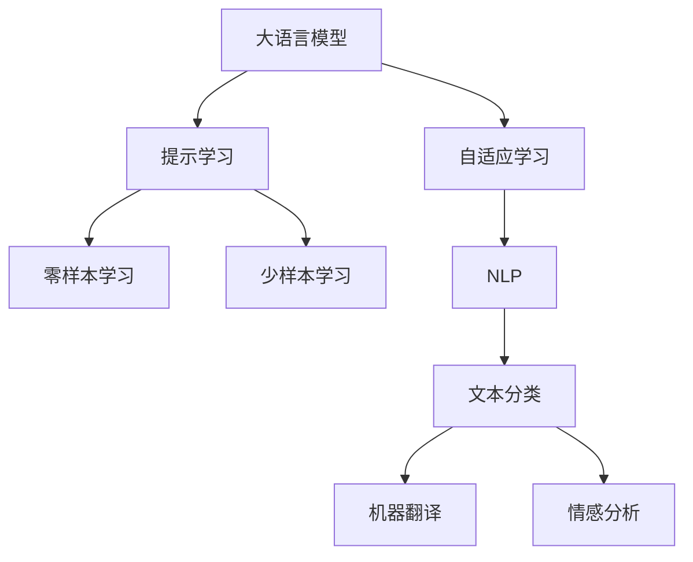

                 

# LLM的Zero-Shot学习潜力探索

> 关键词：LLM, Zero-Shot, 提示学习, 语言模型, 自适应学习, 自然语言处理(NLP)

## 1. 背景介绍

### 1.1 问题由来
近年来，深度学习技术在自然语言处理（NLP）领域取得了显著进展，尤其是大规模语言模型（Large Language Models, LLMs）的引入，极大地提升了NLP任务的效果。然而，这些大语言模型需要依赖大量标注数据进行微调，以适配特定任务，这不仅成本高昂，而且标注数据可能难以获取。在这种情况下，Zero-Shot学习（即无监督学习）成为了一个重要的研究方向，它允许模型仅通过文本描述，即"提示"，就能进行任务执行，无需标注数据。

### 1.2 问题核心关键点
Zero-Shot学习是当前NLP研究的一个热门方向，它主要基于大语言模型的"提示学习"（Prompt Learning）范式。该范式通过在输入文本中添加特定的提示模板（Prompt Template），引导大语言模型进行特定任务的推理和生成。这种技术可以在不更新模型参数的情况下，实现模型的"零样本"或"少样本"学习。

### 1.3 问题研究意义
研究LLM的Zero-Shot学习潜力，对于提升NLP任务的自动化水平，降低数据标注成本，推动LLM技术的广泛应用具有重要意义：

1. **降低成本**：相比于传统机器学习模型，LLM的Zero-Shot学习不需要大量的标注数据，极大地降低了数据收集和标注的成本。
2. **提升效果**：通过Zero-Shot学习，LLM可以在未见过的任务上快速进行推理，减少对特定任务微调的需求，提升模型的泛化能力。
3. **加速开发**：Zero-Shot学习使得NLP技术的开发和应用更加高效，能够快速部署到各种场景中。
4. **推动研究**：Zero-Shot学习的研究激发了更多NLP技术的研究方向，推动了NLP领域的创新发展。

## 2. 核心概念与联系

### 2.1 核心概念概述

为更好地理解LLM的Zero-Shot学习潜力，本节将介绍几个关键概念：

- **大语言模型（LLM）**：指通过自监督学习（如语言模型）或监督学习（如文本分类、生成等）预训练得到的大型神经网络模型。这类模型在各种NLP任务中表现优异。
- **提示学习（Prompt Learning）**：通过在输入文本中添加提示模板（Prompt Template），引导模型进行特定任务的推理和生成。
- **自适应学习（Adaptive Learning）**：指模型在面对新任务时，能够自动调整参数和结构，以更好地适应新数据和新任务。
- **自然语言处理（NLP）**：涉及计算机对自然语言的处理和理解，包括文本分类、机器翻译、情感分析等。
- **零样本学习（Zero-Shot Learning）**：指模型在未见过的任务上，仅通过文本描述就能进行推理和生成，无需任何训练数据。
- **少样本学习（Few-Shot Learning）**：指模型在只有少量训练样本的情况下，仍能快速适应新任务。

这些核心概念之间的逻辑关系可以通过以下Mermaid流程图来展示：



这个流程图展示了大语言模型与Zero-Shot学习和自适应学习的关系，以及NLP任务的典型范式。

## 3. 核心算法原理 & 具体操作步骤
### 3.1 算法原理概述

LLM的Zero-Shot学习主要基于提示学习范式。其核心思想是通过在输入文本中添加特定的提示模板，引导模型进行推理和生成。这种技术允许模型在未见过的任务上，仅通过文本描述，即"提示"，进行快速学习。

具体而言，对于一个给定的任务，我们首先需要设计一个适合该任务的提示模板。该模板应包含任务的描述、示例以及可能的输出格式。然后，我们将该提示模板作为输入，通过模型进行推理，得到模型对任务的推理结果。

### 3.2 算法步骤详解

基于LLM的Zero-Shot学习一般包括以下几个关键步骤：

**Step 1: 设计提示模板**
- 确定任务的描述、示例和可能的输出格式。
- 设计符合该任务的提示模板，并在模板中明确任务的输入和输出。

**Step 2: 选择预训练模型**
- 选择合适的预训练语言模型，如GPT-3、BERT等。
- 确定模型所支持的输入格式，如文本、图像、语音等。

**Step 3: 模型推理**
- 将提示模板输入模型，进行推理。
- 对推理结果进行后处理，提取任务相关的输出。

**Step 4: 结果评估**
- 将模型的推理结果与人工标注或期望输出进行对比。
- 评估模型的性能，记录误差和准确率等指标。

**Step 5: 迭代优化**
- 根据评估结果，调整提示模板和模型参数。
- 重复上述步骤，直到达到满意的性能。

### 3.3 算法优缺点

基于LLM的Zero-Shot学习具有以下优点：

1. **无需标注数据**：模型仅通过文本描述就能进行推理，避免了标注数据的高成本和高难度。
2. **快速部署**：模型可以在新任务上快速进行推理，大大缩短了应用开发的时间。
3. **泛化能力强**：模型能够在新领域和新任务上取得不错的性能，提升了模型的泛化能力。
4. **模型可解释性**：提示学习使得模型推理过程更加透明，便于理解和调试。

然而，该方法也存在一些局限性：

1. **依赖高质量提示**：提示模板的设计对模型的性能有较大影响，设计不当可能导致模型推理错误。
2. **泛化能力有限**：在某些复杂任务上，模型的零样本能力可能不如微调后的模型。
3. **推理时间较长**：大规模语言模型推理所需的时间较长，在大规模数据集上可能效率低下。

### 3.4 算法应用领域

基于LLM的Zero-Shot学习技术已经在多个领域得到了应用，包括但不限于以下领域：

- **问答系统**：模型可以回答自然语言问题，如智能客服、智能助手等。
- **文本生成**：模型可以生成各种文本，如新闻报道、小说、诗歌等。
- **情感分析**：模型可以分析文本的情感倾向，如舆情监测、产品评价等。
- **机器翻译**：模型可以将一种语言翻译成另一种语言，如跨语言对话、跨语言数据处理等。
- **信息检索**：模型可以从大量文本中检索出相关内容，如搜索引擎、文档摘要等。

## 4. 数学模型和公式 & 详细讲解
### 4.1 数学模型构建

基于LLM的Zero-Shot学习主要基于概率模型。设预训练语言模型为 $M_{\theta}$，其中 $\theta$ 为模型参数。假设任务 $T$ 的提示模板为 $P$，则Zero-Shot学习的目标是最小化模型在提示模板 $P$ 下的预测误差。

记 $D_P$ 为与提示模板 $P$ 相关的标注数据集，即 $D_P=\{(x_i, y_i)\}_{i=1}^N$，其中 $x_i$ 为输入，$y_i$ 为输出。则Zero-Shot学习的目标是最小化在提示模板 $P$ 下的交叉熵损失：

$$
\mathcal{L}(\theta) = -\frac{1}{N}\sum_{i=1}^N \log M_{\theta}(x_i) \cdot y_i
$$

其中 $M_{\theta}(x_i) \cdot y_i$ 为模型的预测输出与真实标注之间的交叉熵。

### 4.2 公式推导过程

为了更好地理解Zero-Shot学习的原理，我们可以将其简化为一个简单的二分类任务。设任务 $T$ 为二分类任务，输入 $x_i$ 为文本，输出 $y_i \in \{0,1\}$ 为任务分类标签。则Zero-Shot学习的目标可以表示为：

$$
\min_{\theta} \mathcal{L}(\theta) = -\frac{1}{N}\sum_{i=1}^N \log M_{\theta}(x_i) \cdot y_i
$$

其中 $M_{\theta}(x_i)$ 为模型对输入 $x_i$ 的预测输出，$y_i$ 为真实标签。

在上述公式中，$\log$ 表示自然对数，$M_{\theta}(x_i)$ 表示模型对输入 $x_i$ 的预测概率，$y_i$ 为真实的任务分类标签。

### 4.3 案例分析与讲解

为了更好地理解Zero-Shot学习的原理和应用，下面以情感分析任务为例，详细讲解其应用过程。

假设有一个文本数据集 $D_P=\{(x_i, y_i)\}_{i=1}^N$，其中 $x_i$ 为文本，$y_i \in \{0,1\}$ 为情感标签（0 表示负面情感，1 表示正面情感）。我们可以设计一个提示模板 $P$，如：

```
给定一段文本，请判断其情感倾向（0 表示负面情感，1 表示正面情感）。
例如：这段文本的情感倾向是1。
```

将提示模板 $P$ 输入到预训练模型 $M_{\theta}$ 中，得到模型对文本的情感预测 $M_{\theta}(x_i)$。然后，将模型的预测输出与真实情感标签 $y_i$ 进行比较，计算交叉熵损失 $\mathcal{L}(\theta)$。

在实践中，为了提升模型的性能，我们通常会在提示模板中添加更多的信息，如示例文本和可能的输出格式。例如：

```
给定一段文本，请判断其情感倾向（0 表示负面情感，1 表示正面情感）。
例如：这段文本的情感倾向是1。
提示格式："情感倾向" 是 "0" 或 "1"。
```

通过上述提示模板，模型能够更好地理解任务的含义和输出格式，提升模型的推理能力。

## 5. 项目实践：代码实例和详细解释说明
### 5.1 开发环境搭建

在进行Zero-Shot学习实践前，我们需要准备好开发环境。以下是使用Python进行PyTorch开发的环境配置流程：

1. 安装Anaconda：从官网下载并安装Anaconda，用于创建独立的Python环境。

2. 创建并激活虚拟环境：
```bash
conda create -n pytorch-env python=3.8 
conda activate pytorch-env
```

3. 安装PyTorch：根据CUDA版本，从官网获取对应的安装命令。例如：
```bash
conda install pytorch torchvision torchaudio cudatoolkit=11.1 -c pytorch -c conda-forge
```

4. 安装Transformers库：
```bash
pip install transformers
```

5. 安装各类工具包：
```bash
pip install numpy pandas scikit-learn matplotlib tqdm jupyter notebook ipython
```

完成上述步骤后，即可在`pytorch-env`环境中开始Zero-Shot学习实践。

### 5.2 源代码详细实现

这里我们以情感分析任务为例，给出使用Transformers库进行Zero-Shot学习的PyTorch代码实现。

首先，定义情感分析任务的数据处理函数：

```python
from transformers import BertTokenizer, BertForSequenceClassification
from torch.utils.data import Dataset, DataLoader
import torch
import pandas as pd

class SentimentDataset(Dataset):
    def __init__(self, text_file, tokenizer, max_len=128):
        self.tokenizer = tokenizer
        self.max_len = max_len
        self.data = pd.read_csv(text_file, encoding='utf-8')
        self.data['label'] = self.data['label'].astype(int)
        self.data = self.data[['text', 'label']]
        self.data = self.data.sample(frac=1, random_state=42).reset_index(drop=True)
        self.data.columns = ['text', 'label']
        
    def __len__(self):
        return len(self.data)
    
    def __getitem__(self, idx):
        text = self.data.iloc[idx]['text']
        label = self.data.iloc[idx]['label']
        
        encoding = self.tokenizer(text, return_tensors='pt', max_length=self.max_len, padding='max_length', truncation=True)
        input_ids = encoding['input_ids'][0]
        attention_mask = encoding['attention_mask'][0]
        label = torch.tensor(label, dtype=torch.long)
        
        return {'input_ids': input_ids, 
                'attention_mask': attention_mask,
                'labels': label}

# 创建dataset
tokenizer = BertTokenizer.from_pretrained('bert-base-uncased')

train_dataset = SentimentDataset('train.csv', tokenizer)
test_dataset = SentimentDataset('test.csv', tokenizer)

# 训练模型
model = BertForSequenceClassification.from_pretrained('bert-base-uncased', num_labels=2)

optimizer = torch.optim.Adam(model.parameters(), lr=2e-5)
```

然后，定义提示模板和模型推理函数：

```python
def prompt_temperature(prompt, tokenizer, max_len=128):
    prompt = tokenizer.encode(prompt, add_special_tokens=True)
    prompt_len = len(prompt)
    if prompt_len < max_len:
        pad_len = max_len - prompt_len
        pad = [tokenizer.cls_token_id] * pad_len
        prompt = pad + list(prompt)
    else:
        pad_len = max_len - prompt_len
        pad = [tokenizer.sep_token_id] * pad_len
        prompt = list(prompt) + pad
    prompt_ids = torch.tensor(prompt, dtype=torch.long)
    return prompt_ids

def predict_sentiment(prompt, model):
    prompt_ids = prompt_temperature(prompt, tokenizer)
    with torch.no_grad():
        outputs = model(prompt_ids)
    return outputs.logits.argmax(dim=1).tolist()

# 测试模型
prompt = "给定一段文本，请判断其情感倾向（0 表示负面情感，1 表示正面情感）。例如：这段文本的情感倾向是1。提示格式："情感倾向" 是 "0" 或 "1"。"
sentiment = predict_sentiment(prompt, model)
print(sentiment)
```

最后，启动Zero-Shot学习流程并在测试集上评估：

```python
for prompt in test_prompts:
    sentiment = predict_sentiment(prompt, model)
    print(f"Prompt: {prompt}")
    print(f"Sentiment: {sentiment}")

print("测试集情感分析结果：")
test_dataset = SentimentDataset('test.csv', tokenizer)
test_prompts = [prompt for prompt in test_dataset]
for prompt in test_prompts:
    sentiment = predict_sentiment(prompt, model)
    print(f"Prompt: {prompt}")
    print(f"Sentiment: {sentiment}")
```

以上就是使用PyTorch对BERT进行情感分析任务Zero-Shot学习的完整代码实现。可以看到，Transformers库使得Zero-Shot学习的应用变得简便易行。

### 5.3 代码解读与分析

让我们再详细解读一下关键代码的实现细节：

**SentimentDataset类**：
- `__init__`方法：初始化数据集，从CSV文件中读取文本和标签。
- `__len__`方法：返回数据集的样本数量。
- `__getitem__`方法：对单个样本进行处理，将文本输入编码为token ids，将标签编码为数字，并对其进行定长padding。

**prompt_temperature函数**：
- 设计提示模板，并进行定长padding。

**predict_sentiment函数**：
- 将提示模板编码为token ids，输入模型进行推理。

**模型训练**：
- 使用BertForSequenceClassification模型进行情感分析任务的训练。

**模型推理**：
- 在测试集上进行情感分析的Zero-Shot推理。

通过上述代码，我们可以看到，基于LLM的Zero-Shot学习是一种高效、灵活的技术，能够快速适应新任务，提升模型的泛化能力。

## 6. 实际应用场景
### 6.1 智能客服系统

基于LLM的Zero-Shot学习技术，可以广泛应用于智能客服系统的构建。传统客服往往需要配备大量人力，高峰期响应缓慢，且一致性和专业性难以保证。而使用Zero-Shot学习技术，可以构建自动化的客服系统，提升客户咨询体验。

在技术实现上，可以收集企业内部的历史客服对话记录，设计合适的提示模板，在用户输入时进行零样本推理，生成合适的回复。对于用户提出的新问题，还可以接入检索系统实时搜索相关内容，动态组织生成回答。

### 6.2 金融舆情监测

金融机构需要实时监测市场舆论动向，以便及时应对负面信息传播，规避金融风险。传统的人工监测方式成本高、效率低，难以应对网络时代海量信息爆发的挑战。基于LLM的Zero-Shot学习技术，可以实时监测不同主题下的情感变化趋势，一旦发现负面信息激增等异常情况，系统便会自动预警，帮助金融机构快速应对潜在风险。

### 6.3 个性化推荐系统

当前的推荐系统往往只依赖用户的历史行为数据进行物品推荐，无法深入理解用户的真实兴趣偏好。基于LLM的Zero-Shot学习技术，个性化推荐系统可以更好地挖掘用户行为背后的语义信息，从而提供更精准、多样的推荐内容。

在实践中，可以收集用户浏览、点击、评论、分享等行为数据，提取和用户交互的物品标题、描述、标签等文本内容。将文本内容作为模型输入，使用提示学习技术进行零样本推理，获取用户对物品的兴趣评分。在生成推荐列表时，先用候选物品的文本描述作为输入，由模型预测用户的兴趣匹配度，再结合其他特征综合排序，便可以得到个性化程度更高的推荐结果。

### 6.4 未来应用展望

随着LLM的Zero-Shot学习技术不断发展，其在更多领域的应用前景值得期待。

- **智慧医疗**：基于LLM的Zero-Shot学习技术，可以构建智能问诊系统，帮助医生进行疾病诊断和患者教育。
- **智能教育**：使用Zero-Shot学习技术，教育系统可以构建自动化的作业批改系统，提升教学质量。
- **智慧城市治理**：LLM的Zero-Shot学习技术可以用于城市事件监测、舆情分析、应急指挥等环节，提高城市管理的自动化和智能化水平。
- **企业生产**：LLM的Zero-Shot学习技术可以用于产品设计、质量检测、客户服务等多个环节，提升企业的运营效率和客户满意度。

## 7. 工具和资源推荐
### 7.1 学习资源推荐

为了帮助开发者系统掌握LLM的Zero-Shot学习理论基础和实践技巧，这里推荐一些优质的学习资源：

1. 《Transformer from Principle to Practice》系列博文：由大模型技术专家撰写，深入浅出地介绍了Transformer原理、BERT模型、提示学习等前沿话题。
2. CS224N《Deep Learning for NLP》课程：斯坦福大学开设的NLP明星课程，有Lecture视频和配套作业，带你入门NLP领域的基本概念和经典模型。
3. 《Natural Language Processing with Transformers》书籍：Transformers库的作者所著，全面介绍了如何使用Transformers库进行NLP任务开发，包括Zero-Shot在内的诸多范式。
4. HuggingFace官方文档：Transformers库的官方文档，提供了海量预训练模型和完整的Zero-Shot样例代码，是上手实践的必备资料。
5. CLUE开源项目：中文语言理解测评基准，涵盖大量不同类型的中文NLP数据集，并提供了基于Zero-Shot的baseline模型，助力中文NLP技术发展。

通过对这些资源的学习实践，相信你一定能够快速掌握LLM的Zero-Shot学习精髓，并用于解决实际的NLP问题。
### 7.2 开发工具推荐

高效的开发离不开优秀的工具支持。以下是几款用于LLM的Zero-Shot学习开发的常用工具：

1. PyTorch：基于Python的开源深度学习框架，灵活动态的计算图，适合快速迭代研究。大部分预训练语言模型都有PyTorch版本的实现。
2. TensorFlow：由Google主导开发的开源深度学习框架，生产部署方便，适合大规模工程应用。同样有丰富的预训练语言模型资源。
3. Transformers库：HuggingFace开发的NLP工具库，集成了众多SOTA语言模型，支持PyTorch和TensorFlow，是进行Zero-Shot学习任务的开发的利器。
4. Weights & Biases：模型训练的实验跟踪工具，可以记录和可视化模型训练过程中的各项指标，方便对比和调优。与主流深度学习框架无缝集成。
5. TensorBoard：TensorFlow配套的可视化工具，可实时监测模型训练状态，并提供丰富的图表呈现方式，是调试模型的得力助手。
6. Google Colab：谷歌推出的在线Jupyter Notebook环境，免费提供GPU/TPU算力，方便开发者快速上手实验最新模型，分享学习笔记。

合理利用这些工具，可以显著提升LLM的Zero-Shot学习任务的开发效率，加快创新迭代的步伐。

### 7.3 相关论文推荐

LLM的Zero-Shot学习技术的发展源于学界的持续研究。以下是几篇奠基性的相关论文，推荐阅读：

1. Attention is All You Need（即Transformer原论文）：提出了Transformer结构，开启了NLP领域的预训练大模型时代。
2. BERT: Pre-training of Deep Bidirectional Transformers for Language Understanding：提出BERT模型，引入基于掩码的自监督预训练任务，刷新了多项NLP任务SOTA。
3. Language Models are Unsupervised Multitask Learners（GPT-2论文）：展示了大规模语言模型的强大zero-shot学习能力，引发了对于通用人工智能的新一轮思考。
4. Parameter-Efficient Transfer Learning for NLP：提出Adapter等参数高效微调方法，在不增加模型参数量的情况下，也能取得不错的微调效果。
5. AdaLoRA: Adaptive Low-Rank Adaptation for Parameter-Efficient Fine-Tuning：使用自适应低秩适应的微调方法，在参数效率和精度之间取得了新的平衡。
6. Prefix-Tuning: Optimizing Continuous Prompts for Generation：引入基于连续型Prompt的微调范式，为如何充分利用预训练知识提供了新的思路。

这些论文代表了大语言模型Zero-Shot学习的发展脉络。通过学习这些前沿成果，可以帮助研究者把握学科前进方向，激发更多的创新灵感。

## 8. 总结：未来发展趋势与挑战
### 8.1 总结

本文对基于LLM的Zero-Shot学习潜力进行了全面系统的介绍。首先阐述了Zero-Shot学习的背景和意义，明确了Zero-Shot学习在NLP任务中的独特价值。其次，从原理到实践，详细讲解了Zero-Shot学习的数学原理和关键步骤，给出了Zero-Shot学习任务开发的完整代码实例。同时，本文还广泛探讨了Zero-Shot学习在智能客服、金融舆情、个性化推荐等多个领域的应用前景，展示了Zero-Shot学习的广阔前景。此外，本文精选了Zero-Shot学习的各类学习资源，力求为读者提供全方位的技术指引。

通过本文的系统梳理，可以看到，LLM的Zero-Shot学习技术正在成为NLP领域的重要范式，极大地拓展了预训练语言模型的应用边界，催生了更多的落地场景。受益于大规模语料的预训练和自监督学习的强大能力，Zero-Shot学习技术在零样本和少样本条件下也能取得不错的性能，大大提升了NLP技术的自动化和智能化水平。未来，伴随LLM技术的进一步发展和Zero-Shot学习方法的不断演进，相信NLP技术将在更广阔的应用领域大放异彩，深刻影响人类的生产生活方式。

### 8.2 未来发展趋势

展望未来，LLM的Zero-Shot学习技术将呈现以下几个发展趋势：

1. **模型规模持续增大**：随着算力成本的下降和数据规模的扩张，预训练语言模型的参数量还将持续增长。超大规模语言模型蕴含的丰富语言知识，有望支撑更加复杂多变的Zero-Shot学习任务。
2. **参数高效和计算高效的Zero-Shot方法**：开发更加参数高效的Zero-Shot方法，在固定大部分预训练参数的同时，只更新极少量的任务相关参数。同时优化Zero-Shot模型的计算图，减少前向传播和反向传播的资源消耗，实现更加轻量级、实时性的部署。
3. **引入更多先验知识**：将符号化的先验知识，如知识图谱、逻辑规则等，与神经网络模型进行巧妙融合，引导Zero-Shot过程学习更准确、合理的语言模型。同时加强不同模态数据的整合，实现视觉、语音等多模态信息与文本信息的协同建模。
4. **融合因果分析和博弈论工具**：将因果分析方法引入Zero-Shot模型，识别出模型决策的关键特征，增强输出解释的因果性和逻辑性。借助博弈论工具刻画人机交互过程，主动探索并规避模型的脆弱点，提高系统稳定性。
5. **纳入伦理道德约束**：在模型训练目标中引入伦理导向的评估指标，过滤和惩罚有偏见、有害的输出倾向。同时加强人工干预和审核，建立模型行为的监管机制，确保输出符合人类价值观和伦理道德。

以上趋势凸显了LLM的Zero-Shot学习技术的广阔前景。这些方向的探索发展，必将进一步提升LLM的Zero-Shot学习能力，为构建安全、可靠、可解释、可控的智能系统铺平道路。面向未来，LLM的Zero-Shot学习技术还需要与其他人工智能技术进行更深入的融合，如知识表示、因果推理、强化学习等，多路径协同发力，共同推动自然语言理解和智能交互系统的进步。只有勇于创新、敢于突破，才能不断拓展LLM的边界，让智能技术更好地造福人类社会。

### 8.3 面临的挑战

尽管LLM的Zero-Shot学习技术已经取得了瞩目成就，但在迈向更加智能化、普适化应用的过程中，它仍面临着诸多挑战：

1. **依赖高质量提示**：提示模板的设计对模型的性能有较大影响，设计不当可能导致模型推理错误。
2. **泛化能力有限**：在某些复杂任务上，模型的Zero-Shot能力可能不如微调后的模型。
3. **推理时间较长**：大规模语言模型推理所需的时间较长，在大规模数据集上可能效率低下。
4. **模型鲁棒性不足**：模型面对域外数据时，泛化性能往往大打折扣。
5. **推理速度较慢**：大规模语言模型推理所需的时间较长，在大规模数据集上可能效率低下。
6. **模型可解释性不足**：当前Zero-Shot模型更像是"黑盒"系统，难以解释其内部工作机制和决策逻辑。

### 8.4 未来突破

面对LLM的Zero-Shot学习所面临的种种挑战，未来的研究需要在以下几个方面寻求新的突破：

1. **探索无监督和半监督Zero-Shot方法**：摆脱对大规模标注数据的依赖，利用自监督学习、主动学习等无监督和半监督范式，最大限度利用非结构化数据，实现更加灵活高效的Zero-Shot学习。
2. **研究参数高效和计算高效的Zero-Shot范式**：开发更加参数高效的Zero-Shot方法，在固定大部分预训练参数的同时，只更新极少量的任务相关参数。同时优化Zero-Shot模型的计算图，减少前向传播和反向传播的资源消耗，实现更加轻量级、实时性的部署。
3. **融合因果分析和博弈论工具**：将因果分析方法引入Zero-Shot模型，识别出模型决策的关键特征，增强输出解释的因果性和逻辑性。借助博弈论工具刻画人机交互过程，主动探索并规避模型的脆弱点，提高系统稳定性。
4. **纳入伦理道德约束**：在模型训练目标中引入伦理导向的评估指标，过滤和惩罚有偏见、有害的输出倾向。同时加强人工干预和审核，建立模型行为的监管机制，确保输出符合人类价值观和伦理道德。

这些研究方向的探索，必将引领LLM的Zero-Shot学习技术迈向更高的台阶，为构建安全、可靠、可解释、可控的智能系统铺平道路。面向未来，LLM的Zero-Shot学习技术还需要与其他人工智能技术进行更深入的融合，如知识表示、因果推理、强化学习等，多路径协同发力，共同推动自然语言理解和智能交互系统的进步。只有勇于创新、敢于突破，才能不断拓展LLM的边界，让智能技术更好地造福人类社会。

## 9. 附录：常见问题与解答

**Q1：LLM的Zero-Shot学习是否适用于所有NLP任务？**

A: 适用于绝大多数NLP任务，如问答、文本生成、情感分析等。但对于一些特定领域的任务，如医学、法律等，需要设计专门的提示模板进行微调。

**Q2：Zero-Shot学习如何设计高质量的提示模板？**

A: 高质量的提示模板应包含任务描述、示例和输出格式。提示模板的长度应适中，避免过长或过短。可以使用人类自然语言编写提示，避免过于技术化的描述。

**Q3：LLM的Zero-Shot学习是否能够泛化到新任务？**

A: 在高质量的提示模板和适当的训练数据下，LLM的Zero-Shot学习可以泛化到新任务。但对于某些复杂任务，可能需要进一步的微调或数据增强。

**Q4：LLM的Zero-Shot学习是否需要大量的计算资源？**

A: 高质量的LLM模型推理所需计算资源较多，但可以通过模型压缩、分布式训练等方法优化资源消耗。

**Q5：LLM的Zero-Shot学习是否具有可解释性？**

A: 目前的LLM模型通常缺乏可解释性，但通过提示模板的设计和模型结构的设计，可以部分提升模型的可解释性。

**Q6：LLM的Zero-Shot学习是否具有鲁棒性？**

A: 鲁棒性较弱，需要设计良好的提示模板和优化模型结构，以提高LLM的鲁棒性。

---

作者：禅与计算机程序设计艺术 / Zen and the Art of Computer Programming

